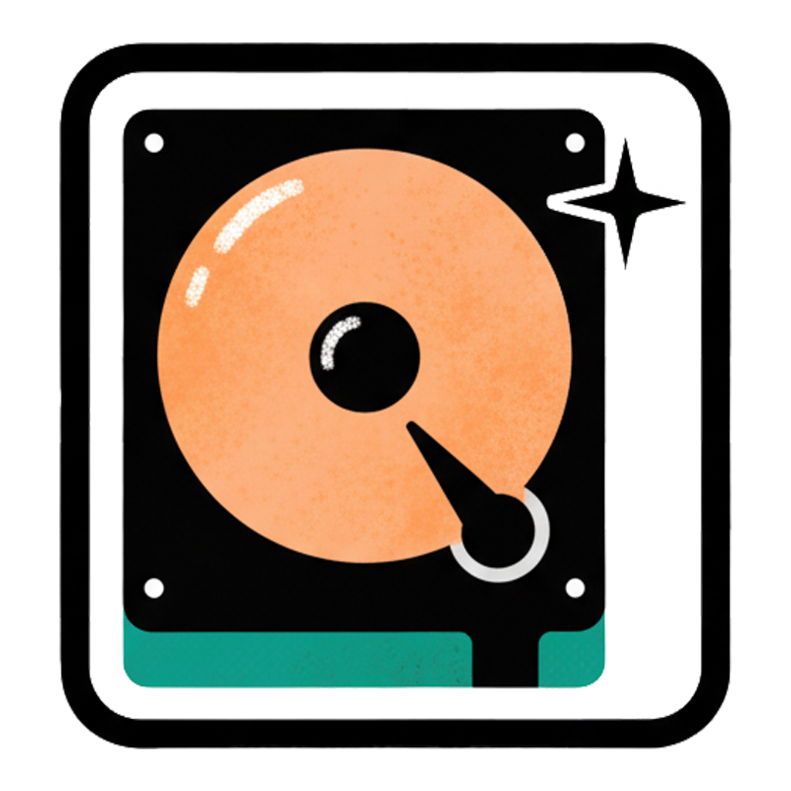

[](https://github.com/mciwing/data-campus)


[](https://creativecommons.org/licenses/by-nc-sa/4.0/)

<div align="center">
  <h1><b>DATA CAMPUS</b></h1>
  
  <hr>
</div>

This site offers a variety of courses focused on Data, including:

- Data Basics
- Databases with PostgreSQL
- Excel

📚 Visit the site [here](https://learn-data.at)!

## Local development

Eager to contribute or develop locally? Here's how to get started!

### 1️⃣ Install `uv`

This site is built using the `uv` package manager. If you haven't installed it
yet, navigate to their [installation guide](https://docs.astral.sh/uv/getting-started/installation/)
and follow the instructions.

### 2️⃣ Project setup

Install all dependencies with:

```bash
uv sync
```

### 3️⃣ Serve the site

Lastly, serve the site locally with:

```bash
uv run mkdocs serve
```

Visit `localhost:8000` in your browser to view the site. 🎉

### 4️⃣ Write content

Now, you can start writing content. While the site is served locally, any changes 
will automatically trigger a reload of the site in your browser.

> [!TIP]
> The sites content is housed in the `docs/` directory and is written in Markdown.
> For formatting reference, check out the [Material for MkDocs documentation](https://squidfunk.github.io/mkdocs-material/reference/).

## Contributions

Found a mistake, have an idea or want to report an issue? Contributions in any form are always welcome! 😊
