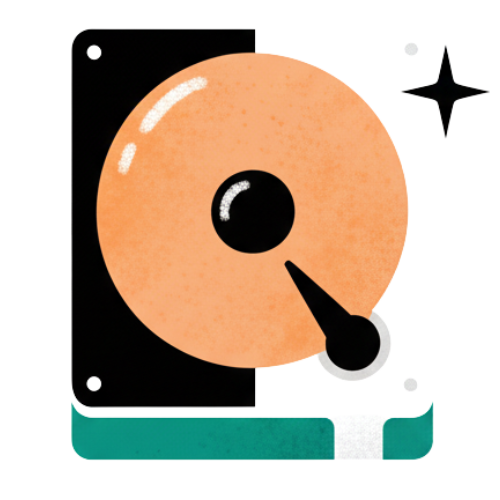

[](https://github.com/mciwing/data-campus)
[](https://zensical.org)


[](https://creativecommons.org/licenses/by-nc-sa/4.0/)

<div align="center">
  <h1><b>DATA CAMPUS</b></h1>
  
  <hr>
</div>

This site offers a variety of courses focused on Data, including:

- Data Basics
- Databases with PostgreSQL
- Excel

📚 Visit the site [here](https://learn-data.at)!

## Local development

Eager to contribute or develop locally? Here's how to get started!

> [!NOTE]
> The site is built with [Zensical](https://zensical.org) — the Rust-based
> successor to Material for MkDocs from the same team. The existing
> `mkdocs.yml` config is reused via Zensical's compatibility layer.

### 1️⃣ Install `uv`

This site uses the `uv` package manager. If you haven't installed it yet,
follow the [installation guide](https://docs.astral.sh/uv/getting-started/installation/).

### 2️⃣ Project setup

Install all dependencies with:

```bash
uv sync
```

### 3️⃣ Serve the site

Serve the site locally with live reload:

```bash
uv run zensical serve
```

Visit `localhost:8000` in your browser to view the site. 🎉

To produce a static build into `site/`:

```bash
uv run zensical build
```

### 4️⃣ Write content

While the site is served locally, any changes will automatically trigger a
reload in your browser.

> [!TIP]
> The site's content lives in `docs/` and is written in Markdown. Since
> Zensical is configuration-compatible with Material for MkDocs, the
> [Material for MkDocs reference](https://squidfunk.github.io/mkdocs-material/reference/)
> is still the right place for formatting and admonition syntax.

## Contributions

Found a mistake, have an idea or want to report an issue? Contributions in any form are always welcome! 😊
