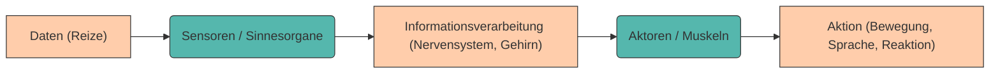
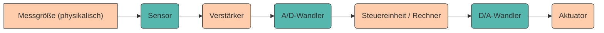

# Datenerfassung

## Wie erfassen wir Menschen Daten?

Ein wichtiges Merkmal aller Lebewesen ist es, **Daten aus der Umwelt zu erfassen**, sie als **Information zu verarbeiten** und daraus **Aktionen abzuleiten**.

    

Dieser Prozess läuft bei uns Menschen über unsere **Sinnesorgane** ab – sie sind unsere Sensoren zur Umwelt. Unsere Umgebung sendet fortlaufend Reize aus – in Form von Licht, Schall, Druck, Geruch oder chemischen Stoffen.
Diese Reize werden von den Sinneszellen aufgenommen, **in elektrische Signale umgewandelt** und anschließend vom Gehirn verarbeitet.

---

Die erfassten Daten liegen in ganz unterschiedlichen physikalischen Formen vor:

* **Elektromagnetische Signale** → Licht, Farbe, Wärme
* **Akustische Signale** → Sprache, Musik
* **Mechanische Signale** → Druck, Vibration, Berührung
* **Chemische Signale** → Geschmack, Geruch

Das Gehirn filtert diese Rohdaten, **reduziert sie auf das Wesentliche** und formt daraus **Information**, die bewusst wahrgenommen werden kann (vgl. Abschnitt [Von Daten zum Wissen](einfuehrung.md#von-daten-zum-wissen)).

---

???+ info "Datenmenge Sinnesorgange (nach Zimmermann, 1993)"
    Beim Menschen geschieht dieser Prozess der Datenverarbeitung meist unbewusst. Von den ca. **11,2 Mbit/s**, 
    die unsere Sinnesorgane aufnehmen, gelangen nur etwa **77 Bits/s** ins Bewusstsein 
    (≈ 0,01 ‰).

    

    <table role="table" aria-label="Sinnessysteme"
            style="width:100%; border-collapse:separate; border-spacing:0; border:1px solid #cfd8e3; border-radius:10px; overflow:hidden; font-family:system-ui,Segoe UI,Roboto,Arial,sans-serif;">
        <thead>
        <tr style="background:#009485; color:#fff;">
            <th style="text-align:left; padding:12px 14px; font-weight:700;">Sinnessystem</th>
            <th style="text-align:center; padding:12px 14px; font-weight:700;">Datenrate [bit/s]</th>
            <th style="text-align:center; padding:12px 14px; font-weight:700;">Bewusstsein [bit/s]</th>
        </tr>
        </thead>
        <tbody>
        <tr>
            <td style="background:#00948511; text-align:left; padding:10px 14px;">Augen</td>
            <td style="text-align:center; padding:10px 14px;">10 000 000</td>
            <td style="text-align:center; padding:10px 14px;">40</td>
        </tr>
        <tr>
            <td style="background:#00948511; text-align:left; padding:10px 14px;">Ohren</td>
            <td style="text-align:center; padding:10px 14px;">100 000</td>
            <td style="text-align:center; padding:10px 14px;">30</td>
        </tr>
        <tr>
            <td style="background:#00948511; text-align:left; padding:10px 14px;">Haut</td>
            <td style="text-align:center; padding:10px 14px;">1 000 000</td>
            <td style="text-align:center; padding:10px 14px;">5</td>
        </tr>
        <tr>
            <td style="background:#00948511; text-align:left; padding:10px 14px;">Geschmack</td>
            <td style="text-align:center; padding:10px 14px;">1 000</td>
            <td style="text-align:center; padding:10px 14px;">1</td>
        </tr>
        <tr>
            <td style="background:#00948511; text-align:left; padding:10px 14px;">Geruch</td>
            <td style="text-align:center; padding:10px 14px;">100 000</td>
            <td style="text-align:center; padding:10px 14px;">1</td>
        </tr>
        <tr style="background:#00948533; font-weight:700;">
            <td style="text-align:left; padding:10px 14px;">Gesamt</td>
            <td style="text-align:center; padding:10px 14px;">11 201 000</td>
            <td style="text-align:center; padding:10px 14px;">77</td>
        </tr>
        </tbody>
    </table>

    

        Quelle: nach Zimmermann 1993
    

    

  
    An einem Tag mit 16 Stunden Helligkeit ergibt sich eine Datenmenge von ~72 GB alleine durch das menschliche Auge. Bewusst wahrgenommen werden allerdings nur ~288 kB.
 
    Zum Vergleich: die geschätzte Speicherkapazität unseres Gehirns beträgt ~60 TB  

 

> **💡 Reflexion:**
> Unser Gehirn agiert wie ein intelligentes Filtersystem – es verwirft 99,99 % aller Daten.
> Auch in der Informatik ist das Ziel, **relevante Informationen aus großen Datenmengen** zu extrahieren – ein Konzept, das der biologischen Wahrnehmung erstaunlich ähnelt.

---

## Die Messkette

Technische Systeme funktionieren nach einem ganz ähnlichen Prinzip wie unser Körper:
Auch sie benötigen eine **Kette von Komponenten**, um reale, analoge Größen in digitale Daten umzuwandeln, zu verarbeiten und daraus Aktionen abzuleiten.
Diese Kette wird als **Messkette**  bezeichnet und kann vereinfacht wiefolgt dargestellt werden.

 

---

### Sensor

Der **Sensor** ist das "Sinnesorgan" einer Maschine.
Er ist die **Schnittstelle zwischen physikalischer Welt und digitalem System**.
Er wandelt eine physikalische Größe (z. B. Temperatur, Druck, Licht) in ein elektrisches Signal um.

> Beispiel:
> Ein PT100-Temperatursensor misst nicht direkt die Temperatur,
> sondern deren Einfluss auf den elektrischen Widerstand.

Da Sensorsignale oft **sehr klein oder nichtlinear** sind, müssen sie im nächsten Schritt **verstärkt** werden.

---

### Verstärker

Ein **Verstärker** erhöht die Leistung des Sensorsignals und kann gleichzeitig **Nichtlinearitäten ausgleichen**.
Er sorgt also dafür, dass das Signal robust und auswertbar wird.

> Herausforderung:
> Verstärker benötigen eine eigene Stromversorgung, verursachen zusätzliche Kosten und müssen kalibriert werden.
> **Transmitter** kombinieren häufig Sensor und Verstärker und liefern ein normiertes Signal (z. B. 4–20 mA).

---

### Analog-Digital-Wandler (A/D-Wandler)

Unsere reale Welt ist **analog**, aber Computer verarbeiten **digitale Daten**.
Daher wird ein **A/D-Wandler (ADC)** benötigt, der analoge Signale in digitale Werte umwandelt.

> Wichtig: Jede Digitalisierung ist mit **Informationsverlust** verbunden.
> Entscheidend sind die Parameter:
>
> * **Auflösung** (z. B. 12 Bit, 16 Bit)
> * **Abtastrate** (z. B. 1 kHz, 1 MS/s)
> * **Leistungsaufnahme**

---

### Digitale Eingänge

Manche Systeme benötigen keinen A/D-Wandler, weil die Daten bereits **digital** vorliegen.
Das gilt z. B. für Daten aus einer **Datenbank** (Kundenverhalten, Umsätze) oder für **digitale Sensoren** (z. B. Inkrementalgeber, I²C-Sensoren).

---

### Elektronische Steuereinheit (ECU)

In der Steuereinheit findet die **Datenverarbeitung** statt – hier kommen Methoden der **Data Science**, **Regelungstechnik** oder **Signalverarbeitung** zum Einsatz.
Das kann ein **Computer**, ein **Mikrocontroller**, ein **FPGA** oder sogar ein neuronales Netzwerk sein.

---

### Digital-Analog-Wandler (D/A-Wandler)

Wenn das System mit der analogen Welt interagieren soll (z. B. Anzeige, Motor, Lautsprecher), muss das digitale Signal wieder in ein **analoges Signal** umgewandelt werden.
Dazu dient der **D/A-Wandler (DAC)**.

---

### Aktor

Der **Aktor** setzt elektrische Signale und Energie in physikalische Bewegung oder Zustandsänderung um.
Er ist also das Gegenstück zum Sensor.
Beispiele sind **Motoren, LEDs, Heizungen oder Roboterarme**.

---

> **📘 Zusammenfassung der Messkette**
>
> | Stufe       | Aufgabe                                   | Beispiel             |
> | ----------- | ----------------------------------------- | -------------------- |
> | Sensor      | Physikalische Größe → Elektrisches Signal | PT100, Mikrofon      |
> | Verstärker  | Signalverstärkung, Linearität             | Operationsverstärker |
> | A/D-Wandler | Analog → Digital                          | ADC, Mikrocontroller |
> | Steuerung   | Verarbeitung & Analyse                    | Computer, FPGA       |
> | D/A-Wandler | Digital → Analog                          | DAC, PWM-Ausgang     |
> | Aktor       | Elektrisches Signal → Bewegung            | Motor, Ventil        |

---

## Vergleich Mensch ↔ Maschine

| Biologisches System            | Technisches System                  |
| ------------------------------ | ----------------------------------- |
| Sinnesorgane (Auge, Ohr, Haut) | Sensoren                            |
| Nervensystem                   | Signalverarbeitung, Mikrocontroller |
| Gehirn                         | Rechner / Control Unit              |
| Muskeln                        | Aktoren                             |
| Wahrnehmung                    | Datenauswertung                     |

---

> **💡 Fazit:**
> Sowohl biologische als auch technische Systeme funktionieren nach demselben Prinzip:
> **Daten aufnehmen – verarbeiten – reagieren.**
> In der Informatik nennen wir das den Prozess der **Datenerfassung**, der die Grundlage jeder Datenanalyse bildet.

---

### 🧩 Aufgaben

1. Beschreibe die Schritte der menschlichen Datenerfassung anhand deiner Sinne.
   Welche Daten werden aufgenommen, welche bewusst verarbeitet?

2. Zeichne die **technische Messkette** für ein Beispiel deiner Wahl
   (z. B. Wetterstation, Smartwatch, autonomes Auto).

3. Erkläre, an welcher Stelle der Messkette die größten Informationsverluste auftreten können.

---