# Datenerfassung

Im vorherigen Kapitel haben wir uns mit **Daten auf semantischer Ebene** beschäftigt – mit ihrer **Bedeutung, Struktur und Klassifikation**. Wir haben gelernt, was Daten sind, wie sie sich von Information und Wissen unterscheiden, und welche verschiedenen Arten von Daten es gibt (qualitativ, quantitativ, nominal, ordinal, ...).

Doch wie entstehen Daten überhaupt? Woher kommen die **23,5°C**, die wir als Temperaturmesswert ablesen? Wie wird aus einem **physikalischen Reiz** (Licht, Schall, Druck) eine **digitale Information**, mit der ein Computer arbeiten kann?

In diesem Kapitel wechseln wir die Perspektive und betrachten den **technischen Prozess der Datenerfassung** – die erste Stufe im Lebenszyklus von Daten. Wir schauen uns an, wie **biologische Systeme** (der Mensch) und **technische Systeme** (Sensoren, Computer) Daten erfassen – und werden dabei erstaunliche Parallelen entdecken.

---

## Wie erfassen wir Menschen Daten?

Ein wichtiges Merkmal aller Lebewesen ist es, **Daten aus der Umwelt zu erfassen**, sie als **Information zu verarbeiten** und daraus **Aktionen abzuleiten**.

    

Dieser Prozess läuft bei uns Menschen über unsere **Sinnesorgane** ab – sie sind unsere Sensoren zur Umwelt. Unsere Umgebung sendet fortlaufend Reize aus – in Form von Licht, Schall, Druck, Geruch oder chemischen Stoffen.
Diese Reize werden von den Sinneszellen aufgenommen, **in elektrische Signale umgewandelt** und anschließend vom Gehirn verarbeitet.

---

Die erfassten Daten liegen in ganz unterschiedlichen physikalischen Formen vor:

* **Elektromagnetische Signale** → Licht, Farbe, Wärme
* **Akustische Signale** → Sprache, Musik
* **Mechanische Signale** → Druck, Vibration, Berührung
* **Chemische Signale** → Geschmack, Geruch

Das Gehirn filtert diese Rohdaten, **reduziert sie auf das Wesentliche** und formt daraus **Information**, die bewusst wahrgenommen werden kann (vgl. Abschnitt [Von Daten zum Wissen](einfuehrung.md#von-daten-zum-wissen)).

---

???+ info "Datenmenge Sinnesorgange (nach Zimmermann, 1993)"
    Beim Menschen geschieht dieser Prozess der Datenverarbeitung meist unbewusst. Von den ca. **11,2 Mbit/s**, 
    die unsere Sinnesorgane aufnehmen, gelangen nur etwa **77 Bits/s** ins Bewusstsein 
    (≈ 0,01 ‰).

    

    <table role="table" aria-label="Sinnessysteme"
            style="width:100%; border-collapse:separate; border-spacing:0; border:1px solid #cfd8e3; border-radius:10px; overflow:hidden; font-family:system-ui,Segoe UI,Roboto,Arial,sans-serif;">
        <thead>
        <tr style="background:#009485; color:#fff;">
            <th style="text-align:left; padding:12px 14px; font-weight:700;">Sinnessystem</th>
            <th style="text-align:center; padding:12px 14px; font-weight:700;">Datenrate [bit/s]</th>
            <th style="text-align:center; padding:12px 14px; font-weight:700;">Bewusstsein [bit/s]</th>
        </tr>
        </thead>
        <tbody>
        <tr>
            <td style="background:#00948511; text-align:left; padding:10px 14px;">Augen</td>
            <td style="text-align:center; padding:10px 14px;">10 000 000</td>
            <td style="text-align:center; padding:10px 14px;">40</td>
        </tr>
        <tr>
            <td style="background:#00948511; text-align:left; padding:10px 14px;">Ohren</td>
            <td style="text-align:center; padding:10px 14px;">100 000</td>
            <td style="text-align:center; padding:10px 14px;">30</td>
        </tr>
        <tr>
            <td style="background:#00948511; text-align:left; padding:10px 14px;">Haut</td>
            <td style="text-align:center; padding:10px 14px;">1 000 000</td>
            <td style="text-align:center; padding:10px 14px;">5</td>
        </tr>
        <tr>
            <td style="background:#00948511; text-align:left; padding:10px 14px;">Geschmack</td>
            <td style="text-align:center; padding:10px 14px;">1 000</td>
            <td style="text-align:center; padding:10px 14px;">1</td>
        </tr>
        <tr>
            <td style="background:#00948511; text-align:left; padding:10px 14px;">Geruch</td>
            <td style="text-align:center; padding:10px 14px;">100 000</td>
            <td style="text-align:center; padding:10px 14px;">1</td>
        </tr>
        <tr style="background:#00948533; font-weight:700;">
            <td style="text-align:left; padding:10px 14px;">Gesamt</td>
            <td style="text-align:center; padding:10px 14px;">11 201 000</td>
            <td style="text-align:center; padding:10px 14px;">77</td>
        </tr>
        </tbody>
    </table>

    

        Quelle: nach Zimmermann 1993
    

    

  
    An einem Tag mit 16 Stunden Helligkeit ergibt sich eine Datenmenge von ~72 GB alleine durch das menschliche Auge. Bewusst wahrgenommen werden allerdings nur ~288 kB.
 
    Zum Vergleich: die geschätzte Speicherkapazität unseres Gehirns beträgt ~60 TB  

 

> **💡 Reflexion:**
> Unser Gehirn agiert wie ein intelligentes Filtersystem – es verwirft 99,99 % aller Daten.
> Auch in der Informatik ist das Ziel, **relevante Informationen aus großen Datenmengen** zu extrahieren – ein Konzept, das der biologischen Wahrnehmung erstaunlich ähnelt.

---

## Die Messkette

Technische Systeme funktionieren nach einem ganz ähnlichen Prinzip wie unser Körper:
Auch sie benötigen eine **Kette von Komponenten**, um reale, analoge Größen in digitale Daten umzuwandeln, zu verarbeiten und daraus Aktionen abzuleiten.
Diese Kette wird als **Messkette**  bezeichnet und kann vereinfacht wiefolgt dargestellt werden.

```mermaid
flowchart LR
    A[Messgröße #40;physikalisch#41;]:::peach --> B(Sensor):::teal
    B --> C(Verstärker):::peach
    C --> D(A/D-Wandler):::teal
    D --> E(Steuereinheit / Rechner):::peach
    E --> F(D/A-Wandler):::teal
    F --> G(Aktuator):::peach

    classDef peach fill:#FFB482aa,stroke:#333,stroke-width:1px;
    classDef teal fill:#009485aa,stroke:#333,stroke-width:1px;
```

 

---

- Der **Sensor** ist das "Sinnesorgan" einer Maschine.
Er ist die **Schnittstelle zwischen physikalischer Welt und digitalem System**.
Er wandelt eine physikalische Größe (z. B. Temperatur, Druck, Licht) in ein elektrisches Signal um. Da Sensorsignale oft **sehr klein oder nichtlinear** sind, müssen sie im nächsten Schritt **verstärkt** werden.
- Ein **Verstärker** erhöht die Leistung des Sensorsignals und kann gleichzeitig **Nichtlinearitäten ausgleichen**. Er sorgt also dafür, dass das Signal robust und auswertbar wird.
- Unsere reale Welt ist **analog**, aber Computer verarbeiten **digitale Daten**.
Daher wird ein **A/D-Wandler (ADC)** benötigt, der analoge Signale in digitale Werte umwandelt.
> 📘 **Merke**: Manche Systeme benötigen keinen A/D-Wandler, weil die Daten bereits **digital** vorliegen. Das gilt z. B. für Daten aus einer **Datenbank** (Kundenverhalten, Umsätze) oder für **digitale Sensoren** (z. B. Inkrementalgeber, I²C-Sensoren).
- In der Steuereinheit findet die **Datenverarbeitung** statt – hier kommen Methoden der **Data Science**, **Regelungstechnik** oder **Signalverarbeitung** zum Einsatz.
Das kann ein **Computer**, ein **Mikrocontroller**, ein **FPGA** oder sogar ein neuronales Netzwerk sein.
- Wenn das System mit der analogen Welt interagieren soll (z. B. Anzeige, Motor, Lautsprecher), muss das digitale Signal wieder in ein **analoges Signal** umgewandelt werden. Dazu dient der **D/A-Wandler (DAC)**.
- Der **Aktor** setzt elektrische Signale und Energie in physikalische Bewegung oder Zustandsänderung um.
Er ist also das Gegenstück zum Sensor.
Beispiele sind **Motoren, LEDs, Heizungen oder Roboterarme**.

---

## Beispiel aus der Praxis

Ein **selbstfahrendes Auto** nutzt eine Vielzahl von Sensoren, um seine Umgebung zu erfassen:

**Sensoren und ihre Rolle:**

- **Kamera**: Erkennung von Fahrbahnmarkierungen, Verkehrsschildern, Fußgängern
- **Lidar**: 3D-Abstandsmessung zur Umgebung (Punktwolke)
- **Radar**: Geschwindigkeit und Entfernung anderer Fahrzeuge
- **Ultraschall**: Nahbereichserkennung (Einparken)
- **GPS + IMU**: Position und Bewegung des Fahrzeugs

Alle Daten werden **fusioniert** und von **neuronalen Netzen** analysiert, um Entscheidungen wie „Bremsen", „Ausweichen" oder „Beschleunigen" zu treffen.

---

## Vergleich Mensch 👱🏼 ↔ Maschine 🤖

<table role="table" aria-label="Vergleich Mensch Maschine"
        style="width:100%; border-collapse:separate; border-spacing:0; border:1px solid #cfd8e3; border-radius:10px; overflow:hidden; font-family:system-ui,Segoe UI,Roboto,Arial,sans-serif;">
    <thead>
    <tr style="background:#009485; color:#fff;">
        <th style="text-align:left; padding:12px 14px; font-weight:700;">Biologisches System</th>
        <th style="text-align:left; padding:12px 14px; font-weight:700;">Technisches System</th>
    </tr>
    </thead>
    <tbody>
    <tr>
        <td style="background:#00948511; text-align:left; padding:10px 14px;">Sinnesorgane (Auge, Ohr, Haut)</td>
        <td style="text-align:left; padding:10px 14px;">Sensoren</td>
    </tr>
    <tr>
        <td style="background:#00948511; text-align:left; padding:10px 14px;">Nervensystem</td>
        <td style="text-align:left; padding:10px 14px;">Signalverarbeitung, Kabel</td>
    </tr>
    <tr>
        <td style="background:#00948511; text-align:left; padding:10px 14px;">Gehirn</td>
        <td style="text-align:left; padding:10px 14px;">Rechner / Control Unit</td>
    </tr>
    <tr>
        <td style="background:#00948511; text-align:left; padding:10px 14px;">Muskeln</td>
        <td style="text-align:left; padding:10px 14px;">Aktoren</td>
    </tr>
    <tr>
        <td style="background:#00948511; text-align:left; padding:10px 14px;">Wahrnehmung</td>
        <td style="text-align:left; padding:10px 14px;">Datenauswertung</td>
    </tr>
    </tbody>
</table>

---

> **💡 Fazit:**
> Sowohl biologische als auch technische Systeme funktionieren nach demselben Prinzip:
> **Daten aufnehmen – verarbeiten – reagieren.**
> In der Informatik nennen wir das den Prozess der **Datenerfassung**, der die Grundlage jeder Datenanalyse bildet.

---

???+ question "Praxisaufgabe: Eigene Messkette analysieren"
    **Aufgabe**: Wähle ein technisches Gerät aus deinem Alltag (z.B. Smartphone, Fitness-Tracker, Kaffeemaschine, Spielkonsole) und analysiere:

    1. Welche **Sensoren** sind verbaut?
    2. Welche **physikalischen Größen** werden gemessen?
    3. Wie werden die Daten **verarbeitet**?
    4. Welche **Aktionen** werden ausgelöst?
    5. Wo findet **A/D-Wandlung** statt?

    Erstelle ein **Flussdiagramm** der Messkette analog zu den obigen Beispielen.

---

## Zusammenfassung 📌

- **Datenerfassung** ist ein fundamentaler Prozess, der sowohl bei biologischen als auch bei technischen Systemen stattfindet: **Daten aufnehmen – verarbeiten – reagieren**.
- Die **Messkette** ist das technische Pendant zur biologischen Datenerfassung und besteht aus: Sensor, Verstärker, A/D Wandler, Steuereinheit, D/A Wandler und Aktor.
- **Mensch und Maschine** funktionieren nach vergleichbaren Prinzipien: Sinnesorgane ↔ Sensoren, Nervensystem ↔ Signalverarbeitung, Gehirn ↔ Rechner, Muskeln ↔ Aktoren.
- Die **Qualität der Datenerfassung** bestimmt die Qualität der nachfolgenden Verarbeitung und Analyse – „Garbage in, Garbage out".
- Verschiedene **Sensortechnologien** ermöglichen die Erfassung unterschiedlicher physikalischer Größen: Temperatur, Druck, Licht, Schall, Beschleunigung, chemische Zusammensetzung.
- **Sensorfusion** kombiniert Daten aus mehreren Sensoren, um ein vollständigeres und zuverlässigeres Bild der Realität zu erhalten (z.B. autonome Fahrzeuge).

---

Im nächsten Kapitel schauen wir uns an, wie diese erfassten Daten **verarbeitet** werden – in welcher Form Computer intern mit Daten arbeiten und warum das **Binärsystem** die Basis aller digitalen Verarbeitung ist.
