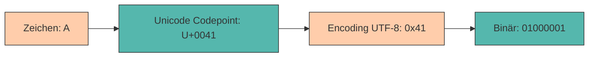

# Datenspeicherung

Im vorherigen Kapitel haben wir gelernt, wie Computer Daten in **binärer Form verarbeiten** - als Folgen von Nullen und Einsen. Doch wie werden diese Daten dauerhaft **gespeichert**? Wie wird aus einem abstrakten Bitmuster ein konkretes Bild, ein Text oder eine Musikdatei? Und welche **Technologien** nutzen wir, um diese Daten langfristig zu sichern?

In diesem Kapitel beantworten wir drei zentrale Fragen:

1. **Wie werden verschiedene Datentypen binär dargestellt?** (Bilder und Text)
2. **Welche Datentypen gibt es in der Programmierung?** (Primitive und komplexe Typen)
3. **Welche Speichertechnologien existieren?** (RAM, HDD, SSD, Cloud)

---

## Vom Bit zur Information - Wie werden Daten gespeichert?

Alle digitalen Daten - ob Zahlen, Texte, Bilder oder Videos - werden letztlich als **Folge von Bits** gespeichert. Die Kunst liegt darin, diese Bitfolgen so zu **strukturieren und interpretieren**, dass daraus sinnvolle Informationen entstehen.

<div style="text-align: center;">

<figcaption>Quelle: <a href="https://cns1.rc.fas.harvard.edu/wp-content/uploads/2016/09/CDDVDBluRay.png">Harvard University</a></figcaption>
</div>

Wir schauen uns nun an, wie unterschiedliche Datentypen binär dargestellt werden.

---

### Bilder

Ein digitales Bild besteht aus vielen kleinen **Bildpunkten (Pixeln)**, die in einem Raster angeordnet sind. Jeder Pixel wird durch eine **Zahlenfolge** beschrieben, die seine Farbe oder Helligkeit angibt.

---

**Schwarz-Weiß-Bilder (1 Bit pro Pixel)**

Stellen wir uns vor, wir haben ein Array von Lampen, die wir unabhängig voneinander ansteuern können. Es gibt zwei mögliche Zustände: **Lampe ein (weiß)** oder **Lampe aus (schwarz)**.

Genau so funktioniert ein Schwarz-Weiß-Bild: **Jeder Pixel wird durch 1 Bit beschrieben** - `0` für schwarz, `1` für weiß.

<div style="text-align: center">
    
</div>

???+ example "Minimalbeispiel: 1-Bit Bild"

    <div style="text-align: center">
        
    </div>

    ??? code "Python Code"
        ```python
        import cv2
        import matplotlib.pyplot as plt
        import numpy as np

        # Bild einlesen
        img = cv2.imread("logo.svg", cv2.IMREAD_COLOR)
        img = cv2.cvtColor(img, cv2.COLOR_BGR2RGB)

        # Nur einen Farbkanal verwenden (Blau)
        img1c = img[:, :, 2]

        # Schwellwert: alles < 128 = 0, alles >= 128 = 255
        img1c = np.where(img1c < 128, 0, 255)

        # Bild anzeigen
        plt.imshow(img1c, cmap="gray")
        plt.axis("off")
        plt.show()
        ```

---

**Farbbilder (3 Bit pro Pixel - RGB)**

Um **Farben** darzustellen, benötigen wir mehr als nur schwarz und weiß. Das gebräuchlichste Farbmodell ist **RGB** (Rot, Grün, Blau) - jede Farbe entsteht durch **Mischung** dieser drei Grundfarben.

Wenn wir **1 Bit pro Farbkanal** verwenden, ergeben sich **3 Bit pro Pixel** → $2^3 = 8$ verschiedene Farben.

<div style="text-align: center">
    
</div>

???+ example "Minimalbeispiel: 3-Bit RGB Bild"

    <div style="text-align: center">
        
    </div>

    ??? code "Python Code"
        ```python
        import cv2
        import matplotlib.pyplot as plt
        import numpy as np

        # Bild einlesen
        img = cv2.imread("logo.svg", cv2.IMREAD_COLOR)
        img = cv2.cvtColor(img, cv2.COLOR_BGR2RGB)

        # Schwellwert anwenden: alles < 128 = 0, alles >= 128 = 255
        img3c = np.where(img < 128, 0, 255)

        # Bild als RGB anzeigen
        plt.imshow(img3c)
        plt.axis("off")
        plt.show()
        ```

---

**True Color - 24 Bit pro Pixel**

Da unsere Welt sehr farbenfroh ist und wir uns nicht mit 8 Farben begnügen wollen, verwenden moderne Bildschirme **8 Bit pro Farbkanal** (= 1 Byte).

**24 Bit RGB** bedeutet:

- **8 Bit Rot** → 256 Stufen
- **8 Bit Grün** → 256 Stufen
- **8 Bit Blau** → 256 Stufen

**Gesamtzahl der darstellbaren Farben**: $256^3 = 16.777.216$ Farben!

<div style="text-align: center">
    
</div>

???+ example "Minimalbeispiel: 24-Bit RGB Bild"

    <div style="text-align: center">
        
    </div>

    ??? code "Python Code"
        ```python
        import cv2
        import matplotlib.pyplot as plt

        # Bild einlesen (volle Farbtiefe)
        img = cv2.imread("logo.svg", cv2.IMREAD_COLOR)
        img = cv2.cvtColor(img, cv2.COLOR_BGR2RGB)

        # Bild anzeigen
        plt.imshow(img)
        plt.axis("off")
        plt.show()
        ```

???+ tip "Hexadezimaldarstellung von Farben"
    Die Darstellung der 8 Bit pro Farbe erfolgt sehr häufig als **Hexadezimal**. Dabei können die 256 Stufen mit **zwei Hexadezimal-Ziffern** abgebildet werden. Häufig wird das `#`-Zeichen vorangestellt.

    **Beispiele:**

    - Dezimal: `(244, 155, 0)` entspricht in HEX: `#F49B00` (Orange)
    - Dezimal: `(0, 73, 131)` entspricht in HEX: `#004983` (Blau)

    Diese Notation kennst du vielleicht aus HTML/CSS oder Grafikprogrammen!

**Berechnung der Dateigröße:**

Ein Bild mit **1920 × 1080 Pixeln** (Full HD) benötigt bei 24 Bit Farbtiefe:

$$1920 \times 1080 \times 3 \text{ Byte} = 6.220.800 \text{ Byte} \approx 6{,}2 \text{ MB}$$

Das ist ohne Kompression! Durch **Bildkompression** (JPEG, PNG) lässt sich die Dateigröße erheblich reduzieren.

---

### Text

Nachdem wir uns die Speicherung von Bildern angesehen haben, schauen wir uns nun **Texte** an. Auch hier werden die Inhalte als **binäre Daten** gespeichert – aber wie wird aus einem Buchstaben eine Zahl?

**Die Herausforderung:** Ein Computer kennt nur Zahlen (Bits). Um Text zu speichern, brauchen wir eine **Abbildung von Zeichen auf Zahlen** – eine sogenannte **Zeichenkodierung**.

---

Bevor wir zu modernen Standards kommen, ein kurzer Blick zurück:

**ASCII (1963)** – Der erste weitverbreitete Standard:

- Kodiert **128 Zeichen** mit **7 Bit** (erweitert auf 8 Bit = 1 Byte)
- Enthält: Lateinische Buchstaben (A–Z, a–z), Ziffern (0–9), Sonderzeichen (!?.,;), Steuerzeichen (Zeilenumbruch, Tab)
- **Problem:** Keine Umlaute (ä, ö, ü), keine anderen Schriftsysteme (Kyrillisch, Arabisch, Chinesisch)

???+ example "Beispiel: ASCII-Kodierung"

    ```
    A → 65 (Dezimal) → 01000001 (Binär)
    B → 66 (Dezimal) → 01000010 (Binär)
    a → 97 (Dezimal) → 01100001 (Binär)
    ```

**Das Problem der Globalisierung:**

Mit der weltweiten Verbreitung von Computern brauchte man einen Standard, der **alle Schriftsysteme der Welt** abdeckt. Die Lösung: **Unicode**.

---

**Unicode** ist ein universeller Standard, der **jedem Schriftzeichen der Welt** eine eindeutige Nummer zuweist – unabhängig von Plattform, Programm oder Sprache.



**Unicode umfasst heute (Stand 2024):**

- **154.998 Zeichen** aus **161 Schriftsystemen**
- Latein, Kyrillisch, Griechisch, Arabisch, Hebräisch, Chinesisch, Japanisch, Koreanisch, ...
- Mathematische Symbole (∑, ∫, ∞)
- Pfeile und geometrische Formen (→, ◯, ▶)
- **Emojis** (😀, 🚀, ❤️, 🎉)

Jedes Zeichen erhält einen **Codepoint** – eine eindeutige Nummer in hexadezimaler Schreibweise:

<div style="text-align:center; max-width:760px; margin:16px auto;">
<table role="table" aria-label="Unicode Beispiele"
        style="width:100%; border-collapse:separate; border-spacing:0; border:1px solid #cfd8e3; border-radius:10px; overflow:hidden; font-family:system-ui,Segoe UI,Roboto,Arial,sans-serif;">
    <thead>
    <tr style="background:#009485; color:#fff;">
        <th style="text-align:center; padding:12px 14px; font-weight:700;">Zeichen</th>
        <th style="text-align:center; padding:12px 14px; font-weight:700;">Unicode Codepoint</th>
        <th style="text-align:left; padding:12px 14px; font-weight:700;">Beschreibung</th>
    </tr>
    </thead>
    <tbody>
    <tr>
        <td style="background:#00948511; text-align:center; padding:10px 14px; font-size:20px;">A</td>
        <td style="text-align:center; padding:10px 14px;"><code>U+0041</code></td>
        <td style="text-align:left; padding:10px 14px;">Lateinischer Großbuchstabe A</td>
    </tr>
    <tr>
        <td style="background:#00948511; text-align:center; padding:10px 14px; font-size:20px;">ü</td>
        <td style="text-align:center; padding:10px 14px;"><code>U+00FC</code></td>
        <td style="text-align:left; padding:10px 14px;">Lateinisches kleines u mit Umlaut</td>
    </tr>
    <tr>
        <td style="background:#00948511; text-align:center; padding:10px 14px; font-size:20px;">€</td>
        <td style="text-align:center; padding:10px 14px;"><code>U+20AC</code></td>
        <td style="text-align:left; padding:10px 14px;">Euro-Zeichen</td>
    </tr>
    <tr>
        <td style="background:#00948511; text-align:center; padding:10px 14px; font-size:20px;">中</td>
        <td style="text-align:center; padding:10px 14px;"><code>U+4E2D</code></td>
        <td style="text-align:left; padding:10px 14px;">Chinesisches Zeichen (Mitte)</td>
    </tr>
    <tr>
        <td style="background:#00948511; text-align:center; padding:10px 14px; font-size:20px;">😀</td>
        <td style="text-align:center; padding:10px 14px;"><code>U+1F600</code></td>
        <td style="text-align:left; padding:10px 14px;">Grinning Face Emoji</td>
    </tr>
    <tr>
        <td style="background:#00948511; text-align:center; padding:10px 14px; font-size:20px;">🚀</td>
        <td style="text-align:center; padding:10px 14px;"><code>U+1F680</code></td>
        <td style="text-align:left; padding:10px 14px;">Rocket Emoji</td>
    </tr>
    </tbody>
</table>
</div>

> **💡 Wichtig:** Unicode definiert nur die **Zuordnung von Zeichen zu Nummern** (Codepoints), aber **nicht**, wie diese Nummern als Bytes gespeichert werden. Dafür brauchen wir ein **Encoding**.

---

**UTF-8** (Unicode Transformation Format – 8 Bit) ist das heute am weitesten verbreitete **Encoding-Verfahren** für Unicode. Es wandelt Unicode-Codepoints in **Byte-Sequenzen** um.

**Besonderheit:** UTF-8 ist **variabel lang** – ein Zeichen kann **1 bis 4 Bytes** benötigen:

<div style="text-align:center; max-width:760px; margin:16px auto;">
<table role="table" aria-label="UTF-8 Struktur"
        style="width:100%; border-collapse:separate; border-spacing:0; border:1px solid #cfd8e3; border-radius:10px; overflow:hidden; font-family:system-ui,Segoe UI,Roboto,Arial,sans-serif;">
    <thead>
    <tr style="background:#009485; color:#fff;">
        <th style="text-align:left; padding:12px 14px; font-weight:700;">Codepoint-Bereich</th>
        <th style="text-align:center; padding:12px 14px; font-weight:700;">Bytes</th>
        <th style="text-align:left; padding:12px 14px; font-weight:700;">Beispiele</th>
    </tr>
    </thead>
    <tbody>
    <tr>
        <td style="background:#00948511; text-align:left; padding:10px 14px;"><code>U+0000</code> bis <code>U+007F</code></td>
        <td style="text-align:center; padding:10px 14px;">1 Byte</td>
        <td style="text-align:left; padding:10px 14px;">ASCII-Zeichen: A–Z, a–z, 0–9, !?.,;</td>
    </tr>
    <tr>
        <td style="background:#00948511; text-align:left; padding:10px 14px;"><code>U+0080</code> bis <code>U+07FF</code></td>
        <td style="text-align:center; padding:10px 14px;">2 Bytes</td>
        <td style="text-align:left; padding:10px 14px;">Lateinische Erweiterungen: ä, ö, ü, é, ñ, ß</td>
    </tr>
    <tr>
        <td style="background:#00948511; text-align:left; padding:10px 14px;"><code>U+0800</code> bis <code>U+FFFF</code></td>
        <td style="text-align:center; padding:10px 14px;">3 Bytes</td>
        <td style="text-align:left; padding:10px 14px;">Die meisten Zeichen: €, ©, 中 (Chinesisch), ∑</td>
    </tr>
    <tr>
        <td style="background:#00948511; text-align:left; padding:10px 14px;"><code>U+10000</code> bis <code>U+10FFFF</code></td>
        <td style="text-align:center; padding:10px 14px;">4 Bytes</td>
        <td style="text-align:left; padding:10px 14px;">Emojis, historische Schriften: 😀, 🚀, 𝕳 (Math)</td>
    </tr>
    </tbody>
</table>
</div>

**Warum UTF-8 so erfolgreich ist:**

- **Abwärtskompatibel zu ASCII** – ASCII-Texte sind gleichzeitig gültige UTF-8-Texte
- **Platzsparend** – Englische Texte benötigen nur 1 Byte pro Zeichen
- **Selbstsynchronisierend** – Man kann mitten im Text einsteigen und die Zeichengrenzen erkennen
- **Weltweit einsetzbar** – Alle Sprachen, Symbole und Emojis darstellbar

---
???+ example "Unicode & UTF-8 Encoding"

    - `A` $\xrightarrow{\text{Codepoint}}$ `U+0041` $\xrightarrow{\text{UTF-8}}$ `41` (1 Byte)
    - `€` $\xrightarrow{\text{Codepoint}}$ `U+20AC` $\xrightarrow{\text{UTF-8}}$ `E2 82 AC` (3 Bytes)
    - `🙂` $\xrightarrow{\text{Codepoint}}$ `U+1F642` $\xrightarrow{\text{UTF-8}}$ `F0 9F 99 82` (4 Bytes)

    ??? code "Python Code"
        ```python
        s = "A€🙂"  # Mix aus ASCII, Symbol und Emoji

        # Codepoints (Unicode)
        for ch in s:
            print(f"{ch} -> U+{ord(ch):04X}")

        # Gleiche Zeichen in verschiedenen Encodings
        encodings = ["ascii", "latin-1", "utf-8", "utf-16-le", "utf-32-le"]
        for enc in encodings:
            try:
                b = s.encode(enc)
                print(f"{enc:10s} -> {len(b):2d} Bytes -> {b.hex(' ')}")
            except UnicodeEncodeError as e:
                print(f"{enc:10s} -> NICHT darstellbar")
        ```

> **💡 Fazit:** UTF-8 ist **effizienter** als UTF-16 und UTF-32 für Texte mit lateinischen Zeichen und gleichzeitig **universell einsetzbar** für alle Sprachen.

---

## Datentypen in der Programmierung

Nachdem wir nun wissen, wie verschiedene Datenarten binär gespeichert werden, schauen wir uns an, welche **Datentypen** in der Programmierung verwendet werden.

> **💡 Wichtig:** Die verfügbaren Datentypen und ihre Eigenschaften **hängen stark von der Programmiersprache ab**. Jede Sprache hat ihre eigenen Typsysteme mit unterschiedlichen Regeln, Größen und Verhaltensweisen.

In weiterer Folge wollen wir das ganze anhand der Programmiersprache **Python** erklären - einer der wichtigsten Sprachen für Data Science und maschinelles Lernen. Im Gegensatz zu Sprachen wie Java oder C++ ist **Python dynamisch typisiert** - der Datentyp wird zur Laufzeit automatisch ermittelt. Dennoch arbeitet Python intern mit denselben binären Repräsentationen.

### Grundlegende Datentypen in Python

Python bietet mehrere **eingebaute Datentypen**, die die Grundlage jeder Programmierung bilden. Diese Typen werden automatisch zugewiesen, sobald du einen Wert einer Variable zuweist.

<div style="text-align:center; max-width:860px; margin:16px auto;">
<table role="table" aria-label="Python Datentypen"
        style="width:100%; border-collapse:separate; border-spacing:0; border:1px solid #cfd8e3; border-radius:10px; overflow:hidden; font-family:system-ui,Segoe UI,Roboto,Arial,sans-serif;">
    <thead>
    <tr style="background:#009485; color:#fff;">
        <th style="text-align:left; padding:12px 14px; font-weight:700;">Datentyp</th>
        <th style="text-align:center; padding:12px 14px; font-weight:700;">Python-Typ</th>
        <th style="text-align:left; padding:12px 14px; font-weight:700;">Beispiel</th>
        <th style="text-align:left; padding:12px 14px; font-weight:700;">Verwendung</th>
    </tr>
    </thead>
    <tbody>
    <tr>
        <td style="background:#00948511; text-align:left; padding:10px 14px;"><strong>Boolean</strong></td>
        <td style="text-align:center; padding:10px 14px;"><code>bool</code></td>
        <td style="text-align:left; padding:10px 14px;"><code>True</code>, <code>False</code></td>
        <td style="text-align:left; padding:10px 14px;">Wahrheitswerte, Bedingungen</td>
    </tr>
    <tr>
        <td style="background:#00948511; text-align:left; padding:10px 14px;"><strong>Ganzzahl</strong></td>
        <td style="text-align:center; padding:10px 14px;"><code>int</code></td>
        <td style="text-align:left; padding:10px 14px;"><code>42</code>, <code>-17</code>, <code>1000000</code></td>
        <td style="text-align:left; padding:10px 14px;">Ganze Zahlen (beliebige Größe!)</td>
    </tr>
    <tr>
        <td style="background:#00948511; text-align:left; padding:10px 14px;"><strong>Fließkommazahl</strong></td>
        <td style="text-align:center; padding:10px 14px;"><code>float</code></td>
        <td style="text-align:left; padding:10px 14px;"><code>3.14</code>, <code>-0.001</code>, <code>2.5e10</code></td>
        <td style="text-align:left; padding:10px 14px;">Dezimalzahlen, wissenschaftliche Notation</td>
    </tr>
    <tr>
        <td style="background:#00948511; text-align:left; padding:10px 14px;"><strong>Komplexe Zahl</strong></td>
        <td style="text-align:center; padding:10px 14px;"><code>complex</code></td>
        <td style="text-align:left; padding:10px 14px;"><code>3+4j</code>, <code>2.5-1.5j</code></td>
        <td style="text-align:left; padding:10px 14px;">Komplexe Zahlen (Mathematik, Physik)</td>
    </tr>
    <tr>
        <td style="background:#00948511; text-align:left; padding:10px 14px;"><strong>Zeichenkette</strong></td>
        <td style="text-align:center; padding:10px 14px;"><code>str</code></td>
        <td style="text-align:left; padding:10px 14px;"><code>"Hallo"</code>, <code>'Python'</code>, <code>"😀"</code></td>
        <td style="text-align:left; padding:10px 14px;">Text, Zeichen, Emojis</td>
    </tr>
    <tr>
        <td style="background:#00948511; text-align:left; padding:10px 14px;"><strong>Bytes</strong></td>
        <td style="text-align:center; padding:10px 14px;"><code>bytes</code></td>
        <td style="text-align:left; padding:10px 14px;"><code>b'hello'</code>, <code>b'\x00\xFF'</code></td>
        <td style="text-align:left; padding:10px 14px;">Binärdaten, Dateien, Netzwerk</td>
    </tr>
    <tr>
        <td style="background:#00948511; text-align:left; padding:10px 14px;"><strong>None</strong></td>
        <td style="text-align:center; padding:10px 14px;"><code>NoneType</code></td>
        <td style="text-align:left; padding:10px 14px;"><code>None</code></td>
        <td style="text-align:left; padding:10px 14px;">Fehlender oder undefinierter Wert</td>
    </tr>
    </tbody>
</table>
</div>

???+ tip "Python's dynamische Typisierung"
    Im Gegensatz zu Sprachen wie Java oder C++ musst du in Python **keine Datentypen deklarieren**. Python erkennt automatisch, welchen Typ eine Variable hat:

    ```python
    x = 42          # int
    y = 3.14        # float
    name = "Alice"  # str
    is_valid = True # bool
    ```

    Du kannst den Typ jederzeit mit `type()` überprüfen:

    ```python
    print(type(x))  # <class 'int'>
    ```

???+ example "Besonderheit: Python `int` hat unbegrenzte Größe"

    Anders als in vielen anderen Sprachen (Java, C++, C#) hat Python's `int` **keine feste Größe**. Python kann **beliebig große Ganzzahlen** darstellen - nur begrenzt durch den verfügbaren Arbeitsspeicher!

    ```python
    # In Java würde dies zu einem Überlauf führen
    weltbevoelkerung = 8000000000  # 8 Milliarden - kein Problem

    # Selbst gigantische Zahlen sind möglich
    factorial_100 = 93326215443944152681699238856266700490715968264381621468592963895217599993229915608941463976156518286253697920827223758251185210916864000000000000000000000000

    # Python verarbeitet das problemlos
    print(2**1000)  # Eine Zahl mit über 300 Stellen!
    ```

    **Hintergrund:** Python verwendet intern eine **variable Anzahl von Bytes** für `int`, je nach Größe der Zahl. Kleine Zahlen (< 256) werden optimiert gespeichert.

---

### Container-Datentypen

Neben den grundlegenden Datentypen bietet Python **Container**, die mehrere Werte speichern können:

<div style="text-align:center; max-width:860px; margin:16px auto;">
<table role="table" aria-label="Python Container-Typen"
        style="width:100%; border-collapse:separate; border-spacing:0; border:1px solid #cfd8e3; border-radius:10px; overflow:hidden; font-family:system-ui,Segoe UI,Roboto,Arial,sans-serif;">
    <thead>
    <tr style="background:#009485; color:#fff;">
        <th style="text-align:left; padding:12px 14px; font-weight:700;">Container-Typ</th>
        <th style="text-align:center; padding:12px 14px; font-weight:700;">Python-Typ</th>
        <th style="text-align:left; padding:12px 14px; font-weight:700;">Eigenschaften</th>
        <th style="text-align:left; padding:12px 14px; font-weight:700;">Beispiel</th>
    </tr>
    </thead>
    <tbody>
    <tr>
        <td style="background:#00948511; text-align:left; padding:10px 14px;"><strong>Liste</strong></td>
        <td style="text-align:center; padding:10px 14px;"><code>list</code></td>
        <td style="text-align:left; padding:10px 14px;">Geordnet, veränderbar, Duplikate erlaubt</td>
        <td style="text-align:left; padding:10px 14px;"><code>[1, 2, 3]</code></td>
    </tr>
    <tr>
        <td style="background:#00948511; text-align:left; padding:10px 14px;"><strong>Tupel</strong></td>
        <td style="text-align:center; padding:10px 14px;"><code>tuple</code></td>
        <td style="text-align:left; padding:10px 14px;">Geordnet, <strong>unveränderbar</strong>, Duplikate erlaubt</td>
        <td style="text-align:left; padding:10px 14px;"><code>(1, 2, 3)</code></td>
    </tr>
    <tr>
        <td style="background:#00948511; text-align:left; padding:10px 14px;"><strong>Menge</strong></td>
        <td style="text-align:center; padding:10px 14px;"><code>set</code></td>
        <td style="text-align:left; padding:10px 14px;">Ungeordnet, veränderbar, <strong>keine Duplikate</strong></td>
        <td style="text-align:left; padding:10px 14px;"><code>{1, 2, 3}</code></td>
    </tr>
    <tr>
        <td style="background:#00948511; text-align:left; padding:10px 14px;"><strong>Dictionary</strong></td>
        <td style="text-align:center; padding:10px 14px;"><code>dict</code></td>
        <td style="text-align:left; padding:10px 14px;">Schlüssel-Wert-Paare, veränderbar</td>
        <td style="text-align:left; padding:10px 14px;"><code>{"name": "Alice"}</code></td>
    </tr>
    </tbody>
</table>
</div>

???+ example "Beispiele: Container in Python"

    **Liste** - die vielseitigste Datenstruktur:
    ```python
    zahlen = [1, 2, 3, 4, 5]
    zahlen.append(6)        # Hinzufügen
    zahlen[0] = 10          # Ändern
    print(zahlen)           # [10, 2, 3, 4, 5, 6]
    ```

    **Tupel** - unveränderlich, ideal für feste Werte:
    ```python
    koordinaten = (52.52, 13.405)  # Berlin (Lat, Lon)
    # koordinaten[0] = 50  # ❌ Fehler! Tupel sind unveränderbar
    ```

    **Set** - automatisch eindeutig:
    ```python
    farben = {"rot", "grün", "blau", "rot"}
    print(farben)  # {'rot', 'grün', 'blau'} - Duplikat entfernt
    ```

    **Dictionary** - Key-Value-Paare:
    ```python
    person = {
        "name": "Alice",
        "alter": 30,
        "stadt": "Berlin"
    }
    print(person["name"])  # Alice
    ```

---

## Speichertechnologien

Nachdem wir wissen, **wie Daten binär dargestellt werden**, stellt sich die Frage: **Wo werden diese Bits physisch gespeichert?**

Es gibt verschiedene **Speichertechnologien**, die sich in **Geschwindigkeit, Kapazität, Kosten und Flüchtigkeit** unterscheiden.

### Speicherhierarchie

Computer nutzen eine **Speicherhierarchie** - vom schnellen, aber teuren **Cache** bis zum langsamen, aber günstigen **Massenspeicher**.


<div style="text-align:center; max-width:860px; margin:16px auto;">
<table role="table" aria-label="Speicherhierarchie"
        style="width:100%; border-collapse:separate; border-spacing:0; border:1px solid #cfd8e3; border-radius:10px; overflow:hidden; font-family:system-ui,Segoe UI,Roboto,Arial,sans-serif;">
    <thead>
    <tr style="background:#009485; color:#fff;">
        <th style="text-align:left; padding:12px 14px; font-weight:700;">Speichertyp</th>
        <th style="text-align:center; padding:12px 14px; font-weight:700;">Geschwindigkeit</th>
        <th style="text-align:center; padding:12px 14px; font-weight:700;">Kapazität</th>
        <th style="text-align:center; padding:12px 14px; font-weight:700;">Flüchtig?</th>
    </tr>
    </thead>
    <tbody>
    <tr>
        <td style="background:#00948511; text-align:left; padding:10px 14px;">CPU Register</td>
        <td style="text-align:center; padding:10px 14px;">🟢🟢🟢 Sehr schnell</td>
        <td style="text-align:center; padding:10px 14px;">Bytes</td>
        <td style="text-align:center; padding:10px 14px;">✅ Ja</td>
    </tr>
    <tr>
        <td style="background:#00948511; text-align:left; padding:10px 14px;">Cache (L1/L2/L3)</td>
        <td style="text-align:center; padding:10px 14px;">🟢🟢 Schnell</td>
        <td style="text-align:center; padding:10px 14px;">KB - MB</td>
        <td style="text-align:center; padding:10px 14px;">✅ Ja</td>
    </tr>
    <tr>
        <td style="background:#00948511; text-align:left; padding:10px 14px;">RAM (Arbeitsspeicher)</td>
        <td style="text-align:center; padding:10px 14px;">🟢 Mittel</td>
        <td style="text-align:center; padding:10px 14px;">GB</td>
        <td style="text-align:center; padding:10px 14px;">✅ Ja</td>
    </tr>
    <tr>
        <td style="background:#00948511; text-align:left; padding:10px 14px;">SSD</td>
        <td style="text-align:center; padding:10px 14px;">🟡 Schnell (für Massenspeicher)</td>
        <td style="text-align:center; padding:10px 14px;">TB</td>
        <td style="text-align:center; padding:10px 14px;">❌ Nein</td>
    </tr>
    <tr>
        <td style="background:#00948511; text-align:left; padding:10px 14px;">HDD</td>
        <td style="text-align:center; padding:10px 14px;">🔴 Langsam</td>
        <td style="text-align:center; padding:10px 14px;">TB</td>
        <td style="text-align:center; padding:10px 14px;">❌ Nein</td>
    </tr>
    <tr>
        <td style="background:#00948511; text-align:left; padding:10px 14px;">Cloud / Archiv</td>
        <td style="text-align:center; padding:10px 14px;">🔴🔴 Sehr langsam</td>
        <td style="text-align:center; padding:10px 14px;">PB</td>
        <td style="text-align:center; padding:10px 14px;">❌ Nein</td>
    </tr>
    </tbody>
</table>
</div>

> **💡 Merke:** **Flüchtig** (volatil) bedeutet: Daten gehen beim Ausschalten verloren (z. B. RAM). **Nicht-flüchtig** (persistent): Daten bleiben erhalten (z. B. SSD, HDD).

---

### RAM - Arbeitsspeicher

**RAM** (Random Access Memory) ist der **Arbeitsspeicher** des Computers. Hier werden Programme und Daten gespeichert, die **gerade aktiv genutzt** werden.

**Eigenschaften:**

<div class="grid cards" markdown>

-   
    ???+ adv "Vorteile"
        - Sehr schneller Zugriff (Nanosekunden)
        - Wahlfreier Zugriff (Random Access)
-   
    ???+ disadv "Nachteile"
        - **Flüchtig** - Daten gehen beim Ausschalten verloren
        - Begrenzte Kapazität (4-64 GB typisch)
</div>

> **Merke**
> Wenn du ein Programm öffnest, wird es von der Festplatte **in den RAM geladen**. Solange es läuft, arbeitet die CPU mit den Daten im RAM.

---

### Massenspeicher - HDD vs. SSD

Für die **dauerhafte Speicherung** großer Datenmengen nutzen wir **Massenspeicher**. Die beiden wichtigsten Typen sind **HDD** (Hard Drive Disk) und **SSD** (Solid State Disk).

<div style="text-align: center;">
<iframe
    width="840" height="473"
    src="https://www.youtube.com/embed/JTNWaFbJPw0?si=J-_Vf2QYhR4tg9tF&amp;start=10"
    title="YouTube video player" frameborder="5"
    allow="accelerometer; autoplay; clipboard-write; encrypted-media;
    gyroscope; picture-in-picture;"
    referrerpolicy="strict-origin-when-cross-origin">
</iframe>
</div>

---

<div style="text-align:center; max-width:860px; margin:16px auto;">
<table role="table" aria-label="HDD vs SSD"
        style="width:100%; border-collapse:separate; border-spacing:0; border:1px solid #cfd8e3; border-radius:10px; overflow:hidden; font-family:system-ui,Segoe UI,Roboto,Arial,sans-serif;">
    <thead>
    <tr style="background:#009485; color:#fff;">
        <th style="text-align:left; padding:12px 14px; font-weight:700;">Merkmal</th>
        <th style="text-align:left; padding:12px 14px; font-weight:700;">HDD</th>
        <th style="text-align:left; padding:12px 14px; font-weight:700;">SSD</th>
    </tr>
    </thead>
    <tbody>
    <tr>
        <td style="background:#00948511; text-align:left; padding:10px 14px;">Technik</td>
        <td style="text-align:left; padding:10px 14px;">Magnetische Scheiben, Köpfe</td>
        <td style="text-align:left; padding:10px 14px;">Elektronische Flash-Zellen</td>
    </tr>
    <tr>
        <td style="background:#00948511; text-align:left; padding:10px 14px;">Geschwindigkeit</td>
        <td style="text-align:left; padding:10px 14px;">Mittel (80-160 MB/s)</td>
        <td style="text-align:left; padding:10px 14px;">Sehr hoch (500-7000 MB/s)</td>
    </tr>
    <tr>
        <td style="background:#00948511; text-align:left; padding:10px 14px;">Haltbarkeit</td>
        <td style="text-align:left; padding:10px 14px;">Mechanisch anfällig (stoßempfindlich)</td>
        <td style="text-align:left; padding:10px 14px;">Begrenzte Schreibzyklen</td>
    </tr>
    <tr>
        <td style="background:#00948511; text-align:left; padding:10px 14px;">Kosten</td>
        <td style="text-align:left; padding:10px 14px;">Günstiger pro TB (~€20/TB)</td>
        <td style="text-align:left; padding:10px 14px;">Teurer pro TB (~€60-100/TB)</td>
    </tr>
    <tr>
        <td style="background:#00948511; text-align:left; padding:10px 14px;">Einsatz</td>
        <td style="text-align:left; padding:10px 14px;">Archivierung, große Datenmengen</td>
        <td style="text-align:left; padding:10px 14px;">Betriebssystem, Programme, Datenbanken</td>
    </tr>
    <tr>
        <td style="background:#00948511; text-align:left; padding:10px 14px;">Typische Schnittstellen</td>
        <td style="text-align:left; padding:10px 14px;">SATA, SAS</td>
        <td style="text-align:left; padding:10px 14px;">SATA, NVMe/PCIe</td>
    </tr>
    </tbody>
</table>
</div>

> **💡 Empfehlung:** Moderne Computer nutzen oft eine **Kombination**: SSD für das Betriebssystem und Programme (schnell), HDD für große Datenmengen wie Fotos, Videos, Backups (günstig).

---

### Cloud-Speicher

**Cloud-Speicher** bedeutet, dass Daten **nicht lokal**, sondern auf **entfernten Servern** gespeichert werden (z. B. Google Drive, Dropbox, OneDrive).


<div class="grid cards" markdown>

-   
    ???+ adv "Vorteile"
        - Von überall zugänglich
        - Automatische Backups
        - Skalierbar (beliebig erweiterbar)
-   
    ???+ disadv "Nachteile"
        - Abhängig von Internetverbindung
        - Datenschutz / Privatsphäre
        - Laufende Kosten
</div>


---

## Zusammenfassung 📌

- **Bilder** werden als **Pixel-Matrix** gespeichert, wobei jeder Pixel durch **Bits** für Farben (RGB) codiert wird. 24-Bit-RGB ermöglicht 16,7 Millionen Farben.
- **Text** wird über **Unicode-Codepoints** und **UTF-8-Encoding** in Bytes umgewandelt. UTF-8 ist variabel und sehr effizient.
- **Primitive Datentypen** (`int`, `float`, `char`, ...) sind die Bausteine der Programmierung mit fester Größe.
- **Speichertechnologien** bilden eine Hierarchie: vom schnellen **RAM** (flüchtig) bis zum langsamen **HDD** (dauerhaft).
- **SSD** ist schneller als **HDD**, aber teurer. Moderne Systeme nutzen oft beide.
- **Cloud-Speicher** bietet Flexibilität, aber erfordert Internetverbindung.

---

Nachdem wir nun verstanden haben, wie Daten **erfasst, verarbeitet und gespeichert** werden, können wir uns im nächsten Kapitel damit beschäftigen, wie wir mit diesen Daten **arbeiten**: Sie **organisieren, abfragen und analysieren** - die Grundlage von Datenbanken und Data Science!
