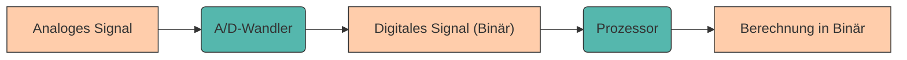

# Datenverarbeitung

Im vorherigen Kapitel haben wir gelernt, wie **Daten erfasst** werden – von Sensoren über Verstärker bis zum A/D-Wandler. Doch was passiert danach? Wie verarbeitet ein Computer diese Daten? Warum "versteht" ein Rechner nur Nullen und Einsen? Und wie werden Zahlen, Texte oder Bilder intern dargestellt?

Um diese Fragen zu beantworten, müssen wir verstehen, **wie Computer rechnen** und **welche Zahlensysteme** sie verwenden. Denn während wir Menschen mit dem Dezimalsystem arbeiten, basiert die gesamte digitale Welt auf dem **Binärsystem**.

---

## Warum das Binärsystem?

Computer bestehen aus **Milliarden winziger Transistoren** – elektronischen Schaltern, die nur zwei stabile Zustände kennen: **EIN** (1) oder **AUS** (0). Diese physikalische Eigenschaft macht das **Binärsystem** (Basis 2) zur idealen Sprache der Maschinen.

**Gründe für das Binärsystem:**

- **Einfache physikalische Realisierung**: Transistoren kennen zuverlässig nur zwei stabile Zustände: leitend (1) oder nicht leitend (0). Auch andere Trägersysteme wie Magnetisierung, Licht oder Spannung lassen sich leicht auf an/aus abbilden.
- **Hohe Störsicherheit**: Mit nur zwei Zuständen sind Signale weniger fehleranfällig. Schon kleine Abweichungen lassen sich durch Schwellwerte tolerieren, ohne dass der Informationsgehalt verloren geht.
- **Einfache elektronische Verarbeitung**: Logikgatter wie AND, OR, NOT lassen sich direkt auf das Binärsystem abbilden. Dadurch ist die Umsetzung von Rechenoperationen in Hardware effizient und robust.

???+ defi "Bit – die kleinste Informationseinheit"
    Ein **Bit** (==B== inary Dig ==it==) ist die kleinste Informationseinheit in der Informatik und repräsentiert eine Stelle einer Binärzahl. Ein Bit kann zwei Zustände annehmen: `0` oder `1`.

    Die Interpretation der Zustände kann abhängig vom jeweiligen Kontext variieren:

    - Licht an/aus
    - Wahr/Falsch
    - Hochspannung/Niederspannung
    - Nord/Süd (Magnetisierung)

---

## Vom Bit zum Byte

Da ein einzelnes Bit sehr wenig Information speichert, werden mehrere Bits zu **Gruppen** zusammengefasst. Die wichtigste Gruppe ist das **Byte** – eine Einheit aus **8 Bit**.

???+ example "Beispiel: Kombinationen mit Bits"
    Nachdem ein Bit zwei verschiedene Zustände annehmen kann, können **n Bits** genau $2^n$ verschiedene Zustände darstellen:

    - **1 Bit**: $2^1 = 2$ Zustände → `[0, 1]`
    - **2 Bit**: $2^2 = 4$ Zustände → `[00, 01, 10, 11]`
    - **3 Bit**: $2^3 = 8$ Zustände → `[000, 001, 010, 011, 100, 101, 110, 111]`
    - **8 Bit (1 Byte)**: $2^8 = 256$ Zustände → `[00000000 ... 11111111]`

    Diese Reihe lässt sich beliebig fortsetzen:

    **2 - 4 - 8 - 16 - 32 - 64 - 128 - 256 - 512 - 1024 - 2048 - 4096 ...**

Dem ein oder anderen werden diese Zahlen bekannt vorkommen – beim Blick auf den Speicherplatz des Smartphones, beim Kauf einer neuen Festplatte oder bei der Auflösung des Monitors. Nun wisst ihr auch, woher diese Zahlen kommen!

???+ tip "Warum 8 Bit = 1 Byte?"
    Früher hatten verschiedene Systeme Bytes mit 6, 7 oder 9 Bits, aber **8 Bits** haben sich als Standard etabliert:

    - Passt perfekt ins binäre System (16 Bit = 2 Byte, 32 Bit = 4 Byte, 64 Bit = 8 Byte)
    - 256 Zustände reichen aus, um alle Zeichen einer Tastatur abzubilden (ASCII-Code)
    - Computer können heutzutage nicht jedes einzelne Bit separat adressieren – **Bytes sind die kleinste adressierbare Einheit**

    
    <figcaption>Quelle: <a href="https://i.programmerhumor.io/2023/05/programmerhumor-io-programming-memes-ea8bd859d8c97cb.png">Programmerhumor.io</a></figcaption>

---

## Zahlensysteme

Im Laufe der Geschichte haben sich verschiedene Zahlensysteme entwickelt, die jeweils an die Bedürfnisse der Gesellschaften angepasst waren.

    
    <figcaption>Quelle: <a href="https://kryptografie.de/kryptografie/chiffre/images/hieratische-zahlen.png">Kryptografie.de</a></figcaption>

Das **ägyptische Zahlensystem** ist beispielsweise ein additives Zehnersystem, bei dem für jede Zehnerpotenz (Einer, Zehner, Hunderter usw.) ein eigenes Hieroglyphen-Symbol verwendet wird, das beliebig oft wiederholt werden kann.

Heute sind insbesondere **Stellenwertsysteme** (Positionssysteme) von Bedeutung: **Jede Stelle einer Zahl hat eine bestimmte Wertigkeit**, die sich aus der Basis des Systems ergibt.

???+ example "Beispiel: Dezimalsystem (Basis 10)"
    Die Zahl `123` setzt sich aus Hunderten, Zehnern und Einern zusammen:

    $$123_{10} = 1 \cdot 10^2 + 2 \cdot 10^1 + 3 \cdot 10^0 = 100 + 20 + 3$$

    Die Basis **10** verwendet die Ziffern `0–9`. Das Zeichen „3" repräsentiert den Wert 3 und wird mit entsprechenden Vielfachen von 10 multipliziert – abhängig von der Position in der Zahl.

    
    <figcaption>Quelle: <a href="https://i.programmerhumor.io/2023/05/programmerhumor-io-programming-memes-3e4ebbbe0686a47.jpg">Programmerhumor.io</a></figcaption>

Für all jene, die diesen Witz noch nicht verstehen: Kein Problem. Einfach weiterlesen. 😉

---

### Wichtige Zahlensysteme in der Informatik

Neben dem uns vertrauten Dezimalsystem gibt es weitere Zahlensysteme, die speziell in der Informatik häufig verwendet werden. Jedes System bietet unterschiedliche Vorteile.

<table role="table" aria-label="Zahlensysteme"
        style="width:100%; border-collapse:separate; border-spacing:0; border:1px solid #cfd8e3; border-radius:10px; overflow:hidden; font-family:system-ui,Segoe UI,Roboto,Arial,sans-serif;">
    <thead>
    <tr style="background:#009485; color:#fff;">
        <th style="text-align:left; padding:12px 14px; font-weight:700;">Zahlensystem</th>
        <th style="text-align:center; padding:12px 14px; font-weight:700;">Basis</th>
        <th style="text-align:center; padding:12px 14px; font-weight:700;">Ziffern</th>
        <th style="text-align:center; padding:12px 14px; font-weight:700;">Beispiel</th>
    </tr>
    </thead>
    <tbody>
    <tr>
        <td style="background:#00948511; text-align:left; padding:10px 14px;">Dezimalsystem</td>
        <td style="text-align:center; padding:10px 14px;">10</td>
        <td style="text-align:center; padding:10px 14px;">0–9</td>
        <td style="text-align:center; padding:10px 14px;">7345₁₀</td>
    </tr>
    <tr>
        <td style="background:#00948511; text-align:left; padding:10px 14px;">Binärsystem</td>
        <td style="text-align:center; padding:10px 14px;">2</td>
        <td style="text-align:center; padding:10px 14px;">0, 1</td>
        <td style="text-align:center; padding:10px 14px;">1001₂</td>
    </tr>
    <tr>
        <td style="background:#00948511; text-align:left; padding:10px 14px;">Oktalsystem</td>
        <td style="text-align:center; padding:10px 14px;">8</td>
        <td style="text-align:center; padding:10px 14px;">0–7</td>
        <td style="text-align:center; padding:10px 14px;">7345₈</td>
    </tr>
    <tr>
        <td style="background:#00948511; text-align:left; padding:10px 14px;">Hexadezimalsystem</td>
        <td style="text-align:center; padding:10px 14px;">16</td>
        <td style="text-align:center; padding:10px 14px;">0–9, A–F</td>
        <td style="text-align:center; padding:10px 14px;">CAFE₁₆</td>
    </tr>
    </tbody>
</table>

**Warum verschiedene Systeme?**

- **Binär**: Basis des Computers (Hardware-Ebene)
- **Oktal**: Kompakte Darstellung von Binärzahlen (3 Bit = 1 Oktalziffer)
- **Hexadezimal**: Sehr kompakt (4 Bit = 1 Hexziffer), häufig für Farben (#FF5733), Speicheradressen, Maschinenbefehle

Die Basis `b` gibt an, wie viele Ziffern im System verwendet werden. Mathematisch lässt sich eine Zahl `X` in der jeweiligen Basis wie folgt darstellen:

???+ defi "Positions- oder Stellenwertsystem"
    Allgemein gilt für eine positive Zahl `X` in Basis `b`:

    $$X = \sum_{i=0}^{n-1} x_i \cdot b^i$$

    mit den Ziffern $x_i \in \{0, 1, \ldots, b-1\}$.

Die Basis wird oft **tiefgestellt** oder durch **Symbole** gekennzeichnet: `O` für Oktal, `H` für Hexadezimal. Beim Dezimalsystem wird die Basis meist weggelassen.

???+ question "Aufgabe: Zahlensysteme verstehen"
    Stelle die nachfolgenden Zahlen entsprechend ihrer Basis mit der allgemeinen Formel dar:

    1. $1010_2$
    2. $1755_{10}$
    3. $\text{A4B}_{16}$
    4. $1755$ (ohne Basis angegeben)

    **Beispiel:**

    $$213_{10} = 2 \cdot \underbrace{10^2}_{100} + 1 \cdot \underbrace{10^1}_{10} + 3 \cdot \underbrace{10^0}_{1}$$

---

## Verschiedene Zahlensysteme im Alltag

Bevor wir uns den technischen Details der Basisumwandlung widmen, schauen wir uns zunächst an, wo uns diese Zahlensysteme – insbesondere das Binär- und Hexadezimalsystem – im täglichen Leben begegnen. Diese praktischen Beispiele zeigen, warum das Verständnis verschiedener Zahlensysteme nicht nur theoretisch wichtig ist, sondern konkrete Anwendungen hat.

**Beispiel 1: Farbdarstellung (RGB)**

Farben auf Bildschirmen werden meist im **RGB-Modell** dargestellt – jede Farbe besteht aus **Rot, Grün und Blau**-Anteilen. Jeder Farbkanal wird mit **8 Bit** (= 1 Byte) codiert → 256 Stufen pro Kanal.

???+ example "Beispiel: Farbcode"

    - **Weiß**: `#FFFFFF` _(Hex)_ = `(255, 255, 255)` _(Dez)_ = `11111111 11111111 11111111` _(Bin)_
    - **Schwarz**: `#000000` _(Hex)_ = `(0, 0, 0)` _(Dez)_ = `00000000 00000000 00000000` _(Bin)_
    - **Rot**: `#FF0000` _(Hex)_ = `(255, 0, 0)` _(Dez)_ = `11111111 00000000 00000000` _(Bin)_

---

**Beispiel 2: IPv4-Adressen**

Eine **IPv4-Adresse** besteht aus **4 Bytes** (32 Bit), z. B. `192.168.1.1`.

???+ example "Beispiel: IP-Adresse in Binär"

    $$192.168.1.1_{10} = 11000000.10101000.00000001.00000001_2$$

    Jede Zahl ist ein Byte (0–255).

---

**Beispiel 3: Speichergrößen**

<table role="table" aria-label="Speichergrößen"
        style="width:100%; border-collapse:separate; border-spacing:0; border:1px solid #cfd8e3; border-radius:10px; overflow:hidden; font-family:system-ui,Segoe UI,Roboto,Arial,sans-serif;">
    <thead>
    <tr style="background:#009485; color:#fff;">
        <th style="text-align:left; padding:12px 14px; font-weight:700;">Einheit</th>
        <th style="text-align:center; padding:12px 14px; font-weight:700;">Größe</th>
        <th style="text-align:center; padding:12px 14px; font-weight:700;">Bytes</th>
    </tr>
    </thead>
    <tbody>
    <tr>
        <td style="background:#00948511; text-align:left; padding:10px 14px;">1 Kilobyte</td>
        <td style="text-align:center; padding:10px 14px;">210 Bytes</td>
        <td style="text-align:center; padding:10px 14px;">1.024 Bytes</td>
    </tr>
    <tr>
        <td style="background:#00948511; text-align:left; padding:10px 14px;">1 Megabyte</td>
        <td style="text-align:center; padding:10px 14px;">220 Bytes</td>
        <td style="text-align:center; padding:10px 14px;">1.048.576 Bytes</td>
    </tr>
    <tr>
        <td style="background:#00948511; text-align:left; padding:10px 14px;">1 Gigabyte</td>
        <td style="text-align:center; padding:10px 14px;">230 Bytes</td>
        <td style="text-align:center; padding:10px 14px;">1.073.741.824 Bytes</td>
    </tr>
    <tr>
        <td style="background:#00948511; text-align:left; padding:10px 14px;">1 Terabyte</td>
        <td style="text-align:center; padding:10px 14px;">240 Bytes</td>
        <td style="text-align:center; padding:10px 14px;">~1 Billion Bytes</td>
    </tr>
    </tbody>
</table>

???+ warning "Hinweis"
    In der Praxis wird oft **1 KB = 1000 Bytes** verwendet (SI-Standard), was zu Verwirrung führt. Computer rechnen aber in **Zweierpotenzen** (1 KiB = 1024 Bytes).

---

## Basisumwandlung

Prinzipiell ist es möglich, jede Zahl in ein anderes Zahlensystem umzuwandeln. Dafür stehen verschiedene Verfahren zur Verfügung. Meist verwendet man das **Dezimalsystem als Zwischensystem**.

---

**Umwandlung in das Dezimalsystem (b → 10)**

Das Umrechnen in das Dezimalsystem ist besonders einfach: **Jede Ziffer wird mit ihrer Stellenwertigkeit multipliziert** und anschließend aufsummiert.

???+ example "Beispiel: Umwandlung in das Dezimalsystem"

    **Binär zu Dezimal:**

    $$1001_2 = 1 \cdot 2^3 + 0 \cdot 2^2 + 0 \cdot 2^1 + 1 \cdot 2^0 = 8 + 0 + 0 + 1 = 9_{10}$$

    **Oktal zu Dezimal:**

    $$7345_8 = 7 \cdot 8^3 + 3 \cdot 8^2 + 4 \cdot 8^1 + 5 \cdot 8^0 = 3584 + 192 + 32 + 5 = 3813_{10}$$

    **Hexadezimal zu Dezimal:**

    $$\text{CAFE}_{16} = 12 \cdot 16^3 + 10 \cdot 16^2 + 15 \cdot 16^1 + 14 \cdot 16^0 = 51966_{10}$$

    (Hinweis: $\text{C} = 12, \text{A} = 10, \text{F} = 15, \text{E} = 14$)

---

**Umwandlung vom Dezimalsystem in ein beliebiges Zahlensystem (10 → b)**

Die Ausgangszahl wird **wiederholt durch die Zielbasis geteilt**, bis der Quotient 0 ist. Die **Reste** ergeben die Ziffern der neuen Darstellung – **von rechts nach links**.

???+ example "Beispiele: Umwandlung vom Dezimalsystem"

    **Vom Dezimal- ins Oktalsystem:**

    $$
    \begin{align}
    327 \div 8 &= 40 \text{ Rest } 7 \\
    40 \div 8 &= 5 \text{ Rest } 0 \\
    5 \div 8 &= 0 \text{ Rest } 5
    \end{align}
    $$

    **Ergebnis** (Reste von unten nach oben lesen): $327_{10} = 507_8$

    ---

    **Vom Dezimal- ins Hexadezimalsystem:**

    $$
    \begin{align}
    327 \div 16 &= 20 \text{ Rest } 7 \\
    20 \div 16 &= 1 \text{ Rest } 4 \\
    1 \div 16 &= 0 \text{ Rest } 1
    \end{align}
    $$

    **Ergebnis**: $327_{10} = 147_{16}$

???+ question "Aufgabe: Basisumwandlung"
    Wandle die nachfolgenden Zahlen in die geforderte Basis um:

    1. $1010_2$ zu Dezimal
    2. $1755_{10}$ zu Oktal
    3. $\text{A4B}_{16}$ zu Binär
    4. $1755_{10}$ zu Hexadezimal

---

## Festkommaarithmetik

Nicht nur ganze Zahlen, auch **rationale Zahlen** (Kommazahlen) können in verschiedenen Basen dargestellt werden. Dabei wird zwischen **Vorkomma- und Nachkommateil** unterschieden.

???+ defi "Festkommaarithmetik – allgemeine Formel"
    Allgemein gilt für eine Zahl `X` in Basis `b` mit `n` Vorkomma- und `m` Nachkommastellen:

    $$X = \sum_{i=0}^{n-1} x_i \cdot b^i + \sum_{j=1}^{m} x_{-j} \cdot b^{-j}$$

    mit den Ziffern $x_i \in \{0, 1, \ldots, b-1\}$.

???+ example "Beispiel: Festkommaarithmetik"

    Die Zahl $10{,}625_{10}$ lässt sich zerlegen in:

    $$10{,}625_{10} = \underbrace{1 \cdot 10^1 + 0 \cdot 10^0}_{\text{Vorkomma}} + \underbrace{6 \cdot 10^{-1} + 2 \cdot 10^{-2} + 5 \cdot 10^{-3}}_{\text{Nachkomma}}$$

    $$= 10 + 0 + 0{,}6 + 0{,}02 + 0{,}005 = 10{,}625$$

Die Konvertierung zwischen verschiedenen Basen in der Festkommaarithmetik ist ebenfalls möglich, wird aber hier nicht weiter behandelt. Eine Beschreibung findet sich beispielsweise [hier](https://www.elektronik-kompendium.de/sites/dig/1807241.htm).

---

## Negative Zahlen

Bisher haben wir nur **positive ganze Zahlen** betrachtet. Um auch **negative Zahlen** darstellen zu können, gibt es verschiedene Verfahren. Die wichtigsten sind:

1. **Vorzeichen-Betrag-Darstellung**
2. **Einerkomplement**
3. **Zweierkomplement** ⭐ (heute Standard)

---

**Vorzeichen-Betrag-Darstellung**

- Das **höchstwertige Bit** (MSB = Most Significant Bit) dient als **Vorzeichenbit**:
    - `0` → Zahl ist positiv
    - `1` → Zahl ist negativ
- Die **restlichen Bits** geben den Betrag an.

???+ example "Vorzeichen-Betrag Darstellung"

    Die Zahl $5$ wird binär dargestellt als:

    $$101_2$$

    Wenn wir $\pm 5$ mit **Vorzeichen und Betrag** darstellen wollen, stellen wir ein Vorzeichenbit voran:

    $$\underbrace{0}_{+} 101 \rightarrow +5$$

    $$\underbrace{1}_{-} 101 \rightarrow -5$$

**Nachteile:**

- Es gibt **zwei Darstellungen für Null**: `0000` und `1000`
- Rechenoperationen (Addition/Subtraktion) sind **aufwändiger** als bei anderen Darstellungen

---

**Einerkomplement-Darstellung**

- **Positive Zahlen** wie gewohnt.
- **Negative Zahlen** entstehen durch **bitweise Invertierung** (alle 0 → 1 und 1 → 0).
- Auch hier gibt es ein **Vorzeichenbit** (zeigt an, ob invertiert wurde).

???+ example "Einerkomplement Darstellung"

    Wir möchten die Zahlen $\pm 5$ im Einerkomplement darstellen:

    **Positive Zahl** (bleibt gleich):

    $$ \underbrace{0}_{+} 101 \rightarrow +5$$

    **Negative Zahl** (Bits invertieren):

    $$ 0101 \rightarrow 1010 \rightarrow -5$$

**Vorteil:**

- Subtraktion kann durch Addition der negativen Zahl realisiert werden: $3 - 4 = 3 + (-4)$

**Nachteile:**

- Auch hier **zwei Darstellungen der Null**: `0000` und `1111`
- Bei Addition wird eine **Übertrag-Korrektur** benötigt

    
    <figcaption>Quelle: <a href="https://i.programmerhumor.io/2023/10/programmerhumor-io-programming-memes-2570089582bf52b.jpg">Programmerhumor.io</a></figcaption>

---

**Zweierkomplement-Darstellung** ⭐

Die **Zweierkomplement-Darstellung** ist das heute in Computern gebräuchlichste Verfahren zum Umgang mit negativen Zahlen. Sie baut auf dem Einerkomplement auf:

**Vorgehensweise:**

1. **Positive Zahlen**: Wie gewohnt darstellen
2. **Negative Zahlen**:
    1. Alle Bits invertieren (Einerkomplement bilden)
    2. Anschließend **1 addieren**

???+ example "Zweierkomplement Darstellung"

    Wir möchten die Zahlen $\pm 5$ im Zweierkomplement darstellen.

    **Positive Zahl**:

    $$ \underbrace{0}_{+} 101 \rightarrow +5$$

    **Negative Zahl**:

    1. Einerkomplement bilden: $0101 \rightarrow 1010$
    2. 1 addieren:

    $$
    \begin{array}{cr}
         & 1010 \\
         + & 0001 \\ \hline
         & 1011
    \end{array}
    $$

    **Ergebnis**: $-5 = 1011_2$ (im Zweierkomplement)

**Vorteile des Zweierkomplements:**

- Es gibt **nur eine Darstellung der Null** (`0000`)
- **Addition und Subtraktion** funktionieren ohne Sonderregeln
- Hardware-Implementierung ist **einfach und effizient**

---

**Gegenüberstellung der Darstellungen**

<table role="table" aria-label="Negative Zahlen"
        style="width:100%; border-collapse:separate; border-spacing:0; border:1px solid #cfd8e3; border-radius:10px; overflow:hidden; font-family:system-ui,Segoe UI,Roboto,Arial,sans-serif;">
    <thead>
    <tr style="background:#009485; color:#fff;">
        <th style="text-align:center; padding:12px 14px; font-weight:700;">Zahl</th>
        <th style="text-align:center; padding:12px 14px; font-weight:700;">Vorzeichen-Betrag</th>
        <th style="text-align:center; padding:12px 14px; font-weight:700;">Einerkomplement</th>
        <th style="text-align:center; padding:12px 14px; font-weight:700;">Zweierkomplement</th>
    </tr>
    </thead>
    <tbody>
    <tr>
        <td style="background:#00948511; text-align:center; padding:10px 14px;">+5</td>
        <td style="text-align:center; padding:10px 14px;">0101</td>
        <td style="text-align:center; padding:10px 14px;">0101</td>
        <td style="text-align:center; padding:10px 14px;">0101</td>
    </tr>
    <tr>
        <td style="background:#00948511; text-align:center; padding:10px 14px;">−5</td>
        <td style="text-align:center; padding:10px 14px;">1101</td>
        <td style="text-align:center; padding:10px 14px;">1010</td>
        <td style="text-align:center; padding:10px 14px;">1011</td>
    </tr>
    </tbody>
</table>

???+ question "Aufgabe: Negative Zahlen"
    Stellen Sie die Zahl $-7$ in allen drei verschiedenen Darstellungsarten dar (verwenden Sie 4 Bit).

---

## Zusammenfassung 📌

- Computer arbeiten auf **Basis des Binärsystems**, weil Transistoren nur zwei stabile Zustände kennen.
- Ein **Bit** ist die kleinste Informationseinheit, ein **Byte** besteht aus 8 Bit.
- Es gibt verschiedene **Zahlensysteme** (Binär, Oktal, Dezimal, Hexadezimal), die sich durch ihre **Basis** unterscheiden.
- Zahlen können zwischen verschiedenen Basen **umgewandelt** werden.
- **Negative Zahlen** werden meist im **Zweierkomplement** dargestellt – das ist effizient und hat keine doppelte Null.
- Das Binärsystem begegnet uns überall: bei **Farben, IP-Adressen, Speichergrößen** und in der **Datenverarbeitung**.

---

Nachdem wir nun verstehen, **wie Computer Daten verarbeiten** und **in welcher Form sie intern dargestellt werden**, stellt sich die Frage: **Wie werden diese Daten dauerhaft gespeichert?** Dieser Frage gehen wir im nächsten Kapitel nach.
