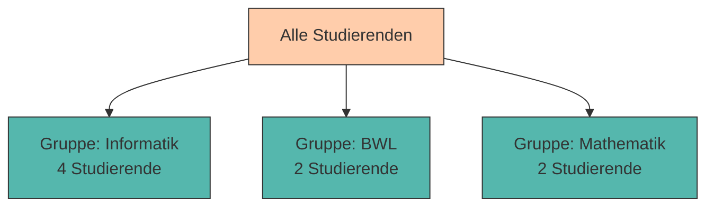

# Daten abfragen mit SQL (SELECT)

Im vorherigen Kapitel haben wir gelernt, wie man Tabellen erstellt und Daten einfügt. Jetzt wird es richtig spannend: Wir lernen, wie man **gezielt nach Daten sucht, sie filtert, sortiert und analysiert** – die Kernkompetenz jeder Datenbank!

SQL ist eine **deklarative Sprache**: Wir beschreiben, **was** wir haben möchten, nicht **wie** die Datenbank es finden soll. Das macht SQL mächtig und gleichzeitig einfach zu lernen.

---

## Die Grundstruktur von SELECT

Eine SELECT-Abfrage hat folgende Grundstruktur:

```sql
SELECT spalten
FROM tabelle
WHERE bedingung
ORDER BY sortierung;
```

**Übersetzt bedeutet das:**

> "Wähle diese **Spalten** aus dieser **Tabelle**, aber nur die Zeilen, die diese **Bedingung** erfüllen, und sortiere das Ergebnis nach dieser **Sortierung**."

Lass uns das Schritt für Schritt durchgehen!

---

## Beispieldaten

Für die folgenden Beispiele verwenden wir unsere `studierende` Tabelle und erweitern sie:

```sql
INSERT INTO studierende (matrikel_nr, vorname, nachname, studiengang, semester)
VALUES 
    (12345, 'Anna', 'Müller', 'Informatik', 3),
    (12346, 'Max', 'Schmidt', 'BWL', 2),
    (12347, 'Lisa', 'Weber', 'Informatik', 5),
    (12348, 'Tom', 'Bauer', 'Mathematik', 1),
    (12349, 'Sarah', 'Klein', 'Informatik', 3),
    (12350, 'Paul', 'Fischer', 'BWL', 4),
    (12351, 'Emma', 'Wagner', 'Mathematik', 2),
    (12352, 'Leon', 'Hoffmann', 'Informatik', 1);
```

---

## Filtern mit WHERE

Mit der **WHERE-Klausel** können wir Datensätze nach bestimmten Kriterien filtern.

### Einfache Vergleiche

```sql
-- Alle Informatik-Studierenden
SELECT * FROM studierende
WHERE studiengang = 'Informatik';
```

**Ergebnis:**

```
 matrikel_nr │ vorname │ nachname │ studiengang │ semester 
─────────────┼─────────┼──────────┼─────────────┼──────────
       12345 │ Anna    │ Müller   │ Informatik  │        3
       12347 │ Lisa    │ Weber    │ Informatik  │        5
       12349 │ Sarah   │ Klein    │ Informatik  │        3
       12352 │ Leon    │ Hoffmann │ Informatik  │        1
```

### Vergleichsoperatoren

<div style="text-align:center; max-width:700px; margin:16px auto;">
<table role="table" 
       style="width:100%; border-collapse:separate; border-spacing:0; border:1px solid #cfd8e3; border-radius:10px; overflow:hidden; font-family:system-ui,sans-serif;">
    <thead>
    <tr style="background:#009485; color:#fff;">
        <th style="text-align:center; padding:12px 14px; font-weight:700;">Operator</th>
        <th style="text-align:left; padding:12px 14px; font-weight:700;">Bedeutung</th>
        <th style="text-align:left; padding:12px 14px; font-weight:700;">Beispiel</th>
    </tr>
    </thead>
    <tbody>
    <tr>
        <td style="background:#00948511; text-align:center; padding:10px 14px;"><code>=</code></td>
        <td style="padding:10px 14px;">Gleich</td>
        <td style="padding:10px 14px;"><code>semester = 3</code></td>
    </tr>
    <tr>
        <td style="background:#00948511; text-align:center; padding:10px 14px;"><code>!=</code> oder <code>&lt;&gt;</code></td>
        <td style="padding:10px 14px;">Ungleich</td>
        <td style="padding:10px 14px;"><code>semester != 1</code></td>
    </tr>
    <tr>
        <td style="background:#00948511; text-align:center; padding:10px 14px;"><code>&gt;</code></td>
        <td style="padding:10px 14px;">Größer als</td>
        <td style="padding:10px 14px;"><code>semester &gt; 2</code></td>
    </tr>
    <tr>
        <td style="background:#00948511; text-align:center; padding:10px 14px;"><code>&lt;</code></td>
        <td style="padding:10px 14px;">Kleiner als</td>
        <td style="padding:10px 14px;"><code>semester &lt; 4</code></td>
    </tr>
    <tr>
        <td style="background:#00948511; text-align:center; padding:10px 14px;"><code>&gt;=</code></td>
        <td style="padding:10px 14px;">Größer oder gleich</td>
        <td style="padding:10px 14px;"><code>semester &gt;= 3</code></td>
    </tr>
    <tr>
        <td style="background:#00948511; text-align:center; padding:10px 14px;"><code>&lt;=</code></td>
        <td style="padding:10px 14px;">Kleiner oder gleich</td>
        <td style="padding:10px 14px;"><code>semester &lt;= 2</code></td>
    </tr>
    </tbody>
</table>
</div>

### Beispiele

```sql
-- Studierende ab dem 3. Semester
SELECT vorname, nachname, semester 
FROM studierende
WHERE semester >= 3;
```

```sql
-- Alle außer BWL-Studierende
SELECT vorname, nachname, studiengang 
FROM studierende
WHERE studiengang != 'BWL';
```

---

## Mehrere Bedingungen kombinieren

Mit **AND**, **OR** und **NOT** können wir komplexe Bedingungen formulieren.

### AND (Und)

Beide Bedingungen müssen erfüllt sein:

```sql
-- Informatik-Studierende im 3. Semester
SELECT vorname, nachname 
FROM studierende
WHERE studiengang = 'Informatik' AND semester = 3;
```

**Ergebnis:**

```
 vorname │ nachname 
─────────┼──────────
 Anna    │ Müller
 Sarah   │ Klein
```

### OR (Oder)

Mindestens eine Bedingung muss erfüllt sein:

```sql
-- Studierende in BWL oder Mathematik
SELECT vorname, nachname, studiengang 
FROM studierende
WHERE studiengang = 'BWL' OR studiengang = 'Mathematik';
```

### NOT (Nicht)

Negiert eine Bedingung:

```sql
-- Alle außer Erstsemester
SELECT vorname, nachname, semester 
FROM studierende
WHERE NOT semester = 1;
```

---

## BETWEEN und IN

### BETWEEN - Wertebereich

```sql
-- Studierende im 2. bis 4. Semester
SELECT vorname, nachname, semester 
FROM studierende
WHERE semester BETWEEN 2 AND 4;
```

<div style="background:#00948511; border-left:4px solid #009485; padding:12px 16px; margin:16px 0;">
<strong>💡 Hinweis:</strong> <code>BETWEEN</code> ist <strong>inklusiv</strong> – beide Grenzen sind eingeschlossen!
</div>

### IN - Liste von Werten

```sql
-- Studierende in bestimmten Studiengängen
SELECT vorname, nachname, studiengang 
FROM studierende
WHERE studiengang IN ('Informatik', 'Mathematik');
```

Das ist äquivalent zu:

```sql
WHERE studiengang = 'Informatik' OR studiengang = 'Mathematik'
```

---

## Muster mit LIKE

Mit **LIKE** können wir nach Textmustern suchen.

**Platzhalter:**

- `%` – steht für beliebig viele Zeichen (auch 0)
- `_` – steht für genau ein Zeichen

### Beispiele

```sql
-- Alle mit Nachname beginnend mit 'M'
SELECT vorname, nachname 
FROM studierende
WHERE nachname LIKE 'M%';
```

**Ergebnis:**

```
 vorname │ nachname 
─────────┼──────────
 Anna    │ Müller
```

```sql
-- Alle mit 'er' im Nachnamen
SELECT vorname, nachname 
FROM studierende
WHERE nachname LIKE '%er%';
```

**Ergebnis:**

```
 vorname │ nachname 
─────────┼──────────
 Anna    │ Müller
 Lisa    │ Weber
 Paul    │ Fischer
```

```sql
-- Vornamen mit genau 4 Buchstaben
SELECT vorname 
FROM studierende
WHERE vorname LIKE '____';  -- 4 Unterstriche
```

---

## Sortieren mit ORDER BY

Mit **ORDER BY** können wir Ergebnisse sortieren.

### Aufsteigend sortieren (Standard)

```sql
-- Nach Nachname sortiert (A-Z)
SELECT vorname, nachname 
FROM studierende
ORDER BY nachname;
```

oder explizit:

```sql
ORDER BY nachname ASC;  -- ASC = ascending (aufsteigend)
```

### Absteigend sortieren

```sql
-- Nach Semester sortiert (höchste zuerst)
SELECT vorname, nachname, semester 
FROM studierende
ORDER BY semester DESC;  -- DESC = descending (absteigend)
```

### Nach mehreren Spalten sortieren

```sql
-- Erst nach Studiengang, dann nach Semester
SELECT vorname, nachname, studiengang, semester 
FROM studierende
ORDER BY studiengang ASC, semester DESC;
```

Das bedeutet: Gruppiere nach Studiengang (alphabetisch), und innerhalb jeder Gruppe sortiere nach Semester (absteigend).

---

## Ergebnismenge begrenzen: LIMIT

Mit **LIMIT** können wir die Anzahl der zurückgegebenen Zeilen begrenzen.

```sql
-- Die 3 ersten Studierenden (alphabetisch nach Nachname)
SELECT vorname, nachname 
FROM studierende
ORDER BY nachname
LIMIT 3;
```

### Mit OFFSET - Paginierung

```sql
-- Zeilen 4-6 (überspringt die ersten 3)
SELECT vorname, nachname 
FROM studierende
ORDER BY nachname
LIMIT 3 OFFSET 3;
```

<div style="background:#FFB48211; border-left:4px solid #FFB482; padding:12px 16px; margin:16px 0;">
<strong>📘 Praktischer Einsatz: Paginierung</strong><br>
<code>LIMIT</code> und <code>OFFSET</code> werden häufig für Paginierung verwendet (z.B. Seite 1, Seite 2, ...). Für Seite <code>n</code> mit <code>x</code> Einträgen pro Seite:<br>
<code>LIMIT x OFFSET (n-1) * x</code>
</div>

---

## Aggregatfunktionen - Daten zusammenfassen

**Aggregatfunktionen** fassen mehrere Werte zu einem einzigen Wert zusammen.

<div style="text-align:center; max-width:820px; margin:16px auto;">
<table role="table" 
       style="width:100%; border-collapse:separate; border-spacing:0; border:1px solid #cfd8e3; border-radius:10px; overflow:hidden; font-family:system-ui,sans-serif;">
    <thead>
    <tr style="background:#009485; color:#fff;">
        <th style="text-align:left; padding:12px 14px; font-weight:700;">Funktion</th>
        <th style="text-align:left; padding:12px 14px; font-weight:700;">Beschreibung</th>
        <th style="text-align:left; padding:12px 14px; font-weight:700;">Beispiel</th>
    </tr>
    </thead>
    <tbody>
    <tr>
        <td style="background:#00948511; padding:10px 14px;"><code>COUNT(*)</code></td>
        <td style="padding:10px 14px;">Anzahl aller Zeilen</td>
        <td style="padding:10px 14px;"><code>COUNT(*)</code></td>
    </tr>
    <tr>
        <td style="background:#00948511; padding:10px 14px;"><code>COUNT(spalte)</code></td>
        <td style="padding:10px 14px;">Anzahl der Nicht-NULL-Werte</td>
        <td style="padding:10px 14px;"><code>COUNT(semester)</code></td>
    </tr>
    <tr>
        <td style="background:#00948511; padding:10px 14px;"><code>SUM(spalte)</code></td>
        <td style="padding:10px 14px;">Summe aller Werte</td>
        <td style="padding:10px 14px;"><code>SUM(ects)</code></td>
    </tr>
    <tr>
        <td style="background:#00948511; padding:10px 14px;"><code>AVG(spalte)</code></td>
        <td style="padding:10px 14px;">Durchschnitt</td>
        <td style="padding:10px 14px;"><code>AVG(semester)</code></td>
    </tr>
    <tr>
        <td style="background:#00948511; padding:10px 14px;"><code>MIN(spalte)</code></td>
        <td style="padding:10px 14px;">Kleinster Wert</td>
        <td style="padding:10px 14px;"><code>MIN(semester)</code></td>
    </tr>
    <tr>
        <td style="background:#00948511; padding:10px 14px;"><code>MAX(spalte)</code></td>
        <td style="padding:10px 14px;">Größter Wert</td>
        <td style="padding:10px 14px;"><code>MAX(semester)</code></td>
    </tr>
    </tbody>
</table>
</div>

### Beispiele

```sql
-- Wie viele Studierende gibt es insgesamt?
SELECT COUNT(*) AS anzahl_studierende 
FROM studierende;
```

**Ergebnis:**

```
 anzahl_studierende 
────────────────────
                  8
```

```sql
-- Durchschnittliches Semester
SELECT AVG(semester) AS durchschnitt 
FROM studierende;
```

```sql
-- Höchstes und niedrigstes Semester
SELECT 
    MIN(semester) AS min_semester,
    MAX(semester) AS max_semester
FROM studierende;
```

---

## Gruppieren mit GROUP BY

**GROUP BY** fasst Zeilen mit gleichen Werten zusammen und erlaubt Aggregationen pro Gruppe.

**Syntax:**

```sql
SELECT gruppenspalte, aggregatfunktion(spalte)
FROM tabelle
GROUP BY gruppenspalte;
```

### Beispiel: Studierende pro Studiengang zählen

```sql
SELECT studiengang, COUNT(*) AS anzahl
FROM studierende
GROUP BY studiengang;
```

**Ergebnis:**

```
 studiengang │ anzahl 
─────────────┼────────
 Informatik  │      4
 BWL         │      2
 Mathematik  │      2
```



### Mehrere Aggregationen

```sql
SELECT 
    studiengang, 
    COUNT(*) AS anzahl,
    AVG(semester) AS durchschnitt_semester
FROM studierende
GROUP BY studiengang
ORDER BY anzahl DESC;
```

**Ergebnis:**

```
 studiengang │ anzahl │ durchschnitt_semester 
─────────────┼────────┼──────────────────────
 Informatik  │      4 │                   3.0
 BWL         │      2 │                   3.0
 Mathematik  │      2 │                   1.5
```

<div style="background:#FFB48211; border-left:4px solid #FFB482; padding:12px 16px; margin:16px 0;">
<strong>⚠️ Wichtige Regel:</strong><br>
Wenn du <code>GROUP BY</code> verwendest, dürfen im <code>SELECT</code> nur vorkommen:
<ul style="margin:8px 0 0 0;">
<li>Spalten, die in <code>GROUP BY</code> stehen</li>
<li>Aggregatfunktionen</li>
</ul>
</div>

---

## HAVING - Gruppen filtern

**HAVING** filtert Gruppen **nach** der Aggregation – im Gegensatz zu **WHERE**, das **vor** der Aggregation filtert.

**Wann WHERE, wann HAVING?**

- **WHERE** – Filtert einzelne Zeilen (vor GROUP BY)
- **HAVING** – Filtert Gruppen (nach GROUP BY)

### Beispiel

```sql
-- Studiengänge mit mehr als 2 Studierenden
SELECT studiengang, COUNT(*) AS anzahl
FROM studierende
GROUP BY studiengang
HAVING COUNT(*) > 2;
```

**Ergebnis:**

```
 studiengang │ anzahl 
─────────────┼────────
 Informatik  │      4
```

### WHERE vs. HAVING kombiniert

```sql
-- Studiengänge mit mehr als 2 Studierenden, aber nur ab Semester 2
SELECT studiengang, COUNT(*) AS anzahl
FROM studierende
WHERE semester >= 2  -- Filtert ZEILEN
GROUP BY studiengang
HAVING COUNT(*) > 1;  -- Filtert GRUPPEN
```

**Ablauf:**

1. **WHERE**: Filtere alle Zeilen mit `semester >= 2`
2. **GROUP BY**: Gruppiere nach Studiengang
3. **HAVING**: Zeige nur Gruppen mit mehr als 1 Studierendem

---

## DISTINCT - Duplikate entfernen

**DISTINCT** entfernt doppelte Zeilen aus dem Ergebnis.

```sql
-- Welche Studiengänge gibt es? (ohne Duplikate)
SELECT DISTINCT studiengang 
FROM studierende;
```

**Ergebnis:**

```
 studiengang 
─────────────
 Informatik
 BWL
 Mathematik
```

---

## Praktische Übungen 🎯

Verwende die `studierende` und `kurse` Tabellen für folgende Aufgaben:

### Aufgabe 1: Einfache Abfragen

1. Zeige alle BWL-Studierenden
2. Zeige Studierende im 1. oder 2. Semester
3. Zeige Studierende, deren Vorname mit 'L' beginnt

<details>
<summary>💡 Lösungen anzeigen</summary>

```sql
-- 1
SELECT * FROM studierende WHERE studiengang = 'BWL';

-- 2
SELECT * FROM studierende WHERE semester IN (1, 2);

-- 3
SELECT * FROM studierende WHERE vorname LIKE 'L%';
```
</details>

### Aufgabe 2: Sortierung

1. Sortiere Studierende nach Semester (aufsteigend), dann nach Nachname
2. Zeige die 5 Studierenden mit den höchsten Semestern

<details>
<summary>💡 Lösungen anzeigen</summary>

```sql
-- 1
SELECT * FROM studierende ORDER BY semester ASC, nachname ASC;

-- 2
SELECT * FROM studierende ORDER BY semester DESC LIMIT 5;
```
</details>

### Aufgabe 3: Aggregationen

1. Wie viele Studierende gibt es pro Semester?
2. Welches ist das durchschnittliche Semester aller Studierenden?
3. In welchen Studiengängen sind mindestens 3 Studierende?

<details>
<summary>💡 Lösungen anzeigen</summary>

```sql
-- 1
SELECT semester, COUNT(*) AS anzahl 
FROM studierende 
GROUP BY semester 
ORDER BY semester;

-- 2
SELECT AVG(semester) AS durchschnitt FROM studierende;

-- 3
SELECT studiengang, COUNT(*) AS anzahl 
FROM studierende 
GROUP BY studiengang 
HAVING COUNT(*) >= 3;
```
</details>

---

## Zusammenfassung 📌

- **WHERE** filtert Zeilen nach Bedingungen (`=`, `!=`, `>`, `<`, `>=`, `<=`)
- **AND**, **OR**, **NOT** kombinieren Bedingungen
- **BETWEEN** prüft Wertebereiche, **IN** prüft gegen eine Liste
- **LIKE** ermöglicht Mustersuche (`%` und `_` als Platzhalter)
- **ORDER BY** sortiert Ergebnisse (ASC aufsteigend, DESC absteigend)
- **LIMIT** begrenzt die Anzahl der Ergebnisse, **OFFSET** überspringt Zeilen
- **Aggregatfunktionen** (COUNT, SUM, AVG, MIN, MAX) fassen Daten zusammen
- **GROUP BY** gruppiert Zeilen für Aggregationen
- **HAVING** filtert Gruppen (ähnlich wie WHERE, aber für Gruppen)
- **DISTINCT** entfernt Duplikate

---

Im nächsten Kapitel lernen wir, wie wir Daten **ändern, aktualisieren und löschen** können – und welche Fallstricke dabei lauern!
