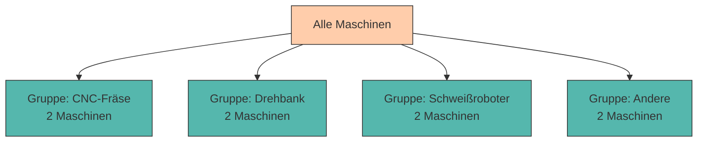

# Daten abfragen mit SQL (SELECT)

Im vorherigen Kapitel haben wir gelernt, wie man Tabellen erstellt und Daten einfügt. Jetzt wird es richtig spannend: Wir lernen, wie man **gezielt nach Daten sucht, sie filtert, sortiert und analysiert** – die Kernkompetenz jeder Datenbank!

SQL ist eine **deklarative Sprache**: Wir beschreiben, **was** wir haben möchten, nicht **wie** die Datenbank es finden soll. Das macht SQL mächtig und gleichzeitig einfach zu lernen.

---

## Die Grundstruktur von SELECT

Eine SELECT-Abfrage hat folgende Grundstruktur:

```sql
SELECT spalten
FROM tabelle
WHERE bedingung
ORDER BY sortierung;
```

**Übersetzt bedeutet das:**

> "Wähle diese **Spalten** aus dieser **Tabelle**, aber nur die Zeilen, die diese **Bedingung** erfüllen, und sortiere das Ergebnis nach dieser **Sortierung**."

Lass uns das Schritt für Schritt durchgehen!

---

## Beispieldaten

Für die folgenden Beispiele verwenden wir unsere `maschinen` Tabelle und erweitern sie:

```sql
INSERT INTO maschinen (maschinen_id, name, typ, standort, anschaffungsjahr, status)
VALUES
    (1, 'CNC-Fräse Alpha', 'CNC-Fräse', 'Halle A', 2019, 'Aktiv'),
    (2, 'Drehbank Beta', 'Drehbank', 'Halle A', 2021, 'Aktiv'),
    (3, 'Schweißroboter Gamma', 'Schweißroboter', 'Halle B', 2020, 'Wartung'),
    (4, 'Lackieranlage Delta', 'Lackieranlage', 'Halle C', 2018, 'Aktiv'),
    (5, 'CNC-Fräse Epsilon', 'CNC-Fräse', 'Halle A', 2022, 'Aktiv'),
    (6, 'Drehbank Zeta', 'Drehbank', 'Halle B', 2017, 'Defekt'),
    (7, 'Schweißroboter Eta', 'Schweißroboter', 'Halle B', 2020, 'Aktiv'),
    (8, 'Stanzmaschine Theta', 'Stanzmaschine', 'Halle A', 2023, 'Aktiv');
```

---

## Filtern mit WHERE

Mit der **WHERE-Klausel** können wir Datensätze nach bestimmten Kriterien filtern.

### Einfache Vergleiche

```sql
-- Alle CNC-Fräsen
SELECT * FROM maschinen
WHERE typ = 'CNC-Fräse';
```

**Ergebnis:**

```
 maschinen_id │ name              │ typ       │ standort │ anschaffungsjahr │ status
──────────────┼───────────────────┼───────────┼──────────┼──────────────────┼────────
            1 │ CNC-Fräse Alpha   │ CNC-Fräse │ Halle A  │             2019 │ Aktiv
            5 │ CNC-Fräse Epsilon │ CNC-Fräse │ Halle A  │             2022 │ Aktiv
```

### Vergleichsoperatoren

<div style="text-align:center; max-width:700px; margin:16px auto;">
<table role="table" 
       style="width:100%; border-collapse:separate; border-spacing:0; border:1px solid #cfd8e3; border-radius:10px; overflow:hidden; font-family:system-ui,sans-serif;">
    <thead>
    <tr style="background:#009485; color:#fff;">
        <th style="text-align:center; padding:12px 14px; font-weight:700;">Operator</th>
        <th style="text-align:left; padding:12px 14px; font-weight:700;">Bedeutung</th>
        <th style="text-align:left; padding:12px 14px; font-weight:700;">Beispiel</th>
    </tr>
    </thead>
    <tbody>
    <tr>
        <td style="background:#00948511; text-align:center; padding:10px 14px;"><code>=</code></td>
        <td style="padding:10px 14px;">Gleich</td>
        <td style="padding:10px 14px;"><code>status = 'Aktiv'</code></td>
    </tr>
    <tr>
        <td style="background:#00948511; text-align:center; padding:10px 14px;"><code>!=</code> oder <code>&lt;&gt;</code></td>
        <td style="padding:10px 14px;">Ungleich</td>
        <td style="padding:10px 14px;"><code>status != 'Defekt'</code></td>
    </tr>
    <tr>
        <td style="background:#00948511; text-align:center; padding:10px 14px;"><code>&gt;</code></td>
        <td style="padding:10px 14px;">Größer als</td>
        <td style="padding:10px 14px;"><code>anschaffungsjahr &gt; 2020</code></td>
    </tr>
    <tr>
        <td style="background:#00948511; text-align:center; padding:10px 14px;"><code>&lt;</code></td>
        <td style="padding:10px 14px;">Kleiner als</td>
        <td style="padding:10px 14px;"><code>anschaffungsjahr &lt; 2019</code></td>
    </tr>
    <tr>
        <td style="background:#00948511; text-align:center; padding:10px 14px;"><code>&gt;=</code></td>
        <td style="padding:10px 14px;">Größer oder gleich</td>
        <td style="padding:10px 14px;"><code>anschaffungsjahr &gt;= 2020</code></td>
    </tr>
    <tr>
        <td style="background:#00948511; text-align:center; padding:10px 14px;"><code>&lt;=</code></td>
        <td style="padding:10px 14px;">Kleiner oder gleich</td>
        <td style="padding:10px 14px;"><code>anschaffungsjahr &lt;= 2019</code></td>
    </tr>
    </tbody>
</table>
</div>

### Beispiele

```sql
-- Maschinen ab Anschaffungsjahr 2020
SELECT name, typ, anschaffungsjahr
FROM maschinen
WHERE anschaffungsjahr >= 2020;
```

```sql
-- Alle außer Maschinen in Halle A
SELECT name, typ, standort
FROM maschinen
WHERE standort != 'Halle A';
```

---

## Mehrere Bedingungen kombinieren

Mit **AND**, **OR** und **NOT** können wir komplexe Bedingungen formulieren.

### AND (Und)

Beide Bedingungen müssen erfüllt sein:

```sql
-- CNC-Fräsen in Halle A
SELECT name, typ, standort
FROM maschinen
WHERE typ = 'CNC-Fräse' AND standort = 'Halle A';
```

**Ergebnis:**

```
 name              │ typ       │ standort
───────────────────┼───────────┼──────────
 CNC-Fräse Alpha   │ CNC-Fräse │ Halle A
 CNC-Fräse Epsilon │ CNC-Fräse │ Halle A
```

### OR (Oder)

Mindestens eine Bedingung muss erfüllt sein:

```sql
-- Maschinen die in Wartung oder Defekt sind
SELECT name, typ, status
FROM maschinen
WHERE status = 'Wartung' OR status = 'Defekt';
```

### NOT (Nicht)

Negiert eine Bedingung:

```sql
-- Alle außer aktive Maschinen
SELECT name, typ, status
FROM maschinen
WHERE NOT status = 'Aktiv';
```

---

## BETWEEN und IN

### BETWEEN - Wertebereich

```sql
-- Maschinen aus den Jahren 2018 bis 2020
SELECT name, typ, anschaffungsjahr
FROM maschinen
WHERE anschaffungsjahr BETWEEN 2018 AND 2020;
```

<div style="background:#00948511; border-left:4px solid #009485; padding:12px 16px; margin:16px 0;">
<strong>💡 Hinweis:</strong> <code>BETWEEN</code> ist <strong>inklusiv</strong> – beide Grenzen sind eingeschlossen!
</div>

### IN - Liste von Werten

```sql
-- Maschinen bestimmter Typen
SELECT name, typ, standort
FROM maschinen
WHERE typ IN ('CNC-Fräse', 'Drehbank');
```

Das ist äquivalent zu:

```sql
WHERE typ = 'CNC-Fräse' OR typ = 'Drehbank'
```

---

## Muster mit LIKE

Mit **LIKE** können wir nach Textmustern suchen.

**Platzhalter:**

- `%` – steht für beliebig viele Zeichen (auch 0)
- `_` – steht für genau ein Zeichen

### Beispiele

```sql
-- Alle Maschinen deren Name mit 'CNC' beginnt
SELECT name, typ
FROM maschinen
WHERE name LIKE 'CNC%';
```

**Ergebnis:**

```
 name              │ typ
───────────────────┼───────────
 CNC-Fräse Alpha   │ CNC-Fräse
 CNC-Fräse Epsilon │ CNC-Fräse
```

```sql
-- Alle Maschinen mit 'Beta' im Namen
SELECT name, typ
FROM maschinen
WHERE name LIKE '%Beta%';
```

**Ergebnis:**

```
 name           │ typ
────────────────┼──────────
 Drehbank Beta  │ Drehbank
```

```sql
-- Maschinen mit Namen genau 4 Zeichen lang
SELECT name
FROM maschinen
WHERE name LIKE '____';  -- 4 Unterstriche
```

---

## Sortieren mit ORDER BY

Mit **ORDER BY** können wir Ergebnisse sortieren.

### Aufsteigend sortieren (Standard)

```sql
-- Nach Name sortiert (A-Z)
SELECT name, typ
FROM maschinen
ORDER BY name;
```

oder explizit:

```sql
ORDER BY name ASC;  -- ASC = ascending (aufsteigend)
```

### Absteigend sortieren

```sql
-- Nach Anschaffungsjahr sortiert (neuste zuerst)
SELECT name, typ, anschaffungsjahr
FROM maschinen
ORDER BY anschaffungsjahr DESC;  -- DESC = descending (absteigend)
```

### Nach mehreren Spalten sortieren

```sql
-- Erst nach Standort, dann nach Anschaffungsjahr
SELECT name, standort, anschaffungsjahr
FROM maschinen
ORDER BY standort ASC, anschaffungsjahr DESC;
```

Das bedeutet: Gruppiere nach Standort (alphabetisch), und innerhalb jeder Gruppe sortiere nach Anschaffungsjahr (neuste zuerst).

---

## Ergebnismenge begrenzen: LIMIT

Mit **LIMIT** können wir die Anzahl der zurückgegebenen Zeilen begrenzen.

```sql
-- Die 3 ältesten Maschinen
SELECT name, anschaffungsjahr
FROM maschinen
ORDER BY anschaffungsjahr ASC
LIMIT 3;
```

### Mit OFFSET - Paginierung

```sql
-- Maschinen 4-6 (überspringt die ersten 3)
SELECT name, anschaffungsjahr
FROM maschinen
ORDER BY anschaffungsjahr ASC
LIMIT 3 OFFSET 3;
```

<div style="background:#FFB48211; border-left:4px solid #FFB482; padding:12px 16px; margin:16px 0;">
<strong>📘 Praktischer Einsatz: Paginierung</strong><br>
<code>LIMIT</code> und <code>OFFSET</code> werden häufig für Paginierung verwendet (z.B. Seite 1, Seite 2, ...). Für Seite <code>n</code> mit <code>x</code> Einträgen pro Seite:<br>
<code>LIMIT x OFFSET (n-1) * x</code>
</div>

---

## Aggregatfunktionen - Daten zusammenfassen

**Aggregatfunktionen** fassen mehrere Werte zu einem einzigen Wert zusammen.

<div style="text-align:center; max-width:820px; margin:16px auto;">
<table role="table" 
       style="width:100%; border-collapse:separate; border-spacing:0; border:1px solid #cfd8e3; border-radius:10px; overflow:hidden; font-family:system-ui,sans-serif;">
    <thead>
    <tr style="background:#009485; color:#fff;">
        <th style="text-align:left; padding:12px 14px; font-weight:700;">Funktion</th>
        <th style="text-align:left; padding:12px 14px; font-weight:700;">Beschreibung</th>
        <th style="text-align:left; padding:12px 14px; font-weight:700;">Beispiel</th>
    </tr>
    </thead>
    <tbody>
    <tr>
        <td style="background:#00948511; padding:10px 14px;"><code>COUNT(*)</code></td>
        <td style="padding:10px 14px;">Anzahl aller Zeilen</td>
        <td style="padding:10px 14px;"><code>COUNT(*)</code></td>
    </tr>
    <tr>
        <td style="background:#00948511; padding:10px 14px;"><code>COUNT(spalte)</code></td>
        <td style="padding:10px 14px;">Anzahl der Nicht-NULL-Werte</td>
        <td style="padding:10px 14px;"><code>COUNT(status)</code></td>
    </tr>
    <tr>
        <td style="background:#00948511; padding:10px 14px;"><code>SUM(spalte)</code></td>
        <td style="padding:10px 14px;">Summe aller Werte</td>
        <td style="padding:10px 14px;"><code>SUM(kosten)</code></td>
    </tr>
    <tr>
        <td style="background:#00948511; padding:10px 14px;"><code>AVG(spalte)</code></td>
        <td style="padding:10px 14px;">Durchschnitt</td>
        <td style="padding:10px 14px;"><code>AVG(anschaffungsjahr)</code></td>
    </tr>
    <tr>
        <td style="background:#00948511; padding:10px 14px;"><code>MIN(spalte)</code></td>
        <td style="padding:10px 14px;">Kleinster Wert</td>
        <td style="padding:10px 14px;"><code>MIN(anschaffungsjahr)</code></td>
    </tr>
    <tr>
        <td style="background:#00948511; padding:10px 14px;"><code>MAX(spalte)</code></td>
        <td style="padding:10px 14px;">Größter Wert</td>
        <td style="padding:10px 14px;"><code>MAX(anschaffungsjahr)</code></td>
    </tr>
    </tbody>
</table>
</div>

### Beispiele

```sql
-- Wie viele Maschinen gibt es insgesamt?
SELECT COUNT(*) AS anzahl_maschinen
FROM maschinen;
```

**Ergebnis:**

```
 anzahl_maschinen
──────────────────
                8
```

```sql
-- Durchschnittliches Anschaffungsjahr
SELECT AVG(anschaffungsjahr) AS durchschnitt
FROM maschinen;
```

```sql
-- Älteste und neueste Maschine
SELECT
    MIN(anschaffungsjahr) AS aelteste,
    MAX(anschaffungsjahr) AS neueste
FROM maschinen;
```

---

## Gruppieren mit GROUP BY

**GROUP BY** fasst Zeilen mit gleichen Werten zusammen und erlaubt Aggregationen pro Gruppe.

**Syntax:**

```sql
SELECT gruppenspalte, aggregatfunktion(spalte)
FROM tabelle
GROUP BY gruppenspalte;
```

### Beispiel: Maschinen pro Typ zählen

```sql
SELECT typ, COUNT(*) AS anzahl
FROM maschinen
GROUP BY typ;
```

**Ergebnis:**

```
 typ             │ anzahl
─────────────────┼────────
 CNC-Fräse       │      2
 Drehbank        │      2
 Schweißroboter  │      2
 Lackieranlage   │      1
 Stanzmaschine   │      1
```



### Mehrere Aggregationen

```sql
SELECT
    standort,
    COUNT(*) AS anzahl,
    AVG(anschaffungsjahr) AS durchschnitt_jahr
FROM maschinen
GROUP BY standort
ORDER BY anzahl DESC;
```

**Ergebnis:**

```
 standort │ anzahl │ durchschnitt_jahr
──────────┼────────┼───────────────────
 Halle A  │      4 │            2020.75
 Halle B  │      3 │            2019.00
 Halle C  │      1 │            2018.00
```

<div style="background:#FFB48211; border-left:4px solid #FFB482; padding:12px 16px; margin:16px 0;">
<strong>⚠️ Wichtige Regel:</strong><br>
Wenn du <code>GROUP BY</code> verwendest, dürfen im <code>SELECT</code> nur vorkommen:
<ul style="margin:8px 0 0 0;">
<li>Spalten, die in <code>GROUP BY</code> stehen</li>
<li>Aggregatfunktionen</li>
</ul>
</div>

---

## HAVING - Gruppen filtern

**HAVING** filtert Gruppen **nach** der Aggregation – im Gegensatz zu **WHERE**, das **vor** der Aggregation filtert.

**Wann WHERE, wann HAVING?**

- **WHERE** – Filtert einzelne Zeilen (vor GROUP BY)
- **HAVING** – Filtert Gruppen (nach GROUP BY)

### Beispiel

```sql
-- Maschinentypen mit mehr als 1 Maschine
SELECT typ, COUNT(*) AS anzahl
FROM maschinen
GROUP BY typ
HAVING COUNT(*) > 1;
```

**Ergebnis:**

```
 typ             │ anzahl
─────────────────┼────────
 CNC-Fräse       │      2
 Drehbank        │      2
 Schweißroboter  │      2
```

### WHERE vs. HAVING kombiniert

```sql
-- Standorte mit mehr als 1 aktiver Maschine
SELECT standort, COUNT(*) AS anzahl
FROM maschinen
WHERE status = 'Aktiv'  -- Filtert ZEILEN
GROUP BY standort
HAVING COUNT(*) > 1;  -- Filtert GRUPPEN
```

**Ablauf:**

1. **WHERE**: Filtere alle Zeilen mit `status = 'Aktiv'`
2. **GROUP BY**: Gruppiere nach Standort
3. **HAVING**: Zeige nur Gruppen mit mehr als 1 Maschine

---

## DISTINCT - Duplikate entfernen

**DISTINCT** entfernt doppelte Zeilen aus dem Ergebnis.

```sql
-- Welche Maschinentypen gibt es? (ohne Duplikate)
SELECT DISTINCT typ
FROM maschinen;
```

**Ergebnis:**

```
 typ
─────────────────
 CNC-Fräse
 Drehbank
 Schweißroboter
 Lackieranlage
 Stanzmaschine
```

---

## Praktische Übungen 🎯

Verwende die `maschinen` und `ersatzteile` Tabellen für folgende Aufgaben:

### Aufgabe 1: Einfache Abfragen

1. Zeige alle Maschinen in Halle B
2. Zeige Maschinen, die 2020 oder 2021 angeschafft wurden
3. Zeige Maschinen, deren Name mit 'Schweißroboter' beginnt

<details>
<summary>💡 Lösungen anzeigen</summary>

```sql
-- 1
SELECT * FROM maschinen WHERE standort = 'Halle B';

-- 2
SELECT * FROM maschinen WHERE anschaffungsjahr IN (2020, 2021);

-- 3
SELECT * FROM maschinen WHERE name LIKE 'Schweißroboter%';
```
</details>

### Aufgabe 2: Sortierung

1. Sortiere Maschinen nach Standort (aufsteigend), dann nach Anschaffungsjahr (absteigend)
2. Zeige die 3 neuesten Maschinen

<details>
<summary>💡 Lösungen anzeigen</summary>

```sql
-- 1
SELECT * FROM maschinen ORDER BY standort ASC, anschaffungsjahr DESC;

-- 2
SELECT * FROM maschinen ORDER BY anschaffungsjahr DESC LIMIT 3;
```
</details>

### Aufgabe 3: Aggregationen

1. Wie viele Maschinen gibt es pro Standort?
2. Was ist das durchschnittliche Anschaffungsjahr aller Maschinen?
3. Welche Maschinentypen haben mindestens 2 Maschinen?

<details>
<summary>💡 Lösungen anzeigen</summary>

```sql
-- 1
SELECT standort, COUNT(*) AS anzahl
FROM maschinen
GROUP BY standort
ORDER BY standort;

-- 2
SELECT AVG(anschaffungsjahr) AS durchschnitt FROM maschinen;

-- 3
SELECT typ, COUNT(*) AS anzahl
FROM maschinen
GROUP BY typ
HAVING COUNT(*) >= 2;
```
</details>

---

## Zusammenfassung 📌

- **WHERE** filtert Zeilen nach Bedingungen (`=`, `!=`, `>`, `<`, `>=`, `<=`)
- **AND**, **OR**, **NOT** kombinieren Bedingungen
- **BETWEEN** prüft Wertebereiche, **IN** prüft gegen eine Liste
- **LIKE** ermöglicht Mustersuche (`%` und `_` als Platzhalter)
- **ORDER BY** sortiert Ergebnisse (ASC aufsteigend, DESC absteigend)
- **LIMIT** begrenzt die Anzahl der Ergebnisse, **OFFSET** überspringt Zeilen
- **Aggregatfunktionen** (COUNT, SUM, AVG, MIN, MAX) fassen Daten zusammen
- **GROUP BY** gruppiert Zeilen für Aggregationen
- **HAVING** filtert Gruppen (ähnlich wie WHERE, aber für Gruppen)
- **DISTINCT** entfernt Duplikate

---

Im nächsten Kapitel lernen wir, wie wir Daten **ändern, aktualisieren und löschen** können – und welche Fallstricke dabei lauern!
