# Daten abfragen mit SQL

Im vorherigen Kapitel haben wir gelernt, wie man Tabellen erstellt, Daten einfügt und Daten auch einfach ausliest. Jetzt gehen wir einen Schritt weiter: Wir lernen, wie man **gezielt nach Daten sucht, sie filtert, sortiert und analysiert** - die Herzstück jeder Datenbank!

SQL ist eine **deklarative Sprache**: Wir beschreiben, **was** wir haben möchten, nicht **wie** die Datenbank es finden soll. Das macht SQL mächtig und gleichzeitig einfach zu lernen.

---

## Die Grundstruktur von `SELECT`

Im vorigen Kapitel haben wir bereits den `SELECT` Befehl kennengelernt. Doch neben dieser einfachen gezeigten Abfrage können wir auch noch mehr damit machen. Eine SELECT-Abfrage hat folgende Grundstruktur:

```sql
SELECT spalten
FROM tabelle
WHERE bedingung
ORDER BY sortierung;
```

**Übersetzt bedeutet das:**

> "Wähle diese **Spalten** aus dieser **Tabelle**, aber nur die Zeilen, die diese **Bedingung** erfüllen, und sortiere das Ergebnis nach dieser **Sortierung**."

Wir werden uns dies nun Schritt für Schritt ansehen. 

---

???+ info "Beispieldaten"

    Für die nachfolgenden Beispiele verwenden wir unsere `maschinen` Tabelle und erweitern sie:

    ```sql
    INSERT INTO maschinen (maschinen_id, name, typ, standort, anschaffungsjahr, status)
    VALUES
        (1, 'CNC-Fräse Alpha', 'CNC-Fräse', 'Halle A', 2019, 'Aktiv'),
        (2, 'Drehbank Beta', 'Drehbank', 'Halle A', 2021, 'Aktiv'),
        (3, 'Schweißroboter Gamma', 'Schweißroboter', 'Halle B', 2020, 'Wartung'),
        (4, 'Lackieranlage Delta', 'Lackieranlage', 'Halle C', 2018, 'Aktiv'),
        (5, 'CNC-Fräse Epsilon', 'CNC-Fräse', 'Halle A', 2022, 'Aktiv'),
        (6, 'Drehbank Zeta', 'Drehbank', 'Halle B', 2017, 'Defekt'),
        (7, 'Schweißroboter Eta', 'Schweißroboter', 'Halle B', 2020, 'Aktiv'),
        (8, 'Stanzmaschine Theta', 'Stanzmaschine', 'Halle A', 2023, 'Aktiv');
    ```

    **Achtung**: Sollten sie bereits Daten in 'maschinen' enthalten haben mit dem gleichen Primärschlüssel, wird es ihnen eine Fehlermeldung zurückgeben. Wenn die ersten vier Zeilen also bereits enthalten sind, lassen sie diese hier einfach weg. 

---

## Filtern mit `WHERE`

Bislang haben wir bei der Abfrage von Daten entweder alles abgefragt (`*`) oder gewisse Spalten ausgewählt. Welche Zeilen / Tuples aber geladen werden sollen, haben wir bisher nicht eingrenzt. Daher wurden zuvor alle Zeilen geladen. 

Mit der **WHERE-Klausel** können wir aber nun Datensätze nach bestimmten Kriterien filtern.

### Einfache Vergleiche

Wie auch in der Mathematik stehen uns dafür verschiedenste Vergleichsoperatoren zur Verfügung. 

<div style="text-align:center; max-width:700px; margin:16px auto;">
<table role="table" 
       style="width:100%; border-collapse:separate; border-spacing:0; border:1px solid #cfd8e3; border-radius:10px; overflow:hidden; font-family:system-ui,sans-serif;">
    <thead>
    <tr style="background:#009485; color:#fff;">
        <th style="text-align:center; padding:12px 14px; font-weight:700;">Operator</th>
        <th style="text-align:left; padding:12px 14px; font-weight:700;">Bedeutung</th>
        <th style="text-align:left; padding:12px 14px; font-weight:700;">Beispiel</th>
    </tr>
    </thead>
    <tbody>
    <tr>
        <td style="background:#00948511; text-align:center; padding:10px 14px;"><code>=</code></td>
        <td style="padding:10px 14px;">Gleich</td>
        <td style="padding:10px 14px;"><code>status = 'Aktiv'</code></td>
    </tr>
    <tr>
        <td style="background:#00948511; text-align:center; padding:10px 14px;"><code>!=</code> oder <code>&lt;&gt;</code></td>
        <td style="padding:10px 14px;">Ungleich</td>
        <td style="padding:10px 14px;"><code>status != 'Defekt'</code></td>
    </tr>
    <tr>
        <td style="background:#00948511; text-align:center; padding:10px 14px;"><code>&gt;</code></td>
        <td style="padding:10px 14px;">Größer als</td>
        <td style="padding:10px 14px;"><code>anschaffungsjahr &gt; 2020</code></td>
    </tr>
    <tr>
        <td style="background:#00948511; text-align:center; padding:10px 14px;"><code>&lt;</code></td>
        <td style="padding:10px 14px;">Kleiner als</td>
        <td style="padding:10px 14px;"><code>anschaffungsjahr &lt; 2019</code></td>
    </tr>
    <tr>
        <td style="background:#00948511; text-align:center; padding:10px 14px;"><code>&gt;=</code></td>
        <td style="padding:10px 14px;">Größer oder gleich</td>
        <td style="padding:10px 14px;"><code>anschaffungsjahr &gt;= 2020</code></td>
    </tr>
    <tr>
        <td style="background:#00948511; text-align:center; padding:10px 14px;"><code>&lt;=</code></td>
        <td style="padding:10px 14px;">Kleiner oder gleich</td>
        <td style="padding:10px 14px;"><code>anschaffungsjahr &lt;= 2019</code></td>
    </tr>
    </tbody>
</table>
</div>

Mit diesen Vergleichsoperatoren können wir nun Filter-Bedingungen für die Abfrage der Daten festlegen.


<div class="grid cards" markdown>

-   __Syntax__

    ---

    ```sql
    SELECT * FROM tabellenname
    WHERE bedingung;
    ```


-   __Beispiel__

    ---


    ???+ example "Beispiel"
        ```sql
        -- Alle CNC-Fräsen
        SELECT * FROM maschinen
        WHERE typ = 'CNC-Fräse';
        ```

        ```title="Output"
         maschinen_id |       name        |    typ    | standort | anschaffungsjahr | status
        --------------+-------------------+-----------+----------+------------------+--------
                    1 | CNC-Fräse Alpha   | CNC-Fräse | Halle A  |             2019 | Aktiv
                    5 | CNC-Fräse Epsilon | CNC-Fräse | Halle A  |             2022 | Aktiv
        (2 rows)
        ```

        ??? code "weitere Beispiele"
            ```sql
            -- Maschinen ab Anschaffungsjahr 2020
            SELECT name, typ, anschaffungsjahr
            FROM maschinen
            WHERE anschaffungsjahr >= 2020;
            ```

            ```sql
            -- Alle außer Maschinen in Halle A
            SELECT name, typ, standort
            FROM maschinen
            WHERE standort != 'Halle A';
            ```

</div>

---


### Verknüpfte Vergleiche

Neben den einfachen Vergleichen können wir mehrere Bedingungen auch zu komplexeren verknüpften Vergleichen kombinieren. Dazu stehen uns `AND`, `OR`, `NOT`, `IN` und `BETWEEN` zur Verfügung.

<div style="text-align:center; max-width:820px; margin:16px auto;">
<table role="table"
       style="width:100%; border-collapse:separate; border-spacing:0; border:1px solid #cfd8e3; border-radius:10px; overflow:hidden; font-family:system-ui,sans-serif;">
    <thead>
    <tr style="background:#009485; color:#fff;">
        <th style="text-align:center; padding:12px 14px; font-weight:700;">Operator</th>
        <th style="text-align:left; padding:12px 14px; font-weight:700;">Bedeutung</th>
        <th style="text-align:left; padding:12px 14px; font-weight:700;">Beispiel</th>
    </tr>
    </thead>
    <tbody>
    <tr>
        <td style="background:#00948511; text-align:center; padding:10px 14px;"><code>AND</code></td>
        <td style="padding:10px 14px;">Beide Bedingungen müssen erfüllt sein</td>
        <td style="padding:10px 14px;"><code>typ = 'CNC-Fräse' AND standort = 'Halle A'</code></td>
    </tr>
    <tr>
        <td style="background:#00948511; text-align:center; padding:10px 14px;"><code>OR</code></td>
        <td style="padding:10px 14px;">Mindestens eine Bedingung muss erfüllt sein</td>
        <td style="padding:10px 14px;"><code>status = 'Wartung' OR status = 'Defekt'</code></td>
    </tr>
    <tr>
        <td style="background:#00948511; text-align:center; padding:10px 14px;"><code>NOT</code></td>
        <td style="padding:10px 14px;">Negiert eine Bedingung</td>
        <td style="padding:10px 14px;"><code>NOT status = 'Aktiv'</code></td>
    </tr>
    <tr>
        <td style="background:#00948511; text-align:center; padding:10px 14px;"><code>IN</code></td>
        <td style="padding:10px 14px;">Prüft, ob Wert in einer Liste enthalten ist</td>
        <td style="padding:10px 14px;"><code>typ IN ('CNC-Fräse', 'Drehbank')</code></td>
    </tr>
    <tr>
        <td style="background:#00948511; text-align:center; padding:10px 14px;"><code>BETWEEN</code></td>
        <td style="padding:10px 14px;">Prüft, ob Wert in einem Bereich liegt (inklusiv)</td>
        <td style="padding:10px 14px;"><code>anschaffungsjahr BETWEEN 2018 AND 2020</code></td>
    </tr>
    </tbody>
</table>
</div>


???+ info "Inklusive"
    `BETWEEN` ist inklusive - beide Grenzen sind mit eingeschlossen 


<div class="grid cards" markdown>

-   __AND__

    ---


    ???+ example "Beispiel"
        ```sql
        -- CNC-Fräsen in Halle A
        SELECT name, typ, standort
        FROM maschinen
        WHERE typ = 'CNC-Fräse' AND standort = 'Halle A';
        ```

        ```title="Output"
              name        |    typ    | standort
        ------------------+-----------+----------
        CNC-Fräse Alpha   | CNC-Fräse | Halle A
        CNC-Fräse Epsilon | CNC-Fräse | Halle A
        (2 rows)
        ```


-   __OR__

    ---
    
    ???+ example "Beispiel"
        ```sql
        -- Maschinen die in Wartung oder Defekt sind
        SELECT name, typ, status
        FROM maschinen
        WHERE status = 'Wartung' OR status = 'Defekt';
        ```

        ```title="Output"
                name         |      typ       | status
        ---------------------+----------------+---------
        Schweißroboter Gamma | Schweißroboter | Wartung
        Drehbank Zeta        | Drehbank       | Defekt
        (2 rows)
        ```

-   __NOT__

    ---


    ???+ example "Beispiel"
        ```sql
        -- Alle außer aktive Maschinen
        SELECT name, typ, status
        FROM maschinen
        WHERE NOT status = 'Aktiv';
        ```

        ```title="Output"
                name         |      typ       | status
        ---------------------+----------------+---------
        Schweißroboter Gamma | Schweißroboter | Wartung
        Drehbank Zeta        | Drehbank       | Defekt
        (2 rows)
        ```


-   __BETWEEN__

    ---
    
    ???+ example "Beispiel"
        ```sql
        -- Maschinen aus den Jahren 2018 bis 2020
        SELECT name, typ, anschaffungsjahr
        FROM maschinen
        WHERE anschaffungsjahr BETWEEN 2018 AND 2020;
        ```

        ```title="Output"
                name         |      typ       | anschaffungsjahr
        ---------------------+----------------+------------------
        CNC-Fräse Alpha      | CNC-Fräse      |             2019
        Schweißroboter Gamma | Schweißroboter |             2020
        Lackieranlage Delta  | Lackieranlage  |             2018
        Schweißroboter Eta   | Schweißroboter |             2020
        (4 rows)
        ```

    

-   __IN__

    ---
    
    ???+ example "Beispiel"
        ```sql
        -- Maschinen bestimmter Typen
        SELECT name, typ, standort
        FROM maschinen
        WHERE typ IN ('CNC-Fräse', 'Drehbank');
        ```

        Das ist äquivalent zu:

        ```sql
        WHERE typ = 'CNC-Fräse' OR typ = 'Drehbank'
        ```

        ```title="Output"
              name        |    typ    | standort
        ------------------+-----------+----------
        CNC-Fräse Alpha   | CNC-Fräse | Halle A
        Drehbank Beta     | Drehbank  | Halle A
        CNC-Fräse Epsilon | CNC-Fräse | Halle A
        Drehbank Zeta     | Drehbank  | Halle B
        (4 rows)
        ```
</div>


---

### Muster mit `LIKE`

Oft wissen wir nicht genau, nach welchem exakten Wert wir suchen. Zum Beispiel:

- "Alle Maschinen, deren Name mit 'CNC' beginnt"
- "Alle Maschinen, die 'roboter' im Namen haben"
- "Alle Maschinen mit einem Namen der Länge 5"

Für solche **Mustersuchen** verwenden wir den **LIKE-Operator** zusammen mit **Platzhaltern**.

**Platzhalter**

<div style="text-align:center; max-width:700px; margin:16px auto;">
<table role="table"
       style="width:100%; border-collapse:separate; border-spacing:0; border:1px solid #cfd8e3; border-radius:10px; overflow:hidden; font-family:system-ui,sans-serif;">
    <thead>
    <tr style="background:#009485; color:#fff;">
        <th style="text-align:center; padding:12px 14px; font-weight:700;">Platzhalter</th>
        <th style="text-align:left; padding:12px 14px; font-weight:700;">Bedeutung</th>
        <th style="text-align:left; padding:12px 14px; font-weight:700;">Beispiel</th>
    </tr>
    </thead>
    <tbody>
    <tr>
        <td style="background:#00948511; text-align:center; padding:10px 14px;"><code>%</code></td>
        <td style="padding:10px 14px;">Steht für beliebig viele Zeichen (auch 0)</td>
        <td style="padding:10px 14px;"><code>'CNC%'</code> findet "CNC-Fräse", "CNC123", "CNC"</td>
    </tr>
    <tr>
        <td style="background:#00948511; text-align:center; padding:10px 14px;"><code>_</code></td>
        <td style="padding:10px 14px;">Steht für genau ein beliebiges Zeichen</td>
        <td style="padding:10px 14px;"><code>'M__1'</code> findet "M001", "MA01", "MX21"</td>
    </tr>
    </tbody>
</table>
</div>

**Häufige LIKE-Muster**

<div style="text-align:center; max-width:820px; margin:16px auto;">
<table role="table"
       style="width:100%; border-collapse:separate; border-spacing:0; border:1px solid #cfd8e3; border-radius:10px; overflow:hidden; font-family:system-ui,sans-serif;">
    <thead>
    <tr style="background:#009485; color:#fff;">
        <th style="text-align:left; padding:12px 14px; font-weight:700;">LIKE-Muster</th>
        <th style="text-align:left; padding:12px 14px; font-weight:700;">Bedeutung</th>
    </tr>
    </thead>
    <tbody>
    <tr>
        <td style="background:#00948511; padding:10px 14px;"><code>LIKE 'CNC%'</code></td>
        <td style="padding:10px 14px;">Beginnt mit "CNC"</td>
    </tr>
    <tr>
        <td style="background:#00948511; padding:10px 14px;"><code>LIKE '%roboter%'</code></td>
        <td style="padding:10px 14px;">Enthält "roboter" irgendwo im Text</td>
    </tr>
    <tr>
        <td style="background:#00948511; padding:10px 14px;"><code>LIKE '%Beta'</code></td>
        <td style="padding:10px 14px;">Endet mit "Beta"</td>
    </tr>
    <tr>
        <td style="background:#00948511; padding:10px 14px;"><code>LIKE '_a%'</code></td>
        <td style="padding:10px 14px;">Das zweite Zeichen ist "a"</td>
    </tr>
    <tr>
        <td style="background:#00948511; padding:10px 14px;"><code>LIKE '____'</code></td>
        <td style="padding:10px 14px;">Genau 4 Zeichen lang</td>
    </tr>
    <tr>
        <td style="background:#00948511; padding:10px 14px;"><code>LIKE 'M___%'</code></td>
        <td style="padding:10px 14px;">Beginnt mit "M" und hat mindestens 4 Zeichen</td>
    </tr>
    </tbody>
</table>
</div>


<div class="grid cards" markdown>

-   __Beginnt mit...__

    ---

    ???+ example "Beispiel"
        ```sql
        -- Alle Maschinen deren Name mit 'CNC' beginnt
        SELECT name, typ
        FROM maschinen
        WHERE name LIKE 'CNC%';
        ```

        ```title="Output"
              name        |    typ
        ------------------+-----------
        CNC-Fräse Alpha   | CNC-Fräse
        CNC-Fräse Epsilon | CNC-Fräse
        (2 rows)
        ```

-   __Enthält...__

    ---

    ???+ example "Beispiel"
        ```sql
        -- Alle Maschinen mit 'roboter' im Namen (Groß-/Kleinschreibung beachten!)
        SELECT name, typ
        FROM maschinen
        WHERE name LIKE '%roboter%';
        ```

        ```title="Output"
                name         |      typ
        ---------------------+----------------
        Schweißroboter Gamma | Schweißroboter
        Schweißroboter Eta   | Schweißroboter
        (2 rows)
        ```

-   __Endet mit...__

    ---

    ???+ example "Beispiel"
        ```sql
        -- Alle Maschinen deren Name mit 'Beta' endet
        SELECT name, typ
        FROM maschinen
        WHERE name LIKE '%Beta';
        ```

        ```title="Output"
            name      |   typ
        --------------+----------
        Drehbank Beta | Drehbank
        (1 row)
        ```

-   __Genaue Länge__

    ---

    ???+ example "Beispiel"
        ```sql
        -- Maschinennamen mit genau 5 Zeichen
        SELECT name, status
        FROM maschinen
        WHERE status LIKE '_____';  -- 5 Unterstriche
        ```

        ```title="Output"
               name         | status
        --------------------+--------
        CNC-Fräse Alpha     | Aktiv
        Drehbank Beta       | Aktiv
        Lackieranlage Delta | Aktiv
        CNC-Fräse Epsilon   | Aktiv
        Schweißroboter Eta  | Aktiv
        Stanzmaschine Theta | Aktiv
        (6 rows)
        ```

</div>

???+ warning "Groß-/Kleinschreibung"
    **LIKE** ist in PostgreSQL standardmäßig **case-sensitive** (unterscheidet Groß-/Kleinschreibung)!

    - `LIKE 'cnc%'` findet NICHT "CNC-Fräse"
    - `LIKE 'CNC%'` findet "CNC-Fräse"

    Für **case-insensitive** Suche verwende **ILIKE**:
    ```sql
    SELECT name FROM maschinen WHERE name ILIKE 'cnc%';  -- findet "CNC-Fräse"
    ```

---

# XXXXXXXXXXXXXXXXXXXXXXXXXXXXXXXXXXXXXXXXXXXXXXXXXXXXXXXXXXXXXXXXx


## Mehrere Bedingungen kombinieren


## Sortieren mit ORDER BY

Mit **ORDER BY** können wir Ergebnisse sortieren.

### Aufsteigend sortieren (Standard)

```sql
-- Nach Name sortiert (A-Z)
SELECT name, typ
FROM maschinen
ORDER BY name;
```

oder explizit:

```sql
ORDER BY name ASC;  -- ASC = ascending (aufsteigend)
```

### Absteigend sortieren

```sql
-- Nach Anschaffungsjahr sortiert (neuste zuerst)
SELECT name, typ, anschaffungsjahr
FROM maschinen
ORDER BY anschaffungsjahr DESC;  -- DESC = descending (absteigend)
```

### Nach mehreren Spalten sortieren

```sql
-- Erst nach Standort, dann nach Anschaffungsjahr
SELECT name, standort, anschaffungsjahr
FROM maschinen
ORDER BY standort ASC, anschaffungsjahr DESC;
```

Das bedeutet: Gruppiere nach Standort (alphabetisch), und innerhalb jeder Gruppe sortiere nach Anschaffungsjahr (neuste zuerst).

---

## Ergebnismenge begrenzen: LIMIT

Mit **LIMIT** können wir die Anzahl der zurückgegebenen Zeilen begrenzen.

```sql
-- Die 3 ältesten Maschinen
SELECT name, anschaffungsjahr
FROM maschinen
ORDER BY anschaffungsjahr ASC
LIMIT 3;
```

### Mit OFFSET - Paginierung

```sql
-- Maschinen 4-6 (überspringt die ersten 3)
SELECT name, anschaffungsjahr
FROM maschinen
ORDER BY anschaffungsjahr ASC
LIMIT 3 OFFSET 3;
```

<div style="background:#FFB48211; border-left:4px solid #FFB482; padding:12px 16px; margin:16px 0;">
<strong>📘 Praktischer Einsatz: Paginierung</strong><br>
<code>LIMIT</code> und <code>OFFSET</code> werden häufig für Paginierung verwendet (z.B. Seite 1, Seite 2, ...). Für Seite <code>n</code> mit <code>x</code> Einträgen pro Seite:<br>
<code>LIMIT x OFFSET (n-1) * x</code>
</div>

---

## Aggregatfunktionen - Daten zusammenfassen

**Aggregatfunktionen** fassen mehrere Werte zu einem einzigen Wert zusammen.

<div style="text-align:center; max-width:820px; margin:16px auto;">
<table role="table" 
       style="width:100%; border-collapse:separate; border-spacing:0; border:1px solid #cfd8e3; border-radius:10px; overflow:hidden; font-family:system-ui,sans-serif;">
    <thead>
    <tr style="background:#009485; color:#fff;">
        <th style="text-align:left; padding:12px 14px; font-weight:700;">Funktion</th>
        <th style="text-align:left; padding:12px 14px; font-weight:700;">Beschreibung</th>
        <th style="text-align:left; padding:12px 14px; font-weight:700;">Beispiel</th>
    </tr>
    </thead>
    <tbody>
    <tr>
        <td style="background:#00948511; padding:10px 14px;"><code>COUNT(*)</code></td>
        <td style="padding:10px 14px;">Anzahl aller Zeilen</td>
        <td style="padding:10px 14px;"><code>COUNT(*)</code></td>
    </tr>
    <tr>
        <td style="background:#00948511; padding:10px 14px;"><code>COUNT(spalte)</code></td>
        <td style="padding:10px 14px;">Anzahl der Nicht-NULL-Werte</td>
        <td style="padding:10px 14px;"><code>COUNT(status)</code></td>
    </tr>
    <tr>
        <td style="background:#00948511; padding:10px 14px;"><code>SUM(spalte)</code></td>
        <td style="padding:10px 14px;">Summe aller Werte</td>
        <td style="padding:10px 14px;"><code>SUM(kosten)</code></td>
    </tr>
    <tr>
        <td style="background:#00948511; padding:10px 14px;"><code>AVG(spalte)</code></td>
        <td style="padding:10px 14px;">Durchschnitt</td>
        <td style="padding:10px 14px;"><code>AVG(anschaffungsjahr)</code></td>
    </tr>
    <tr>
        <td style="background:#00948511; padding:10px 14px;"><code>MIN(spalte)</code></td>
        <td style="padding:10px 14px;">Kleinster Wert</td>
        <td style="padding:10px 14px;"><code>MIN(anschaffungsjahr)</code></td>
    </tr>
    <tr>
        <td style="background:#00948511; padding:10px 14px;"><code>MAX(spalte)</code></td>
        <td style="padding:10px 14px;">Größter Wert</td>
        <td style="padding:10px 14px;"><code>MAX(anschaffungsjahr)</code></td>
    </tr>
    </tbody>
</table>
</div>

### Beispiele

```sql
-- Wie viele Maschinen gibt es insgesamt?
SELECT COUNT(*) AS anzahl_maschinen
FROM maschinen;
```

**Ergebnis:**

```
 anzahl_maschinen
──────────────────
                8
```

```sql
-- Durchschnittliches Anschaffungsjahr
SELECT AVG(anschaffungsjahr) AS durchschnitt
FROM maschinen;
```

```sql
-- Älteste und neueste Maschine
SELECT
    MIN(anschaffungsjahr) AS aelteste,
    MAX(anschaffungsjahr) AS neueste
FROM maschinen;
```

---

## Gruppieren mit GROUP BY

**GROUP BY** fasst Zeilen mit gleichen Werten zusammen und erlaubt Aggregationen pro Gruppe.

**Syntax:**

```sql
SELECT gruppenspalte, aggregatfunktion(spalte)
FROM tabelle
GROUP BY gruppenspalte;
```

### Beispiel: Maschinen pro Typ zählen

```sql
SELECT typ, COUNT(*) AS anzahl
FROM maschinen
GROUP BY typ;
```

**Ergebnis:**

```
 typ             │ anzahl
─────────────────┼────────
 CNC-Fräse       │      2
 Drehbank        │      2
 Schweißroboter  │      2
 Lackieranlage   │      1
 Stanzmaschine   │      1
```



```mermaid
graph TD
    A[Alle Maschinen]:::peach --> B[Gruppe: CNC-Fräse<br>2 Maschinen]:::teal
    A --> C[Gruppe: Drehbank<br>2 Maschinen]:::teal
    A --> D[Gruppe: Schweißroboter<br>2 Maschinen]:::teal
    A --> E[Gruppe: Andere<br>2 Maschinen]:::teal

    classDef peach fill:#FFB482aa,stroke:#333,stroke-width:1px;
    classDef teal fill:#009485aa,stroke:#333,stroke-width:1px;
```

### Mehrere Aggregationen

```sql
SELECT
    standort,
    COUNT(*) AS anzahl,
    AVG(anschaffungsjahr) AS durchschnitt_jahr
FROM maschinen
GROUP BY standort
ORDER BY anzahl DESC;
```

**Ergebnis:**

```
 standort │ anzahl │ durchschnitt_jahr
──────────┼────────┼───────────────────
 Halle A  │      4 │            2020.75
 Halle B  │      3 │            2019.00
 Halle C  │      1 │            2018.00
```

<div style="background:#FFB48211; border-left:4px solid #FFB482; padding:12px 16px; margin:16px 0;">
<strong>⚠️ Wichtige Regel:</strong><br>
Wenn du <code>GROUP BY</code> verwendest, dürfen im <code>SELECT</code> nur vorkommen:
<ul style="margin:8px 0 0 0;">
<li>Spalten, die in <code>GROUP BY</code> stehen</li>
<li>Aggregatfunktionen</li>
</ul>
</div>

---

## HAVING - Gruppen filtern

**HAVING** filtert Gruppen **nach** der Aggregation - im Gegensatz zu **WHERE**, das **vor** der Aggregation filtert.

**Wann WHERE, wann HAVING?**

- **WHERE** - Filtert einzelne Zeilen (vor GROUP BY)
- **HAVING** - Filtert Gruppen (nach GROUP BY)

### Beispiel

```sql
-- Maschinentypen mit mehr als 1 Maschine
SELECT typ, COUNT(*) AS anzahl
FROM maschinen
GROUP BY typ
HAVING COUNT(*) > 1;
```

**Ergebnis:**

```
 typ             │ anzahl
─────────────────┼────────
 CNC-Fräse       │      2
 Drehbank        │      2
 Schweißroboter  │      2
```

### WHERE vs. HAVING kombiniert

```sql
-- Standorte mit mehr als 1 aktiver Maschine
SELECT standort, COUNT(*) AS anzahl
FROM maschinen
WHERE status = 'Aktiv'  -- Filtert ZEILEN
GROUP BY standort
HAVING COUNT(*) > 1;  -- Filtert GRUPPEN
```

**Ablauf:**

1. **WHERE**: Filtere alle Zeilen mit `status = 'Aktiv'`
2. **GROUP BY**: Gruppiere nach Standort
3. **HAVING**: Zeige nur Gruppen mit mehr als 1 Maschine

---

## DISTINCT - Duplikate entfernen

**DISTINCT** entfernt doppelte Zeilen aus dem Ergebnis.

```sql
-- Welche Maschinentypen gibt es? (ohne Duplikate)
SELECT DISTINCT typ
FROM maschinen;
```

**Ergebnis:**

```
 typ
─────────────────
 CNC-Fräse
 Drehbank
 Schweißroboter
 Lackieranlage
 Stanzmaschine
```

---

## Praktische Übungen 🎯

Verwende die `maschinen` und `ersatzteile` Tabellen für folgende Aufgaben:

???+ question "Aufgabe 1: Einfache Abfragen"

    1. Zeige alle Maschinen in Halle B
    2. Zeige Maschinen, die 2020 oder 2021 angeschafft wurden
    3. Zeige Maschinen, deren Name mit 'Schweißroboter' beginnt

    ??? tip "Lösungen anzeigen"

        ```sql
        -- 1
        SELECT * FROM maschinen WHERE standort = 'Halle B';

        -- 2
        SELECT * FROM maschinen WHERE anschaffungsjahr IN (2020, 2021);

        -- 3
        SELECT * FROM maschinen WHERE name LIKE 'Schweißroboter%';
        ```

???+ question "Aufgabe 2: Sortierung"

    1. Sortiere Maschinen nach Standort (aufsteigend), dann nach Anschaffungsjahr (absteigend)
    2. Zeige die 3 neuesten Maschinen

    ??? tip "Lösungen anzeigen"

        ```sql
        -- 1
        SELECT * FROM maschinen ORDER BY standort ASC, anschaffungsjahr DESC;

        -- 2
        SELECT * FROM maschinen ORDER BY anschaffungsjahr DESC LIMIT 3;
        ```

???+ question "Aufgabe 3: Aggregationen"

    1. Wie viele Maschinen gibt es pro Standort?
    2. Was ist das durchschnittliche Anschaffungsjahr aller Maschinen?
    3. Welche Maschinentypen haben mindestens 2 Maschinen?

    ??? tip "Lösungen anzeigen"

        ```sql
        -- 1
        SELECT standort, COUNT(*) AS anzahl
        FROM maschinen
        GROUP BY standort
        ORDER BY standort;

        -- 2
        SELECT AVG(anschaffungsjahr) AS durchschnitt FROM maschinen;

        -- 3
        SELECT typ, COUNT(*) AS anzahl
        FROM maschinen
        GROUP BY typ
        HAVING COUNT(*) >= 2;
        ```

---

## Zusammenfassung 📌

- **WHERE** filtert Zeilen nach Bedingungen (`=`, `!=`, `>`, `<`, `>=`, `<=`)
- **AND**, **OR**, **NOT** kombinieren Bedingungen
- **BETWEEN** prüft Wertebereiche, **IN** prüft gegen eine Liste
- **LIKE** ermöglicht Mustersuche (`%` und `_` als Platzhalter)
- **ORDER BY** sortiert Ergebnisse (ASC aufsteigend, DESC absteigend)
- **LIMIT** begrenzt die Anzahl der Ergebnisse, **OFFSET** überspringt Zeilen
- **Aggregatfunktionen** (COUNT, SUM, AVG, MIN, MAX) fassen Daten zusammen
- **GROUP BY** gruppiert Zeilen für Aggregationen
- **HAVING** filtert Gruppen (ähnlich wie WHERE, aber für Gruppen)
- **DISTINCT** entfernt Duplikate

---

Im nächsten Kapitel lernen wir, wie wir Daten **ändern, aktualisieren und löschen** können - und welche Fallstricke dabei lauern!

<div style="text-align: center;">
    
</div>
