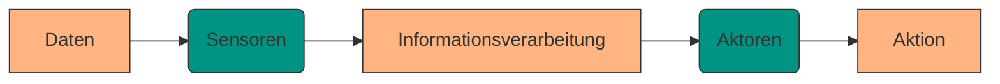
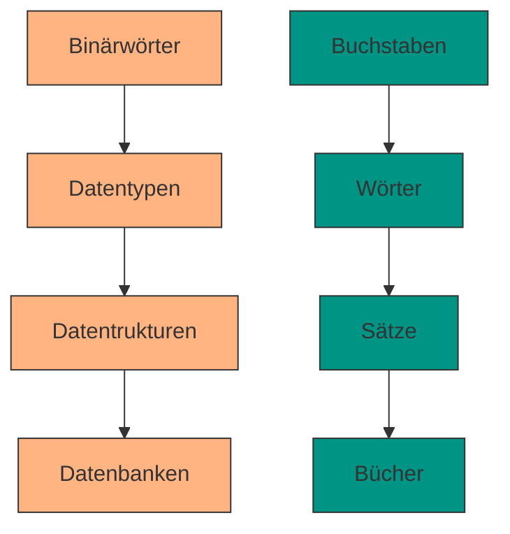

# Datenbankmanagementsysteme (DBMS)

## Datenerfassung

Ein wichtiges Merkmal aller Lebewesen ist es, Daten aus der Umwelt als Information zu verarbeiten und daraus Aktionen abzuleiten.


<div style="text-align: center;">
    
</div>

Das Vorgehen kann dabei in folgende Schritte aufgeteilt werden:





Die Daten die wir dabei erfassen sind Reize der Umgebung welche unter anderem elektromagnetisch, akustisch, chemisch oder mechanisch vorliegen können. Das Nervensystem höherer Lebewesen filtert dabei die Daten um daraus Informationen zu erhalten.  

???+ defi "Daten vs Information"
    **Daten:** Rohwerte, die noch keinen Zusammenhang oder Bedeutung haben.  

    `42` `Anna` `23.09.2025`

    **Information:** Daten, die in einen Kontext gesetzt und interpretiert wurden.  

    `Anna hat am 23.09.2025 um 14:00 Uhr einen Instagram Beitrag erstellt.`


???+ info "Datenmenge Sinnesorgange (nach Zimmermann, 1993)"
    Beim Menschen geschieht dieser Prozess der Datenverarbeitung meist unbewusst. Von den ca. **11,2 Mbit/s**, 
    die unsere Sinnesorgane aufnehmen, gelangen nur etwa **77 Bits/s** ins Bewusstsein 
    (≈ 0,01 ‰).

    | Sinnessystem | Datenrate [bit/s] | Bewusstsein [bit/s] |
    |--------------|-------------------|---------------------|
    | Augen        | 10.000.000        | 40                  |
    | Ohren        | 100.000           | 30                  |
    | Haut         | 1.000.000         | 5                   |
    | Geschmack    | 1.000             | 1 (?)               |
    | Geruch       | 100.000           | 1 (?)               |
    | **Gesamt**   | **11.201.000**    | **77**              |
  
    An einem Tag mit 16 Stunden Helligkeit ergibt sich eine Datenmenge von ~72 GB alleine durch das menschliche Auge. Bewusst wahrgenommen werden allerdings nur ~288 kB.
 
    Zum Vergleich: die geschätzte Speicherkapazität unseres Gehirns beträgt ~60 TB  

Ganz ähnlich wie biologische Organismen verarbeiten auch unsere technischen Informationssysteme Daten zu Information und speichern sie. In der Informatik kommen dabei verschiedene Speicherkonzepte - abhängig von der Menge und Komplexität der Daten - zum Einsatz. 

Bevor wir uns aber verschiedenen Datenbankarchitekturen widmen, müssen noch Grundbegriffe und einfache Konzepte erklärt werden. 

## Die Hierarchie der Speicherkonzepte

Die Speicherung von Daten kann als ein hierarchisches Konzept betrachtet werden



**Binärwörter** bestehen ausschließlich aus Nullen und Einsen. Sie bilden die Grundlage aller Datenspeicherung, denn sämtliche Informationen werden letztlich in Form von Binärwörtern abgelegt. Dies lässt sich mit Texten vergleichen, die auf der Ebene einzelner Buchstaben „gespeichert“ sind. Für sich genommen tragen Binärwörter keine eigene Bedeutung, ermöglichen jedoch die Speicherung beliebiger Datenarten.

Die nächste Abstraktionsstufe sind **Datentypen**, die festlegen, ob ein Binärwort beispielsweise ein Symbol, eine ganze Zahl oder eine Kommazahl darstellt. Sie werden in fester Länge gespeichert und bilden die Basis von Programmiersprachen. Viele dieser Typen sind standardisiert:

- Zeichen werden meist nach dem Unicode-Standard UTF-8 (1 bis 4 Byte, früher ASCII mit 7 Bit) codiert.
- Ganze Zahlen liegen typischerweise als Integer mit 4 Byte vor.
- Kommazahlen werden nach IEEE 754 gespeichert, mit 4 Byte (single/float) oder 8 Byte (double).

???+ question "Aufgabe Datentypen"
    1. Übersetzen Sie nachfolgende UTF-8 Binärdarstellung in lesbaren Text
    
        ```
        01011100 01110101 00110000 00110000 00110100 00111001 01011100
        01110101 00110000 00110000 00110010 00110000 01011100 01110101 
        00110000 00110000 00110110 01100011 01011100 01110101 00110000 
        00110000 00110110 01100110 01011100 01110101 00110000 00110000 
        00110111 00110110 01011100 01110101 00110000 00110000 00110110 
        00110101 01011100 01110101 00110000 00110000 00110010 00110000 
        01011100 01110101 00110000 00110000 00110100 01100100 01011100 
        01110101 00110000 00110000 00110100 00110011 01011100 01110101 
        00110000 00110000 00110100 00111001
        ```

Analog zu Texten, die aus Buchstaben Wörter zusammensetzen, stellen Datentypen die Bausteine für komplexere Strukturen dar.

Diese Werte lassen sich in **Datenstrukturen** organisieren. Ein klassisches Beispiel ist das Array, daneben bieten nahezu alle Programmiersprachen Strukturen wie Listen oder Zuordnungen (Maps) an.

Für die dauerhafte und strukturierte Verwaltung großer, komplexer und oft gemeinschaftlich genutzter Daten reichen einfache Datenstrukturen jedoch nicht aus. Hier kommen **Datenbanken** zum Einsatz. Sie ermöglichen es, Daten persistent zu speichern, den Zugriff mehrerer Nutzer zu koordinieren und individuelle Lese- und Schreibrechte zu vergeben. Je nach Anwendungszweck existieren verschiedene Datenbanktypen:

- relationale Datenbanken auf zentralen Servern,
- verteilte Datenbanken über mehrere Rechner hinweg,
- Graphendatenbanken für netzwerkartige Strukturen.

Der in der Praxis seit den 1970er Jahren dominierende Typ, insbesondere in betriebswirtschaftlichen Anwendungen, ist die relationale Datenbank.

---

## Die ANSI-SPARC-Architektur

Die Entwicklung verlief historisch **von unten nach oben** durch diese Hierarchie.  
In den 1960er Jahren: Speicherung über Arrays, Listen, Maps.  
Ab den 1970ern: immer größere Probleme bei Komplexität → Lösung: **dreischichtige Referenzarchitektur ANSI-SPARC (1975).**

???+ defi "Datenbanksystem"
    Ein **Datenbanksystem** ist ein Softwaresystem zur Speicherung und Verwaltung strukturierter Daten, das die drei Ebenen der ANSI-SPARC-Architektur realisiert:  
    - **Externe Ebene:** Benutzersichten (Masken, Views, Listen)  
    - **Logische Ebene:** Datenmodellierung (ER-Diagramme, Normalisierung)  
    - **Interne Ebene:** Speicherformate, Zugriffskontrolle  

    **DBMS (Datenbankmanagementsystem):** Programme für Zugriff & Verwaltung  
    **Datenbank:** Die gespeicherten Daten selbst  

Vorteil: Jede Schicht kann verändert werden, solange Schnittstellen eingehalten werden.  
Beispiel: TCP/IP-Modell (1973) für das Internet.

---

## Relationen

Ende der 1960er Jahre entwickelte **Edgar F. „Ted“ Codd (IBM)** das **relationale Datenbankmodell**, basierend auf dem mathematischen Konzept der **Relationen**.

???+ defi "Relation"
    Eine Relation \(R\) ist eine Teilmenge des kartesischen Produkts gegebener Mengen:
    \[
    R \subseteq A_1 \times A_2 \times \dots \times A_n
    \]
    Elemente sind \(n\)-Tupel: \((x_1, x_2, \dots, x_n)\) mit \(x_j \in A_j\).

### Beispiel: Pokerkarten

- Farben: \(A_1 = \{\text{Kreuz, Pik, Herz, Karo}\}\)  
- Karten: \(A_2 = \{2,3,\dots,10,\text{Bube, Dame, König, Ass}\}\)  

Kartesisches Produkt \(A_1 \times A_2\): 52 Kombinationen = Pokerblatt.  

Relation \(R\) = ein „Full House“:

\[
R = \{ (\text{Pik}, \text{Ass}), (\text{Kreuz}, \text{Ass}), (\text{Herz}, \text{Ass}), (\text{Herz}, \text{König}), (\text{Karo}, \text{König}) \}
\]

Tabellenform:

| Farbe | Karte  |
|-------|--------|
| Pik   | Ass    |
| Kreuz | Ass    |
| Herz  | Ass    |
| Herz  | König  |
| Karo  | König  |

---

### Relationen und Tabellen

???+ info
    - **Spalten** = Attribute (Felder)  
    - **Zeilen** = Tupel (Datensätze)  
    - Jede Tabelle = endliche Relation (ohne doppelte Zeilen)  
    - Reihenfolge der Zeilen spielt keine Rolle  

| Relationales Modell | Tabellenmodell | Objektmodell |
|----------------------|----------------|--------------|
| Relation             | Tabelle        | Klasse       |
| Attribut             | Spalte / Feld  | Attribut     |
| Tupel                | Zeile / Datensatz | Objekt  |

---

### Relationen-Typ und Schema

???+ defi "Relationentyp / Schema"
    Der Relationstyp ist Kombination aus **Relationname** und **Mengen**:
    \[
    R(A_1, A_2, \dots, A_n)
    \]

    → entspricht dem **Schema** einer Tabelle.  
    Beispiel: *Full House(Farbe, Karte)*

---

## Recap

- Menschen und Computer verarbeiten Daten unterschiedlich, aber beide benötigen **Speicherhierarchien**.  
- ANSI-SPARC-Architektur → Drei-Schichten-Modell: externe, logische, interne Ebene.  
- Relationen = mathematische Grundlage → Tabellen = praktische Darstellung.  
- Das **relationale Modell** ist seit den 1970ern der wichtigste Ansatz (RDBMS).  

???+ question "Quiz: Relation"
    Welche Aussage ist korrekt?

    - [ ] Eine Relation entspricht einer einzelnen Zahl.  
    - [x] Eine Relation ist eine Teilmenge eines kartesischen Produkts.  
    - [ ] Eine Relation kann keine Tabellenform haben.  
