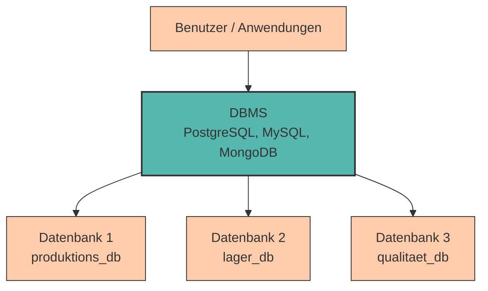

# Einführung in Datenbanken

In den vorherigen Kapiteln haben wir uns mit **[Datenerfassung, -verarbeitung und -speicherung](../data/index.md)** beschäftigt. Wir haben gesehen, wie Daten von Sensoren erfasst, in binärer Form verarbeitet und auf verschiedenen Speichermedien wie RAM, SSD oder HDD gesichert werden.

Doch was passiert, wenn wir **große Datenmengen strukturiert organisieren, effizient durchsuchen und gleichzeitig von mehreren Anwendungen nutzen** möchten? 

<div style="text-align: center;">
    
</div>

Hier stoßen einfache Dateisysteme schnell an ihre Grenzen.

Die Lösung: **Datenbanken** - spezialisierte Systeme zur strukturierten Verwaltung von Daten.

---

## Warum Datenbanken?

Stellen wir uns vor, ein Produktionsbetrieb verwaltet seine Maschinendaten und Wartungsprotokolle in einer **einfachen Excel-Tabelle** oder einer **CSV-Datei**:

```csv
Maschinen-ID,Name,Standort,Anschaffungsjahr,Letzte_Wartung
M001,CNC-Fräse Alpha,Halle A,2019,2024-08-15
M002,Drehbank Beta,Halle A,2021,2024-09-03
M003,Schweißroboter Gamma,Halle B,2020,2024-07-22
```

Das funktioniert am Anfang gut, aber sobald die Daten wachsen oder mehrere Personen gleichzeitig darauf zugreifen möchten, treten Probleme auf:

- **Keine Zugriffskontrolle** - Jeder kann alle Daten sehen und ändern (auch sensible Kostendaten)
- **Datenverlust bei gleichzeitigem Schreiben** - Wenn Wartungstechniker und Schichtleiter gleichzeitig Daten aktualisieren, können Informationen verloren gehen
- **Inkonsistente Daten** - Es gibt keine Regeln, die verhindern, dass ungültige Daten eingegeben werden (z.B. Anschaffungsjahr = 2050)
- **Schwierige Abfragen** - Komplexe Fragen wie "Welche Maschinen in Halle A benötigen in den nächsten 30 Tagen eine Wartung?" sind umständlich
- **Keine Beziehungen** - Verbindungen zwischen Datensätzen (z.B. Maschinen ↔ Wartungsprotokolle ↔ Ersatzteile) lassen sich kaum abbilden

**Datenbanken lösen genau diese Probleme!**

---

## Was ist eine Datenbank?

Bevor wir tiefer einsteigen, klären wir zunächst die grundlegenden Begriffe:

???+ defi "Datenbank"
    Eine **Datenbank** ist eine **organisierte Sammlung von strukturierten Daten**, die elektronisch auf einem Computersystem gespeichert sind. Sie enthält die eigentlichen Informationen - die Inhalte.

    **Beispiele aus dem industriellen Umfeld:**

    - Maschinendaten und Wartungsprotokolle in einer Produktionshalle
    - Lagerbestandsdaten und Materialfluss in einem Logistikzentrum
    - Produktionsdaten und Qualitätskennzahlen (OEE, Ausschuss, Durchlaufzeiten)
    - Lieferanten- und Bestelldaten im Einkauf

Man kann sich eine Datenbank wie eine **digitale Ablage** vorstellen: Die Daten sind in einer bestimmten Struktur organisiert (z. B. in Tabellen, Dokumenten oder Graphen), damit sie effizient gespeichert, gefunden und verarbeitet werden können.

**Wichtig:** Eine Datenbank ist **nicht dasselbe** wie eine einfache Datei (z. B. Excel, CSV). Sie ist speziell für die Verwaltung großer, komplexer Datenmengen konzipiert und bietet Funktionen wie:

- **Strukturierte Organisation** - Daten sind logisch geordnet (z. B. in Tabellen mit Spalten und Zeilen)
- **Beziehungen** - Verknüpfungen zwischen verschiedenen Datensätzen (z. B. Maschinen ↔ Wartungsprotokolle ↔ Ersatzteile)
- **Persistenz** - Daten bleiben dauerhaft erhalten, auch nach dem Neustart des Systems

---

## Datenbank vs. Datenbankmanagementsystem

Die Begriffe **Datenbank** und **Datenbankmanagementsystem** werden oft synonym verwendet, haben aber eine wichtige Unterscheidung:

???+ defi "Datenbankmanagementsystem (DBMS)"
    Ein **Datenbankmanagementsystem (DBMS)** ist die **Software**, die Datenbanken erstellt, verwaltet und den Zugriff darauf ermöglicht. Es ist die "Verwaltungszentrale", die zwischen den Anwendungen und den Daten vermittelt.



**Unterschied auf einen Blick:**

<div style="text-align:center; max-width:900px; margin:16px auto;">
<table role="table" aria-label="Datenbank vs DBMS"
        style="width:100%; border-collapse:separate; border-spacing:0; border:1px solid #cfd8e3; border-radius:10px; overflow:hidden; font-family:system-ui,Segoe UI,Roboto,Arial,sans-serif;">
    <thead>
    <tr style="background:#009485; color:#fff;">
        <th style="text-align:left; padding:12px 14px; font-weight:700;"></th>
        <th style="text-align:left; padding:12px 14px; font-weight:700;">Datenbank</th>
        <th style="text-align:left; padding:12px 14px; font-weight:700;">DBMS</th>
    </tr>
    </thead>
    <tbody>
    <tr>
        <td style="background:#00948511; text-align:left; padding:10px 14px;"><strong>Was ist es?</strong></td>
        <td style="text-align:left; padding:10px 14px;">Die <strong>Daten selbst</strong></td>
        <td style="text-align:left; padding:10px 14px;">Die <strong>Software zur Verwaltung</strong></td>
    </tr>
    <tr>
        <td style="background:#00948511; text-align:left; padding:10px 14px;"><strong>Beispiel</strong></td>
        <td style="text-align:left; padding:10px 14px;"><code>produktions_db</code>, <code>lager_db</code></td>
        <td style="text-align:left; padding:10px 14px;">PostgreSQL, MySQL, MongoDB</td>
    </tr>
    <tr>
        <td style="background:#00948511; text-align:left; padding:10px 14px;"><strong>Analogie</strong></td>
        <td style="text-align:left; padding:10px 14px;">Die Teile im Lager</td>
        <td style="text-align:left; padding:10px 14px;">Das Lagerverwaltungssystem (ERP, Bestandsführung, Nachverfolgung)</td>
    </tr>
    <tr>
        <td style="background:#00948511; text-align:left; padding:10px 14px;"><strong>Funktion</strong></td>
        <td style="text-align:left; padding:10px 14px;">Speichert die Informationen</td>
        <td style="text-align:left; padding:10px 14px;">Ermöglicht Zugriff, Sicherheit, Abfragen</td>
    </tr>
    </tbody>
</table>
</div>

**Was macht ein DBMS?**

Ein DBMS bietet eine Vielzahl von Funktionen, die weit über einfache Dateispeicherung hinausgehen:

- **Datenverwaltung** - Strukturiertes Speichern in Tabellen, Dokumenten oder Graphen
- **Zugriffskontrolle** - Wer darf welche Daten sehen oder ändern?
- **Konsistenzsicherung** - Nur gültige Daten werden gespeichert (z. B. keine negativen Semester)
- **Mehrbenutzerzugriff** - Mehrere Benutzer können gleichzeitig arbeiten, ohne sich gegenseitig zu stören
- **Transaktionsverwaltung** - Änderungen werden atomar durchgeführt (alles oder nichts)
- **Abfragesprache** - SQL ermöglicht flexible und mächtige Datenabfragen
- **Datensicherheit** - Backups, Wiederherstellung bei Fehlern
- **Performance-Optimierung** - Indizes und Caching für schnelle Abfragen


Das DBMS ist die **Vermittlungsschicht** zwischen Anwendungen und den eigentlichen Daten. Es sorgt dafür, dass alle Zugriffe koordiniert, sicher und effizient ablaufen.

???+ example "Beispiel: Produktionsdatenbank"

    - **Die Datenbank** (z.B. `produktions_db`) enthält alle Maschinendaten, Wartungsprotokolle, Produktionsaufträge etc.
    - **Das DBMS** (z.B. PostgreSQL) verwaltet diese Datenbank:
        - Stellt sicher, dass keine ungültigen Maschinen-IDs oder unmögliche Wartungsdaten eingegeben werden
        - Erlaubt der Instandhaltung, Wartungsprotokolle zu aktualisieren
        - Ermöglicht dem Schichtleiter, Produktionsdaten abzurufen (aber keine Wartungskosten einzusehen!)
        - Sorgt dafür, dass bei gleichzeitigen Zugriffen von MES, ERP und Wartungs-Apps keine Daten verloren gehen

---

## PostgreSQL - Unser Werkzeug

In diesem Kurs verwenden wir **PostgreSQL**, eines der leistungsfähigsten und beliebtesten **relationalen Datenbankmanagementsysteme** (RDBMS) (was dies bedeutet, erfahren wir in einem späteren Kapitel).

???+ adv "Vorteile von PostgreSQL"

    - **Open Source & kostenlos** - Kann von jedem frei verwendet werden
    - **Plattformunabhängig** - Läuft auf Windows, macOS und Linux
    - **Hohe Datenintegrität** - Strenge Einhaltung von SQL-Standards
    - **Leistungsstark** - Auch für große Datenmengen geeignet
    - **Weit verbreitet** - Wird in der Industrie häufig eingesetzt


PostgreSQL speichert Daten in **Tabellen** - ähnlich wie Excel, aber mit viel mehr Funktionen und Sicherheit.

---

### Installation & Setup

Bevor wir mit Datenbanken arbeiten können, müssen wir **PostgreSQL** und ein **Client-Tool** installieren.

???+ question "Installation, Setup & erster Test"
    Nachfolgend werden wir sehen, wie wir alle notwendigen Tools zum Umgang mit PostgreSQL aufsetzen und auch testen können. Folge der Anleitung und versuche alle Schritte erfolgreich durchzuführen. 

#### Schritt 1: PostgreSQL installieren


=== ":fontawesome-brands-windows: Windows"

    1. Lade den Installer von [postgresql.org/download/windows](https://www.postgresql.org/download/windows/) herunter (beim Erstellen der Unterlagen Version 18)
    2. Führe die Installation aus (alle Standardeinstellungen sind OK)
    3. **Wichtig:** Notiere dir das Passwort für den Benutzer `postgres`!
    4. Port: `5432` (Standard)

    **Installationsschritte:**

    <div class="image-slideshow" markdown="1">
        <div class="slideshow-container">
            <div class="slideshow-slide active" style="text-align: center;">
                
            </div>
            <div class="slideshow-slide" style="text-align: center;">
                
            </div>
            <div class="slideshow-slide" style="text-align: center;">
                
            </div>
            <div class="slideshow-slide" style="text-align: center;">
                
            </div>
            <div class="slideshow-slide" style="text-align: center;">
                
                <div class="slide-caption">==ACHTUNG: Passwort merken==</div>
            </div>
            <div class="slideshow-slide" style="text-align: center;">
                
            </div>
            <div class="slideshow-slide" style="text-align: center;">
                
            </div>
            <div class="slideshow-slide" style="text-align: center;">
                
            </div>
            <div class="slideshow-slide" style="text-align: center;">
                
            </div>
            <div class="slideshow-slide" style="text-align: center;">
                
            </div>
        </div>
        <div class="slideshow-nav">
            <button class="slideshow-btn slideshow-prev">← Zurück</button>
            <div class="slideshow-counter">Schritt 1 von 2</div>
            <button class="slideshow-btn slideshow-next">Weiter →</button>
        </div>
        <div class="keyboard-hint">💡 Tipp: Nutze Pfeiltasten ← → zum Navigieren</div>
    </div>
    **Installation kontrollieren:**

    1. Suche in der Windows Suchleiste nach **psql**. Es öffnet sich ein Shell Fenster.
    2. Hier müssen wir mehrere Informationen eingeben. Dabei können alle Standardeinstellungen übernommen werden (einfach Enter klicken). Lediglich bei *Password* müssen wir unser in der Installation gewähltes Passwort eingeben. 
    3. Anschließend geben wir folgenden Befehl ein
    ```sql
    SELECT version();
    ```
    4. Als Ergebnis sollte die installierte Version wie nachfolgend angeführt werden.

    <div style="text-align: center;">
        
    </div>

=== ":fontawesome-brands-apple: macOS"
    
    
    XXXX FOLGT XXXX


---

#### Schritt 2: Client-Tool installieren

Um mit PostgreSQL zu arbeiten, können wir neben der Komandozeile (CLI) auch ein **Client-Tool** verwenden. Der Vorteil besteht darin, dass das Client-Tool eine grafische Oberfläche (GUI) besitzt und wir uns gewisse Dinge auch grafisch darstellen lassen können. Wir verwenden **pgAdmin 4** - das offizielle, kostenlose PostgreSQL-Verwaltungstool. 

???+ info "CLI vs GUI"
    Wir werden in weiterer Folge vermehrt die Komandozeile verwenden. Dabei ist es uns möglich, die benötigten Befehle kennenzulernen und diese auch besser zu verstehen. Spätestens wenn man in Zukunft eine Software rund um die Datenbank bauen möchte (sei es mit Python oder Javascript) werden diese Befehle benötigt. Das Client-Tool verwenden wir zur Kontrolle und zum besseren Verständnis.

**pgAdmin 4 installieren**

=== ":fontawesome-brands-windows: Windows"

    1. Gehe zu [pgadmin.org/download](https://www.pgadmin.org/download/)
    2. Wähle dein Betriebssystem (Windows)
    3. Lade den Installer herunter (beim Erstellen der Unterlagen Version 9.9)
    4. Führe die Installation aus (alle Standardeinstellungen sind OK)

    <div class="image-slideshow" markdown="1">
        <div class="slideshow-container">
            <div class="slideshow-slide active" style="text-align: center;">
                
            </div>
            <div class="slideshow-slide" style="text-align: center;">
                
            </div>
            <div class="slideshow-slide" style="text-align: center;">
                
            </div>
            <div class="slideshow-slide" style="text-align: center;">
                
            </div>
            <div class="slideshow-slide" style="text-align: center;">
                
            </div>
            <div class="slideshow-slide" style="text-align: center;">
                
            </div>
        </div>
        <div class="slideshow-nav">
            <button class="slideshow-btn slideshow-prev">← Zurück</button>
            <div class="slideshow-counter"> </div>
            <button class="slideshow-btn slideshow-next">Weiter →</button>
        </div>
        <div class="keyboard-hint">💡 Tipp: Nutze Pfeiltasten ← → zum Navigieren</div>
    </div>

=== ":fontawesome-brands-apple: macOS"
    
    
    XXXX FOLGT XXXX

---

#### Schritt 3: Erste Verbindung herstellen

Jetzt verbinden wir pgAdmin mit unserer PostgreSQL-Datenbank.

1. **pgAdmin 4 öffnen**
2. In der linken Sidebar: Bei "Servers" auf den Pfeil klicken, um bereits verfügbare Server aufzulisten.
3. Da wir bei der Installation von PostgreSQL bereits eine lokalen Server erzeugt haben, sollte hier nun bereits 'PostgreSQL 18' stehen. 
4. Nach Eingabe des Passworts (welches wir bei der Installation gewählt haben) sind wir erfolgreich mit dem Server verbunden.

    <div class="image-slideshow" markdown="1">
        <div class="slideshow-container">
            <div class="slideshow-slide active" style="text-align: center;">
                
            </div>
            <div class="slideshow-slide" style="text-align: center;">
                
            </div>
            <div class="slideshow-slide" style="text-align: center;">
                
            </div>
        </div>
        <div class="slideshow-nav">
            <button class="slideshow-btn slideshow-prev">← Zurück</button>
            <div class="slideshow-counter"> </div>
            <button class="slideshow-btn slideshow-next">Weiter →</button>
        </div>
        <div class="keyboard-hint">💡 Tipp: Nutze Pfeiltasten ← → zum Navigieren</div>
    </div>


???+ tip "Verbindungsprobleme?"
    Wenn die Verbindung fehlschlägt, prüfe:

    - Läuft PostgreSQL? (Windows: Task-Manager → Dienste → "postgresql-x64-XX", macOS/Linux: `pg_isready`)
    - Ist das **PostgreSQL-Passwort** korrekt
    - Ist Port 5432 frei und nicht von einer Firewall blockiert?

---

## Deine erste Datenbank

Jetzt erstellen wir unsere erste eigene Datenbank! 

In pgAdmin klicken wir auf der linken Seite auf 'PSQL Tool Workspace' und wählen unseren bereits existierenden Server aus. Anschließend klicken wir auf 'Connect & Open PSQL' (es kann sein, dass wir nochmals das Passwort eingeben müssen)

<div style="text-align: center;">
    
</div>

Nun sind wir wieder in unserer Komandozeilen Darstellung und können einen ersten SQL-Befehl kennenlernen: 

```sql
CREATE DATABASE produktions_db;
```

???+ defi "Was ist SQL?"
    **SQL (Structured Query Language)** ist die Sprache, mit der wir mit Datenbanken kommunizieren. Alle Befehle - vom Erstellen einer Tabelle bis zur Abfrage von Daten - werden in SQL geschrieben.


Wenn man sich den Befehl ansieht, erkennt man, dass eine neue Datenbank erzeugt werden soll und diese den namen `produktions_db` haben soll. Wenn wir diesen Befehl in die Komandozeile eingeben, wird die neue Datenbank erstellt. 

<div style="text-align: center;">
    
</div>

Wenn wir wieder in die vorige Darstellung von pgAdmin wechseln (Default Workspace) sollen wir nun unter *PostgreSQL 18* > *Databases* unsere neue Datenbank sehen. 

???+ info "Refresh"
    Wenn die neu erzeugte Datenbank nicht angezeigt wird, kann es daran liegen, dass die Darstellung noch nicht aktualisiert wurde. Durch Rechtsklick auf *PostgreSQL 18* kann man *Refresh* auswählen (oder Taste F5)

<div style="text-align: center;">
    
</div>

**🎉 Gratulation:** Du hast nun deine erste Datenbank erstellt. 

---

## Zusammenfassung 📌

- **Datenbanken** lösen die Probleme einfacher Dateispeicherung: strukturierte Datenhaltung, Zugriffskontrolle, Konsistenz, gleichzeitige Zugriffe
- Ein **DBMS** (Datenbankmanagementsystem) verwaltet und koordiniert alle Zugriffe auf die Daten
- **PostgreSQL** ist ein mächtiges, kostenloses und weit verbreitetes relationales DBMS
- **pgAdmin 4** ist das offizielle PostgreSQL-Verwaltungstool mit grafischer Oberfläche und Query-Editor
- **SQL** ist die Sprache, mit der wir Datenbanken abfragen und manipulieren
- Du hast PostgreSQL und pgAdmin installiert, eine Verbindung hergestellt und deine erste Datenbank erstellt

---

Im nächsten Kapitel lernen wir das **relationale Modell** kennen - wie Daten in Tabellen organisiert werden und welche Datentypen PostgreSQL bietet. Wir werden unsere erste Tabelle erstellen und Daten einfügen!

<div style="text-align: center;">
    
</div>