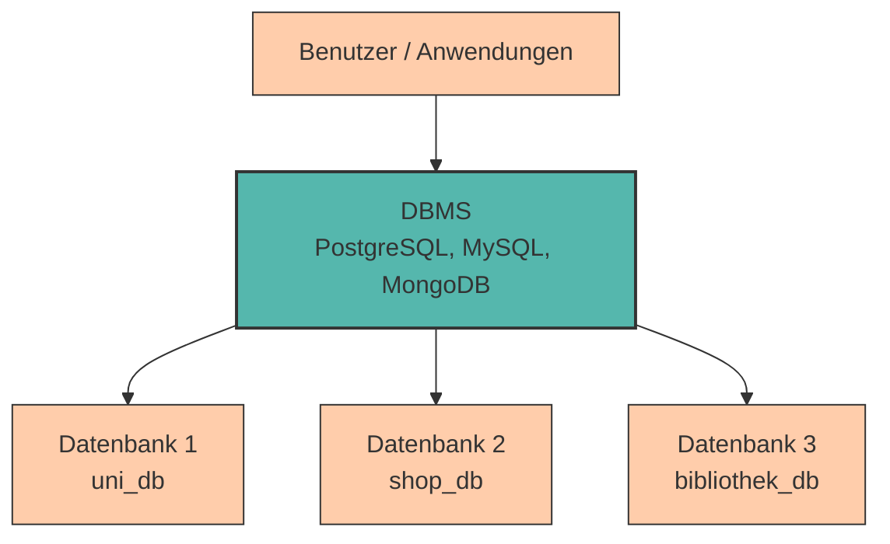

# Einführung in Datenbanken

In den vorherigen Kapiteln haben wir uns mit **Datenerfassung, -verarbeitung und -speicherung** beschäftigt. Wir haben gesehen, wie Daten von Sensoren erfasst, in binärer Form verarbeitet und auf verschiedenen Speichermedien wie RAM, SSD oder HDD gesichert werden.

Doch was passiert, wenn wir **große Datenmengen strukturiert organisieren, effizient durchsuchen und gleichzeitig von mehreren Anwendungen nutzen** möchten? Hier stoßen einfache Dateisysteme schnell an ihre Grenzen.

Die Lösung: **Datenbanken** – spezialisierte Systeme zur strukturierten Verwaltung von Daten.

---

## Warum Datenbanken?

Stellen wir uns vor, eine Universität verwaltet ihre Studierendendaten in einer **einfachen Excel-Tabelle** oder einer **CSV-Datei**:

```csv
Matrikelnummer,Name,Studiengang,Semester
12345,Anna Müller,Informatik,3
12346,Max Schmidt,BWL,2
12347,Lisa Weber,Informatik,5
```

Das funktioniert am Anfang gut, aber sobald die Daten wachsen oder mehrere Personen gleichzeitig darauf zugreifen möchten, treten Probleme auf:

- **Keine Zugriffskontrolle** – Jeder kann alle Daten sehen und ändern
- **Datenverlust bei gleichzeitigem Schreiben** – Wenn zwei Personen gleichzeitig speichern, können Daten verloren gehen
- **Inkonsistente Daten** – Es gibt keine Regeln, die verhindern, dass ungültige Daten eingegeben werden (z.B. Semester = -5)
- **Schwierige Abfragen** – Komplexe Fragen wie "Welche Informatik-Studierenden sind im 3. Semester?" sind umständlich
- **Keine Beziehungen** – Verbindungen zwischen Datensätzen (z.B. Studierende ↔ Kurse) lassen sich kaum abbilden

**Datenbanken lösen genau diese Probleme!**

---

## Was ist eine Datenbank?

Bevor wir tiefer einsteigen, klären wir zunächst die grundlegenden Begriffe:

???+ defi "Datenbank (Database)"
    Eine **Datenbank** ist eine **organisierte Sammlung von strukturierten Daten**, die elektronisch auf einem Computersystem gespeichert sind. Sie enthält die eigentlichen Informationen – die Inhalte.

    **Beispiele:**

    - Eine Sammlung von Studierendendaten (Namen, Matrikelnummern, Studiengänge)
    - Alle Produktinformationen eines Online-Shops
    - Patientenakten in einem Krankenhaus
    - Buchbestände einer Bibliothek

Man kann sich eine Datenbank wie eine **digitale Ablage** vorstellen: Die Daten sind in einer bestimmten Struktur organisiert (z. B. in Tabellen, Dokumenten oder Graphen), damit sie effizient gespeichert, gefunden und verarbeitet werden können.

**Wichtig:** Eine Datenbank ist **nicht dasselbe** wie eine einfache Datei (z. B. Excel, CSV). Sie ist speziell für die Verwaltung großer, komplexer Datenmengen konzipiert und bietet Funktionen wie:

- **Strukturierte Organisation** – Daten sind logisch geordnet (z. B. in Tabellen mit Spalten und Zeilen)
- **Beziehungen** – Verknüpfungen zwischen verschiedenen Datensätzen (z. B. Studierende ↔ Kurse)
- **Persistenz** – Daten bleiben dauerhaft erhalten, auch nach dem Neustart des Systems

---

## Datenbank vs. Datenbankmanagementsystem

Die Begriffe **Datenbank** und **Datenbankmanagementsystem** werden oft synonym verwendet, haben aber eine wichtige Unterscheidung:

???+ defi "Datenbankmanagementsystem (DBMS)"
    Ein **Datenbankmanagementsystem (DBMS)** ist die **Software**, die Datenbanken erstellt, verwaltet und den Zugriff darauf ermöglicht. Es ist die "Verwaltungszentrale", die zwischen den Anwendungen und den Daten vermittelt.



**Unterschied auf einen Blick:**

<div style="text-align:center; max-width:900px; margin:16px auto;">
<table role="table" aria-label="Datenbank vs DBMS"
        style="width:100%; border-collapse:separate; border-spacing:0; border:1px solid #cfd8e3; border-radius:10px; overflow:hidden; font-family:system-ui,Segoe UI,Roboto,Arial,sans-serif;">
    <thead>
    <tr style="background:#009485; color:#fff;">
        <th style="text-align:left; padding:12px 14px; font-weight:700;"></th>
        <th style="text-align:left; padding:12px 14px; font-weight:700;">Datenbank</th>
        <th style="text-align:left; padding:12px 14px; font-weight:700;">DBMS</th>
    </tr>
    </thead>
    <tbody>
    <tr>
        <td style="background:#00948511; text-align:left; padding:10px 14px;"><strong>Was ist es?</strong></td>
        <td style="text-align:left; padding:10px 14px;">Die <strong>Daten selbst</strong></td>
        <td style="text-align:left; padding:10px 14px;">Die <strong>Software zur Verwaltung</strong></td>
    </tr>
    <tr>
        <td style="background:#00948511; text-align:left; padding:10px 14px;"><strong>Beispiel</strong></td>
        <td style="text-align:left; padding:10px 14px;"><code>uni_db</code>, <code>shop_db</code></td>
        <td style="text-align:left; padding:10px 14px;">PostgreSQL, MySQL, MongoDB</td>
    </tr>
    <tr>
        <td style="background:#00948511; text-align:left; padding:10px 14px;"><strong>Analogie</strong></td>
        <td style="text-align:left; padding:10px 14px;">Die Bücher in einer Bibliothek</td>
        <td style="text-align:left; padding:10px 14px;">Das Bibliothekssystem (Katalog, Ausleihe, Verwaltung)</td>
    </tr>
    <tr>
        <td style="background:#00948511; text-align:left; padding:10px 14px;"><strong>Funktion</strong></td>
        <td style="text-align:left; padding:10px 14px;">Speichert die Informationen</td>
        <td style="text-align:left; padding:10px 14px;">Ermöglicht Zugriff, Sicherheit, Abfragen</td>
    </tr>
    </tbody>
</table>
</div>

**Was macht ein DBMS?**

Ein DBMS bietet eine Vielzahl von Funktionen, die weit über einfache Dateispeicherung hinausgehen:

- **Datenverwaltung** – Strukturiertes Speichern in Tabellen, Dokumenten oder Graphen
- **Zugriffskontrolle** – Wer darf welche Daten sehen oder ändern?
- **Konsistenzsicherung** – Nur gültige Daten werden gespeichert (z. B. keine negativen Semester)
- **Mehrbenutzerzugriff** – Mehrere Benutzer können gleichzeitig arbeiten, ohne sich gegenseitig zu stören
- **Transaktionsverwaltung** – Änderungen werden atomar durchgeführt (alles oder nichts)
- **Abfragesprache** – SQL ermöglicht flexible und mächtige Datenabfragen
- **Datensicherheit** – Backups, Wiederherstellung bei Fehlern
- **Performance-Optimierung** – Indizes und Caching für schnelle Abfragen


Das DBMS ist die **Vermittlungsschicht** zwischen Anwendungen und den eigentlichen Daten. Es sorgt dafür, dass alle Zugriffe koordiniert, sicher und effizient ablaufen.

???+ example "Beispiel: Universitätsdatenbank"

    - **Die Datenbank** (z.B. `uni_db`) enthält alle Studierendendaten, Kursinformationen, Noten etc.
    - **Das DBMS** (z.B. PostgreSQL) verwaltet diese Datenbank:
        - Stellt sicher, dass keine ungültigen Matrikelnummern eingegeben werden
        - Erlaubt dem Sekretariat, Studierendendaten zu ändern
        - Ermöglicht Studierenden, ihre Noten abzurufen (aber nicht zu ändern!)
        - Sorgt dafür, dass bei 1000 gleichzeitigen Anfragen keine Daten verloren gehen

---

## PostgreSQL – Unser Werkzeug

In diesem Kurs verwenden wir **PostgreSQL**, eines der leistungsfähigsten und beliebtesten **relationalen Datenbankmanagementsysteme (RDBMS)** (was dies bedeutet, erfahren wir in einem späteren Kapitel).

???+ adv "Vorteile von PostgreSQL"

    - **Open Source & kostenlos** – Kann von jedem frei verwendet werden
    - **Plattformunabhängig** – Läuft auf Windows, macOS und Linux
    - **Hohe Datenintegrität** – Strenge Einhaltung von SQL-Standards
    - **Leistungsstark** – Auch für große Datenmengen geeignet
    - **Weit verbreitet** – Wird in der Industrie häufig eingesetzt


PostgreSQL speichert Daten in **Tabellen** – ähnlich wie Excel, aber mit viel mehr Funktionen und Sicherheit.

---

## Installation & Setup

Bevor wir mit Datenbanken arbeiten können, müssen wir PostgreSQL und ein **Client-Tool** installieren.

### Schritt 1: PostgreSQL installieren


=== ":fontawesome-brands-windows: Windows"

    1. Lade den Installer von [postgresql.org/download/windows](https://www.postgresql.org/download/windows/) herunter
    2. Führe die Installation aus (alle Standardeinstellungen sind OK)
    3. **Wichtig:** Notiere dir das Passwort für den Benutzer `postgres`!
    4. Port: `5432` (Standard)


=== ":fontawesome-brands-apple: macOS"
    
    
    **Option 1: Mit Homebrew (empfohlen)**

    ```bash
    brew install postgresql@16
    brew services start postgresql@16
    ```

    **Option 2: Mit Postgres.app**

    1. Lade [Postgres.app](https://postgresapp.com/) herunter
    2. Ziehe die App in den Programme-Ordner
    3. Starte Postgres.app


---

### Schritt 2: Client-Tool installieren

Um mit PostgreSQL zu arbeiten, benötigen wir ein **Client-Tool**. Wir empfehlen **DBeaver Community Edition** – ein kostenloser, plattformunabhängiger Datenbank-Client.

**DBeaver installieren**

1. Gehe zu [dbeaver.io](https://dbeaver.io/download/)
2. Lade die **Community Edition** für dein Betriebssystem herunter
3. Installiere DBeaver

???+ tip "Alternative: pgAdmin 4"
    [pgAdmin 4](https://www.pgadmin.org/) ist das offizielle PostgreSQL-Tool. Es ist etwas komplexer, bietet aber mehr Funktionen für fortgeschrittene Anwendungen.

---

### Schritt 3: Erste Verbindung herstellen

Jetzt verbinden wir DBeaver mit unserer PostgreSQL-Datenbank.

1. **DBeaver öffnen**
2. Klicke auf **"Neue Verbindung"** (das Stecker-Symbol)
3. Wähle **PostgreSQL** aus
4. Gib folgende Daten ein:

   ```
   Host: localhost
   Port: 5432
   Database: postgres
   Benutzername: postgres
   Passwort: [dein Passwort]
   ```

5. Klicke auf **"Verbindung testen"**
6. Bei Erfolg: **"Fertigstellen"**

???+ tip "Verbindungsprobleme?"
    Wenn die Verbindung fehlschlägt, prüfe:

    - Läuft PostgreSQL? (Windows: Task-Manager, macOS/Linux: `pg_isready`)
    - Ist das Passwort korrekt?
    - Ist Port 5432 frei?

---

## Deine erste Datenbank

Jetzt erstellen wir unsere erste eigene Datenbank!

### In DBeaver

1. **Rechtsklick** auf "Datenbanken" in der linken Seitenleiste
2. Wähle **"Neue Datenbank erstellen"**
3. Name: `uni_db`
4. Klicke auf **"OK"**

### Mit SQL (optional)

Alternativ kannst du die Datenbank auch mit einem **SQL-Befehl** erstellen. Öffne dazu ein neues **SQL-Editor-Fenster** in DBeaver und führe aus:

```sql
CREATE DATABASE uni_db;
```

???+ defi "Was ist SQL?"
    **SQL (Structured Query Language)** ist die Sprache, mit der wir mit Datenbanken kommunizieren. Alle Befehle – vom Erstellen einer Tabelle bis zur Abfrage von Daten – werden in SQL geschrieben.

---

## Verifizierung: Funktioniert alles?

Führe folgenden Test-Befehl aus, um zu prüfen, ob alles funktioniert:

```sql
SELECT version();
```

Du solltest eine Ausgabe sehen wie:

```
PostgreSQL 16.1 on x86_64-apple-darwin, compiled by ...
```

???+ success "Glückwunsch!"
    Deine Datenbank-Umgebung ist einsatzbereit! 🎉

---

## Zusammenfassung 📌

- **Datenbanken** lösen die Probleme einfacher Dateispeicherung: strukturierte Datenhaltung, Zugriffskontrolle, Konsistenz, gleichzeitige Zugriffe
- Ein **DBMS** (Datenbankmanagementsystem) verwaltet und koordiniert alle Zugriffe auf die Daten
- **PostgreSQL** ist ein mächtiges, kostenloses und weit verbreitetes relationales DBMS
- **DBeaver Community** ist ein benutzerfreundliches Tool zum Arbeiten mit Datenbanken (plattformunabhängig)
- **SQL** ist die Sprache, mit der wir Datenbanken abfragen und manipulieren
- Du hast PostgreSQL installiert, eine Verbindung hergestellt und deine erste Datenbank erstellt

---

Im nächsten Kapitel lernen wir das **relationale Modell** kennen – wie Daten in Tabellen organisiert werden und welche Datentypen PostgreSQL bietet. Wir werden unsere erste Tabelle erstellen und Daten einfügen!
