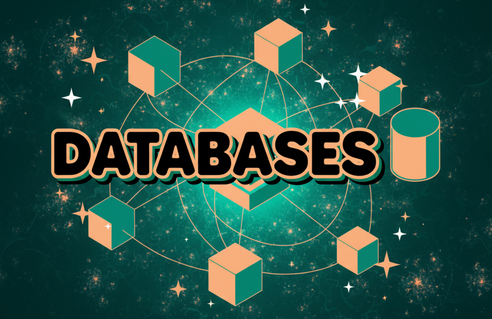

# Home

    

Willkommen zu unserem Kurs `Datenbanken`! :waving_hand:

???+ info "Resources"
    Dieser Kurs basiert auf den folgenden Vorlesungsunterlagen:

    [Datenbanken - Andreas de Vries; Fachhochschule Südwestfalen](https://www.fh-swf.de/media/neu_np/fb_tbw_1/dozentinnen_2/professorinnen_5/devries_1/Datenbanken.pdf) (Lizenz CC By 4.0, Version 17.01.2025)

    Zur Ausarbeitung der Unterlagen wurden generative Tools unterstützend eingesetzt