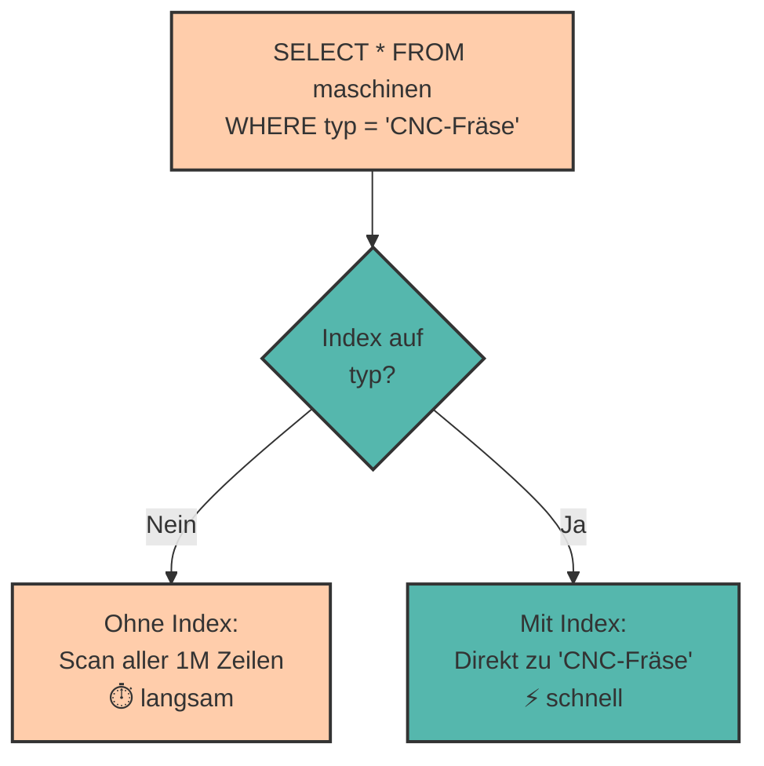

# Indizes & Performance-Grundlagen

Du hast eine Datenbank mit 1 Million Maschinen. Wie lange dauert es, eine bestimmte Maschine zu finden?

**Ohne Index:** Die Datenbank muss **alle** 1 Million Zeilen durchsuchen – das kann Sekunden dauern!
**Mit Index:** Die Datenbank findet den Eintrag in **Millisekunden**!

Indizes sind wie das **Inhaltsverzeichnis** in einem Buch – sie beschleunigen die Suche dramatisch.

---

## Was ist ein Index?

Ein **Index** ist eine **Datenstruktur**, die es der Datenbank ermöglicht, Daten **schnell zu finden**, ohne die gesamte Tabelle durchsuchen zu müssen.

### Analogie: Maschinen-Register

```
Ohne Index (unsortiert):          Mit Index (alphabetisch sortiert):
─────────────────────────         ───────────────────────────────────
Drehbank Beta                     CNC-Fräse Alpha  ← Schnell gefunden!
Schweißroboter Gamma              Drehbank Beta
Stanzmaschine Delta               Schweißroboter Gamma
CNC-Fräse Alpha  ← Wo ist sie?   Stanzmaschine Delta
```

Im Register sind die Namen **alphabetisch sortiert** – das ist ein Index! Du musst nicht alle Einträge durchsuchen, sondern kannst direkt zu "C" springen.

---

## Wie funktioniert ein Index?

Ein Index erstellt eine **sortierte Datenstruktur** (meist ein **B-Tree**), die auf eine oder mehrere Spalten zeigt.



### Technisch: B-Tree Struktur

Indizes verwenden meist **B-Trees** (balancierte Bäume), die Suchen in **O(log n)** Zeit ermöglichen:

- 1.000 Zeilen → ~10 Vergleiche
- 1.000.000 Zeilen → ~20 Vergleiche
- 1.000.000.000 Zeilen → ~30 Vergleiche

---

## Index erstellen

### Syntax

```sql
CREATE INDEX indexname ON tabellenname (spalte);
```

### Beispiel: Index auf Typ

```sql
CREATE INDEX idx_typ ON maschinen (typ);
```

Jetzt sind Abfragen nach `typ` **viel schneller**:

```sql
-- Diese Abfrage ist jetzt blitzschnell!
SELECT * FROM maschinen WHERE typ = 'CNC-Fräse';
```

### Index auf mehrere Spalten

```sql
CREATE INDEX idx_typ_standort ON maschinen (typ, standort);
```

Dieser Index hilft bei:

```sql
-- Nutzt den Index
SELECT * FROM maschinen WHERE typ = 'CNC-Fräse';

-- Nutzt den Index vollständig
SELECT * FROM maschinen WHERE typ = 'CNC-Fräse' AND standort = 'Halle A';

-- Nutzt den Index NICHT (standort ist nicht am Anfang)
SELECT * FROM maschinen WHERE standort = 'Halle A';
```

<div style="background:#FFB48211; border-left:4px solid #FFB482; padding:12px 16px; margin:16px 0;">
<strong>📘 Regel bei Multi-Column-Indizes:</strong><br>
Der Index funktioniert nur, wenn die <strong>erste Spalte</strong> in der WHERE-Klausel vorkommt. Ein Index auf <code>(typ, standort)</code> hilft nicht bei <code>WHERE standort = 'Halle A'</code>.
</div>

---

## Wann sind Indizes sinnvoll?

### ✅ Indizes sind hilfreich für:

- **WHERE-Klauseln** – Häufig gefilterte Spalten
- **JOIN-Bedingungen** – Fremdschlüssel sollten IMMER einen Index haben
- **ORDER BY** – Sortierte Abfragen
- **Große Tabellen** – Ab ~1000 Zeilen macht ein Index Sinn

### ❌ Indizes sind NICHT hilfreich für:

- **Kleine Tabellen** (< 100 Zeilen) – Der Overhead lohnt sich nicht
- **Spalten mit wenigen unterschiedlichen Werten** – z.B. `geschlecht` (nur 2-3 Werte)
- **Häufig geänderte Spalten** – Der Index muss ständig aktualisiert werden
- **Selten abgefragte Spalten** – Kein Nutzen bei seltener Verwendung

---

## Primärschlüssel und Indizes

**Wichtig:** Primärschlüssel haben **automatisch einen Index**!

```sql
CREATE TABLE maschinen (
    maschinen_id SERIAL PRIMARY KEY,  -- Hat automatisch einen Index!
    name VARCHAR(100),
    typ VARCHAR(50)
);
```

Abfragen nach `maschinen_id` sind daher immer schnell:

```sql
-- Automatisch optimiert durch PRIMARY KEY Index
SELECT * FROM maschinen WHERE maschinen_id = 1;
```

---

## Unique-Constraint und Indizes

Auch **UNIQUE** Constraints erstellen automatisch einen Index:

```sql
CREATE TABLE maschinen (
    maschinen_id SERIAL PRIMARY KEY,
    seriennummer VARCHAR(50) UNIQUE  -- Hat automatisch einen Index!
);
```

---

## Foreign Keys und Indizes

**Wichtig:** Fremdschlüssel haben in PostgreSQL **NICHT automatisch** einen Index!

```sql
CREATE TABLE maschinen (
    maschinen_id SERIAL PRIMARY KEY,
    name VARCHAR(100),
    techniker_id INTEGER,
    FOREIGN KEY (techniker_id) REFERENCES techniker(techniker_id)
);
```

**Problem:** JOINs über `techniker_id` sind langsam!

**Lösung:** Manuell einen Index erstellen:

```sql
CREATE INDEX idx_techniker ON maschinen (techniker_id);
```

<div style="background:#dc262611; border-left:4px solid #dc2626; padding:12px 16px; margin:16px 0;">
<strong>⚠️ Best Practice:</strong><br>
Erstelle <strong>IMMER</strong> einen Index auf Fremdschlüssel-Spalten! Das beschleunigt JOINs enorm.
</div>

---

## EXPLAIN - Abfrage-Analyse

Mit **EXPLAIN** kannst du sehen, wie PostgreSQL eine Abfrage ausführt und ob Indizes verwendet werden.

### Syntax

```sql
EXPLAIN SELECT * FROM maschinen WHERE typ = 'CNC-Fräse';
```

### Beispiel ohne Index

```sql
EXPLAIN SELECT * FROM maschinen WHERE typ = 'CNC-Fräse';
```

**Ergebnis:**

```
Seq Scan on maschinen  (cost=0.00..18.50 rows=1 width=...)
  Filter: ((typ)::text = 'CNC-Fräse'::text)
```

- **Seq Scan** = Sequential Scan = **Vollständiger Tabellenscan** (langsam!)
- Die Datenbank durchsucht alle Zeilen

### Beispiel mit Index

```sql
CREATE INDEX idx_typ ON maschinen (typ);

EXPLAIN SELECT * FROM maschinen WHERE typ = 'CNC-Fräse';
```

**Ergebnis:**

```
Index Scan using idx_typ on maschinen  (cost=0.15..8.17 rows=1 width=...)
  Index Cond: ((typ)::text = 'CNC-Fräse'::text)
```

- **Index Scan** = Die Datenbank benutzt den Index! (schnell! ⚡)

---

## EXPLAIN ANALYZE - Echte Ausführungszeit

**EXPLAIN ANALYZE** führt die Abfrage tatsächlich aus und zeigt die echte Zeit:

```sql
EXPLAIN ANALYZE SELECT * FROM maschinen WHERE typ = 'CNC-Fräse';
```

**Ergebnis:**

```
Index Scan using idx_typ on maschinen
  (cost=0.15..8.17 rows=1 width=...)
  (actual time=0.025..0.027 rows=1 loops=1)
Planning Time: 0.123 ms
Execution Time: 0.052 ms
```

- **Execution Time** = Tatsächliche Ausführungszeit
- **rows** = Anzahl der gefundenen Zeilen

---

## Index löschen

```sql
DROP INDEX indexname;
```

Beispiel:

```sql
DROP INDEX idx_typ;
```

---

## Kosten von Indizes

Indizes sind nicht "kostenlos" – sie haben Nachteile:

### Speicherplatz

Jeder Index benötigt **zusätzlichen Speicherplatz**:

- Eine Tabelle mit 1 Million Zeilen: ~100 MB
- Index darauf: ~20-50 MB zusätzlich

### Langsamere Schreiboperationen

Bei **INSERT**, **UPDATE**, **DELETE** muss der Index **aktualisiert** werden:

```sql
-- Ohne Index: Schnell
INSERT INTO maschinen VALUES (...);

-- Mit 5 Indizes: 5x langsamer!
INSERT INTO maschinen VALUES (...);
```

<div style="background:#FFB48211; border-left:4px solid #FFB482; padding:12px 16px; margin:16px 0;">
<strong>⚖️ Trade-off:</strong><br>
Indizes beschleunigen <strong>Lesevorgänge</strong> (SELECT), verlangsamen aber <strong>Schreibvorgänge</strong> (INSERT/UPDATE/DELETE). Finde die Balance!
</div>

---

## Praktische Beispiele

### Beispiel 1: Ersatzteilverwaltung

```sql
CREATE TABLE ersatzteile (
    teil_id SERIAL PRIMARY KEY,              -- Auto-Index
    teilname VARCHAR(200),
    kategorie VARCHAR(50),
    preis NUMERIC(10, 2),
    lagerbestand INTEGER
);

-- Häufige Abfrage: Nach Kategorie filtern
CREATE INDEX idx_kategorie ON ersatzteile (kategorie);

-- Häufige Abfrage: Nach Preis sortieren
CREATE INDEX idx_preis ON ersatzteile (preis);

-- Häufige Abfrage: Niedrige Lagerbestände finden
CREATE INDEX idx_lagerbestand ON ersatzteile (lagerbestand);
```

### Beispiel 2: Wartungsprotokolle

```sql
CREATE TABLE wartungsprotokolle (
    wartungs_id SERIAL PRIMARY KEY,
    maschinen_id INTEGER,
    beschreibung TEXT,
    wartungsdatum DATE,
    FOREIGN KEY (maschinen_id) REFERENCES maschinen(maschinen_id)
);

-- Sehr wichtig: Fremdschlüssel-Index für JOINs
CREATE INDEX idx_maschine ON wartungsprotokolle (maschinen_id);

-- Oft genutzt: Neueste Wartungen zuerst
CREATE INDEX idx_datum ON wartungsprotokolle (wartungsdatum DESC);

-- Kombination: Wartungen einer Maschine, sortiert nach Datum
CREATE INDEX idx_maschine_datum ON wartungsprotokolle (maschinen_id, wartungsdatum DESC);
```

---

## Praktische Übungen 🎯

### Aufgabe 1: Index-Analyse

Gegeben:

```sql
CREATE TABLE wartungsauftraege (
    auftrag_id SERIAL PRIMARY KEY,
    maschinen_id INTEGER,
    techniker_id INTEGER,
    datum DATE,
    kosten NUMERIC(10, 2)
);
```

Welche Indizes würdest du erstellen, wenn folgende Abfragen häufig ausgeführt werden?

1. `SELECT * FROM wartungsauftraege WHERE maschinen_id = 1;`
2. `SELECT * FROM wartungsauftraege WHERE datum >= '2024-01-01';`
3. `SELECT * FROM wartungsauftraege WHERE maschinen_id = 1 AND datum >= '2024-01-01';`

<details>
<summary>💡 Lösung anzeigen</summary>

```sql
-- Für Abfrage 1 und 3
CREATE INDEX idx_maschine ON wartungsauftraege (maschinen_id);

-- Für Abfrage 2
CREATE INDEX idx_datum ON wartungsauftraege (datum);

-- Optimal für Abfrage 3 (kombiniert)
CREATE INDEX idx_maschine_datum ON wartungsauftraege (maschinen_id, datum);
```

Der kombinierte Index `idx_maschine_datum` ist am effizientesten für Abfrage 3.
</details>

### Aufgabe 2: EXPLAIN interpretieren

Was bedeutet dieser EXPLAIN-Output?

```
Seq Scan on maschinen  (cost=0.00..1245.00 rows=5000 width=100)
  Filter: (anschaffungsjahr > 2020)
```

<details>
<summary>💡 Lösung anzeigen</summary>

- **Seq Scan** = Sequentieller Scan = Die gesamte Tabelle wird durchsucht
- **rows=5000** = Es werden 5.000 Zeilen erwartet
- **Filter: (anschaffungsjahr > 2020)** = Erst nach dem Scannen wird gefiltert

**Problem:** Kein Index! Die Abfrage wäre mit einem Index auf `anschaffungsjahr` viel schneller.

**Lösung:**
```sql
CREATE INDEX idx_anschaffungsjahr ON maschinen (anschaffungsjahr);
```
</details>

---

## Zusammenfassung 📌

- **Indizes** beschleunigen Abfragen durch sortierte Datenstrukturen (B-Trees)
- **Primärschlüssel** und **UNIQUE** haben automatisch Indizes
- **Fremdschlüssel** brauchen **manuelle** Indizes für schnelle JOINs
- **CREATE INDEX** erstellt einen Index
- **EXPLAIN** zeigt, wie eine Abfrage ausgeführt wird
- **EXPLAIN ANALYZE** misst die tatsächliche Ausführungszeit
- **Trade-off:** Indizes beschleunigen SELECT, verlangsamen INSERT/UPDATE/DELETE
- **Best Practice:** Indizes auf häufig gefilterte Spalten und alle Fremdschlüssel

**Faustregel für Indizes:**

✅ Primärschlüssel (automatisch)  
✅ Fremdschlüssel (manuell!)  
✅ Häufig in WHERE/JOIN verwendete Spalten  
✅ Spalten für ORDER BY bei großen Tabellen  
❌ Spalten mit wenigen verschiedenen Werten  
❌ Selten abgefragte Spalten

---

Im nächsten Kapitel lernen wir über **Transaktionen & ACID** – wie wir Datenintegrität bei gleichzeitigen Zugriffen sicherstellen!