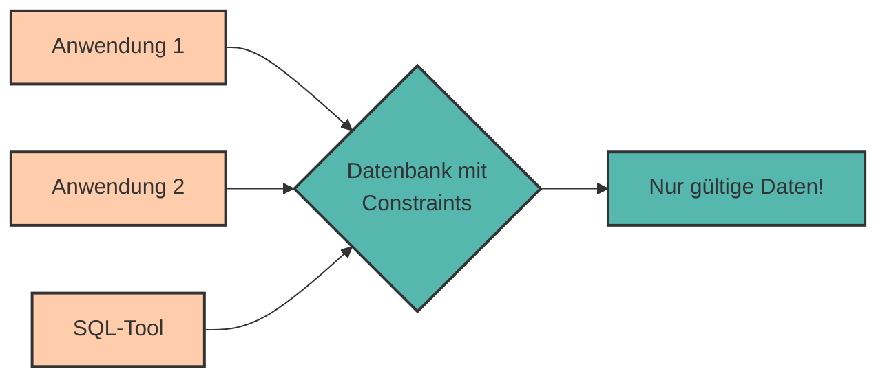

# Datenintegrität & Constraints

Stell dir vor, jemand gibt in deine Datenbank ein: `semester = -5` oder `geburtsdatum = '2099-12-31'`. Offensichtlich unsinnige Daten! Wie können wir solche **Datenfehler verhindern**?

Die Antwort: **Constraints** (Integritätsbedingungen)!

Constraints sind **Regeln**, die sicherstellen, dass nur **gültige Daten** in die Datenbank gelangen. Sie sind die erste Verteidigungslinie gegen fehlerhafte Daten.

---

## Warum Datenintegrität wichtig ist

**Garbage In, Garbage Out** – Schlechte Daten führen zu schlechten Ergebnissen:

❌ Ein negatives Alter  
❌ Ein leerer Name bei einem Pflichtfeld  
❌ Eine ungültige E-Mail-Adresse  
❌ Ein Fremdschlüssel, der auf nichts verweist

**Constraints** verhindern diese Probleme **automatisch auf Datenbankebene** – unabhängig davon, welche Anwendung auf die Datenbank zugreift.



---

## Die 5 wichtigsten Constraints

<div style="text-align:center; max-width:900px; margin:16px auto;">
<table role="table" 
       style="width:100%; border-collapse:separate; border-spacing:0; border:1px solid #cfd8e3; border-radius:10px; overflow:hidden; font-family:system-ui,sans-serif;">
    <thead>
    <tr style="background:#009485; color:#fff;">
        <th style="text-align:left; padding:12px 14px; font-weight:700;">Constraint</th>
        <th style="text-align:left; padding:12px 14px; font-weight:700;">Bedeutung</th>
        <th style="text-align:left; padding:12px 14px; font-weight:700;">Beispiel</th>
    </tr>
    </thead>
    <tbody>
    <tr>
        <td style="background:#00948511; padding:10px 14px;"><code>NOT NULL</code></td>
        <td style="padding:10px 14px;">Darf nicht leer sein</td>
        <td style="padding:10px 14px;">Name, E-Mail</td>
    </tr>
    <tr>
        <td style="background:#00948511; padding:10px 14px;"><code>UNIQUE</code></td>
        <td style="padding:10px 14px;">Muss eindeutig sein</td>
        <td style="padding:10px 14px;">E-Mail, Matrikelnummer</td>
    </tr>
    <tr>
        <td style="background:#00948511; padding:10px 14px;"><code>PRIMARY KEY</code></td>
        <td style="padding:10px 14px;">NOT NULL + UNIQUE</td>
        <td style="padding:10px 14px;">ID-Spalten</td>
    </tr>
    <tr>
        <td style="background:#00948511; padding:10px 14px;"><code>FOREIGN KEY</code></td>
        <td style="padding:10px 14px;">Verweist auf andere Tabelle</td>
        <td style="padding:10px 14px;">abteilung_id</td>
    </tr>
    <tr>
        <td style="background:#00948511; padding:10px 14px;"><code>CHECK</code></td>
        <td style="padding:10px 14px;">Eigene Bedingung</td>
        <td style="padding:10px 14px;">alter >= 0</td>
    </tr>
    </tbody>
</table>
</div>

---

## NOT NULL - Pflichtfelder

**NOT NULL** stellt sicher, dass eine Spalte **niemals leer** sein darf.

### Beispiel

```sql
CREATE TABLE studierende (
    matrikel_nr INTEGER PRIMARY KEY,
    vorname VARCHAR(50) NOT NULL,      -- Muss ausgefüllt sein!
    nachname VARCHAR(50) NOT NULL,     -- Muss ausgefüllt sein!
    email VARCHAR(100),                -- Darf leer sein
    semester INTEGER NOT NULL          -- Muss ausgefüllt sein!
);
```

### Was passiert bei Verstoß?

```sql
-- Fehler: vorname ist NOT NULL!
INSERT INTO studierende (matrikel_nr, nachname, semester)
VALUES (12345, 'Müller', 3);
```

**Fehlermeldung:**

```
ERROR: null value in column "vorname" violates not-null constraint
```

<div style="background:#00948511; border-left:4px solid #009485; padding:12px 16px; margin:16px 0;">
<strong>💡 Best Practice:</strong><br>
Verwende NOT NULL für alle Spalten, die <strong>immer</strong> einen Wert haben müssen. Das verhindert unvollständige Daten.
</div>

---

## UNIQUE - Eindeutigkeit erzwingen

**UNIQUE** stellt sicher, dass ein Wert in einer Spalte **nur einmal vorkommt**.

### Beispiel

```sql
CREATE TABLE studierende (
    matrikel_nr INTEGER PRIMARY KEY,
    vorname VARCHAR(50) NOT NULL,
    nachname VARCHAR(50) NOT NULL,
    email VARCHAR(100) UNIQUE,         -- Jede E-Mail nur einmal!
    semester INTEGER
);
```

### Was passiert bei Verstoß?

```sql
-- Erste Einfügung: OK
INSERT INTO studierende (matrikel_nr, vorname, nachname, email, semester)
VALUES (12345, 'Anna', 'Müller', 'anna@uni.at', 3);

-- Zweite Einfügung mit gleicher E-Mail: FEHLER!
INSERT INTO studierende (matrikel_nr, vorname, nachname, email, semester)
VALUES (12346, 'Max', 'Schmidt', 'anna@uni.at', 2);
```

**Fehlermeldung:**

```
ERROR: duplicate key value violates unique constraint "studierende_email_key"
```

### UNIQUE mit mehreren Spalten

```sql
CREATE TABLE kurse (
    kurs_id SERIAL PRIMARY KEY,
    kursname VARCHAR(100),
    semester VARCHAR(20),
    dozent VARCHAR(100),
    UNIQUE (kursname, semester)  -- Diese Kombination muss eindeutig sein
);
```

Das erlaubt denselben Kurs in verschiedenen Semestern, aber nicht zweimal im selben Semester.

---

## CHECK - Eigene Regeln definieren

Mit **CHECK** können wir **beliebige Bedingungen** definieren, die erfüllt sein müssen.

### Beispiel: Wertebereich prüfen

```sql
CREATE TABLE studierende (
    matrikel_nr INTEGER PRIMARY KEY,
    vorname VARCHAR(50) NOT NULL,
    nachname VARCHAR(50) NOT NULL,
    semester INTEGER CHECK (semester >= 1 AND semester <= 20),  -- 1-20
    geburtsdatum DATE CHECK (geburtsdatum < CURRENT_DATE)       -- In der Vergangenheit
);
```

### Was passiert bei Verstoß?

```sql
-- Fehler: Semester -5 ist ungültig!
INSERT INTO studierende (matrikel_nr, vorname, nachname, semester)
VALUES (12345, 'Anna', 'Müller', -5);
```

**Fehlermeldung:**

```
ERROR: new row for relation "studierende" violates check constraint "studierende_semester_check"
```

### Weitere CHECK-Beispiele

```sql
-- Gehalt muss positiv sein
CREATE TABLE angestellte (
    angestellte_id SERIAL PRIMARY KEY,
    name VARCHAR(100),
    gehalt NUMERIC(10, 2) CHECK (gehalt > 0)
);
```

```sql
-- E-Mail muss '@' enthalten
CREATE TABLE benutzer (
    benutzer_id SERIAL PRIMARY KEY,
    email VARCHAR(100) CHECK (email LIKE '%@%')
);
```

```sql
-- Mehrere Bedingungen kombinieren
CREATE TABLE kurse (
    kurs_id SERIAL PRIMARY KEY,
    kursname VARCHAR(100) NOT NULL,
    ects INTEGER CHECK (ects >= 1 AND ects <= 15),
    max_teilnehmer INTEGER CHECK (max_teilnehmer > 0),
    CHECK (max_teilnehmer >= 5)  -- Tabellen-Level Constraint
);
```

---

## DEFAULT - Standardwerte

**DEFAULT** setzt einen **Standardwert**, wenn beim Einfügen kein Wert angegeben wird.

### Beispiel

```sql
CREATE TABLE studierende (
    matrikel_nr INTEGER PRIMARY KEY,
    vorname VARCHAR(50) NOT NULL,
    nachname VARCHAR(50) NOT NULL,
    semester INTEGER DEFAULT 1,                    -- Standard: 1
    einschreibedatum DATE DEFAULT CURRENT_DATE,    -- Standard: Heute
    aktiv BOOLEAN DEFAULT TRUE                     -- Standard: aktiv
);
```

### Verwendung

```sql
-- Ohne semester: wird automatisch 1
INSERT INTO studierende (matrikel_nr, vorname, nachname)
VALUES (12345, 'Anna', 'Müller');

-- Ergebnis:
-- matrikel_nr: 12345
-- semester: 1 (DEFAULT)
-- einschreibedatum: 2024-03-15 (CURRENT_DATE)
-- aktiv: TRUE (DEFAULT)
```

---

## Constraints nachträglich hinzufügen

Du kannst Constraints auch zu bestehenden Tabellen hinzufügen.

### NOT NULL hinzufügen

```sql
ALTER TABLE studierende
ALTER COLUMN email SET NOT NULL;
```

### UNIQUE hinzufügen

```sql
ALTER TABLE studierende
ADD CONSTRAINT email_unique UNIQUE (email);
```

### CHECK hinzufügen

```sql
ALTER TABLE studierende
ADD CONSTRAINT semester_check CHECK (semester >= 1 AND semester <= 20);
```

### Constraint entfernen

```sql
ALTER TABLE studierende
DROP CONSTRAINT email_unique;
```

---

## Kombinierte Beispiele

### Vollständige Tabelle mit allen Constraints

```sql
CREATE TABLE kurse (
    kurs_id SERIAL PRIMARY KEY,
    kursname VARCHAR(100) NOT NULL,
    dozent VARCHAR(100) NOT NULL,
    ects INTEGER NOT NULL CHECK (ects >= 1 AND ects <= 15),
    max_teilnehmer INTEGER DEFAULT 30 CHECK (max_teilnehmer > 0),
    raum VARCHAR(50),
    semester VARCHAR(20) NOT NULL DEFAULT 'WS2024',
    aktiv BOOLEAN DEFAULT TRUE,
    erstellt_am TIMESTAMP DEFAULT NOW(),
    
    -- Eindeutige Kombination
    UNIQUE (kursname, semester),
    
    -- Tabellen-Level CHECK
    CHECK (max_teilnehmer >= 5)
);
```

### Praktisches Beispiel: E-Commerce

```sql
CREATE TABLE produkte (
    produkt_id SERIAL PRIMARY KEY,
    name VARCHAR(200) NOT NULL,
    beschreibung TEXT,
    preis NUMERIC(10, 2) NOT NULL CHECK (preis > 0),
    bestand INTEGER DEFAULT 0 CHECK (bestand >= 0),
    kategorie VARCHAR(50) NOT NULL,
    sku VARCHAR(50) UNIQUE NOT NULL,  -- Artikelnummer
    aktiv BOOLEAN DEFAULT TRUE,
    erstellt_am TIMESTAMP DEFAULT NOW(),
    
    -- Preis darf nicht zu hoch sein (Plausibilitätsprüfung)
    CHECK (preis <= 100000)
);
```

---

## Praktische Übungen 🎯

### Aufgabe 1: Mitarbeiter-Tabelle

Erstelle eine Tabelle `mitarbeiter` mit folgenden Anforderungen:

- ID (Primärschlüssel, automatisch)
- Vorname (Pflicht)
- Nachname (Pflicht)
- E-Mail (eindeutig, Pflicht)
- Gehalt (positiv, mindestens 1000)
- Einstellungsdatum (Standardwert: heute)

<details>
<summary>💡 Lösung anzeigen</summary>

```sql
CREATE TABLE mitarbeiter (
    mitarbeiter_id SERIAL PRIMARY KEY,
    vorname VARCHAR(50) NOT NULL,
    nachname VARCHAR(50) NOT NULL,
    email VARCHAR(100) UNIQUE NOT NULL,
    gehalt NUMERIC(10, 2) CHECK (gehalt >= 1000),
    einstellungsdatum DATE DEFAULT CURRENT_DATE
);
```
</details>

### Aufgabe 2: Constraint hinzufügen

Füge zur bestehenden `studierende`-Tabelle ein Constraint hinzu: Die E-Mail muss '@uni.at' enthalten.

<details>
<summary>💡 Lösung anzeigen</summary>

```sql
ALTER TABLE studierende
ADD CONSTRAINT email_format CHECK (email LIKE '%@uni.at');
```
</details>

### Aufgabe 3: Fehler finden

Was ist an dieser Tabellendefinition problematisch?

```sql
CREATE TABLE bestellungen (
    bestellung_id SERIAL,
    kunde_id INTEGER,
    betrag NUMERIC(10, 2),
    status VARCHAR(20)
);
```

<details>
<summary>💡 Lösung anzeigen</summary>

**Probleme:**

1. Kein PRIMARY KEY definiert (sollte bei `bestellung_id` sein)
2. `kunde_id` sollte NOT NULL sein (jede Bestellung braucht einen Kunden)
3. `betrag` sollte CHECK (betrag > 0) haben
4. `status` könnte auf bestimmte Werte eingeschränkt werden

**Verbesserung:**

```sql
CREATE TABLE bestellungen (
    bestellung_id SERIAL PRIMARY KEY,
    kunde_id INTEGER NOT NULL,
    betrag NUMERIC(10, 2) CHECK (betrag > 0),
    status VARCHAR(20) CHECK (status IN ('offen', 'bezahlt', 'versandt', 'abgeschlossen')),
    FOREIGN KEY (kunde_id) REFERENCES kunden(kunde_id)
);
```
</details>

---

## Constraints benennen

Du kannst Constraints **Namen geben**, um sie später leichter zu identifizieren:

```sql
CREATE TABLE studierende (
    matrikel_nr INTEGER,
    email VARCHAR(100),
    semester INTEGER,
    
    CONSTRAINT pk_studierende PRIMARY KEY (matrikel_nr),
    CONSTRAINT uq_email UNIQUE (email),
    CONSTRAINT ck_semester CHECK (semester >= 1 AND semester <= 20)
);
```

**Vorteil:** Bei Fehlern siehst du den Namen:

```
ERROR: new row violates check constraint "ck_semester"
```

---

## Zusammenfassung 📌

- **Constraints** erzwingen Datenintegrität auf Datenbankebene
- **NOT NULL** – Verhindert leere Werte
- **UNIQUE** – Erzwingt Eindeutigkeit
- **PRIMARY KEY** – Kombination aus NOT NULL und UNIQUE
- **FOREIGN KEY** – Referenzielle Integrität (siehe Kapitel 5)
- **CHECK** – Eigene Validierungsregeln
- **DEFAULT** – Standardwerte bei fehlender Eingabe
- Constraints können mit `ALTER TABLE` nachträglich hinzugefügt/entfernt werden
- Constraints schützen vor ungültigen Daten, unabhängig von der Anwendung

**Best Practices:**

✅ NOT NULL für Pflichtfelder  
✅ UNIQUE für eindeutige Identifikatoren  
✅ CHECK für Wertebereiche und Plausibilität  
✅ DEFAULT für sinnvolle Standardwerte  
✅ Constraints aussagekräftig benennen  
✅ Constraints frühzeitig definieren, nicht nachträglich

---

Im nächsten Kapitel lernen wir über **Indizes & Performance** – wie wir Abfragen schneller machen!