# Datenintegrität & Constraints

Stell dir vor, jemand gibt in deine Datenbank ein: `anschaffungsjahr = 1800` oder `preis = -500`. Offensichtlich unsinnige Daten! Wie können wir solche **Datenfehler verhindern**?

Die Antwort: **Constraints** (Integritätsbedingungen)!

Constraints sind **Regeln**, die sicherstellen, dass nur **gültige Daten** in die Datenbank gelangen. Sie sind die erste Verteidigungslinie gegen fehlerhafte Daten.

---

## Warum Datenintegrität wichtig ist

**Garbage In, Garbage Out** – Schlechte Daten führen zu schlechten Ergebnissen:

❌ Ein negatives Alter  
❌ Ein leerer Name bei einem Pflichtfeld  
❌ Eine ungültige E-Mail-Adresse  
❌ Ein Fremdschlüssel, der auf nichts verweist

**Constraints** verhindern diese Probleme **automatisch auf Datenbankebene** – unabhängig davon, welche Anwendung auf die Datenbank zugreift.

```mermaid
graph LR
    A[Anwendung 1]:::peach --> B{Datenbank mit<br>Constraints}:::teal
    C[Anwendung 2]:::peach --> B
    D[SQL-Tool]:::peach --> B
    B --> E[Nur gültige Daten!]:::teal

    classDef peach fill:#FFB482aa,stroke:#333,stroke-width:2px;
    classDef teal fill:#009485aa,stroke:#333,stroke-width:2px;
```



---

## Die 5 wichtigsten Constraints

<div style="text-align:center; max-width:900px; margin:16px auto;">
<table role="table" 
       style="width:100%; border-collapse:separate; border-spacing:0; border:1px solid #cfd8e3; border-radius:10px; overflow:hidden; font-family:system-ui,sans-serif;">
    <thead>
    <tr style="background:#009485; color:#fff;">
        <th style="text-align:left; padding:12px 14px; font-weight:700;">Constraint</th>
        <th style="text-align:left; padding:12px 14px; font-weight:700;">Bedeutung</th>
        <th style="text-align:left; padding:12px 14px; font-weight:700;">Beispiel</th>
    </tr>
    </thead>
    <tbody>
    <tr>
        <td style="background:#00948511; padding:10px 14px;"><code>NOT NULL</code></td>
        <td style="padding:10px 14px;">Darf nicht leer sein</td>
        <td style="padding:10px 14px;">Name, E-Mail</td>
    </tr>
    <tr>
        <td style="background:#00948511; padding:10px 14px;"><code>UNIQUE</code></td>
        <td style="padding:10px 14px;">Muss eindeutig sein</td>
        <td style="padding:10px 14px;">Seriennummer, Teilnummer</td>
    </tr>
    <tr>
        <td style="background:#00948511; padding:10px 14px;"><code>PRIMARY KEY</code></td>
        <td style="padding:10px 14px;">NOT NULL + UNIQUE</td>
        <td style="padding:10px 14px;">ID-Spalten</td>
    </tr>
    <tr>
        <td style="background:#00948511; padding:10px 14px;"><code>FOREIGN KEY</code></td>
        <td style="padding:10px 14px;">Verweist auf andere Tabelle</td>
        <td style="padding:10px 14px;">techniker_id</td>
    </tr>
    <tr>
        <td style="background:#00948511; padding:10px 14px;"><code>CHECK</code></td>
        <td style="padding:10px 14px;">Eigene Bedingung</td>
        <td style="padding:10px 14px;">alter >= 0</td>
    </tr>
    </tbody>
</table>
</div>

---

## NOT NULL - Pflichtfelder

**NOT NULL** stellt sicher, dass eine Spalte **niemals leer** sein darf.

### Beispiel

```sql
CREATE TABLE maschinen (
    maschinen_id SERIAL PRIMARY KEY,
    name VARCHAR(100) NOT NULL,        -- Muss ausgefüllt sein!
    typ VARCHAR(50) NOT NULL,          -- Muss ausgefüllt sein!
    seriennummer VARCHAR(50),          -- Darf leer sein
    anschaffungsjahr INTEGER NOT NULL  -- Muss ausgefüllt sein!
);
```

### Was passiert bei Verstoß?

```sql
-- Fehler: name ist NOT NULL!
INSERT INTO maschinen (typ, anschaffungsjahr)
VALUES ('CNC-Fräse', 2020);
```

**Fehlermeldung:**

```
ERROR: null value in column "name" violates not-null constraint
```

<div style="background:#00948511; border-left:4px solid #009485; padding:12px 16px; margin:16px 0;">
<strong>💡 Best Practice:</strong><br>
Verwende NOT NULL für alle Spalten, die <strong>immer</strong> einen Wert haben müssen. Das verhindert unvollständige Daten.
</div>

---

## UNIQUE - Eindeutigkeit erzwingen

**UNIQUE** stellt sicher, dass ein Wert in einer Spalte **nur einmal vorkommt**.

### Beispiel

```sql
CREATE TABLE maschinen (
    maschinen_id SERIAL PRIMARY KEY,
    name VARCHAR(100) NOT NULL,
    typ VARCHAR(50) NOT NULL,
    seriennummer VARCHAR(50) UNIQUE,   -- Jede Seriennummer nur einmal!
    anschaffungsjahr INTEGER
);
```

### Was passiert bei Verstoß?

```sql
-- Erste Einfügung: OK
INSERT INTO maschinen (name, typ, seriennummer, anschaffungsjahr)
VALUES ('CNC-Fräse Alpha', 'CNC-Fräse', 'CNC-2019-001', 2019);

-- Zweite Einfügung mit gleicher Seriennummer: FEHLER!
INSERT INTO maschinen (name, typ, seriennummer, anschaffungsjahr)
VALUES ('CNC-Fräse Beta', 'CNC-Fräse', 'CNC-2019-001', 2020);
```

**Fehlermeldung:**

```
ERROR: duplicate key value violates unique constraint "maschinen_seriennummer_key"
```

### UNIQUE mit mehreren Spalten

```sql
CREATE TABLE wartungsprotokolle (
    wartungs_id SERIAL PRIMARY KEY,
    maschinen_id INTEGER,
    wartungsdatum DATE,
    beschreibung TEXT,
    UNIQUE (maschinen_id, wartungsdatum)  -- Diese Kombination muss eindeutig sein
);
```

Das erlaubt mehrere Wartungen für eine Maschine, aber nicht zweimal am selben Tag.

---

## CHECK - Eigene Regeln definieren

Mit **CHECK** können wir **beliebige Bedingungen** definieren, die erfüllt sein müssen.

### Beispiel: Wertebereich prüfen

```sql
CREATE TABLE maschinen (
    maschinen_id SERIAL PRIMARY KEY,
    name VARCHAR(100) NOT NULL,
    typ VARCHAR(50) NOT NULL,
    anschaffungsjahr INTEGER CHECK (anschaffungsjahr >= 1950 AND anschaffungsjahr <= 2030),
    installationsdatum DATE CHECK (installationsdatum <= CURRENT_DATE)  -- In der Vergangenheit
);
```

### Was passiert bei Verstoß?

```sql
-- Fehler: Anschaffungsjahr 1800 ist ungültig!
INSERT INTO maschinen (name, typ, anschaffungsjahr)
VALUES ('Alte Maschine', 'Presse', 1800);
```

**Fehlermeldung:**

```
ERROR: new row for relation "maschinen" violates check constraint "maschinen_anschaffungsjahr_check"
```

### Weitere CHECK-Beispiele

```sql
-- Preis muss positiv sein
CREATE TABLE ersatzteile (
    teil_id SERIAL PRIMARY KEY,
    teilname VARCHAR(100),
    preis NUMERIC(10, 2) CHECK (preis > 0)
);
```

```sql
-- Seriennummer muss bestimmtes Format haben
CREATE TABLE sensoren (
    sensor_id SERIAL PRIMARY KEY,
    seriennummer VARCHAR(20) CHECK (seriennummer LIKE 'SN-%')
);
```

```sql
-- Mehrere Bedingungen kombinieren
CREATE TABLE wartungsauftraege (
    auftrag_id SERIAL PRIMARY KEY,
    beschreibung TEXT NOT NULL,
    kosten NUMERIC(10, 2) CHECK (kosten >= 0 AND kosten <= 50000),
    dauer_stunden INTEGER CHECK (dauer_stunden > 0),
    CHECK (dauer_stunden <= 168)  -- Max 1 Woche (Tabellen-Level Constraint)
);
```

---

## DEFAULT - Standardwerte

**DEFAULT** setzt einen **Standardwert**, wenn beim Einfügen kein Wert angegeben wird.

### Beispiel

```sql
CREATE TABLE maschinen (
    maschinen_id SERIAL PRIMARY KEY,
    name VARCHAR(100) NOT NULL,
    typ VARCHAR(50) NOT NULL,
    status VARCHAR(20) DEFAULT 'Aktiv',            -- Standard: Aktiv
    installationsdatum DATE DEFAULT CURRENT_DATE,  -- Standard: Heute
    betriebsbereit BOOLEAN DEFAULT TRUE            -- Standard: betriebsbereit
);
```

### Verwendung

```sql
-- Ohne status: wird automatisch 'Aktiv'
INSERT INTO maschinen (name, typ)
VALUES ('CNC-Fräse Alpha', 'CNC-Fräse');

-- Ergebnis:
-- maschinen_id: 1 (automatisch)
-- status: 'Aktiv' (DEFAULT)
-- installationsdatum: 2024-03-15 (CURRENT_DATE)
-- betriebsbereit: TRUE (DEFAULT)
```

---

## Constraints nachträglich hinzufügen

Du kannst Constraints auch zu bestehenden Tabellen hinzufügen.

### NOT NULL hinzufügen

```sql
ALTER TABLE maschinen
ALTER COLUMN seriennummer SET NOT NULL;
```

### UNIQUE hinzufügen

```sql
ALTER TABLE maschinen
ADD CONSTRAINT seriennummer_unique UNIQUE (seriennummer);
```

### CHECK hinzufügen

```sql
ALTER TABLE maschinen
ADD CONSTRAINT jahr_check CHECK (anschaffungsjahr >= 1950 AND anschaffungsjahr <= 2030);
```

### Constraint entfernen

```sql
ALTER TABLE maschinen
DROP CONSTRAINT seriennummer_unique;
```

---

## Kombinierte Beispiele

### Vollständige Tabelle mit allen Constraints

```sql
CREATE TABLE maschinen (
    maschinen_id SERIAL PRIMARY KEY,
    name VARCHAR(100) NOT NULL,
    typ VARCHAR(50) NOT NULL,
    leistung_kw NUMERIC(5, 2) NOT NULL CHECK (leistung_kw >= 0.1 AND leistung_kw <= 500),
    anschaffungsjahr INTEGER DEFAULT 2024 CHECK (anschaffungsjahr >= 1950),
    standort VARCHAR(50),
    status VARCHAR(20) NOT NULL DEFAULT 'Aktiv',
    betriebsbereit BOOLEAN DEFAULT TRUE,
    installiert_am TIMESTAMP DEFAULT NOW(),

    -- Eindeutige Kombination
    UNIQUE (name, standort),

    -- Tabellen-Level CHECK
    CHECK (leistung_kw < 1000)
);
```

### Praktisches Beispiel: Ersatzteilverwaltung

```sql
CREATE TABLE ersatzteile (
    teil_id SERIAL PRIMARY KEY,
    teilname VARCHAR(200) NOT NULL,
    beschreibung TEXT,
    preis NUMERIC(10, 2) NOT NULL CHECK (preis > 0),
    lagerbestand INTEGER DEFAULT 0 CHECK (lagerbestand >= 0),
    kategorie VARCHAR(50) NOT NULL,
    teilnummer VARCHAR(50) UNIQUE NOT NULL,  -- Eindeutige Teilnummer
    aktiv BOOLEAN DEFAULT TRUE,
    erstellt_am TIMESTAMP DEFAULT NOW(),

    -- Preis-Plausibilitätsprüfung (Ersatzteile sollten nicht extrem teuer sein)
    CHECK (preis <= 50000)
);
```

---

## Praktische Übungen 🎯

### Aufgabe 1: Techniker-Tabelle

Erstelle eine Tabelle `techniker` mit folgenden Anforderungen:

- ID (Primärschlüssel, automatisch)
- Name (Pflicht)
- Abteilung (Pflicht)
- Telefon (eindeutig, Pflicht)
- Erfahrungsjahre (positiv, mindestens 0, maximal 50)
- Einstellungsdatum (Standardwert: heute)

<details>
<summary>💡 Lösung anzeigen</summary>

```sql
CREATE TABLE techniker (
    techniker_id SERIAL PRIMARY KEY,
    name VARCHAR(100) NOT NULL,
    abteilung VARCHAR(50) NOT NULL,
    telefon VARCHAR(20) UNIQUE NOT NULL,
    erfahrungsjahre INTEGER CHECK (erfahrungsjahre >= 0 AND erfahrungsjahre <= 50),
    einstellungsdatum DATE DEFAULT CURRENT_DATE
);
```
</details>

### Aufgabe 2: Constraint hinzufügen

Füge zur bestehenden `ersatzteile`-Tabelle ein Constraint hinzu: Die Teilnummer muss mit 'ET-' beginnen.

<details>
<summary>💡 Lösung anzeigen</summary>

```sql
ALTER TABLE ersatzteile
ADD CONSTRAINT teilnummer_format CHECK (teilnummer LIKE 'ET-%');
```
</details>

### Aufgabe 3: Fehler finden

Was ist an dieser Tabellendefinition problematisch?

```sql
CREATE TABLE wartungsauftraege (
    auftrag_id SERIAL,
    maschinen_id INTEGER,
    kosten NUMERIC(10, 2),
    status VARCHAR(20)
);
```

<details>
<summary>💡 Lösung anzeigen</summary>

**Probleme:**

1. Kein PRIMARY KEY definiert (sollte bei `auftrag_id` sein)
2. `maschinen_id` sollte NOT NULL sein (jeder Auftrag braucht eine Maschine)
3. `kosten` sollte CHECK (kosten >= 0) haben
4. `status` könnte auf bestimmte Werte eingeschränkt werden

**Verbesserung:**

```sql
CREATE TABLE wartungsauftraege (
    auftrag_id SERIAL PRIMARY KEY,
    maschinen_id INTEGER NOT NULL,
    kosten NUMERIC(10, 2) CHECK (kosten >= 0),
    status VARCHAR(20) CHECK (status IN ('geplant', 'in_arbeit', 'abgeschlossen', 'abgebrochen')),
    FOREIGN KEY (maschinen_id) REFERENCES maschinen(maschinen_id)
);
```
</details>

---

## Constraints benennen

Du kannst Constraints **Namen geben**, um sie später leichter zu identifizieren:

```sql
CREATE TABLE maschinen (
    maschinen_id INTEGER,
    seriennummer VARCHAR(50),
    anschaffungsjahr INTEGER,

    CONSTRAINT pk_maschinen PRIMARY KEY (maschinen_id),
    CONSTRAINT uq_seriennummer UNIQUE (seriennummer),
    CONSTRAINT ck_anschaffungsjahr CHECK (anschaffungsjahr >= 1950 AND anschaffungsjahr <= 2030)
);
```

**Vorteil:** Bei Fehlern siehst du den Namen:

```
ERROR: new row violates check constraint "ck_anschaffungsjahr"
```

---

## Zusammenfassung 📌

- **Constraints** erzwingen Datenintegrität auf Datenbankebene
- **NOT NULL** – Verhindert leere Werte
- **UNIQUE** – Erzwingt Eindeutigkeit
- **PRIMARY KEY** – Kombination aus NOT NULL und UNIQUE
- **FOREIGN KEY** – Referenzielle Integrität (siehe Kapitel 5)
- **CHECK** – Eigene Validierungsregeln
- **DEFAULT** – Standardwerte bei fehlender Eingabe
- Constraints können mit `ALTER TABLE` nachträglich hinzugefügt/entfernt werden
- Constraints schützen vor ungültigen Daten, unabhängig von der Anwendung

**Best Practices:**

✅ NOT NULL für Pflichtfelder  
✅ UNIQUE für eindeutige Identifikatoren  
✅ CHECK für Wertebereiche und Plausibilität  
✅ DEFAULT für sinnvolle Standardwerte  
✅ Constraints aussagekräftig benennen  
✅ Constraints frühzeitig definieren, nicht nachträglich

---

Im nächsten Kapitel lernen wir über **Indizes & Performance** – wie wir Abfragen schneller machen!