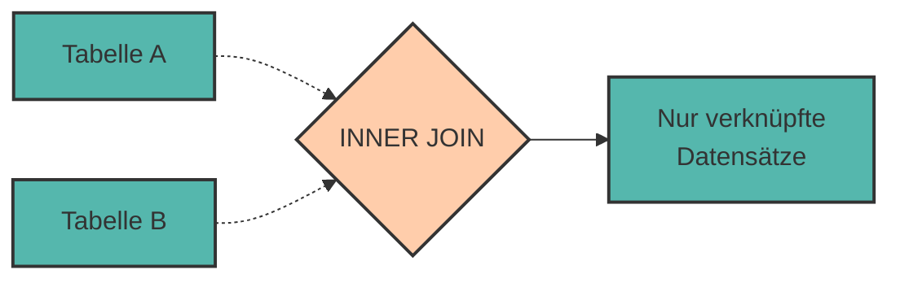

# Joins - Daten aus mehreren Tabellen kombinieren

Im letzten Kapitel haben wir gelernt, wie man **Beziehungen zwischen Tabellen** modelliert. Jetzt kommt der spannende Teil: Wie fragen wir Daten aus **mehreren verknüpften Tabellen** ab?

Die Antwort: **JOINs**!

JOINs sind das Herzstück relationaler Datenbanken. Sie erlauben es uns, Daten aus verschiedenen Tabellen zu kombinieren und als eine zusammenhängende Ergebnistabelle anzuzeigen.

---

## Das Problem: Daten sind verteilt

Erinnern wir uns an unser Beispiel aus Kapitel 5:

```
Tabelle: angestellte              Tabelle: abteilungen
 angestellte_id │ name  │ abt_id   abteilung_id │ name      │ standort
────────────────┼───────┼────────  ──────────────┼───────────┼──────────
              1 │ Anna  │      1               1 │ IT        │ Wien
              2 │ Max   │      2               2 │ HR        │ Graz
              3 │ Lisa  │      1               3 │ Marketing │ Linz
```

**Frage:** Wie zeigen wir die Angestellten **mit** ihren Abteilungsnamen an?

```
Gewünschtes Ergebnis:
 name │ abteilung │ standort 
──────┼───────────┼──────────
 Anna │ IT        │ Wien
 Max  │ HR        │ Graz
 Lisa │ IT        │ Wien
```

Dafür brauchen wir einen **JOIN**!

---

## INNER JOIN - Die Schnittmenge

Der **INNER JOIN** gibt nur Datensätze zurück, die in **beiden** Tabellen eine Übereinstimmung haben.

### Syntax

```sql
SELECT spalten
FROM tabelle1
INNER JOIN tabelle2 ON tabelle1.fremdschlüssel = tabelle2.primärschlüssel
WHERE bedingung;
```

### Visualisierung



Als Venn-Diagramm:

```
     Tabelle A          Tabelle B
        ┌────────────────────┐
        │         ╱╲         │
        │        ╱  ╲        │
        │       ╱    ╲       │
        │      ╱ INNER╲      │
        │     ╱  JOIN  ╲     │
        │    ╱          ╲    │
        │   └────────────┘   │
        └────────────────────┘
             ↑
        Nur dieser Bereich!
```

---

## Beispiel: Angestellte und Abteilungen

### Vorbereitung: Tabellen erstellen

```sql
CREATE TABLE abteilungen (
    abteilung_id SERIAL PRIMARY KEY,
    name VARCHAR(100),
    standort VARCHAR(100)
);

CREATE TABLE angestellte (
    angestellte_id SERIAL PRIMARY KEY,
    name VARCHAR(100),
    abteilung_id INTEGER,
    gehalt NUMERIC(10, 2),
    FOREIGN KEY (abteilung_id) REFERENCES abteilungen(abteilung_id)
);

INSERT INTO abteilungen (name, standort)
VALUES 
    ('IT', 'Wien'),
    ('HR', 'Graz'),
    ('Marketing', 'Linz');

INSERT INTO angestellte (name, abteilung_id, gehalt)
VALUES 
    ('Anna Müller', 1, 4500),
    ('Max Schmidt', 2, 3800),
    ('Lisa Weber', 1, 4200),
    ('Tom Bauer', NULL, 3500);  -- Kein Abteilung!
```

### INNER JOIN ausführen

```sql
SELECT 
    angestellte.name AS mitarbeiter,
    abteilungen.name AS abteilung,
    abteilungen.standort
FROM angestellte
INNER JOIN abteilungen ON angestellte.abteilung_id = abteilungen.abteilung_id;
```

**Ergebnis:**

```
 mitarbeiter  │ abteilung │ standort 
──────────────┼───────────┼──────────
 Anna Müller  │ IT        │ Wien
 Max Schmidt  │ HR        │ Graz
 Lisa Weber   │ IT        │ Wien
```

❗ **Tom Bauer fehlt!** Warum? Er hat keine Abteilung (`abteilung_id = NULL`), also keine Übereinstimmung.

<div style="background:#FFB48211; border-left:4px solid #FFB482; padding:12px 16px; margin:16px 0;">
<strong>📘 Wichtig:</strong><br>
INNER JOIN zeigt nur Datensätze, die in <strong>beiden</strong> Tabellen verknüpft sind. Datensätze ohne Übereinstimmung werden weggelassen.
</div>

---

## Tabellennamen verkürzen mit Aliassen

Bei JOINs schreiben wir oft lange Tabellennamen. **Aliasse** (Abkürzungen) machen das übersichtlicher:

```sql
SELECT 
    a.name AS mitarbeiter,
    ab.name AS abteilung,
    ab.standort,
    a.gehalt
FROM angestellte AS a
INNER JOIN abteilungen AS ab ON a.abteilung_id = ab.abteilung_id;
```

oder noch kürzer (ohne `AS`):

```sql
SELECT 
    a.name AS mitarbeiter,
    ab.name AS abteilung
FROM angestellte a
INNER JOIN abteilungen ab ON a.abteilung_id = ab.abteilung_id;
```

<div style="background:#00948511; border-left:4px solid #009485; padding:12px 16px; margin:16px 0;">
<strong>💡 Best Practice:</strong><br>
Verwende immer kurze, aussagekräftige Aliasse (z.B. <code>a</code>, <code>ab</code>) bei JOINs – das macht die Abfrage viel lesbarer!
</div>

---

## LEFT JOIN - Alle aus der linken Tabelle

Der **LEFT JOIN** (auch **LEFT OUTER JOIN**) gibt **alle Datensätze der linken Tabelle** zurück, auch wenn sie keine Übereinstimmung in der rechten Tabelle haben.

### Visualisierung

```
     Tabelle A          Tabelle B
        ┌────────────────────┐
        │█████████╱╲         │
        │█████████╱  ╲       │
        │█████████╱    ╲     │
        │█████████  LEFT╲    │
        │█████████  JOIN ╲   │
        │█████████        ╲  │
        │█████████─────────┘ │
        └────────────────────┘
             ↑
        Gesamte linke Tabelle
        + Übereinstimmungen rechts
```

### Beispiel

```sql
SELECT 
    a.name AS mitarbeiter,
    ab.name AS abteilung,
    ab.standort
FROM angestellte a
LEFT JOIN abteilungen ab ON a.abteilung_id = ab.abteilung_id;
```

**Ergebnis:**

```
 mitarbeiter  │ abteilung │ standort 
──────────────┼───────────┼──────────
 Anna Müller  │ IT        │ Wien
 Max Schmidt  │ HR        │ Graz
 Lisa Weber   │ IT        │ Wien
 Tom Bauer    │ NULL      │ NULL
```

✅ **Tom Bauer ist jetzt dabei!** Wo keine Abteilung existiert, steht `NULL`.

---

## RIGHT JOIN - Alle aus der rechten Tabelle

Der **RIGHT JOIN** (auch **RIGHT OUTER JOIN**) ist das Spiegelbild des LEFT JOIN: Alle Datensätze der **rechten** Tabelle werden zurückgegeben.

### Beispiel

```sql
SELECT 
    a.name AS mitarbeiter,
    ab.name AS abteilung
FROM angestellte a
RIGHT JOIN abteilungen ab ON a.abteilung_id = ab.abteilung_id;
```

**Ergebnis:**

```
 mitarbeiter  │ abteilung 
──────────────┼───────────
 Anna Müller  │ IT
 Lisa Weber   │ IT
 Max Schmidt  │ HR
 NULL         │ Marketing
```

✅ **Marketing ist dabei**, obwohl niemand dort arbeitet!

<div style="background:#FFB48211; border-left:4px solid #FFB482; padding:12px 16px; margin:16px 0;">
<strong>📘 Praxis-Tipp:</strong><br>
RIGHT JOIN wird selten verwendet. Man kann jeden RIGHT JOIN als LEFT JOIN umschreiben, indem man die Tabellenreihenfolge tauscht:<br>
<code>A RIGHT JOIN B</code> = <code>B LEFT JOIN A</code>
</div>

---

## Join-Typen im Überblick

<div style="text-align:center; max-width:900px; margin:16px auto;">
<table role="table" 
       style="width:100%; border-collapse:separate; border-spacing:0; border:1px solid #cfd8e3; border-radius:10px; overflow:hidden; font-family:system-ui,sans-serif;">
    <thead>
    <tr style="background:#009485; color:#fff;">
        <th style="text-align:left; padding:12px 14px; font-weight:700;">Join-Typ</th>
        <th style="text-align:left; padding:12px 14px; font-weight:700;">Was wird zurückgegeben?</th>
        <th style="text-align:left; padding:12px 14px; font-weight:700;">Wann verwenden?</th>
    </tr>
    </thead>
    <tbody>
    <tr>
        <td style="background:#00948511; padding:10px 14px;"><code>INNER JOIN</code></td>
        <td style="padding:10px 14px;">Nur Datensätze mit Übereinstimmung in <strong>beiden</strong> Tabellen</td>
        <td style="padding:10px 14px;">Standard für die meisten Abfragen</td>
    </tr>
    <tr>
        <td style="background:#00948511; padding:10px 14px;"><code>LEFT JOIN</code></td>
        <td style="padding:10px 14px;">Alle aus <strong>linker</strong> Tabelle + Übereinstimmungen rechts</td>
        <td style="padding:10px 14px;">Wenn du alle aus Tabelle A willst, auch ohne Match</td>
    </tr>
    <tr>
        <td style="background:#00948511; padding:10px 14px;"><code>RIGHT JOIN</code></td>
        <td style="padding:10px 14px;">Alle aus <strong>rechter</strong> Tabelle + Übereinstimmungen links</td>
        <td style="padding:10px 14px;">Selten – meist als LEFT JOIN umformuliert</td>
    </tr>
    <tr>
        <td style="background:#00948511; padding:10px 14px;"><code>FULL OUTER JOIN</code></td>
        <td style="padding:10px 14px;">Alle aus <strong>beiden</strong> Tabellen</td>
        <td style="padding:10px 14px;">Sehr selten – PostgreSQL unterstützt es</td>
    </tr>
    </tbody>
</table>
</div>

---

## Mehrere Tabellen joinen

Man kann mehr als zwei Tabellen in einer Abfrage joinen!

### Beispiel: Studierende, Belegungen, Kurse

Erinnern wir uns an die n:m-Beziehung aus Kapitel 5:

```sql
-- Welche Studierenden belegen welche Kurse mit welcher Note?
SELECT 
    s.vorname,
    s.nachname,
    k.kursname,
    kb.note
FROM studierende s
INNER JOIN kurs_belegungen kb ON s.matrikel_nr = kb.matrikel_nr
INNER JOIN kurse k ON kb.kurs_id = k.kurs_id
ORDER BY s.nachname, k.kursname;
```

**Ergebnis:**

```
 vorname │ nachname │ kursname       │ note 
─────────┼──────────┼────────────────┼──────
 Anna    │ Müller   │ Algorithmen    │  2.0
 Anna    │ Müller   │ Datenbanken    │  1.3
 Max     │ Schmidt  │ Datenbanken    │  1.7
 Max     │ Schmidt  │ Webentwicklung │  2.3
 Lisa    │ Weber    │ Algorithmen    │  1.0
 Lisa    │ Weber    │ Webentwicklung │  1.7
```

**Ablauf:**

1. `studierende` mit `kurs_belegungen` joinen (über `matrikel_nr`)
2. Ergebnis mit `kurse` joinen (über `kurs_id`)


---

## WHERE vs. ON - Was ist der Unterschied?

### ON - Join-Bedingung

Die **ON-Klausel** definiert, **wie** Tabellen verknüpft werden:

```sql
FROM angestellte a
INNER JOIN abteilungen ab ON a.abteilung_id = ab.abteilung_id
```

### WHERE - Filter nach dem Join

Die **WHERE-Klausel** filtert das **Ergebnis nach** dem Join:

```sql
SELECT a.name, ab.name AS abteilung
FROM angestellte a
INNER JOIN abteilungen ab ON a.abteilung_id = ab.abteilung_id
WHERE ab.standort = 'Wien';
```

**Unterschied bei INNER JOIN:** Fast keiner! Bei INNER JOIN könnten wir die Bedingung auch in ON schreiben.

**Aber bei LEFT/RIGHT JOIN:** **Großer Unterschied!**

```sql
-- Variante 1: Bedingung in ON
SELECT a.name, ab.name
FROM angestellte a
LEFT JOIN abteilungen ab ON a.abteilung_id = ab.abteilung_id 
    AND ab.standort = 'Wien';
-- Ergebnis: Alle Angestellten, Abteilung nur wenn in Wien

-- Variante 2: Bedingung in WHERE
SELECT a.name, ab.name
FROM angestellte a
LEFT JOIN abteilungen ab ON a.abteilung_id = ab.abteilung_id
WHERE ab.standort = 'Wien';
-- Ergebnis: Nur Angestellte in Wiener Abteilungen (wie INNER JOIN!)
```

<div style="background:#dc262611; border-left:4px solid #dc2626; padding:12px 16px; margin:16px 0;">
<strong>⚠️ Regel:</strong><br>
Bei LEFT/RIGHT JOIN: Filterbedingungen auf die rechte/linke Tabelle in <code>WHERE</code> machen den JOIN zum INNER JOIN!
</div>

---

## Praktische Anwendungen

### Welche Angestellten haben KEINE Abteilung?

```sql
SELECT name
FROM angestellte
WHERE abteilung_id IS NULL;
```

oder mit LEFT JOIN:

```sql
SELECT a.name
FROM angestellte a
LEFT JOIN abteilungen ab ON a.abteilung_id = ab.abteilung_id
WHERE ab.abteilung_id IS NULL;
```

### Welche Kurse werden von KEINEM Studierenden belegt?

```sql
SELECT k.kursname
FROM kurse k
LEFT JOIN kurs_belegungen kb ON k.kurs_id = kb.kurs_id
WHERE kb.kurs_id IS NULL;
```

---

## Praktische Übungen 🎯

Verwende die Tabellen aus Kapitel 5 (Studierende, Kurse, Belegungen).

### Aufgabe 1: INNER JOIN

Zeige alle Kursbelegungen mit Studierendennamen und Kursnamen.

<details>
<summary>💡 Lösung anzeigen</summary>

```sql
SELECT 
    s.vorname,
    s.nachname,
    k.kursname,
    kb.note
FROM kurs_belegungen kb
INNER JOIN studierende s ON kb.matrikel_nr = s.matrikel_nr
INNER JOIN kurse k ON kb.kurs_id = k.kurs_id;
```
</details>

### Aufgabe 2: LEFT JOIN

Zeige alle Studierenden und ihre Kurse. Auch Studierende ohne Kurse sollen angezeigt werden.

<details>
<summary>💡 Lösung anzeigen</summary>

```sql
SELECT 
    s.vorname,
    s.nachname,
    k.kursname
FROM studierende s
LEFT JOIN kurs_belegungen kb ON s.matrikel_nr = kb.matrikel_nr
LEFT JOIN kurse k ON kb.kurs_id = k.kurs_id;
```
</details>

### Aufgabe 3: Aggregation mit JOIN

Wie viele Studierende belegen jeden Kurs?

<details>
<summary>💡 Lösung anzeigen</summary>

```sql
SELECT 
    k.kursname,
    COUNT(kb.matrikel_nr) AS anzahl_studierende
FROM kurse k
LEFT JOIN kurs_belegungen kb ON k.kurs_id = kb.kurs_id
GROUP BY k.kursname
ORDER BY anzahl_studierende DESC;
```
</details>

### Aufgabe 4: Durchschnittsnote pro Kurs

Berechne die Durchschnittsnote für jeden Kurs.

<details>
<summary>💡 Lösung anzeigen</summary>

```sql
SELECT 
    k.kursname,
    AVG(kb.note) AS durchschnittsnote,
    COUNT(*) AS anzahl_noten
FROM kurse k
INNER JOIN kurs_belegungen kb ON k.kurs_id = kb.kurs_id
WHERE kb.note IS NOT NULL
GROUP BY k.kursname
ORDER BY durchschnittsnote;
```
</details>

---

## Zusammenfassung 📌

- **JOINs** kombinieren Daten aus mehreren Tabellen
- **INNER JOIN** zeigt nur verknüpfte Datensätze (Schnittmenge)
- **LEFT JOIN** zeigt alle aus der linken Tabelle + Matches rechts
- **RIGHT JOIN** zeigt alle aus der rechten Tabelle + Matches links
- **Aliasse** (z.B. `AS a`) machen JOINs übersichtlicher
- Man kann beliebig viele Tabellen joinen
- **ON** definiert die Join-Bedingung, **WHERE** filtert das Ergebnis
- Bei LEFT/RIGHT JOIN: WHERE auf der "optionalen" Seite verhält sich wie INNER JOIN!

**Die Join-Formel:**

```sql
SELECT spalten
FROM haupttabelle
[INNER|LEFT|RIGHT] JOIN andere_tabelle 
    ON haupttabelle.fk = andere_tabelle.pk
WHERE filter_bedingung;
```

---

Im nächsten Kapitel lernen wir **fortgeschrittene SQL-Techniken**: Unterabfragen, String-Funktionen und mehr!