# Joins - Daten aus mehreren Tabellen kombinieren

Im letzten Kapitel haben wir gelernt, wie man **Beziehungen zwischen Tabellen** modelliert. Jetzt kommt der spannende Teil: Wie fragen wir Daten aus **mehreren verknüpften Tabellen** ab?

Die Antwort: **JOINs**!

JOINs sind das Herzstück relationaler Datenbanken. Sie erlauben es uns, Daten aus verschiedenen Tabellen zu kombinieren und als eine zusammenhängende Ergebnistabelle anzuzeigen.

---

## Das Problem: Daten sind verteilt

Erinnern wir uns an unser Beispiel aus Kapitel 5:

```
Tabelle: maschinen                      Tabelle: techniker
 maschinen_id │ name      │ tech_id     techniker_id │ name           │ abteilung
──────────────┼───────────┼────────    ──────────────┼────────────────┼──────────
            1 │ CNC Alpha │       1                1 │ Thomas Müller  │ Wartung
            2 │ Drehbank  │       2                2 │ Sandra Schmidt │ Fertigung
            3 │ Roboter   │       1                3 │ Klaus Weber    │ Instandh.
```

**Frage:** Wie zeigen wir die Maschinen **mit** ihren zuständigen Technikern an?

```
Gewünschtes Ergebnis:
 maschine  │ techniker      │ abteilung
───────────┼────────────────┼───────────
 CNC Alpha │ Thomas Müller  │ Wartung
 Drehbank  │ Sandra Schmidt │ Fertigung
 Roboter   │ Thomas Müller  │ Wartung
```

Dafür brauchen wir einen **JOIN**!

---

## INNER JOIN - Die Schnittmenge

Der **INNER JOIN** gibt nur Datensätze zurück, die in **beiden** Tabellen eine Übereinstimmung haben.

### Syntax

```sql
SELECT spalten
FROM tabelle1
INNER JOIN tabelle2 ON tabelle1.fremdschlüssel = tabelle2.primärschlüssel
WHERE bedingung;
```

### Visualisierung



```mermaid
graph LR
    A[Tabelle A]:::teal -.-> C{INNER JOIN}:::peach
    B[Tabelle B]:::teal -.-> C
    C --> D[Nur verknüpfte<br>Datensätze]:::teal

    classDef peach fill:#FFB482aa,stroke:#333,stroke-width:2px;
    classDef teal fill:#009485aa,stroke:#333,stroke-width:2px;
```

Als Venn-Diagramm:

```
     Tabelle A          Tabelle B
        ┌────────────────────┐
        │         ╱╲         │
        │        ╱  ╲        │
        │       ╱    ╲       │
        │      ╱ INNER╲      │
        │     ╱  JOIN  ╲     │
        │    ╱          ╲    │
        │   └────────────┘   │
        └────────────────────┘
             ↑
        Nur dieser Bereich!
```

---

## Beispiel: Maschinen und Techniker

### Vorbereitung: Tabellen erstellen

```sql
CREATE TABLE techniker (
    techniker_id SERIAL PRIMARY KEY,
    name VARCHAR(100),
    abteilung VARCHAR(50)
);

CREATE TABLE maschinen (
    maschinen_id SERIAL PRIMARY KEY,
    name VARCHAR(100),
    techniker_id INTEGER,
    anschaffungsjahr INTEGER,
    FOREIGN KEY (techniker_id) REFERENCES techniker(techniker_id)
);

INSERT INTO techniker (name, abteilung)
VALUES
    ('Thomas Müller', 'Wartung'),
    ('Sandra Schmidt', 'Fertigung'),
    ('Klaus Weber', 'Instandhaltung');

INSERT INTO maschinen (name, techniker_id, anschaffungsjahr)
VALUES
    ('CNC-Fräse Alpha', 1, 2019),
    ('Drehbank Beta', 2, 2021),
    ('Schweißroboter Gamma', 1, 2020),
    ('Stanzmaschine Delta', NULL, 2018);  -- Kein zuständiger Techniker!
```

### INNER JOIN ausführen

```sql
SELECT
    maschinen.name AS maschine,
    techniker.name AS techniker,
    techniker.abteilung
FROM maschinen
INNER JOIN techniker ON maschinen.techniker_id = techniker.techniker_id;
```

**Ergebnis:**

```
 maschine             │ techniker      │ abteilung
──────────────────────┼────────────────┼───────────
 CNC-Fräse Alpha      │ Thomas Müller  │ Wartung
 Drehbank Beta        │ Sandra Schmidt │ Fertigung
 Schweißroboter Gamma │ Thomas Müller  │ Wartung
```

❗ **Stanzmaschine Delta fehlt!** Warum? Sie hat keinen zuständigen Techniker (`techniker_id = NULL`), also keine Übereinstimmung.

<div style="background:#FFB48211; border-left:4px solid #FFB482; padding:12px 16px; margin:16px 0;">
<strong>📘 Wichtig:</strong><br>
INNER JOIN zeigt nur Datensätze, die in <strong>beiden</strong> Tabellen verknüpft sind. Datensätze ohne Übereinstimmung werden weggelassen.
</div>

---

## Tabellennamen verkürzen mit Aliassen

Bei JOINs schreiben wir oft lange Tabellennamen. **Aliasse** (Abkürzungen) machen das übersichtlicher:

```sql
SELECT
    m.name AS maschine,
    t.name AS techniker,
    t.abteilung,
    m.anschaffungsjahr
FROM maschinen AS m
INNER JOIN techniker AS t ON m.techniker_id = t.techniker_id;
```

oder noch kürzer (ohne `AS`):

```sql
SELECT
    m.name AS maschine,
    t.name AS techniker
FROM maschinen m
INNER JOIN techniker t ON m.techniker_id = t.techniker_id;
```

<div style="background:#00948511; border-left:4px solid #009485; padding:12px 16px; margin:16px 0;">
<strong>💡 Best Practice:</strong><br>
Verwende immer kurze, aussagekräftige Aliasse (z.B. <code>m</code>, <code>t</code>) bei JOINs – das macht die Abfrage viel lesbarer!
</div>

---

## LEFT JOIN - Alle aus der linken Tabelle

Der **LEFT JOIN** (auch **LEFT OUTER JOIN**) gibt **alle Datensätze der linken Tabelle** zurück, auch wenn sie keine Übereinstimmung in der rechten Tabelle haben.

### Visualisierung

```
     Tabelle A          Tabelle B
        ┌────────────────────┐
        │█████████╱╲         │
        │█████████╱  ╲       │
        │█████████╱    ╲     │
        │█████████  LEFT╲    │
        │█████████  JOIN ╲   │
        │█████████        ╲  │
        │█████████─────────┘ │
        └────────────────────┘
             ↑
        Gesamte linke Tabelle
        + Übereinstimmungen rechts
```

### Beispiel

```sql
SELECT
    m.name AS maschine,
    t.name AS techniker,
    t.abteilung
FROM maschinen m
LEFT JOIN techniker t ON m.techniker_id = t.techniker_id;
```

**Ergebnis:**

```
 maschine             │ techniker      │ abteilung
──────────────────────┼────────────────┼───────────
 CNC-Fräse Alpha      │ Thomas Müller  │ Wartung
 Drehbank Beta        │ Sandra Schmidt │ Fertigung
 Schweißroboter Gamma │ Thomas Müller  │ Wartung
 Stanzmaschine Delta  │ NULL           │ NULL
```

✅ **Stanzmaschine Delta ist jetzt dabei!** Wo kein Techniker zuständig ist, steht `NULL`.

---

## RIGHT JOIN - Alle aus der rechten Tabelle

Der **RIGHT JOIN** (auch **RIGHT OUTER JOIN**) ist das Spiegelbild des LEFT JOIN: Alle Datensätze der **rechten** Tabelle werden zurückgegeben.

### Beispiel

```sql
SELECT
    m.name AS maschine,
    t.name AS techniker
FROM maschinen m
RIGHT JOIN techniker t ON m.techniker_id = t.techniker_id;
```

**Ergebnis:**

```
 maschine             │ techniker
──────────────────────┼────────────────
 CNC-Fräse Alpha      │ Thomas Müller
 Schweißroboter Gamma │ Thomas Müller
 Drehbank Beta        │ Sandra Schmidt
 NULL                 │ Klaus Weber
```

✅ **Klaus Weber ist dabei**, obwohl keine Maschine ihm zugeordnet ist!

<div style="background:#FFB48211; border-left:4px solid #FFB482; padding:12px 16px; margin:16px 0;">
<strong>📘 Praxis-Tipp:</strong><br>
RIGHT JOIN wird selten verwendet. Man kann jeden RIGHT JOIN als LEFT JOIN umschreiben, indem man die Tabellenreihenfolge tauscht:<br>
<code>A RIGHT JOIN B</code> = <code>B LEFT JOIN A</code>
</div>

---

## Join-Typen im Überblick

<div style="text-align:center; max-width:900px; margin:16px auto;">
<table role="table" 
       style="width:100%; border-collapse:separate; border-spacing:0; border:1px solid #cfd8e3; border-radius:10px; overflow:hidden; font-family:system-ui,sans-serif;">
    <thead>
    <tr style="background:#009485; color:#fff;">
        <th style="text-align:left; padding:12px 14px; font-weight:700;">Join-Typ</th>
        <th style="text-align:left; padding:12px 14px; font-weight:700;">Was wird zurückgegeben?</th>
        <th style="text-align:left; padding:12px 14px; font-weight:700;">Wann verwenden?</th>
    </tr>
    </thead>
    <tbody>
    <tr>
        <td style="background:#00948511; padding:10px 14px;"><code>INNER JOIN</code></td>
        <td style="padding:10px 14px;">Nur Datensätze mit Übereinstimmung in <strong>beiden</strong> Tabellen</td>
        <td style="padding:10px 14px;">Standard für die meisten Abfragen</td>
    </tr>
    <tr>
        <td style="background:#00948511; padding:10px 14px;"><code>LEFT JOIN</code></td>
        <td style="padding:10px 14px;">Alle aus <strong>linker</strong> Tabelle + Übereinstimmungen rechts</td>
        <td style="padding:10px 14px;">Wenn du alle aus Tabelle A willst, auch ohne Match</td>
    </tr>
    <tr>
        <td style="background:#00948511; padding:10px 14px;"><code>RIGHT JOIN</code></td>
        <td style="padding:10px 14px;">Alle aus <strong>rechter</strong> Tabelle + Übereinstimmungen links</td>
        <td style="padding:10px 14px;">Selten – meist als LEFT JOIN umformuliert</td>
    </tr>
    <tr>
        <td style="background:#00948511; padding:10px 14px;"><code>FULL OUTER JOIN</code></td>
        <td style="padding:10px 14px;">Alle aus <strong>beiden</strong> Tabellen</td>
        <td style="padding:10px 14px;">Sehr selten – PostgreSQL unterstützt es</td>
    </tr>
    </tbody>
</table>
</div>

---

## Mehrere Tabellen joinen

Man kann mehr als zwei Tabellen in einer Abfrage joinen!

### Beispiel: Maschinen, Ersatzteil-Zuordnungen, Ersatzteile

Erinnern wir uns an die n:m-Beziehung aus Kapitel 5:

```sql
-- Welche Maschinen benötigen welche Ersatzteile in welcher Menge?
SELECT
    m.name AS maschine,
    e.teilname,
    me.menge,
    e.preis
FROM maschinen m
INNER JOIN maschinen_ersatzteile me ON m.maschinen_id = me.maschinen_id
INNER JOIN ersatzteile e ON me.teil_id = e.teil_id
ORDER BY m.name, e.teilname;
```

**Ergebnis:**

```
 maschine             │ teilname         │ menge │ preis
──────────────────────┼──────────────────┼───────┼─────────
 CNC-Fräse Alpha      │ Kühlmittelpumpe  │     2 │  380.50
 CNC-Fräse Alpha      │ Spindelmotor     │     1 │ 1250.00
 Drehbank Beta        │ Kühlmittelpumpe  │     1 │  380.50
 Drehbank Beta        │ Spindelmotor     │     1 │ 1250.00
 Schweißroboter Gamma │ Kühlmittelpumpe  │     1 │  380.50
 Schweißroboter Gamma │ Schweißdrahtsp.  │     5 │   45.90
```

**Ablauf:**

1. `maschinen` mit `maschinen_ersatzteile` joinen (über `maschinen_id`)
2. Ergebnis mit `ersatzteile` joinen (über `teil_id`)


---

## WHERE vs. ON - Was ist der Unterschied?

### ON - Join-Bedingung

Die **ON-Klausel** definiert, **wie** Tabellen verknüpft werden:

```sql
FROM maschinen m
INNER JOIN techniker t ON m.techniker_id = t.techniker_id
```

### WHERE - Filter nach dem Join

Die **WHERE-Klausel** filtert das **Ergebnis nach** dem Join:

```sql
SELECT m.name, t.name AS techniker
FROM maschinen m
INNER JOIN techniker t ON m.techniker_id = t.techniker_id
WHERE t.abteilung = 'Wartung';
```

**Unterschied bei INNER JOIN:** Fast keiner! Bei INNER JOIN könnten wir die Bedingung auch in ON schreiben.

**Aber bei LEFT/RIGHT JOIN:** **Großer Unterschied!**

```sql
-- Variante 1: Bedingung in ON
SELECT m.name, t.name
FROM maschinen m
LEFT JOIN techniker t ON m.techniker_id = t.techniker_id
    AND t.abteilung = 'Wartung';
-- Ergebnis: Alle Maschinen, Techniker nur wenn aus Wartung

-- Variante 2: Bedingung in WHERE
SELECT m.name, t.name
FROM maschinen m
LEFT JOIN techniker t ON m.techniker_id = t.techniker_id
WHERE t.abteilung = 'Wartung';
-- Ergebnis: Nur Maschinen mit Wartungs-Technikern (wie INNER JOIN!)
```

<div style="background:#dc262611; border-left:4px solid #dc2626; padding:12px 16px; margin:16px 0;">
<strong>⚠️ Regel:</strong><br>
Bei LEFT/RIGHT JOIN: Filterbedingungen auf die rechte/linke Tabelle in <code>WHERE</code> machen den JOIN zum INNER JOIN!
</div>

---

## Praktische Anwendungen

### Welche Maschinen haben KEINEN zuständigen Techniker?

```sql
SELECT name
FROM maschinen
WHERE techniker_id IS NULL;
```

oder mit LEFT JOIN:

```sql
SELECT m.name
FROM maschinen m
LEFT JOIN techniker t ON m.techniker_id = t.techniker_id
WHERE t.techniker_id IS NULL;
```

### Welche Ersatzteile werden von KEINER Maschine benötigt?

```sql
SELECT e.teilname
FROM ersatzteile e
LEFT JOIN maschinen_ersatzteile me ON e.teil_id = me.teil_id
WHERE me.teil_id IS NULL;
```

---

## Praktische Übungen 🎯

Verwende die Tabellen aus Kapitel 5 (Maschinen, Ersatzteile, Zuordnungen).

### Aufgabe 1: INNER JOIN

Zeige alle Ersatzteil-Zuordnungen mit Maschinennamen und Teilnamen.

<details>
<summary>💡 Lösung anzeigen</summary>

```sql
SELECT
    m.name AS maschine,
    e.teilname,
    me.menge,
    e.preis
FROM maschinen_ersatzteile me
INNER JOIN maschinen m ON me.maschinen_id = m.maschinen_id
INNER JOIN ersatzteile e ON me.teil_id = e.teil_id;
```
</details>

### Aufgabe 2: LEFT JOIN

Zeige alle Maschinen und ihre Ersatzteile. Auch Maschinen ohne Ersatzteile sollen angezeigt werden.

<details>
<summary>💡 Lösung anzeigen</summary>

```sql
SELECT
    m.name AS maschine,
    e.teilname,
    me.menge
FROM maschinen m
LEFT JOIN maschinen_ersatzteile me ON m.maschinen_id = me.maschinen_id
LEFT JOIN ersatzteile e ON me.teil_id = e.teil_id;
```
</details>

### Aufgabe 3: Aggregation mit JOIN

Wie viele Maschinen benötigen jedes Ersatzteil?

<details>
<summary>💡 Lösung anzeigen</summary>

```sql
SELECT
    e.teilname,
    COUNT(me.maschinen_id) AS anzahl_maschinen
FROM ersatzteile e
LEFT JOIN maschinen_ersatzteile me ON e.teil_id = me.teil_id
GROUP BY e.teilname
ORDER BY anzahl_maschinen DESC;
```
</details>

### Aufgabe 4: Durchschnittskosten pro Maschine

Berechne die durchschnittlichen Ersatzteilkosten für jede Maschine (gewichtet mit Menge).

<details>
<summary>💡 Lösung anzeigen</summary>

```sql
SELECT
    m.name AS maschine,
    AVG(e.preis * me.menge) AS durchschnitt_kosten,
    SUM(e.preis * me.menge) AS gesamt_kosten
FROM maschinen m
INNER JOIN maschinen_ersatzteile me ON m.maschinen_id = me.maschinen_id
INNER JOIN ersatzteile e ON me.teil_id = e.teil_id
GROUP BY m.name
ORDER BY gesamt_kosten DESC;
```
</details>

---

## Zusammenfassung 📌

- **JOINs** kombinieren Daten aus mehreren Tabellen
- **INNER JOIN** zeigt nur verknüpfte Datensätze (Schnittmenge)
- **LEFT JOIN** zeigt alle aus der linken Tabelle + Matches rechts
- **RIGHT JOIN** zeigt alle aus der rechten Tabelle + Matches links
- **Aliasse** (z.B. `AS a`) machen JOINs übersichtlicher
- Man kann beliebig viele Tabellen joinen
- **ON** definiert die Join-Bedingung, **WHERE** filtert das Ergebnis
- Bei LEFT/RIGHT JOIN: WHERE auf der "optionalen" Seite verhält sich wie INNER JOIN!

**Die Join-Formel:**

```sql
SELECT spalten
FROM haupttabelle
[INNER|LEFT|RIGHT] JOIN andere_tabelle 
    ON haupttabelle.fk = andere_tabelle.pk
WHERE filter_bedingung;
```

---

Im nächsten Kapitel lernen wir **fortgeschrittene SQL-Techniken**: Unterabfragen, String-Funktionen und mehr!