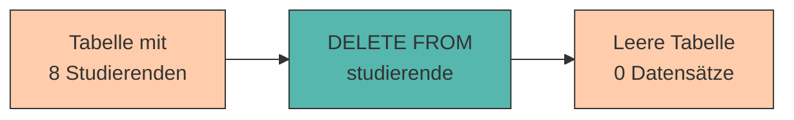

# Daten manipulieren (INSERT, UPDATE, DELETE)

Bisher haben wir gelernt, wie man Daten **einfügt** und **abfragt**. Aber was passiert, wenn sich Daten ändern müssen? Wenn ein Studierender das Semester wechselt, den Studiengang ändert oder die Universität verlässt?

In diesem Kapitel lernen wir die drei **Manipulationsbefehle** von SQL kennen: **INSERT**, **UPDATE** und **DELETE**. Zusammen mit **SELECT** bilden sie die vier Grundoperationen der Datenverwaltung – oft als **CRUD** bezeichnet:

- **C**reate (INSERT)
- **R**ead (SELECT)
- **U**pdate (UPDATE)
- **D**elete (DELETE)

---

## Daten einfügen (INSERT) - Wiederholung

Wir kennen **INSERT** bereits aus Kapitel 2, aber hier noch einmal die wichtigsten Varianten:

### Einzelnen Datensatz einfügen

```sql
INSERT INTO studierende (matrikel_nr, vorname, nachname, studiengang, semester)
VALUES (12353, 'Julia', 'Mayer', 'Physik', 2);
```

### Mehrere Datensätze auf einmal

```sql
INSERT INTO studierende (matrikel_nr, vorname, nachname, studiengang, semester)
VALUES 
    (12354, 'Felix', 'Huber', 'Chemie', 1),
    (12355, 'Nina', 'Schneider', 'Biologie', 3),
    (12356, 'Tim', 'Koch', 'Physik', 2);
```

### Nur bestimmte Spalten befüllen

```sql
-- Semester wird nicht angegeben (erhält NULL oder Standardwert)
INSERT INTO studierende (matrikel_nr, vorname, nachname, studiengang)
VALUES (12357, 'Laura', 'Becker', 'Chemie');
```

<div style="background:#FFB48211; border-left:4px solid #FFB482; padding:12px 16px; margin:16px 0;">
<strong>📘 Was passiert mit fehlenden Werten?</strong><br>
Spalten, die nicht angegeben werden, erhalten entweder:
<ul style="margin:8px 0 0 0;">
<li>Den <strong>Standardwert</strong> (falls definiert mit <code>DEFAULT</code>)</li>
<li><code>NULL</code> (falls die Spalte NULL-Werte erlaubt)</li>
<li>Einen <strong>Fehler</strong>, wenn die Spalte <code>NOT NULL</code> ist und keinen Standardwert hat</li>
</ul>
</div>

---

## Daten aktualisieren (UPDATE)

Mit **UPDATE** ändern wir bestehende Datensätze.

### Syntax

```sql
UPDATE tabellenname
SET spalte1 = neuer_wert1,
    spalte2 = neuer_wert2
WHERE bedingung;
```

<div style="background:#dc262611; border-left:4px solid #dc2626; padding:12px 16px; margin:16px 0;">
<strong>⚠️ ACHTUNG: WHERE ist KRITISCH!</strong><br>
Ohne <code>WHERE</code> werden <strong>ALLE</strong> Datensätze geändert!<br>
<strong>Niemals vergessen!</strong>
</div>

### Beispiele

#### Einen einzelnen Datensatz ändern

```sql
-- Anna Müller wechselt ins 4. Semester
UPDATE studierende
SET semester = 4
WHERE matrikel_nr = 12345;
```

#### Mehrere Spalten gleichzeitig ändern

```sql
-- Max Schmidt wechselt von BWL zu Wirtschaftsinformatik und kommt ins 3. Semester
UPDATE studierende
SET studiengang = 'Wirtschaftsinformatik',
    semester = 3
WHERE matrikel_nr = 12346;
```

#### Mehrere Datensätze ändern (mit Bedingung)

```sql
-- Alle Informatik-Studierenden kommen ein Semester weiter
UPDATE studierende
SET semester = semester + 1
WHERE studiengang = 'Informatik';
```

<div style="background:#00948511; border-left:4px solid #009485; padding:12px 16px; margin:16px 0;">
<strong>💡 Tipp:</strong> Du kannst in <code>SET</code> auch mit dem aktuellen Wert rechnen:<br>
<code>semester = semester + 1</code> erhöht das Semester um 1.
</div>

---

## Die Gefahr von UPDATE ohne WHERE

**Was passiert hier?**

```sql
UPDATE studierende
SET semester = 1;
```

❌ **Alle Studierenden** werden jetzt auf Semester 1 gesetzt – egal in welchem Semester sie vorher waren!

**Visualisierung:**

```
Vorher:                          Nachher:
 matrikel_nr │ semester           matrikel_nr │ semester
─────────────┼──────────         ─────────────┼──────────
       12345 │    3                     12345 │    1
       12346 │    2          →          12346 │    1
       12347 │    5                     12347 │    1
       12348 │    1                     12348 │    1
```

<div style="background:#dc262611; border-left:4px solid #dc2626; padding:12px 16px; margin:16px 0;">
<strong>⚠️ Goldene Regel:</strong><br>
Teste <strong>immer erst mit SELECT</strong>, ob deine WHERE-Bedingung die richtigen Zeilen findet, bevor du UPDATE ausführst!
</div>

### Sicheres Vorgehen:

```sql
-- 1. Erst prüfen: Welche Zeilen würden betroffen sein?
SELECT * FROM studierende WHERE matrikel_nr = 12345;

-- 2. Wenn richtig: UPDATE ausführen
UPDATE studierende
SET semester = 4
WHERE matrikel_nr = 12345;

-- 3. Kontrolle: Hat es funktioniert?
SELECT * FROM studierende WHERE matrikel_nr = 12345;
```

---

## Daten löschen (DELETE)

Mit **DELETE** entfernen wir Datensätze aus einer Tabelle.

### Syntax

```sql
DELETE FROM tabellenname
WHERE bedingung;
```

<div style="background:#dc262611; border-left:4px solid #dc2626; padding:12px 16px; margin:16px 0;">
<strong>⚠️ ACHTUNG: WHERE ist noch KRITISCHER!</strong><br>
Ohne <code>WHERE</code> werden <strong>ALLE</strong> Datensätze gelöscht!<br>
<strong>Und es gibt KEIN Rückgängig!</strong>
</div>

### Beispiele

#### Einzelnen Datensatz löschen

```sql
-- Studierenden mit Matrikelnummer 12348 löschen
DELETE FROM studierende
WHERE matrikel_nr = 12348;
```

#### Mehrere Datensätze löschen (mit Bedingung)

```sql
-- Alle Erstsemester löschen (z.B. weil sie exmatrikuliert wurden)
DELETE FROM studierende
WHERE semester = 1;
```

#### Nach mehreren Kriterien

```sql
-- BWL-Studierende im 4. Semester löschen
DELETE FROM studierende
WHERE studiengang = 'BWL' AND semester = 4;
```

---

## Die Gefahr von DELETE ohne WHERE

**Was passiert hier?**

```sql
DELETE FROM studierende;
```

❌ **Alle Datensätze** werden gelöscht! Die Tabelle ist danach leer (aber existiert noch).



<div style="background:#FFB48211; border-left:4px solid #FFB482; padding:12px 16px; margin:16px 0;">
<strong>📘 DELETE vs. DROP</strong><br>
<ul style="margin:8px 0 0 0;">
<li><code>DELETE FROM tabelle;</code> – Löscht alle <strong>Zeilen</strong>, die Tabelle bleibt bestehen</li>
<li><code>DROP TABLE tabelle;</code> – Löscht die <strong>gesamte Tabelle</strong> inklusive Struktur</li>
</ul>
</div>

### Sicheres Vorgehen:

```sql
-- 1. Erst prüfen: Welche Zeilen würden gelöscht?
SELECT * FROM studierende WHERE semester = 1;

-- 2. Sicher? Dann löschen
DELETE FROM studierende WHERE semester = 1;

-- 3. Kontrolle: Sind sie weg?
SELECT * FROM studierende WHERE semester = 1;  -- Sollte leer sein
```

---

## UPDATE mit Berechnungen

Du kannst in UPDATE auch mit Werten rechnen:

### Numerische Berechnungen

```sql
-- Alle Semester um 1 erhöhen (Semesterwechsel)
UPDATE studierende
SET semester = semester + 1;

-- ECTS-Punkte eines Kurses verdoppeln
UPDATE kurse
SET ects = ects * 2
WHERE kurs_id = 101;
```

### String-Operationen

```sql
-- Prefix zu allen Matrikelnummern hinzufügen
UPDATE studierende
SET matrikel_nr = matrikel_nr + 10000;

-- E-Mail-Domain ändern
UPDATE studierende
SET email = REPLACE(email, '@old-uni.at', '@new-uni.at');
```

---

## UPDATE basierend auf anderen Tabellen

Manchmal möchte man Werte aus einer anderen Tabelle verwenden (fortgeschrittenes Thema, kommt später in Joins):

```sql
-- Beispiel: Studierende bekommen den Dozent-Namen ihres Hauptkurses
UPDATE studierende
SET betreuer = (
    SELECT dozent 
    FROM kurse 
    WHERE kurs_id = studierende.hauptkurs_id
);
```

<div style="background:#00948511; border-left:4px solid #009485; padding:12px 16px; margin:16px 0;">
<strong>💡 Hinweis:</strong> Das ist eine <strong>Unterabfrage (Subquery)</strong> – wird in späteren Kapiteln detailliert behandelt.
</div>

---

## Praktische Übungen 🎯

### Vorbereitung

Stelle sicher, dass du folgende Testdaten in deiner Datenbank hast:

```sql
-- Falls nötig, Tabelle neu erstellen
DROP TABLE IF EXISTS studierende;

CREATE TABLE studierende (
    matrikel_nr INTEGER PRIMARY KEY,
    vorname VARCHAR(50),
    nachname VARCHAR(50),
    studiengang VARCHAR(100),
    semester INTEGER
);

INSERT INTO studierende (matrikel_nr, vorname, nachname, studiengang, semester)
VALUES 
    (12345, 'Anna', 'Müller', 'Informatik', 3),
    (12346, 'Max', 'Schmidt', 'BWL', 2),
    (12347, 'Lisa', 'Weber', 'Informatik', 5),
    (12348, 'Tom', 'Bauer', 'Mathematik', 1),
    (12349, 'Sarah', 'Klein', 'Informatik', 3);
```

### Aufgabe 1: UPDATE üben

1. Anna Müller kommt ins 4. Semester
2. Max Schmidt wechselt zu "Wirtschaftsinformatik"
3. Alle Informatik-Studierenden im 3. Semester kommen ins 4. Semester

<details>
<summary>💡 Lösungen anzeigen</summary>

```sql
-- 1
UPDATE studierende
SET semester = 4
WHERE matrikel_nr = 12345;

-- 2
UPDATE studierende
SET studiengang = 'Wirtschaftsinformatik'
WHERE matrikel_nr = 12346;

-- 3
UPDATE studierende
SET semester = 4
WHERE studiengang = 'Informatik' AND semester = 3;
```
</details>

### Aufgabe 2: DELETE üben

1. Lösche Tom Bauer (Matrikelnummer 12348)
2. Lösche alle Studierenden im 5. Semester

<details>
<summary>💡 Lösungen anzeigen</summary>

```sql
-- 1
DELETE FROM studierende
WHERE matrikel_nr = 12348;

-- 2
DELETE FROM studierende
WHERE semester = 5;
```
</details>

### Aufgabe 3: Fehler finden

Was ist an folgenden Befehlen falsch oder gefährlich?

```sql
-- A)
UPDATE studierende
SET semester = 1;

-- B)
DELETE FROM studierende;

-- C)
UPDATE studierende
SET studiengang = 'Informatik'
WHERE name = 'Müller';
```

<details>
<summary>💡 Lösungen anzeigen</summary>

**A)** Keine WHERE-Klausel → Alle Studierenden werden auf Semester 1 gesetzt!

**B)** Keine WHERE-Klausel → Alle Studierenden werden gelöscht!

**C)** Die Spalte heißt `nachname`, nicht `name` → Fehler oder keine Zeilen betroffen!
</details>

---

## Best Practices 🎯

### 1. Immer mit SELECT testen

```sql
-- ❌ Nicht so:
UPDATE studierende SET semester = 5 WHERE studiengang = 'Informatik';

-- ✅ Besser:
SELECT * FROM studierende WHERE studiengang = 'Informatik';  -- Prüfen!
UPDATE studierende SET semester = 5 WHERE studiengang = 'Informatik';
SELECT * FROM studierende WHERE studiengang = 'Informatik';  -- Kontrolle!
```

### 2. Transaktionen verwenden (kommt in Kapitel 10)

```sql
BEGIN;  -- Transaktion starten
UPDATE studierende SET semester = 5 WHERE studiengang = 'Informatik';
-- Prüfen ob richtig...
COMMIT;  -- oder ROLLBACK bei Fehler
```

### 3. WHERE-Klausel nie vergessen

<div style="background:#dc262611; border-left:4px solid #dc2626; padding:12px 16px; margin:16px 0;">
Bei <strong>UPDATE</strong> und <strong>DELETE</strong> ohne WHERE-Klausel sollten bei dir <strong>alle Alarmglocken läuten</strong>!
</div>

### 4. Primärschlüssel für DELETE/UPDATE verwenden

```sql
-- ✅ Am sichersten: Nach Primärschlüssel
DELETE FROM studierende WHERE matrikel_nr = 12345;

-- ⚠️ Gefährlicher: Nach anderen Attributen (könnten mehrfach vorkommen)
DELETE FROM studierende WHERE vorname = 'Max';  -- Wie viele "Max" gibt es?
```

---

## Häufige Fehler und Lösungen

### Fehler 1: Spalte existiert nicht

```sql
UPDATE studierende
SET name = 'Neuer Name'
WHERE matrikel_nr = 12345;
```

**Fehler:** `column "name" does not exist`

**Lösung:** Spalte heißt `vorname` oder `nachname`:

```sql
UPDATE studierende
SET nachname = 'Neuer Name'
WHERE matrikel_nr = 12345;
```

### Fehler 2: Primärschlüssel-Verletzung

```sql
UPDATE studierende
SET matrikel_nr = 12345
WHERE matrikel_nr = 12346;
```

**Fehler:** `duplicate key value violates unique constraint`

**Grund:** Matrikelnummer 12345 existiert bereits!

### Fehler 3: NULL in NOT NULL Spalte

```sql
UPDATE studierende
SET matrikel_nr = NULL
WHERE matrikel_nr = 12345;
```

**Fehler:** `null value in column "matrikel_nr" violates not-null constraint`

**Grund:** Primärschlüssel darf nicht NULL sein!

---

## Zusammenfassung 📌

- **INSERT** fügt neue Datensätze hinzu
- **UPDATE** ändert bestehende Datensätze – **IMMER mit WHERE** (außer du willst wirklich alle ändern)
- **DELETE** löscht Datensätze – **IMMER mit WHERE** (außer du willst wirklich alle löschen)
- **CRUD** = Create (INSERT), Read (SELECT), Update (UPDATE), Delete (DELETE)
- **Goldene Regel:** Teste UPDATE/DELETE immer erst mit SELECT
- **Keine Rückgängig-Funktion** bei DELETE – einmal weg, immer weg!
- WHERE-Klausel vergessen = Katastrophe! 💥

**Sicherheits-Checkliste vor UPDATE/DELETE:**

✅ Habe ich die WHERE-Klausel?  
✅ Habe ich mit SELECT getestet?  
✅ Betrifft die Abfrage wirklich nur die gewünschten Zeilen?  
✅ Habe ich ein Backup? (falls es eine produktive Datenbank ist)

---

Im nächsten Kapitel lernen wir, wie wir **Beziehungen zwischen Tabellen modellieren** – der Schlüssel zu professionellen Datenbanken!