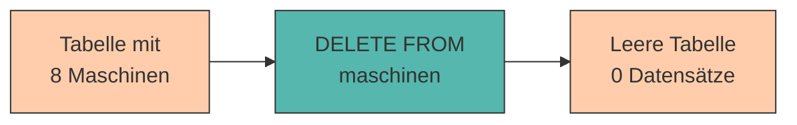

# Daten manipulieren (INSERT, UPDATE, DELETE)

Bisher haben wir gelernt, wie man Daten **einfügt** und **abfragt**. Aber was passiert, wenn sich Daten ändern müssen? Wenn eine Maschine in die Wartung geht, der Standort wechselt oder ausgemustert wird?

In diesem Kapitel lernen wir die drei **Manipulationsbefehle** von SQL kennen: **INSERT**, **UPDATE** und **DELETE**. Zusammen mit **SELECT** bilden sie die vier Grundoperationen der Datenverwaltung – oft als **CRUD** bezeichnet:

- **C**reate (INSERT)
- **R**ead (SELECT)
- **U**pdate (UPDATE)
- **D**elete (DELETE)

---

## Daten einfügen (INSERT) - Wiederholung

Wir kennen **INSERT** bereits aus Kapitel 2, aber hier noch einmal die wichtigsten Varianten:

### Einzelnen Datensatz einfügen

```sql
INSERT INTO maschinen (maschinen_id, name, typ, standort, anschaffungsjahr, status)
VALUES (9, 'Pressmaschine Iota', 'Pressmaschine', 'Halle C', 2023, 'Aktiv');
```

### Mehrere Datensätze auf einmal

```sql
INSERT INTO maschinen (maschinen_id, name, typ, standort, anschaffungsjahr, status)
VALUES
    (10, 'Bohrmaschine Kappa', 'Bohrmaschine', 'Halle A', 2022, 'Aktiv'),
    (11, 'Fräse Lambda', 'CNC-Fräse', 'Halle B', 2021, 'Aktiv'),
    (12, 'Poliermaschine Mu', 'Poliermaschine', 'Halle C', 2020, 'Wartung');
```

### Nur bestimmte Spalten befüllen

```sql
-- Status wird nicht angegeben (erhält NULL oder Standardwert)
INSERT INTO maschinen (maschinen_id, name, typ, standort, anschaffungsjahr)
VALUES (13, 'Testanlage Nu', 'Testanlage', 'Halle D', 2024);
```

<div style="background:#FFB48211; border-left:4px solid #FFB482; padding:12px 16px; margin:16px 0;">
<strong>📘 Was passiert mit fehlenden Werten?</strong><br>
Spalten, die nicht angegeben werden, erhalten entweder:
<ul style="margin:8px 0 0 0;">
<li>Den <strong>Standardwert</strong> (falls definiert mit <code>DEFAULT</code>)</li>
<li><code>NULL</code> (falls die Spalte NULL-Werte erlaubt)</li>
<li>Einen <strong>Fehler</strong>, wenn die Spalte <code>NOT NULL</code> ist und keinen Standardwert hat</li>
</ul>
</div>

---

## Daten aktualisieren (UPDATE)

Mit **UPDATE** ändern wir bestehende Datensätze.

### Syntax

```sql
UPDATE tabellenname
SET spalte1 = neuer_wert1,
    spalte2 = neuer_wert2
WHERE bedingung;
```

<div style="background:#dc262611; border-left:4px solid #dc2626; padding:12px 16px; margin:16px 0;">
<strong>⚠️ ACHTUNG: WHERE ist KRITISCH!</strong><br>
Ohne <code>WHERE</code> werden <strong>ALLE</strong> Datensätze geändert!<br>
<strong>Niemals vergessen!</strong>
</div>

### Beispiele

#### Einen einzelnen Datensatz ändern

```sql
-- CNC-Fräse Alpha geht in Wartung
UPDATE maschinen
SET status = 'Wartung'
WHERE maschinen_id = 1;
```

#### Mehrere Spalten gleichzeitig ändern

```sql
-- Drehbank Beta wechselt Standort und geht in Wartung
UPDATE maschinen
SET standort = 'Halle C',
    status = 'Wartung'
WHERE maschinen_id = 2;
```

#### Mehrere Datensätze ändern (mit Bedingung)

```sql
-- Alle Maschinen in Halle A werden auf Aktiv gesetzt
UPDATE maschinen
SET status = 'Aktiv'
WHERE standort = 'Halle A';
```

<div style="background:#00948511; border-left:4px solid #009485; padding:12px 16px; margin:16px 0;">
<strong>💡 Tipp:</strong> Du kannst in <code>SET</code> auch mit dem aktuellen Wert rechnen:<br>
<code>anschaffungsjahr = anschaffungsjahr + 1</code> würde das Jahr um 1 erhöhen (falls nötig).
</div>

---

## Die Gefahr von UPDATE ohne WHERE

**Was passiert hier?**

```sql
UPDATE maschinen
SET status = 'Defekt';
```

❌ **Alle Maschinen** werden jetzt auf Status 'Defekt' gesetzt – egal welchen Status sie vorher hatten!

**Visualisierung:**

```
Vorher:                               Nachher:
 maschinen_id │ status                maschinen_id │ status
──────────────┼────────              ──────────────┼────────
            1 │ Aktiv                             1 │ Defekt
            2 │ Aktiv            →                2 │ Defekt
            3 │ Wartung                           3 │ Defekt
            4 │ Aktiv                             4 │ Defekt
```

<div style="background:#dc262611; border-left:4px solid #dc2626; padding:12px 16px; margin:16px 0;">
<strong>⚠️ Goldene Regel:</strong><br>
Teste <strong>immer erst mit SELECT</strong>, ob deine WHERE-Bedingung die richtigen Zeilen findet, bevor du UPDATE ausführst!
</div>

### Sicheres Vorgehen:

```sql
-- 1. Erst prüfen: Welche Zeilen würden betroffen sein?
SELECT * FROM maschinen WHERE maschinen_id = 1;

-- 2. Wenn richtig: UPDATE ausführen
UPDATE maschinen
SET status = 'Wartung'
WHERE maschinen_id = 1;

-- 3. Kontrolle: Hat es funktioniert?
SELECT * FROM maschinen WHERE maschinen_id = 1;
```

---

## Daten löschen (DELETE)

Mit **DELETE** entfernen wir Datensätze aus einer Tabelle.

### Syntax

```sql
DELETE FROM tabellenname
WHERE bedingung;
```

<div style="background:#dc262611; border-left:4px solid #dc2626; padding:12px 16px; margin:16px 0;">
<strong>⚠️ ACHTUNG: WHERE ist noch KRITISCHER!</strong><br>
Ohne <code>WHERE</code> werden <strong>ALLE</strong> Datensätze gelöscht!<br>
<strong>Und es gibt KEIN Rückgängig!</strong>
</div>

### Beispiele

#### Einzelnen Datensatz löschen

```sql
-- Maschine mit ID 8 löschen (z.B. weil ausgemustert)
DELETE FROM maschinen
WHERE maschinen_id = 8;
```

#### Mehrere Datensätze löschen (mit Bedingung)

```sql
-- Alle defekten Maschinen löschen (z.B. weil verschrottet)
DELETE FROM maschinen
WHERE status = 'Defekt';
```

#### Nach mehreren Kriterien

```sql
-- Maschinen in Halle C mit Status Defekt löschen
DELETE FROM maschinen
WHERE standort = 'Halle C' AND status = 'Defekt';
```

---

## Die Gefahr von DELETE ohne WHERE

**Was passiert hier?**

```sql
DELETE FROM maschinen;
```

❌ **Alle Datensätze** werden gelöscht! Die Tabelle ist danach leer (aber existiert noch).



<div style="background:#FFB48211; border-left:4px solid #FFB482; padding:12px 16px; margin:16px 0;">
<strong>📘 DELETE vs. DROP</strong><br>
<ul style="margin:8px 0 0 0;">
<li><code>DELETE FROM tabelle;</code> – Löscht alle <strong>Zeilen</strong>, die Tabelle bleibt bestehen</li>
<li><code>DROP TABLE tabelle;</code> – Löscht die <strong>gesamte Tabelle</strong> inklusive Struktur</li>
</ul>
</div>

### Sicheres Vorgehen:

```sql
-- 1. Erst prüfen: Welche Zeilen würden gelöscht?
SELECT * FROM maschinen WHERE status = 'Defekt';

-- 2. Sicher? Dann löschen
DELETE FROM maschinen WHERE status = 'Defekt';

-- 3. Kontrolle: Sind sie weg?
SELECT * FROM maschinen WHERE status = 'Defekt';  -- Sollte leer sein
```

---

## UPDATE mit Berechnungen

Du kannst in UPDATE auch mit Werten rechnen:

### Numerische Berechnungen

```sql
-- Alle Anschaffungsjahre um 1 erhöhen (z.B. Korrektur)
UPDATE maschinen
SET anschaffungsjahr = anschaffungsjahr + 1;

-- Wartungskosten in einer Wartungstabelle verdoppeln
UPDATE wartungsprotokolle
SET kosten = kosten * 2
WHERE wartungs_id = 101;
```

### String-Operationen

```sql
-- Prefix zu allen Maschinen-IDs hinzufügen (numerisch)
UPDATE maschinen
SET maschinen_id = maschinen_id + 1000;

-- Standort-Namen aktualisieren
UPDATE maschinen
SET standort = REPLACE(standort, 'Halle', 'Produktionshalle');
```

---

## UPDATE basierend auf anderen Tabellen

Manchmal möchte man Werte aus einer anderen Tabelle verwenden (fortgeschrittenes Thema, kommt später in Joins):

```sql
-- Beispiel: Maschinen bekommen den Namen des zuständigen Technikers
UPDATE maschinen
SET zustaendiger_techniker = (
    SELECT CONCAT(vorname, ' ', nachname)
    FROM techniker
    WHERE techniker_id = maschinen.techniker_id
);
```

<div style="background:#00948511; border-left:4px solid #009485; padding:12px 16px; margin:16px 0;">
<strong>💡 Hinweis:</strong> Das ist eine <strong>Unterabfrage (Subquery)</strong> – wird in späteren Kapiteln detailliert behandelt.
</div>

---

## Praktische Übungen 🎯

### Vorbereitung

Stelle sicher, dass du folgende Testdaten in deiner Datenbank hast:

```sql
-- Falls nötig, Tabelle neu erstellen
DROP TABLE IF EXISTS maschinen;

CREATE TABLE maschinen (
    maschinen_id INTEGER PRIMARY KEY,
    name VARCHAR(100),
    typ VARCHAR(50),
    standort VARCHAR(50),
    anschaffungsjahr INTEGER,
    status VARCHAR(20)
);

INSERT INTO maschinen (maschinen_id, name, typ, standort, anschaffungsjahr, status)
VALUES
    (1, 'CNC-Fräse Alpha', 'CNC-Fräse', 'Halle A', 2019, 'Aktiv'),
    (2, 'Drehbank Beta', 'Drehbank', 'Halle A', 2021, 'Aktiv'),
    (3, 'Schweißroboter Gamma', 'Schweißroboter', 'Halle B', 2020, 'Wartung'),
    (4, 'Lackieranlage Delta', 'Lackieranlage', 'Halle C', 2018, 'Aktiv'),
    (5, 'CNC-Fräse Epsilon', 'CNC-Fräse', 'Halle A', 2022, 'Aktiv');
```

### Aufgabe 1: UPDATE üben

1. CNC-Fräse Alpha geht in Wartung
2. Drehbank Beta wechselt nach "Halle C"
3. Alle CNC-Fräsen in Halle A bekommen Status "Aktiv"

<details>
<summary>💡 Lösungen anzeigen</summary>

```sql
-- 1
UPDATE maschinen
SET status = 'Wartung'
WHERE maschinen_id = 1;

-- 2
UPDATE maschinen
SET standort = 'Halle C'
WHERE maschinen_id = 2;

-- 3
UPDATE maschinen
SET status = 'Aktiv'
WHERE typ = 'CNC-Fräse' AND standort = 'Halle A';
```
</details>

### Aufgabe 2: DELETE üben

1. Lösche Lackieranlage Delta (Maschinen-ID 4)
2. Lösche alle Maschinen in Wartung

<details>
<summary>💡 Lösungen anzeigen</summary>

```sql
-- 1
DELETE FROM maschinen
WHERE maschinen_id = 4;

-- 2
DELETE FROM maschinen
WHERE status = 'Wartung';
```
</details>

### Aufgabe 3: Fehler finden

Was ist an folgenden Befehlen falsch oder gefährlich?

```sql
-- A)
UPDATE maschinen
SET status = 'Defekt';

-- B)
DELETE FROM maschinen;

-- C)
UPDATE maschinen
SET typ = 'CNC-Fräse'
WHERE maschine = 'Alpha';
```

<details>
<summary>💡 Lösungen anzeigen</summary>

**A)** Keine WHERE-Klausel → Alle Maschinen werden auf Status 'Defekt' gesetzt!

**B)** Keine WHERE-Klausel → Alle Maschinen werden gelöscht!

**C)** Die Spalte heißt `name`, nicht `maschine` → Fehler oder keine Zeilen betroffen!
</details>

---

## Best Practices 🎯

### 1. Immer mit SELECT testen

```sql
-- ❌ Nicht so:
UPDATE maschinen SET status = 'Wartung' WHERE standort = 'Halle A';

-- ✅ Besser:
SELECT * FROM maschinen WHERE standort = 'Halle A';  -- Prüfen!
UPDATE maschinen SET status = 'Wartung' WHERE standort = 'Halle A';
SELECT * FROM maschinen WHERE standort = 'Halle A';  -- Kontrolle!
```

### 2. Transaktionen verwenden (kommt in Kapitel 10)

```sql
BEGIN;  -- Transaktion starten
UPDATE maschinen SET status = 'Wartung' WHERE standort = 'Halle A';
-- Prüfen ob richtig...
COMMIT;  -- oder ROLLBACK bei Fehler
```

### 3. WHERE-Klausel nie vergessen

<div style="background:#dc262611; border-left:4px solid #dc2626; padding:12px 16px; margin:16px 0;">
Bei <strong>UPDATE</strong> und <strong>DELETE</strong> ohne WHERE-Klausel sollten bei dir <strong>alle Alarmglocken läuten</strong>!
</div>

### 4. Primärschlüssel für DELETE/UPDATE verwenden

```sql
-- ✅ Am sichersten: Nach Primärschlüssel
DELETE FROM maschinen WHERE maschinen_id = 1;

-- ⚠️ Gefährlicher: Nach anderen Attributen (könnten mehrfach vorkommen)
DELETE FROM maschinen WHERE typ = 'CNC-Fräse';  -- Wie viele CNC-Fräsen gibt es?
```

---

## Häufige Fehler und Lösungen

### Fehler 1: Spalte existiert nicht

```sql
UPDATE maschinen
SET maschine = 'Neuer Name'
WHERE maschinen_id = 1;
```

**Fehler:** `column "maschine" does not exist`

**Lösung:** Spalte heißt `name`:

```sql
UPDATE maschinen
SET name = 'Neuer Name'
WHERE maschinen_id = 1;
```

### Fehler 2: Primärschlüssel-Verletzung

```sql
UPDATE maschinen
SET maschinen_id = 1
WHERE maschinen_id = 2;
```

**Fehler:** `duplicate key value violates unique constraint`

**Grund:** Maschinen-ID 1 existiert bereits!

### Fehler 3: NULL in NOT NULL Spalte

```sql
UPDATE maschinen
SET maschinen_id = NULL
WHERE maschinen_id = 1;
```

**Fehler:** `null value in column "maschinen_id" violates not-null constraint`

**Grund:** Primärschlüssel darf nicht NULL sein!

---

## Zusammenfassung 📌

- **INSERT** fügt neue Datensätze hinzu
- **UPDATE** ändert bestehende Datensätze – **IMMER mit WHERE** (außer du willst wirklich alle ändern)
- **DELETE** löscht Datensätze – **IMMER mit WHERE** (außer du willst wirklich alle löschen)
- **CRUD** = Create (INSERT), Read (SELECT), Update (UPDATE), Delete (DELETE)
- **Goldene Regel:** Teste UPDATE/DELETE immer erst mit SELECT
- **Keine Rückgängig-Funktion** bei DELETE – einmal weg, immer weg!
- WHERE-Klausel vergessen = Katastrophe! 💥

**Sicherheits-Checkliste vor UPDATE/DELETE:**

✅ Habe ich die WHERE-Klausel?  
✅ Habe ich mit SELECT getestet?  
✅ Betrifft die Abfrage wirklich nur die gewünschten Zeilen?  
✅ Habe ich ein Backup? (falls es eine produktive Datenbank ist)

---

Im nächsten Kapitel lernen wir, wie wir **Beziehungen zwischen Tabellen modellieren** – der Schlüssel zu professionellen Datenbanken!