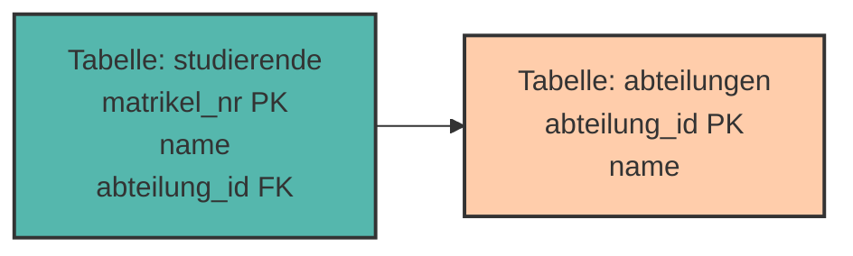
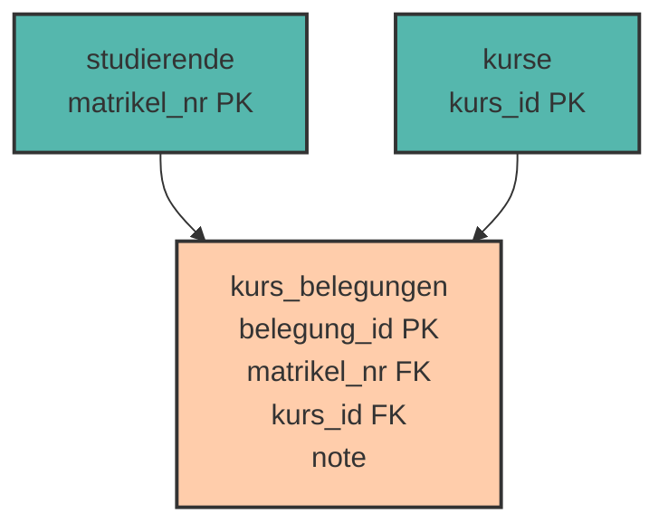

# Datenmodellierung & Beziehungen

Bisher haben wir mit **einzelnen Tabellen** gearbeitet. Aber die wahre Stärke relationaler Datenbanken liegt darin, **Beziehungen zwischen Tabellen** zu modellieren!

Stell dir vor: Ein Studierender belegt mehrere Kurse, und jeder Kurs wird von mehreren Studierenden besucht. Wie modellieren wir das? Genau darum geht es in diesem Kapitel!

---

## Warum mehrere Tabellen?

### Problem: Alles in einer Tabelle

Versuchen wir, Studierende **und** ihre Kurse in einer einzigen Tabelle zu speichern:

```
 matrikel_nr │ name         │ kurs_id │ kursname      │ dozent    
─────────────┼──────────────┼─────────┼───────────────┼───────────
       12345 │ Anna Müller  │     101 │ Datenbanken   │ Dr. Weber
       12345 │ Anna Müller  │     102 │ Algorithmen   │ Prof. Koch
       12346 │ Max Schmidt  │     101 │ Datenbanken   │ Dr. Weber
       12346 │ Max Schmidt  │     103 │ Webentwicklung│ Dr. Mayer
```

**Probleme:**

❌ **Redundanz** – Der Name "Anna Müller" steht mehrfach  
❌ **Update-Anomalie** – Ändert Anna ihren Namen, müssen wir mehrere Zeilen ändern  
❌ **Inkonsistenz** – Was, wenn wir den Namen nur in einer Zeile ändern?  
❌ **Speicherverschwendung** – Kursinformationen werden ständig wiederholt

### Lösung: Aufteilen in mehrere Tabellen

```
Tabelle: studierende              Tabelle: kurse
 matrikel_nr │ name               kurs_id │ kursname      │ dozent
─────────────┼──────────           ────────┼───────────────┼──────────
       12345 │ Anna Müller            101 │ Datenbanken   │ Dr. Weber
       12346 │ Max Schmidt            102 │ Algorithmen   │ Prof. Koch
                                      103 │ Webentwicklung│ Dr. Mayer
```

✅ Jede Information nur **einmal** gespeichert  
✅ Änderungen nur an **einer Stelle**  
✅ **Kein Datenverlust**, keine Inkonsistenzen

---

## Das Entity-Relationship-Modell (ERM)

Bevor wir Tabellen erstellen, **modellieren** wir die Datenstruktur mit einem **ER-Diagramm**.

### Die drei Grundkonzepte

**1. Entität (Entity)**

Eine Entität ist ein **Objekt** der realen Welt, z.B.:

- Ein konkreter Studierender: "Anna Müller"
- Ein konkreter Kurs: "Datenbanken"
- Eine konkrete Bestellung: "Bestellung Nr. 4711"

**2. Entitätstyp (Entity Type)**

Ein Entitätstyp ist eine **Kategorie** gleichartiger Entitäten:

- Studierende (alle Studierenden)
- Kurse (alle Kurse)
- Bestellungen (alle Bestellungen)

Im ER-Diagramm als **Rechteck** dargestellt:

```
┌─────────────┐
│ Studierende │
└─────────────┘
```

**3. Beziehung (Relationship)**

Eine Beziehung verbindet Entitätstypen miteinander:

- Studierende **belegen** Kurse
- Angestellte **arbeiten in** Abteilungen
- Kunden **tätigen** Bestellungen

Im ER-Diagramm als **Raute** dargestellt:

```
┌─────────────┐       ┌────────┐       ┌────────┐
│ Studierende ├───────┤ belegen├───────┤ Kurse  │
└─────────────┘       └────────┘       └────────┘
```

---

## Kardinalitäten - Wie viele?

Kardinalitäten beschreiben, **wie viele** Entitäten an einer Beziehung beteiligt sein können.

### Die drei wichtigsten Beziehungstypen

#### 1:n (Eins-zu-Viele)

**Beispiel:** Eine Abteilung hat viele Angestellte, aber jeder Angestellte gehört zu **einer** Abteilung.

```
┌────────────┐   1      n   ┌──────────────┐
│ Abteilung  ├──────────────┤ Angestellte  │
└────────────┘               └──────────────┘
```

**Weitere Beispiele:**

- Ein Autor schreibt viele Bücher (1:n)
- Ein Kunde hat viele Bestellungen (1:n)
- Ein Dozent gibt viele Kurse (1:n)

#### n:m (Viele-zu-Viele)

**Beispiel:** Ein Studierender belegt viele Kurse, und ein Kurs wird von vielen Studierenden besucht.

```
┌─────────────┐   n      m   ┌────────┐
│ Studierende ├──────────────┤ Kurse  │
└─────────────┘               └────────┘
```

**Weitere Beispiele:**

- Angestellte arbeiten an Projekten (n:m)
- Schauspieler spielen in Filmen (n:m)
- Produkte werden in Bestellungen gekauft (n:m)

#### 1:1 (Eins-zu-Eins)

**Beispiel:** Jeder Angestellte hat **einen** Dienstwagen, und jeder Dienstwagen gehört zu **einem** Angestellten.

```
┌──────────────┐   1      1   ┌─────────────┐
│ Angestellte  ├──────────────┤ Dienstwagen │
└──────────────┘               └─────────────┘
```

<div style="background:#FFB48211; border-left:4px solid #FFB482; padding:12px 16px; margin:16px 0;">
<strong>📘 Hinweis:</strong><br>
1:1-Beziehungen sind selten. Oft kann man die Informationen auch in einer Tabelle speichern.
</div>

---

## Fremdschlüssel (Foreign Key)

Ein **Fremdschlüssel** ist der Primärschlüssel einer anderen Tabelle, der in unserer Tabelle gespeichert wird, um eine Beziehung herzustellen.



**Der Fremdschlüssel `abteilung_id`** in der Tabelle `studierende` verweist auf den **Primärschlüssel `abteilung_id`** in der Tabelle `abteilungen`.

---

## 1:n Beziehungen implementieren

**Regel:** Der Fremdschlüssel kommt auf die **n-Seite** (die "viele"-Seite).

### Beispiel: Abteilungen und Angestellte

**ER-Modell:**

```
Abteilung (1) ───── hat ───── (n) Angestellte
```

### Schritt 1: Tabellen erstellen

```sql
-- Zuerst die "1"-Seite
CREATE TABLE abteilungen (
    abteilung_id SERIAL PRIMARY KEY,
    name VARCHAR(100) NOT NULL,
    standort VARCHAR(100)
);

-- Dann die "n"-Seite mit Fremdschlüssel
CREATE TABLE angestellte (
    angestellte_id SERIAL PRIMARY KEY,
    name VARCHAR(100) NOT NULL,
    gehalt NUMERIC(10, 2),
    abteilung_id INTEGER NOT NULL,
    FOREIGN KEY (abteilung_id) REFERENCES abteilungen(abteilung_id)
);
```

<div style="background:#00948511; border-left:4px solid #009485; padding:12px 16px; margin:16px 0;">
<strong>💡 Wichtig:</strong><br>
Die referenzierte Tabelle (<code>abteilungen</code>) muss <strong>vor</strong> der referenzierenden Tabelle (<code>angestellte</code>) erstellt werden!
</div>

### Schritt 2: Daten einfügen

```sql
-- Erst Abteilungen
INSERT INTO abteilungen (name, standort)
VALUES 
    ('IT', 'Wien'),
    ('HR', 'Graz'),
    ('Marketing', 'Linz');

-- Dann Angestellte
INSERT INTO angestellte (name, gehalt, abteilung_id)
VALUES 
    ('Anna Müller', 4500.00, 1),  -- IT
    ('Max Schmidt', 3800.00, 2),  -- HR
    ('Lisa Weber', 4200.00, 1),   -- IT
    ('Tom Bauer', 3500.00, 3);    -- Marketing
```

**Ergebnis:**

```
abteilungen:
 abteilung_id │ name      │ standort 
──────────────┼───────────┼──────────
            1 │ IT        │ Wien
            2 │ HR        │ Graz
            3 │ Marketing │ Linz

angestellte:
 angestellte_id │ name         │ gehalt  │ abteilung_id 
────────────────┼──────────────┼─────────┼──────────────
              1 │ Anna Müller  │ 4500.00 │            1
              2 │ Max Schmidt  │ 3800.00 │            2
              3 │ Lisa Weber   │ 4200.00 │            1
              4 │ Tom Bauer    │ 3500.00 │            3
```

---

## Referenzielle Integrität

**Referenzielle Integrität** bedeutet: Jeder Fremdschlüssel muss auf einen **existierenden** Primärschlüssel verweisen.

### Was passiert beim Löschen?

```sql
-- Versuch, Abteilung 1 (IT) zu löschen
DELETE FROM abteilungen WHERE abteilung_id = 1;
```

❌ **Fehler!** Anna und Lisa arbeiten in Abteilung 1 – sie würden "verwaisen".

### Lösung: ON DELETE Optionen

```sql
CREATE TABLE angestellte (
    angestellte_id SERIAL PRIMARY KEY,
    name VARCHAR(100),
    abteilung_id INTEGER,
    FOREIGN KEY (abteilung_id) REFERENCES abteilungen(abteilung_id)
        ON DELETE RESTRICT  -- Löschen verhindern
);
```

<div style="text-align:center; max-width:900px; margin:16px auto;">
<table role="table" 
       style="width:100%; border-collapse:separate; border-spacing:0; border:1px solid #cfd8e3; border-radius:10px; overflow:hidden; font-family:system-ui,sans-serif;">
    <thead>
    <tr style="background:#009485; color:#fff;">
        <th style="text-align:left; padding:12px 14px; font-weight:700;">Option</th>
        <th style="text-align:left; padding:12px 14px; font-weight:700;">Bedeutung</th>
    </tr>
    </thead>
    <tbody>
    <tr>
        <td style="background:#00948511; padding:10px 14px;"><code>ON DELETE RESTRICT</code></td>
        <td style="padding:10px 14px;">Löschen wird <strong>verhindert</strong>, wenn noch Verweise existieren (Standard)</td>
    </tr>
    <tr>
        <td style="background:#00948511; padding:10px 14px;"><code>ON DELETE CASCADE</code></td>
        <td style="padding:10px 14px;">Löscht <strong>automatisch alle abhängigen Datensätze</strong> mit</td>
    </tr>
    <tr>
        <td style="background:#00948511; padding:10px 14px;"><code>ON DELETE SET NULL</code></td>
        <td style="padding:10px 14px;">Setzt Fremdschlüssel auf <code>NULL</code></td>
    </tr>
    <tr>
        <td style="background:#00948511; padding:10px 14px;"><code>ON DELETE SET DEFAULT</code></td>
        <td style="padding:10px 14px;">Setzt Fremdschlüssel auf Standardwert</td>
    </tr>
    </tbody>
</table>
</div>

### Beispiele

#### CASCADE - Kaskadierende Löschung

```sql
CREATE TABLE angestellte (
    angestellte_id SERIAL PRIMARY KEY,
    name VARCHAR(100),
    abteilung_id INTEGER,
    FOREIGN KEY (abteilung_id) REFERENCES abteilungen(abteilung_id)
        ON DELETE CASCADE
);

-- Löscht Abteilung UND alle Angestellten in dieser Abteilung
DELETE FROM abteilungen WHERE abteilung_id = 1;
```

⚠️ **Vorsicht!** Alle Angestellten der IT-Abteilung werden gelöscht!

#### SET NULL

```sql
CREATE TABLE angestellte (
    angestellte_id SERIAL PRIMARY KEY,
    name VARCHAR(100),
    abteilung_id INTEGER,  -- Muss NULL erlauben!
    FOREIGN KEY (abteilung_id) REFERENCES abteilungen(abteilung_id)
        ON DELETE SET NULL
);

-- Löscht Abteilung, Angestellte bleiben, aber ohne Abteilung
DELETE FROM abteilungen WHERE abteilung_id = 1;
```

---

## n:m Beziehungen implementieren

**Problem:** Wir können keine n:m-Beziehung direkt mit Fremdschlüsseln umsetzen!

**Lösung:** Eine **Zwischentabelle** (auch **Verbindungstabelle** oder **Junction Table**).

### Beispiel: Studierende und Kurse

**ER-Modell:**

```
Studierende (n) ───── belegen ───── (m) Kurse
```

### Schritt 1: Die drei Tabellen

```sql
-- Tabelle 1: Studierende
CREATE TABLE studierende (
    matrikel_nr INTEGER PRIMARY KEY,
    vorname VARCHAR(50),
    nachname VARCHAR(50)
);

-- Tabelle 2: Kurse
CREATE TABLE kurse (
    kurs_id INTEGER PRIMARY KEY,
    kursname VARCHAR(100),
    dozent VARCHAR(50),
    ects INTEGER
);

-- Tabelle 3: Zwischentabelle für die n:m-Beziehung
CREATE TABLE kurs_belegungen (
    belegung_id SERIAL PRIMARY KEY,
    matrikel_nr INTEGER NOT NULL,
    kurs_id INTEGER NOT NULL,
    note NUMERIC(2, 1),  -- Zusätzliches Attribut der Beziehung!
    FOREIGN KEY (matrikel_nr) REFERENCES studierende(matrikel_nr)
        ON DELETE CASCADE,
    FOREIGN KEY (kurs_id) REFERENCES kurse(kurs_id)
        ON DELETE CASCADE
);
```



### Schritt 2: Daten einfügen

```sql
-- Studierende
INSERT INTO studierende (matrikel_nr, vorname, nachname)
VALUES 
    (12345, 'Anna', 'Müller'),
    (12346, 'Max', 'Schmidt'),
    (12347, 'Lisa', 'Weber');

-- Kurse
INSERT INTO kurse (kurs_id, kursname, dozent, ects)
VALUES 
    (101, 'Datenbanken', 'Dr. Weber', 6),
    (102, 'Algorithmen', 'Prof. Koch', 5),
    (103, 'Webentwicklung', 'Dr. Mayer', 4);

-- Belegungen (wer belegt was?)
INSERT INTO kurs_belegungen (matrikel_nr, kurs_id, note)
VALUES 
    (12345, 101, 1.3),  -- Anna belegt Datenbanken
    (12345, 102, 2.0),  -- Anna belegt Algorithmen
    (12346, 101, 1.7),  -- Max belegt Datenbanken
    (12346, 103, 2.3),  -- Max belegt Webentwicklung
    (12347, 102, 1.0),  -- Lisa belegt Algorithmen
    (12347, 103, 1.7);  -- Lisa belegt Webentwicklung
```

**Visualisierung:**

```
Anna Müller (12345) belegt:
  ├─ Datenbanken (Note: 1.3)
  └─ Algorithmen (Note: 2.0)

Max Schmidt (12346) belegt:
  ├─ Datenbanken (Note: 1.7)
  └─ Webentwicklung (Note: 2.3)

Lisa Weber (12347) belegt:
  ├─ Algorithmen (Note: 1.0)
  └─ Webentwicklung (Note: 1.7)
```

---

## Praktische Übungen 🎯

### Aufgabe 1: 1:n Beziehung

Erstelle Tabellen für Autoren und Bücher (1:n).

**Anforderungen:**

- Ein Autor schreibt viele Bücher
- Jedes Buch hat einen Autor
- Autoren: ID, Name, Geburtsjahr
- Bücher: ISBN, Titel, Erscheinungsjahr, Autor

<details>
<summary>💡 Lösung anzeigen</summary>

```sql
CREATE TABLE autoren (
    autor_id SERIAL PRIMARY KEY,
    name VARCHAR(100) NOT NULL,
    geburtsjahr INTEGER
);

CREATE TABLE buecher (
    isbn VARCHAR(13) PRIMARY KEY,
    titel VARCHAR(200) NOT NULL,
    erscheinungsjahr INTEGER,
    autor_id INTEGER NOT NULL,
    FOREIGN KEY (autor_id) REFERENCES autoren(autor_id)
        ON DELETE RESTRICT
);

-- Testdaten
INSERT INTO autoren (name, geburtsjahr)
VALUES 
    ('J.K. Rowling', 1965),
    ('George Orwell', 1903);

INSERT INTO buecher (isbn, titel, erscheinungsjahr, autor_id)
VALUES 
    ('9780439708180', 'Harry Potter', 1997, 1),
    ('9780451524935', '1984', 1949, 2);
```
</details>

### Aufgabe 2: n:m Beziehung

Erstelle Tabellen für Schauspieler und Filme (n:m).

**Anforderungen:**

- Ein Schauspieler spielt in vielen Filmen
- Ein Film hat viele Schauspieler
- Schauspieler: ID, Name
- Filme: ID, Titel, Jahr
- Rollen: Welcher Schauspieler in welchem Film + Rollenname

<details>
<summary>💡 Lösung anzeigen</summary>

```sql
CREATE TABLE schauspieler (
    schauspieler_id SERIAL PRIMARY KEY,
    name VARCHAR(100) NOT NULL
);

CREATE TABLE filme (
    film_id SERIAL PRIMARY KEY,
    titel VARCHAR(200) NOT NULL,
    jahr INTEGER
);

CREATE TABLE rollen (
    rolle_id SERIAL PRIMARY KEY,
    schauspieler_id INTEGER NOT NULL,
    film_id INTEGER NOT NULL,
    rollenname VARCHAR(100),
    FOREIGN KEY (schauspieler_id) REFERENCES schauspieler(schauspieler_id)
        ON DELETE CASCADE,
    FOREIGN KEY (film_id) REFERENCES filme(film_id)
        ON DELETE CASCADE
);

-- Testdaten
INSERT INTO schauspieler (name)
VALUES ('Leonardo DiCaprio'), ('Kate Winslet');

INSERT INTO filme (titel, jahr)
VALUES ('Titanic', 1997), ('Inception', 2010);

INSERT INTO rollen (schauspieler_id, film_id, rollenname)
VALUES 
    (1, 1, 'Jack Dawson'),
    (2, 1, 'Rose DeWitt Bukater'),
    (1, 2, 'Dom Cobb');
```
</details>

---

## Zusammenfassung 📌

- **ER-Modell** beschreibt Entitäten, Attribute und Beziehungen
- **Kardinalitäten**: 1:1, 1:n, n:m beschreiben die Anzahl der Beziehungen
- **Fremdschlüssel** (Foreign Key) stellen Beziehungen zwischen Tabellen her
- **1:n-Beziehungen**: Fremdschlüssel auf der "n"-Seite
- **n:m-Beziehungen**: Benötigen eine Zwischentabelle mit zwei Fremdschlüsseln
- **Referenzielle Integrität** stellt sicher, dass Fremdschlüssel auf existierende Primärschlüssel verweisen
- **ON DELETE**: RESTRICT (verhindert), CASCADE (löscht mit), SET NULL, SET DEFAULT

**Wichtigste Regel:**

> Modelliere erst mit ER-Diagrammen, dann implementiere in SQL!

---

Im nächsten Kapitel lernen wir **JOINs** kennen – wie man Daten aus mehreren verknüpften Tabellen abfragt!