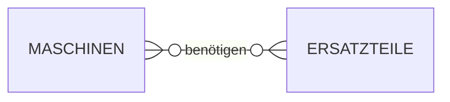
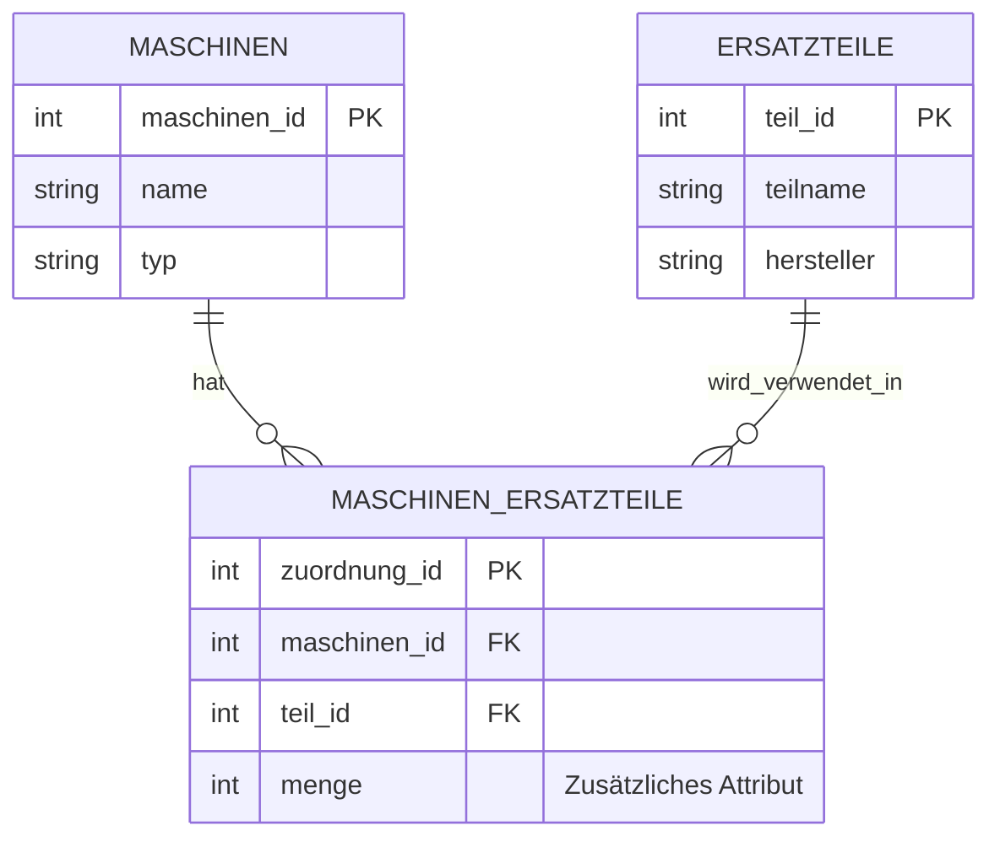

# Datenmodellierung & Beziehungen


Nachdem wir nun wissen, wie wir mit einzelnen Tabellen in Datenbanken umgehen (CRUD) ist es nun an der Zeit, einen Schritt weiter zu gehen. 
Die wahre Stärke relationaler Datenbanken liegt nämlich darin, **Beziehungen zwischen Tabellen** zu modellieren!

Stellen wir uns vor:

- Eine **Maschine** hat mehrere **Wartungen**
- Ein **Ersatzteil** wird in mehreren **Maschinen** verwendet
- Ein **Techniker** führt viele **Wartungen** durch

Wie modellieren wir solche Zusammenhänge? Genau darum geht es in diesem Kapitel!

---

## Das Problem

Beginnen wir mit einem Gedankenexperiment: Was passiert, wenn wir versuchen, alle Informationen in einer einzigen Tabelle zu speichern?


Versuchen wir, Maschinen **und** ihre Wartungen in einer einzigen Tabelle zu speichern:

```{.cmd .no-copy title="Tabelle: maschinen_mit_wartungen"}
 maschinen_id |      name        |     typ     | wartungsdatum |   techniker   | kosten
--------------+------------------+-------------+---------------+---------------+--------
            1 | CNC-Fräse Alpha  | CNC-Fräse   | 2024-01-15    | M. Schneider  | 450.00
            1 | CNC-Fräse Alpha  | CNC-Fräse   | 2024-06-20    | M. Schneider  | 320.00
            2 | Drehbank Beta    | Drehbank    | 2024-01-15    | M. Schneider  | 280.00
            2 | Drehbank Beta    | Drehbank    | 2024-03-10    | L. Weber      | 150.00
```

Doch wo liegt hier das Problem? 


1. **Redundanz** - Daten werden unnötig wiederholt
    
    Beispiel: Der Name "CNC-Fräse Alpha" und "CNC-Fräse" stehen mehrfach in der Tabelle - bei jeder Wartung wird die gesamte Maschineninformation wiederholt!

2. **Update-Anomalie** - Änderungen müssen mehrfach durchgeführt werden

    Ändert sich der Maschinenname, müssen wir mehrere Zeilen ändern. Das ist fehleranfällig und langsam.

3. **Inkonsistenz** - Widersprüchliche Daten möglich

    Was, wenn wir den Namen nur in einer Zeile ändern? Dann haben wir widersprüchliche Daten:
    ```{.cmd .no-copy}
    1 │ CNC-Fräse Alpha    │ ...
    1 │ CNC-Fräse Alpha V2 │ ...  -- Welcher Name stimmt jetzt?
    ```

4. **Speicherverschwendung** - Unnötiger Speicherverbrauch

    Maschineninformationen wie der Name werden bei jeder Wartung neu gespeichert und benötigen dafür Speicherplatz

Doch für unser Problem gibt es eine einfache Lösung: 

<div style="text-align: center;">
    
    <figcaption>Quelle: <a href="https://i.imgflip.com/abvzer.jpg">imgflip</a></figcaption>
</div>

## Die Lösung

Anstelle aller Daten in einer einzelnen Tabelle zu sammeln, können wir die Informationen verteilt auf mehrere Tabellen speichern:

```{.cmd .no-copy title="Tabelle: maschinen"}
 maschinen_id | name            | typ       
--------------+-----------------+-----------
            1 | CNC-Fräse Alpha | CNC-Fräse
            2 | Drehbank Beta   | Drehbank  
```

```{.cmd .no-copy title="Tabelle: wartungsprotokolle"}
 wartungs_id | maschinen_id | wartungsdatum | techniker    | kosten
-------------+--------------+---------------+--------------+--------
        101  |      1       | 2024-01-15    | M. Schneider | 450.00
        102  |      1       | 2024-06-20    | M. Schneider | 320.00
        103  |      2       | 2024-01-15    | M. Schneider | 280.00
        104  |      2       | 2024-03-10    | L. Weber     | 150.00
```

Alles was wir zuvor als Problem aufgelistet haben können wir nun als Vorteil sehen: 

- Jede Information nur **einmal** gespeichert
- Änderungen nur an **einer Stelle** nötig
- **Keine Inkonsistenzen** möglich
- Geringerer Speicherverbrauch


Mit dieser Aufteilung in mehrere Tabellen schaffen wir die Grundlage für eine strukturierte Datenorganisation. Doch wie "findet" die Datenbank eigentlich die Zusammenhänge zwischen den Tabellen? 

Diesem Thema wollen wir uns nun widmen. Wir beschäftigen uns mit sogenannten **Schlüsseln** (Primär- und Fremdschlüssel) und dem **Entity-Relationship-Modell (ERM)** die Beziehungen zwischen unseren Daten sauber modellieren. So stellen wir sicher, dass unsere Datenbank nicht nur effizient, sondern auch widerspruchsfrei bleibt!


---

## Das Entity-Relationship-Modell (ERM)

Nun können wir direkt mit dem erstellen von vielen Tabellen starten, oder? 

<div style="text-align: center;">
    
    <figcaption>Datenbankstrukturen können durchaus komplex werden <br> (Quelle: <a href="https://inf-schule.de/datenbanksysteme/ermodelle/miniwelt">INF-Schule</a>)</figcaption>
</div>


Man neigt häufig dazu, überstürzt in die Umsetzung zu gehen. Bevor wir aber loslegen, sollten wir einen wichtigen Schritt nicht überspringen: die **gedankliche Planung der Datenstruktur**. Denn eine gute Datenbank entsteht nicht durch Zufall oder einfaches "Losprogrammieren", sondern durch sorgfältige Überlegung, wie die relevanten Informationen in Beziehung zueinander stehen. 

Zunächst analysieren wir also: Welche "Dinge" (Objekte, Personen, Vorgänge) gibt es in unserem System? Wie hängen sie zusammen? Welche Eigenschaften haben sie?

Genau dafür gibt es das Entity-Relationship-Modell (ERM), mit dem wir unsere Daten **erst auf Papier bzw. am Whiteboard strukturieren**, bevor wir später die Tabellen in SQL anlegen.


### Die Grundelemente

Zum Modellieren der Beziehungen bzw. zum zeichnen des Entity-Relationship-Diagramms (ER-Diagramm) werden folgende Elemente benötigt:

???+ defi "ER-Diagramm"
    <div class="grid cards" markdown>

    -   __Entität (Entity)__

        ---

        Eine **konkrete Instanz** eines Objekts der realen Welt:

        **Beispiele:**

        - Eine konkrete Maschine: "CNC-Fräse Alpha"
        - Ein konkretes Ersatzteil: "Fräskopf Standard"
        - Eine konkrete Wartung: "Wartung Nr. 101"

        ➜ Das sind die **Zeilen** in unseren Tabellen

    -   __Entitätstyp (Entity Type)__

        ---

        Eine **Kategorie** gleichartiger Entitäten:

        **Beispiele:**

        - Maschinen (alle Maschinen)
        - Ersatzteile (alle Ersatzteile)
        - Wartungsprotokolle (alle Wartungen)

        Im ER-Diagramm als **Rechteck** dargestellt:

        ```mermaid
        erDiagram
            MASCHINEN {
            }
        ```

        ➜ Das sind unsere **Tabellen**

    -   __Attribut__

        ---

        Eine **Eigenschaft** einer Entität:

        **Beispiele für Maschinen:**

        - name: "CNC-Fräse Alpha"
        - typ: "CNC-Fräse"
        - standort: "Halle A"

        Im ER-Diagramm als **Attribute in der Entität** dargestellt:

        ```mermaid
        erDiagram
            MASCHINEN {
                int maschinen_id PK
                string name
                string typ
                string standort
            }
        ```

        ➜ Das sind unsere **Spalten**

    -   __Beziehung (Relationship)__

        ---

        Eine **Verbindung** zwischen Entitätstypen:

        **Beispiele:**

        - Maschinen **haben** Wartungen
        - Maschinen **benötigen** Ersatzteile
        - Techniker **führen durch** Wartungen

        Im ER-Diagramm als **Verbindungslinie mit Beschriftung** dargestellt:

        ```mermaid
        erDiagram
            MASCHINEN ||--o{ WARTUNGSPROTOKOLLE : haben
        ```

        ➜ Das werden unsere **Fremdschlüssel** (mehr dazu später)

    </div>


???+ danger "Entität vs. Entitätstyp"
    Technisch gesehen ist eine Entität eine konkrete Instanz (eine Zeile) eines Entitätstyps (der Tabelle). Da die Modellierung sich aber die abstakte Beziehung zwischen einzelnen Tabellen abbilden soll, wird in der Praxis meist nur von Entität gesprochen, wenngleich man korrekterweise Entitätstyp sagen müsste. 


Nun schauen wir uns an, wie wir die Beziehungen zueinander im Detail darstellen können. 

---

### Kardinalitäten

Kardinalitäten beschreiben, **wie viele** Entitäten an einer Beziehung beteiligt sein können. Das ist entscheidend für die Datenmodellierung, denn die Kardinalität bestimmt, wie wir die Beziehung in SQL umsetzen! Dabei verwendet man meist eine der drei nachfolgenden Beziehungstypen: 


#### 1:n (Eins-zu-Viele)

**Eine** Entität auf der einen Seite steht in Beziehung zu **vielen** Entitäten auf der anderen Seite.

???+ example "Beispiel n:m"
    Eine Maschine hat **viele** Wartungen, aber jede Wartung gehört zu **einer** Maschine.

    ```mermaid
    erDiagram
        direction LR
        MASCHINEN ||--o{ WARTUNGSPROTOKOLLE : "haben"
        MASCHINEN {
            int maschinen_id PK
            string name
        }
        WARTUNGSPROTOKOLLE {
            int wartungs_id PK
            date wartungsdatum
            int maschinen_id FK
        }
    ```

    Weitere Beispiele:

    - Ein Standort hat viele Maschinen
    - Ein Techniker führt viele Wartungen durch
    - Eine Abteilung hat viele Mitarbeiter

Bei 1:n-Beziehungen kommt der **Fremdschlüssel** auf die **"n"-Seite** (die "viele"-Seite). Im obigen Beispiel steht `maschinen_id` als Fremdschlüssel in der Tabelle `WARTUNGSPROTOKOLLE`, da eine Maschine viele Wartungen haben kann.

---

#### n:m (Viele-zu-Viele)

**Viele** Entitäten auf der einen Seite stehen in Beziehung zu **vielen** Entitäten auf der anderen Seite.

???+ example "Beispiel n:m"
    Eine Maschine benötigt **viele** Ersatzteile, und ein Ersatzteil kann in **vielen** Maschinen verwendet werden.

    ```mermaid
    erDiagram
        direction LR
        MASCHINEN }o--o{ ERSATZTEILE : "benötigen"
        MASCHINEN {
            int maschinen_id PK
            string name
        }
        ERSATZTEILE {
            int teil_id PK
            string teilname
        }
    ```

    Weitere Beispiele:

    - Studenten belegen viele Kurse, Kurse haben viele Studenten
    - Autoren schreiben viele Bücher, Bücher haben viele Autoren
    - Wartungen verwenden viele Ersatzteile, Ersatzteile werden in vielen Wartungen verwendet


Im ER-Diagramm zeichnen wir die n:m-Beziehung direkt zwischen den beiden Entitäten. In SQL können wir diese Beziehung aber **nicht direkt** umsetzen! Wir benötigen eine **Zwischentabelle** (auch Verbindungstabelle oder Junction Table genannt), die die Beziehung auflöst.

Die Zwischentabelle enthält **zwei Fremdschlüssel**: einen für jede der beiden Tabellen. So wird die n:m-Beziehung in zwei 1:n-Beziehungen aufgeteilt. Mehr dazu lernen wir etwas später.

---

#### 1:1 (Eins-zu-Eins)

**Eine** Entität auf der einen Seite steht in Beziehung zu **genau einer** Entität auf der anderen Seite.

???+ example "Beispiel 1:1"
    Jede Maschine hat **ein** Wartungshandbuch-PDF, und jedes Wartungshandbuch-PDF gehört zu **einer** Maschine.

    ```mermaid
    erDiagram
        direction LR
        MASCHINEN ||--|| WARTUNGSHANDBUCH_PDF : "hat"
        MASCHINEN {
            int maschinen_id PK
            string name
        }
        WARTUNGSHANDBUCH_PDF {
            int handbuch_id PK
            int maschinen_id FK
            string dateipfad
        }
    ```
    

    Weitere Beispiele:

    - Eine Person hat einen Personalausweis, ein Personalausweis gehört zu einer Person
    - Ein Mitarbeiter hat einen Schreibtisch, ein Schreibtisch gehört zu einem Mitarbeiter

Bei 1:1-Beziehungen kommt der **Fremdschlüssel** auf **eine der beiden Seiten**. Im obigen Beispiel steht `maschinen_id` als Fremdschlüssel in der Tabelle `WARTUNGSHANDBUCH_PDF`. Alternativ könnte man beide Tabellen auch zusammenführen.

Generell kommen 1:1-Beziehungen in der Praxis selten vor. Oft kann man die Informationen auch in einer einzigen Tabelle speichern. Doch wann machen 1:1-Beziehungen Sinn?

- **Große optionale Daten:** z.B. ein Wartungshandbuch-PDF ist sehr groß und wird selten abgefragt
- **Zugriffsrechte:** Sensible Daten (z.B. Gehälter) in separater Tabelle mit anderen Zugriffsrechten
- **Historische Gründe:** Altsysteme, die nicht geändert werden können


#### Krähenfuß-Notation

Zur Darstellung von ER-Diagrammen gibt es verschiedenste Möglichkeiten. Eine bekannte Notation ist die sogenannte Krähenfuß-Notation (engl. "Crow's Foot Notation"). Diese wurde auch bei den bereits gezeigten Beispielen verwendet.

<div style="text-align: center;">
  <div style="width: 70%; margin: 0 auto; height: 300px; overflow: hidden;">
    
  </div>
  <figcaption style="margin-top: 0.5em;">
    Krähenfuß-Notation
    (Quelle: <a href="https://www.edrawsoft.com/de/er-diagram-symbols.html">edraw</a>)
  </figcaption>
</div>

???+ defi "Krähenfuß Notation"
    Die Notation kombiniert zwei Informationen auf jeder Seite der Beziehungslinie:

    **Am äußeren Ende** (näher zur Entität):

    - **Krähenfuß** `{` → **Viele** (many): Es können mehrere Datensätze/Zeilen teilnehmen
    - **Einfacher Strich** `|` → **Eins** (one): Genau ein Datensatz/eine Zeile nimmt teil

    **Am inneren Ende** (näher zur Mitte):

    - **Einfacher Strich** `|`→ **Verpflichtend** (mandatory): Mindestens ein Datensatz muss teilnehmen
    - **Kreis** `o`→ **Optional** (optional): Null Datensätze sind erlaubt (optional)


Schauen wir uns ein Beispiel zum besseren Verständnis an:

???+ example "Krähenfuß-Notation"

    ```{.cmd .no-copy}
    MASCHINEN   ||-----o{   WARTUNGSPROTOKOLLE
                ↑↑     ↑↑
                ││     │└── Krähenfuß = viele
                ││     └─── Kreis = optional (null ist erlaubt)
                │└───────── Strich = verpflichtend (mindestens eine)
                └────────── Strich = genau eins
    ```

    **Bedeutung:** Eine Maschine (genau eine, verpflichtend) kann null oder mehrere Wartungsprotokolle haben.

    **In Worten:**

    - Von links nach rechts gelesen: "Eine Maschine hat null oder viele Wartungsprotokolle"
    - Von rechts nach links gelesen: "Jedes Wartungsprotokoll gehört zu genau einer Maschine"

    **Weitere Beispiele aus unserem Kapitel:**

    - `||--||` bei "Maschine hat Wartungshandbuch": Jede Maschine hat genau ein Wartungshandbuch, und jedes Wartungshandbuch gehört zu genau einer Maschine
    - `}o--o{` bei "Maschinen benötigen Ersatzteile": Null oder mehrere Maschinen können null oder mehrere Ersatzteile haben (n:m-Beziehung)

Diese Notation mag im ersten Moment etwas gewöhnungsbedürftig sein. Mit etwas Übung stellt sie aber überhaupt kein Problem dar und wir können ganz einfach komplexere Strukturen darstellen. 

---

### Fremdschlüssel

Ein **Fremdschlüssel** (Foreign Key, FK) ist eine Spalte, die auf den Primärschlüssel einer anderen Tabelle verweist. Damit stellen wir **Beziehungen zwischen Tabellen** her!

???+ example "Beispiel"

    ```mermaid
    erDiagram
        direction LR
        MASCHINEN ||--o{ WARTUNGSPROTOKOLLE : "hat"
        MASCHINEN {
            int maschinen_id PK
            string name
            string typ
        }
        WARTUNGSPROTOKOLLE {
            int wartungs_id PK
            date wartungsdatum
            int maschinen_id FK "verweist auf maschinen"
        }
    ```

    **Erklärung:** Der Fremdschlüssel `maschinen_id` in der Tabelle `wartungsprotokolle` verweist auf den Primärschlüssel `maschinen_id` in der Tabelle `maschinen`.

<div style="text-align:center; max-width:900px; margin:16px auto;">
<table role="table"
       style="width:100%; border-collapse:separate; border-spacing:0; border:1px solid #cfd8e3; border-radius:10px; overflow:hidden; font-family:system-ui,sans-serif;">
    <thead>
    <tr style="background:#009485; color:#fff;">
        <th style="text-align:left; padding:12px 14px; font-weight:700;">Schlüsseltyp</th>
        <th style="text-align:left; padding:12px 14px; font-weight:700;">Beschreibung</th>
        <th style="text-align:left; padding:12px 14px; font-weight:700;">Beispiel</th>
    </tr>
    </thead>
    <tbody>
    <tr>
        <td style="background:#00948511; padding:10px 14px;"><strong>Primärschlüssel (PK)</strong></td>
        <td style="padding:10px 14px;">Identifiziert <strong>eindeutig</strong> eine Zeile in der eigenen Tabelle</td>
        <td style="padding:10px 14px;"><code>maschinen_id</code> in <code>maschinen</code></td>
    </tr>
    <tr>
        <td style="background:#00948511; padding:10px 14px;"><strong>Fremdschlüssel (FK)</strong></td>
        <td style="padding:10px 14px;">Verweist auf einen Primärschlüssel in einer <strong>anderen</strong> Tabelle</td>
        <td style="padding:10px 14px;"><code>maschinen_id</code> in <code>wartungsprotokolle</code></td>
    </tr>
    </tbody>
</table>
</div>

---

Bevor wir mit der Implementierung in SQL beginnen, wollen wir das Erlente schon einmal üben.

???+ question "Aufgabe: ER-Diagramm modellieren"

    Zeichne **auf Papier** ein ER-Diagramm für das folgende Szenario. Achte dabei auf:

    - Korrekte Kardinalitäten (1:1, 1:n)
    - Primärschlüssel (PK) und Fremdschlüssel (FK)
    - Alle relevanten Attribute
    - Richtige Platzierung der Fremdschlüssel

    **Szenario: Standorte, Maschinen und Wartungshandbücher**

    Eine Produktionsfirma organisiert ihre Maschinen nach Standorten und verwaltet für jede Maschine ein digitales Wartungshandbuch.

    **Anforderungen:**

    - Ein **Standort** hat viele **Maschinen**
    - Jede **Maschine** steht an genau einem **Standort**
    - Jede **Maschine** hat genau ein **Wartungshandbuch** 
    - Jedes **Wartungshandbuch** gehört zu genau einer **Maschine**

    **Entitäten und Attribute:**

    - **Standort:** Name, Adresse, Ansprechpartner
    - **Maschine:** Name, Typ, Anschaffungsdatum
    - **Wartungshandbuch:** Titel, Dateipfad, Version, Letztes Update

    **Aufgabe:** Zeichne das vollständige ER-Diagramm mit allen drei Entitäten, ihren Attributen, den Beziehungen und den Kardinalitäten!

    ??? tip "Lösung anzeigen"

        ```mermaid
        erDiagram
            STANDORTE ||--o{ MASCHINEN : "hat"
            MASCHINEN ||--|| WARTUNGSHANDBUECHER : "hat"

            STANDORTE {
                int standort_id PK
                string name
                string adresse
                string ansprechpartner
            }

            MASCHINEN {
                int maschinen_id PK
                string name
                string typ
                date anschaffungsdatum
                int standort_id FK "verweist auf standorte"
            }

            WARTUNGSHANDBUECHER {
                int handbuch_id PK
                string titel
                string dateipfad
                string version
                date letztes_update
                int maschinen_id FK "verweist auf maschinen"
            }
        ```

        **Erklärung:**

        **1:n-Beziehung (Standorte → Maschinen):**

        - Der Fremdschlüssel `standort_id` steht in der Tabelle `MASCHINEN` (die "n"-Seite)
        - Kardinalität: `||--o{` (ein Standort hat null oder viele Maschinen)
        - Damit kann jede Maschine eindeutig einem Standort zugeordnet werden

        **1:1-Beziehung (Maschinen → Wartungshandbücher):**

        - Der Fremdschlüssel `maschinen_id` steht in der Tabelle `WARTUNGSHANDBUECHER`
        - Kardinalität: `||--||` (eine Maschine hat genau ein Wartungshandbuch)
        - Alternativ könnte man Wartungshandbuch-Daten auch direkt in die Maschinen-Tabelle integrieren, aber die Trennung macht Sinn, da PDFs groß sein können und nicht bei jeder Maschinen-Abfrage mitgeladen werden müssen

---

## Implementierung in SQL

Nachdem wir nun ER-Diagramme zeichnen können, ist es nun unsere Aufgabe diese Modelle in echte SQL-Tabellen und damit in eine Datenbank umzusetzen!


???+ info "Datenbank-Setup"

    Für die Beispiele in diesem Kapitel verwenden wir eine **Wartungs-Datenbank** (`wartung_db`), die typische Wartungen von Maschinen verwaltet. Diese Datenbank hilft uns, die verschiedenen Manipulationsoperationen praxisnah zu üben.

    ```sql
    -- Datenbank erstellen
    CREATE DATABASE wartung_db;

    -- Zur Datenbank wechseln
    \c wartung_db
    ``` 


### 1:n Beziehungen

Die 1:n-Beziehung ist die häufigste Beziehungsart in relationalen Datenbanken.

???+ tip "Goldene Regel für 1:n"
    Der Fremdschlüssel kommt **immer** auf die **n-Seite** (die "viele"-Seite)!

Wir wollen uns nun die Implementierungen anhand von Beispielen ansehen. Stellen wir uns vor, eine Maschine kann viele Wartungen haben und jede Wartung gehört zu genau einer Maschine (1:n)

???+ example "1:n Beziehung: Tabellen erstellen"

    ```mermaid
    erDiagram
        direction LR
        MASCHINEN ||--o{ WARTUNGSPROTOKOLLE : "haben"
        MASCHINEN {
            int maschinen_id PK
            string name
        }
        WARTUNGSPROTOKOLLE {
            int wartungs_id PK
            date wartungsdatum
            int maschinen_id FK
        }
    ```

    Im ersten Schritt müssen wir nun die benötigten Tabellen erstellen. Wichtig ist dabei, dass wir immer zuerst die referenzierte Tabelle (`maschinen`) erstellen, bevor wir die referenzierende Tabelle (`wartungsprotokolle`) erstellen.

    ```sql hl_lines="16"
    -- Zuerst die "1"-Seite (Maschinen)
    CREATE TABLE maschinen (
        maschinen_id SERIAL PRIMARY KEY, --(1)!
        name VARCHAR(100) NOT NULL,
        typ VARCHAR(50) NOT NULL,
        standort VARCHAR(50)
    );

    -- Dann die "n"-Seite (Wartungsprotokolle) mit Fremdschlüssel
    CREATE TABLE wartungsprotokolle (
        wartungs_id SERIAL PRIMARY KEY,
        wartungsdatum DATE NOT NULL,
        beschreibung TEXT,
        kosten NUMERIC(10, 2),
        maschinen_id INTEGER NOT NULL,
        FOREIGN KEY (maschinen_id) REFERENCES maschinen(maschinen_id)
    );
    ```

    1. Der Datentyp `SERIAL` ist autoinkrementierend (1,2,3,...)

Wenn wir uns obenstehenden SQL Befehl ansehen, dann erkennen wir zwei neue Dinge

- `FOREIGN KEY (maschinen_id)` - Definiert die Spalte als Fremdschlüssel
- `REFERENCES maschinen(maschinen_id)` - Verweist auf den Primärschlüssel der `maschinen`-Tabelle

Das heißt, die oben hervorgehobene Code Zeile besagt, dass der Wert in `wartungsprotokolle.maschinen_id` in der Tabelle `maschinen` existieren muss.

???+ example "1:n Beziehung: Daten einfügen"

    Nun können wir beginnen, Daten in unsere Tabellen zu befüllen.

    ```sql
    -- Erst Maschinen einfügen
    INSERT INTO maschinen (name, typ, standort)
    VALUES
        ('CNC-Fraese Alpha', 'CNC-Fraese', 'Halle A'),
        ('Drehbank Beta', 'Drehbank', 'Halle A'),
        ('Schweißroboter Gamma', 'Schweißroboter', 'Halle B');

    -- Dann Wartungsprotokolle mit Verweis auf Maschinen
    INSERT INTO wartungsprotokolle (wartungsdatum, beschreibung, kosten, maschinen_id)
    VALUES
        ('2024-01-15', 'Routinewartung', 450.00, 1),         --  CNC-Fraese Alpha
        ('2024-06-20', 'Fraeskopf getauscht', 320.00, 1),    --  CNC-Fraese Alpha
        ('2024-03-10', 'Oelwechsel', 150.00, 2),             --  Drehbank Beta
        ('2024-02-05', 'Schweißkopf kalibriert', 280.00, 3); --  Schweißroboter


    SELECT * FROM maschinen;
    SELECT * FROM wartungsprotokolle;
    ```


    ```{.cmd .no-copy title="Output"}
    maschinen_id | name                 | typ            | standort
    -------------+----------------------+----------------+-----------
               1 | CNC-Fraese Alpha     | CNC-Fraese     | Halle A
               2 | Drehbank Beta        | Drehbank       | Halle A
               3 | Schweißroboter Gamma | Schweißroboter | Halle B

     wartungs_id | wartungsdatum |      beschreibung      | kosten  | maschinen_id 
    -------------+---------------+------------------------+---------+--------------
               1 | 2024-01-15    | Routinewartung         |  450.00 |            1
               2 | 2024-06-20    | Fraeskopf getauscht    |  320.00 |            1
               3 | 2024-03-10    | Öelwechsel             |  150.00 |            2
               4 | 2024-02-05    | Schweißkopf kalibriert |  280.00 |            3
    ```

🎉 Gratulation! Wir haben unsere erste 1:n-Beziehung erstellt. 


<div style="text-align: center;">
    
    <figcaption>Quelle: <a href="https://www.meme-arsenal.com/create/meme/14336874">meme-arsenal</a></figcaption>
</div>


---

### n:m Beziehungen

Die Implementierung der 1:n Beziehung in einer Datenbank ist - wie wir gesehen haben - relativ einfach.
Die n:m-Beziehungen (Viele-zu-Viele) sind leider etwas komplexer.

???+ warning "Problem: n:m nicht direkt umsetzbar"
    Eine n:m-Beziehung lässt sich nicht einfach durch einen einzigen Fremdschlüssel abbilden. Um dieses Problem zu lösen, verwendet man eine sogenannte Zwischentabelle – auch Verbindungstabelle, Junction Table oder Assoziationstabelle genannt –, die die Verknüpfung zwischen den beiden Tabellen herstellt.

Doch wieso brauchen wir diese Zwischentabelle?

Stellen wir uns folgendes Szenario vor: Eine Maschine benötigt viele Ersatzteile, und ein Ersatzteil kann in vielen Maschinen verwendet werden. Dies kann mit einer n:m-Beziehung modelliert werden.

???+ info "Gedankenexperiment"
    **Versuch 1:** Fremdschlüssel in `maschinen`?

    ```{.cmd .no-copy title="Tabelle: wartungsprotokolle"}
    maschinen_id | name            | ersatzteil_id
    -------------+-----------------+--------------
              1  | CNC-Fräse Alpha | ???  -- Mehrere Ersatzteile?
    ```

    ❌ Problem: Eine Maschine braucht **mehrere** Ersatzteile, aber wir können nur **einen** Fremdschlüssel speichern!

    **Versuch 2:** Fremdschlüssel in `ersatzteile`?

    ```{.cmd .no-copy title="Tabelle: ersatzteile"}
    ersatzteil_id | bezeichnung      | maschinen_id
    --------------+------------------+--------------
                1 | Spindelmotor     | ???  -- In mehreren Maschinen?
    ```

    ❌ Problem: Ein Ersatzteil wird in **mehreren** Maschinen verwendet, aber wir können nur **eine** Maschine speichern!

Wir sehen also, dass wir eine n:m-Beziehung nicht einfach durch einen einzigen Fremdschlüssel abbilden können. Doch wie können wir nun in der Praxis vorgehen?

Betrachten wir zunächst einmal das zugehörige konzeptionelle ER-Diagramm.



???+ tip "n:m wird zu 1:n in SQL"
    Für die reale Umsetzung in SQL benötigen wir aber - wie bereits erwähnt - eine Zwischentabelle. Der Trick ist dabei, dass wir die n:m-Beziehung in zwei 1:n-Beziehungen aufteilen. Diese Zwischentabelle wird dabei durch zwei Fremdschlüssel verknüpft, die auf die Primärschlüssel der beiden Entitäten verweisen.



Wir sehen also, dass wir die n:m-Beziehung in zwei 1:n-Beziehungen aufteilen können. Nun können wir beginnen, die Tabellen zu erstellen. Zuerst erstellen wir die beiden Entitäten Tabellen, dann die Zwischentabelle.


???+ example "n:m Beziehung: Tabellen erstellen"
    ```sql
    -- EXISTIERT BEREITS 
    -- Tabelle 1: Maschinen (die "n"-Seite)
    -- CREATE TABLE maschinen (
    --     maschinen_id SERIAL PRIMARY KEY,
    --    name VARCHAR(100) NOT NULL,
    --    typ VARCHAR(50),
    --    standort VARCHAR(50)
    -- );

    -- Tabelle 2: Ersatzteile (die "m"-Seite)
    CREATE TABLE ersatzteile (
        teil_id SERIAL PRIMARY KEY,
        teilname VARCHAR(100) NOT NULL,
        hersteller VARCHAR(50),
        preis NUMERIC(10, 2)
    );

    -- Tabelle 3: Zwischentabelle (verbindet beide!)
    CREATE TABLE maschinen_ersatzteile (
        zuordnung_id SERIAL PRIMARY KEY,
        maschinen_id INTEGER NOT NULL,
        teil_id INTEGER NOT NULL,
        menge INTEGER DEFAULT 1,  -- Zusätzliches Attribut der Beziehung!
        FOREIGN KEY (maschinen_id) REFERENCES maschinen(maschinen_id)
            ON DELETE CASCADE,
        FOREIGN KEY (teil_id) REFERENCES ersatzteile(teil_id)
            ON DELETE CASCADE
    );
    ```

    **Wichtige Punkte:**

    - Die Zwischentabelle hat **zwei Fremdschlüssel**
    - Jede Zeile in der Zwischentabelle repräsentiert eine **Zuordnung**
    - Zusätzliche Attribute (wie `menge`) können in der Zwischentabelle gespeichert werden
    - Die `ON DELETE CASCADE` Option bedeutet, dass wenn eine Maschine oder ein Ersatzteil gelöscht wird, alle zugehörigen Zuordnungen in der Zwischentabelle automatisch gelöscht werden. Weitere Informationen dazu gibt es im nächsten Abschnitt.


Nun können wir beginnen, Daten in unsere Tabellen zu befüllen. Zuerst füllen wir die beiden Entitäten Tabellen, dann die Zwischentabelle.

???+ example "SQL-Code: Daten einfügen"
    ```sql
    -- EXISTIERT BEREITS 
    -- 1. Erst die Maschinen
    -- INSERT INTO maschinen (name, typ, standort)
    -- VALUES
    --     ('CNC-Fräse Alpha', 'CNC-Fräse', 'Halle A'),
    --     ('Drehbank Beta', 'Drehbank', 'Halle A'),
    --     ('Schweißroboter Gamma', 'Roboter', 'Halle B');

    -- 2. Dann die Ersatzteile
    INSERT INTO ersatzteile (teilname, hersteller, preis)
    VALUES
        ('Spindelmotor', 'MotorTech GmbH', 1250.00),
        ('Kuehlmittelpumpe', 'PumpCo', 380.50),
        ('Schweißdrahtspule', 'WeldSupply', 45.90);

    -- 3. Zuletzt die Zuordnungen
    INSERT INTO maschinen_ersatzteile (maschinen_id, teil_id, menge)
    VALUES
        (1, 1, 1),  -- CNC-Fraese benötigt 1x Spindelmotor
        (1, 2, 2),  -- CNC-Fraese benötigt 2x Kuehlmittelpumpe
        (2, 1, 1),  -- Drehbank benötigt 1x Spindelmotor
        (2, 2, 1),  -- Drehbank benötigt 1x Kuehlmittelpumpe
        (3, 2, 1),  -- Schweißroboter benötigt 1x Kuehlmittelpumpe
        (3, 3, 5);  -- Schweißroboter benötigt 5x Schweißdrahtspule
    ```

Und das war's auch schon. Die Umsetzung einer n:m Beziehung ist leider nicht so einfach wie die der 1:n Beziehung. Aber mit etwas Überlegung und dem Trick, die n:m Beziehung in zwei 1:n Beziehungen aufzuteilen, können wir diese Beziehung in der Datenbank abbilden.

Wie wir nun Auswertungen über mehrere zusammenhängende Tabellen durchführen können erfahren wir im nächsten Kapitel.

---

### Referenzielle Integrität

Nachdem wir nun mühevoll versucht haben Beziehungen in der Datenbank zu modellieren müssen wir uns nun noch die FRage stellen: Was passiert eigentlich, wenn ich etwas Lösche, was von etwas anderem abhängt?

???+ example "Beispiel: Maschine löschen"
    Versuchen wir beispielsweise, eine Maschine zu löschen, die Wartungen hat:

    ```sql
    -- Versuch, Maschine 1 (CNC-Fräse Alpha) zu löschen
    DELETE FROM maschinen WHERE maschinen_id = 1;
    ```

    ❌ **Fehler!**

    ```{.cmd .no-copy title="Output"}
    FEHLER:  Aktualisieren oder Löschen in Tabelle »maschinen« verletzt Fremdschlüssel-Constraint »wartungsprotokolle_maschinen_id_fkey« von Tabelle »wartungsprotokolle«
    DETAIL:  Auf Schlüssel (maschinen_id)=(1) wird noch aus Tabelle »wartungsprotokolle« verwiesen.
    ```

???+ danger "Warum der Fehler?"
    Es gibt Wartungsprotokolle, die auf Maschine 1 verweisen. Würden wir die Maschine löschen, würden diese Wartungsprotokolle auf eine nicht existierende Maschine zeigen - sie wären "verwaist"!

    Die Datenbank verhindert dies automatisch durch die **referenzielle Integrität**.


**Referenzielle Integrität** bedeutet also, dass jeder Fremdschlüssel auf einen **existierenden** Primärschlüssel verweisen muss. 
Zum Glück stellt das DBMS sicher, dass keine "verwaisten" Datensätze entstehen und gibt uns eine Fehlermeldung. 

Doch was ist, wenn wir einen Eintrag wirklich löschen möchten, obwohl er von etwas anderem abhängt? Dazu gibt es die sogenannten `ON DELETE` Optionen.


Mit `ON DELETE` legen wir fest, was beim Löschen der referenzierten Zeile passieren soll:

<div style="text-align:center; max-width:900px; margin:16px auto;">
<table role="table"
       style="width:100%; border-collapse:separate; border-spacing:0; border:1px solid #cfd8e3; border-radius:10px; overflow:hidden; font-family:system-ui,sans-serif;">
    <thead>
    <tr style="background:#009485; color:#fff;">
        <th style="text-align:left; padding:12px 14px; font-weight:700;">Option</th>
        <th style="text-align:left; padding:12px 14px; font-weight:700;">Bedeutung</th>
        <th style="text-align:left; padding:12px 14px; font-weight:700;">Anwendungsfall</th>
    </tr>
    </thead>
    <tbody>
    <tr>
        <td style="background:#00948511; padding:10px 14px;"><code>ON DELETE RESTRICT</code></td>
        <td style="padding:10px 14px;">Löschen wird <strong>verhindert</strong> (Standard)</td>
        <td style="padding:10px 14px;">Sicherheit: Keine Daten verlieren</td>
    </tr>
    <tr>
        <td style="background:#00948511; padding:10px 14px;"><code>ON DELETE CASCADE</code></td>
        <td style="padding:10px 14px;">Löscht <strong>automatisch alle abhängigen Datensätze</strong></td>
        <td style="padding:10px 14px;">Wenn abhängige Daten ohne Hauptdaten sinnlos sind</td>
    </tr>
    <tr>
        <td style="background:#00948511; padding:10px 14px;"><code>ON DELETE SET NULL</code></td>
        <td style="padding:10px 14px;">Setzt Fremdschlüssel auf <code>NULL</code></td>
        <td style="padding:10px 14px;">Wenn Beziehung optional ist</td>
    </tr>
    <tr>
        <td style="background:#00948511; padding:10px 14px;"><code>ON DELETE SET DEFAULT</code></td>
        <td style="padding:10px 14px;">Setzt Fremdschlüssel auf Standardwert</td>
        <td style="padding:10px 14px;">Selten verwendet</td>
    </tr>
    </tbody>
</table>
</div>

Schauen wir uns dazu ein Beispiel an. 

???+ example "Beispiel: Kaskadierende Löschung"

    Was passiert, wenn wir nun versuchen ein Ersatzteil zu löschen, welches in der Zwischentabelle `maschinen_ersatzteile` verwendet wird. 

    ```sql
    DELETE FROM ersatzteile WHERE teil_id = 1;
    -- ✅ Ersatzteil UND alle zugehörigen Zuordnungen in der Zwischentabelle `maschinen_ersatzteile` werden gelöscht
    ```

    Kein Fehler! Doch warum? 
    
    Weil wir die `ON DELETE CASCADE` Option bei der Erstellung der Zwischentabelle `maschinen_ersatzteile` definiert haben.

    **Wann verwenden?**

    - Wenn abhängige Daten **ohne Hauptdaten sinnlos** sind
    - Beispiel: Wartungen ohne Maschine haben keine Bedeutung

    ??? code "weitere Beispiele"

        <div class="grid cards" markdown>

        -   __RESTRICT - Löschen verhindern__

            ---

            ???+ example "Beispiel"
                ```sql
                CREATE TABLE wartungsprotokolle (
                    wartungs_id SERIAL PRIMARY KEY,
                    wartungsdatum DATE,
                    maschinen_id INTEGER,
                    FOREIGN KEY (maschinen_id) REFERENCES maschinen(maschinen_id)
                        ON DELETE RESTRICT  -- Standard, kann auch weggelassen werden
                );
                ```

                **Verhalten:**
                ```sql
                DELETE FROM maschinen WHERE maschinen_id = 1;
                -- ❌ Fehler! Wartungsprotokolle existieren noch
                ```

                **Wann verwenden?**

                - Wenn Daten **nicht versehentlich** gelöscht werden sollen
                - Wenn man **bewusst zuerst** abhängige Daten löschen möchte

        -   __SET NULL - Beziehung auflösen__

            ---

            ???+ example "Beispiel"
                ```sql
                CREATE TABLE wartungsprotokolle (
                    wartungs_id SERIAL PRIMARY KEY,
                    wartungsdatum DATE,
                    maschinen_id INTEGER,  -- Muss NULL erlauben!
                    FOREIGN KEY (maschinen_id) REFERENCES maschinen(maschinen_id)
                        ON DELETE SET NULL
                );
                ```

                **Verhalten:**
                ```sql
                DELETE FROM maschinen WHERE maschinen_id = 1;
                -- ✅ Maschine gelöscht, Wartungen bleiben mit maschinen_id = NULL
                ```

                **Wann verwenden?**

                - Wenn die Beziehung **optional** ist
                - Beispiel: Mitarbeiter ohne Abteilung (z.B. ausgeschieden, aber Daten bleiben)

            ???+ warning "NULL muss erlaubt sein!"
                Die Fremdschlüssel-Spalte darf **nicht** `NOT NULL` sein, sonst funktioniert `SET NULL` nicht!

        -   __SET DEFAULT - Auf Standardwert setzen__

            ---

            ???+ example "Beispiel"
                ```sql
                CREATE TABLE wartungsprotokolle (
                    wartungs_id SERIAL PRIMARY KEY,
                    wartungsdatum DATE,
                    maschinen_id INTEGER DEFAULT 999,  -- Standard: "Unbekannt"
                    FOREIGN KEY (maschinen_id) REFERENCES maschinen(maschinen_id)
                        ON DELETE SET DEFAULT
                );
                ```

                **Verhalten:**
                ```sql
                DELETE FROM maschinen WHERE maschinen_id = 1;
                -- ✅ maschinen_id wird auf 999 gesetzt ("Unbekannte Maschine")
                ```

                **Wann verwenden?**

                - Selten verwendet
                - Wenn ein "Fallback"-Wert sinnvoll ist

        </div>

---

## Übung ✍️

Nun wenden wir das Erlernte auf unser **TecGuy GmbH Produktionsplanungssystem** an! Wir werden die bestehenden Tabellen um **Beziehungen** erweitern und so ein vollständiges relationales Datenmodell mit **Foreign Keys** aufbauen.

Im vorherigen Kapitel haben wir Daten manipuliert (UPDATE, DELETE). Jetzt fügen wir **referentielle Integrität** hinzu und erstellen neue Tabellen für **Wartungsprotokolle** und **Ersatzteile**.

---

???+ info "Übungsvorbereitung - Datenbank zurücksetzen"

    Da wir im vorherigen Kapitel einige Änderungen (z.B. Löschen von Daten) vorgenommen haben welche für die nachfolgenden Übungen nicht ideal sind. Wollen wir nochmals auf die Ausgangsbasis zurücksetzen. 

    Führe dazu das nachfolgende Setup aus. Es löscht alle bestehenden Daten und erstellt den korrekten Ausgangszustand für dieses Kapitel.

    ???+ code "Setup"

        ```sql
        -- Zu anderer Datenbank wechseln
        \c postgres

        -- Zur Datenbank wechseln (oder neu erstellen)
        DROP DATABASE IF EXISTS produktionsplanung_db;
        CREATE DATABASE produktionsplanung_db;
        \c produktionsplanung_db

        -- Tabelle für Maschinen erstellen
        CREATE TABLE maschinen (
            maschinen_id INTEGER PRIMARY KEY,
            maschinenname VARCHAR(100),
            maschinentyp VARCHAR(50),
            produktionshalle VARCHAR(50),
            anschaffungsjahr INTEGER,
            maschinenstatus VARCHAR(20),
            wartungsintervall_tage INTEGER
        );

        -- Tabelle für Produktionsaufträge erstellen (MIT maschinen_id, OHNE FK)
        CREATE TABLE produktionsauftraege (
            auftrag_id INTEGER PRIMARY KEY,
            auftragsnummer VARCHAR(20),
            kunde VARCHAR(100),
            produkt VARCHAR(100),
            menge INTEGER,
            startdatum DATE,
            lieferdatum DATE,
            status VARCHAR(20),
            maschinen_id INTEGER  -- Spalte existiert, aber KEIN FK-Constraint!
        );

        -- Maschinen-Daten einfügen
        INSERT INTO maschinen VALUES
        (1, 'CNC-Fraese Alpha', 'CNC-Fraese', 'Halle A', 2020, 'Aktiv', 90),
        (2, 'Drehbank Delta', 'Drehbank', 'Halle A', 2018, 'Aktiv', 120),
        (3, 'Presse Gamma', 'Presse', 'Halle B', 2019, 'Aktiv', 60),
        (4, 'Schweissroboter Beta', 'Schweissroboter', 'Halle C', 2021, 'Aktiv', 90);

        -- Produktionsaufträge-Daten einfügen (mit maschinen_id)
        INSERT INTO produktionsauftraege VALUES
        (1, 'AUF-2024-001', 'BMW AG', 'Getriebegehäuse', 500, '2024-04-01', '2024-04-15', 'In Produktion', 1),
        (2, 'AUF-2024-002', 'Audi AG', 'Kurbelwelle', 200, '2024-04-10', '2024-04-20', 'In Produktion', 2),
        (3, 'AUF-2024-003', 'Mercedes-Benz', 'Pleuelstange', 350, '2024-04-05', '2024-04-18', 'In Produktion', 2),
        (4, 'AUF-2024-004', 'Porsche AG', 'Kolben', 150, '2024-04-12', '2024-04-25', 'In Vorbereitung', 4),
        (5, 'AUF-2024-005', 'BMW AG', 'Kurbelwelle', 300, '2024-04-15', '2024-04-22', 'In Produktion', 2),
        (6, 'AUF-2024-006', 'Volkswagen AG', 'Kolben', 400, '2024-04-20', '2024-04-28', 'In Vorbereitung', 1),
        (7, 'AUF-2024-009', 'Porsche AG', 'Kurbelwelle', 120, '2024-04-28', '2024-05-05', 'In Vorbereitung', 2),
        (8, 'AUF-2024-010', 'BMW AG', 'Kolben', 350, '2024-04-12', '2024-04-19', 'In Produktion', 4);
        ```

        **Hinweis:** Die Spalte `maschinen_id` existiert bereits in `produktionsauftraege`, hat aber noch **keinen Foreign Key Constraint**. Das werden wir in den Übungen hinzufügen!

---

???+ question "Aufgabe 1: ER-Diagramm modellieren"

    Bevor wir mit der Implementierung beginnen, modelliere **auf Papier** ein ER-Diagramm für folgendes Szenario:

    **Szenario: Produktionsplanung mit Maschinenzuordnung**

    Die TecGuy GmbH möchte ihre Produktionsplanung verbessern und Produktionsaufträge direkt Maschinen zuordnen.

    **Anforderungen:**

    - Ein **Produktionsauftrag** wird von **einer Maschine** produziert
    - Eine **Maschine** kann **viele Produktionsaufträge** bearbeiten
    - **Entitäten:**
        - `maschinen` (bereits vorhanden)
        - `produktionsauftraege` (bereits vorhanden)

    **Aufgabe:** Zeichne das ER-Diagramm und bestimme:

    - Die **Kardinalität** der Beziehung (1:1, 1:n oder n:m?)
    - Wo der **Fremdschlüssel** platziert werden muss
    - Ob `ON DELETE CASCADE` oder `ON DELETE RESTRICT` sinnvoll ist

    ??? tip "Lösung anzeigen"

        ```mermaid
        erDiagram
            MASCHINEN ||--o{ PRODUKTIONSAUFTRAEGE : "produziert"
            MASCHINEN {
                int maschinen_id PK
                string maschinenname
                string maschinentyp
                string produktionshalle
            }
            PRODUKTIONSAUFTRAEGE {
                int auftrag_id PK
                string auftragsnummer
                string kunde
                string produkt
                int menge
                date lieferdatum
                string status
                int maschinen_id FK "verweist auf maschinen"
            }
        ```

        **Erklärung:**

        - **Kardinalität: 1:n** - Eine Maschine produziert viele Aufträge, jeder Auftrag wird von einer Maschine produziert
        - **Fremdschlüssel:** `maschinen_id` in der Tabelle `produktionsauftraege` (die "n"-Seite)
        - **ON DELETE:** `RESTRICT` ist sinnvoll - eine Maschine sollte nicht gelöscht werden können, wenn sie noch aktive Produktionsaufträge hat

???+ question "Aufgabe 2: 1:n Beziehung implementieren (Maschinen → Produktionsaufträge)"

    Implementiere die Foreign Key Beziehung zwischen Maschinen und Produktionsaufträgen.

    **Situation:** Die Spalte `maschinen_id` existiert bereits in `produktionsauftraege` und Aufträge sind bereits Maschinen zugeordnet. Aber es gibt noch **keinen Foreign Key Constraint** - die Datenbank erzwingt also noch keine referentielle Integrität!

    **Aufgaben:**

    1. Erstelle die Fremdschlüssel-Beziehung mit `ON DELETE RESTRICT`:
        ```sql
        ALTER TABLE produktionsauftraege
        ADD CONSTRAINT fk_maschinen
        FOREIGN KEY (maschinen_id) REFERENCES maschinen(maschinen_id)
        ON DELETE RESTRICT;
        ```

    2. Teste die referenzielle Integrität:
        - Versuche, Maschine 1 (CNC-Fraese Alpha) zu löschen
        - Was passiert? Warum?

    3. Zeige alle Produktionsaufträge mit ihrer zugeordneten Maschinen-ID an:
        ```sql
        SELECT auftragsnummer, kunde, produkt, maschinen_id
        FROM produktionsauftraege
        ORDER BY maschinen_id;
        ```

    ??? tip "Lösung anzeigen"

        ```sql
        -- 1. Fremdschlüssel erstellen
        ALTER TABLE produktionsauftraege
        ADD CONSTRAINT fk_maschinen
        FOREIGN KEY (maschinen_id) REFERENCES maschinen(maschinen_id)
        ON DELETE RESTRICT;
        ```

        ```title="Output"
        ALTER TABLE
        ```

        ```sql
        -- 2. Referenzielle Integrität testen
        DELETE FROM maschinen WHERE maschinen_id = 1;
        ```

        ```title="Output"
        ❌ FEHLER: update or delete on table "maschinen" violates foreign key constraint "fk_maschinen" on table "produktionsauftraege"
        DETAIL: Key (maschinen_id)=(1) is still referenced from table "produktionsauftraege"
        ```

        ```sql
        -- 3. Zuordnungen anzeigen
        SELECT auftragsnummer, kunde, produkt, maschinen_id
        FROM produktionsauftraege
        ORDER BY maschinen_id;
        ```

        ```title="Output"
         auftragsnummer |     kunde     |     produkt     | maschinen_id
        ----------------+---------------+-----------------+--------------
         AUF-2024-001   | BMW AG        | Getriebegehäuse |            1
         AUF-2024-006   | Volkswagen AG | Kolben          |            1
         AUF-2024-002   | Audi AG       | Kurbelwelle     |            2
         AUF-2024-003   | Mercedes-Benz | Pleuelstange    |            2
         AUF-2024-005   | BMW AG        | Kurbelwelle     |            2
         AUF-2024-009   | Porsche AG    | Kurbelwelle     |            2
         AUF-2024-004   | Porsche AG    | Kolben          |            4
         AUF-2024-010   | BMW AG        | Kolben          |            4
        (8 rows)
        ```

        **Erklärung:**

        - Der **Foreign Key Constraint** erzwingt referentielle Integrität
        - `ON DELETE RESTRICT` verhindert das Löschen einer Maschine, die noch von Aufträgen referenziert wird
        - Dies schützt vor versehentlichem Datenverlust und inkonsistenten Daten

???+ question "Aufgabe 3: 1:n Beziehung implementieren (Maschinen → Wartungsprotokolle)"

    Erstelle eine neue Tabelle `wartungsprotokolle` mit einer 1:n-Beziehung zu `maschinen`.

    **Anforderungen:**

    - Eine Maschine hat **viele** Wartungsprotokolle
    - Jedes Wartungsprotokoll gehört zu **einer** Maschine
    - **Wartungsprotokolle:** ID, Wartungsdatum, Beschreibung, Techniker, Kosten, Maschinen-ID
    - Wenn eine Maschine gelöscht wird, sollen auch alle ihre Wartungsprotokolle gelöscht werden (`ON DELETE CASCADE`)

    **Aufgaben:**

    1. Erstelle die Tabelle `wartungsprotokolle` mit geeigneten Datentypen und Fremdschlüssel. Folgende Attribute sind zu berücksichtigen:

        `wartungs_id`, `wartungsdatum`,`beschreibung`, `techniker`, `kosten`, `maschinen_id`

    2. Füge mindestens 4 Wartungsprotokolle für verschiedene Maschinen ein
        ```sql
        INSERT INTO wartungsprotokolle (wartungsdatum, beschreibung, techniker, kosten, maschinen_id)
        VALUES
            ('2024-01-15', 'Routinewartung - Oelwechsel', 'M. Schneider', 250.00, 1),
            ('2024-02-10', 'Reparatur Spindelmotor', 'L. Weber', 850.00, 1),
            ('2024-01-20', 'Routinewartung - Kalibrierung', 'M. Schneider', 180.00, 2),
            ('2024-03-05', 'Austausch Keilriemen', 'L. Weber', 120.00, 2);
        ```

    3. Teste `ON DELETE CASCADE`: 
        - Füge zuerst eine Testmaschine und ein Testwartungsprotokoll ein
        ```sql
        INSERT INTO maschinen (maschinen_id, maschinenname, maschinentyp)
        VALUES (99, 'Test-Maschine', 'Test');
        INSERT INTO wartungsprotokolle (wartungsdatum, beschreibung, techniker, kosten, maschinen_id)
        VALUES ('2024-03-10', 'Test-Wartung', 'Test-Techniker', 100.00, 99);
        ```
        - Prüfe, ob das Testwartungsprotokoll und die Testmaschine existiert
        - Lösche eine Maschine und prüfe, ob ihre Wartungsprotokolle ebenfalls gelöscht wurden

    ??? tip "Lösung anzeigen"

        ```sql
        -- 1. Tabelle erstellen
        CREATE TABLE wartungsprotokolle (
            wartungs_id SERIAL PRIMARY KEY,
            wartungsdatum DATE NOT NULL,
            beschreibung TEXT,
            techniker VARCHAR(100),
            kosten NUMERIC(10, 2),
            maschinen_id INTEGER NOT NULL,
            FOREIGN KEY (maschinen_id) REFERENCES maschinen(maschinen_id)
                ON DELETE CASCADE
        );

        -- 2. Wartungsprotokolle einfügen
        INSERT INTO wartungsprotokolle (wartungsdatum, beschreibung, techniker, kosten, maschinen_id)
        VALUES
            ('2024-01-15', 'Routinewartung - Oelwechsel', 'M. Schneider', 250.00, 1),
            ('2024-02-10', 'Reparatur Spindelmotor', 'L. Weber', 850.00, 1),
            ('2024-01-20', 'Routinewartung - Kalibrierung', 'M. Schneider', 180.00, 2),
            ('2024-03-05', 'Austausch Keilriemen', 'L. Weber', 120.00, 2);

        -- Alle Wartungen anzeigen
        SELECT * FROM wartungsprotokolle ORDER BY wartungsdatum;

        -- 3. ON DELETE CASCADE testen
        -- Zunächst: Testmaschine erstellen
        INSERT INTO maschinen (maschinen_id, maschinenname, maschinentyp)
        VALUES (99, 'Test-Maschine', 'Test');

        -- Wartung für Testmaschine einfügen
        INSERT INTO wartungsprotokolle (wartungsdatum, beschreibung, techniker, kosten, maschinen_id)
        VALUES ('2024-03-10', 'Test-Wartung', 'Test-Techniker', 100.00, 99);

        -- Prüfen, dass Wartung existiert
        SELECT * FROM wartungsprotokolle WHERE maschinen_id = 99;

        -- Testmaschine löschen
        DELETE FROM maschinen WHERE maschinen_id = 99;
        -- ✅ Erfolgreich gelöscht

        -- Prüfen, ob Wartung auch gelöscht wurde
        SELECT * FROM wartungsprotokolle WHERE maschinen_id = 99;
        -- (0 rows) - Wartung wurde automatisch mitgelöscht!
        ```

        **Beobachtung:**

        - Durch `ON DELETE CASCADE` werden beim Löschen einer Maschine automatisch alle zugehörigen Wartungsprotokolle mitgelöscht
        - Dies ist hier sinnvoll, da Wartungsprotokolle ohne Maschine keine Bedeutung haben

???+ question "Aufgabe 4: n:m Beziehung implementieren (Maschinen ↔ Ersatzteile)"

    Erstelle Tabellen für eine n:m-Beziehung zwischen Maschinen und Ersatzteilen.

    **Anforderungen:**

    - Eine Maschine benötigt **viele** Ersatzteile
    - Ein Ersatzteil kann in **vielen** Maschinen verwendet werden
    - **Ersatzteile:** ID, Teilename, Hersteller, Preis
    - **Zwischentabelle:** Zusätzliches Attribut `benoetigte_anzahl` (wie viele Stück dieses Ersatzteil die Maschine benötigt)

    **Aufgaben:**

    1. Erstelle die Tabelle `ersatzteile` mit den Attributen `teil_id`, `teilename`, `hersteller`, `preis`.
    
        Füge folgende Ersatzteile ein:
        ```sql
        -- 3. Ersatzteile einfügen
        INSERT INTO ersatzteile (teilename, hersteller, preis)
        VALUES
            ('Spindelmotor 5kW', 'MotorTech GmbH', 1850.00),
            ('Kuehlmittelpumpe', 'PumpCo AG', 320.50),
            ('Linearfuehrung 500mm', 'Precision Parts', 680.00),
            ('Werkzeughalter ISO40', 'ToolSupply GmbH', 145.00),
            ('Drehfutter 250mm', 'ChuckMaster', 890.00);
        ```

    3. Erstelle die Zwischentabelle `maschinen_ersatzteile` mit zwei Fremdschlüsseln und `ON DELETE CASCADE`

        Erstelle folgende Zuordnungen in der Zwischentabelle:

        ```sql
        INSERT INTO maschinen_ersatzteile (maschinen_id, teil_id, benoetigte_anzahl)
        VALUES
            (1, 1, 1),  -- CNC-Fraese braucht 1x Spindelmotor
            (1, 2, 2),  -- CNC-Fraese braucht 2x Kuehlmittelpumpe
            (1, 3, 4),  -- CNC-Fraese braucht 4x Linearfuehrung
            (1, 4, 6),  -- CNC-Fraese braucht 6x Werkzeughalter
            (2, 2, 1),  -- Drehbank braucht 1x Kuehlmittelpumpe
            (2, 5, 1);  -- Drehbank braucht 1x Drehfutter
        ```


    ??? tip "Lösung anzeigen"

        ```sql
        -- 1. Tabelle Ersatzteile erstellen
        CREATE TABLE ersatzteile (
            teil_id SERIAL PRIMARY KEY,
            teilename VARCHAR(100) NOT NULL,
            hersteller VARCHAR(100),
            preis NUMERIC(10, 2)
        );

        -- 2. Zwischentabelle erstellen
        CREATE TABLE maschinen_ersatzteile (
            zuordnung_id SERIAL PRIMARY KEY,
            maschinen_id INTEGER NOT NULL,
            teil_id INTEGER NOT NULL,
            benoetigte_anzahl INTEGER DEFAULT 1,
            FOREIGN KEY (maschinen_id) REFERENCES maschinen(maschinen_id)
                ON DELETE CASCADE,
            FOREIGN KEY (teil_id) REFERENCES ersatzteile(teil_id)
                ON DELETE CASCADE
        );

        -- 3. Ersatzteile einfügen
        INSERT INTO ersatzteile (teilename, hersteller, preis)
        VALUES
            ('Spindelmotor 5kW', 'MotorTech GmbH', 1850.00),
            ('Kuehlmittelpumpe', 'PumpCo AG', 320.50),
            ('Linearfuehrung 500mm', 'Precision Parts', 680.00),
            ('Werkzeughalter ISO40', 'ToolSupply GmbH', 145.00),
            ('Drehfutter 250mm', 'ChuckMaster', 890.00);

        -- 4. Zuordnungen erstellen
        INSERT INTO maschinen_ersatzteile (maschinen_id, teil_id, benoetigte_anzahl)
        VALUES
            (1, 1, 1),  -- CNC-Fraese braucht 1x Spindelmotor
            (1, 2, 2),  -- CNC-Fraese braucht 2x Kuehlmittelpumpe
            (1, 3, 4),  -- CNC-Fraese braucht 4x Linearfuehrung
            (1, 4, 6),  -- CNC-Fraese braucht 6x Werkzeughalter
            (2, 2, 1),  -- Drehbank braucht 1x Kuehlmittelpumpe
            (2, 5, 1);  -- Drehbank braucht 1x Drehfutter

        -- 5. Alle Ersatzteile für CNC-Fraese Alpha (Maschine 1) anzeigen
        SELECT
            m.maschinenname,
            e.teilename,
            me.benoetigte_anzahl,
            e.preis,
            (me.benoetigte_anzahl * e.preis) AS gesamtpreis
        FROM maschinen m
        JOIN maschinen_ersatzteile me ON m.maschinen_id = me.maschinen_id
        JOIN ersatzteile e ON me.teil_id = e.teil_id
        WHERE m.maschinen_id = 1
        ORDER BY e.teilename;
        ```

        **Erklärung:**

        - Die Zwischentabelle `maschinen_ersatzteile` löst die n:m-Beziehung in zwei 1:n-Beziehungen auf
        - Das Attribut `benoetigte_anzahl` ist ein typisches Beispiel für ein Attribut, das zur Beziehung selbst gehört (nicht zur Maschine oder zum Ersatzteil)
        - Mit `JOIN` (nächstes Kapitel!) können wir die verknüpften Daten elegant abfragen

???+ question "Aufgabe 5: ER-Diagramm des Gesamtsystems zeichnen"

    Zeichne **auf Papier** das vollständige ER-Diagramm des TecGuy GmbH Produktionsplanungssystems mit allen Tabellen und Beziehungen:

    **Tabellen:**

    - `maschinen`
    - `produktionsauftraege`
    - `wartungsprotokolle`
    - `ersatzteile`
    - `maschinen_ersatzteile`

    **Aufgabe:** Zeichne das vollständige ER-Diagramm mit:

    - Allen Entitäten und ihren wichtigsten Attributen
    - Allen Beziehungen mit korrekten Kardinalitäten
    - Allen Fremdschlüsseln (FK)

    ??? tip "Lösung anzeigen"

        ```mermaid
        erDiagram
            MASCHINEN ||--o{ PRODUKTIONSAUFTRAEGE : "produziert"
            MASCHINEN ||--o{ WARTUNGSPROTOKOLLE : "hat"
            MASCHINEN ||--o{ MASCHINEN_ERSATZTEILE : "benoetigt"
            ERSATZTEILE ||--o{ MASCHINEN_ERSATZTEILE : "wird_verwendet_in"

            MASCHINEN {
                int maschinen_id PK
                string maschinenname
                string maschinentyp
                string produktionshalle
                int anschaffungsjahr
                string maschinenstatus
                int wartungsintervall_tage
            }

            PRODUKTIONSAUFTRAEGE {
                int auftrag_id PK
                string auftragsnummer
                string kunde
                string produkt
                int menge
                date lieferdatum
                string status
                int maschinen_id FK
            }

            WARTUNGSPROTOKOLLE {
                int wartungs_id PK
                date wartungsdatum
                text beschreibung
                string techniker
                numeric kosten
                int maschinen_id FK
            }

            ERSATZTEILE {
                int teil_id PK
                string teilename
                string hersteller
                numeric preis
            }

            MASCHINEN_ERSATZTEILE {
                int zuordnung_id PK
                int maschinen_id FK
                int teil_id FK
                int benoetigte_anzahl
            }
        ```

        **Beziehungen im Überblick:**

        - **MASCHINEN → PRODUKTIONSAUFTRAEGE:** 1:n (eine Maschine produziert viele Aufträge)
        - **MASCHINEN → WARTUNGSPROTOKOLLE:** 1:n (eine Maschine hat viele Wartungen)
        - **MASCHINEN ↔ ERSATZTEILE:** n:m über Zwischentabelle `MASCHINEN_ERSATZTEILE`

---


## Zusammenfassung 📌

In diesem Kapitel haben wir gelernt, wie man Beziehungen zwischen Tabellen modelliert und in SQL umsetzt. Das wichtigste wird hier nochmals kurz zusammengefasst.

**Datenmodellierung:**

- **ER-Modell** beschreibt Entitäten, Attribute und Beziehungen visuell
- **Kardinalitäten** (1:1, 1:n, n:m) definieren, wie viele Datensätze miteinander in Beziehung stehen
- **Krähenfuß-Notation** visualisiert Kardinalitäten und Optionalität
- **Fremdschlüssel (FK)** stellen Beziehungen zwischen Tabellen her
- **Referenzielle Integrität** verhindert verwaiste Datensätze
- **ON DELETE** Optionen legen fest, was passiert, wenn eine Zeile gelöscht wird

**Umsetzung in SQL**

<div style="text-align:center; max-width:900px; margin:16px auto;">
<table role="table"
       style="width:100%; border-collapse:separate; border-spacing:0; border:1px solid #cfd8e3; border-radius:10px; overflow:hidden; font-family:system-ui,sans-serif;">
    <thead>
    <tr style="background:#009485; color:#fff;">
        <th style="text-align:left; padding:12px 14px; font-weight:700;">Beziehungstyp</th>
        <th style="text-align:left; padding:12px 14px; font-weight:700;">Umsetzung</th>
        <th style="text-align:left; padding:12px 14px; font-weight:700;">Beispiel</th>
    </tr>
    </thead>
    <tbody>
    <tr>
        <td style="background:#00948511; padding:10px 14px;"><strong>1:n</strong></td>
        <td style="padding:10px 14px;">Fremdschlüssel auf der "n"-Seite</td>
        <td style="padding:10px 14px;">Eine Maschine hat viele Wartungen</td>
    </tr>
    <tr>
        <td style="background:#00948511; padding:10px 14px;"><strong>n:m</strong></td>
        <td style="padding:10px 14px;">Zwischentabelle mit zwei Fremdschlüsseln</td>
        <td style="padding:10px 14px;">Maschinen benötigen viele Ersatzteile</td>
    </tr>
    <tr>
        <td style="background:#00948511; padding:10px 14px;"><strong>1:1</strong></td>
        <td style="padding:10px 14px;">Fremdschlüssel auf einer Seite (selten)</td>
        <td style="padding:10px 14px;">Eine Maschine hat ein Wartungshandbuch</td>
    </tr>
    </tbody>
</table>
</div>


???+ tip "Goldene Regel"
    **Modelliere erst mit ER-Diagrammen, dann implementiere in SQL!**

    1. Analysiere die Anforderungen
    2. Zeichne das ER-Diagramm (auf Papier/Whiteboard)
    3. Bestimme Kardinalitäten und Fremdschlüssel
    4. Implementiere die Tabellen in SQL

---

Im nächsten Kapitel lernen wir **JOINs** kennen – wie man Daten aus mehreren verknüpften Tabellen abfragt!

<div style="text-align: center;">
    
        <figcaption>Quelle: <a href="https://a.pinatafarm.com/500x384/9fc054e39f/join-us.jpg">Pinata Farms</a></figcaption>
</div>