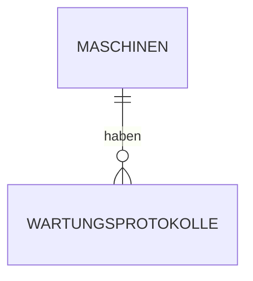
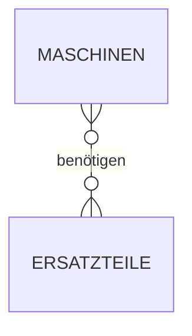
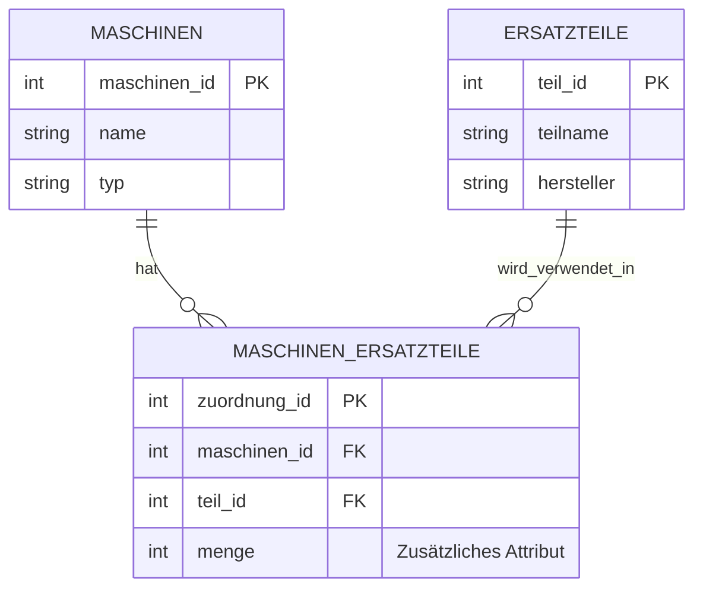

# Datenmodellierung & Beziehungen


Nachdem wir nun wissen, wie wir mit einzelnen Tabellen in Datenbanken umgehen (CRUD) ist es nun an der Zeit, einen Schritt weiter zu gehen. 
Die wahre Stärke relationaler Datenbanken liegt nämlich darin, **Beziehungen zwischen Tabellen** zu modellieren!

Stellen wir uns vor:

- Eine **Maschine** hat mehrere **Wartungen**
- Ein **Ersatzteil** wird in mehreren **Maschinen** verwendet
- Ein **Techniker** führt viele **Wartungen** durch

Wie modellieren wir solche Zusammenhänge? Genau darum geht es in diesem Kapitel!

---

## Das Problem

Beginnen wir mit einem Gedankenexperiment: Was passiert, wenn wir versuchen, alle Informationen in einer einzigen Tabelle zu speichern?


Versuchen wir, Maschinen **und** ihre Wartungen in einer einzigen Tabelle zu speichern:

```sql title="Tabelle: maschinen_mit_wartungen" 
 maschinen_id |      name        |     typ     | wartungsdatum |   techniker   | kosten
--------------+------------------+-------------+---------------+---------------+--------
            1 | CNC-Fräse Alpha  | CNC-Fräse   | 2024-01-15    | M. Schneider  | 450.00
            1 | CNC-Fräse Alpha  | CNC-Fräse   | 2024-06-20    | M. Schneider  | 320.00
            2 | Drehbank Beta    | Drehbank    | 2024-01-15    | M. Schneider  | 280.00
            2 | Drehbank Beta    | Drehbank    | 2024-03-10    | L. Weber      | 150.00
```

Doch wo liegt hier das Problem? 


1. **Redundanz** - Daten werden unnötig wiederholt
    
    Beispiel: Der Name "CNC-Fräse Alpha" und "CNC-Fräse" stehen mehrfach in der Tabelle - bei jeder Wartung wird die gesamte Maschineninformation wiederholt!

2. **Update-Anomalie** - Änderungen müssen mehrfach durchgeführt werden

    Ändert sich der Maschinenname, müssen wir mehrere Zeilen ändern. Das ist fehleranfällig und langsam.

3. **Inkonsistenz** - Widersprüchliche Daten möglich

    Was, wenn wir den Namen nur in einer Zeile ändern? Dann haben wir widersprüchliche Daten:
    ```sql
    1 │ CNC-Fräse Alpha    │ ...
    1 │ CNC-Fräse Alpha V2 │ ...  -- Welcher Name stimmt jetzt?
    ```

4. **Speicherverschwendung** - Unnötiger Speicherverbrauch

    Maschineninformationen wie der Name werden bei jeder Wartung neu gespeichert und benötigen dafür Speicherplatz

Doch für unser Problem gibt es eine einfache Lösung: 

<div style="text-align: center;">
    
    <figcaption>Quelle: <a href="https://i.imgflip.com/abvzer.jpg">imgflip</a></figcaption>
</div>

## Die Lösung

Anstelle aller Daten in einer einzelnen Tabelle zu sammeln, können wir die Informationen verteilt auf mehrere Tabellen speichern:

```sql title="Tabelle: maschinen"
 maschinen_id | name            | typ       
--------------+-----------------+-----------
            1 | CNC-Fräse Alpha | CNC-Fräse
            2 | Drehbank Beta   | Drehbank  
```

```sql title="Tabelle: wartungsprotokolle"
 wartungs_id | maschinen_id | wartungsdatum | techniker    | kosten
-------------+--------------+---------------+--------------+--------
        101  |      1       | 2024-01-15    | M. Schneider | 450.00
        102  |      1       | 2024-06-20    | M. Schneider | 320.00
        103  |      2       | 2024-01-15    | M. Schneider | 280.00
        104  |      2       | 2024-03-10    | L. Weber     | 150.00
```

Alles was wir zuvor als Problem aufgelistet haben können wir nun als Vorteil sehen: 

- Jede Information nur **einmal** gespeichert
- Änderungen nur an **einer Stelle** nötig
- **Keine Inkonsistenzen** möglich
- Geringerer Speicherverbrauch


Mit dieser Aufteilung in mehrere Tabellen schaffen wir die Grundlage für eine strukturierte Datenorganisation. Doch wie "findet" die Datenbank eigentlich die Zusammenhänge zwischen den Tabellen? 

Diesem Thema wollen wir uns nun widmen. Wir beschäftigen uns mit sogenannten **Schlüsseln** (Primär- und Fremdschlüssel) und dem **Entity-Relationship-Modell (ERM)** die Beziehungen zwischen unseren Daten sauber modellieren. So stellen wir sicher, dass unsere Datenbank nicht nur effizient, sondern auch widerspruchsfrei bleibt!


---

## Das Entity-Relationship-Modell (ERM)

Nun können wir direkt mit dem erstellen von vielen Tabellen starten, oder? 

<div style="text-align: center;">
    
    <figcaption>Datenbankstrukturen können durchaus komplex werden <br> (Quelle: <a href="https://inf-schule.de/datenbanksysteme/ermodelle/miniwelt">INF-Schule</a>)</figcaption>
</div>


Man neigt häufig dazu, überstürzt in die Umsetzung zu gehen. Bevor wir aber loslegen, sollten wir einen wichtigen Schritt nicht überspringen: die **gedankliche Planung der Datenstruktur**. Denn eine gute Datenbank entsteht nicht durch Zufall oder einfaches "Losprogrammieren", sondern durch sorgfältige Überlegung, wie die relevanten Informationen in Beziehung zueinander stehen. 

Zunächst analysieren wir also: Welche "Dinge" (Objekte, Personen, Vorgänge) gibt es in unserem System? Wie hängen sie zusammen? Welche Eigenschaften haben sie?

Genau dafür gibt es das Entity-Relationship-Modell (ERM), mit dem wir unsere Daten **erst auf Papier bzw. am Whiteboard strukturieren**, bevor wir später die Tabellen in SQL anlegen.


### Die Grundelemente

Zum Modellieren der Beziehungen bzw. zum zeichnen des Entity-Relationship-Diagramms (ER-Diagramm) werden folgende Elemente benötigt:

???+ defi "ER-Diagramm"
    <div class="grid cards" markdown>

    -   __Entität (Entity)__

        ---

        Eine **konkrete Instanz** eines Objekts der realen Welt:

        **Beispiele:**

        - Eine konkrete Maschine: "CNC-Fräse Alpha"
        - Ein konkretes Ersatzteil: "Fräskopf Standard"
        - Eine konkrete Wartung: "Wartung Nr. 101"

        ➜ Das sind die **Zeilen** in unseren Tabellen

    -   __Entitätstyp (Entity Type)__

        ---

        Eine **Kategorie** gleichartiger Entitäten:

        **Beispiele:**

        - Maschinen (alle Maschinen)
        - Ersatzteile (alle Ersatzteile)
        - Wartungsprotokolle (alle Wartungen)

        Im ER-Diagramm als **Rechteck** dargestellt:

        ```mermaid
        erDiagram
            MASCHINEN {
            }
        ```

        ➜ Das sind unsere **Tabellen**

    -   __Attribut__

        ---

        Eine **Eigenschaft** einer Entität:

        **Beispiele für Maschinen:**

        - name: "CNC-Fräse Alpha"
        - typ: "CNC-Fräse"
        - standort: "Halle A"

        Im ER-Diagramm als **Attribute in der Entität** dargestellt:

        ```mermaid
        erDiagram
            MASCHINEN {
                int maschinen_id PK
                string name
                string typ
                string standort
            }
        ```

        ➜ Das sind unsere **Spalten**

    -   __Beziehung (Relationship)__

        ---

        Eine **Verbindung** zwischen Entitätstypen:

        **Beispiele:**

        - Maschinen **haben** Wartungen
        - Maschinen **benötigen** Ersatzteile
        - Techniker **führen durch** Wartungen

        Im ER-Diagramm als **Verbindungslinie mit Beschriftung** dargestellt:

        ```mermaid
        erDiagram
            MASCHINEN ||--o{ WARTUNGSPROTOKOLLE : haben
        ```

        ➜ Das werden unsere **Fremdschlüssel** (mehr dazu später)

    </div>


???+ danger "Entität vs. Entitätstyp"
    Technisch gesehen ist eine Entität eine konkrete Instanz (eine Zeile) eines Entitätstyps (der Tabelle). Da die Modellierung sich aber die abstakte Beziehung zwischen einzelnen Tabellen abbilden soll, wird in der Praxis meist nur von Entität gesprochen, wenngleich man korrekterweise Entitätstyp sagen müsste. 


Nun schauen wir uns an, wie wir die Beziehungen zueinander im Detail darstellen können. 

---

### Kardinalitäten

Kardinalitäten beschreiben, **wie viele** Entitäten an einer Beziehung beteiligt sein können. Das ist entscheidend für die Datenmodellierung, denn die Kardinalität bestimmt, wie wir die Beziehung in SQL umsetzen! Dabei verwendet man meist eine der drei nachfolgenden Beziehungstypen: 


#### 1:n (Eins-zu-Viele)

**Eine** Entität auf der einen Seite steht in Beziehung zu **vielen** Entitäten auf der anderen Seite.

???+ example "Beispiel n:m"
    Eine Maschine hat **viele** Wartungen, aber jede Wartung gehört zu **einer** Maschine.

    ```mermaid
    erDiagram
        direction LR
        MASCHINEN ||--o{ WARTUNGSPROTOKOLLE : "haben"
        MASCHINEN {
            int maschinen_id PK
            string name
        }
        WARTUNGSPROTOKOLLE {
            int wartungs_id PK
            date wartungsdatum
            int maschinen_id FK
        }
    ```

    Weitere Beispiele:

    - Ein Standort hat viele Maschinen
    - Ein Techniker führt viele Wartungen durch
    - Eine Abteilung hat viele Mitarbeiter

Bei 1:n-Beziehungen kommt der **Fremdschlüssel** auf die **"n"-Seite** (die "viele"-Seite). Im obigen Beispiel steht `maschinen_id` als Fremdschlüssel in der Tabelle `WARTUNGSPROTOKOLLE`, da eine Maschine viele Wartungen haben kann.

---

#### n:m (Viele-zu-Viele)

**Viele** Entitäten auf der einen Seite stehen in Beziehung zu **vielen** Entitäten auf der anderen Seite.

???+ example "Beispiel n:m"
    Eine Maschine benötigt **viele** Ersatzteile, und ein Ersatzteil kann in **vielen** Maschinen verwendet werden.

    ```mermaid
    erDiagram
        direction LR
        MASCHINEN }o--o{ ERSATZTEILE : "benötigen"
        MASCHINEN {
            int maschinen_id PK
            string name
        }
        ERSATZTEILE {
            int teil_id PK
            string teilname
        }
    ```

    Weitere Beispiele:

    - Studenten belegen viele Kurse, Kurse haben viele Studenten
    - Autoren schreiben viele Bücher, Bücher haben viele Autoren
    - Wartungen verwenden viele Ersatzteile, Ersatzteile werden in vielen Wartungen verwendet


Im ER-Diagramm zeichnen wir die n:m-Beziehung direkt zwischen den beiden Entitäten. In SQL können wir diese Beziehung aber **nicht direkt** umsetzen! Wir benötigen eine **Zwischentabelle** (auch Verbindungstabelle oder Junction Table genannt), die die Beziehung auflöst.

Die Zwischentabelle enthält **zwei Fremdschlüssel**: einen für jede der beiden Tabellen. So wird die n:m-Beziehung in zwei 1:n-Beziehungen aufgeteilt. Mehr dazu lernen wir etwas später.

---

#### 1:1 (Eins-zu-Eins)

**Eine** Entität auf der einen Seite steht in Beziehung zu **genau einer** Entität auf der anderen Seite.

???+ example "Beispiel 1:1"
    Jede Maschine hat **ein** Wartungshandbuch-PDF, und jedes Wartungshandbuch-PDF gehört zu **einer** Maschine.

    ```mermaid
    erDiagram
        direction LR
        MASCHINEN ||--|| WARTUNGSHANDBUCH_PDF : "hat"
        MASCHINEN {
            int maschinen_id PK
            string name
        }
        WARTUNGSHANDBUCH_PDF {
            int handbuch_id PK
            int maschinen_id FK
            string dateipfad
        }
    ```
    

    Weitere Beispiele:

    - Eine Person hat einen Personalausweis, ein Personalausweis gehört zu einer Person
    - Ein Mitarbeiter hat einen Schreibtisch, ein Schreibtisch gehört zu einem Mitarbeiter

Bei 1:1-Beziehungen kommt der **Fremdschlüssel** auf **eine der beiden Seiten**. Im obigen Beispiel steht `maschinen_id` als Fremdschlüssel in der Tabelle `WARTUNGSHANDBUCH_PDF`. Alternativ könnte man beide Tabellen auch zusammenführen.

Generell kommen 1:1-Beziehungen in der Praxis selten vor. Oft kann man die Informationen auch in einer einzigen Tabelle speichern. Doch wann machen 1:1-Beziehungen Sinn?

- **Große optionale Daten:** z.B. ein Wartungshandbuch-PDF ist sehr groß und wird selten abgefragt
- **Zugriffsrechte:** Sensible Daten (z.B. Gehälter) in separater Tabelle mit anderen Zugriffsrechten
- **Historische Gründe:** Altsysteme, die nicht geändert werden können


#### Krähenfuß-Notation

Zur Darstellung von ER-Diagrammen gibt es verschiedenste Möglichkeiten. Eine bekannte Notation ist die sogenannte Krähenfuß-Notation (engl. "Crow's Foot Notation"). Diese wurde auch bei den bereits gezeigten Beispielen verwendet.

<div style="text-align: center;">
  <div style="width: 70%; margin: 0 auto; height: 300px; overflow: hidden;">
    
  </div>
  <figcaption style="margin-top: 0.5em;">
    Krähenfuß-Notation
    (Quelle: <a href="https://www.edrawsoft.com/de/er-diagram-symbols.html">edraw</a>)
  </figcaption>
</div>

???+ defi "Krähenfuß Notation"
    Die Notation kombiniert zwei Informationen auf jeder Seite der Beziehungslinie:

    **Am äußeren Ende** (näher zur Entität):

    - **Krähenfuß** `{` → **Viele** (many): Es können mehrere Datensätze/Zeilen teilnehmen
    - **Einfacher Strich** `|` → **Eins** (one): Genau ein Datensatz/eine Zeile nimmt teil

    **Am inneren Ende** (näher zur Mitte):

    - **Einfacher Strich** `|`→ **Verpflichtend** (mandatory): Mindestens ein Datensatz muss teilnehmen
    - **Kreis** `o`→ **Optional** (optional): Null Datensätze sind erlaubt (optional)


Schauen wir uns ein Beispiel zum besseren Verständnis an:

???+ example "Krähenfuß-Notation"

    ```
    MASCHINEN   ||-----o{   WARTUNGSPROTOKOLLE
                ↑↑     ↑↑
                ││     │└── Krähenfuß = viele
                ││     └─── Kreis = optional (null ist erlaubt)
                │└───────── Strich = verpflichtend (mindestens eine)
                └────────── Strich = genau eins
    ```

    **Bedeutung:** Eine Maschine (genau eine, verpflichtend) kann null oder mehrere Wartungsprotokolle haben.

    **In Worten:**

    - Von links nach rechts gelesen: "Eine Maschine hat null oder viele Wartungsprotokolle"
    - Von rechts nach links gelesen: "Jedes Wartungsprotokoll gehört zu genau einer Maschine"

    **Weitere Beispiele aus unserem Kapitel:**

    - `||--||` bei "Maschine hat Wartungshandbuch": Jede Maschine hat genau ein Wartungshandbuch, und jedes Wartungshandbuch gehört zu genau einer Maschine
    - `}o--o{` bei "Maschinen benötigen Ersatzteile": Null oder mehrere Maschinen können null oder mehrere Ersatzteile haben (n:m-Beziehung)

Diese Notation mag im ersten Moment etwas gewöhnungsbedürftig sein. Mit etwas Übung stellt sie aber überhaupt kein Problem dar und wir können ganz einfach komplexere Strukturen darstellen. 

---

### Fremdschlüssel

Ein **Fremdschlüssel** (Foreign Key, FK) ist eine Spalte, die auf den Primärschlüssel einer anderen Tabelle verweist. Damit stellen wir **Beziehungen zwischen Tabellen** her!

???+ example "Beispiel"

    ```mermaid
    erDiagram
        direction LR
        MASCHINEN ||--o{ WARTUNGSPROTOKOLLE : "hat"
        MASCHINEN {
            int maschinen_id PK
            string name
            string typ
        }
        WARTUNGSPROTOKOLLE {
            int wartungs_id PK
            date wartungsdatum
            int maschinen_id FK "verweist auf maschinen"
        }
    ```

    **Erklärung:** Der Fremdschlüssel `maschinen_id` in der Tabelle `wartungsprotokolle` verweist auf den Primärschlüssel `maschinen_id` in der Tabelle `maschinen`.

<div style="text-align:center; max-width:900px; margin:16px auto;">
<table role="table"
       style="width:100%; border-collapse:separate; border-spacing:0; border:1px solid #cfd8e3; border-radius:10px; overflow:hidden; font-family:system-ui,sans-serif;">
    <thead>
    <tr style="background:#009485; color:#fff;">
        <th style="text-align:left; padding:12px 14px; font-weight:700;">Schlüsseltyp</th>
        <th style="text-align:left; padding:12px 14px; font-weight:700;">Beschreibung</th>
        <th style="text-align:left; padding:12px 14px; font-weight:700;">Beispiel</th>
    </tr>
    </thead>
    <tbody>
    <tr>
        <td style="background:#00948511; padding:10px 14px;"><strong>Primärschlüssel (PK)</strong></td>
        <td style="padding:10px 14px;">Identifiziert <strong>eindeutig</strong> eine Zeile in der eigenen Tabelle</td>
        <td style="padding:10px 14px;"><code>maschinen_id</code> in <code>maschinen</code></td>
    </tr>
    <tr>
        <td style="background:#00948511; padding:10px 14px;"><strong>Fremdschlüssel (FK)</strong></td>
        <td style="padding:10px 14px;">Verweist auf einen Primärschlüssel in einer <strong>anderen</strong> Tabelle</td>
        <td style="padding:10px 14px;"><code>maschinen_id</code> in <code>wartungsprotokolle</code></td>
    </tr>
    </tbody>
</table>
</div>

---

Bevor wir mit der Implementierung in SQL beginnen, wollen wir das Erlente schon einmal üben.

???+ question "Aufgabe: ER-Diagramm modellieren"

    Zeichne **auf Papier** ein ER-Diagramm für das folgende Szenario. Achte dabei auf:

    - Korrekte Kardinalitäten (1:1, 1:n)
    - Primärschlüssel (PK) und Fremdschlüssel (FK)
    - Alle relevanten Attribute
    - Richtige Platzierung der Fremdschlüssel

    **Szenario: Standorte, Maschinen und Wartungshandbücher**

    Eine Produktionsfirma organisiert ihre Maschinen nach Standorten und verwaltet für jede Maschine ein digitales Wartungshandbuch.

    **Anforderungen:**

    - Ein **Standort** hat viele **Maschinen**
    - Jede **Maschine** steht an genau einem **Standort**
    - Jede **Maschine** hat genau ein **Wartungshandbuch** 
    - Jedes **Wartungshandbuch** gehört zu genau einer **Maschine**

    **Entitäten und Attribute:**

    - **Standort:** Name, Adresse, Ansprechpartner
    - **Maschine:** Name, Typ, Anschaffungsdatum
    - **Wartungshandbuch:** Titel, Dateipfad, Version, Letztes Update

    **Aufgabe:** Zeichne das vollständige ER-Diagramm mit allen drei Entitäten, ihren Attributen, den Beziehungen und den Kardinalitäten!

    ??? tip "Lösung anzeigen"

        ```mermaid
        erDiagram
            STANDORTE ||--o{ MASCHINEN : "hat"
            MASCHINEN ||--|| WARTUNGSHANDBUECHER : "hat"

            STANDORTE {
                int standort_id PK
                string name
                string adresse
                string ansprechpartner
            }

            MASCHINEN {
                int maschinen_id PK
                string name
                string typ
                date anschaffungsdatum
                int standort_id FK "verweist auf standorte"
            }

            WARTUNGSHANDBUECHER {
                int handbuch_id PK
                string titel
                string dateipfad
                string version
                date letztes_update
                int maschinen_id FK "verweist auf maschinen"
            }
        ```

        **Erklärung:**

        **1:n-Beziehung (Standorte → Maschinen):**

        - Der Fremdschlüssel `standort_id` steht in der Tabelle `MASCHINEN` (die "n"-Seite)
        - Kardinalität: `||--o{` (ein Standort hat null oder viele Maschinen)
        - Damit kann jede Maschine eindeutig einem Standort zugeordnet werden

        **1:1-Beziehung (Maschinen → Wartungshandbücher):**

        - Der Fremdschlüssel `maschinen_id` steht in der Tabelle `WARTUNGSHANDBUECHER`
        - Kardinalität: `||--||` (eine Maschine hat genau ein Wartungshandbuch)
        - Alternativ könnte man Wartungshandbuch-Daten auch direkt in die Maschinen-Tabelle integrieren, aber die Trennung macht Sinn, da PDFs groß sein können und nicht bei jeder Maschinen-Abfrage mitgeladen werden müssen

---

## Implementierung
### 1:n Beziehungen

Die 1:n-Beziehung ist die häufigste Beziehungsart in relationalen Datenbanken. Schauen wir uns an, wie wir sie umsetzen.

**Goldene Regel:** Der Fremdschlüssel kommt auf die **n-Seite** (die "viele"-Seite)!

Beispiel: Maschinen und Wartungsprotokolle

**Szenario:** Eine Maschine hat viele Wartungen, jede Wartung gehört zu einer Maschine (1:n)

**ER-Modell:**



Schritt 1: Tabellen erstellen

???+ example "SQL-Code"
    ```sql
    -- Zuerst die "1"-Seite (Maschinen)
    CREATE TABLE maschinen (
        maschinen_id SERIAL PRIMARY KEY,
        name VARCHAR(100) NOT NULL,
        typ VARCHAR(50) NOT NULL,
        standort VARCHAR(50)
    );

    -- Dann die "n"-Seite (Wartungsprotokolle) mit Fremdschlüssel
    CREATE TABLE wartungsprotokolle (
        wartungs_id SERIAL PRIMARY KEY,
        wartungsdatum DATE NOT NULL,
        beschreibung TEXT,
        kosten NUMERIC(10, 2),
        maschinen_id INTEGER NOT NULL,
        FOREIGN KEY (maschinen_id) REFERENCES maschinen(maschinen_id)
    );
    ```

    **Wichtig:**

    - `FOREIGN KEY (maschinen_id)` - Definiert die Spalte als Fremdschlüssel
    - `REFERENCES maschinen(maschinen_id)` - Verweist auf den Primärschlüssel der `maschinen`-Tabelle

???+ warning "Reihenfolge beachten!"
    Die referenzierte Tabelle (`maschinen`) muss **vor** der referenzierenden Tabelle (`wartungsprotokolle`) erstellt werden!

    ```sql
    -- ✅ Richtig:
    CREATE TABLE maschinen (...);
    CREATE TABLE wartungsprotokolle (...);

    -- ❌ Falsch:
    CREATE TABLE wartungsprotokolle (...);  -- Fehler! maschinen existiert noch nicht
    CREATE TABLE maschinen (...);
    ```

Schritt 2: Daten einfügen

???+ example "SQL-Code"
    ```sql
    -- Erst Maschinen einfügen
    INSERT INTO maschinen (name, typ, standort)
    VALUES
        ('CNC-Fräse Alpha', 'CNC-Fräse', 'Halle A'),
        ('Drehbank Beta', 'Drehbank', 'Halle A'),
        ('Schweißroboter Gamma', 'Schweißroboter', 'Halle B');

    -- Dann Wartungsprotokolle mit Verweis auf Maschinen
    INSERT INTO wartungsprotokolle (wartungsdatum, beschreibung, kosten, maschinen_id)
    VALUES
        ('2024-01-15', 'Routinewartung', 450.00, 1),        -- für CNC-Fräse Alpha
        ('2024-06-20', 'Fräskopf getauscht', 320.00, 1),    -- für CNC-Fräse Alpha
        ('2024-03-10', 'Ölwechsel', 150.00, 2),             -- für Drehbank Beta
        ('2024-02-05', 'Schweißkopf kalibriert', 280.00, 3); -- für Schweißroboter
    ```

    **Ergebnis:**

    ```title="Tabelle: maschinen"
     maschinen_id │ name                 │ typ            │ standort
    ──────────────┼──────────────────────┼────────────────┼──────────
                1 │ CNC-Fräse Alpha      │ CNC-Fräse      │ Halle A
                2 │ Drehbank Beta        │ Drehbank       │ Halle A
                3 │ Schweißroboter Gamma │ Schweißroboter │ Halle B
    ```

    ```title="Tabelle: wartungsprotokolle"
     wartungs_id │ wartungsdatum │ beschreibung           │ kosten  │ maschinen_id
    ─────────────┼───────────────┼────────────────────────┼─────────┼──────────────
               1 │ 2024-01-15    │ Routinewartung         │  450.00 │            1
               2 │ 2024-06-20    │ Fräskopf getauscht     │  320.00 │            1
               3 │ 2024-03-10    │ Ölwechsel              │  150.00 │            2
               4 │ 2024-02-05    │ Schweißkopf kalibriert │  280.00 │            3
    ```

???+ info "Die Beziehung"
    Die Spalte `maschinen_id` in `wartungsprotokolle` verweist auf `maschinen_id` in `maschinen`:

    - Wartung 1 und 2 gehören zu Maschine 1 (CNC-Fräse Alpha)
    - Wartung 3 gehört zu Maschine 2 (Drehbank Beta)
    - Wartung 4 gehört zu Maschine 3 (Schweißroboter Gamma)

---


### n:m Beziehungen

n:m-Beziehungen (Viele-zu-Viele) sind komplexer als 1:n-Beziehungen.

**Das Problem:** Wir können eine n:m-Beziehung **nicht direkt** mit einem einzigen Fremdschlüssel umsetzen!

**Die Lösung:** Eine **Zwischentabelle** (auch **Verbindungstabelle**, **Junction Table** oder **Assoziationstabelle** genannt).

Warum brauchen wir eine Zwischentabelle?

Betrachten wir ein Beispiel:

**Szenario:** Eine Maschine benötigt viele Ersatzteile, und ein Ersatzteil kann in vielen Maschinen verwendet werden (n:m)

???+ question "Gedankenexperiment"
    **Versuch 1:** Fremdschlüssel in `maschinen`?

    ```
    maschinen:
    maschinen_id │ name            │ ersatzteil_id
    ─────────────┼─────────────────┼──────────────
               1 │ CNC-Fräse Alpha │ ???  -- Mehrere Ersatzteile?
    ```

    ❌ Problem: Eine Maschine braucht **mehrere** Ersatzteile, aber wir können nur **einen** Fremdschlüssel speichern!

    **Versuch 2:** Fremdschlüssel in `ersatzteile`?

    ```
    ersatzteile:
    teil_id │ teilname        │ maschinen_id
    ────────┼─────────────────┼──────────────
          1 │ Spindelmotor    │ ???  -- In mehreren Maschinen?
    ```

    ❌ Problem: Ein Ersatzteil wird in **mehreren** Maschinen verwendet, aber wir können nur **eine** Maschine speichern!

    **Lösung:** Eine Zwischentabelle!

Beispiel: Maschinen und Ersatzteile

**ER-Modell:**



**SQL-Umsetzung:** Drei Tabellen!



Schritt 1: Die drei Tabellen erstellen

???+ example "SQL-Code"
    ```sql
    -- Tabelle 1: Maschinen (die "n"-Seite)
    CREATE TABLE maschinen (
        maschinen_id SERIAL PRIMARY KEY,
        name VARCHAR(100) NOT NULL,
        typ VARCHAR(50),
        standort VARCHAR(50)
    );

    -- Tabelle 2: Ersatzteile (die "m"-Seite)
    CREATE TABLE ersatzteile (
        teil_id SERIAL PRIMARY KEY,
        teilname VARCHAR(100) NOT NULL,
        hersteller VARCHAR(50),
        preis NUMERIC(10, 2)
    );

    -- Tabelle 3: Zwischentabelle (verbindet beide!)
    CREATE TABLE maschinen_ersatzteile (
        zuordnung_id SERIAL PRIMARY KEY,
        maschinen_id INTEGER NOT NULL,
        teil_id INTEGER NOT NULL,
        menge INTEGER DEFAULT 1,  -- Zusätzliches Attribut der Beziehung!
        FOREIGN KEY (maschinen_id) REFERENCES maschinen(maschinen_id)
            ON DELETE CASCADE,
        FOREIGN KEY (teil_id) REFERENCES ersatzteile(teil_id)
            ON DELETE CASCADE
    );
    ```

    **Wichtige Punkte:**

    - Die Zwischentabelle hat **zwei Fremdschlüssel**
    - Jede Zeile in der Zwischentabelle repräsentiert eine **Zuordnung**
    - Zusätzliche Attribute (wie `menge`) können in der Zwischentabelle gespeichert werden

???+ tip "Benennung der Zwischentabelle"
    Typische Namenskonventionen:

    - `tabelle1_tabelle2` (z.B. `maschinen_ersatzteile`)
    - Verb, das die Beziehung beschreibt (z.B. `benötigt`, `verwendet`)
    - Plural beider Tabellennamen (z.B. `maschinen_ersatzteile`)

Schritt 2: Daten einfügen

???+ example "SQL-Code"
    ```sql
    -- 1. Erst die Maschinen
    INSERT INTO maschinen (name, typ, standort)
    VALUES
        ('CNC-Fräse Alpha', 'CNC-Fräse', 'Halle A'),
        ('Drehbank Beta', 'Drehbank', 'Halle A'),
        ('Schweißroboter Gamma', 'Roboter', 'Halle B');

    -- 2. Dann die Ersatzteile
    INSERT INTO ersatzteile (teilname, hersteller, preis)
    VALUES
        ('Spindelmotor', 'MotorTech GmbH', 1250.00),
        ('Kühlmittelpumpe', 'PumpCo', 380.50),
        ('Schweißdrahtspule', 'WeldSupply', 45.90);

    -- 3. Zuletzt die Zuordnungen
    INSERT INTO maschinen_ersatzteile (maschinen_id, teil_id, menge)
    VALUES
        (1, 1, 1),  -- CNC-Fräse benötigt 1x Spindelmotor
        (1, 2, 2),  -- CNC-Fräse benötigt 2x Kühlmittelpumpe
        (2, 1, 1),  -- Drehbank benötigt 1x Spindelmotor
        (2, 2, 1),  -- Drehbank benötigt 1x Kühlmittelpumpe
        (3, 2, 1),  -- Schweißroboter benötigt 1x Kühlmittelpumpe
        (3, 3, 5);  -- Schweißroboter benötigt 5x Schweißdrahtspule
    ```

    **Visualisierung der Beziehungen:**

    ```
    CNC-Fräse Alpha benötigt:
      ├─ Spindelmotor (1x)
      └─ Kühlmittelpumpe (2x)

    Drehbank Beta benötigt:
      ├─ Spindelmotor (1x)
      └─ Kühlmittelpumpe (1x)

    Schweißroboter Gamma benötigt:
      ├─ Kühlmittelpumpe (1x)
      └─ Schweißdrahtspule (5x)
    ```

???+ info "Umgekehrte Sicht"
    Die Beziehung funktioniert in beide Richtungen:

    **Welche Maschinen verwenden den Spindelmotor?**
    - CNC-Fräse Alpha (1x)
    - Drehbank Beta (1x)

    **Welche Maschinen verwenden die Kühlmittelpumpe?**
    - CNC-Fräse Alpha (2x)
    - Drehbank Beta (1x)
    - Schweißroboter Gamma (1x)

---


#### Referenzielle Integrität

**Referenzielle Integrität** bedeutet: Jeder Fremdschlüssel muss auf einen **existierenden** Primärschlüssel verweisen. Die Datenbank stellt sicher, dass keine "verwaisten" Datensätze entstehen.

Das Problem: Was passiert beim Löschen?

Versuchen wir, eine Maschine zu löschen, die Wartungen hat:

```sql
-- Versuch, Maschine 1 (CNC-Fräse Alpha) zu löschen
DELETE FROM maschinen WHERE maschinen_id = 1;
```

❌ **Fehler!**

```
ERROR: update or delete on table "maschinen" violates foreign key constraint
DETAIL: Key (maschinen_id)=(1) is still referenced from table "wartungsprotokolle".
```

**Was ist das Problem?** Es gibt Wartungsprotokolle, die auf Maschine 1 verweisen. Würden wir die Maschine löschen, würden diese Wartungsprotokolle auf eine nicht existierende Maschine zeigen - sie wären "verwaist"!

Die Lösung: `ON DELETE` Optionen

Mit `ON DELETE` legen wir fest, was beim Löschen der referenzierten Zeile passieren soll:

<div style="text-align:center; max-width:900px; margin:16px auto;">
<table role="table"
       style="width:100%; border-collapse:separate; border-spacing:0; border:1px solid #cfd8e3; border-radius:10px; overflow:hidden; font-family:system-ui,sans-serif;">
    <thead>
    <tr style="background:#009485; color:#fff;">
        <th style="text-align:left; padding:12px 14px; font-weight:700;">Option</th>
        <th style="text-align:left; padding:12px 14px; font-weight:700;">Bedeutung</th>
        <th style="text-align:left; padding:12px 14px; font-weight:700;">Anwendungsfall</th>
    </tr>
    </thead>
    <tbody>
    <tr>
        <td style="background:#00948511; padding:10px 14px;"><code>ON DELETE RESTRICT</code></td>
        <td style="padding:10px 14px;">Löschen wird <strong>verhindert</strong> (Standard)</td>
        <td style="padding:10px 14px;">Sicherheit: Keine Daten verlieren</td>
    </tr>
    <tr>
        <td style="background:#00948511; padding:10px 14px;"><code>ON DELETE CASCADE</code></td>
        <td style="padding:10px 14px;">Löscht <strong>automatisch alle abhängigen Datensätze</strong></td>
        <td style="padding:10px 14px;">Wenn abhängige Daten ohne Hauptdaten sinnlos sind</td>
    </tr>
    <tr>
        <td style="background:#00948511; padding:10px 14px;"><code>ON DELETE SET NULL</code></td>
        <td style="padding:10px 14px;">Setzt Fremdschlüssel auf <code>NULL</code></td>
        <td style="padding:10px 14px;">Wenn Beziehung optional ist</td>
    </tr>
    <tr>
        <td style="background:#00948511; padding:10px 14px;"><code>ON DELETE SET DEFAULT</code></td>
        <td style="padding:10px 14px;">Setzt Fremdschlüssel auf Standardwert</td>
        <td style="padding:10px 14px;">Selten verwendet</td>
    </tr>
    </tbody>
</table>
</div>

Beispiele für `ON DELETE` Optionen

<div class="grid cards" markdown>

-   __RESTRICT - Löschen verhindern__

    ---

    ???+ example "Beispiel"
        ```sql
        CREATE TABLE wartungsprotokolle (
            wartungs_id SERIAL PRIMARY KEY,
            wartungsdatum DATE,
            maschinen_id INTEGER,
            FOREIGN KEY (maschinen_id) REFERENCES maschinen(maschinen_id)
                ON DELETE RESTRICT  -- Standard, kann auch weggelassen werden
        );
        ```

        **Verhalten:**
        ```sql
        DELETE FROM maschinen WHERE maschinen_id = 1;
        -- ❌ Fehler! Wartungsprotokolle existieren noch
        ```

        **Wann verwenden?**

        - Wenn Daten **nicht versehentlich** gelöscht werden sollen
        - Wenn man **bewusst zuerst** abhängige Daten löschen möchte

-   __CASCADE - Kaskadierende Löschung__

    ---

    ???+ example "Beispiel"
        ```sql
        CREATE TABLE wartungsprotokolle (
            wartungs_id SERIAL PRIMARY KEY,
            wartungsdatum DATE,
            maschinen_id INTEGER,
            FOREIGN KEY (maschinen_id) REFERENCES maschinen(maschinen_id)
                ON DELETE CASCADE  -- Löscht Wartungen automatisch mit
        );
        ```

        **Verhalten:**
        ```sql
        DELETE FROM maschinen WHERE maschinen_id = 1;
        -- ✅ Maschine UND alle ihre Wartungen werden gelöscht
        ```

        **Wann verwenden?**

        - Wenn abhängige Daten **ohne Hauptdaten sinnlos** sind
        - Beispiel: Wartungen ohne Maschine haben keine Bedeutung

    ???+ danger "Vorsicht mit CASCADE!"
        Kaskadierende Löschungen können **viele Daten auf einmal** löschen!

        ```sql
        DELETE FROM abteilungen WHERE abteilung_id = 1;
        -- Löscht die Abteilung UND alle Mitarbeiter UND alle deren Projekte...
        ```

-   __SET NULL - Beziehung auflösen__

    ---

    ???+ example "Beispiel"
        ```sql
        CREATE TABLE wartungsprotokolle (
            wartungs_id SERIAL PRIMARY KEY,
            wartungsdatum DATE,
            maschinen_id INTEGER,  -- Muss NULL erlauben!
            FOREIGN KEY (maschinen_id) REFERENCES maschinen(maschinen_id)
                ON DELETE SET NULL
        );
        ```

        **Verhalten:**
        ```sql
        DELETE FROM maschinen WHERE maschinen_id = 1;
        -- ✅ Maschine gelöscht, Wartungen bleiben mit maschinen_id = NULL
        ```

        **Wann verwenden?**

        - Wenn die Beziehung **optional** ist
        - Beispiel: Mitarbeiter ohne Abteilung (z.B. ausgeschieden, aber Daten bleiben)

    ???+ warning "NULL muss erlaubt sein!"
        Die Fremdschlüssel-Spalte darf **nicht** `NOT NULL` sein, sonst funktioniert `SET NULL` nicht!

-   __SET DEFAULT - Auf Standardwert setzen__

    ---

    ???+ example "Beispiel"
        ```sql
        CREATE TABLE wartungsprotokolle (
            wartungs_id SERIAL PRIMARY KEY,
            wartungsdatum DATE,
            maschinen_id INTEGER DEFAULT 999,  -- Standard: "Unbekannt"
            FOREIGN KEY (maschinen_id) REFERENCES maschinen(maschinen_id)
                ON DELETE SET DEFAULT
        );
        ```

        **Verhalten:**
        ```sql
        DELETE FROM maschinen WHERE maschinen_id = 1;
        -- ✅ maschinen_id wird auf 999 gesetzt ("Unbekannte Maschine")
        ```

        **Wann verwenden?**

        - Selten verwendet
        - Wenn ein "Fallback"-Wert sinnvoll ist

</div>

---


Teste dein Wissen über Datenmodellierung und Beziehungen!

???+ question "Aufgabe 1: 1:n Beziehung"

    Erstelle Tabellen für **Lieferanten** und **Materialien** mit einer 1:n-Beziehung.

    **Anforderungen:**

    - Ein Lieferant liefert **viele** Materialien
    - Jedes Material kommt von **einem** Lieferanten
    - **Lieferanten:** ID, Name, Standort
    - **Materialien:** ID, Materialname, Einheit, Preis, Lieferant

    **Aufgaben:**

    1. Erstelle die beiden Tabellen mit geeigneten Datentypen
    2. Füge mindestens 2 Lieferanten und 4 Materialien ein
    3. Stelle sicher, dass die Fremdschlüssel-Beziehung korrekt definiert ist

    ??? tip "Lösung anzeigen"

        ```sql
        -- Tabelle 1: Lieferanten (die "1"-Seite)
        CREATE TABLE lieferanten (
            lieferant_id SERIAL PRIMARY KEY,
            name VARCHAR(100) NOT NULL,
            standort VARCHAR(100)
        );

        -- Tabelle 2: Materialien (die "n"-Seite)
        CREATE TABLE materialien (
            material_id SERIAL PRIMARY KEY,
            materialname VARCHAR(100) NOT NULL,
            einheit VARCHAR(20),  -- z.B. kg, Liter, Stück
            preis NUMERIC(10, 2),
            lieferant_id INTEGER NOT NULL,
            FOREIGN KEY (lieferant_id) REFERENCES lieferanten(lieferant_id)
                ON DELETE RESTRICT  -- Lieferant kann nicht gelöscht werden, wenn noch Materialien existieren
        );

        -- Testdaten
        INSERT INTO lieferanten (name, standort)
        VALUES
            ('Stahl-Handel Nord', 'Hamburg'),
            ('ChemTech Solutions', 'Frankfurt');

        INSERT INTO materialien (materialname, einheit, preis, lieferant_id)
        VALUES
            ('Edelstahl 1.4301', 'kg', 8.50, 1),
            ('Aluminium 6061', 'kg', 12.30, 1),
            ('Kühlschmierstoff', 'Liter', 12.90, 2),
            ('Reinigungsmittel', 'Liter', 8.40, 2);
        ```

???+ question "Aufgabe 2: n:m Beziehung"

    Erstelle Tabellen für **Techniker** und **Zertifizierungen** mit einer n:m-Beziehung.

    **Anforderungen:**

    - Ein Techniker hat **viele** Zertifizierungen
    - Eine Zertifizierung wird von **vielen** Technikern gehalten
    - **Techniker:** ID, Name
    - **Zertifizierungen:** ID, Bezeichnung, Gültigkeit (Jahre)
    - **Zertifikatsvergaben** (Zwischentabelle): Welcher Techniker hat welche Zertifizierung + Erwerbs- und Ablaufdatum

    **Aufgaben:**

    1. Erstelle alle drei benötigten Tabellen
    2. Füge mindestens 2 Techniker und 2 Zertifizierungen ein
    3. Erstelle mindestens 3 Zuordnungen in der Zwischentabelle

    ??? tip "Lösung anzeigen"

        ```sql
        -- Tabelle 1: Techniker
        CREATE TABLE techniker (
            techniker_id SERIAL PRIMARY KEY,
            name VARCHAR(100) NOT NULL
        );

        -- Tabelle 2: Zertifizierungen
        CREATE TABLE zertifizierungen (
            zertifizierung_id SERIAL PRIMARY KEY,
            bezeichnung VARCHAR(200) NOT NULL,
            gueltigkeit_jahre INTEGER
        );

        -- Tabelle 3: Zwischentabelle
        CREATE TABLE zertifikatsvergaben (
            vergabe_id SERIAL PRIMARY KEY,
            techniker_id INTEGER NOT NULL,
            zertifizierung_id INTEGER NOT NULL,
            erwerbsdatum DATE NOT NULL,
            ablaufdatum DATE,
            FOREIGN KEY (techniker_id) REFERENCES techniker(techniker_id)
                ON DELETE CASCADE,
            FOREIGN KEY (zertifizierung_id) REFERENCES zertifizierungen(zertifizierung_id)
                ON DELETE CASCADE
        );

        -- Testdaten
        INSERT INTO techniker (name)
        VALUES
            ('Thomas Müller'),
            ('Sandra Schmidt');

        INSERT INTO zertifizierungen (bezeichnung, gueltigkeit_jahre)
        VALUES
            ('CNC-Programmierung Stufe 2', 5),
            ('Schweißfachmann', 3);

        INSERT INTO zertifikatsvergaben (techniker_id, zertifizierung_id, erwerbsdatum, ablaufdatum)
        VALUES
            (1, 1, '2020-03-15', '2025-03-15'),  -- Thomas hat CNC-Zertifizierung
            (2, 1, '2022-06-10', '2027-06-10'),  -- Sandra hat CNC-Zertifizierung
            (1, 2, '2021-09-20', '2024-09-20');  -- Thomas hat Schweißfachmann-Zertifizierung
        ```

???+ question "Aufgabe 3: Modellierung verstehen"

    Beantworte folgende Fragen:

    1. Warum ist es sinnvoll, Daten in mehrere Tabellen aufzuteilen?
    2. Was ist der Unterschied zwischen einer 1:n und einer n:m Beziehung?
    3. Wann würde man `ON DELETE CASCADE` verwenden und wann `ON DELETE RESTRICT`?

    ??? tip "Lösungen anzeigen"

        **1. Warum mehrere Tabellen?**

        - **Redundanz vermeiden:** Daten werden nur einmal gespeichert
        - **Konsistenz:** Änderungen nur an einer Stelle nötig
        - **Datenintegrität:** Keine widersprüchlichen Daten
        - **Speichereffizienz:** Weniger Speicherplatz benötigt

        **2. Unterschied 1:n vs. n:m:**

        - **1:n:** Eine Entität auf der einen Seite, viele auf der anderen
          - Beispiel: Ein Kunde hat viele Bestellungen
          - Umsetzung: Fremdschlüssel auf der "n"-Seite

        - **n:m:** Viele Entitäten auf beiden Seiten
          - Beispiel: Studenten belegen viele Kurse, Kurse haben viele Studenten
          - Umsetzung: Zwischentabelle mit zwei Fremdschlüsseln

        **3. CASCADE vs. RESTRICT:**

        - **`ON DELETE CASCADE`** - Wenn abhängige Daten ohne Hauptdaten sinnlos sind
          - Beispiel: Bestellpositionen ohne Bestellung haben keine Bedeutung

        - **`ON DELETE RESTRICT`** - Wenn Daten geschützt werden sollen
          - Beispiel: Kunde kann nicht gelöscht werden, wenn noch Bestellungen existieren

---

## Zusammenfassung

In diesem Kapitel haben wir gelernt, wie man Beziehungen zwischen Tabellen modelliert:

**Wichtigste Konzepte:**

- **ER-Modell** beschreibt Entitäten, Attribute und Beziehungen visuell
- **Kardinalitäten** (1:1, 1:n, n:m) beschreiben, wie viele Entitäten miteinander in Beziehung stehen
- **Fremdschlüssel** (Foreign Key) stellen Beziehungen zwischen Tabellen her
- **Referenzielle Integrität** stellt sicher, dass Fremdschlüssel auf existierende Primärschlüssel verweisen

**Umsetzung in SQL:**

| Beziehungstyp | Umsetzung | Beispiel |
|---------------|-----------|----------|
| **1:n** | Fremdschlüssel auf der "n"-Seite | Maschine hat viele Wartungen |
| **n:m** | Zwischentabelle mit zwei Fremdschlüsseln | Maschine benötigt viele Ersatzteile |
| **1:1** | Fremdschlüssel auf einer Seite (selten) | Maschine hat ein Handbuch-PDF |

**ON DELETE Optionen:**

- `RESTRICT` - Löschen verhindern (Standard, sicher)
- `CASCADE` - Abhängige Datensätze automatisch mitlöschen (Vorsicht!)
- `SET NULL` - Fremdschlüssel auf NULL setzen
- `SET DEFAULT` - Fremdschlüssel auf Standardwert setzen

**Goldene Regel:**

> Modelliere erst mit ER-Diagrammen, dann implementiere in SQL!

---

Im nächsten Kapitel lernen wir **JOINs** kennen – wie man Daten aus mehreren verknüpften Tabellen abfragt!

<div style="text-align: center;">
    
</div>