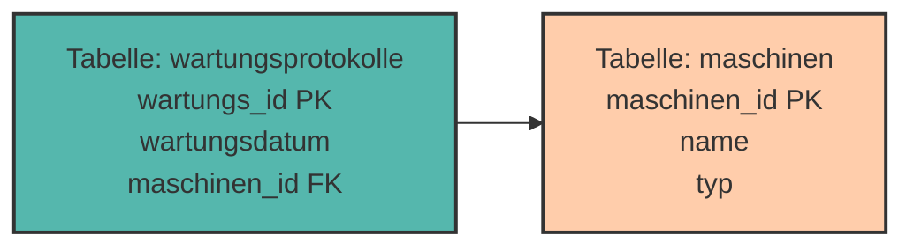
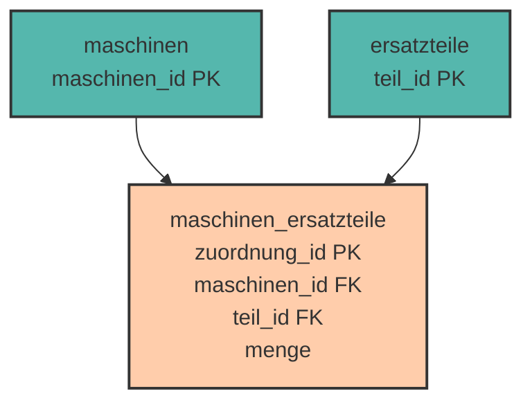

# Datenmodellierung & Beziehungen

Bisher haben wir mit **einzelnen Tabellen** gearbeitet. Aber die wahre Stärke relationaler Datenbanken liegt darin, **Beziehungen zwischen Tabellen** zu modellieren!

Stell dir vor: Eine Maschine benötigt mehrere Ersatzteile, ein Ersatzteil kann in mehreren Maschinen verwendet werden, und Wartungen werden von Technikern durchgeführt. Wie modellieren wir das? Genau darum geht es in diesem Kapitel!

---

## Warum mehrere Tabellen?

### Problem: Alles in einer Tabelle

Versuchen wir, Maschinen **und** ihre Wartungen in einer einzigen Tabelle zu speichern:

```
 maschinen_id │ name            │ wartungsdatum │ techniker    │ kosten
──────────────┼─────────────────┼───────────────┼──────────────┼────────
            1 │ CNC-Fräse Alpha │ 2024-01-15    │ M. Schneider │ 450.00
            1 │ CNC-Fräse Alpha │ 2024-06-20    │ M. Schneider │ 320.00
            2 │ Drehbank Beta   │ 2024-01-15    │ M. Schneider │ 280.00
            2 │ Drehbank Beta   │ 2024-03-10    │ L. Weber     │ 150.00
```

**Probleme:**

❌ **Redundanz** – Der Name "CNC-Fräse Alpha" steht mehrfach
❌ **Update-Anomalie** – Ändert sich der Maschinenname, müssen wir mehrere Zeilen ändern
❌ **Inkonsistenz** – Was, wenn wir den Namen nur in einer Zeile ändern?
❌ **Speicherverschwendung** – Maschineninformationen werden ständig wiederholt

### Lösung: Aufteilen in mehrere Tabellen

```
Tabelle: maschinen                  Tabelle: wartungsprotokolle
 maschinen_id │ name               wartungs_id │ maschinen_id │ wartungsdatum │ techniker
──────────────┼─────────────       ─────────────┼──────────────┼───────────────┼──────────────
            1 │ CNC-Fräse Alpha             101 │            1 │ 2024-01-15    │ M. Schneider
            2 │ Drehbank Beta               102 │            1 │ 2024-06-20    │ M. Schneider
                                            103 │            2 │ 2024-01-15    │ M. Schneider
```

✅ Jede Information nur **einmal** gespeichert  
✅ Änderungen nur an **einer Stelle**  
✅ **Kein Datenverlust**, keine Inkonsistenzen

---

## Das Entity-Relationship-Modell (ERM)

Bevor wir Tabellen erstellen, **modellieren** wir die Datenstruktur mit einem **ER-Diagramm**.

### Die drei Grundkonzepte

**1. Entität (Entity)**

Eine Entität ist ein **Objekt** der realen Welt, z.B.:

- Eine konkrete Maschine: "CNC-Fräse Alpha"
- Ein konkretes Ersatzteil: "Fräskopf Standard"
- Eine konkrete Wartung: "Wartung Nr. 101"

**2. Entitätstyp (Entity Type)**

Ein Entitätstyp ist eine **Kategorie** gleichartiger Entitäten:

- Maschinen (alle Maschinen)
- Ersatzteile (alle Ersatzteile)
- Wartungsprotokolle (alle Wartungen)

Im ER-Diagramm als **Rechteck** dargestellt:

```
┌───────────┐
│ Maschinen │
└───────────┘
```

**3. Beziehung (Relationship)**

Eine Beziehung verbindet Entitätstypen miteinander:

- Maschinen **haben** Wartungen
- Maschinen **benötigen** Ersatzteile
- Techniker **führen durch** Wartungen

Im ER-Diagramm als **Raute** dargestellt:

```
┌───────────┐       ┌────────┐       ┌──────────────────┐
│ Maschinen ├───────┤  haben ├───────┤ Wartungsprotokolle│
└───────────┘       └────────┘       └──────────────────┘
```

---

## Kardinalitäten - Wie viele?

Kardinalitäten beschreiben, **wie viele** Entitäten an einer Beziehung beteiligt sein können.

### Die drei wichtigsten Beziehungstypen

#### 1:n (Eins-zu-Viele)

**Beispiel:** Eine Maschine hat viele Wartungen, aber jede Wartung gehört zu **einer** Maschine.

```
┌───────────┐   1      n   ┌──────────────────┐
│ Maschinen ├──────────────┤ Wartungsprotokolle│
└───────────┘               └──────────────────┘
```

**Weitere Beispiele:**

- Ein Standort hat viele Maschinen (1:n)
- Ein Techniker führt viele Wartungen durch (1:n)
- Ein Typ hat viele Maschinen (1:n)

#### n:m (Viele-zu-Viele)

**Beispiel:** Eine Maschine benötigt viele Ersatzteile, und ein Ersatzteil kann in vielen Maschinen verwendet werden.

```
┌───────────┐   n      m   ┌─────────────┐
│ Maschinen ├──────────────┤ Ersatzteile │
└───────────┘               └─────────────┘
```

**Weitere Beispiele:**

- Techniker arbeiten an Maschinen (n:m)
- Produktionsaufträge nutzen Maschinen (n:m)
- Wartungen verwenden Ersatzteile (n:m)

#### 1:1 (Eins-zu-Eins)

**Beispiel:** Jede Maschine hat **ein** Wartungsprotokoll-Dokument, und jedes Wartungsprotokoll-Dokument gehört zu **einer** Maschine.

```
┌───────────┐   1      1   ┌──────────────────────┐
│ Maschinen ├──────────────┤ Wartungsdokument_PDF │
└───────────┘               └──────────────────────┘
```

<div style="background:#FFB48211; border-left:4px solid #FFB482; padding:12px 16px; margin:16px 0;">
<strong>📘 Hinweis:</strong><br>
1:1-Beziehungen sind selten. Oft kann man die Informationen auch in einer Tabelle speichern.
</div>

---

## Fremdschlüssel (Foreign Key)

Ein **Fremdschlüssel** ist der Primärschlüssel einer anderen Tabelle, der in unserer Tabelle gespeichert wird, um eine Beziehung herzustellen.



**Der Fremdschlüssel `maschinen_id`** in der Tabelle `wartungsprotokolle` verweist auf den **Primärschlüssel `maschinen_id`** in der Tabelle `maschinen`.

---

## 1:n Beziehungen implementieren

**Regel:** Der Fremdschlüssel kommt auf die **n-Seite** (die "viele"-Seite).

### Beispiel: Maschinen und Wartungsprotokolle

**ER-Modell:**

```
Maschinen (1) ───── haben ───── (n) Wartungsprotokolle
```

### Schritt 1: Tabellen erstellen

```sql
-- Zuerst die "1"-Seite
CREATE TABLE maschinen (
    maschinen_id SERIAL PRIMARY KEY,
    name VARCHAR(100) NOT NULL,
    typ VARCHAR(50) NOT NULL,
    standort VARCHAR(50)
);

-- Dann die "n"-Seite mit Fremdschlüssel
CREATE TABLE wartungsprotokolle (
    wartungs_id SERIAL PRIMARY KEY,
    wartungsdatum DATE NOT NULL,
    beschreibung TEXT,
    kosten NUMERIC(10, 2),
    maschinen_id INTEGER NOT NULL,
    FOREIGN KEY (maschinen_id) REFERENCES maschinen(maschinen_id)
);
```

<div style="background:#00948511; border-left:4px solid #009485; padding:12px 16px; margin:16px 0;">
<strong>💡 Wichtig:</strong><br>
Die referenzierte Tabelle (<code>maschinen</code>) muss <strong>vor</strong> der referenzierenden Tabelle (<code>wartungsprotokolle</code>) erstellt werden!
</div>

### Schritt 2: Daten einfügen

```sql
-- Erst Maschinen
INSERT INTO maschinen (name, typ, standort)
VALUES
    ('CNC-Fräse Alpha', 'CNC-Fräse', 'Halle A'),
    ('Drehbank Beta', 'Drehbank', 'Halle A'),
    ('Schweißroboter Gamma', 'Schweißroboter', 'Halle B');

-- Dann Wartungsprotokolle
INSERT INTO wartungsprotokolle (wartungsdatum, beschreibung, kosten, maschinen_id)
VALUES
    ('2024-01-15', 'Routinewartung', 450.00, 1),  -- CNC-Fräse Alpha
    ('2024-06-20', 'Fräskopf getauscht', 320.00, 1),  -- CNC-Fräse Alpha
    ('2024-03-10', 'Ölwechsel', 150.00, 2),  -- Drehbank Beta
    ('2024-02-05', 'Schweißkopf kalibriert', 280.00, 3);  -- Schweißroboter
```

**Ergebnis:**

```
maschinen:
 maschinen_id │ name                 │ typ            │ standort
──────────────┼──────────────────────┼────────────────┼──────────
            1 │ CNC-Fräse Alpha      │ CNC-Fräse      │ Halle A
            2 │ Drehbank Beta        │ Drehbank       │ Halle A
            3 │ Schweißroboter Gamma │ Schweißroboter │ Halle B

wartungsprotokolle:
 wartungs_id │ wartungsdatum │ beschreibung          │ kosten  │ maschinen_id
─────────────┼───────────────┼───────────────────────┼─────────┼──────────────
           1 │ 2024-01-15    │ Routinewartung        │  450.00 │            1
           2 │ 2024-06-20    │ Fräskopf getauscht    │  320.00 │            1
           3 │ 2024-03-10    │ Ölwechsel             │  150.00 │            2
           4 │ 2024-02-05    │ Schweißkopf kalibriert│  280.00 │            3
```

---

## Referenzielle Integrität

**Referenzielle Integrität** bedeutet: Jeder Fremdschlüssel muss auf einen **existierenden** Primärschlüssel verweisen.

### Was passiert beim Löschen?

```sql
-- Versuch, Maschine 1 (CNC-Fräse Alpha) zu löschen
DELETE FROM maschinen WHERE maschinen_id = 1;
```

❌ **Fehler!** Es gibt Wartungsprotokolle für Maschine 1 – sie würden "verwaisen".

### Lösung: ON DELETE Optionen

```sql
CREATE TABLE wartungsprotokolle (
    wartungs_id SERIAL PRIMARY KEY,
    wartungsdatum DATE,
    maschinen_id INTEGER,
    FOREIGN KEY (maschinen_id) REFERENCES maschinen(maschinen_id)
        ON DELETE RESTRICT  -- Löschen verhindern
);
```

<div style="text-align:center; max-width:900px; margin:16px auto;">
<table role="table" 
       style="width:100%; border-collapse:separate; border-spacing:0; border:1px solid #cfd8e3; border-radius:10px; overflow:hidden; font-family:system-ui,sans-serif;">
    <thead>
    <tr style="background:#009485; color:#fff;">
        <th style="text-align:left; padding:12px 14px; font-weight:700;">Option</th>
        <th style="text-align:left; padding:12px 14px; font-weight:700;">Bedeutung</th>
    </tr>
    </thead>
    <tbody>
    <tr>
        <td style="background:#00948511; padding:10px 14px;"><code>ON DELETE RESTRICT</code></td>
        <td style="padding:10px 14px;">Löschen wird <strong>verhindert</strong>, wenn noch Verweise existieren (Standard)</td>
    </tr>
    <tr>
        <td style="background:#00948511; padding:10px 14px;"><code>ON DELETE CASCADE</code></td>
        <td style="padding:10px 14px;">Löscht <strong>automatisch alle abhängigen Datensätze</strong> mit</td>
    </tr>
    <tr>
        <td style="background:#00948511; padding:10px 14px;"><code>ON DELETE SET NULL</code></td>
        <td style="padding:10px 14px;">Setzt Fremdschlüssel auf <code>NULL</code></td>
    </tr>
    <tr>
        <td style="background:#00948511; padding:10px 14px;"><code>ON DELETE SET DEFAULT</code></td>
        <td style="padding:10px 14px;">Setzt Fremdschlüssel auf Standardwert</td>
    </tr>
    </tbody>
</table>
</div>

### Beispiele

#### CASCADE - Kaskadierende Löschung

```sql
CREATE TABLE angestellte (
    angestellte_id SERIAL PRIMARY KEY,
    name VARCHAR(100),
    abteilung_id INTEGER,
    FOREIGN KEY (abteilung_id) REFERENCES abteilungen(abteilung_id)
        ON DELETE CASCADE
);

-- Löscht Abteilung UND alle Angestellten in dieser Abteilung
DELETE FROM abteilungen WHERE abteilung_id = 1;
```

⚠️ **Vorsicht!** Alle Angestellten der IT-Abteilung werden gelöscht!

#### SET NULL

```sql
CREATE TABLE angestellte (
    angestellte_id SERIAL PRIMARY KEY,
    name VARCHAR(100),
    abteilung_id INTEGER,  -- Muss NULL erlauben!
    FOREIGN KEY (abteilung_id) REFERENCES abteilungen(abteilung_id)
        ON DELETE SET NULL
);

-- Löscht Abteilung, Angestellte bleiben, aber ohne Abteilung
DELETE FROM abteilungen WHERE abteilung_id = 1;
```

---

## n:m Beziehungen implementieren

**Problem:** Wir können keine n:m-Beziehung direkt mit Fremdschlüsseln umsetzen!

**Lösung:** Eine **Zwischentabelle** (auch **Verbindungstabelle** oder **Junction Table**).

### Beispiel: Maschinen und Ersatzteile

**ER-Modell:**

```
Maschinen (n) ───── benötigen ───── (m) Ersatzteile
```

### Schritt 1: Die drei Tabellen

```sql
-- Tabelle 1: Maschinen
CREATE TABLE maschinen (
    maschinen_id SERIAL PRIMARY KEY,
    name VARCHAR(100) NOT NULL,
    typ VARCHAR(50),
    standort VARCHAR(50)
);

-- Tabelle 2: Ersatzteile
CREATE TABLE ersatzteile (
    teil_id SERIAL PRIMARY KEY,
    teilname VARCHAR(100) NOT NULL,
    hersteller VARCHAR(50),
    preis NUMERIC(10, 2)
);

-- Tabelle 3: Zwischentabelle für die n:m-Beziehung
CREATE TABLE maschinen_ersatzteile (
    zuordnung_id SERIAL PRIMARY KEY,
    maschinen_id INTEGER NOT NULL,
    teil_id INTEGER NOT NULL,
    menge INTEGER DEFAULT 1,  -- Zusätzliches Attribut der Beziehung!
    FOREIGN KEY (maschinen_id) REFERENCES maschinen(maschinen_id)
        ON DELETE CASCADE,
    FOREIGN KEY (teil_id) REFERENCES ersatzteile(teil_id)
        ON DELETE CASCADE
);
```



### Schritt 2: Daten einfügen

```sql
-- Maschinen
INSERT INTO maschinen (name, typ, standort)
VALUES
    ('CNC-Fräse Alpha', 'CNC-Fräse', 'Halle A'),
    ('Drehbank Beta', 'Drehbank', 'Halle A'),
    ('Schweißroboter Gamma', 'Roboter', 'Halle B');

-- Ersatzteile
INSERT INTO ersatzteile (teilname, hersteller, preis)
VALUES
    ('Spindelmotor', 'MotorTech GmbH', 1250.00),
    ('Kühlmittelpumpe', 'PumpCo', 380.50),
    ('Schweißdrahtspule', 'WeldSupply', 45.90);

-- Zuordnungen (welche Maschine benötigt welche Ersatzteile?)
INSERT INTO maschinen_ersatzteile (maschinen_id, teil_id, menge)
VALUES
    (1, 1, 1),  -- CNC-Fräse benötigt Spindelmotor
    (1, 2, 2),  -- CNC-Fräse benötigt 2x Kühlmittelpumpe
    (2, 1, 1),  -- Drehbank benötigt Spindelmotor
    (2, 2, 1),  -- Drehbank benötigt Kühlmittelpumpe
    (3, 2, 1),  -- Schweißroboter benötigt Kühlmittelpumpe
    (3, 3, 5);  -- Schweißroboter benötigt 5x Schweißdrahtspule
```

**Visualisierung:**

```
CNC-Fräse Alpha benötigt:
  ├─ Spindelmotor (1x)
  └─ Kühlmittelpumpe (2x)

Drehbank Beta benötigt:
  ├─ Spindelmotor (1x)
  └─ Kühlmittelpumpe (1x)

Schweißroboter Gamma benötigt:
  ├─ Kühlmittelpumpe (1x)
  └─ Schweißdrahtspule (5x)
```

---

## Praktische Übungen 🎯

### Aufgabe 1: 1:n Beziehung

Erstelle Tabellen für Lieferanten und Materialien (1:n).

**Anforderungen:**

- Ein Lieferant liefert viele Materialien
- Jedes Material kommt von einem Lieferanten
- Lieferanten: ID, Name, Standort
- Materialien: ID, Materialname, Einheit, Preis, Lieferant

<details>
<summary>💡 Lösung anzeigen</summary>

```sql
CREATE TABLE lieferanten (
    lieferant_id SERIAL PRIMARY KEY,
    name VARCHAR(100) NOT NULL,
    standort VARCHAR(100)
);

CREATE TABLE materialien (
    material_id SERIAL PRIMARY KEY,
    materialname VARCHAR(100) NOT NULL,
    einheit VARCHAR(20),  -- z.B. kg, Liter, Stück
    preis NUMERIC(10, 2),
    lieferant_id INTEGER NOT NULL,
    FOREIGN KEY (lieferant_id) REFERENCES lieferanten(lieferant_id)
        ON DELETE RESTRICT
);

-- Testdaten
INSERT INTO lieferanten (name, standort)
VALUES
    ('Stahl-Handel Nord', 'Hamburg'),
    ('ChemTech Solutions', 'Frankfurt');

INSERT INTO materialien (materialname, einheit, preis, lieferant_id)
VALUES
    ('Edelstahl 1.4301', 'kg', 8.50, 1),
    ('Kühlschmierstoff', 'Liter', 12.90, 2);
```
</details>

### Aufgabe 2: n:m Beziehung

Erstelle Tabellen für Techniker und Zertifizierungen (n:m).

**Anforderungen:**

- Ein Techniker hat viele Zertifizierungen
- Eine Zertifizierung wird von vielen Technikern gehalten
- Techniker: ID, Name
- Zertifizierungen: ID, Bezeichnung, Gültigkeit (Jahre)
- Zertifikatsvergaben: Welcher Techniker hat welche Zertifizierung + Erwerbs- und Ablaufdatum

<details>
<summary>💡 Lösung anzeigen</summary>

```sql
CREATE TABLE techniker (
    techniker_id SERIAL PRIMARY KEY,
    name VARCHAR(100) NOT NULL
);

CREATE TABLE zertifizierungen (
    zertifizierung_id SERIAL PRIMARY KEY,
    bezeichnung VARCHAR(200) NOT NULL,
    gueltigkeit_jahre INTEGER
);

CREATE TABLE zertifikatsvergaben (
    vergabe_id SERIAL PRIMARY KEY,
    techniker_id INTEGER NOT NULL,
    zertifizierung_id INTEGER NOT NULL,
    erwerbsdatum DATE NOT NULL,
    ablaufdatum DATE,
    FOREIGN KEY (techniker_id) REFERENCES techniker(techniker_id)
        ON DELETE CASCADE,
    FOREIGN KEY (zertifizierung_id) REFERENCES zertifizierungen(zertifizierung_id)
        ON DELETE CASCADE
);

-- Testdaten
INSERT INTO techniker (name)
VALUES ('Thomas Müller'), ('Sandra Schmidt');

INSERT INTO zertifizierungen (bezeichnung, gueltigkeit_jahre)
VALUES ('CNC-Programmierung Stufe 2', 5), ('Schweißfachmann', 3);

INSERT INTO zertifikatsvergaben (techniker_id, zertifizierung_id, erwerbsdatum, ablaufdatum)
VALUES
    (1, 1, '2020-03-15', '2025-03-15'),
    (2, 1, '2022-06-10', '2027-06-10'),
    (1, 2, '2021-09-20', '2024-09-20');
```
</details>

---

## Zusammenfassung 📌

- **ER-Modell** beschreibt Entitäten, Attribute und Beziehungen
- **Kardinalitäten**: 1:1, 1:n, n:m beschreiben die Anzahl der Beziehungen
- **Fremdschlüssel** (Foreign Key) stellen Beziehungen zwischen Tabellen her
- **1:n-Beziehungen**: Fremdschlüssel auf der "n"-Seite
- **n:m-Beziehungen**: Benötigen eine Zwischentabelle mit zwei Fremdschlüsseln
- **Referenzielle Integrität** stellt sicher, dass Fremdschlüssel auf existierende Primärschlüssel verweisen
- **ON DELETE**: RESTRICT (verhindert), CASCADE (löscht mit), SET NULL, SET DEFAULT

**Wichtigste Regel:**

> Modelliere erst mit ER-Diagrammen, dann implementiere in SQL!

---

Im nächsten Kapitel lernen wir **JOINs** kennen – wie man Daten aus mehreren verknüpften Tabellen abfragt!