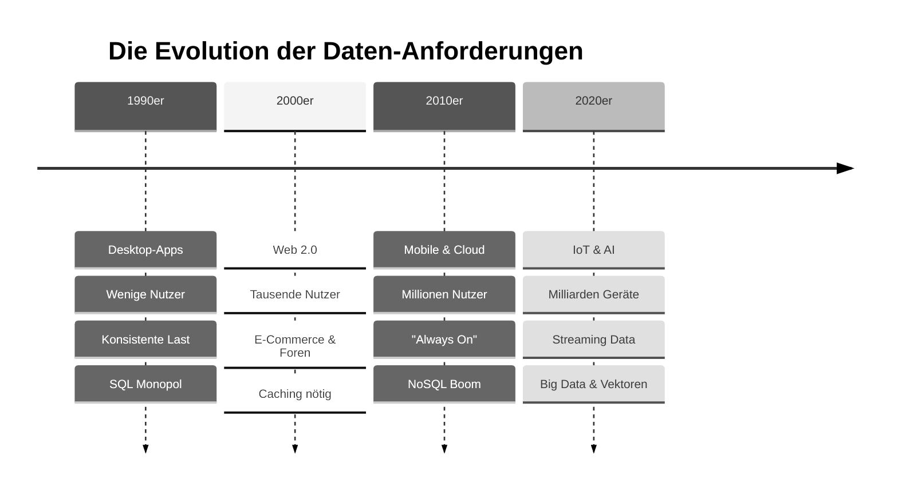
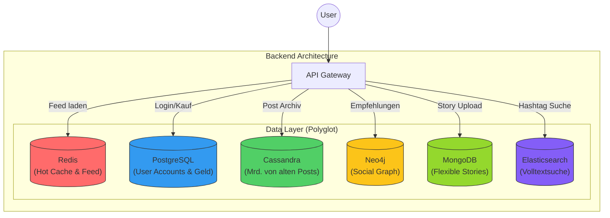
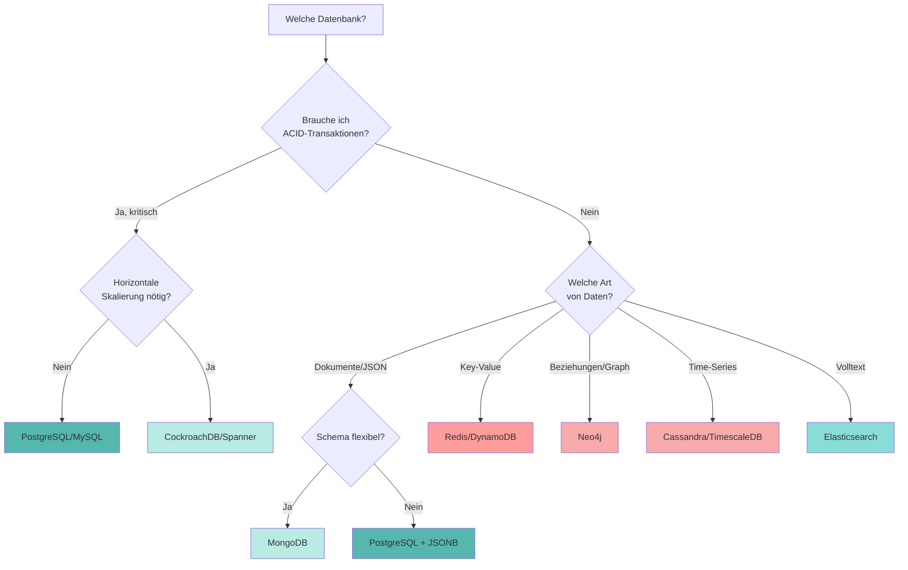

# Moderne Datenbanksysteme: Architektur & Alternativen

<div style="text-align: center; display: flex; flex-direction: column; align-items: center; margin-bottom: 2rem;">
    
    <figcaption style="margin-top: 0.5rem;"><i>"So viele Datenbanken, so wenig Zeit..."</i> <br> Quelle: <a href="https://blog.algomaster.io/p/sql-vs-nosql-7-key-differences">AlgoMaster</a></figcaption>
</div>

## Einleitung: Warum reicht SQL nicht mehr?

In den vorherigen Kapiteln haben wir **relationale Datenbanken (RDBMS)** am Beispiel von PostgreSQL gemeistert. Wir können Tabellen erstellen, komplexe `JOIN`s schreiben und Transaktionen sicherstellen. Relationale Datenbanken sind seit über 50 Jahren das Rückgrat der IT und werden es für Standard-Anwendungen auch bleiben.

**Aber:** Die Art und Weise, wie wir Software bauen und nutzen, hat sich radikal verändert.



Diese Evolution brachte Anforderungen mit sich, bei denen klassische RDBMS an ihre physikalischen Grenzen stoßen:

1.  **Massive Skalierung:** Wenn ein Server nicht mehr reicht, müssen wir auf 100 Server verteilen (**Horizontale Skalierung**). SQL ist primär für einen starken Server konzipiert (Vertikale Skalierung).
2.  **Unstrukturierte Daten:** Social Media Posts, JSON-Logs oder Sensordaten passen selten in starre Excel-artige Tabellen.
3.  **Geschwindigkeit (Latenz):** Ein Millisekunden-Wartezeit entscheidet heute über Kauf oder Abbruch. Festplatten sind oft zu langsam.
4.  **Vernetzung:** In sozialen Netzen ist die *Beziehung* zwischen Daten wichtiger als der Datensatz selbst.

Daraus entstand die Bewegung der **NoSQL** ("Not Only SQL") Datenbanken.

???+ warning "Wichtiger Hinweis"
    Dieses Kapitel ersetzt **nicht** dein SQL-Wissen! Ca. **80% aller Business-Anwendungen** (CRM, ERP, Buchhaltung) laufen weiterhin perfekt auf PostgreSQL oder MySQL. Die hier vorgestellten Systeme sind **Spezialwerkzeuge** für Probleme, die SQL nicht effizient lösen kann.

---

## Das Gedankenexperiment: Instagram auf PostgreSQL?

Um die Grenzen zu verstehen, stellen wir uns folgende Frage: 

> Könnten wir Instagram nur mit PostgreSQL bauen?

Schauen wir uns dazu an, was **Instagram** täglich leisten muss:

**Die Last-Anforderungen:**

- 2+ Milliarden aktive Nutzer weltweit
- 95 Millionen Posts pro Tag (Fotos, Videos, Reels, Stories)
- 4,2 Milliarden Likes pro Tag
- 500 Millionen Stories täglich
- Follower-Netzwerk: Durchschnittlich 150 Follower pro Nutzer = 300 Milliarden Beziehungen
- Hashtag-Suche: Millionen Suchen pro Sekunde
- Feed muss in < 100ms laden (sonst verliert man Nutzer)

Doch wo liegen jetzt die Probleme?

???+ info "Problem 1: Der Feed (Zu viele Joins)"

    Dein Feed besteht aus den Posts aller Leute, denen du folgst.

    ```sql
    -- Der naive SQL-Ansatz
    SELECT posts.*
    FROM posts
    JOIN followers ON posts.user_id = followers.following_id
    WHERE followers.follower_id = :deine_id
    ORDER BY posts.created_at DESC
    LIMIT 20;
    ```

    **Das Problem:**
    Wenn du 500 Leuten folgst und diese aktiv sind, muss die Datenbank bei *jedem einzelnen Aufruf* Millionen von Zeilen scannen, joinen und sortieren. Bei Milliarden Nutzern führt das zum **Systemkollaps**. Die Antwortzeit läge bei Sekunden, nicht Millisekunden.

???+ info "Problem 2: Die Story-Vielfalt (Starres Schema)"

    Stories können Fotos, Videos, Umfragen, Musik oder Countdowns enthalten.

    ```sql
    -- Der Versuch in SQL
    CREATE TABLE stories (
        id SERIAL PRIMARY KEY,
        type VARCHAR(50),
        image_url VARCHAR(255),
        poll_question TEXT,    -- Nur für Umfragen
        music_track_id INT,    -- Nur für Musik
        countdown_end TIMESTAMP -- Nur für Countdowns
        -- ...und 50 weitere Spalten, die meistens LEER (NULL) sind
    );
    ```

    **Das Problem:**
    Dies nennt man "Sparse Data" (dünn besetzte Daten). Die Tabelle wird riesig, voller `NULL`-Werte und unflexibel. Ein neues Feature (z.B. "Quiz-Sticker") erfordert ein teures `ALTER TABLE`, das bei großen Datenmengen die Datenbank stundenlang blockieren kann.

???+ info "Problem 3: "Freunde von Freunden" (Graph-Traversierung)"

    Die Funktion "Leute, die du kennen könntest" sucht Verbindungen über mehrere Ecken.

    **Das Problem:**
    In SQL erfordert jeder "Hop" (Freund -\> dessen Freund -\> dessen Freund) einen `JOIN`. Ein Join über 3-4 Ebenen mit Millionen Nutzern ist mathematisch so aufwendig, dass die Datenbank "explodiert" (exponentielle Komplexität).


Doch wie können wir nun dieses Problem lösen? 

---

## Polyglot Persistence

Da PostgreSQL oder eine andere relationale Datenbank nicht in der Lage ist, diese Anforderungen alleine zu erfällen, nutzen wir **Polyglot Persistence**.
Dies bedeutet, dass Instagram (wie fast alle Großsysteme) **nicht eine** Datenbank nutzt, sondern viele (SQL und NoSQL). Jede für ihren **optimalen Zweck**.



Schauen wir uns an, wie diese "Spezialisten" im Detail funktionieren.

???+ warning "Aufbau Instagram"
    Der genaue Aufbau von Instagram kann nicht exakt beschrieben werden. In diesem Kapitel werden Beispiele gezeigt, wie es funktionieren könnte und was mögliche Softwaretools wären.

---

## Die NoSQL-Alternativen im Detail


**NoSQL** steht für "Not Only SQL" – nicht als Ersatz, sondern als **Ergänzung** zu relationalen Datenbanken. NoSQL-Datenbanken verzichten auf starre Schemas und ACID-Garantien, um **Flexibilität und Skalierbarkeit** zu gewinnen.

In diesem Abschnitt schauen wir uns die verschiedenen **NoSQL-Datenbanksysteme** im Detail an.

<div style="text-align:center; max-width:1200px; margin:16px auto;">
<table role="table" aria-label="NoSQL Datenbanken Vergleich"
        style="width:100%; border-collapse:separate; border-spacing:0; border:1px solid #cfd8e3; border-radius:10px; overflow:hidden; font-family:system-ui,Segoe UI,Roboto,Arial,sans-serif;">
    <thead>
    <tr style="background:#009485; color:#fff;">
        <th style="text-align:left; padding:12px 14px; font-weight:700;">Datenbank</th>
        <th style="text-align:left; padding:12px 14px; font-weight:700;">Datenmodell</th>
        <th style="text-align:center; padding:12px 14px; font-weight:700;">NoSQL?</th>
        <th style="text-align:center; padding:12px 14px; font-weight:700;">In-Memory</th>
        <th style="text-align:left; padding:12px 14px; font-weight:700;">ACID</th>
        <th style="text-align:left; padding:12px 14px; font-weight:700;">Skalierung</th>
        <th style="text-align:left; padding:12px 14px; font-weight:700;">Spezialrolle</th>
    </tr>
    </thead>
    <tbody>
    <tr>
        <td style="background:#00948511; text-align:left; padding:10px 14px;"><strong>PostgreSQL</strong></td>
        <td style="text-align:left; padding:10px 14px;">Relational + JSON</td>
        <td style="text-align:center; padding:10px 14px;">❌</td>
        <td style="text-align:center; padding:10px 14px;">❌</td>
        <td style="text-align:left; padding:10px 14px;">✅</td>
        <td style="text-align:left; padding:10px 14px;">Vertikal + Citus</td>
        <td style="text-align:left; padding:10px 14px;">SQL, OLTP</td>
    </tr>
    <tr>
        <td style="background:#00948511; text-align:left; padding:10px 14px;"><strong>Redis</strong></td>
        <td style="text-align:left; padding:10px 14px;">Key-Value</td>
        <td style="text-align:center; padding:10px 14px;">✅</td>
        <td style="text-align:center; padding:10px 14px;">✅</td>
        <td style="text-align:left; padding:10px 14px;">❌ (eingeschränkt)</td>
        <td style="text-align:left; padding:10px 14px;">Horizontal</td>
        <td style="text-align:left; padding:10px 14px;">Cache, Sessions</td>
    </tr>
    <tr>
        <td style="background:#00948511; text-align:left; padding:10px 14px;"><strong>Cassandra</strong></td>
        <td style="text-align:left; padding:10px 14px;">Wide-Column</td>
        <td style="text-align:center; padding:10px 14px;">✅</td>
        <td style="text-align:center; padding:10px 14px;">❌</td>
        <td style="text-align:left; padding:10px 14px;">❌</td>
        <td style="text-align:left; padding:10px 14px;">✅ horizontal</td>
        <td style="text-align:left; padding:10px 14px;">Big Data, IoT</td>
    </tr>
    <tr>
        <td style="background:#00948511; text-align:left; padding:10px 14px;"><strong>Neo4j</strong></td>
        <td style="text-align:left; padding:10px 14px;">Graph</td>
        <td style="text-align:center; padding:10px 14px;">✅</td>
        <td style="text-align:center; padding:10px 14px;">❌</td>
        <td style="text-align:left; padding:10px 14px;">✅</td>
        <td style="text-align:left; padding:10px 14px;">Eingeschränkt</td>
        <td style="text-align:left; padding:10px 14px;">Beziehungen</td>
    </tr>
    <tr>
        <td style="background:#00948511; text-align:left; padding:10px 14px;"><strong>Elasticsearch</strong></td>
        <td style="text-align:left; padding:10px 14px;">Search Engine</td>
        <td style="text-align:center; padding:10px 14px;">✅</td>
        <td style="text-align:center; padding:10px 14px;">❌</td>
        <td style="text-align:left; padding:10px 14px;">❌</td>
        <td style="text-align:left; padding:10px 14px;">✅</td>
        <td style="text-align:left; padding:10px 14px;">Volltext, Logs</td>
    </tr>
    <tr>
        <td style="background:#00948511; text-align:left; padding:10px 14px;"><strong>MongoDB</strong></td>
        <td style="text-align:left; padding:10px 14px;">Document</td>
        <td style="text-align:center; padding:10px 14px;">✅</td>
        <td style="text-align:center; padding:10px 14px;">❌</td>
        <td style="text-align:left; padding:10px 14px;">✅ (ab v4)</td>
        <td style="text-align:left; padding:10px 14px;">✅</td>
        <td style="text-align:left; padding:10px 14px;">JSON-APIs</td>
    </tr>
    </tbody>
</table>
</div>

**Was macht jede Datenbank speziell?**


- **PostgreSQL**: Der klassische Allrounder für strukturierte Daten mit ACID-Garantien. Perfekt für Business-Anwendungen, wo Datenkonsistenz kritisch ist (Buchhaltung, Bestellungen, Nutzerverwaltung).

- **MongoDB**: Das Chamäleon für flexible JSON-Dokumente. Jedes Dokument kann eine andere Struktur haben - ideal für schnell evolvierende Features (Stories, Posts, Produkte), wo SQL starre Tabellen erzwingt.

- **Redis**: Die schnellste Datenbank der Welt - alles liegt im RAM statt auf der Festplatte. Ideal für Caching, Session-Management und Daten, die sofort verfügbar sein müssen, auch wenn sie nach einem Neustart verloren gehen dürfen.

- **Cassandra**: Gebaut für extreme Schreiblasten und lineare Skalierung auf tausende Server. Das "schwarze Loch" für Massendaten - schluckt Milliarden Events/Logs/IoT-Daten pro Tag, erlaubt aber nur einfache Abfragen entlang des Partition Keys.

- **Neo4j**: Spezialist für Beziehungen und Netzwerkanalyse. Während SQL bei "Freund von Freund" kollabiert, folgt Neo4j einfach den Pointern - perfekt für Social Networks, Empfehlungen und Fraud Detection.

- **Elasticsearch**: Der Volltext-Suchspezialist mit invertiertem Index. Findet in Millisekunden Texte in Millionen Dokumenten, korrigiert Tippfehler automatisch und rankt Ergebnisse nach Relevanz - SQL würde Minuten brauchen.


---

### Document Stores (z.B. MongoDB)

In relationalen Datenbanken muss jede Zeile **exakt** die gleiche Struktur haben (d.h. das Schema ist fix). Wenn man im nachhinein neue Felder hinzufügen möchte, erfordert dies einen `ALTER TABLE` Befehle. Dieser kann unter Umständen bei großen Tabellen Stunden dauern. Das macht SQL nicht besonders flexibel.

???+ defi "Konzept: Document Stores"
    Daten werden nicht in Zeilen/Spalten, sondern als **Dokumente (meist JSON/BSON)** gespeichert. Ähnliche Dokumente liegen in einer *Collection*.

<div style="text-align: center; display: flex; flex-direction: column; align-items: center; margin-bottom: 2rem;">
    
    <figcaption style="margin-top: 0.5rem;">Quelle: <a href="https://www.geeksforgeeks.org/mongodb/mongodb-tutorial/">GeeksforGeeks</a></figcaption>
</div>


In Document Stores kann jedes Dokument eine **unterschiedliche Struktur** haben (Schema-frei). Neue Features können relativ einfach hinzugefügt werden. Das macht es sehr flexibel. Weiters können hierarchische Daten (Nested Objects/Arrays) direkt im Dokument gespeichert werden.

MongoDB als einer der bekanntesten Vertreter von Document Stores organisiert Daten in drei Ebenen:

1. **Database** - Eine logische Gruppe (z.B. `instagram_db`)
2. **Collection** - Eine Sammlung ähnlicher Dokumente (z.B. `stories`, ähnlich einer SQL-Tabelle)
3. **Document** - Ein einzelnes JSON-Objekt mit beliebiger Struktur (ähnlich einer SQL-Zeile, aber flexibel)


???+ example "Der Instagram-Use-Case"

    Stories & komplexe Metadaten - Warum SQL hier scheitert

    **Problem mit SQL:**
    ```sql
    -- In SQL bräuchten wir mindestens 3 Tabellen:
    CREATE TABLE stories (
        id SERIAL PRIMARY KEY,
        type VARCHAR(50),
        url VARCHAR(255)
    );

    CREATE TABLE story_filters (
        story_id INT REFERENCES stories(id),
        filter_name VARCHAR(50)
    );

    CREATE TABLE poll_options (
        story_id INT REFERENCES stories(id),
        text VARCHAR(255),
        votes INT
    );

    -- Und dann komplexe JOINs zum Auslesen...
    ```

    **Lösung mit MongoDB:**
    ```javascript
    // Collection: stories

    // Story Typ A: Einfaches Foto
    {
      "_id": ObjectId("507f1f77bcf86cd799439011"),
      "user_id": 123,
      "type": "photo",
      "url": "img.jpg",
      "filters": ["sepia", "vignette"],  // Array direkt im Dokument!
      "created_at": ISODate("2024-01-15T10:30:00Z")
    }

    // Story Typ B: Umfrage (Völlig andere Struktur - in derselben Collection!)
    {
      "_id": ObjectId("507f1f77bcf86cd799439012"),
      "user_id": 456,
      "type": "poll",
      "question": "Pizza oder Pasta?",
      "options": [  // Nested Array mit Objekten
        {"text": "Pizza", "votes": 42},
        {"text": "Pasta", "votes": 12}
      ],
      "sticker_position": {"x": 100, "y": 200},  // Nested Object
      "expires_at": ISODate("2024-01-16T10:30:00Z")
    }

    // Story Typ C: Musik (wieder andere Felder!)
    {
      "_id": ObjectId("507f1f77bcf86cd799439013"),
      "user_id": 789,
      "type": "music",
      "track": {
        "artist": "Coldplay",
        "title": "Yellow",
        "spotify_id": "3AJwUDP919kvQ9QcozQPxg"
      }
    }
    ```

    **Der Vorteil:** Alle Stories bleiben in **einer Collection**, trotz unterschiedlicher Struktur. Kein JOIN nötig - ein einziger Zugriff holt alle Daten!


---

### Key-Value Stores (z.B. Redis)

Der fundamentale Unterschied zwischen relationalen Datenbanken und Key-Value Stores liegt in der **Speicherung und Zugriffsgeschwindigkeit**. Während PostgreSQL Daten auf der Festplatte (SSD/HDD) speichert und bei jedem Zugriff eine I/O-Operation durchführen muss, liegen die Daten bei Redis direkt im **Arbeitsspeicher (RAM)**. Das macht Redis etwa 5000x schneller - typische Zugriffszeiten liegen unter 1 Millisekunde, oft sogar unter 0.1 ms, während PostgreSQL 1-50 Millisekunden benötigt.

???+ defi "Konzept: Key-Value Stores"
    Eine riesige, extrem schnelle `HashMap` oder `Dictionary`. Daten liegen **im Arbeitsspeicher (RAM)** (In-Memory), nicht auf der Festplatte.

Ein weiterer wichtiger Unterschied ist die **Einfachheit der Abfragen**. Während SQL komplexe Queries mit `WHERE`, `JOIN` und `GROUP BY` erlaubt, die von Parser, Optimizer und Executor verarbeitet werden müssen, kennt Redis nur die simpelsten Operationen: `GET key` und `SET key value`. Diese direkten Hash-Table-Zugriffe benötigen keine Query-Planung und sind dadurch extrem performant.

Einer der bekanntesten Vertreter von Key-Value Stores ist **Redis**  - im Kern eine **In-Memory-HashMap** mit erweiterten Datentypen. Das Grundkonzept ist simpel: Ein Schlüssel (String) verweist auf einen Wert, wobei dieser Wert verschiedene Typen haben kann - einfache Strings, Listen (geordnete Arrays), Sets (ungeordnete eindeutige Werte), Hashes (verschachtelte Key-Value Paare) oder Sorted Sets (Sets mit Scores für Rankings). Alle diese Daten liegen im RAM und werden über Hash-Tabellen verwaltet.

Sehr häufig kommt Redis in Kombination mit anderen Datenbanksystemen zum Einsatz

<div style="text-align: center; display: flex; flex-direction: column; align-items: center; margin-bottom: 2rem;">
    
    <figcaption style="margin-top: 0.5rem;">Quelle: <a href="https://intellisoft.io/inside-redis-navigating-the-high-speed-highway-of-data-structures/">Intellisoft</a></figcaption>
</div>

Ein besonderes Feature ist die **TTL (Time-to-Live)** Funktionalität - Schlüssel können automatisch ablaufen, was ideal für temporäre Daten wie Sessions ist (z.B. automatisches Löschen nach 30 Minuten). Optional kann Redis auch Snapshots auf der Festplatte speichern oder ein Append-Only-File führen, um Daten nach einem Neustart wiederherzustellen.

???+ example "Der Instagram-Use-Case"

    Der Feed-Cache & Sessions - Warum PostgreSQL zu langsam ist

    **Problem mit SQL:**
    ```sql
    -- Jedes Mal wenn du Instagram öffnest, muss PostgreSQL:
    SELECT posts.*
    FROM posts
    JOIN followers ON posts.user_id = followers.following_id
    WHERE followers.follower_id = 123
    ORDER BY posts.created_at DESC
    LIMIT 20;

    -- Bei 500 Leuten, denen du folgst:
    -- → Millionen Zeilen scannen
    -- → JOIN berechnen
    -- → Sortieren
    -- → Dauer: 50-200 ms (zu langsam!)
    ```

    **Lösung mit Redis:**
    ```python
    # WRITE: Feed wird beim Posten vorberechnet (Fan-Out on Write)
    # Wenn User 789 ein Foto postet:
    for follower_id in user_789.get_followers():  # einmalig
        redis.lpush(f"feed:{follower_id}", "post_9999")

    # READ: Instant Zugriff auf fertigen Feed
    feed_ids = redis.lrange("feed:123", 0, 19)  # Top 20 Posts
    # Dauer: < 1 Millisekunde!

    # Datenstruktur in Redis:
    # Key: "feed:123" → Value: [9999, 9998, 9997, 9996, ...]
    #                          └── Sorted List (neueste zuerst)

    # Bonus: Sessions
    redis.setex("session:abc123", 1800, '{"user_id": 123, "logged_in": true}')
    #            └── Key         └── TTL (30 Min) └── JSON als String
    ```

    **Der Trade-Off:**

    - **Vorteil**: Feed laden = 200x schneller (50ms → 0.2ms)
    - **Nachteil**: Mehr Speicher (Feed für alle Nutzer im RAM), Daten gehen bei Neustart verloren (wenn keine Persistence konfiguriert)
    - **Wann nutzen**: Für Daten, wo **Geschwindigkeit wichtiger als Dauerhaftigkeit** ist

---

### Wide-Column Stores (z.B. Cassandra)

Der kritische Unterschied zwischen relationalen Datenbanken und Wide-Column Stores zeigt sich bei **massiven Schreiblasten**. PostgreSQL hat bei jedem `INSERT` einen fundamentalen Nachteil: Der [B-Tree-Index](https://www.datacamp.com/doc/mysql/mysql-b-tree) muss sortiert eingefügt werden, was bei Millionen Writes pro Sekunde zum Bottleneck wird. Die typische Last liegt bei etwa 10.000 Writes/Sek pro Server. Cassandra hingegen hängt Daten einfach an (Append-Only Log), was extrem schnell ist und Millionen Writes/Sek über den gesamten Cluster ermöglicht.

???+ defi "Konzept: Wide-Column Stores"
    Optimiert für **massive Schreiblasten** und **Verteilung** auf tausende Server. Daten sind in "Partitionen" organisiert, wobei jede Partition viele Spalten haben kann.


Cassandra organisiert Daten in einer **mehrdimensionalen Map-Struktur**. Die Hierarchie ist: Table → Partition (bestimmt durch Partition Key) → Row (bestimmt durch Clustering Key) → Columns. Der **Partition Key** bestimmt dabei, auf welchem Server (Node) die Daten liegen, während der **Clustering Key** die Zeilen innerhalb einer Partition sortiert. Ein typisches Schema sieht so aus:

<div style="text-align: center; display: flex; flex-direction: column; align-items: center; margin-bottom: 2rem;">
    
    <figcaption style="margin-top: 0.5rem;">Quelle: <a href="https://www.instaclustr.com/blog/cassandra-data-partitioning/">instaclustr</a></figcaption>
</div>

Das Speicher-Layout ist dann verteilt: `user_id=123` liegt auf Node 1, `user_id=456` auf Node 2, etc. - ein Hash-Algorithmus bestimmt den Node. Innerhalb jedes Nodes sind die Posts automatisch nach dem Clustering Key sortiert (neueste zuerst).

Die extreme Schreibgeschwindigkeit kommt durch den **Write-Path**: Neue Daten gehen zunächst in den RAM und sind damit sofort gespeichert. Periodisch wird die MemTable auf die Festplatte geschrieben. Das Entscheidende: Es ist ein **Append-Only** System - alte Daten werden nie geändert, nur neue Dateien werden angehängt.

???+ example "Der Instagram-Use-Case"

    Das Archiv aller 95 Mio. täglichen Posts - Warum PostgreSQL kollabiert

    **Problem mit SQL:**
    ```sql
    -- 95 Millionen Posts pro Tag = ~1100 Inserts/Sekunde
    -- PostgreSQL muss bei jedem INSERT:
    INSERT INTO posts (user_id, image_url, caption, created_at)
    VALUES (123, 'img.jpg', 'Urlaub!', NOW());

    -- → Index aktualisieren (sortieren in B-Tree)
    -- → Transaktionslog schreiben
    -- → Locks setzen
    -- → Bei Milliarden existierender Posts wird jedes INSERT langsamer
    ```

    **Lösung mit Cassandra:**
    ```sql
    -- Cassandra: Einfach anhängen, kein Sortieren!
    INSERT INTO posts (user_id, created_at, post_id, image_url, caption)
    VALUES (123, '2024-01-15 10:30:00', uuid(), 'img.jpg', 'Urlaub!');

    -- Dauer: < 1 ms (weil nur MemTable-Append)
    -- Cluster verteilt Last automatisch auf 500 Nodes
    -- → 1100 Writes/Sek ÷ 500 Nodes = 2 Writes/Sek pro Node (easy)
    ```

    **Abfrage (nur entlang Partition Key!):**
    ```sql
    -- Effizient: Alle Posts von User 123 (liegt auf einem Node)
    SELECT * FROM posts
    WHERE user_id = 123
    ORDER BY created_at DESC
    LIMIT 20;

    -- Ineffizient/Verboten: Abfrage ohne Partition Key
    SELECT * FROM posts WHERE caption LIKE '%Urlaub%';  -- ❌ Full Cluster Scan!
    ```

    **Der Trade-Off:**

    - **Vorteil**: 1000x mehr Schreibdurchsatz, linear skalierbar
    - **Nachteil**: Abfragen **müssen** den Partition Key enthalten (keine flexiblen JOINs/Filter)
    - **Wann nutzen**: Time-Series-Daten, Event-Logs, IoT-Sensordaten


???+ warning "Merksatz"
    Cassandra ist das "Schwarze Loch" für Daten - es schluckt alles extrem schnell weg, erlaubt aber nur sehr spezifische Abfragen (keine komplexen Joins oder Filter). **Design-Regel**: "Du musst deine Queries kennen, bevor du das Schema erstellst!"

---

### Graph-Datenbanken (z.B. Neo4j)

In SQL sind **Beziehungen** nur Fremdschlüssel - Verbindungen werden über `JOIN`s zur Laufzeit berechnet. Jeder "Hop" (A → B → C) verdoppelt ungefähr die Komplexität, und bei 3+ Levels wird die Query exponentiell langsam. "Freund von Freund von Freund" ist in SQL ein Performance-Killer. Der Fokus liegt auf Entitäten (Tabellen wie `users`), während Beziehungen nur Nebensache sind.

???+ defi "Konzept: Graph-Datenbanken"
    Speichert **Knoten** (Entities) und **Kanten** (Beziehungen) als native Struktur. Die Beziehungen sind "first-class citizens" - genauso wichtig wie die Daten selbst.

In Graph-Datenbanken sind **Beziehungen physisch gespeicherte Pointer** - es wird kein JOIN berechnet! Die Traversierung (das Folgen von Kanten) hat eine konstante Zeit, egal wie groß der Graph ist. "Freund von Freund von Freund von Freund..." bleibt schnell, weil man einfach den Pointern folgt. Der Fokus liegt auf den Beziehungen - die Kanten (wie `FOLGT`, `LIKED`, `TAGGED_IN`) sind das Herzstück. Typische Queries fragen nicht "Gib mir alle Daten zu User 123", sondern "Wie ist User A mit User B verbunden?" - das ist perfekt für Netzwerkanalysen.

<div style="text-align: center; display: flex; flex-direction: column; align-items: center; margin-bottom: 2rem;">
    
    <figcaption style="margin-top: 0.5rem;">Quelle: <a href="https://geekflare.com/de/graph-database-solutions/">Geekflare</a></figcaption>
</div>

Neo4j als bekanntester Vertreter speichert Daten als **Property Graph** - ein gerichteter Graph mit Eigenschaften. Die Grundbausteine sind **Nodes (Knoten)**, die Entitäten repräsentieren (z.B. User, Post, Location) und ein oder mehrere Labels haben (`:User`, `:Post`) sowie Properties als Key-Value Paare (`{name: "Max", age: 25}`). Dazu kommen **Relationships (Kanten)**, die gerichtete Verbindungen zwischen Knoten darstellen - `(A)-[:FOLGT]->(B)` bedeutet "A folgt B". Diese Kanten haben einen Typ (`:FOLGT`, `:LIKED`, `:POSTED`) und können selbst Properties haben wie `{since: "2024-01-15", weight: 0.8}`.

<div style="text-align: center; display: flex; flex-direction: column; align-items: center; margin-bottom: 2rem;">
    
    <figcaption style="margin-top: 0.5rem;">Quelle: <a href="https://neo4j.com/blog/knowledge-graph/rdf-vs-property-graphs-knowledge-graphs/">Neo4j</a></figcaption>
</div>

Die **interne Speicherung** erklärt die Geschwindigkeit: Jeder Node Record enthält seine ID, Labels, Properties und - entscheidend - einen Pointer zur ersten Beziehung. Jeder Relationship Record hat eine ID, den Typ, Pointer zu Start- und End-Node, Properties und einen Pointer zur nächsten Beziehung. Die Traversierung bedeutet dann einfach: Den Pointern folgen. Kein Index-Lookup, kein JOIN - nur Pointer-Dereferenzierung, was extrem schnell ist.

???+ example "Der Instagram-Use-Case"

    Social Discovery ("Wem folgt wer?") - Warum SQL hier versagt

    **Problem mit SQL:**
    ```sql
    -- "Finde Freunde von Freunden, die ich noch nicht kenne"

    -- Level 1: Meine direkten Freunde
    SELECT following_id FROM followers WHERE follower_id = 123;

    -- Level 2: Freunde von Freunden (JOIN!)
    SELECT f2.following_id
    FROM followers f1
    JOIN followers f2 ON f1.following_id = f2.follower_id
    WHERE f1.follower_id = 123
      AND f2.following_id NOT IN (SELECT following_id FROM followers WHERE follower_id = 123);

    -- Bei 500 Freunden und durchschnittlich 200 Freunden pro Freund:
    -- → 500 × 200 = 100.000 Zeilen zu joinen
    -- → Dauer: 500ms - 5 Sekunden (zu langsam!)

    -- Level 3 (Freund von Freund von Freund): Völlig unpraktikabel
    ```

    **Lösung mit Neo4j (Cypher-Query):**
    ```cypher
    // "Finde Freunde von Freunden, die ich noch nicht kenne"
    MATCH (ich:User {id: 123})-[:FOLGT]->(freund)-[:FOLGT]->(vorschlag)
    WHERE NOT (ich)-[:FOLGT]->(vorschlag)
      AND vorschlag <> ich
    RETURN vorschlag.name, COUNT(freund) AS gemeinsame_freunde
    ORDER BY gemeinsame_freunde DESC
    LIMIT 10;

    // Dauer: 10-50ms (auch bei Millionen Nutzern!)

    // Warum? Weil Neo4j einfach den Pointern folgt:
    // 1. Finde Knoten 123 (Index-Lookup)
    // 2. Folge allen :FOLGT-Kanten (Pointer-Dereferenzierung)
    // 3. Von dort, folge wieder allen :FOLGT-Kanten
    // 4. Filtere Duplikate
    ```

    **Noch komplexer - "Kürzester Pfad":**
    ```cypher
    // "Wie bin ich mit Elon Musk verbunden?" (Degrees of Separation)
    MATCH path = shortestPath(
      (ich:User {id: 123})-[:FOLGT*]-(elon:User {name: "Elon Musk"})
    )
    RETURN path, length(path);

    // Findet z.B.: Max → Anna → Tim → Joe Rogan → Elon Musk (4 Hops)
    // In SQL: Praktisch unmöglich bei Millionen Nutzern
    ```

    **Der Trade-Off:**

    - **Vorteil**: Beziehungs-Queries sind 100-1000x schneller als SQL
    - **Nachteil**: Schlechte Performance bei Massendaten-Operationen ("Gib mir alle 2 Mrd. User")
    - **Wann nutzen**: Social Networks, Empfehlungen, Fraud Detection, Wissensgraphen

---

### Search Engines (z.B. Elasticsearch)

Der fundamentale Unterschied zwischen relationalen Datenbanken und Search Engines liegt in der **Art der Textsuche**. SQL mit `LIKE '%urlaub%'` muss jede Zeile lesen und Text-Matching durchführen - ein Full Table Scan. Bei Millionen Zeilen mit langen Texten dauert das Minuten bis Stunden. Zudem gibt es keine Relevanz-Sortierung (Ergebnisse sind unsortiert oder nur nach Datum), keine Fuzzy-Search (Tippfehler wie "Appple" finden nicht "Apple") und keine Text-Analyse (kann nicht "laufen", "läuft", "gelaufen" als gleich behandeln).

???+ defi "Konzept: Search Engines"
    Ein **Invertierter Index** (Inverted Index) - wie das Stichwortverzeichnis am Ende eines Buches. Statt "Dokument → Wörter" wird "Wort → Dokumente" gespeichert.

Elasticsearch dagegen arbeitet mit **Index-Lookup** - es weiß sofort, in welchen Dokumenten ein Wort vorkommt. Die Suche in Millionen Dokumenten dauert nur Millisekunden. Ergebnisse werden nach Relevanz-Scores (TF-IDF/BM25) sortiert ("Wie relevant ist das Dokument?"), Fuzzy-Search findet automatisch Tippfehler ("Appple", "Aple"), und Text-Analyse mit Stemming, Synonymen und N-Grammen findet semantisch ähnliche Begriffe.

Elasticsearch baut intern einen **Inverted Index** auf. Der Unterschied zum normalen Datenmodell (Forward Index wie in SQL) ist fundamental: Statt "Dokument 1 → 'Urlaub in Berlin war super'" zu speichern, wird umgedreht: `"urlaub" → [Dokument 1, Dokument 3]`, `"berlin" → [Dokument 1, Dokument 2]`, etc. Das funktioniert genau wie das Stichwortverzeichnis am Ende eines Buches.

<div style="text-align: center; display: flex; flex-direction: column; align-items: center; margin-bottom: 2rem;">
    
    <figcaption style="margin-top: 0.5rem;">Quelle: <a href="https://neurosys.com/blog/elasticsearch-introduction">Neurosys</a></figcaption>
</div>


Der **Aufbau-Prozess (Indexierung)** läuft in vier Schritten: 

1.  **Tokenization** - der Text "Urlaub in Berlin" wird in Wörter zerlegt: `["Urlaub", "in", "Berlin"]`. 
2.  **Normalisierung** - Kleinbuchstaben, Sonderzeichen entfernen: `"Urlaub" → "urlaub"`. 
3.  **Filtering** - Stopwords entfernen ("in", "der", "die") und Stemming anwenden: `"gelaufen" → "lauf"`. 
4.  **Indexierung** - für jedes Wort wird eine Liste der Dokument-IDs erstellt (Posting List), inklusive Positionen und Häufigkeit im Dokument.


???+ example "Der Instagram-Use-Case"

    Hashtag-Suche & Caption-Suche - Warum SQL scheitert

    **Problem mit SQL:**
    ```sql
    -- "Finde alle Posts mit #urlaub oder #vacation"
    SELECT * FROM posts
    WHERE caption LIKE '%#urlaub%'
       OR caption LIKE '%#vacation%';

    -- Bei 100 Millionen Posts:
    -- → Muss ALLE Captions lesen (100 Mio. Strings)
    -- → Text-Matching für jede Zeile
    -- → Dauer: 30+ Sekunden (Timeout!)

    -- Fuzzy-Search? Unmöglich:
    -- "Finde auch Tippfehler wie #urlau oder #vacaton"
    -- → Müsste alle möglichen Varianten in LIKE packen
    ```

    **Lösung mit Elasticsearch:**
    ```json
    // Dokument-Struktur
    {
      "_index": "posts",
      "_id": "post_123",
      "_source": {
        "user_id": 456,
        "caption": "Urlaub in Berlin! #urlaub #travel #berlin",
        "created_at": "2024-01-15T10:30:00Z",
        "hashtags": ["urlaub", "travel", "berlin"]
      }
    }

    // Query: Hashtag-Suche mit Fuzzy
    GET /posts/_search
    {
      "query": {
        "bool": {
          "should": [
            {"match": {"hashtags": "urlaub"}},
            {"match": {"hashtags": {"query": "vacation", "fuzziness": "AUTO"}}}
          ]
        }
      },
      "sort": [{"_score": "desc"}]
    }

    // Dauer: 10-50ms (auch bei 100 Mio. Dokumenten!)

    // Warum? Weil Elasticsearch nur im Index nachschaut:
    // 1. Lookup "urlaub" im Term Dictionary → [post_123, post_789, ...]
    // 2. Lookup "vacation" (Fuzzy: auch "vacaton", "vacatoin") → [post_456, ...]
    // 3. Merge & Score nach Relevanz
    ```

    **Aggregationen (Analytics):**
    ```json
    // "Wie viele Posts pro Hashtag in den letzten 7 Tagen?"
    GET /posts/_search
    {
      "query": {
        "range": {"created_at": {"gte": "now-7d"}}
      },
      "aggs": {
        "top_hashtags": {
          "terms": {"field": "hashtags", "size": 10}
        }
      }
    }

    // Output:
    // #urlaub: 1.2M Posts
    // #travel: 980K Posts
    // #berlin: 750K Posts
    // ...

    // In SQL: Mehrere Minuten für GROUP BY über 100 Mio. Zeilen
    // In Elasticsearch: 100-500ms (dank Doc Values)
    ```

    **Der Trade-Off:**

    - **Vorteil**: Volltextsuche 100-1000x schneller, Fuzzy-Search, Relevanz-Ranking
    - **Nachteil**: Hoher Speicherbedarf (Index oft größer als Originaldaten), eventual consistency bei Updates
    - **Wann nutzen**: Volltextsuche, Log-Analyse, E-Commerce-Produktsuche, Monitoring-Dashboards


---

## Das CAP-Theorem: Warum man nicht alles haben kann

Wenn wir das sichere Ufer von PostgreSQL (Einzel-Server) verlassen und in verteilte Systeme (Cloud/Cluster) gehen, trifft uns das **CAP-Theorem**.

Es besagt, dass ein verteiltes System im Falle eines Netzwerkfehlers (**P**artition) nur eines von zwei Dingen garantieren kann:

1.  **C (Consistency - Konsistenz):** Alle sehen *sofort* dieselben Daten. Wenn ein Knoten ausfällt, wird das System lieber unbenutzbar (Error), als alte Daten zu zeigen.

      * *Beispiel:* Banküberweisung. (Lieber Abbruch als falscher Kontostand).
      * *Systeme:* Traditionelle RDBMS, MongoDB (Standard-Config).

2.  **A (Availability - Verfügbarkeit):** Das System antwortet *immer*, auch wenn manche Daten vielleicht ein paar Sekunden alt sind (**Eventual Consistency**).

      * *Beispiel:* Instagram Likes. Es ist egal, ob ich 1000 oder 1001 Likes sehe, Hauptsache die App lädt.
      * *Systeme:* Cassandra, DynamoDB, Couchbase.

???+ info "Entscheidung"
    Muss deine App immer funktionieren (Amazon Warenkorb) oder müssen die Daten immer 100% korrekt sein (Bank)?





---


## Zusammenfassung 📌

- **PostgreSQL ist der "Allrounder":** Starte fast immer hiermit. Dank JSONB-Spalten kann Postgres auch ein bisschen NoSQL.
- **Redis ist der Turbo:** Nutze es als Cache neben deiner Haupt-DB, um die Lesegeschwindigkeit zu erhöhen.
- **Spezialisten für Spezialprobleme:** Greife erst zu Mongo, Cassandra oder Neo4j, wenn du ein Problem hast, das SQL nicht (oder nur schlecht) lösen kann.
- **Polyglot Persistence:** Moderne Architekturen nutzen oft SQL für die wichtigen Stammdaten und NoSQL für spezifische Features (Suche, Cache, Logs).