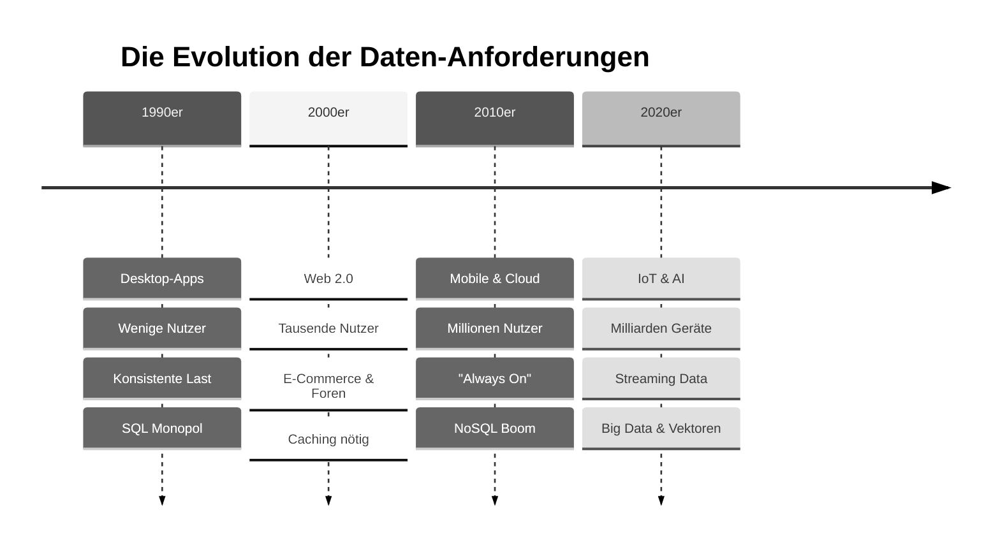
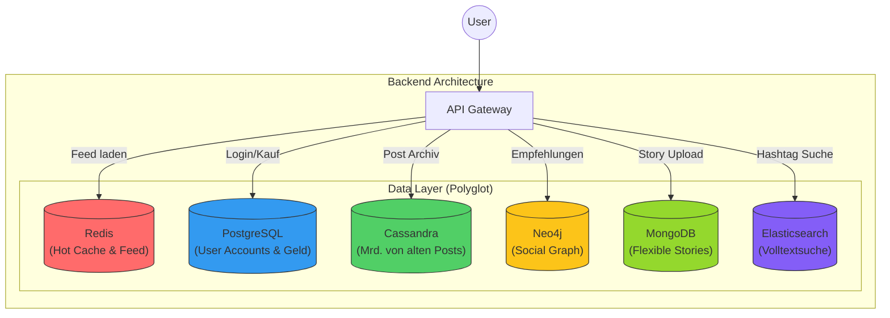
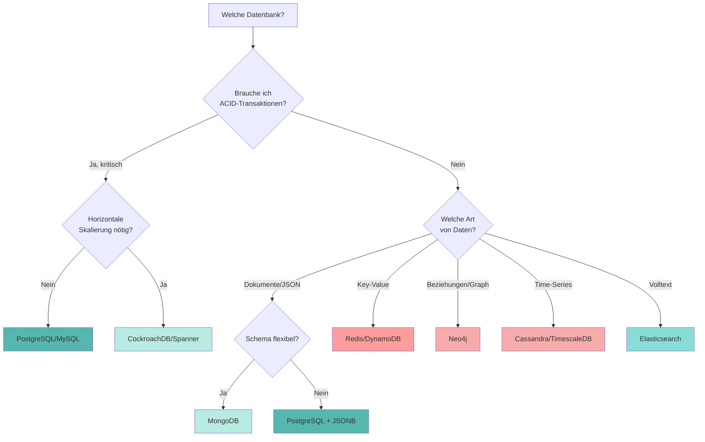

# Moderne Datenbanksysteme: Architektur & Alternativen

<div style="text-align: center; display: flex; flex-direction: column; align-items: center; margin-bottom: 2rem;">
    
    <figcaption style="margin-top: 0.5rem;"><i>"So viele Datenbanken, so wenig Zeit..."</i> <br> Quelle: <a href="https://blog.algomaster.io/p/sql-vs-nosql-7-key-differences">AlgoMaster</a></figcaption>
</div>

## Einleitung: Warum reicht SQL nicht mehr?

In den vorherigen Kapiteln haben wir **relationale Datenbanken (RDBMS)** am Beispiel von PostgreSQL gemeistert. Wir können Tabellen erstellen, komplexe `JOIN`s schreiben und Transaktionen sicherstellen. Relationale Datenbanken sind seit über 50 Jahren das Rückgrat der IT und werden es für Standard-Anwendungen auch bleiben.

**Aber:** Die Art und Weise, wie wir Software bauen und nutzen, hat sich radikal verändert.



Diese Evolution brachte Anforderungen mit sich, bei denen klassische RDBMS an ihre physikalischen Grenzen stoßen:

1.  **Massive Skalierung:** Wenn ein Server nicht mehr reicht, müssen wir auf 100 Server verteilen (**Horizontale Skalierung**). SQL ist primär für einen starken Server konzipiert (Vertikale Skalierung).
2.  **Unstrukturierte Daten:** Social Media Posts, JSON-Logs oder Sensordaten passen selten in starre Excel-artige Tabellen.
3.  **Geschwindigkeit (Latenz):** Ein Millisekunden-Wartezeit entscheidet heute über Kauf oder Abbruch. Festplatten sind oft zu langsam.
4.  **Vernetzung:** In sozialen Netzen ist die *Beziehung* zwischen Daten wichtiger als der Datensatz selbst.

Daraus entstand die Bewegung der **NoSQL** ("Not Only SQL") und **NewSQL** Datenbanken.

???+ warning "Wichtiger Hinweis"
    Dieses Kapitel ersetzt **nicht** dein SQL-Wissen! Ca. **80% aller Business-Anwendungen** (CRM, ERP, Buchhaltung) laufen weiterhin perfekt auf PostgreSQL oder MySQL. Die hier vorgestellten Systeme sind **Spezialwerkzeuge** für Probleme, die SQL nicht effizient lösen kann.

---

## Das Gedankenexperiment: Instagram auf PostgreSQL?

Um die Grenzen zu verstehen, stellen wir uns folgende Frage: 

> Könnten wir Instagram nur mit PostgreSQL bauen?

Schauen wir uns dazu an, was **Instagram** täglich leisten muss:

**Die Last-Anforderungen:**

  * 2+ Milliarden Nutzer
  * 95 Millionen Posts pro Tag
  * Feed-Ladezeit muss **\< 100ms** sein.

### Die Probleme

???+ info "Problem 1: Der Feed (Zu viele Joins)"

    Dein Feed besteht aus den Posts aller Leute, denen du folgst.

    ```sql
    -- Der naive SQL-Ansatz
    SELECT posts.*
    FROM posts
    JOIN followers ON posts.user_id = followers.following_id
    WHERE followers.follower_id = :deine_id
    ORDER BY posts.created_at DESC
    LIMIT 20;
    ```

    **Das Problem:**
    Wenn du 500 Leuten folgst und diese aktiv sind, muss die Datenbank bei *jedem einzelnen Aufruf* Millionen von Zeilen scannen, joinen und sortieren. Bei Milliarden Nutzern führt das zum **Systemkollaps**. Die Antwortzeit läge bei Sekunden, nicht Millisekunden.

???+ info "Problem 2: Die Story-Vielfalt (Starres Schema)"

    Stories können Fotos, Videos, Umfragen, Musik oder Countdowns enthalten.

    ```sql
    -- Der Versuch in SQL
    CREATE TABLE stories (
        id SERIAL PRIMARY KEY,
        type VARCHAR(50),
        image_url VARCHAR(255),
        poll_question TEXT,    -- Nur für Umfragen
        music_track_id INT,    -- Nur für Musik
        countdown_end TIMESTAMP -- Nur für Countdowns
        -- ...und 50 weitere Spalten, die meistens LEER (NULL) sind
    );
    ```

    **Das Problem:**
    Dies nennt man "Sparse Data" (dünn besetzte Daten). Die Tabelle wird riesig, voller `NULL`-Werte und unflexibel. Ein neues Feature (z.B. "Quiz-Sticker") erfordert ein teures `ALTER TABLE`, das bei großen Datenmengen die Datenbank stundenlang blockieren kann.

???+ info "Problem 3: "Freunde von Freunden" (Graph-Traversierung)"

    Die Funktion "Leute, die du kennen könntest" sucht Verbindungen über mehrere Ecken.

    **Das Problem:**
    In SQL erfordert jeder "Hop" (Freund -\> dessen Freund -\> dessen Freund) einen `JOIN`. Ein Join über 3-4 Ebenen mit Millionen Nutzern ist mathematisch so aufwendig, dass die Datenbank "explodiert" (exponentielle Komplexität).

---

## Die Lösung: Polyglot Persistence

Instagram (wie fast alle Großsysteme) nutzt **nicht eine** Datenbank, sondern viele. Jede für ihren **optimalen Zweck**. Das nennt man **Polyglot Persistence**.



Schauen wir uns an, wie diese "Spezialisten" im Detail funktionieren.

???+ warning "Aufbau Instagram"
    Der genaue Aufbau von Instagram kann nicht exakt beschrieben werden. In diesem Kapitel werden Beispiele gezeigt, wie es funktionieren könnte und was mögliche Softwaretools wären.

---

## Die NoSQL-Alternativen im Detail


**NoSQL** steht für "Not Only SQL" – nicht als Ersatz, sondern als **Ergänzung** zu relationalen Datenbanken. NoSQL-Datenbanken verzichten auf starre Schemas und ACID-Garantien, um **Flexibilität und Skalierbarkeit** zu gewinnen.

In diesem Abschnitt schauen wir uns die verschiedenen **NoSQL-Datenbanksysteme** im Detail an.

| Datenbank         | Datenmodell       | NoSQL? | In-Memory | ACID              | Skalierung       | Spezialrolle    |
| ----------------- | ----------------- | ------ | --------- | ----------------- | ---------------- | --------------- |
| **PostgreSQL**    | Relational + JSON | ❌      | ❌         | ✅                 | Vertikal + Citus | SQL, OLTP       |
| **Redis**         | Key-Value         | ✅      | ✅         | ❌ (eingeschränkt) | Horizontal       | Cache, Sessions |
| **Cassandra**     | Wide-Column       | ✅      | ❌         | ❌                 | ✅ horizontal     | Big Data, IoT   |
| **Neo4j**         | Graph             | ✅      | ❌         | ✅                 | Eingeschränkt    | Beziehungen     |
| **Elasticsearch** | Search Engine     | ✅      | ❌         | ❌                 | ✅                | Volltext, Logs  |
| **MongoDB**       | Document          | ✅      | ❌         | ✅ (ab v4)         | ✅                | JSON-APIs       |

### Document Stores (z.B. MongoDB)

???+ defi "Konzept: Document Stores"
    Daten werden nicht in Zeilen/Spalten, sondern als **Dokumente (meist JSON/BSON)** gespeichert. Ähnliche Dokumente liegen in einer *Collection*.

<div style="text-align: center; display: flex; flex-direction: column; align-items: center; margin-bottom: 2rem;">
    
    <figcaption>Quelle: <a href="https://www.geeksforgeeks.org/mongodb/mongodb-tutorial/">GeeksforGeeks</a></figcaption>
</div>

Warum JSON? Weil es dem Objektmodell im Code (JavaScript, Python) entspricht und **schema-frei** ist. Wir können einfach speichern, was da ist.

???+ example "Der Instagram-Use-Case"

    Stories & komplexe Metadaten

    ```javascript
    // Story Typ A: Einfaches Foto
    {
    "_id": "story_1",
    "type": "photo",
    "url": "img.jpg",
    "filters": ["sepia", "vignette"]
    }

    // Story Typ B: Umfrage (Völlig andere Struktur!)
    {
    "_id": "story_2",
    "type": "poll",
    "question": "Pizza oder Pasta?",
    "options": [
        {"text": "Pizza", "votes": 42},
        {"text": "Pasta", "votes": 12}
    ],
    "sticker_position": {"x": 100, "y": 200}
    }
    ```


---

### Key-Value Stores (z.B. Redis)

???+ defi "Konzept: Key-Value Stores"
    Eine riesige, extrem schnelle `HashMap` oder `Dictionary`. Daten liegen **im Arbeitsspeicher (RAM)** (In-Memory), nicht auf der Festplatte.

Statt den Feed jedes Mal neu zu berechnen, wird er *beim Posten* vorberechnet und in Redis abgelegt. Das Lesen ist dann nur noch ein direkter Zugriff. Die Vorteile liegen dabei auf der Hand: 

- **Speed:** Zugriffe im RAM sind ca. 100.000x schneller als auf Festplatte.
- **Einfachheit:** Nur `SET` und `GET`.
- **Vergänglichkeit:** Ideal für Daten, die man verlieren *darf* (Caches) oder die kurzlebig sind (Sessions).

???+ example "Der Instagram-Use-Case"

    Der Feed-Cache & Sessions

    ```python
    # Redis speichert einfache Strings oder Listen
    # Key: "feed:user_123" -> Value: Liste von Post-IDs

    # Ladezeit: 0.5 Millisekunden (da im RAM)
    redis.get("feed:user_123") 
    # Output: [9955, 9954, 9920, ...]
    ```

---

### Wide-Column Stores (z.B. Cassandra)

???+ defi "Konzept: Wide-Column Stores"
    Optimiert für **massive Schreiblasten** und **Verteilung** auf tausende Server. Es ähnelt einer Map, die in zwei Dimensionen partitioniert ist.

PostgreSQL würde bei Terabytes an Daten pro Tag langsam werden, besonders beim Schreiben. Cassandra ist gebaut, um "immer verfügbar" zu sein und linear zu skalieren (mehr Server = mehr Leistung). Vorteile sind: 

- **Write-Path:** Cassandra schreibt extrem schnell, weil es Daten sequenziell anhängt (wie ein Logfile), statt komplexe B-Trees zu sortieren.
- **Skalierung:** Wenn der Platz knapp wird, fügt man einfach Node Nr. 501 hinzu. Cassandra verteilt die Daten automatisch um.


???+ example "Der Instagram-Use-Case"
    Das Archiv aller 95 Mio. täglichen Posts.


???+ warning "Merksatz"
    Cassandra ist das "Schwarze Loch" für Daten - es schluckt alles extrem schnell weg, erlaubt aber nur sehr spezifische Abfragen (keine komplexen Joins oder Filter).

---

### Graph-Datenbanken (z.B. Neo4j)

???+ defi "Konzept: Graph-Datenbanken"
    Speichert **Knoten** (Entities) und **Kanten** (Beziehungen) als native Struktur.

In Neo4j ist die *Beziehung* genauso wichtig wie der Datensatz. Das Durchwandern des Graphen ist hocheffizient.


???+ example "Der Instagram-Use-Case"
    Social Discovery ("Wem folgt wer?").

    "Finde Freunde von Freunden, die ich noch nicht kenne."

    ```cypher
    MATCH (ich:User {name: "Max"})-[:FOLGT]->(freund)-[:FOLGT]->(vorschlag)
    WHERE NOT (ich)-[:FOLGT]->(vorschlag)
    RETURN vorschlag.name, COUNT(freund) AS gemeinsame_freunde
    ORDER BY gemeinsame_freunde DESC;
    ```

    In SQL wäre dies ein Performance-Albtraum. In Neo4j ist es eine Standard-Operation im Millisekunden-Bereich.

---

### Search Engines (z.B. Elasticsearch)

???+ defi "Konzept: Search Engines"
    Ein **Invertierter Index** (wie das Stichwortverzeichnis am Ende eines Buches).

SQL `LIKE '%urlaub%'` muss jeden Text scannen (Full Table Scan). Elasticsearch weiß sofort, in welchen Dokumenten das Wort "Urlaub" vorkommt. Vorteile sind: 
- Fuzzy Search (Findet "Appple" trotz Tippfehler)
- Relevanz-Ranking (Beste Treffer zuerst, nicht neueste)
- Aggregationen (Wie viele Posts gab es pro Tag in Berlin?)

???+ example "Der Instagram-Use-Case"
    Suche nach `#hashtags` oder Texten.


---

## Das CAP-Theorem: Warum man nicht alles haben kann

Wenn wir das sichere Ufer von PostgreSQL (Einzel-Server) verlassen und in verteilte Systeme (Cloud/Cluster) gehen, trifft uns das **CAP-Theorem**.

Es besagt, dass ein verteiltes System im Falle eines Netzwerkfehlers (**P**artition) nur eines von zwei Dingen garantieren kann:

1.  **C (Consistency - Konsistenz):** Alle sehen *sofort* dieselben Daten. Wenn ein Knoten ausfällt, wird das System lieber unbenutzbar (Error), als alte Daten zu zeigen.

      * *Beispiel:* Banküberweisung. (Lieber Abbruch als falscher Kontostand).
      * *Systeme:* Traditionelle RDBMS, MongoDB (Standard-Config).

2.  **A (Availability - Verfügbarkeit):** Das System antwortet *immer*, auch wenn manche Daten vielleicht ein paar Sekunden alt sind (**Eventual Consistency**).

      * *Beispiel:* Instagram Likes. Es ist egal, ob ich 1000 oder 1001 Likes sehe, Hauptsache die App lädt.
      * *Systeme:* Cassandra, DynamoDB, Couchbase.

???+ info "Entscheidung"
    Muss deine App immer funktionieren (Amazon Warenkorb) oder müssen die Daten immer 100% korrekt sein (Bank)?





---


## Zusammenfassung 📌

- **PostgreSQL ist der "Allrounder":** Starte fast immer hiermit. Dank JSONB-Spalten kann Postgres auch ein bisschen NoSQL.
- **Redis ist der Turbo:** Nutze es als Cache neben deiner Haupt-DB, um die Lesegeschwindigkeit zu erhöhen.
- **Spezialisten für Spezialprobleme:** Greife erst zu Mongo, Cassandra oder Neo4j, wenn du ein Problem hast, das SQL nicht (oder nur schlecht) lösen kann.
- **Polyglot Persistence:** Moderne Architekturen nutzen oft SQL für die wichtigen Stammdaten und NoSQL für spezifische Features (Suche, Cache, Logs).