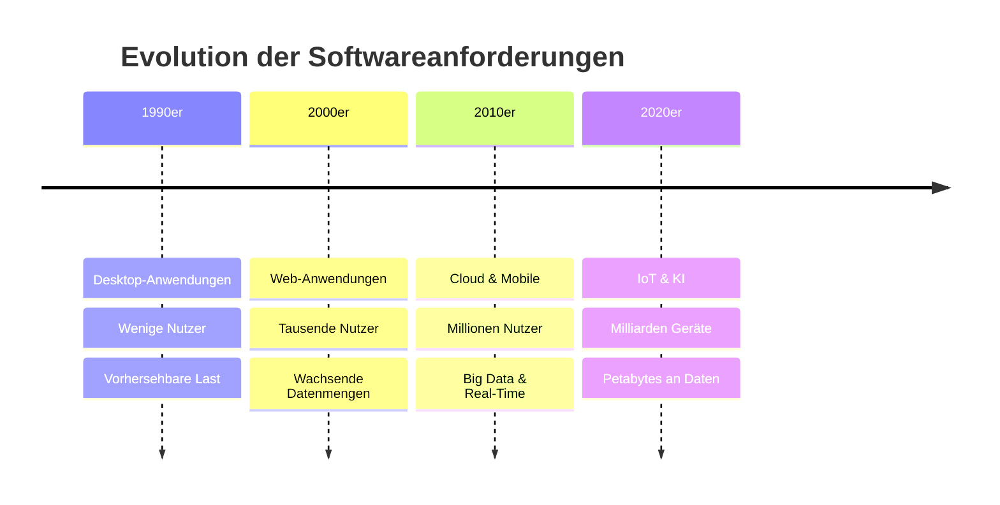
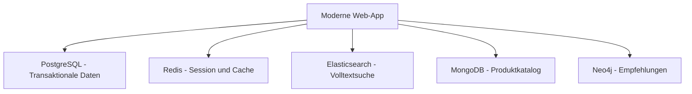
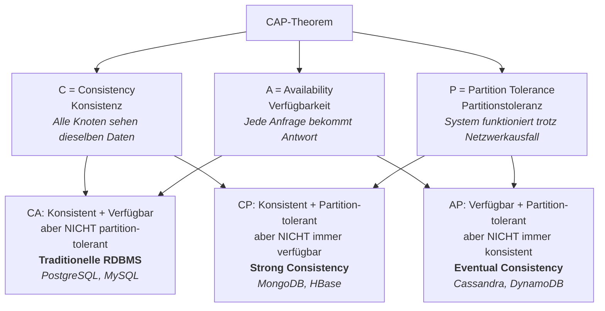
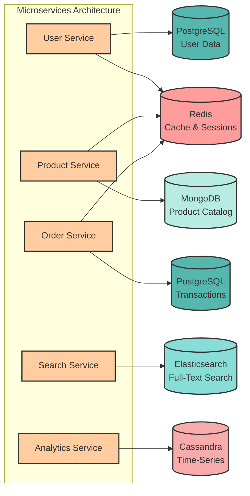
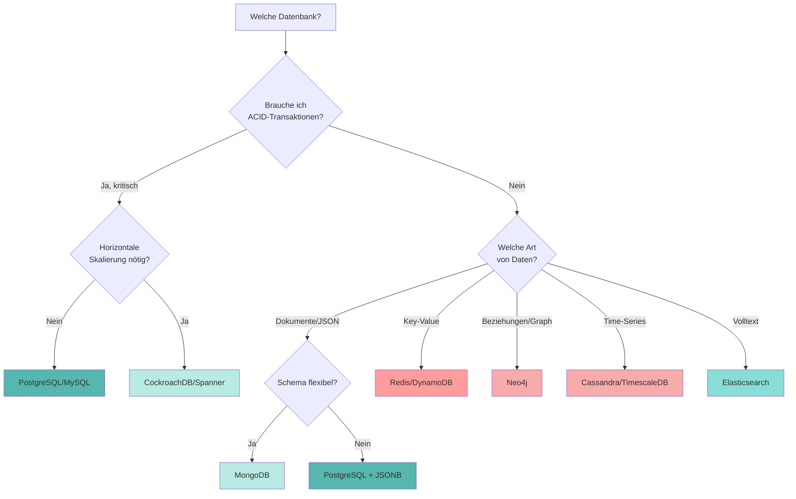

# Moderne Datenbanksysteme: Architektur & Alternativen

<div style="text-align: center; display: flex; flex-direction: column; align-items: center; margin-bottom: 2rem;">
    
    <figcaption style="margin-top: 0.5rem;"><i>"So viele Datenbanken, so wenig Zeit..."</i></figcaption>
</div>

## Einleitung: Warum gibt es so viele Datenbanksysteme?

In den vorherigen Kapiteln haben wir **relationale Datenbanken** mit PostgreSQL kennengelernt. Du kannst jetzt Tabellen erstellen, Daten abfragen und komplexe Beziehungen modellieren. Relationale Datenbanken sind seit über 50 Jahren der Standard und werden es auch bleiben.

**Aber:** In den letzten 20 Jahren hat sich die **Art und Weise, wie Software funktioniert**, dramatisch verändert:



Diese Veränderungen haben zu **neuen Anforderungen** geführt, die relationale Datenbanken allein nicht immer optimal erfüllen können:

- **Horizontale Skalierung** – Nicht nur stärkere Server (vertikal), sondern viele Server (horizontal)
- **Flexible Schemas** – Datenstrukturen, die sich schnell ändern (ohne ALTER TABLE)
- **Massive Schreiblasten** – IoT-Sensoren schreiben Millionen Werte pro Sekunde
- **Sub-Millisekunden Latenz** – Echtzeit-Anwendungen brauchen sofortige Antworten
- **Unstrukturierte Daten** – JSON, Logs, Social Media Posts passen nicht in starre Tabellen
- **Komplexe Beziehungen** – Soziale Netzwerke mit Milliarden Verbindungen

Deshalb entstanden **alternative Datenbanksysteme**, die für spezifische Use Cases optimiert sind.

???+ warning "Wichtiger Hinweis"
    Dieses Kapitel gibt einen **Überblick** über moderne Datenbanksysteme. Es ersetzt **nicht** die Kenntnis relationaler Datenbanken! Die meisten Systeme (ca. 80%) laufen noch immer auf SQL-Datenbanken. Die hier vorgestellten Alternativen sind **Ergänzungen** für spezielle Anforderungen.

---

## Die Database Landscape

Moderne Anwendungen nutzen oft **mehrere Datenbanksysteme gleichzeitig** (Polyglot Persistence):



Jede Datenbank erfüllt einen **spezifischen Zweck**. Schauen wir uns die verschiedenen Typen an!

---

## NoSQL-Datenbanken

**NoSQL** steht für "Not Only SQL" – nicht als Ersatz, sondern als **Ergänzung** zu relationalen Datenbanken. NoSQL-Datenbanken verzichten auf starre Schemas und ACID-Garantien, um **Flexibilität und Skalierbarkeit** zu gewinnen.

### Document Stores (MongoDB, CouchDB)

Document Stores speichern Daten als **JSON-ähnliche Dokumente**. Jedes Dokument kann eine andere Struktur haben.

???+ example "Praktisches Beispiel: E-Commerce Produktkatalog"

    **Problem:** In einem Online-Shop haben verschiedene Produkte völlig unterschiedliche Eigenschaften:

    - Ein **Laptop** hat: Prozessor, RAM, Bildschirmgröße, Gewicht
    - Ein **T-Shirt** hat: Größe, Farbe, Material, Passform
    - Ein **Buch** hat: Autor, ISBN, Seitenzahl, Verlag

    In PostgreSQL müssten wir entweder:

    1. **Eine riesige Tabelle** mit allen möglichen Spalten (viele bleiben NULL)
    2. **Mehrere Tabellen** (komplizierte JOINs)
    3. **JSONB-Spalten** (verlieren wir Typsicherheit)

    **Mit MongoDB:**

    ```javascript
    // Produkt 1: Laptop (unterschiedliche Struktur)
    {
      "_id": "prod_001",
      "kategorie": "Elektronik",
      "name": "ThinkPad X1 Carbon",
      "preis": 1299.99,
      "lagerbestand": 15,
      "specs": {
        "prozessor": "Intel i7-1365U",
        "ram_gb": 16,
        "ssd_gb": 512,
        "bildschirm_zoll": 14,
        "gewicht_kg": 1.12,
        "anschluesse": ["USB-C", "HDMI", "Thunderbolt 4"]
      }
    }

    // Produkt 2: T-Shirt (völlig andere Struktur - kein Problem!)
    {
      "_id": "prod_002",
      "kategorie": "Kleidung",
      "name": "Bio-Baumwolle T-Shirt",
      "preis": 29.99,
      "lagerbestand": 120,
      "varianten": [
        {"groesse": "S", "farbe": "Schwarz", "bestand": 30},
        {"groesse": "M", "farbe": "Schwarz", "bestand": 45},
        {"groesse": "L", "farbe": "Weiß", "bestand": 45}
      ],
      "material": "100% Bio-Baumwolle",
      "pflegehinweise": ["Maschinenwäsche 30°", "Nicht bleichen"]
    }

    // Produkt 3: Buch (wieder anders)
    {
      "_id": "prod_003",
      "kategorie": "Bücher",
      "name": "Clean Code",
      "preis": 39.99,
      "lagerbestand": 8,
      "autor": "Robert C. Martin",
      "isbn": "978-0132350884",
      "seiten": 464,
      "verlag": "Prentice Hall",
      "erscheinungsjahr": 2008
    }
    ```

    **Abfragen in MongoDB:**

    ```javascript
    // Alle Laptops mit mindestens 16GB RAM
    db.produkte.find({
      "kategorie": "Elektronik",
      "specs.ram_gb": { $gte: 16 }
    })

    // Alle T-Shirts in Größe M
    db.produkte.find({
      "kategorie": "Kleidung",
      "varianten": {
        $elemMatch: { "groesse": "M" }
      }
    })

    // Volltextsuche über alle Produkte
    db.produkte.find({
      $text: { $search: "Baumwolle Bio" }
    })
    ```

**Vergleich: PostgreSQL vs MongoDB**

<div style="text-align:center; max-width:900px; margin:16px auto;">
<table role="table"
       style="width:100%; border-collapse:separate; border-spacing:0; border:1px solid #cfd8e3; border-radius:10px; overflow:hidden; font-family:system-ui,sans-serif;">
    <thead>
    <tr style="background:#009485; color:#fff;">
        <th style="text-align:left; padding:12px 14px; font-weight:700;">Eigenschaft</th>
        <th style="text-align:left; padding:12px 14px; font-weight:700;">PostgreSQL</th>
        <th style="text-align:left; padding:12px 14px; font-weight:700;">MongoDB</th>
    </tr>
    </thead>
    <tbody>
    <tr>
        <td style="background:#00948511; padding:10px 14px;"><strong>Schema</strong></td>
        <td style="padding:10px 14px;">Starr, muss definiert werden</td>
        <td style="padding:10px 14px;">Flexibel, jedes Dokument anders</td>
    </tr>
    <tr>
        <td style="background:#00948511; padding:10px 14px;"><strong>Datenformat</strong></td>
        <td style="padding:10px 14px;">Tabellen mit Zeilen & Spalten</td>
        <td style="padding:10px 14px;">JSON-Dokumente</td>
    </tr>
    <tr>
        <td style="background:#00948511; padding:10px 14px;"><strong>Beziehungen</strong></td>
        <td style="padding:10px 14px;">JOINs (stark optimiert)</td>
        <td style="padding:10px 14px;">Embedded Docs oder Referenzen</td>
    </tr>
    <tr>
        <td style="background:#00948511; padding:10px 14px;"><strong>Transaktionen</strong></td>
        <td style="padding:10px 14px;">Volle ACID-Garantien</td>
        <td style="padding:10px 14px;">Eingeschränkt (ab v4.0 besser)</td>
    </tr>
    <tr>
        <td style="background:#00948511; padding:10px 14px;"><strong>Skalierung</strong></td>
        <td style="padding:10px 14px;">Vertikal (größere Server)</td>
        <td style="padding:10px 14px;">Horizontal (viele Server)</td>
    </tr>
    <tr>
        <td style="background:#00948511; padding:10px 14px;"><strong>Best für</strong></td>
        <td style="padding:10px 14px;">Strukturierte Geschäftsdaten</td>
        <td style="padding:10px 14px;">Flexible, sich ändernde Daten</td>
    </tr>
    </tbody>
</table>
</div>

### Key-Value Stores (Redis, DynamoDB)

Key-Value Stores sind die **einfachsten** NoSQL-Datenbanken: Du speicherst einen Wert unter einem Schlüssel – wie ein riesiges Dictionary/HashMap.

???+ example "Praktisches Beispiel: Session-Management & Caching"

    **Problem:** Eine Web-App muss:

    - **Session-Daten** speichern (Benutzer eingeloggt? Warenkorb-Inhalt?)
    - **Häufig abgerufene Daten** cachen (Produktlisten, Benutzerprofil)
    - **Extrem schnell** antworten (< 1ms)

    PostgreSQL wäre zu langsam (Disk I/O) und Overkill für temporäre Daten.

    **Mit Redis (In-Memory Key-Value Store):**

    ```python
    import redis

    # Verbindung zu Redis
    r = redis.Redis(host='localhost', port=6379)

    # 1. Session speichern (String)
    r.set('session:user_12345', 'logged_in', ex=3600)  # Verfällt nach 1h

    # 2. Warenkorb (Hash)
    r.hset('cart:user_12345', mapping={
        'prod_001': '2',  # 2x Laptop
        'prod_002': '1'   # 1x T-Shirt
    })

    # 3. Produktliste cachen (JSON)
    r.setex(
        'product_list:elektronik',
        300,  # 5 Minuten Cache
        '{"products": [...], "count": 42}'
    )

    # 4. Beliebteste Produkte (Sorted Set - automatisch sortiert)
    r.zadd('trending_products', {
        'prod_001': 156,  # 156 Views
        'prod_003': 89,   # 89 Views
        'prod_002': 234   # 234 Views
    })

    # Top 3 abrufen (automatisch sortiert!)
    top_3 = r.zrevrange('trending_products', 0, 2, withscores=True)
    # Ergebnis: [('prod_002', 234), ('prod_001', 156), ('prod_003', 89)]

    # 5. Rate Limiting (verhindert Spam)
    def is_rate_limited(user_id):
        key = f'rate_limit:{user_id}'
        requests = r.incr(key)  # Zähler erhöhen
        if requests == 1:
            r.expire(key, 60)  # Nach 60s zurücksetzen
        return requests > 100  # Max 100 Requests/Minute
    ```

    **Performance:**

    - Redis: ~0.1ms Antwortzeit (im RAM!)
    - PostgreSQL: ~5-50ms (Disk I/O + Query Processing)

    **50-500x schneller** für einfache Zugriffe!

**Typische Anwendungsfälle:**

<div style="text-align:center; max-width:700px; margin:16px auto;">
<table role="table"
       style="width:100%; border-collapse:separate; border-spacing:0; border:1px solid #cfd8e3; border-radius:10px; overflow:hidden; font-family:system-ui,sans-serif;">
    <thead>
    <tr style="background:#009485; color:#fff;">
        <th style="text-align:left; padding:12px 14px; font-weight:700;">Use Case</th>
        <th style="text-align:left; padding:12px 14px; font-weight:700;">Warum Key-Value?</th>
    </tr>
    </thead>
    <tbody>
    <tr>
        <td style="padding:10px 14px;">Session Management</td>
        <td style="padding:10px 14px;">Temporär, extrem schnell</td>
    </tr>
    <tr>
        <td style="padding:10px 14px;">Caching</td>
        <td style="padding:10px 14px;">Häufige Abfragen beschleunigen</td>
    </tr>
    <tr>
        <td style="padding:10px 14px;">Real-Time Analytics</td>
        <td style="padding:10px 14px;">Zähler, Leaderboards</td>
    </tr>
    <tr>
        <td style="padding:10px 14px;">Message Queues</td>
        <td style="padding:10px 14px;">Pub/Sub für Microservices</td>
    </tr>
    <tr>
        <td style="padding:10px 14px;">Rate Limiting</td>
        <td style="padding:10px 14px;">API-Anfragen limitieren</td>
    </tr>
    </tbody>
</table>
</div>

### Column-Family Stores (Cassandra, HBase)

Column-Family Stores speichern Daten **spaltenorientiert** statt zeilenorientiert. Ideal für **massive Schreiblasten** und **Time-Series Data**.

???+ example "Praktisches Beispiel: IoT Sensor-Daten"

    **Problem:** Eine Smart Factory hat:

    - **10.000 Sensoren** (Temperatur, Druck, Vibration, Energieverbrauch)
    - Jeder Sensor schreibt **alle 10 Sekunden** einen Wert
    - **= 1 Million Datenpunkte pro Sekunde**
    - Daten müssen **10 Jahre** gespeichert werden

    PostgreSQL würde hier **zusammenbrechen**:
    - Zu viele einzelne Writes
    - Gigantische Tabelle (Milliarden Zeilen)
    - Langsame Abfragen über große Zeiträume

    **Mit Apache Cassandra:**

    Cassandra verteilt Daten automatisch auf viele Server (Cluster) und skaliert horizontal.

    ```cql
    -- Tabelle für Sensor-Daten (CQL - ähnlich zu SQL)
    CREATE TABLE sensor_messwerte (
        sensor_id TEXT,
        jahr INT,
        monat INT,
        timestamp TIMESTAMP,
        temperatur DOUBLE,
        druck DOUBLE,
        vibration DOUBLE,
        PRIMARY KEY ((sensor_id, jahr, monat), timestamp)
    ) WITH CLUSTERING ORDER BY (timestamp DESC);

    -- Daten einfügen (1 Million pro Sekunde kein Problem!)
    INSERT INTO sensor_messwerte (sensor_id, jahr, monat, timestamp, temperatur, druck, vibration)
    VALUES ('SENSOR_001', 2025, 1, '2025-01-15 14:23:10', 85.3, 1013.2, 0.05);

    -- Abfrage: Alle Werte für Sensor im Januar 2025
    SELECT * FROM sensor_messwerte
    WHERE sensor_id = 'SENSOR_001'
      AND jahr = 2025
      AND monat = 1
      AND timestamp > '2025-01-15 00:00:00'
      AND timestamp < '2025-01-15 23:59:59';

    -- Durchschnitt über einen Tag (aggregiert)
    SELECT sensor_id, AVG(temperatur) as avg_temp, AVG(druck) as avg_druck
    FROM sensor_messwerte
    WHERE sensor_id = 'SENSOR_001'
      AND jahr = 2025
      AND monat = 1
      AND timestamp >= '2025-01-15 00:00:00'
      AND timestamp < '2025-01-16 00:00:00';
    ```

    **Warum Cassandra hier besser ist:**

    ✅ **Horizontale Skalierung** – Einfach mehr Server hinzufügen
    ✅ **Optimiert für Schreib-Last** – Append-Only Log (keine Updates!)
    ✅ **Zeitbasierte Partitionierung** – Alte Daten auf separaten Servern
    ✅ **Keine Single Point of Failure** – Daten repliziert über Cluster
    ✅ **Kompression** – Spaltenorientierung = bessere Kompression

**Vergleich: Zeilenorientiert (PostgreSQL) vs. Spaltenorientiert (Cassandra)**

```
Zeilenorientiert (PostgreSQL):
┌─────────────┬───────────┬────────┬───────────┐
│ sensor_id   │ timestamp │ temp   │ druck     │
├─────────────┼───────────┼────────┼───────────┤
│ SENSOR_001  │ 14:23:10  │ 85.3   │ 1013.2    │ ← Zeile 1 zusammen gespeichert
│ SENSOR_002  │ 14:23:11  │ 82.1   │ 1012.8    │ ← Zeile 2 zusammen gespeichert
│ SENSOR_001  │ 14:23:20  │ 85.5   │ 1013.5    │ ← Zeile 3 zusammen gespeichert
└─────────────┴───────────┴────────┴───────────┘

Spaltenorientiert (Cassandra):
sensor_id:  [SENSOR_001, SENSOR_002, SENSOR_001, ...]  ← Alle IDs zusammen
timestamp:  [14:23:10, 14:23:11, 14:23:20, ...]        ← Alle Timestamps zusammen
temp:       [85.3, 82.1, 85.5, ...]                    ← Alle Temperaturen zusammen
druck:      [1013.2, 1012.8, 1013.5, ...]              ← Alle Druckwerte zusammen
```

**Vorteil:** Wenn du **nur Temperatur** abfragst, muss Cassandra nicht alle Spalten lesen!

---

## Graph-Datenbanken (Neo4j, Amazon Neptune)

Graph-Datenbanken speichern Daten als **Knoten (Nodes)** und **Beziehungen (Edges)**. Perfekt für **hochvernetzte Daten**.

???+ example "Praktisches Beispiel: Empfehlungssystem"

    **Problem:** Ein Social-Media-Netzwerk möchte:

    - "Leute, die du kennen könntest" vorschlagen
    - "Freunde von Freunden finden"
    - "Kürzesten Pfad zwischen zwei Personen" berechnen

    In PostgreSQL wäre das ein **Alptraum**:

    ```sql
    -- Freunde von Freunden (2 Ebenen) - noch machbar
    SELECT DISTINCT f2.freund_id
    FROM freunde f1
    JOIN freunde f2 ON f1.freund_id = f2.user_id
    WHERE f1.user_id = 12345
      AND f2.freund_id != 12345;

    -- Freunde von Freunden von Freunden (3 Ebenen) - wird langsam
    SELECT DISTINCT f3.freund_id
    FROM freunde f1
    JOIN freunde f2 ON f1.freund_id = f2.user_id
    JOIN freunde f3 ON f2.freund_id = f3.user_id
    WHERE f1.user_id = 12345
      AND f3.freund_id != 12345;

    -- 6 Ebenen? Unmöglich zu schreiben und ultralang!
    ```

    **Mit Neo4j (Graph Database):**

    ```cypher
    // Datenmodell erstellen
    CREATE (alice:Person {name: 'Alice', alter: 28})
    CREATE (bob:Person {name: 'Bob', alter: 32})
    CREATE (charlie:Person {name: 'Charlie', alter: 25})
    CREATE (diana:Person {name: 'Diana', alter: 30})
    CREATE (eve:Person {name: 'Eve', alter: 27})

    // Beziehungen (Edges)
    CREATE (alice)-[:KENNT {seit: 2020}]->(bob)
    CREATE (bob)-[:KENNT {seit: 2019}]->(charlie)
    CREATE (charlie)-[:KENNT {seit: 2021}]->(diana)
    CREATE (diana)-[:KENNT {seit: 2022}]->(eve)
    CREATE (alice)-[:INTERESSIERT_AN {thema: 'Datenbanken'}]->(bob)

    // Abfrage 1: Freunde von Alice
    MATCH (alice:Person {name: 'Alice'})-[:KENNT]->(freund)
    RETURN freund.name;
    // Ergebnis: Bob

    // Abfrage 2: Freunde von Freunden (2 Ebenen)
    MATCH (alice:Person {name: 'Alice'})-[:KENNT*2]->(empfehlung)
    WHERE alice <> empfehlung
    RETURN DISTINCT empfehlung.name;
    // Ergebnis: Charlie

    // Abfrage 3: Kürzester Pfad zwischen Alice und Eve
    MATCH path = shortestPath(
      (alice:Person {name: 'Alice'})-[:KENNT*]-(eve:Person {name: 'Eve'})
    )
    RETURN path, length(path);
    // Ergebnis: Alice → Bob → Charlie → Diana → Eve (4 Hops)

    // Abfrage 4: Alle Personen im Netzwerk bis 6 Ebenen entfernt
    MATCH (alice:Person {name: 'Alice'})-[:KENNT*1..6]->(person)
    RETURN DISTINCT person.name, length(path) as entfernung;

    // Abfrage 5: Gemeinsame Interessen finden
    MATCH (alice:Person {name: 'Alice'})-[:INTERESSIERT_AN]->(thema)<-[:INTERESSIERT_AN]-(andere)
    RETURN andere.name, thema;
    ```

    **Visualisierung:**

    ```
    (Alice)──KENNT──>(Bob)──KENNT──>(Charlie)──KENNT──>(Diana)──KENNT──>(Eve)
       │
       └──INTERESSIERT_AN──>[Datenbanken]<──INTERESSIERT_AN──(Bob)
    ```

**Warum Graph-Datenbanken hier brillieren:**

<div style="text-align:center; max-width:800px; margin:16px auto;">
<table role="table"
       style="width:100%; border-collapse:separate; border-spacing:0; border:1px solid #cfd8e3; border-radius:10px; overflow:hidden; font-family:system-ui,sans-serif;">
    <thead>
    <tr style="background:#009485; color:#fff;">
        <th style="text-align:left; padding:12px 14px; font-weight:700;">Aufgabe</th>
        <th style="text-align:left; padding:12px 14px; font-weight:700;">PostgreSQL</th>
        <th style="text-align:left; padding:12px 14px; font-weight:700;">Neo4j</th>
    </tr>
    </thead>
    <tbody>
    <tr>
        <td style="padding:10px 14px;">Freunde finden (1 Ebene)</td>
        <td style="padding:10px 14px;">✅ Schnell (1 JOIN)</td>
        <td style="padding:10px 14px;">✅ Schnell (direkte Kante)</td>
    </tr>
    <tr>
        <td style="padding:10px 14px;">Freunde von Freunden (2 Ebenen)</td>
        <td style="padding:10px 14px;">⚠️ Langsamer (2 JOINs)</td>
        <td style="padding:10px 14px;">✅ Schnell</td>
    </tr>
    <tr>
        <td style="padding:10px 14px;">Netzwerk-Tiefe 6</td>
        <td style="padding:10px 14px;">❌ Extrem langsam (6 JOINs!)</td>
        <td style="padding:10px 14px;">✅ Schnell (Index-free adjacency)</td>
    </tr>
    <tr>
        <td style="padding:10px 14px;">Kürzester Pfad</td>
        <td style="padding:10px 14px;">❌ Komplex zu programmieren</td>
        <td style="padding:10px 14px;">✅ Eingebauter Algorithmus</td>
    </tr>
    <tr>
        <td style="padding:10px 14px;">Community Detection</td>
        <td style="padding:10px 14px;">❌ Nicht möglich</td>
        <td style="padding:10px 14px;">✅ Graph-Algorithmen</td>
    </tr>
    </tbody>
</table>
</div>

**Weitere Anwendungsfälle:**

- **Betrugs-Erkennung** – Verdächtige Transaktionsmuster in Finanznetzwerken
- **Supply Chain** – Lieferketten-Abhängigkeiten visualisieren
- **Wissensgraphen** – Google Knowledge Graph, Wikipedia-Verknüpfungen
- **Netzwerk-Topologie** – IT-Infrastruktur, Abhängigkeiten zwischen Microservices

---

## In-Memory Datenbanken

In-Memory Datenbanken speichern **alle Daten im RAM** statt auf der Festplatte. Das macht sie **extrem schnell**, aber auch **teurer** (RAM kostet mehr als SSD).

### Redis (In-Memory Key-Value Store)

Wir haben Redis bereits bei Key-Value Stores kennengelernt. Redis ist **der** Standard für In-Memory Caching.

???+ example "Praktisches Beispiel: Performance-Optimierung"

    **Szenario:** Eine E-Commerce-Website lädt die Startseite:

    ```python
    # OHNE Redis - Jedes Mal PostgreSQL abfragen
    def get_homepage_data():
        # Dauert ~50ms pro Request!
        products = db.query("SELECT * FROM products WHERE featured = true LIMIT 20")
        categories = db.query("SELECT * FROM categories ORDER BY name")
        user_stats = db.query("SELECT COUNT(*) FROM users")
        return render_template('home.html',
                               products=products,
                               categories=categories,
                               stats=user_stats)

    # MIT Redis - Cache für 5 Minuten
    def get_homepage_data_cached():
        cache_key = 'homepage_data'

        # Versuche aus Cache zu laden (~0.1ms!)
        cached = redis.get(cache_key)
        if cached:
            return json.loads(cached)

        # Nur bei Cache-Miss: Datenbank abfragen (~50ms)
        products = db.query("SELECT * FROM products WHERE featured = true LIMIT 20")
        categories = db.query("SELECT * FROM categories ORDER BY name")
        user_stats = db.query("SELECT COUNT(*) FROM users")

        data = {
            'products': products,
            'categories': categories,
            'stats': user_stats
        }

        # In Cache speichern (5 Minuten)
        redis.setex(cache_key, 300, json.dumps(data))

        return data

    # Ergebnis:
    # - Erster Request: 50ms (PostgreSQL)
    # - Alle weiteren 5 Minuten: 0.1ms (Redis)
    # = 500x schneller! 🚀
    ```

### SAP HANA, MemSQL (In-Memory Databases)

Vollständige Datenbanksysteme, die **alles** im RAM halten. Werden in der Industrie für **Real-Time Analytics** eingesetzt.

**Use Cases:**

- **Echtzeit-Dashboards** – Live-Produktionsdaten (OEE, Ausschuss)
- **Fraud Detection** – Kreditkarten-Transaktionen in Echtzeit prüfen
- **Trading-Systeme** – Börsenkurse mit Sub-Millisekunden Latenz
- **IoT Analytics** – Millionen Sensor-Werte pro Sekunde analysieren

<div style="text-align:center; max-width:800px; margin:16px auto;">
<table role="table"
       style="width:100%; border-collapse:separate; border-spacing:0; border:1px solid #cfd8e3; border-radius:10px; overflow:hidden; font-family:system-ui,sans-serif;">
    <thead>
    <tr style="background:#009485; color:#fff;">
        <th style="text-align:left; padding:12px 14px; font-weight:700;">Eigenschaft</th>
        <th style="text-align:left; padding:12px 14px; font-weight:700;">Disk-basiert (PostgreSQL)</th>
        <th style="text-align:left; padding:12px 14px; font-weight:700;">In-Memory (Redis, HANA)</th>
    </tr>
    </thead>
    <tbody>
    <tr>
        <td style="background:#00948511; padding:10px 14px;"><strong>Latenz</strong></td>
        <td style="padding:10px 14px;">5-50ms</td>
        <td style="padding:10px 14px;">< 1ms</td>
    </tr>
    <tr>
        <td style="background:#00948511; padding:10px 14px;"><strong>Durchsatz</strong></td>
        <td style="padding:10px 14px;">Tausende Queries/s</td>
        <td style="padding:10px 14px;">Millionen Queries/s</td>
    </tr>
    <tr>
        <td style="background:#00948511; padding:10px 14px;"><strong>Kosten</strong></td>
        <td style="padding:10px 14px;">Günstig (SSD billig)</td>
        <td style="padding:10px 14px;">Teuer (RAM teuer)</td>
    </tr>
    <tr>
        <td style="background:#00948511; padding:10px 14px;"><strong>Persistenz</strong></td>
        <td style="padding:10px 14px;">Immer persistent</td>
        <td style="padding:10px 14px;">Optional (RDB/AOF)</td>
    </tr>
    <tr>
        <td style="background:#00948511; padding:10px 14px;"><strong>Kapazität</strong></td>
        <td style="padding:10px 14px;">Terabytes problemlos</td>
        <td style="padding:10px 14px;">Begrenzt durch RAM-Größe</td>
    </tr>
    </tbody>
</table>
</div>

---

## NewSQL: Das Beste aus beiden Welten

**NewSQL-Datenbanken** versuchen, die **Skalierbarkeit von NoSQL** mit den **ACID-Garantien von SQL** zu kombinieren.

**Beispiele:** CockroachDB, Google Spanner, VoltDB

???+ example "Praktisches Beispiel: Globale E-Commerce-Plattform"

    **Problem:** Ein Online-Shop wie Amazon hat:

    - Kunden weltweit (USA, Europa, Asien)
    - Millionen Transaktionen pro Sekunde
    - MUSS ACID-konform sein (Bestellungen dürfen nicht verloren gehen!)
    - Daten müssen nah beim Nutzer sein (Latenz)

    **Traditionelle Lösungen:**

    - **PostgreSQL:** ✅ ACID, ❌ Nicht horizontal skalierbar
    - **MongoDB:** ✅ Skalierbar, ❌ Schwache ACID-Garantien

    **Mit CockroachDB (NewSQL):**

    ```sql
    -- Sieht aus wie PostgreSQL!
    CREATE TABLE bestellungen (
        bestell_id UUID PRIMARY KEY DEFAULT gen_random_uuid(),
        kunde_id INT NOT NULL,
        produkt_id INT NOT NULL,
        menge INT NOT NULL,
        preis DECIMAL(10, 2) NOT NULL,
        erstellt_am TIMESTAMP DEFAULT now(),
        region TEXT  -- 'us-east', 'eu-west', 'asia-southeast'
    );

    -- Geo-Partitionierung (automatisch!)
    ALTER TABLE bestellungen
    PARTITION BY LIST (region) (
        PARTITION us VALUES IN ('us-east', 'us-west'),
        PARTITION eu VALUES IN ('eu-west', 'eu-north'),
        PARTITION asia VALUES IN ('asia-southeast')
    );

    -- Daten automatisch in der richtigen Region gespeichert
    INSERT INTO bestellungen (kunde_id, produkt_id, menge, preis, region)
    VALUES (12345, 999, 2, 49.99, 'eu-west');
    -- Diese Bestellung liegt physisch in Europa!

    -- Aber: Global konsistent!
    BEGIN;
        INSERT INTO bestellungen (...);
        UPDATE lagerbestand SET menge = menge - 2 WHERE produkt_id = 999;
    COMMIT;
    -- Entweder beide Operationen erfolgreich oder keine!
    ```

    **Vorteile:**

    ✅ **SQL-kompatibel** – Bestehende Tools/Apps funktionieren
    ✅ **Horizontal skalierbar** – Einfach mehr Server hinzufügen
    ✅ **ACID-Garantien** – Volle Transaktionssicherheit
    ✅ **Geo-Verteilung** – Daten nah beim Nutzer
    ✅ **Automatisches Failover** – Kein Single Point of Failure

---

## Cloud-Native & Serverless Datenbanken

Moderne Cloud-Anbieter bieten **vollständig verwaltete** Datenbanken an, die automatisch skalieren.

**Beispiele:**

- **AWS RDS** – Verwaltetes PostgreSQL/MySQL
- **Azure SQL Database** – SQL Server in der Cloud
- **Google Cloud SQL** – Verwaltetes PostgreSQL/MySQL
- **Amazon Aurora Serverless** – Serverless PostgreSQL/MySQL
- **Google Firestore** – Serverless NoSQL
- **MongoDB Atlas** – Verwaltetes MongoDB

???+ example "Praktisches Beispiel: Serverless E-Commerce Backend"

    **Traditionell:** Du musst Server mieten, PostgreSQL installieren, konfigurieren, warten...

    **Mit AWS Aurora Serverless:**

    ```python
    # Einfach Verbindung herstellen - AWS kümmert sich um alles!
    import psycopg2

    conn = psycopg2.connect(
        host='my-aurora-cluster.cluster-abc.eu-central-1.rds.amazonaws.com',
        database='shop_db',
        user='admin',
        password='...'
    )

    # Normale SQL-Queries
    cursor = conn.cursor()
    cursor.execute("SELECT * FROM produkte WHERE kategorie = %s", ('Elektronik',))
    ```

    **Was AWS automatisch macht:**

    ✅ **Auto-Scaling** – Bei hoher Last werden automatisch mehr Ressourcen bereitgestellt
    ✅ **Backups** – Täglich automatische Backups
    ✅ **High Availability** – Automatischer Failover bei Ausfällen
    ✅ **Patches** – Sicherheitsupdates ohne Downtime
    ✅ **Monitoring** – Dashboards für Performance-Metriken
    ✅ **Pay-per-Use** – Keine Kosten, wenn die DB nicht genutzt wird

**Vorteile Cloud-Native Databases:**

- **Keine Server-Verwaltung** – Focus on Code, not Infrastructure
- **Elastisch skalieren** – Von 0 auf Millionen Nutzer
- **Global verteilt** – Daten weltweit replizieren
- **99.99% Uptime** – SLAs garantiert

---

## Das CAP-Theorem: Warum man nicht alles haben kann

Das **CAP-Theorem** erklärt, warum es verschiedene Datenbanksysteme gibt. Es besagt:

**Du kannst maximal 2 von 3 Eigenschaften gleichzeitig haben:**



???+ example "Praktisches Beispiel: Bank-Überweisungen vs. Social Media Likes"

    **Szenario 1: Bank-Überweisung** 💰

    ```
    Alice überweist 100€ an Bob.
    ```

    **Anforderung:** **KONSISTENZ** ist kritisch!

    - Wenn Alice 100€ überweist, MUSS Bob exakt 100€ erhalten
    - Darf NIEMALS inkonsistent sein (Alice -100€, Bob +0€)
    - Lieber kurz **nicht verfügbar** als falsche Daten!

    **→ PostgreSQL (CA oder CP): Strong Consistency**

    ---

    **Szenario 2: Instagram Likes** ❤️

    ```
    1 Million Nutzer liken gleichzeitig ein Foto.
    ```

    **Anforderung:** **VERFÜGBARKEIT** ist kritisch!

    - JEDER Like muss sofort registriert werden (App darf nicht hängen)
    - OK, wenn der Counter kurzzeitig falsch ist (999.995 statt 1.000.000)
    - Nach ein paar Sekunden synchronisiert sich alles (**Eventual Consistency**)

    **→ Cassandra (AP): High Availability**

**Typische Trade-Offs:**

<div style="text-align:center; max-width:900px; margin:16px auto;">
<table role="table"
       style="width:100%; border-collapse:separate; border-spacing:0; border:1px solid #cfd8e3; border-radius:10px; overflow:hidden; font-family:system-ui,sans-serif;">
    <thead>
    <tr style="background:#009485; color:#fff;">
        <th style="text-align:left; padding:12px 14px; font-weight:700;">Datenbank</th>
        <th style="text-align:left; padding:12px 14px; font-weight:700;">Typ</th>
        <th style="text-align:left; padding:12px 14px; font-weight:700;">Trade-Off</th>
        <th style="text-align:left; padding:12px 14px; font-weight:700;">Best für</th>
    </tr>
    </thead>
    <tbody>
    <tr>
        <td style="padding:10px 14px;"><strong>PostgreSQL</strong></td>
        <td style="padding:10px 14px;">CA</td>
        <td style="padding:10px 14px;">Konsistenz + Verfügbarkeit<br/>(Keine Partitionstoleranz)</td>
        <td style="padding:10px 14px;">Finanz-Apps, ERP</td>
    </tr>
    <tr>
        <td style="padding:10px 14px;"><strong>MongoDB</strong></td>
        <td style="padding:10px 14px;">CP</td>
        <td style="padding:10px 14px;">Konsistenz + Partitionstoleranz<br/>(Bei Netzausfall nicht verfügbar)</td>
        <td style="padding:10px 14px;">Produktkataloge, CMS</td>
    </tr>
    <tr>
        <td style="padding:10px 14px;"><strong>Cassandra</strong></td>
        <td style="padding:10px 14px;">AP</td>
        <td style="padding:10px 14px;">Verfügbarkeit + Partitionstoleranz<br/>(Eventual Consistency)</td>
        <td style="padding:10px 14px;">IoT, Social Media, Logs</td>
    </tr>
    <tr>
        <td style="padding:10px 14px;"><strong>Redis</strong></td>
        <td style="padding:10px 14px;">CP</td>
        <td style="padding:10px 14px;">Konsistenz (mit Replikation)</td>
        <td style="padding:10px 14px;">Cache, Sessions</td>
    </tr>
    </tbody>
</table>
</div>

---

## Moderne Anforderungen: Was hat sich geändert?

Die Evolution moderner Software hat **neue Herausforderungen** geschaffen:

### 1. Massive Skalierung

**Früher (2000er):**
- Tausende Nutzer
- GB-große Datenbanken
- Vertikale Skalierung (größerer Server)

**Heute (2020er):**
- Milliarden Nutzer
- Petabyte-Datenbanken
- Horizontale Skalierung (viele Server)

**Lösung:** NoSQL (Cassandra, MongoDB), NewSQL (CockroachDB)

---

### 2. Real-Time & Low Latency

**Früher:**
- Batch-Verarbeitung über Nacht OK
- Sekunden Antwortzeit akzeptabel

**Heute:**
- Echtzeit-Dashboards
- Sub-Millisekunden Antworten

**Lösung:** In-Memory (Redis), Streaming (Kafka + ksqlDB)

---

### 3. Flexible Schemas

**Früher:**
- Schema ändert sich selten
- Alle Daten passen in Tabellen

**Heute:**
- Rapid Prototyping
- Unstrukturierte Daten (JSON, Logs)
- Externe APIs (unterschiedliche Formate)

**Lösung:** Document Stores (MongoDB), JSON in PostgreSQL

---

### 4. Polyglot Persistence

Moderne Apps nutzen **mehrere Datenbanken** gleichzeitig:



---

## Entscheidungshilfe: Welche Datenbank wofür?

Hier ist eine **praktische Entscheidungshilfe** für die Wahl der richtigen Datenbank:

### Nach Use Case

<div style="text-align:center; max-width:1000px; margin:16px auto;">
<table role="table"
       style="width:100%; border-collapse:separate; border-spacing:0; border:1px solid #cfd8e3; border-radius:10px; overflow:hidden; font-family:system-ui,sans-serif;">
    <thead>
    <tr style="background:#009485; color:#fff;">
        <th style="text-align:left; padding:12px 14px; font-weight:700;">Use Case</th>
        <th style="text-align:left; padding:12px 14px; font-weight:700;">Empfohlene Datenbank</th>
        <th style="text-align:left; padding:12px 14px; font-weight:700;">Warum?</th>
    </tr>
    </thead>
    <tbody>
    <tr>
        <td style="background:#00948511; padding:10px 14px;"><strong>E-Commerce (Bestellungen)</strong></td>
        <td style="padding:10px 14px;">PostgreSQL</td>
        <td style="padding:10px 14px;">ACID-Transaktionen, strukturierte Daten</td>
    </tr>
    <tr>
        <td style="background:#00948511; padding:10px 14px;"><strong>E-Commerce (Produktkatalog)</strong></td>
        <td style="padding:10px 14px;">MongoDB</td>
        <td style="padding:10px 14px;">Flexible Produkt-Attribute</td>
    </tr>
    <tr>
        <td style="background:#00948511; padding:10px 14px;"><strong>Caching / Sessions</strong></td>
        <td style="padding:10px 14px;">Redis</td>
        <td style="padding:10px 14px;">In-Memory, extrem schnell</td>
    </tr>
    <tr>
        <td style="background:#00948511; padding:10px 14px;"><strong>IoT Sensor-Daten</strong></td>
        <td style="padding:10px 14px;">Cassandra / TimescaleDB</td>
        <td style="padding:10px 14px;">Massive Schreiblasten, Time-Series</td>
    </tr>
    <tr>
        <td style="background:#00948511; padding:10px 14px;"><strong>Social Network</strong></td>
        <td style="padding:10px 14px;">Neo4j</td>
        <td style="padding:10px 14px;">Graph-Beziehungen</td>
    </tr>
    <tr>
        <td style="background:#00948511; padding:10px 14px;"><strong>Volltextsuche</strong></td>
        <td style="padding:10px 14px;">Elasticsearch</td>
        <td style="padding:10px 14px;">Optimiert für Text-Queries</td>
    </tr>
    <tr>
        <td style="background:#00948511; padding:10px 14px;"><strong>Analytics / Data Warehouse</strong></td>
        <td style="padding:10px 14px;">Snowflake / BigQuery</td>
        <td style="padding:10px 14px;">Column-Store, massive Datenmengen</td>
    </tr>
    <tr>
        <td style="background:#00948511; padding:10px 14px;"><strong>Mobile App Backend</strong></td>
        <td style="padding:10px 14px;">Firebase / Firestore</td>
        <td style="padding:10px 14px;">Serverless, Offline-Sync</td>
    </tr>
    <tr>
        <td style="background:#00948511; padding:10px 14px;"><strong>Logs & Monitoring</strong></td>
        <td style="padding:10px 14px;">Elasticsearch / Loki</td>
        <td style="padding:10px 14px;">Log-Aggregation, Suche</td>
    </tr>
    <tr>
        <td style="background:#00948511; padding:10px 14px;"><strong>Finanz-Transaktionen</strong></td>
        <td style="padding:10px 14px;">PostgreSQL / CockroachDB</td>
        <td style="padding:10px 14px;">ACID, Konsistenz kritisch</td>
    </tr>
    </tbody>
</table>
</div>

### Entscheidungsbaum



---

## Zusammenfassung

In diesem Kapitel haben wir gesehen, wie **moderne Anforderungen** zur Entwicklung **spezialisierter Datenbanksysteme** geführt haben:

**NoSQL-Datenbanken:**

- **Document Stores (MongoDB)** – Flexible Schemas für Produktkataloge
- **Key-Value Stores (Redis)** – Caching und Sessions mit Sub-Millisekunden Latenz
- **Column-Family (Cassandra)** – Massive IoT-Datenmengen skalierbar speichern

**Graph-Datenbanken:**

- **Neo4j** – Soziale Netzwerke und komplexe Beziehungen
- Kürzeste Pfade, Empfehlungen, Netzwerkanalyse

**In-Memory:**

- **Redis, SAP HANA** – Echtzeit-Performance für Analytics

**NewSQL:**

- **CockroachDB, Spanner** – SQL + NoSQL-Skalierung + ACID

**Cloud-Native:**

- **Aurora Serverless, Firestore** – Keine Server-Verwaltung

**CAP-Theorem:**

- Du kannst nicht alles haben: Konsistenz, Verfügbarkeit, Partitionstoleranz
- Wähle basierend auf deinen Anforderungen

**Moderne Apps nutzen Polyglot Persistence:**

- PostgreSQL für Transaktionen
- MongoDB für flexible Daten
- Redis für Caching
- Neo4j für Beziehungen
- Elasticsearch für Suche

---

## Abschließende Gedanken

**PostgreSQL und relationale Datenbanken bleiben der Standard** für die meisten Anwendungen. Aber wenn du:

- Milliarden Datenpunkte verarbeiten musst → Cassandra
- Hochvernetzte Daten hast → Neo4j
- Sub-Millisekunden Latenz brauchst → Redis
- Flexible Schemas willst → MongoDB
- Global skalieren musst → CockroachDB

**...dann weißt du jetzt, welche Alternativen es gibt!**

Die richtige Datenbank zu wählen ist wie das richtige Werkzeug für eine Aufgabe:

- Ein Hammer ist großartig für Nägel, aber schlecht für Schrauben
- PostgreSQL ist großartig für strukturierte Daten, aber nicht optimal für Graphen

**→ Polyglot Persistence ist die Zukunft!**

---

<div style="display: flex; justify-content: center; margin: 2rem 0;">
    
</div>

<div style="text-align: center; margin-top: 2rem;">
    <h3>Du hast jetzt einen Überblick über die moderne Datenbanklandschaft! 🎉</h3>
    <p><i>Nutze dieses Wissen, um für jeden Use Case die optimale Lösung zu wählen.</i></p>
</div>
