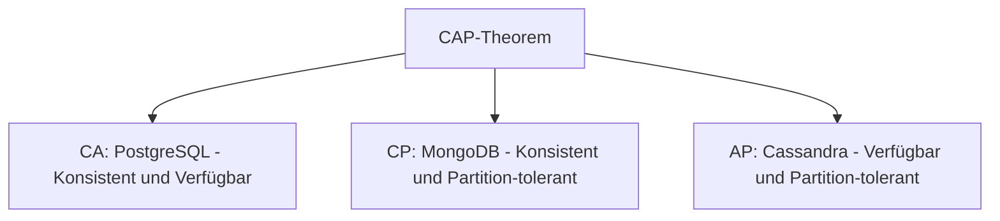
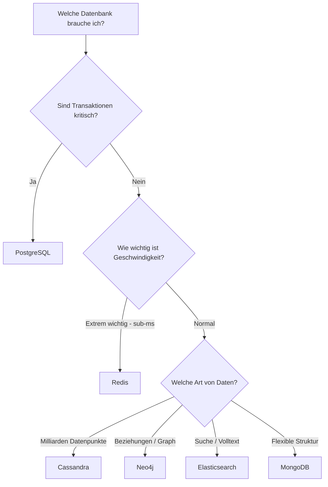

# Moderne Datenbanksysteme: Architektur & Alternativen

### Datenmenge-Verteilung bei Instagram

<table role="table"
       style="width:100%; border-collapse:separate; border-spacing:0; border:1px solid #cfd8e3; border-radius:10px; overflow:hidden; font-family:system-ui,sans-serif;">
    <thead>
    <tr style="background:#009485; color:#fff;">
        <th style="text-align:left; padding:12px 14px; font-weight:700;">Datenbank</th>
        <th style="text-align:left; padding:12px 14px; font-weight:700;">Was wird gespeichert?</th>
        <th style="text-align:left; padding:12px 14px; font-weight:700;">Datenmenge</th>
    </tr>
    </thead>
    <tbody>
    <tr>
        <td style="background:#00948511; padding:10px 14px;"><strong>PostgreSQL</strong></td>
        <td style="padding:10px 14px;">User-Accounts, Einstellungen</td>
        <td style="padding:10px 14px;">~1% (50 GB)</td>
    </tr>
    <tr>
        <td style="background:#00948511; padding:10px 14px;"><strong>Redis</strong></td>
        <td style="padding:10px 14px;">Feed-Cache, Sessions</td>
        <td style="padding:10px 14px;">~5% (200 GB im RAM)</td>
    </tr>
    <tr>
        <td style="background:#00948511; padding:10px 14px;"><strong>Cassandra</strong></td>
        <td style="padding:10px 14px;">Posts, Photos, Videos</td>
        <td style="padding:10px 14px;">~80% (100+ TB)</td>
    </tr>
    <tr>
        <td style="background:#00948511; padding:10px 14px;"><strong>Neo4j</strong></td>
        <td style="padding:10px 14px;">Follower-Beziehungen</td>
        <td style="padding:10px 14px;">~10% (10 TB)</td>
    </tr>
    <tr>
        <td style="background:#00948511; padding:10px 14px;"><strong>Elasticsearch</strong></td>
        <td style="padding:10px 14px;">Such-Index</td>
        <td style="padding:10px 14px;">~3% (5 TB)</td>
    </tr>
    <tr>
        <td style="background:#00948511; padding:10px 14px;"><strong>MongoDB</strong></td>
        <td style="padding:10px 14px;">Stories (temporär 24h)</td>
        <td style="padding:10px 14px;">~1% (500 GB)</td>
    </tr>
    </tbody>
</table>

---

## Das CAP-Theorem: Trade-Offs verstehen

Warum kann Instagram nicht **eine perfekte Datenbank** nutzen?

Das **CAP-Theorem** erklärt es:

**Du kannst nur 2 von 3 Eigenschaften haben:**

- **C (Consistency)** = Konsistenz – Alle sehen dieselben Daten
- **A (Availability)** = Verfügbarkeit – Jede Anfrage bekommt Antwort
- **P (Partition Tolerance)** = Partitionstoleranz – System funktioniert trotz Netzwerkausfall

### Praktisches Beispiel

**Szenario 1: User ändert sein Passwort**

→ **PostgreSQL (CA/CP):** MUSS konsistent sein!
- Wenn Passwort geändert wird, darf altes Passwort NICHT mehr funktionieren
- Lieber kurz nicht verfügbar als falsches Passwort akzeptieren

**Szenario 2: Du likest einen Post**

→ **Cassandra (AP):** Verfügbarkeit wichtiger als Konsistenz!
- Dein Like MUSS sofort registriert werden (App darf nicht hängen)
- OK, wenn Counter kurz falsch ist (999 statt 1000 Likes)
- Nach ein paar Sekunden synchronisiert sich alles

**Szenario 3: Story-Views**

→ **MongoDB (CP):** Bei Netzwerk-Problemen lieber temporär nicht verfügbar
- Story-Views müssen halbwegs akkurat sein
- Aber nicht so kritisch wie Passwörter

---

## Moderne Anforderungen: Was hat sich geändert?

### Früher (2000er): Facebook mit MySQL

- **Tausende** Nutzer
- **Gigabytes** an Daten
- **Vertikale Skalierung** – Größerer Server kaufen
- **Schema ändern** – Kein Problem, Downtime OK
- **Ein Server** reicht

### Heute (2020er): Instagram mit Polyglot Persistence

- **Milliarden** Nutzer
- **Petabytes** an Daten
- **Horizontale Skalierung** – Viele Server im Cluster
- **Schema ändern** – Unmöglich ohne Downtime → Flexible Datenbanken
- **Hunderte Server** weltweit verteilt
- **Sub-100ms Latenz** erwartet
- **Ausfallsicherheit** – Ein Server-Crash darf nicht alles lahmlegen

---

## Entscheidungshilfe: Welche Datenbank wofür?

### Nach Anforderung

<table role="table"
       style="width:100%; border-collapse:separate; border-spacing:0; border:1px solid #cfd8e3; border-radius:10px; overflow:hidden; font-family:system-ui,sans-serif;">
    <thead>
    <tr style="background:#009485; color:#fff;">
        <th style="text-align:left; padding:12px 14px; font-weight:700;">Anforderung</th>
        <th style="text-align:left; padding:12px 14px; font-weight:700;">Richtige Wahl</th>
        <th style="text-align:left; padding:12px 14px; font-weight:700;">Beispiel</th>
    </tr>
    </thead>
    <tbody>
    <tr>
        <td style="background:#00948511; padding:10px 14px;"><strong>ACID-Transaktionen kritisch</strong></td>
        <td style="padding:10px 14px;">PostgreSQL</td>
        <td style="padding:10px 14px;">Bank-Überweisungen, Login</td>
    </tr>
    <tr>
        <td style="background:#00948511; padding:10px 14px;"><strong>Sub-Millisekunden Latenz</strong></td>
        <td style="padding:10px 14px;">Redis</td>
        <td style="padding:10px 14px;">Feed-Cache, Sessions</td>
    </tr>
    <tr>
        <td style="background:#00948511; padding:10px 14px;"><strong>Milliarden Datenpunkte</strong></td>
        <td style="padding:10px 14px;">Cassandra</td>
        <td style="padding:10px 14px;">Posts, IoT-Sensordaten</td>
    </tr>
    <tr>
        <td style="background:#00948511; padding:10px 14px;"><strong>Hochvernetzte Daten</strong></td>
        <td style="padding:10px 14px;">Neo4j</td>
        <td style="padding:10px 14px;">Social Graph, Empfehlungen</td>
    </tr>
    <tr>
        <td style="background:#00948511; padding:10px 14px;"><strong>Volltextsuche</strong></td>
        <td style="padding:10px 14px;">Elasticsearch</td>
        <td style="padding:10px 14px;">Hashtag-Suche, Logs</td>
    </tr>
    <tr>
        <td style="background:#00948511; padding:10px 14px;"><strong>Flexible Schemas</strong></td>
        <td style="padding:10px 14px;">MongoDB</td>
        <td style="padding:10px 14px;">Stories, Produktkatalog</td>
    </tr>
    </tbody>
</table>

### Entscheidungsbaum

---

## Cloud-Native & Serverless

Moderne Cloud-Anbieter bieten **verwaltete Datenbanken**:

**Beispiele:**
- **AWS RDS** – Verwaltetes PostgreSQL/MySQL
- **Amazon DynamoDB** – Serverless NoSQL
- **Azure Cosmos DB** – Global verteilte Multi-Model DB
- **Google Cloud Spanner** – Global verteiltes SQL
- **MongoDB Atlas** – Verwaltetes MongoDB

**Vorteile:**

✅ **Keine Server-Verwaltung** – AWS kümmert sich um Updates, Backups
✅ **Auto-Scaling** – Automatisch mehr Ressourcen bei hoher Last
✅ **Global verteilt** – Daten nah beim Nutzer (Latenz minimieren)
✅ **99.99% Uptime** – SLA garantiert
✅ **Pay-per-Use** – Nur zahlen, was du nutzt

Instagram läuft auf **AWS** mit hunderten Datenbank-Instanzen weltweit verteilt!

---

## Zusammenfassung

### Instagram nutzt 6 verschiedene Datenbanken:

1. **PostgreSQL** → User-Accounts, Login (ACID wichtig)
2. **Redis** → Feed-Cache, Sessions (Speed wichtig)
3. **Cassandra** → Posts, Photos (Massive Skalierung)
4. **Neo4j** → Follower-Netzwerk (Graph-Beziehungen)
5. **Elasticsearch** → Hashtag-Suche (Volltextsuche)
6. **MongoDB** → Stories (Flexible Schemas)

### Wichtigste Erkenntnisse

- **Eine Datenbank reicht nicht** für moderne Anwendungen
- **Polyglot Persistence** ist die Zukunft
- **CAP-Theorem:** Du kannst nicht alles haben – wähle Trade-Offs bewusst
- **PostgreSQL bleibt wichtig** – aber als Teil eines größeren Systems
- **Spezialisierte Datenbanken** sind für spezielle Aufgaben optimiert

### Die richtige Wahl treffen

- **Fang mit PostgreSQL an** – für die meisten Startups perfekt
- **Skalierungs-Probleme?** → Dann spezialisierte DBs hinzufügen
- **Horizontale Skalierung nötig?** → NoSQL (Cassandra, MongoDB)
- **Komplexe Beziehungen?** → Graph-DB (Neo4j)
- **Echtzeit-Performance?** → In-Memory (Redis)

---

    

    <h3>Du verstehst jetzt, warum moderne Apps mehrere Datenbanken nutzen! 🎉</h3>
    
<i>Jede Datenbank hat ihre Stärken – nutze sie weise!</i>

