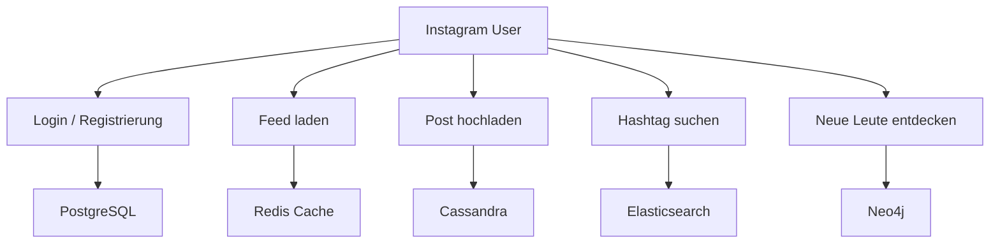
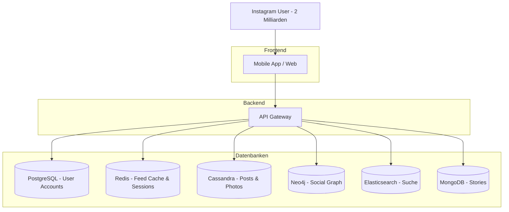
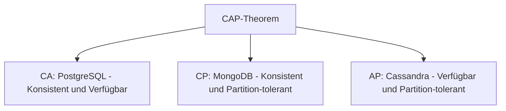
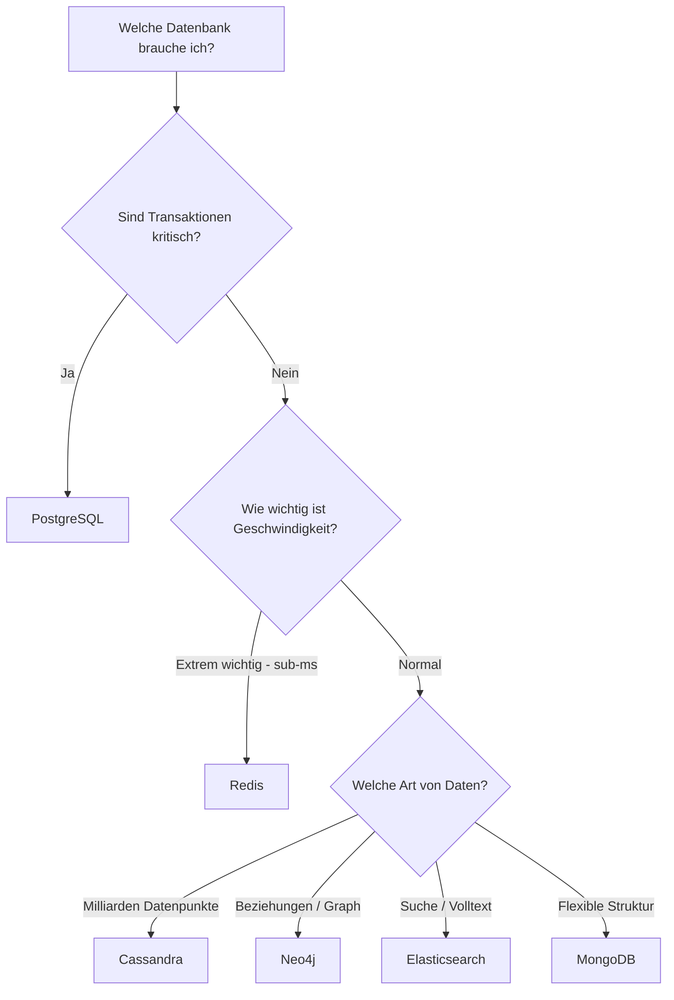

# Moderne Datenbanksysteme: Architektur & Alternativen

<div style="text-align: center; display: flex; flex-direction: column; align-items: center; margin-bottom: 2rem;">
    
    <figcaption style="margin-top: 0.5rem;"><i>"So viele Datenbanken, so wenig Zeit..."</i></figcaption>
</div>

## Einleitung: Wie funktioniert Instagram?

In den vorherigen Kapiteln haben wir **relationale Datenbanken** mit PostgreSQL kennengelernt. Du kannst jetzt Tabellen erstellen, Daten abfragen und komplexe Beziehungen modellieren. Relationale Datenbanken sind seit über 50 Jahren der Standard und werden es auch bleiben.

**Aber:** Könnten wir Instagram nur mit PostgreSQL bauen?

Schauen wir uns an, was Instagram täglich leisten muss:

- **2+ Milliarden aktive Nutzer** weltweit
- **95 Millionen Posts pro Tag** (Fotos, Videos, Reels, Stories)
- **4,2 Milliarden Likes pro Tag**
- **500 Millionen Stories täglich**
- **Follower-Netzwerk:** Durchschnittlich 150 Follower pro Nutzer = 300 Milliarden Beziehungen
- **Hashtag-Suche:** Millionen Suchen pro Sekunde
- **Feed muss in < 100ms laden** (sonst verliert man Nutzer)

???+ warning "Wichtiger Hinweis"
    Dieses Kapitel gibt einen **Überblick** über moderne Datenbanksysteme anhand eines praktischen Beispiels. Es ersetzt **nicht** die Kenntnis relationaler Datenbanken! Die meisten Systeme laufen noch immer auf SQL-Datenbanken. Die hier vorgestellten Alternativen sind **Ergänzungen** für spezielle Anforderungen.

---

## Warum eine Datenbank nicht reicht

Versuchen wir, Instagram **nur mit PostgreSQL** zu bauen:

### Problem 1: Feed laden

```sql
-- Dein Instagram-Feed: Posts von allen Leuten, denen du folgst
SELECT posts.*
FROM posts
JOIN followers ON posts.user_id = followers.following_id
WHERE followers.follower_id = 12345  -- Deine User-ID
ORDER BY posts.created_at DESC
LIMIT 20;
```

**Das Problem:**
- Du folgst 500 Leuten
- Diese haben in den letzten 24h 5000 Posts erstellt
- PostgreSQL muss **jedes Mal** alle 5000 Posts scannen und sortieren
- Bei 2 Milliarden Nutzern = **Datenbank-Kollaps** 💥

**Benötigte Antwortzeit:** < 100ms
**Tatsächliche Antwortzeit mit PostgreSQL:** 5-10 Sekunden (unbenutzbar!)

---

### Problem 2: Stories

Stories haben **unterschiedliche Formate**:
- Normales Foto
- Video
- Boomerang
- Text mit Hintergrund
- Umfragen
- Countdowns
- Musik
- Quiz
- ...und Instagram erfindet ständig neue Formate!

In PostgreSQL müsstest du:

```sql
CREATE TABLE stories (
    story_id SERIAL PRIMARY KEY,
    user_id INTEGER,
    type VARCHAR(50),
    image_url VARCHAR(500),
    video_url VARCHAR(500),      -- NULL bei Fotos
    boomerang_frames TEXT,       -- NULL außer bei Boomerang
    poll_question TEXT,          -- NULL außer bei Umfrage
    poll_option_1 TEXT,
    poll_option_2 TEXT,
    poll_option_3 TEXT,
    poll_option_4 TEXT,
    countdown_end TIMESTAMP,     -- NULL außer bei Countdown
    music_track_id INTEGER,      -- NULL außer bei Musik
    quiz_question TEXT,
    quiz_correct_answer INTEGER,
    -- ... und 50 weitere Spalten für neue Features
);
```

**Das Problem:**
- 90% der Spalten sind immer NULL
- Jedes neue Feature braucht `ALTER TABLE` (bei 500M Stories = Stunden Downtime!)
- Unflexibel und schwer wartbar

---

### Problem 3: Empfehlungen

"**Leute, die du vielleicht kennst**"

```sql
-- Freunde von Freunden finden (2 Ebenen)
SELECT DISTINCT f2.following_id
FROM followers f1
JOIN followers f2 ON f1.following_id = f2.follower_id
WHERE f1.follower_id = 12345;  -- Deine ID
```

Das geht noch. Aber wie wäre es mit:
- Freunde von Freunden von Freunden (3 Ebenen)?
- 6 Ebenen (Kevin Bacon Theorie)?
- "Kürzester Pfad zwischen zwei Nutzern"?

In PostgreSQL: **Unmöglich performant zu lösen!**

---

## Die Lösung: Polyglot Persistence

Instagram nutzt **nicht eine**, sondern **mehrere spezialisierte Datenbanken** gleichzeitig:



Jede Datenbank macht das, wofür sie **optimal gebaut** wurde. Schauen wir uns an, wie das konkret funktioniert!

---

## 1. PostgreSQL: Nutzer-Accounts & Authentifizierung

**Was speichert Instagram in PostgreSQL?**

- User-Accounts (E-Mail, Passwort-Hash, Username)
- Account-Einstellungen (Privatsphäre, Benachrichtigungen)
- Finanzielle Transaktionen (In-App-Käufe, Werbebuchungen)

**Warum PostgreSQL?**

✅ **ACID-Transaktionen** – Login-Daten dürfen niemals inkonsistent sein
✅ **Strukturiert** – User-Daten haben feste Struktur
✅ **Transaktionen** – Beim Registrieren müssen mehrere Operationen atomar sein
✅ **Datenintegrität** – Keine zwei User mit gleicher E-Mail

**Beispiel:** Neue Registrierung

```sql
BEGIN;
    -- User erstellen
    INSERT INTO users (username, email, password_hash)
    VALUES ('anna_schmidt', 'anna@example.com', '$2b$...');

    -- Standard-Einstellungen
    INSERT INTO user_settings (user_id, private_account, notifications)
    VALUES (LASTVAL(), false, true);

    -- Willkommens-Notification
    INSERT INTO notifications (user_id, type, message)
    VALUES (LASTVAL(), 'welcome', 'Willkommen bei Instagram!');
COMMIT;
-- Entweder alles erfolgreich oder nichts!
```

**Aber:** Nur ~1% aller Instagram-Daten liegen in PostgreSQL!

---

## 2. Redis: Feed-Cache & Session-Management

**Das Feed-Problem nochmal:**

Jedes Mal wenn du Instagram öffnest, müssten 5000+ Posts abgefragt, sortiert und gefiltert werden. **Viel zu langsam!**

**Die Lösung:** Dein Feed ist **vorberechnet** und in Redis gecacht.

### Wie funktioniert das?

1. **Wenn jemand einen Post hochlädt:**
   ```
   User "max_mueller" postet ein Foto
   → Instagram findet alle 10.000 Follower von max_mueller
   → Für jeden Follower: Post in dessen Feed-Cache einfügen
   ```

2. **Wenn du Instagram öffnest:**
   ```
   Redis: "Gib mir die neuesten 20 Posts aus dem Feed von user_12345"
   → Antwortzeit: < 1ms (im RAM!)
   → Dein Feed lädt sofort 🚀
   ```

**Warum Redis?**

✅ **In-Memory** – 100x schneller als Disk-Zugriff
✅ **Key-Value** – Einfache Struktur: `feed:user_12345` → Liste von Post-IDs
✅ **Temporär** – Feed-Cache muss nicht ewig gespeichert werden
✅ **Atomic Operations** – Mehrere Nutzer können gleichzeitig Feed aktualisieren

**Weitere Nutzung:**

- **Session Management** – Wer ist gerade eingeloggt?
- **Like-Counters** – Echtzeit-Zähler ohne DB-Last
- **Rate Limiting** – Max 100 API-Requests pro Minute

**Performance-Vergleich:**

<div style="text-align:center; max-width:700px; margin:16px auto;">
<table role="table"
       style="width:100%; border-collapse:separate; border-spacing:0; border:1px solid #cfd8e3; border-radius:10px; overflow:hidden; font-family:system-ui,sans-serif;">
    <thead>
    <tr style="background:#009485; color:#fff;">
        <th style="text-align:left; padding:12px 14px; font-weight:700;">Operation</th>
        <th style="text-align:left; padding:12px 14px; font-weight:700;">PostgreSQL</th>
        <th style="text-align:left; padding:12px 14px; font-weight:700;">Redis</th>
    </tr>
    </thead>
    <tbody>
    <tr>
        <td style="padding:10px 14px;">Feed laden (20 Posts)</td>
        <td style="padding:10px 14px;">5000ms (5 Sekunden)</td>
        <td style="padding:10px 14px;">< 1ms</td>
    </tr>
    <tr>
        <td style="padding:10px 14px;">Like-Counter erhöhen</td>
        <td style="padding:10px 14px;">50ms</td>
        <td style="padding:10px 14px;">< 0.1ms</td>
    </tr>
    <tr>
        <td style="padding:10px 14px;">Session prüfen</td>
        <td style="padding:10px 14px;">10ms</td>
        <td style="padding:10px 14px;">< 0.1ms</td>
    </tr>
    </tbody>
</table>
</div>

**Redis ist 50-5000x schneller!**

---

## 3. Cassandra: Posts, Photos & Videos

**Das Speicherproblem:**

- **95 Millionen Posts pro Tag**
- **10 Jahre Speicherung** = 350 Milliarden Posts
- PostgreSQL-Tabelle würde **Terabytes groß** werden
- Queries über so viele Daten = **extrem langsam**

**Die Lösung:** Cassandra (Column-Family Store)

### Warum Cassandra für Posts?

✅ **Horizontal skalierbar** – Einfach mehr Server hinzufügen
✅ **Optimiert für Writes** – 95M Posts/Tag kein Problem
✅ **Time-Series optimiert** – Posts sind zeitbasiert
✅ **Automatische Partitionierung** – Alte Posts auf separaten Servern
✅ **Keine Single Point of Failure** – Daten repliziert

### Wie speichert Cassandra die Daten?

Statt **zeilenorientiert** (PostgreSQL) speichert Cassandra **spaltenorientiert**:

```
PostgreSQL (zeilenorientiert):
Zeile 1: [post_id=1, user_id=123, image_url=..., likes=42, created_at=...]
Zeile 2: [post_id=2, user_id=456, image_url=..., likes=15, created_at=...]
→ Alle Spalten zusammen gespeichert

Cassandra (spaltenorientiert):
post_id:     [1, 2, 3, 4, ...]
user_id:     [123, 456, 789, 123, ...]
likes:       [42, 15, 8, 234, ...]
created_at:  [2025-01-15, 2025-01-15, ...]
→ Jede Spalte separat gespeichert
```

**Vorteil:** Wenn Instagram nur `likes` abfragen will, muss nicht die ganze Zeile geladen werden!

### Partitionierung nach Zeit

```
Server 1: Posts von 2025-01 bis 2025-03
Server 2: Posts von 2025-04 bis 2025-06
Server 3: Posts von 2025-07 bis 2025-09
...
Server 40: Posts von 2015-01 bis 2015-03 (alte Daten, selten abgerufen)
```

**Ergebnis:**
- Queries nur auf relevanten Zeitraum
- Alte Daten können auf langsamerem/günstigerem Storage
- 1 Million Writes/Sekunde möglich

---

## 4. Neo4j: Social Graph & Empfehlungen

**Das Beziehungs-Problem:**

Instagram muss verstehen:
- Wem folgst du?
- Wer folgt dir?
- Freunde von Freunden?
- Welcher gemeinsame Freund verbindet dich mit Person X?
- "Leute, die du vielleicht kennst"

In PostgreSQL: **Komplexe JOINs, die bei großer Tiefe zusammenbrechen.**

**Die Lösung:** Neo4j (Graph-Datenbank)

### Wie funktioniert der Social Graph?

Stell dir Instagram als riesiges Netzwerk vor:

```
     [Max]
      |  \
folgt |   \ folgt
      |    \
    [Lisa] [Anna]
      |      |
folgt |      | folgt
      |      |
    [Tom]  [Ben]
      |      |
       \    /
     folgt | folgt
          \|
         [Sarah]
```

In PostgreSQL: Tabelle `followers` mit Millionen Zeilen
In Neo4j: **Tatsächliches Graph-Netzwerk** mit direkten Verbindungen

### Beispiel-Abfragen in Neo4j

**Abfrage 1:** "Leute, die du vielleicht kennst" (Freunde von Freunden)

```cypher
MATCH (du:User {id: 12345})-[:FOLGT]->(freund)-[:FOLGT]->(empfehlung)
WHERE NOT (du)-[:FOLGT]->(empfehlung)
  AND du <> empfehlung
RETURN empfehlung.name, COUNT(freund) AS gemeinsame_freunde
ORDER BY gemeinsame_freunde DESC
LIMIT 10;
```

**Ergebnis:**
```
"Anna Schmidt" - 8 gemeinsame Freunde
"Tom Weber" - 5 gemeinsame Freunde
"Lisa Müller" - 3 gemeinsame Freunde
```

**Abfrage 2:** Kürzester Pfad zwischen zwei Nutzern

```cypher
MATCH path = shortestPath(
  (du:User {id: 12345})-[:FOLGT*]-(andere:User {id: 67890})
)
RETURN length(path);
```

**Ergebnis:** "Du bist 4 Schritte von Person X entfernt"

### Warum Neo4j?

<div style="text-align:center; max-width:900px; margin:16px auto;">
<table role="table"
       style="width:100%; border-collapse:separate; border-spacing:0; border:1px solid #cfd8e3; border-radius:10px; overflow:hidden; font-family:system-ui,sans-serif;">
    <thead>
    <tr style="background:#009485; color:#fff;">
        <th style="text-align:left; padding:12px 14px; font-weight:700;">Aufgabe</th>
        <th style="text-align:left; padding:12px 14px; font-weight:700;">PostgreSQL</th>
        <th style="text-align:left; padding:12px 14px; font-weight:700;">Neo4j</th>
    </tr>
    </thead>
    <tbody>
    <tr>
        <td style="padding:10px 14px;">Direkte Follower finden</td>
        <td style="padding:10px 14px;">✅ Schnell (1 Query)</td>
        <td style="padding:10px 14px;">✅ Schnell</td>
    </tr>
    <tr>
        <td style="padding:10px 14px;">Freunde von Freunden (2 Ebenen)</td>
        <td style="padding:10px 14px;">⚠️ Langsamer (2 JOINs)</td>
        <td style="padding:10px 14px;">✅ Schnell</td>
    </tr>
    <tr>
        <td style="padding:10px 14px;">Netzwerk-Tiefe 6</td>
        <td style="padding:10px 14px;">❌ Extrem langsam</td>
        <td style="padding:10px 14px;">✅ Schnell</td>
    </tr>
    <tr>
        <td style="padding:10px 14px;">Kürzester Pfad</td>
        <td style="padding:10px 14px;">❌ Sehr komplex</td>
        <td style="padding:10px 14px;">✅ Eingebauter Algorithmus</td>
    </tr>
    <tr>
        <td style="padding:10px 14px;">Empfehlungen</td>
        <td style="padding:10px 14px;">❌ Schwer zu berechnen</td>
        <td style="padding:10px 14px;">✅ Graph-Algorithmen</td>
    </tr>
    </tbody>
</table>
</div>

**Neo4j ist perfekt für hochvernetzte Daten!**

---

## 5. Elasticsearch: Hashtag-Suche & User-Suche

**Das Such-Problem:**

- User sucht nach `#urlaub2025`
- Instagram muss **Millionen Posts** durchsuchen
- Ergebnis muss in < 100ms da sein
- Suche muss **Tippfehler verzeihen** ("urlub" findet "urlaub")
- Ranking nach Relevanz (nicht nur Datum)

PostgreSQL:
```sql
SELECT * FROM posts
WHERE caption LIKE '%urlaub%'
ORDER BY created_at DESC;
```

**Problem:** `LIKE '%...%'` ist **extrem langsam** auf großen Tabellen!

**Die Lösung:** Elasticsearch (spezialisierte Such-Engine)

### Warum Elasticsearch?

✅ **Volltextsuche optimiert** – Inverted Index für blitzschnelle Suche
✅ **Fuzzy Search** – Findet ähnliche Wörter (Tippfehler)
✅ **Relevanz-Ranking** – Beste Ergebnisse zuerst
✅ **Faceted Search** – Filter kombinieren (Hashtag + Ort + Datum)
✅ **Echtzeit-Indexierung** – Neue Posts sofort durchsuchbar

### Wie funktioniert das?

**Inverted Index** (wie in einem Buch-Index):

```
Normaler Index (PostgreSQL):
Post 1 → "Schöner #urlaub in Italien 🇮🇹"
Post 2 → "Mein #urlaub am Strand"
Post 3 → "Italien ist toll!"

Inverted Index (Elasticsearch):
"urlaub" → [Post 1, Post 2]
"italien" → [Post 1, Post 3]
"strand" → [Post 2]
```

**Ergebnis:** Suche nach "urlaub" findet sofort Posts 1 und 2!

### Such-Features

- **Hashtag-Suche:** `#urlaub` findet alle Posts mit diesem Hashtag
- **User-Suche:** "anna schmidt" findet @anna_schmidt
- **Ort-Suche:** "Berlin" findet Posts, die in Berlin getaggt sind
- **Kombinierte Filter:** `#urlaub AND location:Italien AND date:2025`
- **Autocomplete:** Während du tippst, werden Vorschläge angezeigt

**Performance:** Millionen Posts durchsuchen in < 50ms! 🚀

---

## 6. MongoDB: Stories mit flexiblen Formaten

**Das Story-Problem:**

Stories haben **unterschiedliche Strukturen**:
- Normales Foto: `{type: "photo", url: "..."}`
- Video: `{type: "video", url: "...", duration: 15}`
- Umfrage: `{type: "poll", question: "...", options: [...]}`
- Countdown: `{type: "countdown", end_time: "...", title: "..."}`

In PostgreSQL: Viele NULL-Spalten oder komplizierte Tabellen-Struktur.

**Die Lösung:** MongoDB (Document Store)

### Flexible Schema in MongoDB

**Story 1: Normales Foto**
```json
{
  "_id": "story_12345",
  "user_id": 789,
  "type": "photo",
  "url": "https://...",
  "created_at": "2025-01-15T10:30:00Z",
  "expires_at": "2025-01-16T10:30:00Z"
}
```

**Story 2: Umfrage (komplett andere Struktur!)**
```json
{
  "_id": "story_12346",
  "user_id": 456,
  "type": "poll",
  "question": "Pizza oder Pasta?",
  "options": [
    {"text": "Pizza", "votes": 234},
    {"text": "Pasta", "votes": 189}
  ],
  "created_at": "2025-01-15T11:00:00Z",
  "expires_at": "2025-01-16T11:00:00Z"
}
```

**Story 3: Countdown**
```json
{
  "_id": "story_12347",
  "user_id": 123,
  "type": "countdown",
  "title": "Bis zum Urlaub!",
  "end_time": "2025-06-01T00:00:00Z",
  "background_color": "#FF5733",
  "created_at": "2025-01-15T12:00:00Z",
  "expires_at": "2025-01-16T12:00:00Z"
}
```

### Warum MongoDB?

✅ **Flexible Schemas** – Jedes Dokument kann anders aussehen
✅ **Keine ALTER TABLE** – Neues Story-Format? Einfach speichern!
✅ **JSON-nativ** – Stories sind eh JSON vom Frontend
✅ **Schnelle Entwicklung** – Neue Features ohne DB-Migration

**Vergleich:**

<div style="text-align:center; max-width:900px; margin:16px auto;">
<table role="table"
       style="width:100%; border-collapse:separate; border-spacing:0; border:1px solid #cfd8e3; border-radius:10px; overflow:hidden; font-family:system-ui,sans-serif;">
    <thead>
    <tr style="background:#009485; color:#fff;">
        <th style="text-align:left; padding:12px 14px; font-weight:700;">Szenario</th>
        <th style="text-align:left; padding:12px 14px; font-weight:700;">PostgreSQL</th>
        <th style="text-align:left; padding:12px 14px; font-weight:700;">MongoDB</th>
    </tr>
    </thead>
    <tbody>
    <tr>
        <td style="padding:10px 14px;">Neues Story-Format hinzufügen</td>
        <td style="padding:10px 14px;">ALTER TABLE (Downtime!)</td>
        <td style="padding:10px 14px;">Einfach speichern ✅</td>
    </tr>
    <tr>
        <td style="padding:10px 14px;">Verschiedene Strukturen</td>
        <td style="padding:10px 14px;">Viele NULL-Spalten</td>
        <td style="padding:10px 14px;">Jedes Dokument individuell ✅</td>
    </tr>
    <tr>
        <td style="padding:10px 14px;">JSON vom Frontend</td>
        <td style="padding:10px 14px;">Konvertierung nötig</td>
        <td style="padding:10px 14px;">Direkt speicherbar ✅</td>
    </tr>
    <tr>
        <td style="padding:10px 14px;">Transaktionen</td>
        <td style="padding:10px 14px;">✅ Vollständig</td>
        <td style="padding:10px 14px;">⚠️ Eingeschränkt</td>
    </tr>
    </tbody>
</table>
</div>

---

## Die Instagram-Architektur im Überblick



### Datenmenge-Verteilung bei Instagram

<div style="text-align:center; max-width:800px; margin:16px auto;">
<table role="table"
       style="width:100%; border-collapse:separate; border-spacing:0; border:1px solid #cfd8e3; border-radius:10px; overflow:hidden; font-family:system-ui,sans-serif;">
    <thead>
    <tr style="background:#009485; color:#fff;">
        <th style="text-align:left; padding:12px 14px; font-weight:700;">Datenbank</th>
        <th style="text-align:left; padding:12px 14px; font-weight:700;">Was wird gespeichert?</th>
        <th style="text-align:left; padding:12px 14px; font-weight:700;">Datenmenge</th>
    </tr>
    </thead>
    <tbody>
    <tr>
        <td style="background:#00948511; padding:10px 14px;"><strong>PostgreSQL</strong></td>
        <td style="padding:10px 14px;">User-Accounts, Einstellungen</td>
        <td style="padding:10px 14px;">~1% (50 GB)</td>
    </tr>
    <tr>
        <td style="background:#00948511; padding:10px 14px;"><strong>Redis</strong></td>
        <td style="padding:10px 14px;">Feed-Cache, Sessions</td>
        <td style="padding:10px 14px;">~5% (200 GB im RAM)</td>
    </tr>
    <tr>
        <td style="background:#00948511; padding:10px 14px;"><strong>Cassandra</strong></td>
        <td style="padding:10px 14px;">Posts, Photos, Videos</td>
        <td style="padding:10px 14px;">~80% (100+ TB)</td>
    </tr>
    <tr>
        <td style="background:#00948511; padding:10px 14px;"><strong>Neo4j</strong></td>
        <td style="padding:10px 14px;">Follower-Beziehungen</td>
        <td style="padding:10px 14px;">~10% (10 TB)</td>
    </tr>
    <tr>
        <td style="background:#00948511; padding:10px 14px;"><strong>Elasticsearch</strong></td>
        <td style="padding:10px 14px;">Such-Index</td>
        <td style="padding:10px 14px;">~3% (5 TB)</td>
    </tr>
    <tr>
        <td style="background:#00948511; padding:10px 14px;"><strong>MongoDB</strong></td>
        <td style="padding:10px 14px;">Stories (temporär 24h)</td>
        <td style="padding:10px 14px;">~1% (500 GB)</td>
    </tr>
    </tbody>
</table>
</div>

---

## Das CAP-Theorem: Trade-Offs verstehen

Warum kann Instagram nicht **eine perfekte Datenbank** nutzen?

Das **CAP-Theorem** erklärt es:

**Du kannst nur 2 von 3 Eigenschaften haben:**

- **C (Consistency)** = Konsistenz – Alle sehen dieselben Daten
- **A (Availability)** = Verfügbarkeit – Jede Anfrage bekommt Antwort
- **P (Partition Tolerance)** = Partitionstoleranz – System funktioniert trotz Netzwerkausfall



### Praktisches Beispiel

**Szenario 1: User ändert sein Passwort**

→ **PostgreSQL (CA/CP):** MUSS konsistent sein!
- Wenn Passwort geändert wird, darf altes Passwort NICHT mehr funktionieren
- Lieber kurz nicht verfügbar als falsches Passwort akzeptieren

**Szenario 2: Du likest einen Post**

→ **Cassandra (AP):** Verfügbarkeit wichtiger als Konsistenz!
- Dein Like MUSS sofort registriert werden (App darf nicht hängen)
- OK, wenn Counter kurz falsch ist (999 statt 1000 Likes)
- Nach ein paar Sekunden synchronisiert sich alles

**Szenario 3: Story-Views**

→ **MongoDB (CP):** Bei Netzwerk-Problemen lieber temporär nicht verfügbar
- Story-Views müssen halbwegs akkurat sein
- Aber nicht so kritisch wie Passwörter

---

## Moderne Anforderungen: Was hat sich geändert?

### Früher (2000er): Facebook mit MySQL

- **Tausende** Nutzer
- **Gigabytes** an Daten
- **Vertikale Skalierung** – Größerer Server kaufen
- **Schema ändern** – Kein Problem, Downtime OK
- **Ein Server** reicht

### Heute (2020er): Instagram mit Polyglot Persistence

- **Milliarden** Nutzer
- **Petabytes** an Daten
- **Horizontale Skalierung** – Viele Server im Cluster
- **Schema ändern** – Unmöglich ohne Downtime → Flexible Datenbanken
- **Hunderte Server** weltweit verteilt
- **Sub-100ms Latenz** erwartet
- **Ausfallsicherheit** – Ein Server-Crash darf nicht alles lahmlegen

---

## Entscheidungshilfe: Welche Datenbank wofür?

### Nach Anforderung

<div style="text-align:center; max-width:1000px; margin:16px auto;">
<table role="table"
       style="width:100%; border-collapse:separate; border-spacing:0; border:1px solid #cfd8e3; border-radius:10px; overflow:hidden; font-family:system-ui,sans-serif;">
    <thead>
    <tr style="background:#009485; color:#fff;">
        <th style="text-align:left; padding:12px 14px; font-weight:700;">Anforderung</th>
        <th style="text-align:left; padding:12px 14px; font-weight:700;">Richtige Wahl</th>
        <th style="text-align:left; padding:12px 14px; font-weight:700;">Beispiel</th>
    </tr>
    </thead>
    <tbody>
    <tr>
        <td style="background:#00948511; padding:10px 14px;"><strong>ACID-Transaktionen kritisch</strong></td>
        <td style="padding:10px 14px;">PostgreSQL</td>
        <td style="padding:10px 14px;">Bank-Überweisungen, Login</td>
    </tr>
    <tr>
        <td style="background:#00948511; padding:10px 14px;"><strong>Sub-Millisekunden Latenz</strong></td>
        <td style="padding:10px 14px;">Redis</td>
        <td style="padding:10px 14px;">Feed-Cache, Sessions</td>
    </tr>
    <tr>
        <td style="background:#00948511; padding:10px 14px;"><strong>Milliarden Datenpunkte</strong></td>
        <td style="padding:10px 14px;">Cassandra</td>
        <td style="padding:10px 14px;">Posts, IoT-Sensordaten</td>
    </tr>
    <tr>
        <td style="background:#00948511; padding:10px 14px;"><strong>Hochvernetzte Daten</strong></td>
        <td style="padding:10px 14px;">Neo4j</td>
        <td style="padding:10px 14px;">Social Graph, Empfehlungen</td>
    </tr>
    <tr>
        <td style="background:#00948511; padding:10px 14px;"><strong>Volltextsuche</strong></td>
        <td style="padding:10px 14px;">Elasticsearch</td>
        <td style="padding:10px 14px;">Hashtag-Suche, Logs</td>
    </tr>
    <tr>
        <td style="background:#00948511; padding:10px 14px;"><strong>Flexible Schemas</strong></td>
        <td style="padding:10px 14px;">MongoDB</td>
        <td style="padding:10px 14px;">Stories, Produktkatalog</td>
    </tr>
    </tbody>
</table>
</div>

### Entscheidungsbaum



---

## Cloud-Native & Serverless

Moderne Cloud-Anbieter bieten **verwaltete Datenbanken**:

**Beispiele:**
- **AWS RDS** – Verwaltetes PostgreSQL/MySQL
- **Amazon DynamoDB** – Serverless NoSQL
- **Azure Cosmos DB** – Global verteilte Multi-Model DB
- **Google Cloud Spanner** – Global verteiltes SQL
- **MongoDB Atlas** – Verwaltetes MongoDB

**Vorteile:**

✅ **Keine Server-Verwaltung** – AWS kümmert sich um Updates, Backups
✅ **Auto-Scaling** – Automatisch mehr Ressourcen bei hoher Last
✅ **Global verteilt** – Daten nah beim Nutzer (Latenz minimieren)
✅ **99.99% Uptime** – SLA garantiert
✅ **Pay-per-Use** – Nur zahlen, was du nutzt

Instagram läuft auf **AWS** mit hunderten Datenbank-Instanzen weltweit verteilt!

---

## Zusammenfassung

### Instagram nutzt 6 verschiedene Datenbanken:

1. **PostgreSQL** → User-Accounts, Login (ACID wichtig)
2. **Redis** → Feed-Cache, Sessions (Speed wichtig)
3. **Cassandra** → Posts, Photos (Massive Skalierung)
4. **Neo4j** → Follower-Netzwerk (Graph-Beziehungen)
5. **Elasticsearch** → Hashtag-Suche (Volltextsuche)
6. **MongoDB** → Stories (Flexible Schemas)

### Wichtigste Erkenntnisse

- **Eine Datenbank reicht nicht** für moderne Anwendungen
- **Polyglot Persistence** ist die Zukunft
- **CAP-Theorem:** Du kannst nicht alles haben – wähle Trade-Offs bewusst
- **PostgreSQL bleibt wichtig** – aber als Teil eines größeren Systems
- **Spezialisierte Datenbanken** sind für spezielle Aufgaben optimiert

### Die richtige Wahl treffen

- **Fang mit PostgreSQL an** – für die meisten Startups perfekt
- **Skalierungs-Probleme?** → Dann spezialisierte DBs hinzufügen
- **Horizontale Skalierung nötig?** → NoSQL (Cassandra, MongoDB)
- **Komplexe Beziehungen?** → Graph-DB (Neo4j)
- **Echtzeit-Performance?** → In-Memory (Redis)

---

<div style="display: flex; justify-content: center; margin: 2rem 0;">
    
</div>

<div style="text-align: center; margin-top: 2rem;">
    <h3>Du verstehst jetzt, warum moderne Apps mehrere Datenbanken nutzen! 🎉</h3>
    <p><i>Jede Datenbank hat ihre Stärken – nutze sie weise!</i></p>
</div>
