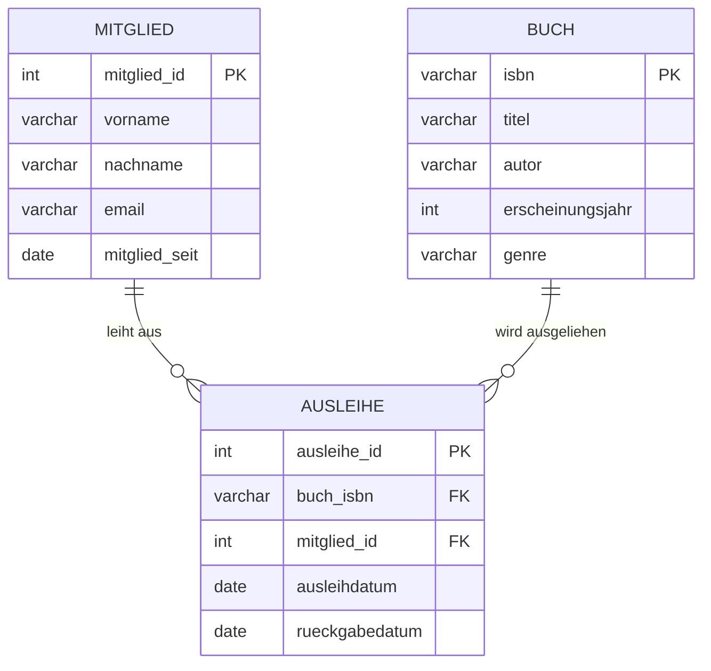

# Praktisches Projekt: Bibliotheksverwaltung

In den vorherigen Kapiteln haben wir die wichtigsten Konzepte relationaler Datenbanken kennengelernt: von einfachen Tabellen über Beziehungen und Joins bis hin zu Transaktionen. Jetzt ist es Zeit, **alles zusammenzuführen** und eine **realistische Datenbank von Grund auf zu entwickeln**.

In diesem Kapitel arbeiten wir an einem **praktischen Projekt**: Wir entwickeln eine Datenbank für eine **Bibliotheksverwaltung**. Dabei durchlaufen wir alle Phasen der Datenbankentwicklung:

1. **Problemanalyse** – Was soll die Datenbank leisten?
2. **Datenmodellierung** – Wie strukturieren wir die Daten? (ER-Modell)
3. **Tabellendesign** – Welche Tabellen und Beziehungen brauchen wir?
4. **Implementierung** – Tabellen mit SQL erstellen
5. **Daten einfügen** – Beispieldaten anlegen
6. **Abfragen entwickeln** – Typische Szenarien mit SQL abbilden

Am Ende dieses Kapitels habt ihr eine **funktionierende Bibliotheksdatenbank**, die ihr erweitern und als Vorlage für eigene Projekte nutzen könnt.

---

## Phase 1: Problemanalyse

### Die Aufgabenstellung

Eine kleine Stadtbibliothek möchte ihre Verwaltung digitalisieren. Bisher wurden alle Informationen auf Karteikarten und in Excel-Tabellen gespeichert – das führt zu Problemen:

* Bücher werden **mehrfach verliehen**, weil niemand den Überblick hat
* Es ist unklar, **wann ein Buch zurückgegeben** werden muss
* Die Bibliothek weiß nicht, **welche Bücher besonders beliebt** sind
* Bei **Rückfragen zu Ausleihen** müssen alle Karteikarten durchsucht werden

### Anforderungen an die Datenbank

Die Bibliothek braucht ein System, das folgende Fragen beantworten kann:

* Welche **Bücher** gibt es in der Bibliothek?
* Wer hat **welches Buch ausgeliehen**?
* **Wann** wurde ein Buch ausgeliehen, und wann muss es zurück?
* Welche Bücher sind **aktuell verfügbar**?
* Wie viele Bücher hat ein **bestimmter Mitglied** gerade ausgeliehen?
* Welche Bücher von einem **bestimmten Autor** sind vorhanden?

---

## Phase 2: Datenmodellierung mit dem ER-Modell

Bevor wir SQL-Tabellen erstellen, überlegen wir uns zunächst, **welche Entitäten** (Objekte) wir brauchen und **wie sie zusammenhängen**.

### Schritt 1: Entitäten identifizieren

Welche **Objekte** spielen in unserer Bibliothek eine Rolle?

* **Buch** – Die Bücher in der Bibliothek
* **Mitglied** – Die Bibliotheksmitglieder (Personen, die Bücher ausleihen können)
* **Ausleihe** – Der Vorgang, wenn ein Mitglied ein Buch ausleiht

### Schritt 2: Attribute festlegen

Welche **Informationen** brauchen wir zu jeder Entität?

| Entität | Attribute |
|---------|-----------|
| **Buch** | isbn (Primärschlüssel), titel, autor, erscheinungsjahr, genre |
| **Mitglied** | mitglied_id (Primärschlüssel), vorname, nachname, email, mitglied_seit |
| **Ausleihe** | ausleihe_id (Primärschlüssel), buch_isbn, mitglied_id, ausleihdatum, rueckgabedatum |

### Schritt 3: Beziehungen modellieren

Wie hängen die Entitäten zusammen?



**Beziehungstypen:**

* Ein **Mitglied** kann **mehrere Bücher** ausleihen → **1:n**
* Ein **Buch** kann **mehrmals** ausgeliehen werden (nacheinander) → **1:n**
* Die Tabelle **Ausleihe** verbindet Mitglied und Buch → **Zwischentabelle**

---

## Phase 3: Tabellendesign

Jetzt übersetzen wir unser ER-Modell in konkrete SQL-Tabellen.

### Überlegungen zum Design

**Primärschlüssel:**

* `isbn` für Bücher (eindeutige Buchnummer)
* `mitglied_id` für Mitglieder (automatisch generiert)
* `ausleihe_id` für Ausleihen (automatisch generiert)

**Fremdschlüssel:**

* `buch_isbn` in der Tabelle `ausleihen` verweist auf `buecher.isbn`
* `mitglied_id` in der Tabelle `ausleihen` verweist auf `mitglieder.mitglied_id`

**Constraints:**

* `NOT NULL` für Pflichtfelder (z.B. titel, vorname, nachname)
* `CHECK` für sinnvolle Werte (z.B. erscheinungsjahr >= 1450)
* `UNIQUE` für Email-Adressen (jede Email nur einmal)

---

## Phase 4: Implementierung mit SQL

Jetzt erstellen wir die Tabellen in PostgreSQL.

### Tabelle: buecher

```sql
CREATE TABLE buecher (
    isbn VARCHAR(13) PRIMARY KEY,
    titel VARCHAR(200) NOT NULL,
    autor VARCHAR(100) NOT NULL,
    erscheinungsjahr INTEGER CHECK(erscheinungsjahr >= 1450 AND erscheinungsjahr <= 2025),
    genre VARCHAR(50)
);
```

### Tabelle: mitglieder

```sql
CREATE TABLE mitglieder (
    mitglied_id SERIAL PRIMARY KEY,
    vorname VARCHAR(50) NOT NULL,
    nachname VARCHAR(50) NOT NULL,
    email VARCHAR(100) UNIQUE NOT NULL,
    mitglied_seit DATE NOT NULL DEFAULT CURRENT_DATE
);
```

### Tabelle: ausleihen

```sql
CREATE TABLE ausleihen (
    ausleihe_id SERIAL PRIMARY KEY,
    buch_isbn VARCHAR(13) NOT NULL REFERENCES buecher(isbn) ON DELETE CASCADE,
    mitglied_id INTEGER NOT NULL REFERENCES mitglieder(mitglied_id) ON DELETE CASCADE,
    ausleihdatum DATE NOT NULL DEFAULT CURRENT_DATE,
    rueckgabedatum DATE,
    CHECK(rueckgabedatum IS NULL OR rueckgabedatum >= ausleihdatum)
);
```

**Wichtige Details:**

* `SERIAL` erstellt automatisch fortlaufende Nummern
* `REFERENCES` erstellt Fremdschlüssel-Beziehungen
* `ON DELETE CASCADE` löscht automatisch abhängige Einträge
* `CHECK` stellt sicher, dass das Rückgabedatum nach dem Ausleihdatum liegt

---

## Phase 5: Daten einfügen

Jetzt füllen wir unsere Datenbank mit **Beispieldaten**.

### Bücher einfügen

```sql
INSERT INTO buecher (isbn, titel, autor, erscheinungsjahr, genre) VALUES
('9783499267758', 'Der Medicus', 'Noah Gordon', 1987, 'Historischer Roman'),
('9783551551672', 'Harry Potter und der Stein der Weisen', 'J.K. Rowling', 1997, 'Fantasy'),
('9783442267743', 'Das Parfum', 'Patrick Süskind', 1985, 'Roman'),
('9783257237443', 'Der Hundertjährige', 'Jonas Jonasson', 2009, 'Komödie'),
('9783442312184', '1984', 'George Orwell', 1949, 'Dystopie'),
('9783453319554', 'Die unendliche Geschichte', 'Michael Ende', 1979, 'Fantasy'),
('9783499254010', 'Homo Deus', 'Yuval Noah Harari', 2015, 'Sachbuch');
```

### Mitglieder einfügen

```sql
INSERT INTO mitglieder (vorname, nachname, email, mitglied_seit) VALUES
('Anna', 'Schmidt', 'anna.schmidt@email.com', '2023-01-15'),
('Ben', 'Müller', 'ben.mueller@email.com', '2023-03-20'),
('Clara', 'Weber', 'clara.weber@email.com', '2023-05-10'),
('David', 'Fischer', 'david.fischer@email.com', '2023-08-01'),
('Emma', 'Wagner', 'emma.wagner@email.com', '2024-01-12');
```

### Ausleihen einfügen

```sql
INSERT INTO ausleihen (buch_isbn, mitglied_id, ausleihdatum, rueckgabedatum) VALUES
-- Abgeschlossene Ausleihen (mit Rückgabedatum)
('9783499267758', 1, '2024-01-10', '2024-01-24'),
('9783551551672', 2, '2024-02-05', '2024-02-20'),
('9783442267743', 1, '2024-02-15', '2024-03-01'),

-- Aktuell ausgeliehene Bücher (ohne Rückgabedatum)
('9783257237443', 3, '2024-03-10', NULL),
('9783442312184', 4, '2024-03-15', NULL),
('9783453319554', 1, '2024-03-18', NULL);
```

---

## Phase 6: Typische Abfragen implementieren

Jetzt entwickeln wir SQL-Abfragen für die wichtigsten Anwendungsfälle.

### 1. Alle verfügbaren Bücher anzeigen

**Frage:** Welche Bücher sind aktuell **nicht** ausgeliehen?

```sql
SELECT b.isbn, b.titel, b.autor, b.genre
FROM buecher b
WHERE b.isbn NOT IN (
    SELECT buch_isbn 
    FROM ausleihen 
    WHERE rueckgabedatum IS NULL
)
ORDER BY b.titel;
```

**Erklärung:** Wir suchen alle Bücher, deren ISBN **nicht** in der Liste der aktuell ausgeliehenen Bücher vorkommt.

---

### 2. Aktuell ausgeliehene Bücher mit Ausleihinfo

**Frage:** Welche Bücher sind gerade ausgeliehen, und von wem?

```sql
SELECT 
    b.titel,
    b.autor,
    m.vorname || ' ' || m.nachname AS ausgeliehen_von,
    a.ausleihdatum,
    CURRENT_DATE - a.ausleihdatum AS tage_ausgeliehen
FROM ausleihen a
JOIN buecher b ON a.buch_isbn = b.isbn
JOIN mitglieder m ON a.mitglied_id = m.mitglied_id
WHERE a.rueckgabedatum IS NULL
ORDER BY a.ausleihdatum;
```

**Erklärung:** Wir verbinden drei Tabellen mit JOINs und berechnen, wie lange das Buch schon ausgeliehen ist.

---

### 3. Ausleihhistorie eines Mitglieds

**Frage:** Welche Bücher hat Anna Schmidt ausgeliehen?

```sql
SELECT 
    b.titel,
    b.autor,
    a.ausleihdatum,
    a.rueckgabedatum,
    CASE 
        WHEN a.rueckgabedatum IS NULL THEN 'Aktuell ausgeliehen'
        ELSE 'Zurückgegeben'
    END AS status
FROM ausleihen a
JOIN buecher b ON a.buch_isbn = b.isbn
JOIN mitglieder m ON a.mitglied_id = m.mitglied_id
WHERE m.vorname = 'Anna' AND m.nachname = 'Schmidt'
ORDER BY a.ausleihdatum DESC;
```

---

### 4. Beliebteste Bücher

**Frage:** Welche Bücher wurden am häufigsten ausgeliehen?

```sql
SELECT 
    b.titel,
    b.autor,
    COUNT(a.ausleihe_id) AS anzahl_ausleihen
FROM buecher b
LEFT JOIN ausleihen a ON b.isbn = a.buch_isbn
GROUP BY b.isbn, b.titel, b.autor
ORDER BY anzahl_ausleihen DESC
LIMIT 5;
```

**Erklärung:** Wir gruppieren nach Buch und zählen die Anzahl der Ausleihen.

---

### 5. Mitglieder mit aktuellen Ausleihen

**Frage:** Wie viele Bücher hat jedes Mitglied gerade ausgeliehen?

```sql
SELECT 
    m.vorname || ' ' || m.nachname AS mitglied,
    COUNT(a.ausleihe_id) AS aktuell_ausgeliehen
FROM mitglieder m
LEFT JOIN ausleihen a ON m.mitglied_id = a.mitglied_id AND a.rueckgabedatum IS NULL
GROUP BY m.mitglied_id, m.vorname, m.nachname
ORDER BY aktuell_ausgeliehen DESC;
```

---

### 6. Bücher eines bestimmten Autors

**Frage:** Welche Bücher von J.K. Rowling gibt es in der Bibliothek?

```sql
SELECT titel, erscheinungsjahr, genre
FROM buecher
WHERE autor LIKE '%Rowling%'
ORDER BY erscheinungsjahr;
```

---

### 7. Überfällige Ausleihen finden

**Frage:** Welche Bücher müssten schon längst zurückgegeben sein? (z.B. nach 14 Tagen)

```sql
SELECT 
    b.titel,
    m.vorname || ' ' || m.nachname AS ausgeliehen_von,
    m.email,
    a.ausleihdatum,
    CURRENT_DATE - a.ausleihdatum AS tage_ueberfaellig
FROM ausleihen a
JOIN buecher b ON a.buch_isbn = b.isbn
JOIN mitglieder m ON a.mitglied_id = m.mitglied_id
WHERE a.rueckgabedatum IS NULL 
  AND a.ausleihdatum < CURRENT_DATE - INTERVAL '14 days'
ORDER BY tage_ueberfaellig DESC;
```

---

## Erweiterte Aufgaben

### Aufgabe 1: Buch zurückgeben

**Szenario:** Anna Schmidt gibt "Die unendliche Geschichte" zurück.

Schreibe ein UPDATE-Statement, das das Rückgabedatum auf heute setzt.

???+ tip "Lösung"
    ```sql
    UPDATE ausleihen
    SET rueckgabedatum = CURRENT_DATE
    WHERE buch_isbn = '9783453319554' 
      AND mitglied_id = (SELECT mitglied_id FROM mitglieder WHERE vorname = 'Anna' AND nachname = 'Schmidt')
      AND rueckgabedatum IS NULL;
    ```

---

### Aufgabe 2: Neues Buch ausleihen

**Szenario:** Ben Müller möchte "Der Medicus" ausleihen.

Schreibe ein INSERT-Statement für eine neue Ausleihe.

???+ tip "Lösung"
    ```sql
    INSERT INTO ausleihen (buch_isbn, mitglied_id, ausleihdatum)
    VALUES (
        '9783499267758',
        (SELECT mitglied_id FROM mitglieder WHERE vorname = 'Ben' AND nachname = 'Müller'),
        CURRENT_DATE
    );
    ```

---

### Aufgabe 3: Mitglied mit allen Ausleihen löschen

**Szenario:** Ein Mitglied verlässt die Stadt und möchte sein Konto löschen.

Was passiert mit den Ausleihen? Teste es!

???+ tip "Lösung"
    ```sql
    -- Zuerst anschauen, was gelöscht wird
    SELECT * FROM ausleihen WHERE mitglied_id = 5;
    
    -- Mitglied löschen (Ausleihen werden durch ON DELETE CASCADE automatisch gelöscht)
    DELETE FROM mitglieder WHERE mitglied_id = 5;
    
    -- Überprüfung: Ausleihen sind auch weg
    SELECT * FROM ausleihen WHERE mitglied_id = 5;  -- Keine Ergebnisse
    ```

---

### Aufgabe 4: Statistiken erstellen

Erstelle eine Abfrage, die für jedes Genre zeigt:

* Wie viele Bücher es gibt
* Wie oft diese Bücher insgesamt ausgeliehen wurden

???+ tip "Lösung"
    ```sql
    SELECT 
        b.genre,
        COUNT(DISTINCT b.isbn) AS anzahl_buecher,
        COUNT(a.ausleihe_id) AS anzahl_ausleihen
    FROM buecher b
    LEFT JOIN ausleihen a ON b.isbn = a.buch_isbn
    GROUP BY b.genre
    ORDER BY anzahl_ausleihen DESC;
    ```

---

## Erweiterungsmöglichkeiten

Die Bibliotheksdatenbank kann noch erweitert werden:

### Mögliche Erweiterungen:

1. **Mahngebühren** – Eine Tabelle für Gebühren bei überfälliger Rückgabe
2. **Reservierungen** – Mitglieder können Bücher vormerken
3. **Mehrere Exemplare** – Ein Buch kann in mehreren Exemplaren vorhanden sein
4. **Kategorien** – Eine eigene Tabelle für Genres mit n:m-Beziehung
5. **Rezensionen** – Mitglieder können Bücher bewerten

### Beispiel: Mehrere Exemplare

```sql
CREATE TABLE exemplare (
    exemplar_id SERIAL PRIMARY KEY,
    buch_isbn VARCHAR(13) REFERENCES buecher(isbn),
    standort VARCHAR(50),
    zustand VARCHAR(20) CHECK(zustand IN ('Neu', 'Gut', 'Akzeptabel', 'Beschädigt'))
);

-- Ausleihen-Tabelle anpassen
ALTER TABLE ausleihen 
ADD COLUMN exemplar_id INTEGER REFERENCES exemplare(exemplar_id);
```

---

## Zusammenfassung 📌

In diesem Kapitel haben wir eine **komplette Datenbank** entwickelt:

✅ **Anforderungen analysiert** – Was braucht die Bibliothek?  
✅ **ER-Modell erstellt** – Entitäten, Attribute und Beziehungen modelliert  
✅ **Tabellen designed** – Primär- und Fremdschlüssel festgelegt  
✅ **SQL implementiert** – Tabellen mit Constraints erstellt  
✅ **Daten eingefügt** – Beispieldaten angelegt  
✅ **Abfragen entwickelt** – Typische Szenarien mit SQL umgesetzt  

**Wichtige Erkenntnisse:**

* Gutes **Datenbankdesign** beginnt mit einer **klaren Problemanalyse**
* Das **ER-Modell** hilft, Strukturen zu visualisieren
* **Fremdschlüssel** stellen Beziehungen zwischen Tabellen her
* **Constraints** garantieren Datenintegrität
* Komplexe Fragen lassen sich mit **JOINs und Subqueries** beantworten

---

## Weiterführende Übung: Eigenes Projekt

Wähle eines der folgenden Szenarien und entwickle eine eigene Datenbank:

1. **Online-Shop** – Produkte, Kunden, Bestellungen, Warenkorb
2. **Uni-Kursverwaltung** – Studierende, Kurse, Dozenten, Einschreibungen
3. **Filmverleih** – Filme, Kunden, Ausleihen, Genres
4. **Fitnessstudio** – Mitglieder, Kurse, Trainer, Teilnahmen

**Arbeitsschritte:**

1. Anforderungen definieren
2. ER-Modell zeichnen
3. Tabellen erstellen
4. Beispieldaten einfügen
5. Mindestens 5 typische Abfragen entwickeln

---

Im nächsten Kapitel werfen wir einen **Ausblick auf weiterführende Themen** wie Views, Stored Procedures und NoSQL-Datenbanken.