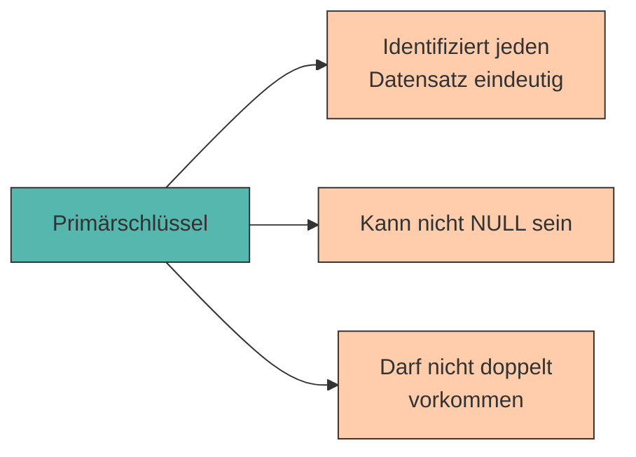

# Grundlagen des Relationalen Modells

Im vorherigen Kapitel haben wir Datenbanken als Lösung für strukturierte Datenhaltung kennengelernt und PostgreSQL installiert. Jetzt wird es konkret: Wie werden Daten in einer relationalen Datenbank organisiert?

Die Antwort: In **Tabellen**!

---

## Das relationale Modell

Eine **relationale Datenbank** organisiert Daten in **Tabellen** (auch **Relationen** genannt). Jede Tabelle besteht aus:

- **Zeilen** (auch **Tupel** oder **Datensätze** genannt) – repräsentieren einzelne Objekte oder Einträge
- **Spalten** (auch **Attribute** oder **Felder** genannt) – beschreiben Eigenschaften dieser Objekte

```
           Spalten (Attribute)
              ↓     ↓      ↓
        ┌─────────┬───────┬──────────┐
        │ Name    │ Alter │ Stadt    │  ← Tabellenkopf
        ├─────────┼───────┼──────────┤
Zeilen  │ Anna    │ 23    │ Wien     │  ← Datensatz 1 (Tupel)
(Tupel) │ Max     │ 25    │ Graz     │  ← Datensatz 2
        │ Lisa    │ 22    │ Linz     │  ← Datensatz 3
        └─────────┴───────┴──────────┘
```

<div style="background:#FFB48211; border-left:4px solid #FFB482; padding:12px 16px; margin:16px 0;">
<strong>📘 Terminologie</strong><br>
In der Praxis werden oft verschiedene Begriffe synonym verwendet:<br>
• <strong>Tabelle</strong> = Relation<br>
• <strong>Zeile</strong> = Datensatz = Tupel = Record<br>
• <strong>Spalte</strong> = Attribut = Feld = Column
</div>

---

## Datentypen in PostgreSQL

Jede Spalte einer Tabelle hat einen **Datentyp**, der festlegt, welche Art von Daten gespeichert werden kann. PostgreSQL bietet eine Vielzahl von Datentypen – wir konzentrieren uns zunächst auf die wichtigsten:

### Textdaten

<div style="text-align:center; max-width:820px; margin:16px auto;">
<table role="table" 
       style="width:100%; border-collapse:separate; border-spacing:0; border:1px solid #cfd8e3; border-radius:10px; overflow:hidden; font-family:system-ui,sans-serif;">
    <thead>
    <tr style="background:#009485; color:#fff;">
        <th style="text-align:left; padding:12px 14px; font-weight:700;">Datentyp</th>
        <th style="text-align:left; padding:12px 14px; font-weight:700;">Beschreibung</th>
        <th style="text-align:left; padding:12px 14px; font-weight:700;">Beispiel</th>
    </tr>
    </thead>
    <tbody>
    <tr>
        <td style="background:#00948511; padding:10px 14px;"><code>VARCHAR(n)</code></td>
        <td style="padding:10px 14px;">Zeichenkette mit max. <code>n</code> Zeichen</td>
        <td style="padding:10px 14px;"><code>'Anna Müller'</code></td>
    </tr>
    <tr>
        <td style="background:#00948511; padding:10px 14px;"><code>TEXT</code></td>
        <td style="padding:10px 14px;">Zeichenkette unbegrenzter Länge</td>
        <td style="padding:10px 14px;"><code>'Ein langer Text...'</code></td>
    </tr>
    <tr>
        <td style="background:#00948511; padding:10px 14px;"><code>CHAR(n)</code></td>
        <td style="padding:10px 14px;">Zeichenkette mit fixer Länge <code>n</code></td>
        <td style="padding:10px 14px;"><code>'AT'</code> (Länderkürzel)</td>
    </tr>
    </tbody>
</table>
</div>

### Zahlen

<div style="text-align:center; max-width:820px; margin:16px auto;">
<table role="table" 
       style="width:100%; border-collapse:separate; border-spacing:0; border:1px solid #cfd8e3; border-radius:10px; overflow:hidden; font-family:system-ui,sans-serif;">
    <thead>
    <tr style="background:#009485; color:#fff;">
        <th style="text-align:left; padding:12px 14px; font-weight:700;">Datentyp</th>
        <th style="text-align:left; padding:12px 14px; font-weight:700;">Beschreibung</th>
        <th style="text-align:left; padding:12px 14px; font-weight:700;">Beispiel</th>
    </tr>
    </thead>
    <tbody>
    <tr>
        <td style="background:#00948511; padding:10px 14px;"><code>INTEGER</code></td>
        <td style="padding:10px 14px;">Ganze Zahl (-2.147.483.648 bis 2.147.483.647)</td>
        <td style="padding:10px 14px;"><code>42</code>, <code>-17</code></td>
    </tr>
    <tr>
        <td style="background:#00948511; padding:10px 14px;"><code>SMALLINT</code></td>
        <td style="padding:10px 14px;">Kleine ganze Zahl (-32.768 bis 32.767)</td>
        <td style="padding:10px 14px;"><code>5</code></td>
    </tr>
    <tr>
        <td style="background:#00948511; padding:10px 14px;"><code>BIGINT</code></td>
        <td style="padding:10px 14px;">Große ganze Zahl</td>
        <td style="padding:10px 14px;"><code>9876543210</code></td>
    </tr>
    <tr>
        <td style="background:#00948511; padding:10px 14px;"><code>NUMERIC(p,d)</code></td>
        <td style="padding:10px 14px;">Festkommazahl (<code>p</code> Gesamtstellen, <code>d</code> Nachkommastellen)</td>
        <td style="padding:10px 14px;"><code>123.45</code></td>
    </tr>
    <tr>
        <td style="background:#00948511; padding:10px 14px;"><code>REAL</code></td>
        <td style="padding:10px 14px;">Gleitkommazahl (einfache Genauigkeit)</td>
        <td style="padding:10px 14px;"><code>3.14159</code></td>
    </tr>
    </tbody>
</table>
</div>

### Datum & Zeit

<div style="text-align:center; max-width:820px; margin:16px auto;">
<table role="table" 
       style="width:100%; border-collapse:separate; border-spacing:0; border:1px solid #cfd8e3; border-radius:10px; overflow:hidden; font-family:system-ui,sans-serif;">
    <thead>
    <tr style="background:#009485; color:#fff;">
        <th style="text-align:left; padding:12px 14px; font-weight:700;">Datentyp</th>
        <th style="text-align:left; padding:12px 14px; font-weight:700;">Beschreibung</th>
        <th style="text-align:left; padding:12px 14px; font-weight:700;">Beispiel</th>
    </tr>
    </thead>
    <tbody>
    <tr>
        <td style="background:#00948511; padding:10px 14px;"><code>DATE</code></td>
        <td style="padding:10px 14px;">Datum (ohne Uhrzeit)</td>
        <td style="padding:10px 14px;"><code>'2024-03-15'</code></td>
    </tr>
    <tr>
        <td style="background:#00948511; padding:10px 14px;"><code>TIME</code></td>
        <td style="padding:10px 14px;">Uhrzeit (ohne Datum)</td>
        <td style="padding:10px 14px;"><code>'14:30:00'</code></td>
    </tr>
    <tr>
        <td style="background:#00948511; padding:10px 14px;"><code>TIMESTAMP</code></td>
        <td style="padding:10px 14px;">Datum und Uhrzeit</td>
        <td style="padding:10px 14px;"><code>'2024-03-15 14:30:00'</code></td>
    </tr>
    </tbody>
</table>
</div>

### Sonstige

<div style="text-align:center; max-width:820px; margin:16px auto;">
<table role="table" 
       style="width:100%; border-collapse:separate; border-spacing:0; border:1px solid #cfd8e3; border-radius:10px; overflow:hidden; font-family:system-ui,sans-serif;">
    <thead>
    <tr style="background:#009485; color:#fff;">
        <th style="text-align:left; padding:12px 14px; font-weight:700;">Datentyp</th>
        <th style="text-align:left; padding:12px 14px; font-weight:700;">Beschreibung</th>
        <th style="text-align:left; padding:12px 14px; font-weight:700;">Beispiel</th>
    </tr>
    </thead>
    <tbody>
    <tr>
        <td style="background:#00948511; padding:10px 14px;"><code>BOOLEAN</code></td>
        <td style="padding:10px 14px;">Wahrheitswert (wahr/falsch)</td>
        <td style="padding:10px 14px;"><code>TRUE</code>, <code>FALSE</code></td>
    </tr>
    <tr>
        <td style="background:#00948511; padding:10px 14px;"><code>SERIAL</code></td>
        <td style="padding:10px 14px;">Auto-inkrementierende Ganzzahl</td>
        <td style="padding:10px 14px;"><code>1, 2, 3, ...</code></td>
    </tr>
    </tbody>
</table>
</div>

---

## Der Primärschlüssel

Stellen wir uns vor, unsere Universität hat zwei Studierende mit dem Namen "Max Müller". Wie können wir sie eindeutig unterscheiden?

Die Lösung: **Primärschlüssel** (Primary Key)!

Ein **Primärschlüssel** ist eine Spalte (oder Kombination von Spalten), die jeden Datensatz eindeutig identifiziert.

**Eigenschaften eines Primärschlüssels:**

- ✅ **Eindeutig** – Kein Wert darf doppelt vorkommen
- ✅ **Nicht NULL** – Jeder Datensatz muss einen Wert haben
- ✅ **Unveränderlich** – Sollte sich idealerweise nie ändern

**Beispiele für Primärschlüssel:**

- Matrikelnummer (Studierende)
- Kontonummer (Bankkonten)
- ISBN (Bücher)
- Ausweisnummer (Personalausweise)



---

## Erste Tabelle erstellen

Jetzt erstellen wir unsere erste Tabelle! Wir speichern Studierende unserer Universität.

### Schritt 1: Tabelle definieren

```sql
CREATE TABLE studierende (
    matrikel_nr INTEGER PRIMARY KEY,
    vorname VARCHAR(50),
    nachname VARCHAR(50),
    studiengang VARCHAR(100),
    semester INTEGER
);
```

**Erklärung:**

- `CREATE TABLE studierende` – Erstelle eine Tabelle mit dem Namen "studierende"
- `matrikel_nr INTEGER PRIMARY KEY` – Spalte für die Matrikelnummer (eindeutig!)
- `vorname VARCHAR(50)` – Vorname (max. 50 Zeichen)
- `nachname VARCHAR(50)` – Nachname (max. 50 Zeichen)
- `studiengang VARCHAR(100)` – Studiengang (max. 100 Zeichen)
- `semester INTEGER` – Semester (ganze Zahl)

### Schritt 2: In DBeaver ausführen

1. Öffne DBeaver und verbinde dich mit der Datenbank `uni_db`
2. Klicke auf **"SQL-Editor"** (das SQL-Symbol)
3. Kopiere den obigen Code
4. Führe ihn aus mit **Strg+Enter** (Windows/Linux) oder **Cmd+Enter** (Mac)

<div style="background:#00948511; border-left:4px solid #009485; padding:12px 16px; margin:16px 0;">
<strong>💡 Tipp:</strong> Du kannst die Tabelle in der linken Seitenleiste unter "Tabellen" sehen. Klicke mit rechts darauf → "Daten anzeigen", um die (noch leere) Tabelle zu sehen.
</div>

---

## Daten einfügen (INSERT)

Eine leere Tabelle ist langweilig – fügen wir Daten ein!

### Syntax

```sql
INSERT INTO tabellenname (spalte1, spalte2, ...)
VALUES (wert1, wert2, ...);
```

### Beispiel: Einen Studierenden hinzufügen

```sql
INSERT INTO studierende (matrikel_nr, vorname, nachname, studiengang, semester)
VALUES (12345, 'Anna', 'Müller', 'Informatik', 3);
```

### Mehrere Datensätze auf einmal einfügen

```sql
INSERT INTO studierende (matrikel_nr, vorname, nachname, studiengang, semester)
VALUES 
    (12345, 'Anna', 'Müller', 'Informatik', 3),
    (12346, 'Max', 'Schmidt', 'BWL', 2),
    (12347, 'Lisa', 'Weber', 'Informatik', 5),
    (12348, 'Tom', 'Bauer', 'Mathematik', 1);
```

<div style="background:#FFB48211; border-left:4px solid #FFB482; padding:12px 16px; margin:16px 0;">
<strong>⚠️ Wichtig:</strong> Textwerte müssen in <strong>einfachen Anführungszeichen</strong> stehen: <code>'Text'</code><br>
Zahlen stehen <strong>ohne Anführungszeichen</strong>: <code>42</code>
</div>

---

## Daten abfragen (SELECT)

Jetzt haben wir Daten in der Datenbank – wie können wir sie wieder abrufen?

### Alle Daten anzeigen

```sql
SELECT * FROM studierende;
```

**Ergebnis:**

```
 matrikel_nr │ vorname │ nachname │ studiengang │ semester 
─────────────┼─────────┼──────────┼─────────────┼──────────
       12345 │ Anna    │ Müller   │ Informatik  │        3
       12346 │ Max     │ Schmidt  │ BWL         │        2
       12347 │ Lisa    │ Weber    │ Informatik  │        5
       12348 │ Tom     │ Bauer    │ Mathematik  │        1
```

<div style="background:#FFB48211; border-left:4px solid #FFB482; padding:12px 16px; margin:16px 0;">
<strong>📘 Was bedeutet <code>*</code>?</strong><br>
Das <code>*</code> (Sternchen) ist ein Platzhalter für "alle Spalten". Es ist praktisch für schnelle Abfragen, aber in der Praxis sollte man die benötigten Spalten explizit angeben.
</div>

### Bestimmte Spalten anzeigen

```sql
SELECT vorname, nachname, studiengang FROM studierende;
```

**Ergebnis:**

```
 vorname │ nachname │ studiengang 
─────────┼──────────┼─────────────
 Anna    │ Müller   │ Informatik
 Max     │ Schmidt  │ BWL
 Lisa    │ Weber    │ Informatik
 Tom     │ Bauer    │ Mathematik
```

---

## Praktische Übung 🎯

Jetzt bist du dran! Erstelle eine Tabelle für **Kurse** an der Universität.

### Aufgabe 1: Tabelle erstellen

Erstelle eine Tabelle `kurse` mit folgenden Spalten:

- `kurs_id` (INTEGER, Primärschlüssel)
- `kursname` (VARCHAR(100))
- `dozent` (VARCHAR(50))
- `ects` (INTEGER)

<details>
<summary>💡 Lösung anzeigen</summary>

```sql
CREATE TABLE kurse (
    kurs_id INTEGER PRIMARY KEY,
    kursname VARCHAR(100),
    dozent VARCHAR(50),
    ects INTEGER
);
```
</details>

### Aufgabe 2: Daten einfügen

Füge folgende Kurse ein:

- Kurs 101: "Datenbanken", Dozent "Prof. Schmidt", 6 ECTS
- Kurs 102: "Algorithmen", Dozent "Dr. Weber", 5 ECTS
- Kurs 103: "Webentwicklung", Dozent "Prof. Müller", 4 ECTS

<details>
<summary>💡 Lösung anzeigen</summary>

```sql
INSERT INTO kurse (kurs_id, kursname, dozent, ects)
VALUES 
    (101, 'Datenbanken', 'Prof. Schmidt', 6),
    (102, 'Algorithmen', 'Dr. Weber', 5),
    (103, 'Webentwicklung', 'Prof. Müller', 4);
```
</details>

### Aufgabe 3: Abfragen

Zeige alle Kurse mit ihren ECTS an.

<details>
<summary>💡 Lösung anzeigen</summary>

```sql
SELECT kursname, ects FROM kurse;
```
</details>

---

## Zusammenfassung 📌

- Das **relationale Modell** organisiert Daten in **Tabellen** mit Zeilen und Spalten
- Jede Spalte hat einen **Datentyp** (TEXT, INTEGER, DATE, BOOLEAN, ...)
- Ein **Primärschlüssel** identifiziert jeden Datensatz eindeutig und darf nicht NULL sein
- **CREATE TABLE** erstellt eine neue Tabelle mit definierter Struktur
- **INSERT INTO** fügt neue Datensätze in eine Tabelle ein
- **SELECT** fragt Daten aus einer Tabelle ab
- `SELECT *` zeigt alle Spalten, während `SELECT spalte1, spalte2` nur bestimmte Spalten zeigt

---

Im nächsten Kapitel lernen wir, wie wir Daten **gezielt filtern, sortieren und aggregieren** können – die wahre Macht von SQL!
