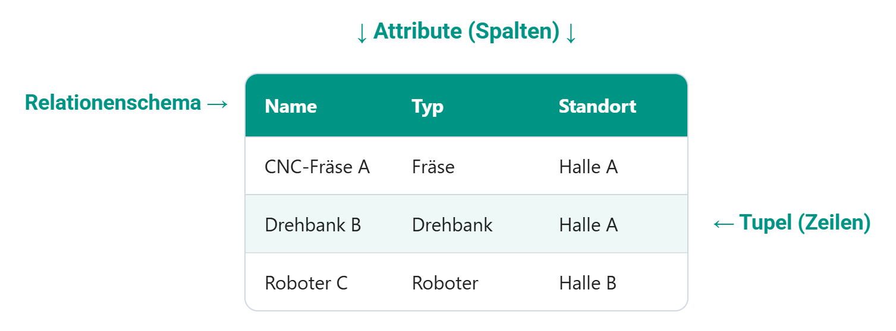
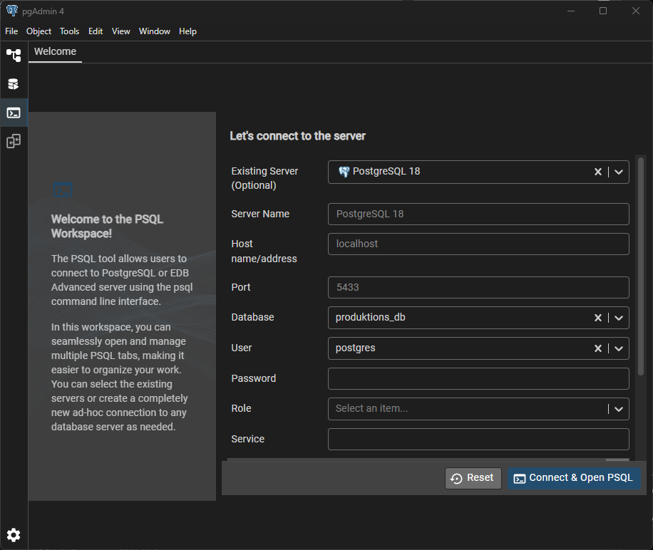
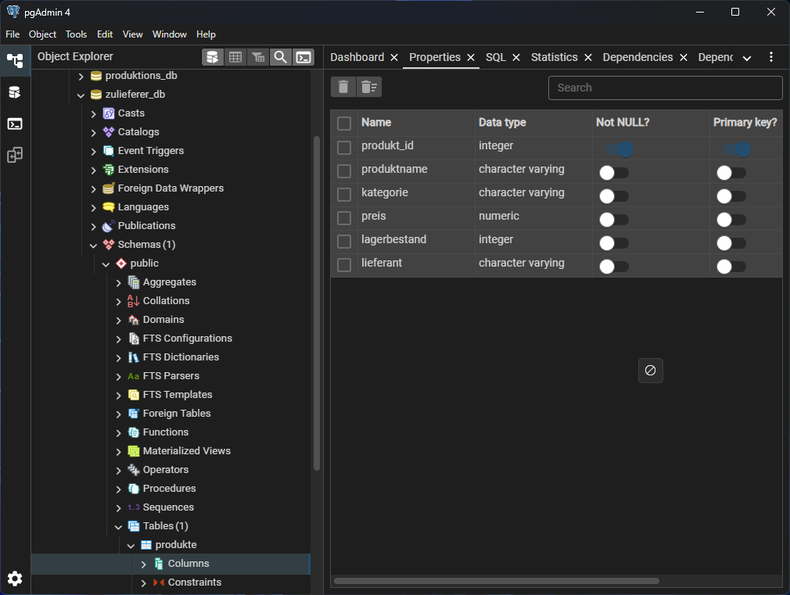

# Grundlagen des Relationalen Modells

Nachdem wir im vorherigen Kapitel Datenbanken als Lösung für strukturierte Datenhaltung kennengelernt und PostgreSQL installiert haben, wird es jetzt konkret: Wie werden Daten in einer relationalen Datenbank organisiert?

Die Antwort: In **Tabellen**!

---

## Das relationale Modell

Eine **relationale Datenbank** organisiert Daten in **Tabellen** (auch Relationen genannt). Jede Tabelle besitzt einen Namen (**Relationennamen**) und besteht aus:

<div style="text-align: center;">
    
</div>

???+ defi "Relationale Datenbank"
    Eine Relationale Datenbank wird wiefolgt beschrieben:

    - **Tupel** (auch Zeilen oder Datensätze genannt) - repräsentieren einzelne Objekte oder Einträge
    - **Attribute** (auch Spalten oder Felder genannt) - beschreiben Eigenschaften dieser Objekte
    - **Relationenschema** - Menge von Attributen
    - **Relationenname** - Name der Tabelle

---

## Datentypen in PostgreSQL

Jede Spalte einer Tabelle hat einen **Datentyp**, der festlegt, welche Art von Daten gespeichert werden kann. PostgreSQL bietet eine Vielzahl von Datentypen (siehe [Dokumentation](https://www.postgresql.org/docs/current/datatype.html)) - wir konzentrieren uns zunächst auf die wichtigsten:

### Textdaten

<div style="text-align:center; max-width:820px; margin:16px auto;">
<table role="table"
       style="width:100%; border-collapse:separate; border-spacing:0; border:1px solid #cfd8e3; border-radius:10px; overflow:hidden; font-family:system-ui,sans-serif;">
    <thead>
    <tr style="background:#009485; color:#fff;">
        <th style="text-align:left; padding:12px 14px; font-weight:700;">Datentyp</th>
        <th style="text-align:left; padding:12px 14px; font-weight:700;">Beschreibung</th>
        <th style="text-align:left; padding:12px 14px; font-weight:700;">Beispiel</th>
    </tr>
    </thead>
    <tbody>
    <tr>
        <td style="background:#00948511; padding:10px 14px;"><code>VARCHAR(n)</code></td>
        <td style="padding:10px 14px;">Zeichenkette mit max. <code>n</code> Zeichen</td>
        <td style="padding:10px 14px;"><code>'Hydraulikzylinder'</code></td>
    </tr>
    <tr>
        <td style="background:#00948511; padding:10px 14px;"><code>TEXT</code></td>
        <td style="padding:10px 14px;">Zeichenkette unbegrenzter Länge</td>
        <td style="padding:10px 14px;"><code>'Ein langer Text...'</code></td>
    </tr>
    <tr>
        <td style="background:#00948511; padding:10px 14px;"><code>CHAR(n)</code></td>
        <td style="padding:10px 14px;">Zeichenkette mit fixer Länge <code>n</code></td>
        <td style="padding:10px 14px;"><code>'DE'</code> (Länderkürzel)</td>
    </tr>
    </tbody>
</table>
</div>

### Zahlen

<div style="text-align:center; max-width:820px; margin:16px auto;">
<table role="table"
       style="width:100%; border-collapse:separate; border-spacing:0; border:1px solid #cfd8e3; border-radius:10px; overflow:hidden; font-family:system-ui,sans-serif;">
    <thead>
    <tr style="background:#009485; color:#fff;">
        <th style="text-align:left; padding:12px 14px; font-weight:700;">Datentyp</th>
        <th style="text-align:left; padding:12px 14px; font-weight:700;">Beschreibung</th>
        <th style="text-align:left; padding:12px 14px; font-weight:700;">Beispiel</th>
    </tr>
    </thead>
    <tbody>
    <tr>
        <td style="background:#00948511; padding:10px 14px;"><code>INTEGER</code></td>
        <td style="padding:10px 14px;">Ganze Zahl (-2.147.483.648 bis 2.147.483.647)</td>
        <td style="padding:10px 14px;"><code>42</code>, <code>-17</code></td>
    </tr>
    <tr>
        <td style="background:#00948511; padding:10px 14px;"><code>SMALLINT</code></td>
        <td style="padding:10px 14px;">Kleine ganze Zahl (-32.768 bis 32.767)</td>
        <td style="padding:10px 14px;"><code>5</code></td>
    </tr>
    <tr>
        <td style="background:#00948511; padding:10px 14px;"><code>BIGINT</code></td>
        <td style="padding:10px 14px;">Große ganze Zahl (-9.223.372.036.854.775.808 bis 9.223.372.036.854.775.807)</td>
        <td style="padding:10px 14px;"><code>9876543210</code></td>
    </tr>
    <tr>
        <td style="background:#00948511; padding:10px 14px;"><code>NUMERIC(p,d)</code></td>
        <td style="padding:10px 14px;">Festkommazahl (<code>p</code> Gesamtstellen, <code>d</code> Nachkommastellen)</td>
        <td style="padding:10px 14px;"><code>123.45</code></td>
    </tr>
    <tr>
        <td style="background:#00948511; padding:10px 14px;"><code>REAL</code></td>
        <td style="padding:10px 14px;">Gleitkommazahl (einfache Genauigkeit)</td>
        <td style="padding:10px 14px;"><code>3.14159</code></td>
    </tr>
    </tbody>
</table>
</div>

???+ defi "Signed / Unsigned"
    Generell unterschiedet man bei ganzzahligen Datentypen zwischen **signed** (vorzeichenbehaftet) und **unsigned** (vorzeichenlos):

    **Signed (vorzeichenbehaftet)**:

    - Kann **positive und negative** Zahlen speichern
    - Beispiel `INTEGER`: -2.147.483.648 bis +2.147.483.647
    - Das erste Bit (Vorzeichenbit) bestimmt, ob die Zahl positiv oder negativ ist

    **Unsigned (vorzeichenlos)**:

    - Kann **nur positive** Zahlen speichern (inkl. 0)
    - Würde bei `INTEGER` theoretisch 0 bis 4.294.967.295 ermöglichen

    **Wichtig:** PostgreSQL unterstützt standardmäßig **keine unsigned-Typen**!

### Datum & Zeit

<div style="text-align:center; max-width:820px; margin:16px auto;">
<table role="table"
       style="width:100%; border-collapse:separate; border-spacing:0; border:1px solid #cfd8e3; border-radius:10px; overflow:hidden; font-family:system-ui,sans-serif;">
    <thead>
    <tr style="background:#009485; color:#fff;">
        <th style="text-align:left; padding:12px 14px; font-weight:700;">Datentyp</th>
        <th style="text-align:left; padding:12px 14px; font-weight:700;">Beschreibung</th>
        <th style="text-align:left; padding:12px 14px; font-weight:700;">Beispiel</th>
    </tr>
    </thead>
    <tbody>
    <tr>
        <td style="background:#00948511; padding:10px 14px;"><code>DATE</code></td>
        <td style="padding:10px 14px;">Datum (ohne Uhrzeit)</td>
        <td style="padding:10px 14px;"><code>'2024-03-15'</code></td>
    </tr>
    <tr>
        <td style="background:#00948511; padding:10px 14px;"><code>TIME</code></td>
        <td style="padding:10px 14px;">Uhrzeit (ohne Datum)</td>
        <td style="padding:10px 14px;"><code>'14:30:00'</code></td>
    </tr>
    <tr>
        <td style="background:#00948511; padding:10px 14px;"><code>TIMESTAMP</code></td>
        <td style="padding:10px 14px;">Datum und Uhrzeit</td>
        <td style="padding:10px 14px;"><code>'2024-03-15 14:30:00'</code></td>
    </tr>
    </tbody>
</table>
</div>

### Sonstige

<div style="text-align:center; max-width:820px; margin:16px auto;">
<table role="table"
       style="width:100%; border-collapse:separate; border-spacing:0; border:1px solid #cfd8e3; border-radius:10px; overflow:hidden; font-family:system-ui,sans-serif;">
    <thead>
    <tr style="background:#009485; color:#fff;">
        <th style="text-align:left; padding:12px 14px; font-weight:700;">Datentyp</th>
        <th style="text-align:left; padding:12px 14px; font-weight:700;">Beschreibung</th>
        <th style="text-align:left; padding:12px 14px; font-weight:700;">Beispiel</th>
    </tr>
    </thead>
    <tbody>
    <tr>
        <td style="background:#00948511; padding:10px 14px;"><code>BOOLEAN</code></td>
        <td style="padding:10px 14px;">Wahrheitswert (wahr/falsch)</td>
        <td style="padding:10px 14px;"><code>TRUE</code>, <code>FALSE</code></td>
    </tr>
    <tr>
        <td style="background:#00948511; padding:10px 14px;"><code>SERIAL</code></td>
        <td style="padding:10px 14px;">Auto-inkrementierende Ganzzahl</td>
        <td style="padding:10px 14px;"><code>1, 2, 3, ...</code></td>
    </tr>
    </tbody>
</table>
</div>

---

## Der Primärschlüssel

Stellen wir uns vor, ein Maschinenbau-Zulieferer hat zwei Produkte mit der Bezeichnung "Hydraulikzylinder Standard". Beide kosten 450 Euro und gehören zur Kategorie "Hydraulik". Wie können wir diese beiden Produkte in unserer Datenbank eindeutig voneinander unterscheiden? Was passiert, wenn wir eine Bestellung für das erste Produkt erfassen wollen - wie weiß die Datenbank, welches der beiden gemeint ist?

Genau hier kommt der **Primärschlüssel** (engl. Primary Key) ins Spiel!

Ein **Primärschlüssel** ist eine Spalte (oder eine Kombination mehrerer Spalten), die jeden Datensatz in einer Tabelle **eindeutig identifiziert**. Er funktioniert wie eine Artikelnummer oder Seriennummer: Jedes Produkt, jeder Auftrag, jede Bestellung erhält einen einzigartigen Wert, über den es jederzeit zweifelsfrei identifiziert werden kann.

In unserem Beispiel würden wir den beiden Hydraulikzylindern unterschiedliche Produkt-IDs zuweisen - etwa `produkt_id = 101` für das erste und `produkt_id = 105` für das zweite Produkt. Selbst wenn beide dieselbe Bezeichnung, Kategorie und denselben Preis haben, sind sie durch ihre ID eindeutig unterscheidbar.

???+ defi "Primärschlüssel (Primary Key)"
    Ein **Primärschlüssel** ist ein Attribut (oder eine Kombination von Attributen), das jeden Datensatz in einer Tabelle eindeutig identifiziert.

    **Eigenschaften eines Primärschlüssels:**

    - **Eindeutig** - Kein Wert darf in der Tabelle doppelt vorkommen
    - **Nicht NULL** - Jeder Datensatz muss einen Wert haben (leere Einträge sind nicht erlaubt)
    - **Unveränderlich** - Sollte sich idealerweise nie ändern, um Konsistenz zu gewährleisten

    **Beispiele aus der Praxis:**

    - **Produkt-ID** für Artikel (z.B. `101`, `102`, ...)
    - **Auftragsnummer** für Bestellungen (z.B. `AUF-2024-00123`)
    - **Artikelnummer** für Lagerteile (z.B. `HYD-001`, `PNE-042`)
    - **Kunden-ID** für Geschäftspartner (z.B. `K1042`)

### Warum sind Primärschlüssel wichtig?

Ohne Primärschlüssel würde es in der Datenbank schnell zu Chaos kommen. Ohne eindeutige Identifikation wäre eine verlässliche Datenverwaltung unmöglich. Der Primärschlüssel sorgt dafür, dass:

- **Datensätze eindeutig identifiziert** werden können
- **Verknüpfungen zwischen Tabellen** funktionieren (mehr dazu später bei Fremdschlüsseln)
- **Keine Duplikate** entstehen können
- **Daten konsistent** bleiben, selbst wenn andere Werte geändert werden

In der Praxis verwendet man häufig eine **fortlaufende Nummer** (1, 2, 3, ...) als Primärschlüssel, da diese automatisch eindeutig ist und sich nie ändert - selbst wenn die Produktbezeichnung oder der Preis später angepasst wird.

<div style="text-align: center;">
    
    <figcaption>Quelle: <a href="https://i.imgflip.com/aadzku.jpg">Imgflip</a></figcaption>
</div>

---

## Erstellen einer Tabelle

Nun wollen wir in die Praxis einsteigen und unsere erste Tabelle erstellen. In diesem Kapitel verwenden wir als Beispiel einen **Produktkatalog eines Maschinenbau-Zulieferers**.

### Datenbankgrundlage erstellen

Bevor wir starten, erstellen wir eine neue Datenbank für unser Beispiel. Dazu verbinden wir uns zuerst zu einer bereits bestehenden Datenbank unseres Servers. Dafür sollten wir bereits die Datenbanken `produktions_db` (aus dem vorigen Kapitel) und `postgres` (standardmäßig vorhanden) haben:

???+ info "Verbindung zur Datenbank"

    **Option 1: pgAdmin**

    Wechsle zu pgAdmin in das *PSQL Tool Workspace* und wähle die Datenbank `produktions_db` oder `postgres` aus.

    <div style="text-align: center;">
        
    </div>

    **Option 2: Terminal / Kommandozeile**

    Alternativ kannst du über das Terminal (macOS) oder die Kommandozeile (Windows) die Verbindung herstellen:

    ```bash
    psql -h localhost -p 5432 -U postgres -d produktions_db
    ```

Anschließend erstellen wir eine neue Datenbank für unser Beispiel in diesem Kapitel: 

???+ example "Zulieferer Datenbank erstellen"
    ```sql
    -- Datenbank erstellen
    CREATE DATABASE zulieferer_db;

    -- Mit der Datenbank verbinden
    \c zulieferer_db
    ```

    ```{.cmd .no-copy title="Output"}
    You are now connected to database "zulieferer_db" as user "postgres"
    ``` 

    Der Befehl `\c` ist ein psql-Befehl, der uns zur angegebenen Datenbank wechselt.


### Erstellen (CREATE TABLE)

Beim **Erstellen der Tabelle** verwenden wir den Befehl `CREATE TABLE`. Nach dem Befehl folgt der Name der Tabelle und anschließend die **Attribute** der Tabelle in Klammern. Jedes Attribut hat einen Namen und einen Datentyp und wird durch ein Komma getrennt. 

```sql { .yaml .no-copy }
CREATE TABLE tabellenname (
    attribut1 typ,
    attribut2 typ,
    ...
);
```

???+ example "Produktkatalog"

    ```sql { .annotate }
    CREATE TABLE produkte ( --(1)!
        produkt_id INTEGER PRIMARY KEY, --(2)!
        produktname VARCHAR(100), --(3)!
        kategorie VARCHAR(50), --(4)!
        preis NUMERIC(10,2), --(5)!
        lagerbestand INTEGER, --(6)!
        lieferant VARCHAR(100) --(7)!
    );
    ```

    1. Erstelle eine Tabelle mit dem Namen "produkte"
    2. Spalte für die Produkt-ID (Primärschlüssel = eindeutig!)
    3. Produktname (max. 100 Zeichen)
    4. Produktkategorie (z.B. "Hydraulik", "Pneumatik", max 50 Zeichen)
    5. Preis (10 Gesamtstellen, 2 Nachkommastellen)
    6. Aktueller Lagerbestand (ganze Zahl)
    7. Name des Lieferanten (max 100 Zeichen)

    ```{.cmd .no-copy title="Output"}
    CREATE TABLE
    ```


Den **Primärschlüssel** haben wir dabei mit Hilfe des Befehls `PRIMARY KEY` auf das Attribut `produkt_id` gesetzt.

Wenn der Befehl erfolgreich ausgeführt wurde, sollte die Tabelle in der Datenbank angezeigt werden (*Default Workspace* > ... > *zulieferer_db* > *Schemas* > *public* > *Tables*).

<div style="text-align: center;">
    
</div>

### Daten einfügen (INSERT)

Eine leere Tabelle ist meist nicht das Ziel. Daher müssen wir uns nun ansehen, wie wir Daten (Zeilen / Tupel) in unsere nun bestehende Tabelle einfügen können. Dazu gibt es in SQL den `INSERT` Befehl.

```sql { .yaml .no-copy }
INSERT INTO tabellenname (attribut1, attribut2, ...)
VALUES (wert1, wert2, ...);
```

???+ example "Produkte einfügen"

    ```sql
    INSERT INTO produkte (
        produkt_id, produktname, kategorie, preis, lagerbestand, lieferant
    )
    VALUES
    (101, 'Hydraulikzylinder Standard', 'Hydraulik', 450.00, 25, 'Bosch Rexroth'),
    (102, 'Pneumatikventil 5/2-Wege', 'Pneumatik', 89.50, 50, 'Festo AG'),
    (103, 'Kugelgewindetriebe KGT40', 'Mechanik', 780.00, 12, 'THK GmbH'),
    (104, 'Servomotor 3kW', 'Antriebstechnik', 1250.00, 8, 'Siemens AG'),
    (105, 'Näherungsschalter induktiv', 'Sensorik', 35.90, 100, 'Sick AG');
    ```

    ```{.cmd .no-copy title="Output"}
    INSERT 0 5
    ```


???+ info "Datentyp beachten"
    - Textwerte müssen in einfachen Anführungszeichen stehen: `'Text'`
    - Zahlen stehen ohne Anführungszeichen: `42` oder `123.45`

### Daten abfragen (SELECT)

Nachdem wir nun eine befüllte Tabelle vor uns haben, ist die nächste Aufgabe klar: wir wollen die Daten aus der Datenbank auslesen/abrufen. Dazu verwenden wir den `SELECT` Befehl:


```sql { .yaml .no-copy }
SELECT * FROM tabellenname;
```

???+ example "Alle Produkte anzeigen"
    ```sql
    SELECT * FROM produkte;
    ```

    ```{.cmd .no-copy title="Output"}
     produkt_id |         produktname          |    kategorie     |  preis  | lagerbestand |   lieferant
    ------------+------------------------------+------------------+---------+--------------+----------------
            101 | Hydraulikzylinder Standard   | Hydraulik        | 450.00  |           25 | Bosch Rexroth
            102 | Pneumatikventil 5/2-Wege     | Pneumatik        |  89.50  |           50 | Festo AG
            103 | Kugelgewindetriebe KGT40     | Mechanik         | 780.00  |           12 | THK GmbH
            104 | Servomotor 3kW               | Antriebstechnik  | 1250.00 |            8 | Siemens AG
            105 | Näherungsschalter induktiv   | Sensorik         |  35.90  |          100 | Sick AG
    (5 rows)
    ```

???+ info "Der * Operator"
    Das `*` (Sternchen) ist ein Platzhalter für "alle Spalten". Es ist praktisch für schnelle Abfragen, aber in der Praxis sollte man die benötigten Spalten explizit angeben, da sonst unnötig Daten übertragen werden müssen.


    ```sql { .yaml .no-copy }
    SELECT attribut1, attribut2 FROM tabellenname;
    ```


    ???+ example "Bestimmte Spalten anzeigen"
        ```sql
        SELECT produktname, kategorie, preis FROM produkte;
        ```

        ```{.cmd .no-copy title="Output"}
                produktname          |    kategorie     | preis
        -----------------------------+------------------+--------
        Hydraulikzylinder Standard   | Hydraulik        | 450.00
        Pneumatikventil 5/2-Wege     | Pneumatik        |  89.50
        Kugelgewindetriebe KGT40     | Mechanik         | 780.00
        Servomotor 3kW               | Antriebstechnik  | 1250.00
        Näherungsschalter induktiv   | Sensorik         |  35.90
        (5 rows)
        ```


---

## Übung ✍️

Jetzt geht es darum, das Erlernte in einem **praxisnahen Projekt** anzuwenden. In diesem und den folgenden Kapiteln baust du Schritt für Schritt ein **Produktionsplanungssystem** für einen mittelständischen Fertigungsbetrieb auf.

Die **TecGuy GmbH** ist ein mittelständisches Fertigungsunternehmen, das Präzisionsteile für die Automobilindustrie herstellt. Das Unternehmen möchte ein digitales System zur Verwaltung seiner Produktionsaufträge und Produktionsmaschinen aufbauen.

In diesem Kapitel startest du mit den **ersten beiden Tabellen**: Produktionsaufträge und Maschinen.

---

???+ info "Übungsvorbereitung - Datenbank zurücksetzen"

    Falls du neu startest oder die Übung wiederholen möchtest, führe dieses Setup aus.
    Es löscht alle bestehenden Daten und erstellt den korrekten Ausgangszustand für dieses Kapitel.

    ```sql
    -- Zu anderer Datenbank wechseln
    \c postgres

    -- Datenbank löschen falls vorhanden
    DROP DATABASE IF EXISTS produktionsplanung_db;
    ```

    **Hinweis:** Ab jetzt kannst du direkt mit Aufgabe 1 starten.

---

???+ question "Aufgabe 1: Datenbank und Tabellen erstellen"

    **Schritt 1:** Erstelle eine neue Datenbank für das Projekt:

    ```sql
    CREATE DATABASE produktionsplanung_db;
    \c produktionsplanung_db
    ```

    **Schritt 2:** Erstelle eine Tabelle `produktionsauftraege` mit folgenden Spalten:

    - `auftrag_id` (INTEGER, Primärschlüssel)
    - `auftragsnummer` (VARCHAR(20))
    - `kunde` (VARCHAR(100))
    - `produkt` (VARCHAR(100))
    - `menge` (INTEGER)
    - `startdatum` (DATE)
    - `lieferdatum` (DATE)
    - `status` (VARCHAR(20))
    - `maschinen_id` (INTEGER)

    **Schritt 3:** Erstelle eine Tabelle `maschinen` mit folgenden Spalten:

    - `maschinen_id` (INTEGER, Primärschlüssel)
    - `maschinenname` (VARCHAR(100))
    - `maschinentyp` (VARCHAR(50))
    - `produktionshalle` (VARCHAR(50))
    - `anschaffungsjahr` (INTEGER)
    - `maschinenstatus` (VARCHAR(20))
    - `wartungsintervall_tage` (INTEGER)

    ??? info "💡 Tip anzeigen"
        Verwende `CREATE TABLE`

        ??? info "⚡ Lösung anzeigen"
            ```sql
            -- Tabelle für Produktionsaufträge
            CREATE TABLE produktionsauftraege (
                auftrag_id INTEGER PRIMARY KEY,
                auftragsnummer VARCHAR(20),
                kunde VARCHAR(100),
                produkt VARCHAR(100),
                menge INTEGER,
                startdatum DATE,
                lieferdatum DATE,
                status VARCHAR(20),
                maschinen_id INTEGER
            );

            -- Tabelle für Produktionsmaschinen
            CREATE TABLE maschinen (
                maschinen_id INTEGER PRIMARY KEY,
                maschinenname VARCHAR(100),
                maschinentyp VARCHAR(50),
                produktionshalle VARCHAR(50),
                anschaffungsjahr INTEGER,
                maschinenstatus VARCHAR(20),
                wartungsintervall_tage INTEGER
            );
            ```

    

???+ question "Aufgabe 2: Daten einfügen"

    **Teil A:** Füge folgende Maschinen in die Tabelle `maschinen` ein:

    <div style="text-align:center; max-width:1100px; margin:16px auto;">
    <table role="table"
           style="width:100%; border-collapse:separate; border-spacing:0; border:1px solid #cfd8e3; border-radius:10px; overflow:hidden; font-family:system-ui,sans-serif;">
        <thead>
        <tr style="background:#009485; color:#fff;">
            <th style="text-align:left; padding:12px 14px; font-weight:700;">maschinen_id</th>
            <th style="text-align:left; padding:12px 14px; font-weight:700;">maschinenname</th>
            <th style="text-align:left; padding:12px 14px; font-weight:700;">maschinentyp</th>
            <th style="text-align:left; padding:12px 14px; font-weight:700;">produktionshalle</th>
            <th style="text-align:left; padding:12px 14px; font-weight:700;">anschaffungsjahr</th>
            <th style="text-align:left; padding:12px 14px; font-weight:700;">maschinenstatus</th>
            <th style="text-align:left; padding:12px 14px; font-weight:700;">wartungsintervall_tage</th>
        </tr>
        </thead>
        <tbody>
        <tr>
            <td style="background:#00948511; padding:10px 14px;">1</td>
            <td style="padding:10px 14px;">CNC-Fraese Alpha</td>
            <td style="padding:10px 14px;">CNC-Fraese</td>
            <td style="padding:10px 14px;">Halle A</td>
            <td style="padding:10px 14px;">2020</td>
            <td style="padding:10px 14px;">Aktiv</td>
            <td style="padding:10px 14px;">90</td>
        </tr>
        <tr>
            <td style="background:#00948511; padding:10px 14px;">2</td>
            <td style="padding:10px 14px;">Drehbank Delta</td>
            <td style="padding:10px 14px;">Drehbank</td>
            <td style="padding:10px 14px;">Halle A</td>
            <td style="padding:10px 14px;">2018</td>
            <td style="padding:10px 14px;">Aktiv</td>
            <td style="padding:10px 14px;">120</td>
        </tr>
        <tr>
            <td style="background:#00948511; padding:10px 14px;">3</td>
            <td style="padding:10px 14px;">Presse Gamma</td>
            <td style="padding:10px 14px;">Presse</td>
            <td style="padding:10px 14px;">Halle B</td>
            <td style="padding:10px 14px;">2019</td>
            <td style="padding:10px 14px;">Wartung</td>
            <td style="padding:10px 14px;">60</td>
        </tr>
        <tr>
            <td style="background:#00948511; padding:10px 14px;">4</td>
            <td style="padding:10px 14px;">Schweissroboter Beta</td>
            <td style="padding:10px 14px;">Schweissroboter</td>
            <td style="padding:10px 14px;">Halle C</td>
            <td style="padding:10px 14px;">2021</td>
            <td style="padding:10px 14px;">Aktiv</td>
            <td style="padding:10px 14px;">90</td>
        </tr>
        </tbody>
    </table>
    </div>

    **Teil B:** Füge folgende Produktionsaufträge in die Tabelle `produktionsauftraege` ein:

    <div style="text-align:center; max-width:1200px; margin:16px auto;">
    <table role="table"
           style="width:100%; border-collapse:separate; border-spacing:0; border:1px solid #cfd8e3; border-radius:10px; overflow:hidden; font-family:system-ui,sans-serif;">
        <thead>
        <tr style="background:#009485; color:#fff;">
            <th style="text-align:left; padding:12px 14px; font-weight:700;">auftrag_id</th>
            <th style="text-align:left; padding:12px 14px; font-weight:700;">auftragsnummer</th>
            <th style="text-align:left; padding:12px 14px; font-weight:700;">kunde</th>
            <th style="text-align:left; padding:12px 14px; font-weight:700;">produkt</th>
            <th style="text-align:left; padding:12px 14px; font-weight:700;">menge</th>
            <th style="text-align:left; padding:12px 14px; font-weight:700;">startdatum</th>
            <th style="text-align:left; padding:12px 14px; font-weight:700;">lieferdatum</th>
            <th style="text-align:left; padding:12px 14px; font-weight:700;">status</th>
            <th style="text-align:left; padding:12px 14px; font-weight:700;">maschinen_id</th>
        </tr>
        </thead>
        <tbody>
        <tr>
            <td style="background:#00948511; padding:10px 14px;">1</td>
            <td style="padding:10px 14px;">AUF-2024-001</td>
            <td style="padding:10px 14px;">BMW AG</td>
            <td style="padding:10px 14px;">Getriebegehäuse</td>
            <td style="padding:10px 14px;">500</td>
            <td style="padding:10px 14px;">2024-04-01</td>
            <td style="padding:10px 14px;">2024-04-15</td>
            <td style="padding:10px 14px;">In Produktion</td>
            <td style="padding:10px 14px;">1</td>
        </tr>
        <tr>
            <td style="background:#00948511; padding:10px 14px;">2</td>
            <td style="padding:10px 14px;">AUF-2024-002</td>
            <td style="padding:10px 14px;">Audi AG</td>
            <td style="padding:10px 14px;">Kurbelwelle</td>
            <td style="padding:10px 14px;">200</td>
            <td style="padding:10px 14px;">2024-04-10</td>
            <td style="padding:10px 14px;">2024-04-20</td>
            <td style="padding:10px 14px;">Geplant</td>
            <td style="padding:10px 14px;">2</td>
        </tr>
        <tr>
            <td style="background:#00948511; padding:10px 14px;">3</td>
            <td style="padding:10px 14px;">AUF-2024-003</td>
            <td style="padding:10px 14px;">Mercedes-Benz</td>
            <td style="padding:10px 14px;">Pleuelstange</td>
            <td style="padding:10px 14px;">350</td>
            <td style="padding:10px 14px;">2024-04-05</td>
            <td style="padding:10px 14px;">2024-04-18</td>
            <td style="padding:10px 14px;">In Produktion</td>
            <td style="padding:10px 14px;">2</td>
        </tr>
        <tr>
            <td style="background:#00948511; padding:10px 14px;">4</td>
            <td style="padding:10px 14px;">AUF-2024-004</td>
            <td style="padding:10px 14px;">Porsche AG</td>
            <td style="padding:10px 14px;">Kolben</td>
            <td style="padding:10px 14px;">150</td>
            <td style="padding:10px 14px;">2024-04-12</td>
            <td style="padding:10px 14px;">2024-04-25</td>
            <td style="padding:10px 14px;">Geplant</td>
            <td style="padding:10px 14px;">4</td>
        </tr>
        </tbody>
    </table>
    </div>

    ??? info "💡 Tip anzeigen"
        Verwende `INSERT INTO` & `VALUES`

        ??? info "⚡ Lösung anzeigen"
            ```sql
            -- Maschinen einfügen
            INSERT INTO maschinen (
                maschinen_id, maschinenname, maschinentyp, produktionshalle,
                anschaffungsjahr, maschinenstatus, wartungsintervall_tage
            )
            VALUES
            (1, 'CNC-Fraese Alpha', 'CNC-Fraese', 'Halle A', 2020, 'Aktiv', 90),
            (2, 'Drehbank Delta', 'Drehbank', 'Halle A', 2018, 'Aktiv', 120),
            (3, 'Presse Gamma', 'Presse', 'Halle B', 2019, 'Wartung', 60),
            (4, 'Schweissroboter Beta', 'Schweissroboter', 'Halle C', 2021, 'Aktiv', 90);

            -- Produktionsaufträge einfügen
            INSERT INTO produktionsauftraege (
                auftrag_id, auftragsnummer, kunde, produkt, menge,
                startdatum, lieferdatum, status, maschinen_id
            )
            VALUES
            (1, 'AUF-2024-001', 'BMW AG', 'Getriebegehäuse', 500, '2024-04-01', '2024-04-15', 'In Produktion', 1),
            (2, 'AUF-2024-002', 'Audi AG', 'Kurbelwelle', 200, '2024-04-10', '2024-04-20', 'Geplant', 2),
            (3, 'AUF-2024-003', 'Mercedes-Benz', 'Pleuelstange', 350, '2024-04-05', '2024-04-18', 'In Produktion', 2),
            (4, 'AUF-2024-004', 'Porsche AG', 'Kolben', 150, '2024-04-12', '2024-04-25', 'Geplant', 4);
            ```

    

???+ question "Aufgabe 3: Daten abfragen"

    Führe folgende Abfragen durch:

    1. Zeige alle Produktionsaufträge an.
    2. Zeige nur Auftragsnummer, Kunde und Produkt der Aufträge an.
    3. Zeige alle Maschinen an.
    4. Zeige nur Maschinenname und Maschinentyp der Maschinen an.

    ??? info "💡 Tip anzeigen"
        1. `SELECT` & `*`
        2. `SELECT`
        3. `SELECT` & `*`
        4. `SELECT`

        ??? info "⚡ Lösung anzeigen"

            1. Alle Produktionsaufträge:
                ```sql
                SELECT * FROM produktionsauftraege;
                ```

            2. Nur bestimmte Spalten:
                ```sql
                SELECT auftragsnummer, kunde, produkt FROM produktionsauftraege;
                ```

            3. Alle Maschinen:
                ```sql
                SELECT * FROM maschinen;
                ```

            4. Nur Maschinenname und Typ:
                ```sql
                SELECT maschinenname, maschinentyp FROM maschinen;
                ```


In den folgenden Kapiteln werden wir:

- **Beziehungen** zwischen Tabellen erstellen (Foreign Keys)
- **Weitere Tabellen** hinzufügen (Wartungsprotokolle, Ersatzteile, Lager)
- **Komplexe Abfragen** durchführen (Joins, Aggregationen, Subqueries)
- **Datenintegrität** sicherstellen (Constraints, CHECK, UNIQUE)
- **Transaktionen** für sichere Operationen nutzen
- **Daten manipulieren** (UPDATE, DELETE, ALTER TABLE)

Am Ende haben wir ein vollständiges, funktionsfähiges Produktionsplanungssystem!

---

## Zusammenfassung 📌

- Das **relationale Modell** organisiert Daten in **Tabellen** mit Zeilen und Spalten
- Jede Spalte hat einen **Datentyp** (VARCHAR, INTEGER, NUMERIC, DATE, ...)
- Ein **Primärschlüssel** identifiziert jeden Datensatz eindeutig und darf nicht NULL sein
- `CREATE TABLE` erstellt eine neue Tabelle mit definierter Struktur
- `INSERT INTO` fügt neue Datensätze in eine Tabelle ein
- `SELECT` fragt Daten aus einer Tabelle ab
- `SELECT *` zeigt alle Spalten, während `SELECT attribut1, attribut2` nur bestimmte Spalten zeigt

---

Im nächsten Kapitel lernen wir, wie wir Daten **gezielt filtern, sortieren und aggregieren** können - die wahre Macht von SQL!
