```mermaid
graph LR
    A[Primärschlüssel]:::teal --> B[Identifiziert jeden<br>Datensatz eindeutig]:::peach
    A --> C[Kann nicht NULL sein]:::peach
    A --> D[Darf nicht doppelt<br>vorkommen]:::peach

    classDef peach fill:#FFB482aa,stroke:#333,stroke-width:1px;
    classDef teal fill:#009485aa,stroke:#333,stroke-width:1px;
```

# Grundlagen des Relationalen Modells

Im vorherigen Kapitel haben wir Datenbanken als Lösung für strukturierte Datenhaltung kennengelernt und PostgreSQL installiert. Jetzt wird es konkret: Wie werden Daten in einer relationalen Datenbank organisiert?

Die Antwort: In **Tabellen**!

---

## Das relationale Modell

Eine **relationale Datenbank** organisiert Daten in **Tabellen** (auch **Relationen** genannt). Jede Tabelle besteht aus:

- **Zeilen** (auch **Tupel** oder **Datensätze** genannt) – repräsentieren einzelne Objekte oder Einträge
- **Spalten** (auch **Attribute** oder **Felder** genannt) – beschreiben Eigenschaften dieser Objekte

```
                 Spalten (Attribute)
                    ↓        ↓          ↓
        ┌──────────────┬──────────┬──────────────┐
        │ Name         │ Typ      │ Standort     │  ← Tabellenkopf
        ├──────────────┼──────────┼──────────────┤
Zeilen  │ CNC-Fräse A  │ Fräse    │ Halle A      │  ← Datensatz 1 (Tupel)
(Tupel) │ Drehbank B   │ Drehbank │ Halle A      │  ← Datensatz 2
        │ Roboter C    │ Roboter  │ Halle B      │  ← Datensatz 3
        └──────────────┴──────────┴──────────────┘
```

<div style="background:#FFB48211; border-left:4px solid #FFB482; padding:12px 16px; margin:16px 0;">
<strong>📘 Terminologie</strong><br>
In der Praxis werden oft verschiedene Begriffe synonym verwendet:<br>
• <strong>Tabelle</strong> = Relation<br>
• <strong>Zeile</strong> = Datensatz = Tupel = Record<br>
• <strong>Spalte</strong> = Attribut = Feld = Column
</div>

---

## Datentypen in PostgreSQL

Jede Spalte einer Tabelle hat einen **Datentyp**, der festlegt, welche Art von Daten gespeichert werden kann. PostgreSQL bietet eine Vielzahl von Datentypen – wir konzentrieren uns zunächst auf die wichtigsten:

### Textdaten

<div style="text-align:center; max-width:820px; margin:16px auto;">
<table role="table" 
       style="width:100%; border-collapse:separate; border-spacing:0; border:1px solid #cfd8e3; border-radius:10px; overflow:hidden; font-family:system-ui,sans-serif;">
    <thead>
    <tr style="background:#009485; color:#fff;">
        <th style="text-align:left; padding:12px 14px; font-weight:700;">Datentyp</th>
        <th style="text-align:left; padding:12px 14px; font-weight:700;">Beschreibung</th>
        <th style="text-align:left; padding:12px 14px; font-weight:700;">Beispiel</th>
    </tr>
    </thead>
    <tbody>
    <tr>
        <td style="background:#00948511; padding:10px 14px;"><code>VARCHAR(n)</code></td>
        <td style="padding:10px 14px;">Zeichenkette mit max. <code>n</code> Zeichen</td>
        <td style="padding:10px 14px;"><code>'CNC-Fräse Alpha'</code></td>
    </tr>
    <tr>
        <td style="background:#00948511; padding:10px 14px;"><code>TEXT</code></td>
        <td style="padding:10px 14px;">Zeichenkette unbegrenzter Länge</td>
        <td style="padding:10px 14px;"><code>'Ein langer Text...'</code></td>
    </tr>
    <tr>
        <td style="background:#00948511; padding:10px 14px;"><code>CHAR(n)</code></td>
        <td style="padding:10px 14px;">Zeichenkette mit fixer Länge <code>n</code></td>
        <td style="padding:10px 14px;"><code>'AT'</code> (Länderkürzel)</td>
    </tr>
    </tbody>
</table>
</div>

### Zahlen

<div style="text-align:center; max-width:820px; margin:16px auto;">
<table role="table" 
       style="width:100%; border-collapse:separate; border-spacing:0; border:1px solid #cfd8e3; border-radius:10px; overflow:hidden; font-family:system-ui,sans-serif;">
    <thead>
    <tr style="background:#009485; color:#fff;">
        <th style="text-align:left; padding:12px 14px; font-weight:700;">Datentyp</th>
        <th style="text-align:left; padding:12px 14px; font-weight:700;">Beschreibung</th>
        <th style="text-align:left; padding:12px 14px; font-weight:700;">Beispiel</th>
    </tr>
    </thead>
    <tbody>
    <tr>
        <td style="background:#00948511; padding:10px 14px;"><code>INTEGER</code></td>
        <td style="padding:10px 14px;">Ganze Zahl (-2.147.483.648 bis 2.147.483.647)</td>
        <td style="padding:10px 14px;"><code>42</code>, <code>-17</code></td>
    </tr>
    <tr>
        <td style="background:#00948511; padding:10px 14px;"><code>SMALLINT</code></td>
        <td style="padding:10px 14px;">Kleine ganze Zahl (-32.768 bis 32.767)</td>
        <td style="padding:10px 14px;"><code>5</code></td>
    </tr>
    <tr>
        <td style="background:#00948511; padding:10px 14px;"><code>BIGINT</code></td>
        <td style="padding:10px 14px;">Große ganze Zahl</td>
        <td style="padding:10px 14px;"><code>9876543210</code></td>
    </tr>
    <tr>
        <td style="background:#00948511; padding:10px 14px;"><code>NUMERIC(p,d)</code></td>
        <td style="padding:10px 14px;">Festkommazahl (<code>p</code> Gesamtstellen, <code>d</code> Nachkommastellen)</td>
        <td style="padding:10px 14px;"><code>123.45</code></td>
    </tr>
    <tr>
        <td style="background:#00948511; padding:10px 14px;"><code>REAL</code></td>
        <td style="padding:10px 14px;">Gleitkommazahl (einfache Genauigkeit)</td>
        <td style="padding:10px 14px;"><code>3.14159</code></td>
    </tr>
    </tbody>
</table>
</div>

### Datum & Zeit

<div style="text-align:center; max-width:820px; margin:16px auto;">
<table role="table" 
       style="width:100%; border-collapse:separate; border-spacing:0; border:1px solid #cfd8e3; border-radius:10px; overflow:hidden; font-family:system-ui,sans-serif;">
    <thead>
    <tr style="background:#009485; color:#fff;">
        <th style="text-align:left; padding:12px 14px; font-weight:700;">Datentyp</th>
        <th style="text-align:left; padding:12px 14px; font-weight:700;">Beschreibung</th>
        <th style="text-align:left; padding:12px 14px; font-weight:700;">Beispiel</th>
    </tr>
    </thead>
    <tbody>
    <tr>
        <td style="background:#00948511; padding:10px 14px;"><code>DATE</code></td>
        <td style="padding:10px 14px;">Datum (ohne Uhrzeit)</td>
        <td style="padding:10px 14px;"><code>'2024-03-15'</code></td>
    </tr>
    <tr>
        <td style="background:#00948511; padding:10px 14px;"><code>TIME</code></td>
        <td style="padding:10px 14px;">Uhrzeit (ohne Datum)</td>
        <td style="padding:10px 14px;"><code>'14:30:00'</code></td>
    </tr>
    <tr>
        <td style="background:#00948511; padding:10px 14px;"><code>TIMESTAMP</code></td>
        <td style="padding:10px 14px;">Datum und Uhrzeit</td>
        <td style="padding:10px 14px;"><code>'2024-03-15 14:30:00'</code></td>
    </tr>
    </tbody>
</table>
</div>

### Sonstige

<div style="text-align:center; max-width:820px; margin:16px auto;">
<table role="table" 
       style="width:100%; border-collapse:separate; border-spacing:0; border:1px solid #cfd8e3; border-radius:10px; overflow:hidden; font-family:system-ui,sans-serif;">
    <thead>
    <tr style="background:#009485; color:#fff;">
        <th style="text-align:left; padding:12px 14px; font-weight:700;">Datentyp</th>
        <th style="text-align:left; padding:12px 14px; font-weight:700;">Beschreibung</th>
        <th style="text-align:left; padding:12px 14px; font-weight:700;">Beispiel</th>
    </tr>
    </thead>
    <tbody>
    <tr>
        <td style="background:#00948511; padding:10px 14px;"><code>BOOLEAN</code></td>
        <td style="padding:10px 14px;">Wahrheitswert (wahr/falsch)</td>
        <td style="padding:10px 14px;"><code>TRUE</code>, <code>FALSE</code></td>
    </tr>
    <tr>
        <td style="background:#00948511; padding:10px 14px;"><code>SERIAL</code></td>
        <td style="padding:10px 14px;">Auto-inkrementierende Ganzzahl</td>
        <td style="padding:10px 14px;"><code>1, 2, 3, ...</code></td>
    </tr>
    </tbody>
</table>
</div>

---

## Der Primärschlüssel

Stellen wir uns vor, unser Produktionsbetrieb hat zwei CNC-Fräsen mit dem Namen "CNC-Fräse Alpha". Wie können wir sie eindeutig unterscheiden?

Die Lösung: **Primärschlüssel** (Primary Key)!

Ein **Primärschlüssel** ist eine Spalte (oder Kombination von Spalten), die jeden Datensatz eindeutig identifiziert.

**Eigenschaften eines Primärschlüssels:**

- ✅ **Eindeutig** – Kein Wert darf doppelt vorkommen
- ✅ **Nicht NULL** – Jeder Datensatz muss einen Wert haben
- ✅ **Unveränderlich** – Sollte sich idealerweise nie ändern

**Beispiele für Primärschlüssel:**

- Maschinen-ID (Produktionsmaschinen)
- Auftragsnummer (Produktionsaufträge)
- Artikel-Nr. (Ersatzteile)
- Mitarbeiter-ID (Techniker)



---

## Erste Tabelle erstellen

Jetzt erstellen wir unsere erste Tabelle! Wir speichern Maschinen unseres Produktionsbetriebs.

### Schritt 1: Tabelle definieren

```sql
CREATE TABLE maschinen (
    maschinen_id INTEGER PRIMARY KEY,
    name VARCHAR(100),
    typ VARCHAR(50),
    standort VARCHAR(50),
    anschaffungsjahr INTEGER,
    status VARCHAR(20)
);
```

**Erklärung:**

- `CREATE TABLE maschinen` – Erstelle eine Tabelle mit dem Namen "maschinen"
- `maschinen_id INTEGER PRIMARY KEY` – Spalte für die Maschinen-ID (eindeutig!)
- `name VARCHAR(100)` – Maschinenname (max. 100 Zeichen)
- `typ VARCHAR(50)` – Maschinentyp (z.B. "CNC-Fräse", "Drehbank")
- `standort VARCHAR(50)` – Standort (z.B. "Halle A")
- `anschaffungsjahr INTEGER` – Jahr der Anschaffung (ganze Zahl)
- `status VARCHAR(20)` – Status (z.B. "Aktiv", "Wartung", "Defekt")

### Schritt 2: In pgAdmin ausführen

1. Öffne pgAdmin und verbinde dich mit der Datenbank `produktions_db`
2. Klicke auf **"Query Tool"** (Rechtsklick auf die Datenbank → Query Tool)
3. Kopiere den obigen Code
4. Führe ihn aus mit **F5** oder klicke auf den "Execute"-Button (▶)

<div style="background:#00948511; border-left:4px solid #009485; padding:12px 16px; margin:16px 0;">
<strong>💡 Tipp:</strong> Du kannst die Tabelle in der linken Sidebar unter "produktions_db → Schemas → public → Tables" sehen. Klicke mit rechts darauf → "View/Edit Data" → "All Rows", um die (noch leere) Tabelle zu sehen.
</div>

---

## Daten einfügen (INSERT)

Eine leere Tabelle ist langweilig – fügen wir Daten ein!

### Syntax

```sql
INSERT INTO tabellenname (spalte1, spalte2, ...)
VALUES (wert1, wert2, ...);
```

### Beispiel: Eine Maschine hinzufügen

```sql
INSERT INTO maschinen (maschinen_id, name, typ, standort, anschaffungsjahr, status)
VALUES (1, 'CNC-Fräse Alpha', 'CNC-Fräse', 'Halle A', 2019, 'Aktiv');
```

### Mehrere Datensätze auf einmal einfügen

```sql
INSERT INTO maschinen (maschinen_id, name, typ, standort, anschaffungsjahr, status)
VALUES
    (1, 'CNC-Fräse Alpha', 'CNC-Fräse', 'Halle A', 2019, 'Aktiv'),
    (2, 'Drehbank Beta', 'Drehbank', 'Halle A', 2021, 'Aktiv'),
    (3, 'Schweißroboter Gamma', 'Schweißroboter', 'Halle B', 2020, 'Wartung'),
    (4, 'Lackieranlage Delta', 'Lackieranlage', 'Halle C', 2018, 'Aktiv');
```

<div style="background:#FFB48211; border-left:4px solid #FFB482; padding:12px 16px; margin:16px 0;">
<strong>⚠️ Wichtig:</strong> Textwerte müssen in <strong>einfachen Anführungszeichen</strong> stehen: <code>'Text'</code><br>
Zahlen stehen <strong>ohne Anführungszeichen</strong>: <code>42</code>
</div>

---

## Daten abfragen (SELECT)

Jetzt haben wir Daten in der Datenbank – wie können wir sie wieder abrufen?

### Alle Daten anzeigen

```sql
SELECT * FROM maschinen;
```

**Ergebnis:**

```
 maschinen_id │ name                   │ typ             │ standort │ anschaffungsjahr │ status
──────────────┼────────────────────────┼─────────────────┼──────────┼──────────────────┼─────────
            1 │ CNC-Fräse Alpha        │ CNC-Fräse       │ Halle A  │             2019 │ Aktiv
            2 │ Drehbank Beta          │ Drehbank        │ Halle A  │             2021 │ Aktiv
            3 │ Schweißroboter Gamma   │ Schweißroboter  │ Halle B  │             2020 │ Wartung
            4 │ Lackieranlage Delta    │ Lackieranlage   │ Halle C  │             2018 │ Aktiv
```

<div style="background:#FFB48211; border-left:4px solid #FFB482; padding:12px 16px; margin:16px 0;">
<strong>📘 Was bedeutet <code>*</code>?</strong><br>
Das <code>*</code> (Sternchen) ist ein Platzhalter für "alle Spalten". Es ist praktisch für schnelle Abfragen, aber in der Praxis sollte man die benötigten Spalten explizit angeben.
</div>

### Bestimmte Spalten anzeigen

```sql
SELECT name, typ, standort FROM maschinen;
```

**Ergebnis:**

```
 name                   │ typ             │ standort
────────────────────────┼─────────────────┼──────────
 CNC-Fräse Alpha        │ CNC-Fräse       │ Halle A
 Drehbank Beta          │ Drehbank        │ Halle A
 Schweißroboter Gamma   │ Schweißroboter  │ Halle B
 Lackieranlage Delta    │ Lackieranlage   │ Halle C
```

---

## Praktische Übung 🎯

Jetzt bist du dran! Erstelle eine Tabelle für **Ersatzteile** des Produktionsbetriebs.

### Aufgabe 1: Tabelle erstellen

Erstelle eine Tabelle `ersatzteile` mit folgenden Spalten:

- `teil_id` (INTEGER, Primärschlüssel)
- `bezeichnung` (VARCHAR(100))
- `bestand` (INTEGER)
- `mindestbestand` (INTEGER)
- `preis` (NUMERIC(10,2))

<details>
<summary>💡 Lösung anzeigen</summary>

```sql
CREATE TABLE ersatzteile (
    teil_id INTEGER PRIMARY KEY,
    bezeichnung VARCHAR(100),
    bestand INTEGER,
    mindestbestand INTEGER,
    preis NUMERIC(10,2)
);
```
</details>

### Aufgabe 2: Daten einfügen

Füge folgende Ersatzteile ein:

- Teil 201: "Fräskopf Standard", Bestand 15, Mindestbestand 5, Preis 450.00
- Teil 202: "Kühlmittelfilter", Bestand 8, Mindestbestand 10, Preis 25.50
- Teil 203: "Spannbacken-Set", Bestand 12, Mindestbestand 3, Preis 180.00

<details>
<summary>💡 Lösung anzeigen</summary>

```sql
INSERT INTO ersatzteile (teil_id, bezeichnung, bestand, mindestbestand, preis)
VALUES
    (201, 'Fräskopf Standard', 15, 5, 450.00),
    (202, 'Kühlmittelfilter', 8, 10, 25.50),
    (203, 'Spannbacken-Set', 12, 3, 180.00);
```
</details>

### Aufgabe 3: Abfragen

Zeige alle Ersatzteile mit ihrem Bestand und Preis an.

<details>
<summary>💡 Lösung anzeigen</summary>

```sql
SELECT bezeichnung, bestand, preis FROM ersatzteile;
```
</details>

---

## Zusammenfassung 📌

- Das **relationale Modell** organisiert Daten in **Tabellen** mit Zeilen und Spalten
- Jede Spalte hat einen **Datentyp** (TEXT, INTEGER, DATE, BOOLEAN, ...)
- Ein **Primärschlüssel** identifiziert jeden Datensatz eindeutig und darf nicht NULL sein
- **CREATE TABLE** erstellt eine neue Tabelle mit definierter Struktur
- **INSERT INTO** fügt neue Datensätze in eine Tabelle ein
- **SELECT** fragt Daten aus einer Tabelle ab
- `SELECT *` zeigt alle Spalten, während `SELECT spalte1, spalte2` nur bestimmte Spalten zeigt

---

Im nächsten Kapitel lernen wir, wie wir Daten **gezielt filtern, sortieren und aggregieren** können – die wahre Macht von SQL!
