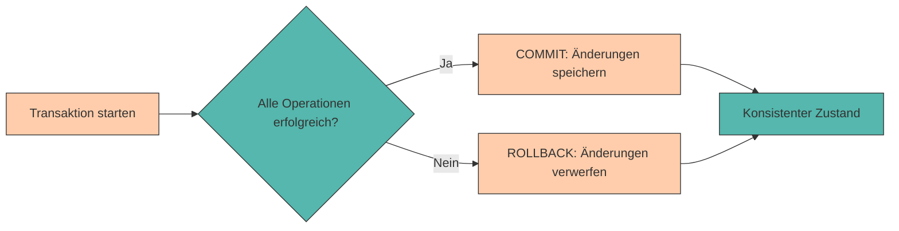

# Transaktionen & ACID

In den vorherigen Kapiteln haben wir gelernt, wie wir Daten in PostgreSQL strukturieren, abfragen und manipulieren können. Dabei haben wir immer angenommen, dass unsere Operationen erfolgreich ausgeführt werden und die Datenbank in einem konsistenten Zustand bleibt.

Doch was passiert, wenn:

- ❌ Ein **Fehler während einer Reihe von Änderungen** auftritt?
- ❌ Mehrere **Benutzer gleichzeitig** auf dieselben Daten zugreifen?
- ❌ Das **System abstürzt**, während eine Operation läuft?

In solchen Situationen reicht es nicht aus, einfach SQL-Befehle auszuführen. Wir benötigen einen Mechanismus, der sicherstellt, dass unsere Daten **konsistent und zuverlässig** bleiben. Dieser Mechanismus heißt **Transaktion**.

<div style="text-align: center;">
    
    <figcaption>Quelle: <a href="https://i.imgflip.com/acm26l.jpg">imgflip</a></figcaption>
</div>

In diesem Kapitel lernen wir, was Transaktionen sind, warum sie wichtig sind und wie wir sie in PostgreSQL verwenden. Außerdem schauen wir uns die **ACID-Prinzipien** an, die das Fundament für verlässliche Datenbanksysteme bilden.

---

## Was ist eine Transaktion?

Eine **Transaktion** ist eine **logische Einheit von Datenbankoperationen**, die entweder **vollständig ausgeführt** oder **vollständig rückgängig gemacht** wird.

Man kann sich eine Transaktion wie eine **All-or-Nothing-Operation** vorstellen:

- ✅ Entweder werden **alle Änderungen** erfolgreich durchgeführt
- ❌ Oder **keine der Änderungen** wird übernommen



---

## Warum brauchen wir Transaktionen?

Ohne Transaktionen können **inkonsistente Zustände** entstehen, die zu schwerwiegenden Problemen führen.

???+ example "Beispiel: Lagertransfer ohne Transaktion"

    Stell dir vor, wir transferieren 50 Ersatzteile vom Hauptlager ins Produktionslager:

    ```sql
    -- Schritt 1: Teile aus Hauptlager entnehmen
    UPDATE lager
    SET bestand = bestand - 50
    WHERE lager_id = 'HAUPT01';

    -- Schritt 2: Teile ins Produktionslager einbuchen
    UPDATE lager
    SET bestand = bestand + 50
    WHERE lager_id = 'PROD01';
    ```

    **❌ Problem: Was passiert, wenn zwischen diesen beiden Schritten ein Fehler auftritt?**

    - Die Teile wären aus dem **Hauptlager entnommen**
    - Aber **nicht im Produktionslager angekommen**
    - 50 Ersatzteile wären einfach verschwunden! 📦

    Mit einer **Transaktion** stellen wir sicher, dass **entweder beide** Operationen erfolgreich sind, **oder keine von beiden**.

---

## Transaktionen in PostgreSQL

In PostgreSQL verwenden wir drei Hauptbefehle für Transaktionen:

<div style="text-align:center; max-width:900px; margin:16px auto;">
<table role="table"
       style="width:100%; border-collapse:separate; border-spacing:0; border:1px solid #cfd8e3; border-radius:10px; overflow:hidden; font-family:system-ui,sans-serif;">
    <thead>
    <tr style="background:#009485; color:#fff;">
        <th style="text-align:left; padding:12px 14px; font-weight:700;">Befehl</th>
        <th style="text-align:left; padding:12px 14px; font-weight:700;">Bedeutung</th>
        <th style="text-align:left; padding:12px 14px; font-weight:700;">Verwendung</th>
    </tr>
    </thead>
    <tbody>
    <tr>
        <td style="background:#00948511; padding:10px 14px;"><code>BEGIN</code></td>
        <td style="padding:10px 14px;">Startet eine neue Transaktion</td>
        <td style="padding:10px 14px;">Am Anfang einer Transaktionsfolge</td>
    </tr>
    <tr>
        <td style="background:#00948511; padding:10px 14px;"><code>COMMIT</code></td>
        <td style="padding:10px 14px;">Speichert alle Änderungen dauerhaft</td>
        <td style="padding:10px 14px;">Nach erfolgreicher Ausführung aller Operationen</td>
    </tr>
    <tr>
        <td style="background:#00948511; padding:10px 14px;"><code>ROLLBACK</code></td>
        <td style="padding:10px 14px;">Verwirft alle Änderungen seit BEGIN</td>
        <td style="padding:10px 14px;">Bei Fehlern oder bewusstem Abbruch</td>
    </tr>
    </tbody>
</table>
</div>

Der Allgemeine Aufbau einer Transaktion ist wie folgt:

```sql { .yaml .no-copy }
BEGIN;

-- SQL-Befehle
UPDATE ...
INSERT ...
DELETE ...
SELECT ...

COMMIT;  -- oder ROLLBACK;
```

Der `BEGIN` Befehl startet zunächst eine neue Transaktion. Alle nachfolgenden SQL-Befehle werden in dieser Transaktion ausgeführt. Sollte eine Transaktion fehlschlagen, hat man anschließend die Möglichkeit die Transaktion mit `ROLLBACK` rückgängig zu machen. Sollte die Transaktion erfolgreich ausgeführt werden, kann man die Transaktion mit `COMMIT` abschließen.

---

Betrachten wir zum besseren Verständnis wieder ein praktisches Beispiel. 

???+ example "Transaktion mit `COMMIT` abschließen"

    Wir erstellen zunächst eine Beispieltabelle für unsere Lager:

    ```sql
    CREATE TABLE lager (
        lager_id VARCHAR(10) PRIMARY KEY,
        standort VARCHAR(50) NOT NULL,
        bestand INTEGER NOT NULL CHECK(bestand >= 0)
    );

    INSERT INTO lager (lager_id, standort, bestand) VALUES
    ('HAUPT01', 'Hauptlager Halle A', 200),
    ('PROD01', 'Produktionslager Halle B', 100);
    ```

    ```sql
    SELECT * FROM lager;
    ```

    ```title="Output"
    lager_id |          standort           | bestand
    ---------+-----------------------------+---------
    HAUPT01  | Hauptlager Halle A          |     200
    PROD01   | Produktionslager Halle B    |     100
    ```

    Jetzt führen wir den Transfer **mit einer Transaktion** durch:

    ```sql hl_lines="1"
    BEGIN;

    -- Schritt 1: Teile aus Hauptlager entnehmen
    UPDATE lager
    SET bestand = bestand - 50
    WHERE lager_id = 'HAUPT01';

    -- Schritt 2: Teile ins Produktionslager einbuchen
    UPDATE lager
    SET bestand = bestand + 50
    WHERE lager_id = 'PROD01';
    ```

    Überprüfen wir das Ergebnis:

    ```sql
    SELECT * FROM lager;
    ```

    ```title="Output"
    lager_id |          standort           | bestand
    ---------+-----------------------------+---------
    HAUPT01  | Hauptlager Halle A          |     150
    PROD01   | Produktionslager Halle B    |     150
    ```

    Sollte alles wie gewünscht funktioniert haben, können wir die Transaktion abschließen:

    ```sql
    COMMIT;
    ```

    ✅ **Beide Änderungen** wurden erfolgreich durchgeführt!

???+ tip "Best Practice: Transaktionen verwenden"

    Verwende Transaktionen immer dann, wenn:

    - Mehrere zusammenhängende Operationen durchgeführt werden
    - Daten zwischen Tabellen verschoben werden
    - Kritische Geschäftslogik umgesetzt wird
    - Datenintegrität oberste Priorität hat

---

Was passiert aber, wenn wir einen **Fehler bemerken** oder die Transaktion **abbrechen möchten**?

???+ example "Transaktion mit `ROLLBACK` abbrechen"

    Arbeiten wir am vorherigen Beispiel weiter und versuchen einen Fehler zu 'verursachen':

    ```sql hl_lines="1 9"
    BEGIN;

    -- Versuch eines Transfers
    UPDATE lager
    SET bestand = bestand - 50
    WHERE lager_id = 'HAUPT01';

    -- Ups, falsches Lager! Abbrechen:
    ROLLBACK;
    ```

    Überprüfen wir nun wieder den Bestand:

    ```sql
    SELECT * FROM lager WHERE lager_id = 'HAUPT01';
    ```

    ```title="Output"
    lager_id |     standort           | bestand
    ---------+------------------------+---------
    HAUPT01  | Hauptlager Halle A     |     150
    ```

    Die Änderung wurde **NICHT gespeichert**! Der Bestand ist immer noch bei 150.

Mit `ROLLBACK` werden also **alle Änderungen seit BEGIN** verworfen, als hätten sie nie stattgefunden.

---

## Automatisches Rollback bei Fehlern

PostgreSQL führt **automatisch ein ROLLBACK** durch, wenn während einer Transaktion ein Fehler auftritt.

???+ example "Automatisches Rollback bei Constraint-Verletzung"

    Wir versuchen, mehr Teile zu entnehmen, als vorhanden sind:

    ```sql hl_lines="1 8"
    BEGIN;

    UPDATE lager
    SET bestand = bestand - 50
    WHERE lager_id = 'HAUPT01';

    -- Dieser Befehl verletzt die CHECK-Constraint (Bestand darf nicht negativ sein)
    UPDATE lager
    SET bestand = bestand - 200
    WHERE lager_id = 'PROD01';  -- Fehler! Bestand würde negativ werden (-100)
    ```

    ```title="Output"
    FEHLER:  neue Zeile für Relation »lager« verletzt Check-Constraint »lager_bestand_check«
    DETAIL:  Fehlgeschlagene Zeile enthält (PROD01, Produktionslager Halle B, -100)
    ```

    PostgreSQL führt automatisch `ROLLBACK` durch – **beide Updates** werden rückgängig gemacht!

    ```sql
    SELECT * FROM lager;
    ```

    ```title="Output"
    lager_id |          standort           | bestand
    ---------+-----------------------------+---------
    HAUPT01  | Hauptlager Halle A          |     200
    PROD01   | Produktionslager Halle B    |     100
    ```

    ✅ Beide Lager haben ihre **ursprünglichen Bestände** behalten!

???+ tip "Wichtig: Atomarität"

    Sobald ein Fehler auftritt, ist die **gesamte Transaktion ungültig**. Alle Änderungen werden verworfen – das ist das **Atomaritätsprinzip** (siehe ACID weiter unten).

---

## ACID-Prinzipien

Transaktionen folgen den sogenannten **ACID-Prinzipien**. ACID ist ein Akronym und steht für:

<div style="text-align:center; max-width:900px; margin:16px auto;">
<table role="table"
       style="width:100%; border-collapse:separate; border-spacing:0; border:1px solid #cfd8e3; border-radius:10px; overflow:hidden; font-family:system-ui,sans-serif;">
    <thead>
    <tr style="background:#009485; color:#fff;">
        <th style="text-align:left; padding:12px 14px; font-weight:700;">Prinzip</th>
        <th style="text-align:left; padding:12px 14px; font-weight:700;">Bedeutung</th>
        <th style="text-align:left; padding:12px 14px; font-weight:700;">Beispiel</th>
    </tr>
    </thead>
    <tbody>
    <tr>
        <td style="background:#00948511; padding:10px 14px;"><strong>A</strong>tomicity</td>
        <td style="padding:10px 14px;">Alles oder nichts</td>
        <td style="padding:10px 14px;">Entweder beide Updates oder keines</td>
    </tr>
    <tr>
        <td style="background:#00948511; padding:10px 14px;"><strong>C</strong>onsistency</td>
        <td style="padding:10px 14px;">Datenbank bleibt konsistent</td>
        <td style="padding:10px 14px;">Gesamtbestand bleibt gleich</td>
    </tr>
    <tr>
        <td style="background:#00948511; padding:10px 14px;"><strong>I</strong>solation</td>
        <td style="padding:10px 14px;">Transaktionen laufen unabhängig</td>
        <td style="padding:10px 14px;">Andere User sehen Änderungen erst nach COMMIT</td>
    </tr>
    <tr>
        <td style="background:#00948511; padding:10px 14px;"><strong>D</strong>urability</td>
        <td style="padding:10px 14px;">Änderungen bleiben dauerhaft</td>
        <td style="padding:10px 14px;">Auch nach Systemabsturz erhalten</td>
    </tr>
    </tbody>
</table>
</div>

Schauen wir uns die einzelnen Prinzipien genauer an:

---

### A – Atomicity (Atomarität)

**Eine Transaktion ist unteilbar (atomar)**

- ✅ Entweder werden **alle Operationen** ausgeführt
- ❌ Oder **keine einzige Operation** wird übernommen
- ⚠️ Es gibt **kein "teilweise erfolgreich"**

???+ example "Beispiel: Atomarität beim Lagertransfer"

    ```sql
    BEGIN;

    -- Operation 1
    UPDATE lager SET bestand = bestand - 50 WHERE lager_id = 'HAUPT01';

    -- Operation 2
    UPDATE lager SET bestand = bestand + 50 WHERE lager_id = 'PROD01';

    COMMIT;
    ```

    **Atomarität garantiert:** Entweder werden **beide Updates** durchgeführt oder **keines von beiden**.

---

### C – Consistency (Konsistenz)

**Eine Transaktion führt die Datenbank von einem konsistenten Zustand in einen anderen konsistenten Zustand**

- ✅ Alle **Integritätsbedingungen** (Constraints) müssen erfüllt sein
- ✅ **Vor** und **nach** der Transaktion ist die Datenbank in einem gültigen Zustand

???+ example "Beispiel: Konsistenz bei Lagertransfer"

    Die Gesamtsumme aller Lagerbestände bleibt bei einem Transfer gleich:

    ```sql
    -- Vor dem Transfer
    SELECT SUM(bestand) FROM lager;
    ```

    ```title="Output"
     sum
    -----
     300
    ```

    ```sql
    BEGIN;
    UPDATE lager SET bestand = bestand - 50 WHERE lager_id = 'HAUPT01';
    UPDATE lager SET bestand = bestand + 50 WHERE lager_id = 'PROD01';
    COMMIT;

    -- Nach dem Transfer
    SELECT SUM(bestand) FROM lager;
    ```

    ```title="Output"
     sum
    -----
     300
    ```

    ✅ Die Gesamtsumme bleibt **konsistent** bei 300!

---

### I – Isolation (Isolation)

**Gleichzeitig laufende Transaktionen beeinflussen sich nicht gegenseitig**

- ✅ Jede Transaktion läuft **isoliert**, als wäre sie die einzige
- ✅ Änderungen einer Transaktion sind für andere **erst nach COMMIT sichtbar**

???+ example "Beispiel: Isolation bei parallelen Zugriffen"

    **Session 1** (Benutzer A):
    ```sql
    BEGIN;
    UPDATE lager SET bestand = bestand - 20 WHERE lager_id = 'HAUPT01';
    -- Noch kein COMMIT!
    ```

    **Session 2** (Benutzer B):
    ```sql
    SELECT bestand FROM lager WHERE lager_id = 'HAUPT01';
    ```

    ```title="Output"
    bestand
    -------
        200
    ```

    ℹ️ Benutzer B sieht immer noch **200** (den alten Wert), weil Benutzer A noch nicht committed hat!

    **Session 1** (Benutzer A):
    ```sql
    COMMIT;
    ```

    **Session 2** (Benutzer B):
    ```sql
    SELECT bestand FROM lager WHERE lager_id = 'HAUPT01';
    ```

    ```title="Output"
    bestand
    -------
        180
    ```

    ✅ Jetzt sieht Benutzer B den **neuen Wert** (180)!

---

### D – Durability (Dauerhaftigkeit)

**Einmal bestätigte Änderungen bleiben dauerhaft erhalten**

- ✅ Nach einem **COMMIT** sind die Änderungen **permanent gespeichert**
- ✅ Auch bei **Systemabstürzen** oder **Stromausfällen** gehen die Daten nicht verloren

???+ example "Beispiel: Dauerhaftigkeit"

    ```sql
    BEGIN;
    UPDATE lager SET bestand = bestand - 50 WHERE lager_id = 'HAUPT01';
    UPDATE lager SET bestand = bestand + 50 WHERE lager_id = 'PROD01';
    COMMIT;
    ```

    Nach dem `COMMIT` ist der Lagertransfer **dauerhaft gespeichert** – selbst wenn der Server sofort danach abstürzt, sind die Änderungen erhalten!

    PostgreSQL schreibt die Daten in das **Write-Ahead Log (WAL)**, um Dauerhaftigkeit zu garantieren.

---

## Übungen

???+ question "Aufgabe 1: Einfache Transaktion"

    Erstelle eine Tabelle `ersatzteillager` mit folgenden Daten:

    ```sql
    CREATE TABLE ersatzteillager (
        teil_id SERIAL PRIMARY KEY,
        teilname VARCHAR(50) NOT NULL,
        bestand INTEGER NOT NULL CHECK(bestand >= 0)
    );

    INSERT INTO ersatzteillager (teilname, bestand) VALUES
    ('Spindelmotor', 10),
    ('Kühlmittelpumpe', 50),
    ('Schweißdrahtspule', 30);
    ```

    **Aufgabe:** Führe eine Transaktion durch, die:

    1. Den Bestand von "Spindelmotor" um 2 Stück reduziert
    2. Den Bestand von "Kühlmittelpumpe" um 5 Stück erhöht
    3. Die Änderungen mit COMMIT bestätigt

    ??? info "💡 Lösung anzeigen"

        ```sql
        BEGIN;

        UPDATE ersatzteillager
        SET bestand = bestand - 2
        WHERE teilname = 'Spindelmotor';

        UPDATE ersatzteillager
        SET bestand = bestand + 5
        WHERE teilname = 'Kühlmittelpumpe';

        COMMIT;
        ```

        Überprüfung:
        ```sql
        SELECT * FROM ersatzteillager;
        ```

        ```title="Output"
         teil_id |     teilname      | bestand
        ---------+-------------------+---------
               1 | Spindelmotor      |       8
               2 | Kühlmittelpumpe   |      55
               3 | Schweißdrahtspule |      30
        ```

???+ question "Aufgabe 2: Rollback bei Fehler"

    **Aufgabe:** Versuche, den Bestand von "Schweißdrahtspule" um 50 Stück zu reduzieren (was einen negativen Bestand ergeben würde). Beobachte, was passiert.

    ??? info "💡 Lösung anzeigen"

        ```sql
        BEGIN;

        UPDATE ersatzteillager
        SET bestand = bestand - 50
        WHERE teilname = 'Schweißdrahtspule';
        ```

        ```title="Output"
        FEHLER:  neue Zeile für Relation »ersatzteillager« verletzt Check-Constraint »ersatzteillager_bestand_check«
        DETAIL:  Fehlgeschlagene Zeile enthält (3, Schweißdrahtspule, -20)
        ```

        PostgreSQL führt **automatisch ROLLBACK** durch – die Änderung wird nicht gespeichert!

        ```sql
        SELECT bestand FROM ersatzteillager WHERE teilname = 'Schweißdrahtspule';
        ```

        ```title="Output"
        bestand
        -------
             30
        ```

        ✅ Der Bestand bleibt bei **30** – die fehlerhafte Operation wurde nicht durchgeführt.

???+ question "Aufgabe 3: Mehrere Operationen"

    Erstelle folgende Tabellen:

    ```sql
    CREATE TABLE maschinen (
        maschinen_id SERIAL PRIMARY KEY,
        name VARCHAR(50) NOT NULL
    );

    CREATE TABLE wartungsauftraege (
        auftrag_id SERIAL PRIMARY KEY,
        maschinen_id INTEGER REFERENCES maschinen(maschinen_id),
        beschreibung TEXT NOT NULL,
        kosten NUMERIC(10, 2)
    );
    ```

    **Aufgabe:** Erstelle eine Transaktion, die:

    1. Eine neue Maschine "Drehbank Delta" einfügt
    2. Einen Wartungsauftrag für diese Maschine mit Beschreibung "Erstinspektion nach Installation" und Kosten von 450 Euro erstellt

    Wenn ein Fehler auftritt, sollen beide Operationen rückgängig gemacht werden.

    ??? info "💡 Lösung anzeigen"

        ```sql
        BEGIN;

        -- Neue Maschine anlegen
        INSERT INTO maschinen (name)
        VALUES ('Drehbank Delta');

        -- Wartungsauftrag für diese Maschine anlegen
        INSERT INTO wartungsauftraege (maschinen_id, beschreibung, kosten)
        VALUES (
            (SELECT maschinen_id FROM maschinen WHERE name = 'Drehbank Delta'),
            'Erstinspektion nach Installation',
            450.00
        );

        COMMIT;
        ```

        Überprüfung:
        ```sql
        SELECT m.name, w.beschreibung, w.kosten
        FROM maschinen m
        JOIN wartungsauftraege w ON m.maschinen_id = w.maschinen_id;
        ```

        ```title="Output"
              name       |          beschreibung              | kosten
        -----------------+------------------------------------+--------
         Drehbank Delta  | Erstinspektion nach Installation  | 450.00
        ```

???+ question "Aufgabe 4: Bewusster Rollback"

    **Aufgabe:** Starte eine Transaktion, füge einen neuen Datensatz "Kettenrad" mit Bestand 15 ein, überprüfe das Ergebnis mit SELECT, und mache dann die Änderung mit ROLLBACK rückgängig.

    ??? info "💡 Lösung anzeigen"

        ```sql
        BEGIN;

        INSERT INTO ersatzteillager (teilname, bestand)
        VALUES ('Kettenrad', 15);

        -- Überprüfung (nur innerhalb der Transaktion sichtbar)
        SELECT * FROM ersatzteillager WHERE teilname = 'Kettenrad';
        ```

        ```title="Output"
         teil_id | teilname  | bestand
        ---------+-----------+---------
               4 | Kettenrad |      15
        ```

        ```sql
        -- Änderung verwerfen
        ROLLBACK;

        -- Überprüfung: Der Datensatz wurde nicht gespeichert
        SELECT * FROM ersatzteillager WHERE teilname = 'Kettenrad';
        ```

        ```title="Output"
        (0 rows)
        ```

        ✅ Der Datensatz wurde **nicht gespeichert** – ROLLBACK hat die Änderung verworfen!

---

## Erweiterte Konzepte

### SAVEPOINT: Teilweiser Rollback

Ein **SAVEPOINT** ist ein Zwischenspeicherpunkt innerhalb einer Transaktion. Du kannst zu einem SAVEPOINT zurückrollen, ohne die gesamte Transaktion abzubrechen.

???+ example "SAVEPOINT verwenden"

    ```sql hl_lines="3 7"
    BEGIN;

    UPDATE lager SET bestand = bestand - 50 WHERE lager_id = 'HAUPT01';

    SAVEPOINT mein_savepoint;

    UPDATE lager SET bestand = bestand + 50 WHERE lager_id = 'PROD01';

    -- Ups, Fehler beim zweiten Update! Nur diesen rückgängig machen:
    ROLLBACK TO SAVEPOINT mein_savepoint;

    -- Der erste UPDATE bleibt erhalten, der zweite wurde rückgängig gemacht
    COMMIT;
    ```

    ✅ Das erste Update (HAUPT01) wurde durchgeführt, das zweite (PROD01) wurde verworfen.

???+ tip "Wann SAVEPOINT verwenden?"

    SAVEPOINT ist nützlich für:

    - ✅ Komplexe Transaktionen mit mehreren Schritten
    - ✅ Wenn du nur Teile einer Transaktion rückgängig machen möchtest
    - ✅ Verschachtelte Transaktionslogik
    - ✅ Fehlerbehandlung in Stored Procedures

---

## Zusammenfassung 📌

- Eine **Transaktion** ist eine Gruppe von Operationen, die entweder vollständig ausgeführt oder vollständig rückgängig gemacht wird
- `BEGIN` startet eine Transaktion
- `COMMIT` speichert alle Änderungen dauerhaft
- `ROLLBACK` verwirft alle Änderungen seit BEGIN
- Bei Fehlern führt PostgreSQL **automatisch ein ROLLBACK** durch
- Die **ACID-Prinzipien** garantieren:
    - **Atomicity**: Alles oder nichts
    - **Consistency**: Datenbank bleibt konsistent
    - **Isolation**: Transaktionen laufen unabhängig
    - **Durability**: Änderungen bleiben dauerhaft erhalten
- `SAVEPOINT` ermöglicht teilweise Rollbacks innerhalb einer Transaktion
- Transaktionen sind besonders wichtig bei **kritischen Operationen** wie Lagertransfers, Maschinenregistrierungen oder anderen zusammenhängenden Änderungen

---

## Weiterführende Informationen

???+ question "Verwendet PostgreSQL automatisch Transaktionen?"

    Ja! Jeder einzelne SQL-Befehl wird **implizit in einer eigenen Transaktion** ausgeführt. Wenn du nur einen `UPDATE`-Befehl ausführst, wird automatisch ein `BEGIN` davor und ein `COMMIT` danach gesetzt.

    Explizite Transaktionen mit `BEGIN` und `COMMIT` brauchst du nur, wenn du **mehrere Befehle** zu einer logischen Einheit zusammenfassen möchtest.

???+ question "Was sind Isolation Levels?"

    PostgreSQL bietet verschiedene **Isolation Levels**, die bestimmen, wie streng Transaktionen voneinander isoliert werden:

    - `READ UNCOMMITTED` (in PostgreSQL wie READ COMMITTED)
    - `READ COMMITTED` (Standard in PostgreSQL)
    - `REPEATABLE READ`
    - `SERIALIZABLE`

    Je höher der Level, desto stärker die Isolation – aber auch potenziell langsamer die Performance.

    ```sql
    BEGIN TRANSACTION ISOLATION LEVEL SERIALIZABLE;
    -- Transaktionsbefehle
    COMMIT;
    ```

---

Im nächsten Kapitel werden wir ein **praktisches Projekt** durchführen, in dem wir alle bisher gelernten Konzepte zusammenführen – von der Modellierung über Beziehungen bis hin zu komplexen Abfragen und Transaktionen!
