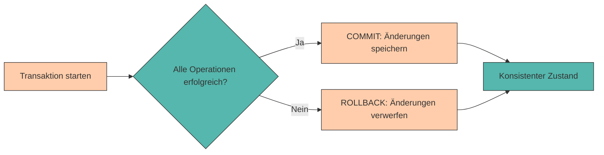

# Transaktionen & ACID

In den vorherigen Kapiteln haben wir gelernt, wie wir Daten in PostgreSQL strukturieren, abfragen und manipulieren können. Dabei haben wir immer angenommen, dass unsere Operationen erfolgreich ausgeführt werden und die Datenbank in einem konsistenten Zustand bleibt.

Doch was passiert, wenn:

- Ein **Fehler während einer Reihe von Änderungen** auftritt?
- Mehrere **Benutzer gleichzeitig** auf dieselben Daten zugreifen?
- Das **System abstürzt**, während eine Operation läuft?

In solchen Situationen reicht es nicht aus, einfach SQL-Befehle auszuführen. Wir benötigen einen Mechanismus, der sicherstellt, dass unsere Daten **konsistent und zuverlässig** bleiben. Dieser Mechanismus heißt **Transaktion**.

<div style="text-align: center;">
    
    <figcaption>Quelle: <a href="https://i.imgflip.com/acm26l.jpg">imgflip</a></figcaption>
</div>

In diesem Kapitel lernen wir, was Transaktionen sind, warum sie wichtig sind und wie wir sie in PostgreSQL verwenden. Außerdem schauen wir uns die **ACID-Prinzipien** an, die das Fundament für verlässliche Datenbanksysteme bilden.

---

???+ info "Datenbank-Setup"

    Für die folgenden Beispiele erstellen wir eine **Banking-Datenbank**. In dieser Datenbank werden Bankkonten und Geldtransfers verwaltet.

    ```sql
    -- Datenbank erstellen
    CREATE DATABASE banking_db;

    -- Zur Datenbank wechseln
    \c banking_db

    -- Tabelle: Konten
    CREATE TABLE konten (
        konto_id SERIAL PRIMARY KEY,
        kontoinhaber VARCHAR(100) NOT NULL,
        kontonummer VARCHAR(22) UNIQUE NOT NULL,
        saldo NUMERIC(12, 2) NOT NULL CHECK (saldo >= 0),
        kontotyp VARCHAR(20) DEFAULT 'Girokonto'
    );

    -- Tabelle: Transaktionslog
    CREATE TABLE transaktionslog (
        transaktion_id SERIAL PRIMARY KEY,
        von_konto_id INTEGER REFERENCES konten(konto_id),
        zu_konto_id INTEGER REFERENCES konten(konto_id),
        betrag NUMERIC(12, 2) NOT NULL CHECK (betrag > 0),
        transaktionsdatum TIMESTAMP DEFAULT CURRENT_TIMESTAMP,
        beschreibung TEXT,
        status VARCHAR(20) DEFAULT 'abgeschlossen'
    );

    -- Testdaten: Konten
    INSERT INTO konten (kontoinhaber, kontonummer, saldo, kontotyp) VALUES
    ('Max Mustermann', 'DE89370400440532013000', 5000.00, 'Girokonto'),
    ('Anna Schmidt', 'DE89370400440532013001', 3000.00, 'Girokonto'),
    ('Thomas Weber', 'DE89370400440532013002', 10000.00, 'Sparkonto'),
    ('Lisa Miller', 'DE89370400440532013003', 1500.00, 'Girokonto'),
    ('Peter Klein', 'DE89370400440532013004', 8000.00, 'Sparkonto');
    ```

---

## Was ist eine Transaktion?

Eine **Transaktion** ist eine **logische Einheit von Datenbankoperationen**, die entweder **vollständig ausgeführt** oder **vollständig rückgängig gemacht** wird.

Man kann sich eine Transaktion wie eine **All-or-Nothing-Operation** vorstellen:

- ✅ Entweder werden **alle Änderungen** erfolgreich durchgeführt
- ❌ Oder **keine der Änderungen** wird übernommen



---

## Warum brauchen wir Transaktionen?

Ohne Transaktionen können **inkonsistente Zustände** entstehen, die zu schwerwiegenden Problemen führen.

???+ example "Geldtransfer ohne Transaktion"

    Stell dir vor, wir überweisen 500€ vom Konto von Max Mustermann an Anna Schmidt:

    ```sql
    -- Schritt 1: Geld vom Sender-Konto abbuchen
    UPDATE konten
    SET saldo = saldo - 500
    WHERE kontoinhaber = 'Max Mustermann';

    -- Schritt 2: Geld auf Empfänger-Konto gutschreiben
    UPDATE konten
    SET saldo = saldo + 500
    WHERE kontoinhaber = 'Anna Schmidt';
    ```

    **❌ Problem: Was passiert, wenn zwischen diesen beiden Schritten ein Fehler auftritt?**

    - Das Geld wäre vom **Sender-Konto abgebucht**
    - Aber **nicht auf dem Empfänger-Konto angekommen**
    - 500€ wären einfach verschwunden! 💸

    Mit einer **Transaktion** stellen wir sicher, dass **entweder beide** Operationen erfolgreich sind, **oder keine von beiden**.

---

## Transaktionen in PostgreSQL

In PostgreSQL verwenden wir drei Hauptbefehle für Transaktionen:

<div style="text-align:center; max-width:900px; margin:16px auto;">
<table role="table"
       style="width:100%; border-collapse:separate; border-spacing:0; border:1px solid #cfd8e3; border-radius:10px; overflow:hidden; font-family:system-ui,sans-serif;">
    <thead>
    <tr style="background:#009485; color:#fff;">
        <th style="text-align:left; padding:12px 14px; font-weight:700;">Befehl</th>
        <th style="text-align:left; padding:12px 14px; font-weight:700;">Bedeutung</th>
        <th style="text-align:left; padding:12px 14px; font-weight:700;">Verwendung</th>
    </tr>
    </thead>
    <tbody>
    <tr>
        <td style="background:#00948511; padding:10px 14px;"><code>BEGIN</code></td>
        <td style="padding:10px 14px;">Startet eine neue Transaktion</td>
        <td style="padding:10px 14px;">Am Anfang einer Transaktionsfolge</td>
    </tr>
    <tr>
        <td style="background:#00948511; padding:10px 14px;"><code>COMMIT</code></td>
        <td style="padding:10px 14px;">Speichert alle Änderungen dauerhaft</td>
        <td style="padding:10px 14px;">Nach erfolgreicher Ausführung aller Operationen</td>
    </tr>
    <tr>
        <td style="background:#00948511; padding:10px 14px;"><code>ROLLBACK</code></td>
        <td style="padding:10px 14px;">Verwirft alle Änderungen seit BEGIN</td>
        <td style="padding:10px 14px;">Bei Fehlern oder bewusstem Abbruch</td>
    </tr>
    </tbody>
</table>
</div>

Der Allgemeine Aufbau einer Transaktion ist wie folgt:

```sql { .yaml .no-copy }
BEGIN;

-- SQL-Befehle
UPDATE ...
INSERT ...
DELETE ...
SELECT ...

COMMIT;  -- oder ROLLBACK;
```

Der `BEGIN` Befehl startet zunächst eine neue Transaktion. Alle nachfolgenden SQL-Befehle werden in dieser Transaktion ausgeführt. Sollte eine Transaktion fehlschlagen, hat man anschließend die Möglichkeit die Transaktion mit `ROLLBACK` rückgängig zu machen. Sollte die Transaktion erfolgreich ausgeführt werden, kann man die Transaktion mit `COMMIT` abschließen.

---

Betrachten wir zum besseren Verständnis wieder ein praktisches Beispiel.

???+ example "Transaktion mit `COMMIT` abschließen"

    Überprüfen wir zunächst die aktuellen Kontostände:

    ```sql
    SELECT kontoinhaber, kontonummer, saldo
    FROM konten
    WHERE kontoinhaber IN ('Max Mustermann', 'Anna Schmidt');
    ```

    ```{.cmd .no-copy title="Output"}
      kontoinhaber  |      kontonummer       |  saldo
    ----------------+------------------------+---------
     Max Mustermann | DE89370400440532013000 | 4500.00
     Anna Schmidt   | DE89370400440532013001 | 3500.00
    (2 rows)
    ```

    Jetzt führen wir die Überweisung **mit einer Transaktion** durch:

    ```sql hl_lines="1"
    BEGIN;

    -- Schritt 1: Geld vom Sender-Konto abbuchen
    UPDATE konten
    SET saldo = saldo - 500
    WHERE kontoinhaber = 'Max Mustermann';

    -- Schritt 2: Geld auf Empfänger-Konto gutschreiben
    UPDATE konten
    SET saldo = saldo + 500
    WHERE kontoinhaber = 'Anna Schmidt';
    ```

    Überprüfen wir das Ergebnis (noch innerhalb der Transaktion):

    ```sql
    SELECT kontoinhaber, saldo
    FROM konten
    WHERE kontoinhaber IN ('Max Mustermann', 'Anna Schmidt');
    ```

    ```title="Output"
      kontoinhaber  |  saldo
    ----------------+---------
     Max Mustermann | 4000.00
     Anna Schmidt   | 4000.00
    (2 rows)
    ```

    Sollte alles wie gewünscht funktioniert haben, können wir die Transaktion abschließen:

    ```sql
    COMMIT;
    ```

    ✅ **Beide Änderungen** wurden erfolgreich durchgeführt! Die Gesamtsumme (8000€) bleibt gleich.

???+ tip "Best Practice: Transaktionen verwenden"

    Verwende Transaktionen immer dann, wenn:

    - Mehrere zusammenhängende Operationen durchgeführt werden
    - Daten zwischen Tabellen verschoben werden
    - Kritische Geschäftslogik umgesetzt wird
    - Datenintegrität oberste Priorität hat

---

Was passiert aber, wenn wir einen **Fehler bemerken** oder die Transaktion **abbrechen möchten**?

???+ example "Transaktion mit `ROLLBACK` abbrechen"

    Arbeiten wir am vorherigen Beispiel weiter und versuchen einen Transfer, den wir dann abbrechen:

    ```sql hl_lines="1 9"
    BEGIN;

    -- Versuch einer Überweisung
    UPDATE konten
    SET saldo = saldo - 1000
    WHERE kontoinhaber = 'Max Mustermann';

    -- Ups, falscher Betrag! Abbrechen:
    ROLLBACK;
    ```

    Überprüfen wir nun wieder den Kontostand:

    ```sql
    SELECT kontoinhaber, saldo
    FROM konten
    WHERE kontoinhaber = 'Max Mustermann';
    ```

    ```{.cmd .no-copy title="Output"}
      kontoinhaber  |  saldo
    ----------------+---------
     Max Mustermann | 4000.00
    (1 row)
    ```

    Die Änderung wurde **NICHT gespeichert**! Der Kontostand ist immer noch bei 4000€.

Mit `ROLLBACK` werden also **alle Änderungen seit BEGIN** verworfen, als hätten sie nie stattgefunden.

<div style="text-align: center;">
    
    <figcaption>Quelle: <a href="https://dev.to/lovestaco/acid-or-base-hjf">dev.to</a></figcaption>
</div>


---

## Automatisches Rollback bei Fehlern

PostgreSQL führt **automatisch ein ROLLBACK** durch, wenn während einer Transaktion ein Fehler auftritt.

???+ example "Automatisches Rollback bei Constraint-Verletzung"

    Wir versuchen, mehr Geld abzuheben, als auf dem Konto vorhanden ist:

    ```sql hl_lines="1 8"
    BEGIN;

    UPDATE konten
    SET saldo = saldo - 200
    WHERE kontoinhaber = 'Max Mustermann';

    -- Dieser Befehl verletzt die CHECK-Constraint (Saldo darf nicht negativ sein)
    UPDATE konten
    SET saldo = saldo - 5000
    WHERE kontoinhaber = 'Max Mustermann';  -- Fehler! Saldo würde negativ werden (-700)
    ```

    ```{.cmd .no-copy title="Output"}
    FEHLER:  neue Zeile für Relation »konten« verletzt Check-Constraint »konten_saldo_check«
    DETAIL:  Fehlgeschlagene Zeile enthält (1, Max Mustermann, DE89370400440532013000, -1200.00, Girokonto)
    ```

    Wenn wir nun in weiterer Folge einen Befehl eingeben - egal welchen - wird uns das System folgendes zurückmelden:

    ```sql
    SELECT * FROM konten;
    ```

    ```{.cmd .no-copy title="Output"}
    FEHLER:  aktuelle Transaktion wurde abgebrochen, Befehle werden bis zum Ende der Transaktion ignoriert
    ```

    Was nun passiert ist, dass egal ob wir `COMMIT` oder `ROLLBACK` ausführen, PostgreSQL automatisch einen `ROLLBACK` durchführen wird. Dabei werden **alle Änderungen** rückgängig gemacht!
    Wir testen dies, indem wir ein `COMMIT` ausführen und anschließend nochmals die Daten überprüfen.

    ```sql
    COMMIT;

    SELECT kontoinhaber, saldo
    FROM konten
    WHERE kontoinhaber = 'Max Mustermann';
    ```

    ```{.cmd .no-copy title="Output"}
      kontoinhaber  |  saldo
    ----------------+---------
     Max Mustermann | 4000.00
    (1 row)
    ```

    ✅ Das Konto hat seinen **ursprünglichen Kontostand** behalten!


???+ tip "Verwendet PostgreSQL automatisch Transaktionen?"

    Ja! Jeder einzelne SQL-Befehl wird **implizit in einer eigenen Transaktion** ausgeführt. Wenn du nur einen `UPDATE`-Befehl ausführst, wird automatisch ein `BEGIN` davor und ein `COMMIT` danach gesetzt.

    Explizite Transaktionen mit `BEGIN` und `COMMIT` brauchst du nur, wenn du **mehrere Befehle** zu einer logischen Einheit zusammenfassen möchtest.
---

## ACID-Prinzipien

Transaktionen folgen den sogenannten **ACID-Prinzipien**. ACID ist ein Akronym für vier Eigenschaften, die jede zuverlässige Datenbank-Transaktion erfüllen muss:

<div style="text-align:center; max-width:900px; margin:16px auto;">
<table role="table"
       style="width:100%; border-collapse:separate; border-spacing:0; border:1px solid #cfd8e3; border-radius:10px; overflow:hidden; font-family:system-ui,sans-serif;">
    <thead>
    <tr style="background:#009485; color:#fff;">
        <th style="text-align:left; padding:12px 14px; font-weight:700;">Prinzip</th>
        <th style="text-align:left; padding:12px 14px; font-weight:700;">Bedeutung</th>
        <th style="text-align:left; padding:12px 14px; font-weight:700;">Beispiel</th>
    </tr>
    </thead>
    <tbody>
    <tr>
        <td style="background:#00948511; padding:10px 14px;"><strong>A</strong>tomicity</td>
        <td style="padding:10px 14px;">Alles oder nichts</td>
        <td style="padding:10px 14px;">Entweder beide Updates oder keines</td>
    </tr>
    <tr>
        <td style="background:#00948511; padding:10px 14px;"><strong>C</strong>onsistency</td>
        <td style="padding:10px 14px;">Datenbank bleibt konsistent</td>
        <td style="padding:10px 14px;">Gesamtbestand bleibt gleich</td>
    </tr>
    <tr>
        <td style="background:#00948511; padding:10px 14px;"><strong>I</strong>solation</td>
        <td style="padding:10px 14px;">Transaktionen laufen unabhängig</td>
        <td style="padding:10px 14px;">Andere User sehen Änderungen erst nach COMMIT</td>
    </tr>
    <tr>
        <td style="background:#00948511; padding:10px 14px;"><strong>D</strong>urability</td>
        <td style="padding:10px 14px;">Änderungen bleiben dauerhaft</td>
        <td style="padding:10px 14px;">Auch nach Systemabsturz erhalten</td>
    </tr>
    </tbody>
</table>
</div>

Schauen wir uns die einzelnen Prinzipien genauer an:

---

<div class="grid cards" markdown>

-   __A - Atomicity__

    ---

    Entweder werden **alle Operationen** ausgeführt, oder **keine einzige Operation** wird übernommen. Es gibt **kein "teilweise erfolgreich"**


-   __C - Consistency__

    ---

    Alle **Integritätsbedingungen** (Constraints) müssen erfüllt sein. Dies bedeutet, dass **vor** und **nach** der Transaktion die Datenbank in einem gültigen Zustand ist

-   __I - Isolation__

    ---

    Jede Transaktion läuft **isoliert**, als wäre sie die einzige. Änderungen einer Transaktion sind für andere **erst nach COMMIT sichtbar**

-   __D - Durability__

    ---

    Nach einem **COMMIT** sind die Änderungen **permanent gespeichert**. Auch bei **Systemabstürzen** oder **Stromausfällen** gehen die Daten nicht verloren

</div>

???+ info "Zwei Transaktionen gleichzeitig"
    Wenn man die ACID Regeln betrachtet, mag dem ein oder anderen die Frage aufkommen: Was passiert wenn es zwei Transaktionen gleichzeitig gibt? Speziell das Isolationsprinzip würde ja bedeuten, dass gleichzeitig auf den gleichen Daten etwas geändert werden kann. Hier verwendet PostgreSQL standardmäßig ein sogenannntes **Row-Level Locking**. Dies bedeutet, dass wenn in einer Transaktion eine Änderung an einer Zeile vorgenommen wird, diese für Änderungen in einer anderen Transaktion gesperrt wird. Das bedeutet, dass PostgreSQL nie zwei `UPDATE` Befehle gleichzeitig auf die selbe Zeile zulässt. 

---

## `SAVEPOINT`: Teilweiser Rollback

Ein `SAVEPOINT` ist ein Zwischenspeicherpunkt innerhalb einer Transaktion. Du kannst zu einem `SAVEPOINT` zurückrollen, ohne die gesamte Transaktion abzubrechen.

???+ example "`SAVEPOINT` verwenden"

    Betrachten wir nochmals kurz den aktuellen Kontostand von Thomas, Max und Anna: 

    ```sql
    SELECT kontoinhaber, saldo FROM konten
    WHERE kontoinhaber IN ('Max Mustermann', 'Anna Schmidt', 'Thomas Weber');
    ```

    ```{.cmd .no-copy title="Output"}
      kontoinhaber  |  saldo
    ----------------+----------
     Thomas Weber   | 10000.00
     Max Mustermann |  4000.00
     Anna Schmidt   |  4000.00
    (3 rows)
    ```


    Stellen wir uns vor, wir führen mehrere Überweisungen durch, möchten aber nur eine davon rückgängig machen:

    ```sql hl_lines="5 11"
    BEGIN;

    -- Erste Überweisung: 200€ von Max an Anna
    UPDATE konten SET saldo = saldo - 200 WHERE kontoinhaber = 'Max Mustermann';
    UPDATE konten SET saldo = saldo + 200 WHERE kontoinhaber = 'Anna Schmidt';

    SAVEPOINT nach_erster_ueberweisung;

    -- Zweite Überweisung: 300€ von Max an Thomas
    UPDATE konten SET saldo = saldo - 300 WHERE kontoinhaber = 'Max Mustermann';
    UPDATE konten SET saldo = saldo + 300 WHERE kontoinhaber = 'Thomas Weber';

    -- Ups, die zweite Überweisung war falsch! Nur diese rückgängig machen:
    ROLLBACK TO SAVEPOINT nach_erster_ueberweisung;

    -- Die erste Überweisung bleibt erhalten, die zweite wurde rückgängig gemacht
    COMMIT;
    ```

    Beim oben gezeigten Beispiel wird die erste Überweisung (200€ an Anna) durchgeführt, die zweite Überweisung (300€ an Thomas) aber verworfen. Lassen wir uns nochmals den aktuellen Kontostand anzeigen, erhalten wir: 

    ```{.cmd .no-copy title="Output"}
      kontoinhaber  |  saldo
    ----------------+----------
     Thomas Weber   | 10000.00
     Max Mustermann |  3800.00
     Anna Schmidt   |  4200.00
    (3 rows)
    ```

---

## Übung ✍️

Nun wenden wir Transaktionen auf unser **TecGuy GmbH Produktionsplanungssystem** an! Die Übungen decken verschiedene Transaktionsszenarien ab und helfen dir, ACID-Prinzipien in der Praxis anzuwenden.

???+ info "Übungsvorbereitung – Datenbank zurücksetzen"

    Für die nachfolgenden Übungen wollen wir nochmals auf die Ausgangsbasis zurückgehen und zusätzlich noch eine neue Lager Tabelle hinzufügen. Führe dazu das nachfolgende Setup aus.

    ???+ code "Setup"
        ```sql
        -- Zu anderer Datenbank wechseln
        \c postgres
        
        -- Datenbank löschen und neu erstellen
        DROP DATABASE IF EXISTS produktionsplanung_db;
        CREATE DATABASE produktionsplanung_db;

        -- Zur Datenbank wechseln
        \c produktionsplanung_db

        -- Tabelle: Maschinen
        CREATE TABLE maschinen (
            maschinen_id INTEGER PRIMARY KEY,
            maschinenname VARCHAR(100) NOT NULL,
            maschinentyp VARCHAR(50),
            maschinencode VARCHAR(20),
            produktionshalle VARCHAR(50),
            anschaffungsjahr INTEGER,
            maschinenstatus VARCHAR(20),
            wartungsintervall_tage INTEGER
        );

        -- Tabelle: Produktionsaufträge
        CREATE TABLE produktionsauftraege (
            auftrag_id INTEGER PRIMARY KEY,
            auftragsnummer VARCHAR(20),
            kunde VARCHAR(100),
            produkt VARCHAR(100),
            menge INTEGER,
            startdatum DATE,
            lieferdatum DATE,
            enddatum DATE,
            status VARCHAR(20),
            maschinen_id INTEGER,
            FOREIGN KEY (maschinen_id) REFERENCES maschinen(maschinen_id)
                ON DELETE RESTRICT
        );

        -- Tabelle: Wartungsprotokolle (1:n Beziehung zu Maschinen)
        CREATE TABLE wartungsprotokolle (
            wartungs_id SERIAL PRIMARY KEY,
            wartungsdatum DATE NOT NULL,
            beschreibung TEXT,
            techniker VARCHAR(100),
            kosten NUMERIC(10, 2),
            maschinen_id INTEGER NOT NULL,
            FOREIGN KEY (maschinen_id) REFERENCES maschinen(maschinen_id)
                ON DELETE CASCADE
        );

        -- Tabelle: Ersatzteile
        CREATE TABLE ersatzteile (
            ersatzteil_id INTEGER PRIMARY KEY,
            teilenummer VARCHAR(20) NOT NULL UNIQUE,
            bezeichnung VARCHAR(100) NOT NULL,
            lagerbestand INTEGER DEFAULT 0,
            mindestbestand INTEGER DEFAULT 10
        );

        -- Tabelle: Maschinen-Ersatzteile (n:m Beziehung)
        CREATE TABLE maschinen_ersatzteile (
            maschinen_id INTEGER,
            ersatzteil_id INTEGER,
            menge_pro_wartung INTEGER,
            PRIMARY KEY (maschinen_id, ersatzteil_id),
            FOREIGN KEY (maschinen_id) REFERENCES maschinen(maschinen_id)
                ON DELETE CASCADE,
            FOREIGN KEY (ersatzteil_id) REFERENCES ersatzteile(ersatzteil_id)
                ON DELETE CASCADE
        );

        -- Tabelle: Lager (NEU für Transaktionsübungen)
        CREATE TABLE lager (
            lager_id SERIAL PRIMARY KEY,
            standort VARCHAR(100) NOT NULL,
            ersatzteil_id INTEGER REFERENCES ersatzteile(ersatzteil_id),
            bestand INTEGER NOT NULL CHECK (bestand >= 0)
        );

        -- Testdaten: Maschinen
        INSERT INTO maschinen VALUES
        (1, 'CNC-Fraese Alpha', 'CNC-Fraese', 'M-CNC-001', 'Halle A', 2020, 'Aktiv', 90),
        (2, 'Drehbank Delta', 'Drehbank', 'M-DRE-002', 'Halle A', 2018, 'Aktiv', 120),
        (3, 'Presse Gamma', 'Presse', 'M-PRE-003', 'Halle B', 2019, 'Aktiv', 60),
        (4, 'Schweissroboter Beta', 'Schweissroboter', 'M-SCH-004', 'Halle C', 2021, 'Aktiv', 90);

        -- Testdaten: Produktionsaufträge
        INSERT INTO produktionsauftraege VALUES
        (1, 'AUF-2024-001', 'BMW AG', 'Getriebegehäuse', 500, '2024-04-01', '2024-04-15', NULL, 'In Produktion', 1),
        (2, 'AUF-2024-002', 'Audi AG', 'Kurbelwelle', 200, '2024-04-10', '2024-04-20', NULL, 'In Produktion', 2),
        (3, 'AUF-2024-003', 'Mercedes-Benz', 'Pleuelstange', 350, '2024-04-05', '2024-04-18', '2024-04-17', 'In Produktion', 2),
        (4, 'AUF-2024-004', 'Porsche AG', 'Kolben', 150, '2024-04-12', '2024-04-25', NULL, 'In Vorbereitung', 4),
        (5, 'AUF-2024-005', 'BMW AG', 'Kurbelwelle', 300, '2024-04-15', '2024-04-22', NULL, 'In Produktion', 2),
        (6, 'AUF-2024-006', 'Volkswagen AG', 'Kolben', 400, '2024-04-20', '2024-04-28', NULL, 'In Vorbereitung', 1),
        (7, 'AUF-2024-009', 'Porsche AG', 'Kurbelwelle', 120, '2024-04-28', '2024-05-05', NULL, 'In Vorbereitung', 2),
        (8, 'AUF-2024-010', 'BMW AG', 'Kolben', 350, '2024-04-12', '2024-04-19', NULL, 'In Produktion', 4);

        -- Testdaten: Wartungsprotokolle
        INSERT INTO wartungsprotokolle (wartungsdatum, beschreibung, techniker, kosten, maschinen_id) VALUES
        ('2024-01-15', 'Routinewartung - Ölwechsel und Filter', 'Thomas Weber', 450.00, 1),
        ('2024-02-20', 'Austausch Hydraulikschläuche', 'Anna Schmidt', 320.00, 4),
        ('2024-03-10', 'Software-Update CNC-Steuerung', 'Thomas Weber', 180.00, 2),
        ('2024-03-22', 'Inspektion nach 5000 Betriebsstunden', 'Michael Klein', 520.00, 3),
        ('2024-04-05', 'Reparatur Kühlsystem', 'Anna Schmidt', 890.00, 1);

        -- Testdaten: Ersatzteile
        INSERT INTO ersatzteile VALUES
        (1, 'ET-001', 'Hydrauliköl 10L', 50, 20),
        (2, 'ET-002', 'Ölfilter', 30, 15),
        (3, 'ET-003', 'Hydraulikschlauch 2m', 25, 10),
        (4, 'ET-004', 'Dichtungssatz', 40, 12),
        (5, 'ET-005', 'Sicherungsring Set', 100, 30);

        -- Testdaten: Maschinen-Ersatzteile (Zuordnung)
        INSERT INTO maschinen_ersatzteile VALUES
        (1, 1, 2),  -- Spritzgussmaschine braucht Hydrauliköl
        (1, 2, 1),  -- Spritzgussmaschine braucht Ölfilter
        (2, 4, 1),  -- CNC-Fräse braucht Dichtungssatz
        (3, 1, 1),  -- Drehmaschine braucht Hydrauliköl
        (4, 3, 2),  -- Presse braucht Hydraulikschläuche
        (4, 4, 1);  -- Presse braucht Dichtungssatz

        -- Testdaten: Lager (für Transaktionsübungen)
        INSERT INTO lager (standort, ersatzteil_id, bestand) VALUES
        ('Hauptlager', 1, 100),
        ('Hauptlager', 2, 80),
        ('Hauptlager', 3, 60),
        ('Produktionslager', 1, 50),
        ('Produktionslager', 2, 40),
        ('Produktionslager', 3, 30);
        ```

???+ question "Aufgabe 1: Ersatzteile-Transfer zwischen Lagern"

    Transferiere 20 Einheiten eines Ersatzteils vom Hauptlager ins Produktionslager mit einer Transaktion.

    **Anforderungen:**

    - Wähle ein beliebiges Ersatzteil
    - Reduziere Bestand im Hauptlager um 20
    - Erhöhe Bestand im Produktionslager um 20
    - Verwende BEGIN und COMMIT


???+ question "Aufgabe 2: Produktionsauftrag mit Maschinenprüfung"

    Erstelle einen neuen Produktionsauftrag und weise ihm eine Maschine zu. Wenn die Maschine bereits einen aktiven Auftrag hat, soll die Transaktion abgebrochen werden.

    **Anforderungen:**

    - Prüfe, ob die Maschine verfügbar ist (kein aktiver Auftrag mit status = 'in_produktion')
    - Erstelle nur dann einen neuen Auftrag
    - Verwende ROLLBACK, wenn die Maschine nicht verfügbar ist


???+ question "Aufgabe 3: SAVEPOINT für komplexe Wartung"

    Führe eine komplexe Wartung mit mehreren Schritten durch. Verwende SAVEPOINT, um nur einen Teil rückgängig zu machen.

    **Szenario:**

    - Wartung beginnen und Kosten für Grundinspektion erfassen
    - SAVEPOINT setzen
    - Zusätzliche Reparatur erfassen
    - SAVEPOINT setzen
    - Dritte Reparatur (zu teuer!) → zurück zum zweiten SAVEPOINT


???+ question "Aufgabe 4: Automatisches ROLLBACK bei Constraint-Verletzung"

    Versuche, mehr Ersatzteile aus dem Lager zu entnehmen, als vorhanden sind. Beobachte das automatische ROLLBACK.

    **Anforderungen:**

    - Starte eine Transaktion
    - Versuche, 200 Einheiten zu entnehmen (obwohl nur z.B. 100 vorhanden sind)
    - Beobachte die Fehlermeldung
    - Überprüfe, dass keine Änderungen gespeichert wurden

---


## Zusammenfassung 📌

- Eine **Transaktion** ist eine Gruppe von Operationen, die entweder vollständig ausgeführt oder vollständig rückgängig gemacht wird
- `BEGIN` startet eine Transaktion
- `COMMIT` speichert alle Änderungen dauerhaft
- `ROLLBACK` verwirft alle Änderungen seit BEGIN
- Bei Fehlern führt PostgreSQL **automatisch ein ROLLBACK** durch
- Die **ACID-Prinzipien** garantieren:
    - **Atomicity**: Alles oder nichts
    - **Consistency**: Datenbank bleibt konsistent
    - **Isolation**: Transaktionen laufen unabhängig
    - **Durability**: Änderungen bleiben dauerhaft erhalten
- `SAVEPOINT` ermöglicht teilweise Rollbacks innerhalb einer Transaktion
- Transaktionen sind besonders wichtig bei **kritischen Operationen** wie Lagertransfers, Maschinenregistrierungen oder anderen zusammenhängenden Änderungen

---

Im nächsten und letzten Kapitel werfen wir einen **Ausblick auf weiterführende Themen** wie Views, Stored Procedures und NoSQL-Datenbanken.
