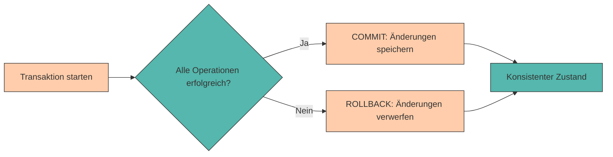

# Transaktionen & ACID

In den vorherigen Kapiteln haben wir gelernt, wie wir Daten in PostgreSQL strukturieren, abfragen und manipulieren können. Dabei haben wir immer angenommen, dass unsere Operationen erfolgreich ausgeführt werden und die Datenbank in einem konsistenten Zustand bleibt.

Doch was passiert, wenn:

* Ein **Fehler während einer Reihe von Änderungen** auftritt?
* Mehrere **Benutzer gleichzeitig** auf dieselben Daten zugreifen?
* Das **System abstürzt**, während eine Operation läuft?

In solchen Situationen reicht es nicht aus, einfach SQL-Befehle auszuführen. Wir benötigen einen Mechanismus, der sicherstellt, dass unsere Daten **konsistent und zuverlässig** bleiben. Dieser Mechanismus heißt **Transaktion**.

In diesem Kapitel lernen wir, was Transaktionen sind, warum sie wichtig sind und wie wir sie in PostgreSQL verwenden. Außerdem schauen wir uns die **ACID-Prinzipien** an, die das Fundament für verlässliche Datenbanksysteme bilden.

---

## Was ist eine Transaktion?

Eine **Transaktion** ist eine **logische Einheit von Datenbankoperationen**, die entweder **vollständig ausgeführt** oder **vollständig rückgängig gemacht** wird.

Man kann sich eine Transaktion wie eine **All-or-Nothing-Operation** vorstellen:

* Entweder werden **alle Änderungen** erfolgreich durchgeführt
* Oder **keine der Änderungen** wird übernommen



---

## Warum brauchen wir Transaktionen?

### Beispiel: Banküberweisung

Stell dir vor, du überweist 100 € von deinem Konto auf das Konto deiner Freundin:

```sql
-- Schritt 1: Betrag von meinem Konto abziehen
UPDATE konten 
SET saldo = saldo - 100 
WHERE konto_id = 'A123';

-- Schritt 2: Betrag auf das Konto der Freundin aufbuchen
UPDATE konten 
SET saldo = saldo + 100 
WHERE konto_id = 'B456';
```

**Was passiert, wenn zwischen diesen beiden Schritten ein Fehler auftritt?**

* Das Geld wäre von **deinem Konto abgebucht**
* Aber **nicht auf dem Konto der Freundin angekommen**
* 100 € wären einfach verschwunden! 💸

Mit einer **Transaktion** stellen wir sicher, dass **entweder beide** Operationen erfolgreich sind, **oder keine von beiden**.

---

## Transaktionen in PostgreSQL

In PostgreSQL verwenden wir drei Hauptbefehle für Transaktionen:

| Befehl | Bedeutung |
|--------|-----------|
| `BEGIN` oder `START TRANSACTION` | Startet eine neue Transaktion |
| `COMMIT` | Speichert alle Änderungen dauerhaft |
| `ROLLBACK` | Verwirft alle Änderungen seit BEGIN |

### Syntax

```sql
BEGIN;

-- SQL-Befehle
UPDATE ...
INSERT ...
DELETE ...

COMMIT;  -- oder ROLLBACK;
```

---

## Praktisches Beispiel: Überweisung mit Transaktion

Wir erstellen zunächst eine Beispieltabelle:

```sql
CREATE TABLE konten (
    konto_id VARCHAR(10) PRIMARY KEY,
    inhaber VARCHAR(50) NOT NULL,
    saldo NUMERIC(10,2) NOT NULL CHECK(saldo >= 0)
);

INSERT INTO konten (konto_id, inhaber, saldo) VALUES
('A123', 'Anna Schmidt', 500.00),
('B456', 'Ben Müller', 300.00);
```

Jetzt führen wir die Überweisung **mit einer Transaktion** durch:

```sql
BEGIN;

-- Saldo vor der Überweisung anzeigen
SELECT * FROM konten;

-- Schritt 1: Betrag abziehen
UPDATE konten 
SET saldo = saldo - 100 
WHERE konto_id = 'A123';

-- Schritt 2: Betrag aufbuchen
UPDATE konten 
SET saldo = saldo + 100 
WHERE konto_id = 'B456';

-- Überprüfung
SELECT * FROM konten;

COMMIT;  -- Änderungen dauerhaft speichern
```

**Ergebnis nach COMMIT:**

| konto_id | inhaber | saldo |
|----------|---------|-------|
| A123 | Anna Schmidt | 400.00 |
| B456 | Ben Müller | 400.00 |

---

## ROLLBACK: Änderungen rückgängig machen

Was passiert, wenn wir einen **Fehler bemerken** oder die Transaktion **abbrechen möchten**?

```sql
BEGIN;

-- Versuch einer Überweisung
UPDATE konten 
SET saldo = saldo - 100 
WHERE konto_id = 'A123';

-- Ups, falscher Betrag! Abbrechen:
ROLLBACK;

-- Überprüfung: Die Änderung wurde NICHT gespeichert
SELECT * FROM konten WHERE konto_id = 'A123';
-- Saldo ist immer noch 500.00
```

Mit `ROLLBACK` werden **alle Änderungen seit BEGIN** verworfen, als hätten sie nie stattgefunden.

---

## Automatisches Rollback bei Fehlern

PostgreSQL führt **automatisch ein ROLLBACK** durch, wenn während einer Transaktion ein Fehler auftritt.

```sql
BEGIN;

UPDATE konten 
SET saldo = saldo - 100 
WHERE konto_id = 'A123';

-- Dieser Befehl verletzt die CHECK-Constraint (Saldo darf nicht negativ sein)
UPDATE konten 
SET saldo = saldo - 1000 
WHERE konto_id = 'B456';  -- Fehler! Saldo würde negativ werden

-- PostgreSQL führt automatisch ROLLBACK durch
-- Die erste UPDATE-Operation wird ebenfalls rückgängig gemacht
```

**Wichtig:** Sobald ein Fehler auftritt, ist die **gesamte Transaktion ungültig**. Alle Änderungen werden verworfen.

---

## ACID-Prinzipien

Transaktionen folgen den sogenannten **ACID-Prinzipien**. ACID ist ein Akronym und steht für:

### A – Atomicity (Atomarität)

**Eine Transaktion ist unteilbar (atomar)**

* Entweder werden **alle Operationen** ausgeführt
* Oder **keine einzige Operation** wird übernommen
* Es gibt **kein "teilweise erfolgreich"**

**Beispiel:** Bei der Überweisung werden entweder beide Updates durchgeführt oder keines.

---

### C – Consistency (Konsistenz)

**Eine Transaktion führt die Datenbank von einem konsistenten Zustand in einen anderen konsistenten Zustand**

* Alle **Integritätsbedingungen** (Constraints) müssen erfüllt sein
* **Vor** und **nach** der Transaktion ist die Datenbank in einem gültigen Zustand

**Beispiel:** Die Gesamtsumme aller Kontostände bleibt bei einer Überweisung gleich.

```sql
-- Vor der Überweisung
SELECT SUM(saldo) FROM konten;  -- z.B. 800.00

-- Nach der Überweisung
SELECT SUM(saldo) FROM konten;  -- immer noch 800.00
```

---

### I – Isolation (Isolation)

**Gleichzeitig laufende Transaktionen beeinflussen sich nicht gegenseitig**

* Jede Transaktion läuft **isoliert**, als wäre sie die einzige
* Änderungen einer Transaktion sind für andere **erst nach COMMIT sichtbar**

**Beispiel:** Zwei Benutzer überweisen gleichzeitig Geld vom selben Konto – die Datenbank stellt sicher, dass keine Inkonsistenzen entstehen.

---

### D – Durability (Dauerhaftigkeit)

**Einmal bestätigte Änderungen bleiben dauerhaft erhalten**

* Nach einem **COMMIT** sind die Änderungen **permanent gespeichert**
* Auch bei **Systemabstürzen** oder **Stromausfällen** gehen die Daten nicht verloren

**Beispiel:** Nachdem eine Überweisung mit COMMIT abgeschlossen wurde, ist sie dauerhaft gespeichert – selbst wenn der Server sofort danach abstürzt.

---

## Praktische Übungen

### Übung 1: Einfache Transaktion

Erstelle eine Tabelle `lager` mit Produkten und führe eine Transaktion durch:

```sql
CREATE TABLE lager (
    produkt_id SERIAL PRIMARY KEY,
    name VARCHAR(50) NOT NULL,
    bestand INTEGER NOT NULL CHECK(bestand >= 0)
);

INSERT INTO lager (name, bestand) VALUES
('Laptop', 10),
('Maus', 50),
('Tastatur', 30);
```

**Aufgabe:** Starte eine Transaktion, reduziere den Bestand von "Laptop" um 2 Stück und erhöhe den Bestand von "Maus" um 5 Stück. Bestätige die Änderungen mit COMMIT.

???+ tip "Lösung"
    ```sql
    BEGIN;
    
    UPDATE lager 
    SET bestand = bestand - 2 
    WHERE name = 'Laptop';
    
    UPDATE lager 
    SET bestand = bestand + 5 
    WHERE name = 'Maus';
    
    COMMIT;
    ```

---

### Übung 2: Rollback bei Fehler

**Aufgabe:** Versuche, den Bestand von "Tastatur" um 50 Stück zu reduzieren (was einen negativen Bestand ergeben würde). Beobachte, was passiert.

???+ tip "Lösung"
    ```sql
    BEGIN;
    
    UPDATE lager 
    SET bestand = bestand - 50 
    WHERE name = 'Tastatur';  -- Fehler! CHECK constraint verletzt
    
    -- PostgreSQL führt automatisch ROLLBACK durch
    -- Die Änderung wird nicht gespeichert
    ```

---

### Übung 3: Mehrere Operationen in einer Transaktion

**Aufgabe:** Erstelle eine Transaktion, die:

1. Einen neuen Kunden in eine `kunden`-Tabelle einfügt
2. Eine Bestellung in eine `bestellungen`-Tabelle einfügt

Wenn ein Fehler auftritt, sollen beide Operationen rückgängig gemacht werden.

```sql
CREATE TABLE kunden (
    kunden_id SERIAL PRIMARY KEY,
    name VARCHAR(50) NOT NULL
);

CREATE TABLE bestellungen (
    bestellung_id SERIAL PRIMARY KEY,
    kunden_id INTEGER REFERENCES kunden(kunden_id),
    produkt VARCHAR(50) NOT NULL,
    menge INTEGER NOT NULL
);
```

???+ tip "Lösung"
    ```sql
    BEGIN;
    
    -- Neuen Kunden anlegen
    INSERT INTO kunden (name) VALUES ('Maria Weber');
    
    -- Bestellung für diesen Kunden anlegen
    INSERT INTO bestellungen (kunden_id, produkt, menge) 
    VALUES (
        (SELECT kunden_id FROM kunden WHERE name = 'Maria Weber'),
        'Laptop',
        1
    );
    
    COMMIT;
    ```

---

### Übung 4: Bewusster Rollback

**Aufgabe:** Starte eine Transaktion, füge einen neuen Datensatz ein, überprüfe das Ergebnis mit SELECT, und mache dann die Änderung mit ROLLBACK rückgängig.

???+ tip "Lösung"
    ```sql
    BEGIN;
    
    INSERT INTO lager (name, bestand) VALUES ('Monitor', 15);
    
    -- Überprüfung (nur innerhalb der Transaktion sichtbar)
    SELECT * FROM lager WHERE name = 'Monitor';
    
    -- Änderung verwerfen
    ROLLBACK;
    
    -- Überprüfung: Der Datensatz wurde nicht gespeichert
    SELECT * FROM lager WHERE name = 'Monitor';  -- Kein Ergebnis
    ```

---

## Zusammenfassung 📌

* Eine **Transaktion** ist eine Gruppe von Operationen, die entweder vollständig ausgeführt oder vollständig rückgängig gemacht wird
* `BEGIN` startet eine Transaktion
* `COMMIT` speichert alle Änderungen dauerhaft
* `ROLLBACK` verwirft alle Änderungen seit BEGIN
* Bei Fehlern führt PostgreSQL **automatisch ein ROLLBACK** durch
* Die **ACID-Prinzipien** garantieren:
    * **Atomicity**: Alles oder nichts
    * **Consistency**: Datenbank bleibt konsistent
    * **Isolation**: Transaktionen laufen unabhängig
    * **Durability**: Änderungen bleiben dauerhaft erhalten
* Transaktionen sind besonders wichtig bei **kritischen Operationen** wie Überweisungen, Bestellungen oder anderen zusammenhängenden Änderungen

---

## Weiterführende Fragen

???+ question "Warum verwendet PostgreSQL nicht automatisch Transaktionen für jeden Befehl?"

    Tatsächlich tut PostgreSQL genau das! Jeder einzelne SQL-Befehl wird **implizit in einer eigenen Transaktion** ausgeführt. Wenn du nur einen `UPDATE`-Befehl ausführst, wird automatisch ein `BEGIN` davor und ein `COMMIT` danach gesetzt.
    
    Explizite Transaktionen mit `BEGIN` und `COMMIT` brauchst du nur, wenn du **mehrere Befehle** zu einer logischen Einheit zusammenfassen möchtest.

???+ question "Was ist der Unterschied zwischen COMMIT und SAVEPOINT?"

    Ein **SAVEPOINT** ist ein Zwischenspeicherpunkt innerhalb einer Transaktion. Du kannst zu einem SAVEPOINT zurückrollen, ohne die gesamte Transaktion abzubrechen. Das ist nützlich für komplexe Transaktionen mit mehreren Schritten.
    
    ```sql
    BEGIN;
    UPDATE konten SET saldo = saldo - 100 WHERE konto_id = 'A123';
    SAVEPOINT mein_savepoint;
    UPDATE konten SET saldo = saldo + 100 WHERE konto_id = 'B456';
    -- Ups, Fehler! Nur den zweiten UPDATE rückgängig machen:
    ROLLBACK TO SAVEPOINT mein_savepoint;
    COMMIT;
    ```

---

Im nächsten Kapitel werden wir ein **praktisches Projekt** durchführen, in dem wir alle bisher gelernten Konzepte zusammenführen – von der Modellierung über Beziehungen bis hin zu komplexen Abfragen und Transaktionen.