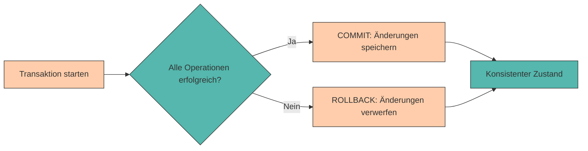

# Transaktionen & ACID

In den vorherigen Kapiteln haben wir gelernt, wie wir Daten in PostgreSQL strukturieren, abfragen und manipulieren können. Dabei haben wir immer angenommen, dass unsere Operationen erfolgreich ausgeführt werden und die Datenbank in einem konsistenten Zustand bleibt.

Doch was passiert, wenn:

* Ein **Fehler während einer Reihe von Änderungen** auftritt?
* Mehrere **Benutzer gleichzeitig** auf dieselben Daten zugreifen?
* Das **System abstürzt**, während eine Operation läuft?

In solchen Situationen reicht es nicht aus, einfach SQL-Befehle auszuführen. Wir benötigen einen Mechanismus, der sicherstellt, dass unsere Daten **konsistent und zuverlässig** bleiben. Dieser Mechanismus heißt **Transaktion**.

In diesem Kapitel lernen wir, was Transaktionen sind, warum sie wichtig sind und wie wir sie in PostgreSQL verwenden. Außerdem schauen wir uns die **ACID-Prinzipien** an, die das Fundament für verlässliche Datenbanksysteme bilden.

---

## Was ist eine Transaktion?

Eine **Transaktion** ist eine **logische Einheit von Datenbankoperationen**, die entweder **vollständig ausgeführt** oder **vollständig rückgängig gemacht** wird.

Man kann sich eine Transaktion wie eine **All-or-Nothing-Operation** vorstellen:

* Entweder werden **alle Änderungen** erfolgreich durchgeführt
* Oder **keine der Änderungen** wird übernommen



---

## Warum brauchen wir Transaktionen?

### Beispiel: Lagertransfer

Stell dir vor, du transferierst 50 Ersatzteile vom Hauptlager ins Produktionslager:

```sql
-- Schritt 1: Teile aus Hauptlager entnehmen
UPDATE lager
SET bestand = bestand - 50
WHERE lager_id = 'HAUPT01';

-- Schritt 2: Teile ins Produktionslager einbuchen
UPDATE lager
SET bestand = bestand + 50
WHERE lager_id = 'PROD01';
```

**Was passiert, wenn zwischen diesen beiden Schritten ein Fehler auftritt?**

* Die Teile wären aus dem **Hauptlager entnommen**
* Aber **nicht im Produktionslager angekommen**
* 50 Ersatzteile wären einfach verschwunden! 📦

Mit einer **Transaktion** stellen wir sicher, dass **entweder beide** Operationen erfolgreich sind, **oder keine von beiden**.

---

## Transaktionen in PostgreSQL

In PostgreSQL verwenden wir drei Hauptbefehle für Transaktionen:

| Befehl | Bedeutung |
|--------|-----------|
| `BEGIN` oder `START TRANSACTION` | Startet eine neue Transaktion |
| `COMMIT` | Speichert alle Änderungen dauerhaft |
| `ROLLBACK` | Verwirft alle Änderungen seit BEGIN |

### Syntax

```sql
BEGIN;

-- SQL-Befehle
UPDATE ...
INSERT ...
DELETE ...

COMMIT;  -- oder ROLLBACK;
```

---

## Praktisches Beispiel: Lagertransfer mit Transaktion

Wir erstellen zunächst eine Beispieltabelle:

```sql
CREATE TABLE lager (
    lager_id VARCHAR(10) PRIMARY KEY,
    standort VARCHAR(50) NOT NULL,
    bestand INTEGER NOT NULL CHECK(bestand >= 0)
);

INSERT INTO lager (lager_id, standort, bestand) VALUES
('HAUPT01', 'Hauptlager Halle A', 200),
('PROD01', 'Produktionslager Halle B', 100);
```

Jetzt führen wir den Transfer **mit einer Transaktion** durch:

```sql
BEGIN;

-- Bestand vor dem Transfer anzeigen
SELECT * FROM lager;

-- Schritt 1: Teile aus Hauptlager entnehmen
UPDATE lager
SET bestand = bestand - 50
WHERE lager_id = 'HAUPT01';

-- Schritt 2: Teile ins Produktionslager einbuchen
UPDATE lager
SET bestand = bestand + 50
WHERE lager_id = 'PROD01';

-- Überprüfung
SELECT * FROM lager;

COMMIT;  -- Änderungen dauerhaft speichern
```

**Ergebnis nach COMMIT:**

| lager_id | standort | bestand |
|----------|----------|---------|
| HAUPT01 | Hauptlager Halle A | 150 |
| PROD01 | Produktionslager Halle B | 150 |

---

## ROLLBACK: Änderungen rückgängig machen

Was passiert, wenn wir einen **Fehler bemerken** oder die Transaktion **abbrechen möchten**?

```sql
BEGIN;

-- Versuch eines Transfers
UPDATE lager
SET bestand = bestand - 50
WHERE lager_id = 'HAUPT01';

-- Ups, falsches Lager! Abbrechen:
ROLLBACK;

-- Überprüfung: Die Änderung wurde NICHT gespeichert
SELECT * FROM lager WHERE lager_id = 'HAUPT01';
-- Bestand ist immer noch 200
```

Mit `ROLLBACK` werden **alle Änderungen seit BEGIN** verworfen, als hätten sie nie stattgefunden.

---

## Automatisches Rollback bei Fehlern

PostgreSQL führt **automatisch ein ROLLBACK** durch, wenn während einer Transaktion ein Fehler auftritt.

```sql
BEGIN;

UPDATE lager
SET bestand = bestand - 50
WHERE lager_id = 'HAUPT01';

-- Dieser Befehl verletzt die CHECK-Constraint (Bestand darf nicht negativ sein)
UPDATE lager
SET bestand = bestand - 200
WHERE lager_id = 'PROD01';  -- Fehler! Bestand würde negativ werden

-- PostgreSQL führt automatisch ROLLBACK durch
-- Die erste UPDATE-Operation wird ebenfalls rückgängig gemacht
```

**Wichtig:** Sobald ein Fehler auftritt, ist die **gesamte Transaktion ungültig**. Alle Änderungen werden verworfen.

---

## ACID-Prinzipien

Transaktionen folgen den sogenannten **ACID-Prinzipien**. ACID ist ein Akronym und steht für:

### A – Atomicity (Atomarität)

**Eine Transaktion ist unteilbar (atomar)**

* Entweder werden **alle Operationen** ausgeführt
* Oder **keine einzige Operation** wird übernommen
* Es gibt **kein "teilweise erfolgreich"**

**Beispiel:** Beim Lagertransfer werden entweder beide Updates durchgeführt oder keines.

---

### C – Consistency (Konsistenz)

**Eine Transaktion führt die Datenbank von einem konsistenten Zustand in einen anderen konsistenten Zustand**

* Alle **Integritätsbedingungen** (Constraints) müssen erfüllt sein
* **Vor** und **nach** der Transaktion ist die Datenbank in einem gültigen Zustand

**Beispiel:** Die Gesamtsumme aller Lagerbestände bleibt bei einem Transfer gleich.

```sql
-- Vor dem Transfer
SELECT SUM(bestand) FROM lager;  -- z.B. 300

-- Nach dem Transfer
SELECT SUM(bestand) FROM lager;  -- immer noch 300
```

---

### I – Isolation (Isolation)

**Gleichzeitig laufende Transaktionen beeinflussen sich nicht gegenseitig**

* Jede Transaktion läuft **isoliert**, als wäre sie die einzige
* Änderungen einer Transaktion sind für andere **erst nach COMMIT sichtbar**

**Beispiel:** Zwei Benutzer entnehmen gleichzeitig Ersatzteile aus demselben Lager – die Datenbank stellt sicher, dass keine Inkonsistenzen entstehen.

---

### D – Durability (Dauerhaftigkeit)

**Einmal bestätigte Änderungen bleiben dauerhaft erhalten**

* Nach einem **COMMIT** sind die Änderungen **permanent gespeichert**
* Auch bei **Systemabstürzen** oder **Stromausfällen** gehen die Daten nicht verloren

**Beispiel:** Nachdem ein Lagertransfer mit COMMIT abgeschlossen wurde, ist er dauerhaft gespeichert – selbst wenn der Server sofort danach abstürzt.

---

## Praktische Übungen

### Übung 1: Einfache Transaktion

Erstelle eine Tabelle `ersatzteillager` und führe eine Transaktion durch:

```sql
CREATE TABLE ersatzteillager (
    teil_id SERIAL PRIMARY KEY,
    teilname VARCHAR(50) NOT NULL,
    bestand INTEGER NOT NULL CHECK(bestand >= 0)
);

INSERT INTO ersatzteillager (teilname, bestand) VALUES
('Spindelmotor', 10),
('Kühlmittelpumpe', 50),
('Schweißdrahtspule', 30);
```

**Aufgabe:** Starte eine Transaktion, reduziere den Bestand von "Spindelmotor" um 2 Stück und erhöhe den Bestand von "Kühlmittelpumpe" um 5 Stück. Bestätige die Änderungen mit COMMIT.

???+ tip "Lösung"
    ```sql
    BEGIN;

    UPDATE ersatzteillager
    SET bestand = bestand - 2
    WHERE teilname = 'Spindelmotor';

    UPDATE ersatzteillager
    SET bestand = bestand + 5
    WHERE teilname = 'Kühlmittelpumpe';

    COMMIT;
    ```

---

### Übung 2: Rollback bei Fehler

**Aufgabe:** Versuche, den Bestand von "Schweißdrahtspule" um 50 Stück zu reduzieren (was einen negativen Bestand ergeben würde). Beobachte, was passiert.

???+ tip "Lösung"
    ```sql
    BEGIN;

    UPDATE ersatzteillager
    SET bestand = bestand - 50
    WHERE teilname = 'Schweißdrahtspule';  -- Fehler! CHECK constraint verletzt

    -- PostgreSQL führt automatisch ROLLBACK durch
    -- Die Änderung wird nicht gespeichert
    ```

---

### Übung 3: Mehrere Operationen in einer Transaktion

**Aufgabe:** Erstelle eine Transaktion, die:

1. Eine neue Maschine in die `maschinen`-Tabelle einfügt
2. Einen Wartungsauftrag in die `wartungsauftraege`-Tabelle einfügt

Wenn ein Fehler auftritt, sollen beide Operationen rückgängig gemacht werden.

```sql
CREATE TABLE maschinen (
    maschinen_id SERIAL PRIMARY KEY,
    name VARCHAR(50) NOT NULL
);

CREATE TABLE wartungsauftraege (
    auftrag_id SERIAL PRIMARY KEY,
    maschinen_id INTEGER REFERENCES maschinen(maschinen_id),
    beschreibung TEXT NOT NULL,
    kosten NUMERIC(10, 2)
);
```

???+ tip "Lösung"
    ```sql
    BEGIN;

    -- Neue Maschine anlegen
    INSERT INTO maschinen (name) VALUES ('Drehbank Delta');

    -- Wartungsauftrag für diese Maschine anlegen
    INSERT INTO wartungsauftraege (maschinen_id, beschreibung, kosten)
    VALUES (
        (SELECT maschinen_id FROM maschinen WHERE name = 'Drehbank Delta'),
        'Erstinspektion nach Installation',
        450.00
    );

    COMMIT;
    ```

---

### Übung 4: Bewusster Rollback

**Aufgabe:** Starte eine Transaktion, füge einen neuen Datensatz ein, überprüfe das Ergebnis mit SELECT, und mache dann die Änderung mit ROLLBACK rückgängig.

???+ tip "Lösung"
    ```sql
    BEGIN;

    INSERT INTO ersatzteillager (teilname, bestand) VALUES ('Kettenrad', 15);

    -- Überprüfung (nur innerhalb der Transaktion sichtbar)
    SELECT * FROM ersatzteillager WHERE teilname = 'Kettenrad';

    -- Änderung verwerfen
    ROLLBACK;

    -- Überprüfung: Der Datensatz wurde nicht gespeichert
    SELECT * FROM ersatzteillager WHERE teilname = 'Kettenrad';  -- Kein Ergebnis
    ```

---

## Zusammenfassung 📌

* Eine **Transaktion** ist eine Gruppe von Operationen, die entweder vollständig ausgeführt oder vollständig rückgängig gemacht wird
* `BEGIN` startet eine Transaktion
* `COMMIT` speichert alle Änderungen dauerhaft
* `ROLLBACK` verwirft alle Änderungen seit BEGIN
* Bei Fehlern führt PostgreSQL **automatisch ein ROLLBACK** durch
* Die **ACID-Prinzipien** garantieren:
    * **Atomicity**: Alles oder nichts
    * **Consistency**: Datenbank bleibt konsistent
    * **Isolation**: Transaktionen laufen unabhängig
    * **Durability**: Änderungen bleiben dauerhaft erhalten
* Transaktionen sind besonders wichtig bei **kritischen Operationen** wie Lagertransfers, Maschinenregistrierungen oder anderen zusammenhängenden Änderungen

---

## Weiterführende Fragen

???+ question "Warum verwendet PostgreSQL nicht automatisch Transaktionen für jeden Befehl?"

    Tatsächlich tut PostgreSQL genau das! Jeder einzelne SQL-Befehl wird **implizit in einer eigenen Transaktion** ausgeführt. Wenn du nur einen `UPDATE`-Befehl ausführst, wird automatisch ein `BEGIN` davor und ein `COMMIT` danach gesetzt.
    
    Explizite Transaktionen mit `BEGIN` und `COMMIT` brauchst du nur, wenn du **mehrere Befehle** zu einer logischen Einheit zusammenfassen möchtest.

???+ question "Was ist der Unterschied zwischen COMMIT und SAVEPOINT?"

    Ein **SAVEPOINT** ist ein Zwischenspeicherpunkt innerhalb einer Transaktion. Du kannst zu einem SAVEPOINT zurückrollen, ohne die gesamte Transaktion abzubrechen. Das ist nützlich für komplexe Transaktionen mit mehreren Schritten.
    
    ```sql
    BEGIN;
    UPDATE lager SET bestand = bestand - 50 WHERE lager_id = 'HAUPT01';
    SAVEPOINT mein_savepoint;
    UPDATE lager SET bestand = bestand + 50 WHERE lager_id = 'PROD01';
    -- Ups, Fehler! Nur den zweiten UPDATE rückgängig machen:
    ROLLBACK TO SAVEPOINT mein_savepoint;
    COMMIT;
    ```

---

Im nächsten Kapitel werden wir ein **praktisches Projekt** durchführen, in dem wir alle bisher gelernten Konzepte zusammenführen – von der Modellierung über Beziehungen bis hin zu komplexen Abfragen und Transaktionen.