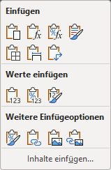
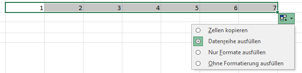
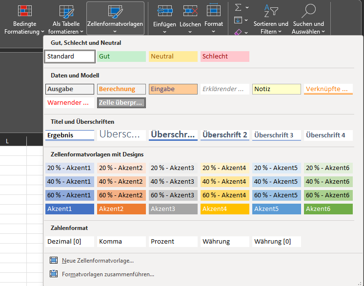
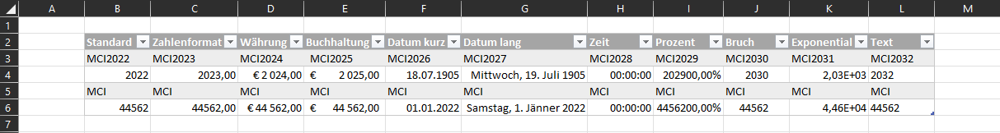

# Datenaufbereitung

Bevor man Daten auswerten kann, müssen sie meist aus mehreren Quellen zusammengeführt, bereinigt und sauber formatiert werden. In diesem Kapitel beschäftigen wir uns mit dem Zusammenspiel mehrerer Arbeitsmappen, der Pflege von Arbeitsblättern und mit den wichtigsten Zellformatierungen.

## Zusammenfassen von Daten

Häufig kommt es vor, dass Daten aus mehreren Arbeitsmappen ausgewertet werden sollen. Um über die Dateigrenzen hinweg auswerten zu können, gibt es mehrere Möglichkeiten.

### Daten kopieren

Die einfachste Möglichkeit, Daten aus mehreren Dokumenten zusammenzuführen, ist das Kopieren der Zellen. Wichtig dabei: Im Auswertedokument müssen die Daten richtig **eingefügt** werden — denn hier gibt es viele Optionen.



- **Einfügen**: Fügt alle Zellinhalte und Formatierungen ein, einschließlich verknüpfter Daten.
- **Formeln**: Fügt nur die Formeln ein.
- **Formeln und Zahlenformate**: Fügt nur Formeln und Zahlenformatoptionen ein.
- **Ursprüngliche Formatierung beibehalten**: Fügt kopierte Zellinhalte zusammen mit der Spaltenbreite ein.
- **Keine Rahmenlinien**: Fügt alle Zellinhalte und Formatierungen ein — mit Ausnahme der Rahmenlinien.
- **Breite der Ursprungsspalte beibehalten**: Fügt nur die Spaltenbreite ein.
- **Transponieren**: Richtet die Inhalte kopierter Zellen beim Einfügen neu aus. Daten aus Zeilen werden zu Spalten und umgekehrt.
- **Werte**: Formelergebnisse ohne Formatierung oder Kommentare.
- **Werte und Zahlenformate**: Fügt nur die Werte und das Zahlenformat ein.
- **Werte und Quellformatierung**: Fügt Werte und die Formatierung der kopierten Zellen ein.
- **Formatierung**: Nur die Formatierung der kopierten Zellen.
- **Verknüpfung einfügen**: Verknüpft die eingefügten Daten mit den Originaldaten. Excel fügt an der neuen Position einen absoluten Bezug auf die kopierte Zelle/den Zellbereich ein.
- **Grafik**: Fügt eine Kopie als Bild ein.
- **Verknüpfte Grafik**: Fügt eine Kopie der Grafik mit Verknüpfung zu den Quellzellen ein — Änderungen an den Quellzellen werden in der eingefügten Grafik widergespiegelt.

### Daten verknüpfen

Neben dem klassischen Kopieren gibt es fortgeschrittene Möglichkeiten, Daten aus unterschiedlichen Dokumenten zusammenzufassen. **Verknüpfungen** — also Zellbezüge — können nicht nur innerhalb eines Arbeitsblattes, sondern auch zwischen Arbeitsblättern und Arbeitsmappen hergestellt werden. Der zugehörige Befehl sieht folgendermaßen aus:

$$
\texttt{=}\underbrace{\texttt{[Daten1.xlsx]}}_{\text{Name der Mappe}}\underbrace{\texttt{Mitarbeiter}}_{\text{Blattname}}\texttt{!}\underbrace{\texttt{\$D\$12}}_{\text{Zelle}}
$$

!!! warning "Hinweis"
    Sollte der Name der Arbeitsmappe oder des Arbeitsblatts ein Leerzeichen enthalten, wird beides zwischen Hochkommas geschrieben:

    `='[Daten 1.xlsx]Mitarbeiter 1'!$D$12`

Bei einer Verknüpfung innerhalb der gleichen Arbeitsmappe fehlt der erste Teil des Bezugs (*Name der Mappe*). Wird bei Verknüpfungen über mehrere Arbeitsmappen hinweg die Quelldatei geschlossen, ändert sich die Verknüpfung und der absolute Pfad der Datei wird angezeigt. Dadurch ist es möglich, auf Daten aus aktuell geschlossenen Arbeitsmappen zuzugreifen:

`='C:\...\[Daten 1.xlsx]Mitarbeiter 1'!$D$12`

Der **große Vorteil** von Verknüpfungen gegenüber klassischem Kopieren ist die **automatische Aktualisierung**: Bei einer Änderung in der Quelldatei wird der Wert in der Zieldatei direkt aktualisiert. Sollte eine Datei im geschlossenen Zustand umbenannt werden, kann dies zu einer Fehlermeldung führen. Du wirst dann entweder aufgefordert, die Quelldatei neu auszuwählen, oder du löst es selbst auf — über *Daten* → *Abfragen und Verbindungen* → *Verknüpfungen bearbeiten*. Dort findest du auch die Option *Verknüpfung löschen*: Sie löscht die Verknüpfung und lässt den Wert in der Zieldatei bestehen.

!!! warning "Hinweis"
    Solltest du sehr viele Verknüpfungen (mehrere Tausend) in deiner Zieldatei haben, ist es sinnvoll, die Quelldatei zum Aktualisieren zu öffnen. Andernfalls öffnet Excel die Datei für jeden einzelnen Zellbezug nacheinander im Hintergrund.

Neben der manuellen Eingabe der Verknüpfung kannst du — wie weiter oben unter *Daten kopieren* beschrieben — auch über *Kopieren* und *Verknüpfung einfügen* eine Verknüpfung erstellen.

### Arbeitsblätter verschieben/kopieren

Eine weitere Möglichkeit, Daten aus mehreren Quelldateien in einer Zieldatei zusammenzufassen, ist das **Kopieren und Verschieben von Arbeitsblättern**.


- **Drag and Drop**: Du kannst das Arbeitsblatt in der Quelldatei anwählen und mit Drag-and-Drop in die Zieldatei verschieben. Mit gleichzeitig gedrückter <kbd>STRG</kbd>-Taste wird das Arbeitsblatt kopiert.
- **Kontextmenü**: Rechtsklick auf das zu kopierende oder verschiebende Arbeitsblatt → *Verschieben oder Kopieren*. Es öffnet sich ein Fenster, in dem du den Vorgang einstellen kannst. Bei *Zur Mappe* wählst du die Zieldatei. Mit dem Häkchen *Kopie erstellen* wird das Arbeitsblatt kopiert statt verschoben.

!!! warning "Hinweis"
    Wenn du Arbeitsblätter aus mehreren Arbeitsmappen verschieben/kopieren willst, kannst du unter *Ansicht* → *Fenster* alle Arbeitsmappen so anordnen (z. B. *Anordnen horizontal*), dass du die Blätter möglichst einfach in die Zieldatei ziehen kannst.

## Arbeiten mit Arbeitsblättern

Wir haben in den vorangegangenen Abschnitten bereits mit Arbeitsblättern gearbeitet. Sehen wir sie uns nun näher an. Die wichtigsten Operationen passieren über die Arbeitsblätterleiste:

- **Umbenennen**: Doppelklick auf den Namen des Arbeitsblattes ändert den Namen.
- **Verschieben**: Mit Drag-and-Drop können Arbeitsblätter einfach verschoben bzw. die Reihenfolge angepasst werden.
- **Hinzufügen**:
    - Über das **+**-Symbol am rechten Ende der Arbeitsblätterleiste
    - Rechtsklick auf die Arbeitsblätterleiste → *Einfügen* → *Tabellenblatt*
- **Kopieren**:
    - Drag-and-Drop mit gedrückter <kbd>STRG</kbd>-Taste
    - Rechtsklick auf das zu kopierende Arbeitsblatt → *Verschieben oder Kopieren*. Position auswählen, *Kopie erstellen* anhaken.
- **Löschen**: Rechtsklick auf das Arbeitsblatt → *Löschen*.
- **Ausblenden/Einblenden**: Rechtsklick → *Ausblenden*. Zum Einblenden Rechtsklick auf eines der sichtbaren Blätter → *Einblenden* — im Dialog kann das Blatt ausgewählt werden. (Versteckte Arbeitsblätter eignen sich gut für private Einstellungen oder Notizen.)
- **Farbe geben**: Rechtsklick → *Registerfarbe*.

## Einfache Formatierungen

### Zellen-Formatierung

Unter *Start* → *Schriftart* (oder per Rechtsklick auf eine Zelle) gibt es mehrere Möglichkeiten, die Zelle und ihren Inhalt zu formatieren. Neben der **Schrift** (Art, Größe, Stil und Farbe) können auch die Zellen selbst formatiert werden — Hintergrundfarbe und Rahmen.

Speziell beim **Rahmen** gibt es viele vorgefertigte Optionen. Unter *Rahmenlinie zeichnen* können individuelle Rahmen gezeichnet oder einzelne wieder gelöscht werden. Standardmäßig sind keine Rahmen in der Arbeitsmappe eingezeichnet. Die hellgrauen Linien werden beim Ausdrucken oder Speichern als PDF nicht angezeigt. Diese **Gitternetzlinien** können unter *Ansicht* → *Anzeigen* ein- und ausgeblendet werden.

An der rechten unteren Ecke des Schrift-Bereichs gibt es ein Symbol für **weitere Einstellungen**. Hier öffnet sich ein Fenster mit nützlichen Optionen wie Hoch- und Tiefstellen.


!!! warning "Hinweis"
    Formatierungen können sowohl auf ganze Zellen als auch auf einzelne Wörter in einer Zelle angewendet werden.

### Zellen-Ausrichtung

Unter *Start* → *Ausrichtung* gibt es mehrere Möglichkeiten, den Inhalt der Zellen auszurichten.


1. **Position** des Textes (oben, mitte, unten, rechtsbündig, zentriert, linksbündig)
2. **Orientierung** des Textes
    - **Rotation** des Textes
    - **Einzug** des Textes
3. **Platz** für Text in der Zelle
    - **Textumbruch**: Sollte nicht genügend Platz in der Zelle sein, kann ein Zeilenumbruch aktiviert werden. Zusätzlich können neue Zeilen mit <kbd>ALT</kbd> + <kbd>ENTER</kbd> in der Bearbeitungsleiste erzeugt werden. Um mehrere Zeilen in der Bearbeitungsleiste anzuzeigen, klicke rechts auf den Pfeil.
    - **Verbinden und zentrieren**: Mehrere Zellen werden zu einer zusammengefasst. Standardmäßig wird der Inhalt zentriert. Wenn mehrere Zellen vorher Inhalt besitzen, wird nur der Text in der linken oberen Zelle übernommen.

!!! warning "Hinweis"
    In manchen Situationen kann das Verbinden von Zellen zu Problemen führen. Eine Alternative: Zellen markieren, *Rechtsklick* → *Zellen formatieren* → *Ausrichtung* → *Textausrichtung* → *Horizontal* → *Über Auswahl zentrieren*. Damit wird der Text zentriert, aber die Zellen bleiben getrennt verwendbar.

### Inhalte bearbeiten

Unter *Start* → *Bearbeiten* gibt es mehrere Möglichkeiten, die Inhalte eines Arbeitsblattes zu verändern.


1. **Suchen und Auswählen**
    - **Suchen** und **Ersetzen**: Wie in vielen Software-Lösungen gibt es auch in Excel die Funktion, nach Inhalten zu suchen (<kbd>STRG</kbd> + <kbd>F</kbd>) und zu ersetzen (<kbd>STRG</kbd> + <kbd>K</kbd>). Eine hilfreiche Funktion beim Suchen ist *Alle suchen*: Alle Treffer werden aufgelistet. Mit <kbd>STRG</kbd> + <kbd>A</kbd> in der Auflistung markierst du alle Treffer am Arbeitsblatt — z. B. um leere Zellen zu finden und einzufärben. Außerdem kannst du auch nach Formatierungen (z. B. Zellfarbe) suchen oder mit Formatierung ersetzen.
    - **Inhalte auswählen**: Damit können spezielle Inhalte auf einem Arbeitsblatt ausgewählt werden — z. B. mit *Inhalte auswählen* → *Formeln* alle Formeln, die du dann gemeinsam bearbeitest. Geht auch für Notizen, Konstanten, Leerzellen und vieles mehr.
2. **Sortieren und Filtern**: Häufig hat ein Datensatz eine Kopfzeile mit Überschriften. Markierst du den gesamten Datensatz und klickst auf *Sortieren und Filter* → *Filtern*, bekommen die Überschriften ein eigenes Dropdown-Menü. Aufklappen → nach Einträgen filtern. Zusätzlich können Wildcards (siehe unten) verwendet werden, und du kannst direkt sortieren. Wenn die Daten richtig formatiert sind (siehe [Inhaltsformate](#inhaltsformate)) — z. B. als Datum — wird das in der Filterung berücksichtigt. Auch Farben können zum Filtern verwendet werden.
3. **Ausfüllen**: Mit Ausfüllen können Zellen automatisiert befüllt werden. Mehrere Zellen markieren und auf *Ausfüllen* klicken — du wählst, ob du nach oben, unten, rechts oder links ausfüllen willst. Es wird der Inhalt der ersten Zelle in alle weiteren markierten Zellen kopiert. Alternativ: Eine Zelle auswählen → auf den rechten unteren Punkt klicken → halten → in eine Richtung ziehen. Excel hat dabei eine gewisse "Intelligenz" und vervollständigt logische Reihen automatisch. Diese kannst du nach dem Ziehen über das Symbol konfigurieren oder ausschalten.



Excel erlaubt auch die Verwendung von **Wildcards**. Diese Platzhalter können beim Suchen oder Filtern verwendet werden, um unbekannte Teile des Inhalts zu ignorieren:

- `?` — Platzhalter für **ein Zeichen**
- `*` — Platzhalter für **beliebig viele Zeichen**
- `~` — erlaubt in Kombination mit den anderen beiden Wildcards die Suche nach den eigentlichen Zeichen (`?`, `*` oder `~`)

Beispiele:

| Verwendung | Verhalten | Treffer |
|---|---|---|
| `?` | Genau ein Zeichen | 'A', 'B', 'c', 'z' |
| `???` | Genau drei Zeichen | 'Jet', 'AAA', 'ccc' |
| `*` | Beliebig viele Zeichen (= alles) | 'apple', 'APPLE', 'A100' |
| `*th` | Endet mit 'th' | 'bath', 'fourth' |
| `c*` | Startet mit 'c' | 'Cat', 'CAB', 'cindy', 'candy' |
| `?*` | Mindestens ein Zeichen | 'a', 'b', 'ab', 'ABCD' |
| `???-??` | Fünf Zeichen mit Strich zwischen 3. und 4. Stelle | 'ABC-99', '100-ZT' |
| `*~?` | Endet mit Fragezeichen | 'Hello?', 'Anybody home?' |
| `*xyz*` | Beinhaltet 'xyz' | 'code is XYZ', '100-XYZ-2', 'XyZ90' |

!!! warning "Hinweis"
    Wildcards können auch in Formeln verwendet werden, um z. B. Vergleiche durchzuführen.

### Fixieren

Viele Arbeitsblätter besitzen in den ersten Zeilen und Spalten Überschriften bzw. wichtige Informationen. Bei großen Datensätzen, die nicht auf einem Bildschirm dargestellt werden können, ist es manchmal hilfreich, diese ersten **Zeilen/Spalten zu fixieren**, damit sie immer sichtbar bleiben. Unter *Ansicht* → *Fenster* → *Fenster fixieren* kannst du:

1. die erste Zeile,
2. die erste Spalte oder
3. ein Fenster fixieren.

Um beliebig viele Zeilen und/oder Spalten zu fixieren, eignet sich die letzte Variante. Klicke in die erste Zelle, die noch beweglich bleiben soll. Durch Klick auf *Fenster fixieren* werden alle Zeilen oberhalb und alle Spalten links davon fixiert.

### Formatvorlagen und Tabellen

Unter *Start* → *Formatvorlagen* gibt es einfache Möglichkeiten, Zellen zu formatieren. Häufig hat man eine Zelle oder einen Bereich bereits sauber formatiert und möchte diese Formatierung auf andere Bereiche übertragen. Dafür gibt es mit dem Befehl *Format übertragen* im Reiter *Start* → *Zwischenablage* eine komfortable Lösung. Klick auf die Quellzelle → *Format übertragen* → Klick auf die Zielzelle. Wenn du dieses Format öfter übertragen möchtest, doppelklicke auf *Format übertragen* und wähle anschließend nacheinander einzelne Zellen oder Bereiche aus.



Neben den reinen Formatvorlagen gibt es auch die Möglichkeit, einen Datenbereich als **Tabelle** zu formatieren. Überschriften werden speziell hervorgehoben und besitzen automatisch die Filterfunktion. Es gibt weitere große Vorteile, die später näher beschrieben werden.

!!! warning "Hinweis"
    Bedingte Formatierung und Tabellen werden detailliert im Kapitel [Tabellen & Pivot-Tabellen](tabellen.md) und [Visualisierung](visualisierung.md) besprochen.

### Inhaltsformate

Zellen in Excel können mit unterschiedlichstem Inhalt befüllt werden. Um diesen bestmöglich darzustellen und auch korrekt verwenden zu können, ist es sinnvoll, ein passendes **Format** auszuwählen. Unter *Start* → *Zahl* können verschiedene Formate für eine Zelle gewählt werden. Abhängig vom Format wird der Inhalt entsprechend interpretiert und dargestellt. Das Format hat unter anderem auch Auswirkungen auf Berechnungen und Filter.

Neben den im Dropdown verfügbaren Formaten können unter *Weitere Zahlenformate* sehr viele Einstellungen vorgenommen werden. Unter *Benutzerdefiniert* lassen sich eigene Formate festlegen. Wenn eigene **Einheiten** — wie $mm$ oder $Volt$ — verwendet werden sollen, schreibst du sie in Anführungszeichen (Beispiel: `0,00 "mm"`). Zusätzlich kann zwischen Einzahl und Mehrzahl unterschieden werden, z. B.:

```
[=1] 0 "<text Einzahl>"; #.##0 "<text Mehrzahl>"
```

Im genannten Reiter findest du auch die Möglichkeit, mehr oder weniger Nachkommastellen anzuzeigen und ein 1000er-Trennzeichen einzufügen.



!!! warning "Hinweis"
    Datums- und Uhrzeitformate werden in Excel speziell behandelt. Ein Datum wird im Hintergrund als fortlaufende Ganzzahl gehandhabt: 01.01.1900 ist die Zahl 1, 10.01.1900 die Zahl 10 usw. Die Uhrzeit wird im Bereich $[0,1]$ abgebildet — also als Nachkommazahl. 00:00:00 ist 0,00, 08:30:00 ist 0,354 und 24:00:00 ist 1. So kann mit Datum und Uhrzeit gerechnet werden.

!!! abstract "Anhang"
    Im Anhang findest du einen [Cheatsheet zu Platzhaltern für Zahlenformate](cheatsheet.md).

!!! question "Übungsaufgabe"
    Nachdem wir nun gelernt haben, Daten zu bereinigen und optisch ansprechend darzustellen, ist es an der Zeit, das Erlernte zu üben:

    - :material-microsoft-excel: `02_DataCleanUp.xlsx`
