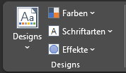
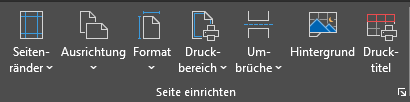
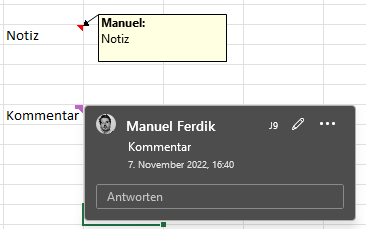
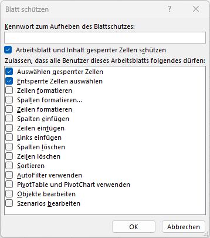
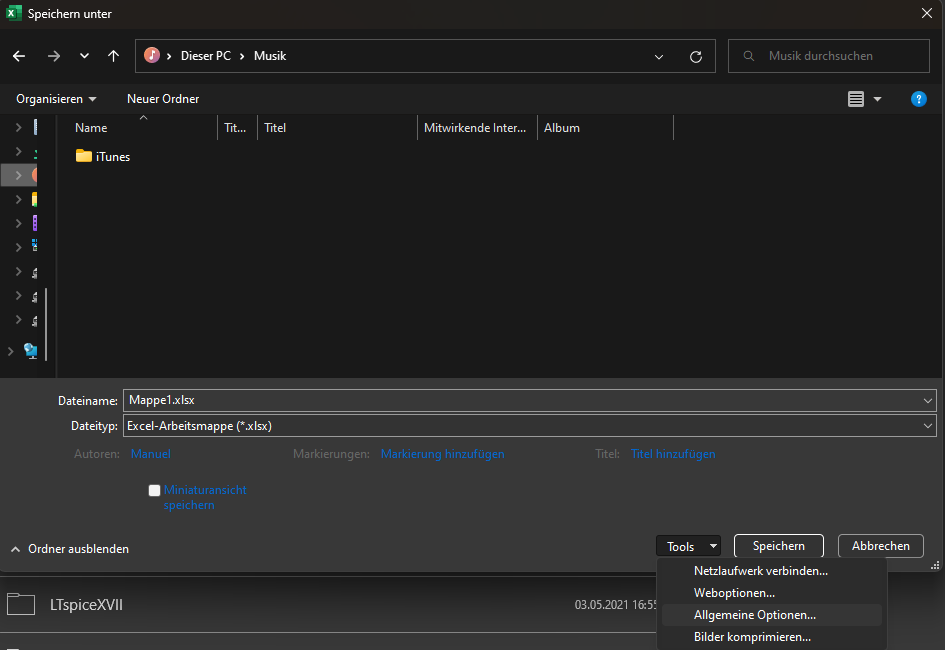

# Arbeitsmappen finalisieren

Bisher haben wir gelernt, Daten einzulesen, zu bearbeiten und zu visualisieren. Häufig möchten wir das Ergebnis verteilen - sei es als Ausdruck, als Bericht oder als gesamte Excel-Datei. Daher ist es nun an der Zeit, die Arbeitsmappe zu **finalisieren**.

## Design

Bei der Erstellung einer Arbeitsmappe musst du dich vielleicht an ein Corporate Design halten oder eine eigene **Farbkombination** verwenden. Unter *Seitenlayout* → *Designs* können verschiedenste Einstellungen vorgenommen werden. Neben Standard-Designvorschlägen können auch eigene Designs erstellt bzw. das aktuelle Schema als Design abgespeichert werden. Ein Design umfasst die drei Bereiche **Farben**, **Schriftarten** und **Effekte**, die auch separat ausgewählt und gespeichert werden können.

!!! warning "Hinweis"
    **Gitternetzlinien** können in Excel ganz einfach ausgeblendet werden. Unter *Ansicht* → *Anzeigen* → *Gitternetzlinien* können sie an- oder abgewählt werden. Beim Ausdrucken werden sie unabhängig davon nie angezeigt - außer es wurde ein Rahmen festgelegt.

## Ansichten

Beim **Ausdrucken** einer Arbeitsmappe stößt man häufig an das Problem, dass der Seitenumbruch nicht ideal liegt. Unter *Ansicht* → *Arbeitsmappenansichten* gibt es verschiedene Optionen. Mit *Umbruchvorschau* können die Umbrüche für den Druck vorab geprüft werden. Die blauen Linien können mit der Maus gezogen werden, um den Druckbereich anzupassen. Gleiches gilt für *Seitenlayout* - hier werden zusätzlich noch die Überschrift beim Ausdrucken und die **Seitenränder** richtig dargestellt; sie können in dieser Ansicht direkt angepasst werden.

Um Umbrüche, Seitenränder und Überschriften beim Ausdrucken systematisch anzupassen, gibt es unter *Seitenlayout* → *Seite einrichten* mehrere Optionen.

- **Seitenränder**: Die Ränder beim Ausdruck einstellen.
- **Ausrichtung**: Quer- oder Hochformat.
- **Format**: Blattgröße einstellen.
- **Druckbereich**: Einzelne Zell(-bereiche) festlegen, die gedruckt werden sollen - so können z. B. immer ganze Tabellen gewählt werden, die dann komplett gedruckt werden.
- **Umbrüche**: Eigene Seitenumbrüche einfügen. Im Ansichtsmodus *Umbruchvorschau* können diese sehr einfach dargestellt werden. Markiere eine Spalte oder Zeile und klicke auf *Seitenumbruch einfügen* - an der entsprechenden Stelle wird ein Umbruch eingefügt.
- **Hintergrund**: Ein Hintergrundbild auswählen, das im Arbeitsblatt angezeigt, beim Ausdrucken aber ausgeblendet wird.
- **Drucktitel**: Hier öffnet sich ein eigenes Dialogfenster mit allen Einstellungen. Es können Kopf- und Fußzeilen eingefügt sowie **Wiederholungszeilen** (Zeilen/Spalten, die auf jeder Seite des Ausdrucks erscheinen) angegeben werden.

## Kommentare

Bei der **Zusammenarbeit** mit mehreren Personen kann es hilfreich sein, Kommentare im Arbeitsblatt einzufügen. Über *Überprüfen* → *Kommentare* können neue Kommentare eingefügt und gelöscht werden. Außerdem gibt es die Optionen, zum nächsten oder vorigen Kommentar zu springen sowie alle Kommentare einzublenden.

Neben Kommentaren gibt es auch **Notizen**. Sie eignen sich besonders, wenn du dauerhafte Nachrichten einfügen möchtest. Kommentare hingegen sind eher als ToDos gedacht, die nach Abschluss wieder gelöscht werden.

## Arbeitsblätter und -mappen schützen

Um den Anwender einer Arbeitsmappe davor zu bewahren, **unerwünscht Dinge zu verändern**, können einzelne Zellen, einzelne Arbeitsblätter oder ganze Arbeitsmappen geschützt werden. Im Bereich *Überprüfen* → *Schützen* findest du mehrere Optionen.

### Struktur schützen

Klick auf *Arbeitsmappe schützen* öffnet ein Dialogfenster. Dort kann optional ein **Kennwort** vergeben werden, das benötigt wird, um die Arbeitsmappe wieder zu entsperren. Mit *OK* wird die Struktur der Arbeitsmappe gesperrt - danach können keine neuen Arbeitsblätter mehr hinzugefügt, geändert oder gelöscht werden.

### Inhalte schützen

Klick auf *Blatt schützen* öffnet das folgende Dialogfenster. Neben dem Kennwort können auch Optionen aus- oder abgewählt werden, was dem Nutzer nach der Sperrung weiterhin erlaubt bleiben soll. In manchen Bereichen wird zwischen gesperrten und entsperrten Bereichen unterschieden. Ob eine Zelle oder ein Bereich gesperrt ist, kann mit Rechtsklick → *Zellen formatieren* → *Schutz* → *Gesperrt* festgelegt werden.

!!! warning "Hinweis"
    Wenn ein Blatt geschützt ist, kann mit <kbd>TAB</kbd> zwischen den nicht gesperrten Zellen hin und her gesprungen werden. So lässt sich ein einfaches **Formular** erzeugen, das schnell mit <kbd>TAB</kbd> befüllt werden kann.

### Gesamte Datei schützen

Manchmal ist es sinnvoll, eine gesamte Excel-Datei zu schützen. Über *Datei* → *Speichern unter* kannst du unterhalb des Dateinamens auf *Mehr Optionen* klicken - das öffnet das klassische *Speichern unter*-Fenster. Neben der Schaltfläche *Speichern* gibt es den Bereich *Tools* mit mehreren Optionen. Unter *Allgemeine Optionen* können nun Kennwörter zum Öffnen oder Ändern der Datei vergeben werden.

!!! warning "Hinweis"
    Alle gezeigten Möglichkeiten - und mehr - können auch unter *Datei* → *Informationen* → *Arbeitsmappe schützen* aufgerufen werden.

## Arbeitsmappe finalisieren

Excel bietet einige interessante Funktionen zum Finalisieren einer Arbeitsmappe. Beispielsweise kann unter *Datei* → *Informationen* → *Auf Probleme überprüfen* das Dokument geprüft werden. Dabei werden einige Dinge nochmals **hervorgehoben**, die ggf. korrigiert werden sollten - z. B. ausgeblendete Tabellenblätter oder personenbezogene Informationen, die noch in der Datei enthalten sind.

## Verwenden von Elementen in anderen Office-Programmen

Häufig sollen Excel-Diagramme oder -Tabellen in anderen Office-Programmen **weiterverwendet** werden. Beim Einfügen in z. B. PowerPoint gibt es mehrere Möglichkeiten:

- **Microsoft Office-Grafikobjekt** (Standardmethode): Mit <kbd>STRG</kbd> + <kbd>V</kbd> wird automatisch diese Methode verwendet. Es wird ein "intelligentes" Objekt eingebunden, das einige Vorteile mit sich bringt - z. B. lassen sich Formatierung und Diagrammelemente nachträglich ändern. Außerdem können gewisse Daten gefiltert werden (über die drei Symbole rechts neben der Grafik).
- **Bilddatei** (PNG, JPEG, GIF, …): Über *Einfügen* → *Inhalte einfügen* kann unter *Einfügen* zwischen mehreren Bildformaten gewählt werden. Diese Option erlaubt kein nachträgliches Ändern des Inhalts mehr.
- **Microsoft Excel Diagramm-Objekt**: Über *Einfügen* → *Inhalte einfügen* die Option *Microsoft Excel Diagramm-Objekt* wählen. Nachteil: Im Hintergrund wird die gesamte Datei mitgespeichert. Wenn die Präsentation oder das Word-File anschließend versendet wird, hat der Empfänger Zugriff auf alle Kalkulationen und Tabellenblätter (per Doppelklick wird die Excel-Datei geöffnet).
- **Microsoft Excel Diagramm-Objekt mit Verknüpfung**: Über *Einfügen* → *Inhalte einfügen* → *Verknüpfung einfügen*. So besteht eine aktive Verbindung zur Ursprungsdatei: Änderungen in der Excel-Datei werden automatisch in die eingefügte Grafik übernommen. Beim Versenden der Präsentation wird die Excel-Datei nicht mitgesendet - Aktualisierungen sind dann nicht mehr möglich, aber der zuletzt aktuelle Stand bleibt in der Präsentation enthalten.

!!! question "Übungsaufgabe"
    Nachdem wir nun einige Funktionen in Excel kennengelernt haben, ist es an der Zeit, das Erlernte zu üben. Öffne die nachfolgende Datei und probiere die besprochenen Inhalte aus:

    - :material-microsoft-excel: `05_Finalisieren.xlsx`
