# Daten auswerten mit Funktionen

In diesem Kapitel lernen wir die wichtigsten Funktionen kennen und wenden sie begleitend in Excel anhand eines Beispiels an. Jede Funktion ist nach dem gleichen Schema dokumentiert: **Beschreibung**, **Syntax** und ein **Beispiel**.

## SUMME

### Beschreibung

Eine zentrale und sehr häufig verwendete Funktion ist `SUMME`. Damit können einzelne Zahlen bzw. ganze Zahlenbereiche aufsummiert werden.

!!! warning "Hinweis"
    Excel bietet auch die Möglichkeit, automatisch die Summe zu berechnen, ohne extra eine Formel einzugeben. Mit <kbd>ALT</kbd> + <kbd>=</kbd> wird die Auto-Summe der angrenzenden Zellen berechnet.

### Syntax

```
=SUMME(Zahl1; [Zahl2]; ...)
```

Parameter:

- **Zahl1**: Eine oder mehrere Zahlen, die zur Summe hinzugezählt werden sollen. Direkt oder als Zellbezug (einzeln oder als Bereich).
- **Zahl2, …**: Beliebig viele weitere Zahlen optional.

### Beispiel

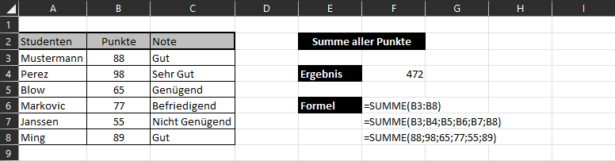

## ANZAHL

### Beschreibung

Häufig benötigt man die Anzahl der Zellen in einem Datensatz. Excel unterscheidet:

- `ANZAHL`: Anzahl an Zellen, die **Zahlen** enthalten
- `ANZAHL2`: Anzahl an Zellen, die **nicht leer** sind
- `ANZAHLLEERZELLEN`: Anzahl an Zellen, die **leer** sind

### Syntax

```
=ANZAHL(Wert1; Wert2; ...)
=ANZAHL2(Wert1; Wert2; ...)
=ANZAHLLEERZELLEN(Bereich)
```

Parameter:

- **Wert1, Wert2, …**: Jeder Wert repräsentiert eine oder mehrere Zellen, welche den zu betrachtenden Bereich definieren.
- **Bereich**: Bereich, der nach leeren Zellen durchsucht werden soll.

### Beispiel

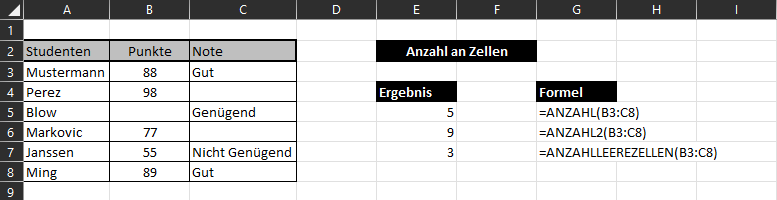

## MITTELWERT

### Beschreibung

Bei der Datenanalyse braucht man oft ein **Maß der zentralen Tendenz**. Die drei bekanntesten Arten - Arithmetisches Mittel, Median und Modus:

- `MITTELWERT`: Arithmetisches Mittel der Zahlenwerte
- `MEDIAN`: Wert, der den Datensatz in eine obere und eine untere Hälfte teilt
- `MODUS.EINF` bzw. `MODUS.VIELF`: Liefert den am häufigsten vorkommenden Wert. Wenn mehrere Werte gleich häufig vorkommen, gibt `MODUS.VIELF` alle zurück.

### Syntax

```
=MITTELWERT(Zahl1; Zahl2; ...)
=MEDIAN(Zahl1; Zahl2; ...)
=MODUS.EINF(Zahl1; Zahl2; ...)
=MODUS.VIELF(Zahl1; Zahl2; ...)
```

Parameter:

- **Zahl1, Zahl2, …**: Eine oder mehrere Zahlen, die zur Berechnung herangezogen werden - direkt oder als Zellbezug (einzeln oder Bereiche).

### Beispiel

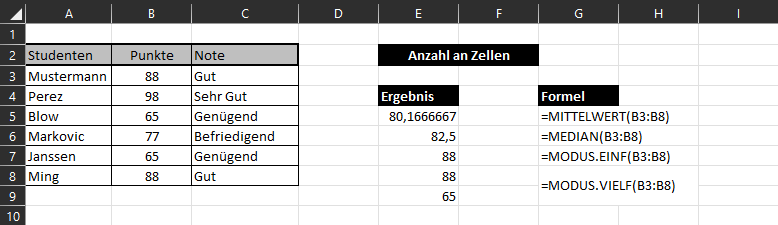

!!! warning "Hinweis"
    Der Modus ist in Excel nicht für nominale Daten ausgelegt. Um trotzdem den Modus eines Texts zu finden, hilft folgende Formel:

    `=INDEX(A1:A10; MODUS.EINF(VERGLEICH(A1:A10; A1:A10; 0)))`

## MIN/MAX, KGRÖSSTE/KKLEINSTE

### Beschreibung

Excel bietet eine einfache Möglichkeit, den **minimalen** und **maximalen** Wert eines Datensatzes zu bestimmen. Zusätzlich gibt es Funktionen, die den k-größten/k-kleinsten Wert zurückgeben (für $k=1$ identisch zu `MAX` bzw. `MIN`).

- `MIN`: minimaler Wert in einer Datenreihe
- `MAX`: maximaler Wert in einer Datenreihe
- `KGRÖSSTE`: k-größter Wert in einer Datenreihe
- `KKLEINSTE`: k-kleinster Wert in einer Datenreihe

### Syntax

```
=MIN(Zahl1; Zahl2; ...)
=MAX(Zahl1; Zahl2; ...)
=KGRÖSSTE(Matrix; k)
=KKLEINSTE(Matrix; k)
```

Parameter:

- **Zahl1, Zahl2, …**: Eine oder mehrere Zahlen - direkt oder als Zellbezug.
- **Matrix**: Bereich, in dem nach dem k-größten/k-kleinsten Wert gesucht wird.
- **k**: Gibt an, der wievielt-größte/-kleinste Wert zurückgegeben werden soll.

### Beispiel

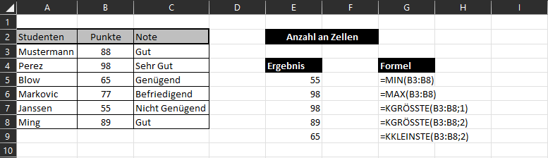

## RANG

### Beschreibung

Die Funktion `RANG` gibt den Rang zurück, den eine Zahl innerhalb einer Liste von Zahlen einnimmt. Sie kann als Gegenstück zu `KGRÖSSTE` gesehen werden: `RANG` liefert die unbekannte Position bei gegebenem Wert, `KGRÖSSTE` den Wert bei bekannter Position.

!!! warning "Hinweis"
    Die Funktion `RANG` ist eigentlich veraltet und wurde durch `RANG.GLEICH` und `RANG.MITTELW` ersetzt. Der Unterschied liegt im Umgang mit gleichgroßen Einträgen (oberster Rang vs. Mittelwert der gleichen Ränge). Die alte Funktion ist weiterhin anwendbar.

### Syntax

```
=RANG(Zahl; Bezug; [Reihenfolge])
=RANG.GLEICH(Zahl; Bezug; [Reihenfolge])
=RANG.MITTELW(Zahl; Bezug; [Reihenfolge])
```

Parameter:

- **Zahl**: Welcher Wert soll hinsichtlich Position in einer Liste betrachtet werden.
- **Bezug**: Liste aller Werte.
- **Reihenfolge**: Soll der Rang aufsteigend (1) oder absteigend (0) bestimmt werden.

### Beispiel

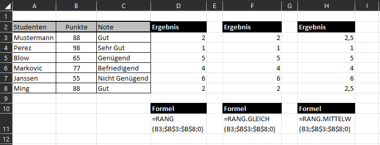

## SVERWEIS und WVERWEIS

### Beschreibung

Zwei der wichtigsten Funktionen in Excel sind `SVERWEIS` und `WVERWEIS`. Beide werden verwendet, um Einträge in einem Datensatz zu finden. Der Unterschied ist die Suchrichtung: `SVERWEIS` sucht **senkrecht** (S), `WVERWEIS` **waagrecht** (W). Im Folgenden wird `SVERWEIS` näher erläutert.

### Syntax

```
=SVERWEIS(Suchkriterium; Matrix; Spaltenindex; [Bereich_Verweis])
```

Parameter:

- **Suchkriterium**: Nach welchem Inhalt soll in der ersten Spalte der Matrix gesucht werden (direkte Eingabe oder Zellbezug).
- **Matrix**: Wo befindet sich der Datensatz.
- **Spaltenindex**: Wenn das Suchkriterium gefunden wurde, gibt die Funktion den Inhalt in der entsprechenden Zeile und der Spalte mit diesem Index zurück.
- **Bereich_Verweis**: Optionaler Parameter, der festlegt, ob nur exakte Übereinstimmungen (`FALSCH`) oder möglichst genaue (`WAHR`) gefunden werden. Standardmäßig ist `WAHR` aktiviert.

### Beispiel

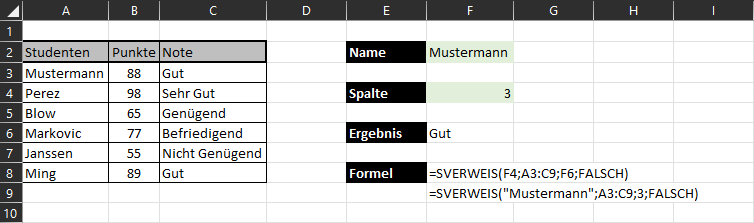

!!! warning "Hinweis"
    Sollten mehrere Einträge mit dem Suchergebnis übereinstimmen, wird nur das erste zurückgegeben. Außerdem können `SVERWEIS` und `WVERWEIS` keine negativen Zeilen-/Spaltenindizes - d. h. der zurückgegebene Wert kann nur rechts oder unterhalb der Suchspalte liegen. Eine Lösung dafür bieten `VERGLEICH` und `INDEX`, die wir später besprechen.

## XVERWEIS

### Beschreibung

Wie beschrieben haben sowohl `SVERWEIS` als auch `WVERWEIS` einen großen Nachteil. In neueren Excel-Versionen hat Microsoft daher den Befehl `XVERWEIS` veröffentlicht. Durch die Trennung von Such- und Rückgabematrix können nun auch Ergebnisse links bzw. oberhalb der Suchspalte zurückgegeben werden. Außerdem vereint `XVERWEIS` senkrechte und waagrechte Suche.

### Syntax

```
=XVERWEIS(Suchkriterium; Suchmatrix; Rückgabematrix;
          [Wenn_nicht_gefunden]; [Vergleichsmodus]; [Suchmodus])
```

Parameter:

- **Suchkriterium**: Nach welchem Inhalt gesucht werden soll.
- **Suchmatrix**: Matrix, in der nach dem Suchkriterium gesucht wird.
- **Rückgabematrix**: Matrix, aus der am selben Index wie das Suchergebnis der Wert zurückgegeben wird.
- **Wenn_nicht_gefunden**: Erlaubt eine Rückgabe, falls keine Übereinstimmung gefunden wird.
- **Vergleichsmodus**: Soll nach exakter (0) oder ähnlicher Übereinstimmung gesucht werden.
- **Suchmodus**: Soll von vorne nach hinten oder von hinten nach vorne gesucht werden.

### Beispiel

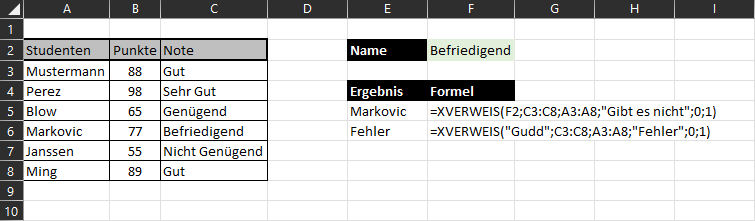

## VERGLEICH

### Beschreibung

Die Funktion `VERGLEICH` wurde etwas umständlich aus dem Englischen übersetzt. Im Wesentlichen sucht sie nach einem **Suchkriterium** innerhalb eines Bereiches und gibt anschließend die **relative Position** in diesem Bereich zurück.

### Syntax

```
=VERGLEICH(Suchkriterium; Suchmatrix; Vergleichstyp)
```

Parameter:

- **Suchkriterium**: Nach welchem Inhalt soll gesucht werden (direkte Eingabe oder Zellbezug).
- **Suchmatrix**: In welchem Bereich soll gesucht werden.
- **Vergleichstyp**: Legt fest, ob nur exakte Übereinstimmungen (0) oder auch größere (-1) bzw. kleinere (1) zurückgegeben werden.

### Beispiel

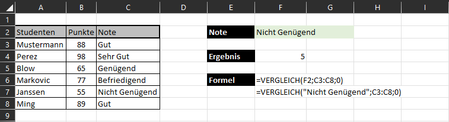

## INDEX

### Beschreibung

Nachdem mit `VERGLEICH` die Position eines Suchkriteriums gefunden wurde, liefert die `INDEX`-Funktion einen Wert entsprechend der Position. `INDEX` existiert in zwei Syntaxversionen: **Matrix-Version** und **Bezugs-Version**.

### Syntax

```
Matrix-Version:  =INDEX(Matrix; Zeile; [Spalte])
Bezugs-Version:  =INDEX(Bezug; Zeile; [Spalte]; [Bereich])
```

Parameter:

- **Matrix**: Definiert den Bereich, aus dem ein Wert an einer gewissen Position zurückgegeben wird.
- **Zeile**: Relative Zeilennummer in der definierten Matrix.
- **Spalte**: Relative Spaltennummer in der Matrix. Bei einer 1D-Matrix muss keine Spalte angegeben werden.
- **Bezug**: Definiert den Bereich, aus dem ein Wert zurückgegeben wird. Es können auch mehrere Bereiche ausgewählt werden (in Klammern, mit Semikolon getrennt).
- **Bereich**: Wenn mehrere Bereiche definiert sind, kann hier der zu verwendende ausgewählt werden.

### Beispiel

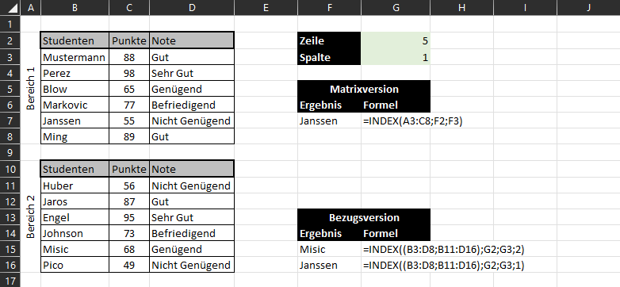

## INDIREKT

### Beschreibung

Üblicherweise werden zwischen zwei Zellen "normale" direkte Bezüge hergestellt. Mit der Funktion `INDIREKT` kann ebenfalls ein Bezug auf eine bestimmte Zelle hergestellt werden - allerdings kann dieser Bezug aus zusammengesetzten **Textbausteinen** bestehen, die wiederum von anderen Zellen abhängen können. Der daraus entstehende Zellbezug wird sofort ausgewertet und der Inhalt dargestellt.

### Syntax

```
=INDIREKT(Bezug; [A1])
```

Parameter:

- **Bezug**: Der Bezug auf eine Zelle. Dieser kann mit `&` zusammengesetzt werden. Text wird in Anführungszeichen angegeben.
- **A1**: Optionaler Parameter, der angibt, um welche Art von Bezügen es sich handelt. Für unsere Fälle kann er weggelassen werden.

!!! warning "Hinweis"
    Die `INDIREKT`-Funktion kann auch direkt im Namensmanager verwendet werden, um einen Namen für mehrere dynamische Bereiche zu vergeben.

### Beispiel

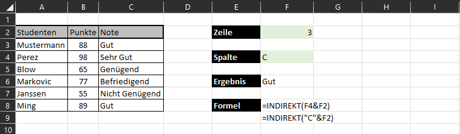

## WENN-Funktionen

### SUMMEWENN und MITTELWERTWENN

#### Beschreibung

Die Funktionen `SUMMEWENN` und `MITTELWERTWENN` erlauben eine **bedingte Summe** bzw. einen bedingten Mittelwert. In einem gewissen Bereich wird nach einem Kriterium gesucht; alle gefundenen Indizes werden anschließend auf einen weiteren Bereich angewendet und aufsummiert bzw. gemittelt.

#### Syntax

```
=SUMMEWENN(Bereich; Suchkriterium; [Summe_Bereich])
=MITTELWERTWENN(Bereich; Kriterien; [Mittelwert_Bereich])
```

Parameter:

- **Bereich**: Bereich (Vektor), in dem nach dem Suchkriterium gesucht wird.
- **Suchkriterium / Kriterien**: Nach welchem Inhalt gesucht werden soll.
- **Summe_Bereich / Mittelwert_Bereich**: Alle relativen Positionen, die in der Suche gefunden wurden, werden in diesem Bereich aufsummiert bzw. gemittelt.

!!! warning "Hinweis"
    Beide Funktionen besitzen erweiterte Varianten (`SUMMEWENNS` und `MITTELWERTWENNS`), die mehrere Kriterien zur Auswertung heranziehen können.

#### Beispiel

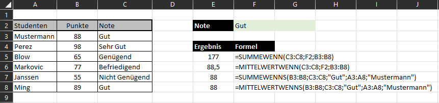

### MAXWENNS, MINWENNS und ZÄHLENWENN

#### Beschreibung

Wie zuvor gibt es auch für Max-/Min-Berechnungen bedingte Formen. `MAXWENNS` und `MINWENNS` bestimmen die maximalen/minimalen Werte unter Einhaltung eines oder mehrerer Kriterien. Gleiches gilt für `ZÄHLENWENN`: Es werden nur Zellen gezählt, die ein gewisses Kriterium erfüllen.

#### Syntax

```
=MAXWENNS(Max_Bereich; Kriterienbereich1; Kriterien1; ...)
=MINWENNS(Min_Bereich; Kriterienbereich1; Kriterien1; ...)
=ZÄHLENWENN(Bereich; Suchkriterien)
```

Parameter:

- **Max_Bereich / Min_Bereich**: Bereich, in dem der maximale/minimale Wert gesucht werden soll.
- **Kriterienbereich / Bereich**: Bereich, auf den sich die Kriterien beziehen.
- **Kriterien / Suchkriterien**: Nach welchem Kriterium soll gesucht werden.

!!! warning "Hinweis"
    `ZÄHLENWENN` besitzt eine erweiterte Variante (`ZÄHLENWENNS`), die mehrere Kriterien erlaubt.

#### Beispiel

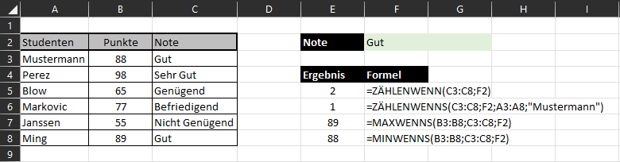

### WENN

#### Beschreibung

`WENN` (englisch *if*) ist eine der wichtigsten Funktionen für komplexere Arbeitsmappen. Mit einem **Wahrheitstest** lassen sich Kriterien überprüfen und je nach Ausgang (`WAHR`/`FALSCH`) ein anderer Wert (oder eine Berechnung) ausgegeben werden. Der Wahrheitstest kann aus einer einfachen Überprüfung bestehen oder mit `UND`, `ODER`, `XODER` aus mehreren zusammengesetzt werden.

#### Syntax

```
=WENN(Wahrheitstest; [Wert_wenn_wahr]; [Wert_wenn_falsch])
```

Parameter:

- **Wahrheitstest**: Überprüfung einer Bedingung mittels [Vergleichsoperatoren](grundlagen.md#vergleichsoperatoren).
- **Wert_wenn_wahr**: Wird zurückgegeben, falls der Wahrheitstest `WAHR` ist.
- **Wert_wenn_falsch**: Wird zurückgegeben, falls der Wahrheitstest `FALSCH` ist.

!!! warning "Hinweis"
    `WENN` besitzt eine erweiterte Variante (`WENNS`) für mehrere Kriterien - und kann zusätzlich kaskadiert werden.

#### Beispiel

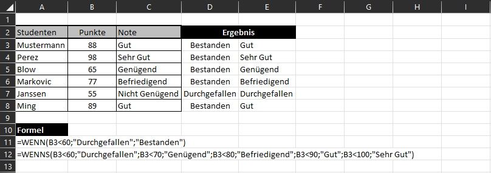

### WENNFEHLER und WENNNV

#### Beschreibung

Bei großen Auswertungen können Fehler auftreten. Mit `WENNFEHLER` und `WENNNV` lassen sich diese abfangen und gegebenenfalls korrigieren oder formatieren. Während `WENNFEHLER` **alle Fehler** abfragt, erkennt `WENNNV` nur **#NV-Fehler**. Diese treten sehr häufig bei `SVERWEIS` oder `VERGLEICH` auf, wenn ein Suchkriterium nicht gefunden wird.

#### Syntax

```
=WENNFEHLER(Wert; Wert_falls_Fehler)
=WENNNV(Wert; Wert_bei_NV)
```

Parameter:

- **Wert**: Wird ausgegeben, wenn kein Fehler in *Wert* vorhanden ist. Kann eine Formel oder ein Bezug sein.
- **Wert_falls_Fehler**: Wird zurückgegeben, falls in *Wert* ein Fehler aufgetreten ist.
- **Wert_bei_NV**: Wird zurückgegeben, falls in *Wert* ein #NV-Fehler aufgetreten ist.

#### Beispiel

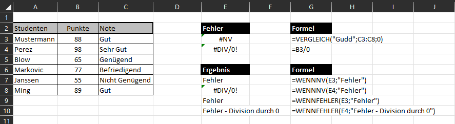

!!! question "Übungsaufgabe"
    Nachdem wir nun einige Funktionen in Excel kennengelernt haben, ist es an der Zeit, das Erlernte zu üben:

    - :material-microsoft-excel: `03_Funktionen.xlsx`

    Die Blätter mit **rotem Register** enthalten die Rohdaten (Studierende, Noten, Notenschlüssel, zwei Jahrgänge) und werden nicht verändert - genau so, wie Daten aus einem Vorsystem kämen. Auf den blauen Blättern wertest du sie aus:

    <div style="text-align:center; max-width:700px; margin:16px auto;">
    <table role="table" aria-label="Arbeitsblatt / Funktionen"
           style="width:100%; border-collapse:separate; border-spacing:0; border:1px solid #cfd8e3; border-radius:10px; overflow:hidden; font-family:system-ui,sans-serif;">
        <thead>
        <tr style="background:#009485; color:#fff;">
            <th style="text-align:left; padding:12px 14px; font-weight:700;">Arbeitsblatt</th>
            <th style="text-align:left; padding:12px 14px; font-weight:700;">Funktionen</th>
        </tr>
        </thead>
        <tbody>
        <tr>
            <td style="background:#00948511; padding:10px 14px;"><code>1 Basis</code></td>
            <td style="padding:10px 14px;"><code>SUMME</code>, <code>ANZAHL</code>, <code>ANZAHL2</code>, <code>ANZAHLLEERZELLEN</code>, <code>MITTELWERT</code></td>
        </tr>
        <tr>
            <td style="background:#00948511; padding:10px 14px;"><code>2 MinMax+Rang</code></td>
            <td style="padding:10px 14px;"><code>MIN</code>, <code>MAX</code>, <code>KGRÖSSTE</code>, <code>KKLEINSTE</code>, <code>RANG</code></td>
        </tr>
        <tr>
            <td style="background:#00948511; padding:10px 14px;"><code>3 Verweise</code></td>
            <td style="padding:10px 14px;"><code>SVERWEIS</code>, <code>WVERWEIS</code>, <code>XVERWEIS</code></td>
        </tr>
        <tr>
            <td style="background:#00948511; padding:10px 14px;"><code>4 INDEX+VERGLEICH</code></td>
            <td style="padding:10px 14px;"><code>VERGLEICH</code>, <code>INDEX</code> und die Kombination aus beiden</td>
        </tr>
        <tr>
            <td style="background:#00948511; padding:10px 14px;"><code>5 INDIREKT</code></td>
            <td style="padding:10px 14px;">Bezüge aus Textbausteinen - mit umschaltbarem Jahrgang</td>
        </tr>
        <tr>
            <td style="background:#00948511; padding:10px 14px;"><code>6 WENN-Familie</code></td>
            <td style="padding:10px 14px;"><code>SUMMEWENN</code>, <code>MITTELWERTWENN</code>, <code>ZÄHLENWENN</code>, <code>MAXWENNS</code>, <code>MINWENNS</code></td>
        </tr>
        <tr>
            <td style="background:#00948511; padding:10px 14px;"><code>7 WENN+Fehler</code></td>
            <td style="padding:10px 14px;"><code>WENN</code>, <code>UND</code>, <code>ODER</code>, <code>WENNFEHLER</code>, <code>WENNNV</code></td>
        </tr>
        <tr>
            <td style="background:#00948511; padding:10px 14px;"><code>8 Praxisfall</code></td>
            <td style="padding:10px 14px;">Notenliste komplett auswerten - alles zusammen</td>
        </tr>
        </tbody>
    </table>
    </div>

    **So funktioniert die Datei:** Gelb hinterlegte Zellen füllst du aus, graue Werte sind vorgegeben. Wo eine **Kontrollspalte** steht, prüft sie deine Eingabe automatisch. Kommst du nicht weiter, findest du im letzten Arbeitsblatt `Lösungen` den Weg.
