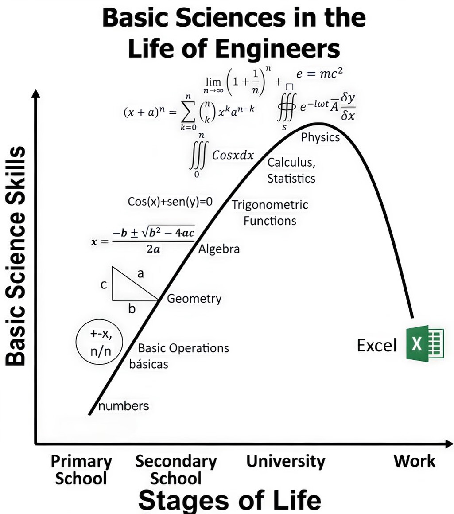
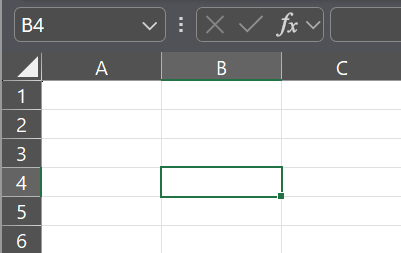
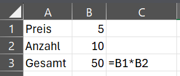

# Grundlagen

Damit wir Excel produktiv einsetzen können, brauchen wir zuerst ein solides Fundament: Welche Tasten gibt es, wie ist eine Arbeitsmappe aufgebaut, wie navigieren wir effizient und wie geben wir die ersten Formeln ein? Genau darum geht es in diesem Kapitel.

## Was ist Excel?

**Microsoft Excel** ist das wohl bekannteste **Tabellenkalkulationsprogramm** der Welt - und seit über 35 Jahren der De-facto-Standard, wenn es darum geht, Daten zu erfassen, zu strukturieren, zu berechnen und auszuwerten. Im Kern ist Excel ein riesiges Raster aus **Zellen**, in dem du Zahlen, Texte und Formeln ablegst und über Funktionen, Verknüpfungen und Diagramme miteinander in Beziehung setzen kannst.

Die Stärke von Excel liegt in seiner **Vielseitigkeit**: Vom kleinen Haushaltsbudget bis hin zu komplexen Finanzmodellen, Projektplänen oder Auswertungen mit zehntausenden Datensätzen lässt sich vieles realisieren - ohne dass du dafür programmieren können musst.

### Warum Excel so beliebt ist

- **Niedrige Einstiegshürde**: Erste sinnvolle Ergebnisse erzielst du schon nach wenigen Minuten - die Lernkurve skaliert mit deinem Anspruch.
- **Sofortiges visuelles Feedback**: Du siehst direkt, was passiert, und kannst Werte und Formeln interaktiv ausprobieren.
- **Riesiger Funktionsumfang**: Von einfachen Summen über Pivot-Tabellen bis hin zu Power Query, Power Pivot und Makros (VBA) ist alles in einem Tool vereint.
- **Universell verbreitet**: Praktisch jeder Computer-Arbeitsplatz hat Excel - der Austausch von Dateien funktioniert ohne zusätzliche Tools.
- **Brücke zu anderen Welten**: Excel-Dateien lassen sich problemlos mit Datenbanken, BI-Tools (Power BI, Tableau) oder Programmiersprachen wie Python und R austauschen - ein idealer Startpunkt für alles, was später in Richtung Datenanalyse geht.

!!! tip "Excel ist ein Werkzeug, kein Selbstzweck"
    Excel ist enorm mächtig - aber nicht für alles die richtige Wahl. Bei sehr großen Datenmengen, komplexen Datenbankabfragen oder reproduzierbaren Auswertungen sind oft **Datenbanken** oder **Programmiersprachen** besser geeignet. Wer die Grundlagen von Excel beherrscht, hat aber das beste Sprungbrett, um diese Werkzeuge später gezielt zu ergänzen.

<figure class="hotspot-image">
  
  <figcaption>Basic Sciences in the Life of Engineers - im Berufsalltag läuft dann doch vieles auf Excel hinaus (Quelle: <a href="https://www.instagram.com/p/DYZqQ76tdjj/" target="_blank" rel="noopener">Instagram</a>)</figcaption>
</figure>

## Die absoluten Basics
### Tastenbelegung

Um Excel - und auch andere Software - effizient bedienen zu können, lernen wir in den kommenden Kapiteln einige **Shortcuts** (deutsch: Tastenkombination) kennen. Zur Wiederholung findest du hier die wichtigsten Tasten einer klassischen QWERTZ-Tastatur:

!!! info "Hinweis für Mac-User"
    Die hier gezeigten Shortcuts beziehen sich auf eine **Windows-Tastatur**. Auf einem **Mac** und auf Mac-Tastaturen können sich einzelne Tastenkombinationen unterscheiden - typischerweise wird <kbd>STRG</kbd> durch <kbd>⌘ Cmd</kbd> ersetzt, und einige Funktionen liegen auf anderen Tasten.

    Eine ausführliche Übersicht für beide Systeme findest du auf [excelhero.de/excel-tastenkombinationen](https://excelhero.de/excel-tastenkombinationen/).

<figure class="hotspot-image">
  
  <span class="hotspot" tabindex="0" style="top: 13%; left: 2%;">1<span class="hotspot__tip"><strong class="hotspot__title">ESC</strong><span class="hotspot__desc">Menüfenster abbrechen</span></span></span>
  <span class="hotspot" tabindex="0" style="top: 26%; left: 2%;">2<span class="hotspot__tip"><strong class="hotspot__title">TAB</strong><span class="hotspot__desc">Tabulator</span></span></span>
  <span class="hotspot" tabindex="0" style="top: 33.5%; left: 2%;">3<span class="hotspot__tip"><strong class="hotspot__title">CAPS LOCK</strong><span class="hotspot__desc">Permanente Großschreibung ein/aus</span></span></span>
  <span class="hotspot" tabindex="0" style="top: 40%; left: 2%;">4<span class="hotspot__tip"><strong class="hotspot__title">SHIFT</strong><span class="hotspot__desc">Zweite Funktion oder Großschreibung</span></span></span>
  <span class="hotspot" tabindex="0" style="top: 40.5%; left: 66%;">4<span class="hotspot__tip"><strong class="hotspot__title">SHIFT</strong><span class="hotspot__desc">Zweite Funktion oder Großschreibung</span></span></span>
  <span class="hotspot" tabindex="0" style="top: 47.4%; left: 2%;">5<span class="hotspot__tip"><strong class="hotspot__title">STRG</strong><span class="hotspot__desc">Steuerungstaste, Basis vieler Shortcuts</span></span></span>
  <span class="hotspot" tabindex="0" style="top: 51.2%; left: 9%;">6<span class="hotspot__tip"><strong class="hotspot__title">FN</strong><span class="hotspot__desc">Funktions-Taste</span></span></span>
  <span class="hotspot" tabindex="0" style="top: 52.1%; left: 13%;">7<span class="hotspot__tip"><strong class="hotspot__title">START</strong><span class="hotspot__desc">Windows-Taste</span></span></span>
  <span class="hotspot" tabindex="0" style="top: 53%; left: 17.5%;">8<span class="hotspot__tip"><strong class="hotspot__title">ALT</strong><span class="hotspot__desc">Alternativ-Taste</span></span></span>
  <span class="hotspot" tabindex="0" style="top: 53.2%; left: 31.2%;">9<span class="hotspot__tip"><strong class="hotspot__title">Leertaste</strong><span class="hotspot__desc">Leertaste</span></span></span>
  <span class="hotspot" tabindex="0" style="top: 52.6%; left: 46.4%;">10<span class="hotspot__tip"><strong class="hotspot__title">ALT GR</strong><span class="hotspot__desc">Alternativ-Groß-Taste</span></span></span>
  <span class="hotspot" tabindex="0" style="top: 51.4%; left: 53.7%;">6<span class="hotspot__tip"><strong class="hotspot__title">FN</strong><span class="hotspot__desc">Funktions-Taste</span></span></span>
  <span class="hotspot" tabindex="0" style="top: 51.4%; left: 62.5%;">5<span class="hotspot__tip"><strong class="hotspot__title">STRG</strong><span class="hotspot__desc">Steuerungstaste, Basis vieler Shortcuts</span></span></span>
  <span class="hotspot" tabindex="0" style="top: 32.6%; left: 66%;">11<span class="hotspot__tip"><strong class="hotspot__title">ENTER</strong><span class="hotspot__desc">Fenster mit OK bestätigen oder Absatzzeichen in der Textverarbeitung</span></span></span>
  <span class="hotspot" tabindex="0" style="top: 19.5%; left: 66%;">12<span class="hotspot__tip"><strong class="hotspot__title">BACKSPACE</strong><span class="hotspot__desc">Löschen eines Zeichens links vom Cursor</span></span></span>
  <span class="hotspot" tabindex="0" style="top: 29.8%; left: 69%;">13<span class="hotspot__tip"><strong class="hotspot__title">ENTF</strong><span class="hotspot__desc">Löschen eines Zeichens rechts vom Cursor</span></span></span>
  <span class="hotspot" tabindex="0" style="top: 15.3%; left: 73.2%;">14<span class="hotspot__tip"><strong class="hotspot__title">POS1</strong><span class="hotspot__desc">Cursor an den Anfang der Zeile</span></span></span>
  <span class="hotspot" tabindex="0" style="top: 29.8%; left: 73.2%;">15<span class="hotspot__tip"><strong class="hotspot__title">ENDE</strong><span class="hotspot__desc">Cursor ans Ende der Zeile</span></span></span>
  <span class="hotspot" tabindex="0" style="top: 15.3%; left: 77.5%;">16<span class="hotspot__tip"><strong class="hotspot__title">BILD ↑</strong><span class="hotspot__desc">Einen Bildschirmausschnitt nach oben springen</span></span></span>
  <span class="hotspot" tabindex="0" style="top: 29.8%; left: 77.5%;">17<span class="hotspot__tip"><strong class="hotspot__title">BILD ↓</strong><span class="hotspot__desc">Einen Bildschirmausschnitt nach unten springen</span></span></span>
  <span class="hotspot" tabindex="0" style="top: 43.7%; left: 73.2%;">18<span class="hotspot__tip"><strong class="hotspot__title">Pfeiltasten</strong><span class="hotspot__desc">Cursor eine Spalte nach links/rechts bzw. eine Zeile nach oben/unten setzen</span></span></span>
  <figcaption>Klassisches Layout einer QWERTZ-Tastatur (Fahre über die Tasten, um die Funktionen zu sehen)</figcaption>
</figure>

??? note "Erklärung der einzelnen Tasten"
    1. <kbd>ESC</kbd>: Escape, Menüfenster abbrechen
    2. <kbd>TAB</kbd>: Tabulator
    3. <kbd>CAPS LOCK</kbd>: Permanente Großschreibung ein/aus
    4. <kbd>SHIFT</kbd> (oder UMSCHALT): Zweite Funktion oder Großschreibung
    5. <kbd>STRG</kbd> (oder CTRL): Steuerungs- oder Controltaste
    6. <kbd>FN</kbd>: Funktions-Taste. Um die zweite Belegung zu nutzen, muss erst die Funktionstaste gedrückt werden.
    7. <kbd>START</kbd> (Windows-Taste)
    8. <kbd>ALT</kbd>: Alternativ-Taste
    9. <kbd>Leertaste</kbd>
    10. <kbd>ALT GR</kbd>: Alternativ-Groß-Taste
    11. <kbd>ENTER</kbd> (oder RETURN, EINGABE, BESTÄTIGUNG): Fenster mit OK bestätigen oder Absatzzeichen in der Textverarbeitung
    12. <kbd>BACKSPACE</kbd>: Löschen eines Zeichens links vom Cursor
    13. <kbd>ENTF</kbd> (oder DEL): Löschen eines Zeichens rechts vom Cursor
    14. <kbd>POS1</kbd>: Cursor an den Anfang der Zeile
    15. <kbd>ENDE</kbd>: Cursor ans Ende der Zeile
    16. <kbd>BILD ↑</kbd>: Einen Bildschirmausschnitt nach oben springen
    17. <kbd>BILD ↓</kbd>: Einen Bildschirmausschnitt nach unten springen
    18. **Pfeiltasten**: Cursor eine Spalte nach links/rechts bzw. eine Zeile nach oben/unten setzen

### Datei öffnen, speichern und schließen

Bevor wir uns mit den Inhalten einer Arbeitsmappe beschäftigen, schauen wir uns die ganz grundlegenden Tätigkeiten an: **Wie öffne, speichere und schließe ich eine Excel-Datei?** Klar, das geht alles über das *Datei*-Menü mit der Maus - schneller bist du aber fast immer mit den passenden **Tastenkombinationen**. Es lohnt sich, die wichtigsten davon im Muskelgedächtnis zu haben, weil sie dir über alle weiteren Kapitel hinweg viel Zeit sparen.

Die folgende Tabelle fasst die wichtigsten Aktionen rund ums Öffnen, Speichern und Schließen samt Shortcut zusammen.

<div style="text-align:center; max-width:700px; margin:16px auto;">
<table role="table" aria-label="Aktion / Shortcut"
       style="width:100%; border-collapse:separate; border-spacing:0; border:1px solid #cfd8e3; border-radius:10px; overflow:hidden; font-family:system-ui,sans-serif;">
    <thead>
    <tr style="background:#009485; color:#fff;">
        <th style="text-align:left; padding:12px 14px; font-weight:700;">Aktion</th>
        <th style="text-align:left; padding:12px 14px; font-weight:700;">Shortcut</th>
    </tr>
    </thead>
    <tbody>
    <tr>
        <td style="background:#00948511; padding:10px 14px;">Excel öffnen</td>
        <td style="padding:10px 14px;">Klick auf die Verknüpfung im Startmenü oder Doppelklick auf die Verknüpfung am Desktop</td>
    </tr>
    <tr>
        <td style="background:#00948511; padding:10px 14px;">Arbeitsmappe öffnen</td>
        <td style="padding:10px 14px;">Doppelklick auf die Excel-Datei - oder bei geöffnetem Excel <kbd>STRG</kbd> + <kbd>O</kbd></td>
    </tr>
    <tr>
        <td style="background:#00948511; padding:10px 14px;">Mehrere Arbeitsmappen gleichzeitig öffnen</td>
        <td style="padding:10px 14px;">Mehrere Dateien anwählen und dann <kbd>ENTER</kbd></td>
    </tr>
    <tr>
        <td style="background:#00948511; padding:10px 14px;">Startbildschirm ausblenden</td>
        <td style="padding:10px 14px;"><em>Datei</em> → <em>Optionen</em> → <em>Allgemein</em> → <em>Startbildschirm beim Start dieser Anwendung anzeigen</em> → Häkchen entfernen</td>
    </tr>
    <tr>
        <td style="background:#00948511; padding:10px 14px;">Arbeitsmappe schließen, Programm offen halten</td>
        <td style="padding:10px 14px;"><kbd>STRG</kbd> + <kbd>F4</kbd></td>
    </tr>
    <tr>
        <td style="background:#00948511; padding:10px 14px;">Arbeitsmappe und Programm schließen</td>
        <td style="padding:10px 14px;"><kbd>ALT</kbd> + <kbd>F4</kbd></td>
    </tr>
    <tr>
        <td style="background:#00948511; padding:10px 14px;">Arbeitsmappe speichern</td>
        <td style="padding:10px 14px;"><kbd>STRG</kbd> + <kbd>S</kbd></td>
    </tr>
    <tr>
        <td style="background:#00948511; padding:10px 14px;">Speichern unter</td>
        <td style="padding:10px 14px;"><kbd>F12</kbd></td>
    </tr>
    <tr>
        <td style="background:#00948511; padding:10px 14px;">Neue Arbeitsmappe erstellen</td>
        <td style="padding:10px 14px;"><kbd>STRG</kbd> + <kbd>N</kbd></td>
    </tr>
    </tbody>
</table>
</div>

<figure class="hotspot-image">
  
  <figcaption>(Quelle: <a href="https://www.pinterest.com/pin/shortcut--180918110000300069" target="_blank" rel="noopener">Pinterest</a>)</figcaption>
</figure>

### Hierarchischer Aufbau von Excel

<figure class="hotspot-image">
  <div class="excel-pyramid" style="max-width: 500px;" role="img" aria-label="Hierarchie in Excel: Zellen, Zeilen & Spalten, Arbeitsblatt, Arbeitsmappe, Excel-Applikation">
    <div class="excel-pyramid__level">Zellen</div>
    <div class="excel-pyramid__level">Zeilen &amp; Spalten</div>
    <div class="excel-pyramid__level">Arbeitsblatt</div>
    <div class="excel-pyramid__level">Arbeitsmappe</div>
    <div class="excel-pyramid__level">Excel-Applikation</div>
  </div>
  <figcaption>Hierarchie in Excel - von der kleinsten Einheit (oben) zur umschließenden Anwendung (unten)</figcaption>
</figure>

Die **Excel-Applikation** ist die eigentliche Software - sie läuft auch ohne geöffnete Datei. In ihr lassen sich mehrere **Arbeitsmappen** gleichzeitig öffnen; jede Arbeitsmappe entspricht einer Excel-Datei und kann ihrerseits ein oder mehrere **Arbeitsblätter** enthalten. Innerhalb eines Arbeitsblattes ist alles in **Zeilen und Spalten** organisiert. Deren Schnittpunkte bilden schließlich die **Zellen** - die kleinste Einheit, in der die eigentliche Information (Text, Zahlen, Wahrheitswerte) abgelegt wird.

!!! facts "Fun Fact"
    Ein einzelnes modernes Excel-Arbeitsblatt umfasst **1.048.576 Zeilen** (entspricht $2^{20}$) und **16.384 Spalten** (von A bis XFD, entspricht $2^{14}$). Das macht über **17 Milliarden Zellen** auf einem einzigen Blatt - würdest du jede Sekunde eine Zelle befüllen, wärst du mehr als 500 Jahre beschäftigt.

### Benutzeroberfläche

<figure class="hotspot-image">
  <div style="position: relative; line-height: 0;">
    
    <span class="hotspot" tabindex="0" style="top: 9.3%; left: 0.8%;">1<span class="hotspot__tip"><strong class="hotspot__title">Excel-Applikation</strong><span class="hotspot__desc">Application</span></span></span>
    <span class="hotspot" tabindex="0" style="top: 3%; left: 34.3%;">2<span class="hotspot__tip"><strong class="hotspot__title">Arbeitsmappe</strong><span class="hotspot__desc">Workbook</span></span></span>
    <span class="hotspot" tabindex="0" style="top: 87.8%; left: 9.7%;">3<span class="hotspot__tip"><strong class="hotspot__title">Arbeitsblatt</strong><span class="hotspot__desc">Worksheet</span></span></span>
    <span class="hotspot" tabindex="0" style="top: 69.4%; left: 0.8%;">4<span class="hotspot__tip"><strong class="hotspot__title">Zeilen</strong><span class="hotspot__desc">Rows</span></span></span>
    <span class="hotspot" tabindex="0" style="top: 53.6%; left: 10.7%;">5<span class="hotspot__tip"><strong class="hotspot__title">Spalten</strong><span class="hotspot__desc">Columns</span></span></span>
    <span class="hotspot" tabindex="0" style="top: 65.5%; left: 24.3%;">6<span class="hotspot__tip"><strong class="hotspot__title">Zellen</strong><span class="hotspot__desc">Cells</span></span></span>
    <span class="hotspot" tabindex="0" style="top: 2.5%; left: 28.5%;">7<span class="hotspot__tip"><strong class="hotspot__title">Schnellzugriff</strong><span class="hotspot__desc">Quick Access Toolbar</span></span></span>
    <span class="hotspot" tabindex="0" style="top: 11.2%; left: 50.3%;">8<span class="hotspot__tip"><strong class="hotspot__title">Menüband</strong><span class="hotspot__desc">Ribbon</span></span></span>
    <span class="hotspot" tabindex="0" style="top: 17.6%; left: 98.5%;">9<span class="hotspot__tip"><strong class="hotspot__title">Registerkarten</strong><span class="hotspot__desc">Tabs</span></span></span>
    <span class="hotspot" tabindex="0" style="top: 47.5%; left: 98.5%;">10<span class="hotspot__tip"><strong class="hotspot__title">Bearbeitungsleiste</strong><span class="hotspot__desc">Formula Bar</span></span></span>
    <span class="hotspot" tabindex="0" style="top: 93.2%; left: 80.8%;">11<span class="hotspot__tip"><strong class="hotspot__title">Statusleiste</strong><span class="hotspot__desc">Status Bar</span></span></span>
  </div>
  <figcaption>Excel-Benutzeroberfläche (Fahre über die Markierungen, um die Bezeichnungen zu sehen)</figcaption>
</figure>

??? note "Erklärung der einzelnen Bereiche"
    1. **Excel-Applikation** (Application)
    2. **Arbeitsmappe** (Workbook)
    3. **Arbeitsblatt** (Worksheet)
    4. **Zeilen** (Rows)
    5. **Spalten** (Columns)
    6. **Zellen** (Cells)
    7. **Schnellzugriff** (Quick Access Toolbar)
    8. **Menüband** (Ribbon)
    9. **Registerkarten** (Tabs)
    10. **Bearbeitungsleiste** (Formula Bar)
    11. **Statusleiste** (Status Bar)

Speziell der **Schnellzugriff** (Nummer 7) kann einiges an Zeit sparen. Zum Anpassen gibt es folgende Möglichkeiten:

- **Ein-/Ausblenden**: Standardmäßig kann es sein, dass der Schnellzugriff ausgeblendet ist und nur das Speichern-Symbol angezeigt wird. Geändert wird das durch Rechtsklick auf das Symbol → *Symbolleiste für den Schnellzugriff anzeigen*.
- **Anpassen**:
    - *Datei* → *Optionen* → *Symbolleiste für den Schnellzugriff*
    - Am rechten Ende des Schnellzugriffs gibt es ein Dropdown-Menü zum Hinzufügen/Entfernen von Funktionen
    - Rechtsklick auf eine Funktion in den Registerkarten → *Zu Symbolleiste für den Schnellzugriff hinzufügen*
    - Rechtsklick auf ein Symbol → *Aus Symbolleiste für den Schnellzugriff entfernen*

Auch die **Statusleiste** (Nummer 11) kann sehr hilfreich sein. Wenn du beispielsweise mehrere Zellen markierst, werden gewisse Operationen - z. B. Anzahl, Mittelwert, Summe - automatisch berechnet. Die Statusleiste lässt sich per Rechtsklick anpassen.

## Daten eingeben und markieren

Die zentrale Bühne in Excel sind die **Zellen**: Hier landen alle Werte - Zahlen, Texte, Wahrheitswerte - und genau hier passiert auch die Weiterverarbeitung. Eine Zelle kann auf andere Zellen zugreifen, deren Inhalte aufgreifen, kombinieren, in Berechnungen einfließen lassen und das Ergebnis wiederum bereitstellen. Aus diesem Zusammenspiel entsteht aus einer leeren Tabelle nach und nach ein lebendiges Modell.

Damit dieses Zusammenspiel funktioniert, hat jede Zelle eine **eindeutige Adresse** - quasi ihre Koordinaten im Tabellenblatt. Diese Adresse setzt sich aus **Spalte** (Buchstabe) und **Zeile** (Nummer) zusammen, z. B. `B4` für die Zelle in Spalte B, Zeile 4.

<figure markdown style="text-align: center;">
  
</figure>

Welche Zelle gerade aktiv ist, erkennst du am **grünen Rahmen**. Ihre Adresse wird dir parallel links oben im **Namensfeld** angezeigt - im vorigen Beispiel ist das die Zelle `B4`.

Die folgende Tabelle fasst die wichtigsten Aktionen rund ums **Eingeben und Markieren** von Zellinhalten zusammen - vom einfachen Überschreiben bis hin zur Auswahl mehrerer Bereiche gleichzeitig.

<div style="text-align:center; max-width:700px; margin:16px auto;">
<table role="table" aria-label="Aktion / Shortcut"
       style="width:100%; border-collapse:separate; border-spacing:0; border:1px solid #cfd8e3; border-radius:10px; overflow:hidden; font-family:system-ui,sans-serif;">
    <thead>
    <tr style="background:#009485; color:#fff;">
        <th style="text-align:left; padding:12px 14px; font-weight:700;">Aktion</th>
        <th style="text-align:left; padding:12px 14px; font-weight:700;">Shortcut</th>
    </tr>
    </thead>
    <tbody>
    <tr>
        <td style="background:#00948511; padding:10px 14px;">Zellinhalt überschreiben</td>
        <td style="padding:10px 14px;">Zelle auswählen und tippen - Inhalt der Zelle wird überschrieben</td>
    </tr>
    <tr>
        <td style="background:#00948511; padding:10px 14px;">Zellinhalt ergänzen</td>
        <td style="padding:10px 14px;">Zelle auswählen und in die Bearbeitungsleiste klicken, oder <kbd>F2</kbd>, oder Doppelklick auf die Zelle</td>
    </tr>
    <tr>
        <td style="background:#00948511; padding:10px 14px;">Angrenzenden Zellbereich selektieren</td>
        <td style="padding:10px 14px;">Mit gedrückter Maustaste auswählen - oder Zelle auswählen → <kbd>SHIFT</kbd> halten → weitere Zellen anklicken</td>
    </tr>
    <tr>
        <td style="background:#00948511; padding:10px 14px;">Nicht angrenzende Zellen selektieren</td>
        <td style="padding:10px 14px;">Zelle auswählen → <kbd>STRG</kbd> halten → weitere Zellen anklicken</td>
    </tr>
    <tr>
        <td style="background:#00948511; padding:10px 14px;">Eingabe bestätigen</td>
        <td style="padding:10px 14px;"><kbd>ENTER</kbd> drücken oder andere Zelle anklicken</td>
    </tr>
    <tr>
        <td style="background:#00948511; padding:10px 14px;">Gleichen Inhalt in mehrere Zellen schreiben</td>
        <td style="padding:10px 14px;">Mehrere Zellen auswählen → <kbd>F2</kbd> → Wert eingeben → mit <kbd>STRG</kbd> + <kbd>ENTER</kbd> bestätigen</td>
    </tr>
    <tr>
        <td style="background:#00948511; padding:10px 14px;">Mehrere Arbeitsblätter selektieren</td>
        <td style="padding:10px 14px;">Ein Arbeitsblatt anklicken und mit gedrücktem <kbd>SHIFT</kbd> oder <kbd>STRG</kbd> weitere anklicken</td>
    </tr>
    <tr>
        <td style="background:#00948511; padding:10px 14px;">Alle Zellen auswählen</td>
        <td style="padding:10px 14px;">Auf das Dreieck links oben klicken</td>
    </tr>
    <tr>
        <td style="background:#00948511; padding:10px 14px;">Aktuellen Zellblock auswählen</td>
        <td style="padding:10px 14px;"><kbd>STRG</kbd> + <kbd>A</kbd></td>
    </tr>
    </tbody>
</table>
</div>

## Zeilen und Spalten

Während einzelne Zellen die Inhalte tragen, geben **Zeilen und Spalten** dem Arbeitsblatt seine Struktur: Eine Zeile fasst z. B. einen zusammengehörigen Datensatz zusammen, eine Spalte sammelt gleichartige Werte wie Namen, Datumsangaben oder Beträge. In der Praxis arbeitest du deshalb selten nur mit einer Zelle, sondern fügst ganze Zeilen ein, blendest Spalten aus oder ordnest Bereiche neu an. Die folgende Tabelle zeigt dir die wichtigsten Handgriffe - vom Selektieren über das Einfügen und Löschen bis zum Ein- und Ausblenden:

<div style="text-align:center; max-width:700px; margin:16px auto;">
<table role="table" aria-label="Aktion / Shortcut"
       style="width:100%; border-collapse:separate; border-spacing:0; border:1px solid #cfd8e3; border-radius:10px; overflow:hidden; font-family:system-ui,sans-serif;">
    <thead>
    <tr style="background:#009485; color:#fff;">
        <th style="text-align:left; padding:12px 14px; font-weight:700;">Aktion</th>
        <th style="text-align:left; padding:12px 14px; font-weight:700;">Shortcut</th>
    </tr>
    </thead>
    <tbody>
    <tr>
        <td style="background:#00948511; padding:10px 14px;">Zeile selektieren</td>
        <td style="padding:10px 14px;">Auf den Zeilenkopf klicken oder <kbd>SHIFT</kbd> + <kbd>Leertaste</kbd></td>
    </tr>
    <tr>
        <td style="background:#00948511; padding:10px 14px;">Spalte selektieren</td>
        <td style="padding:10px 14px;">Auf den Spaltenkopf klicken oder <kbd>STRG</kbd> + <kbd>Leertaste</kbd></td>
    </tr>
    <tr>
        <td style="background:#00948511; padding:10px 14px;">Mehrere Spalten oder Zeilen selektieren</td>
        <td style="padding:10px 14px;">Mit gedrücktem <kbd>SHIFT</kbd> oder <kbd>STRG</kbd> auf Spalten- bzw. Zeilenköpfe klicken</td>
    </tr>
    <tr>
        <td style="background:#00948511; padding:10px 14px;">Zeilen/Spalten einfügen</td>
        <td style="padding:10px 14px;"><kbd>STRG</kbd> + <kbd>+</kbd></td>
    </tr>
    <tr>
        <td style="background:#00948511; padding:10px 14px;">Zeilen/Spalten löschen</td>
        <td style="padding:10px 14px;"><kbd>STRG</kbd> + <kbd>-</kbd></td>
    </tr>
    <tr>
        <td style="background:#00948511; padding:10px 14px;">Spalten ausblenden</td>
        <td style="padding:10px 14px;"><kbd>STRG</kbd> + <kbd>8</kbd></td>
    </tr>
    <tr>
        <td style="background:#00948511; padding:10px 14px;">Spalten einblenden</td>
        <td style="padding:10px 14px;"><kbd>STRG</kbd> + <kbd>SHIFT</kbd> + <kbd>8</kbd></td>
    </tr>
    <tr>
        <td style="background:#00948511; padding:10px 14px;">Zeilen ausblenden</td>
        <td style="padding:10px 14px;"><kbd>STRG</kbd> + <kbd>9</kbd></td>
    </tr>
    <tr>
        <td style="background:#00948511; padding:10px 14px;">Zeilen einblenden</td>
        <td style="padding:10px 14px;"><kbd>STRG</kbd> + <kbd>SHIFT</kbd> + <kbd>9</kbd></td>
    </tr>
    </tbody>
</table>
</div>

Die **Zeilen- und Spaltengröße** kann beliebig angepasst werden. Dabei gibt es mehrere Möglichkeiten:

- **Manuell**: An den Spalten- und Zeilenbeschriftungen kann am Rand mit klicken → halten → ziehen die Größe geändert werden.
- **Automatisch**: Durch Doppelklick auf den Rand wird die Größe automatisch angepasst. Es können auch gleichzeitig mehrere Spalten und Zeilen automatisch angepasst werden.
- **Exakter Wert**: Sollen die Größen genau festgelegt werden, müssen die Zeilen/Spalten markiert werden und anschließend mit der rechten Maustaste auf die Beschriftung geklickt werden. Anschließend kann *Spaltenbreite* bzw. *Zeilenhöhe* ausgewählt und ein Wert eingetragen werden.

!!! facts "Fun Fact"
    Excel misst Zeilen und Spalten in **unterschiedlichen Einheiten**: Die **Zeilenhöhe** wird in *Punkt* angegeben (1 Punkt = 1/72 Zoll ≈ 0,35 mm) - eine Einheit aus der Typografie. Die **Spaltenbreite** dagegen wird in *Zeichen* gemessen: Der Standardwert 8,43 bedeutet, dass etwa 8,43 Ziffern der Standardschriftart in die Zelle passen. Änderst du also die Standardschrift, ändert sich auch die tatsächliche Breite aller Spalten. 
    
    Ein kleiner Tip dazu: Wer Zeilen und Spalten exakt gleich groß machen will (z. B. quadratisch), stellt am besten auf die Ansicht [*Seitenlayout*](../finalisieren/?h=ansicht#ansichten) um - dort lassen sich beide in Zentimetern angeben.

## Navigation in und zwischen Arbeitsblättern

Bei 17 Milliarden Zellen pro Arbeitsblatt wird schnell klar: Nur mit Scrollen und Klicken kommst du nicht weit. Wer größere Tabellen bearbeitet, springt gezielt - an den Rand eines Datenbereichs, an den Anfang des Blattes oder direkt in die nächste Arbeitsmappe. Genau dafür gibt es eine Handvoll **Navigations-Shortcuts**, die dir auf Dauer enorm viel Zeit sparen:

<div style="text-align:center; max-width:700px; margin:16px auto;">
<table role="table" aria-label="Aktion / Shortcut"
       style="width:100%; border-collapse:separate; border-spacing:0; border:1px solid #cfd8e3; border-radius:10px; overflow:hidden; font-family:system-ui,sans-serif;">
    <thead>
    <tr style="background:#009485; color:#fff;">
        <th style="text-align:left; padding:12px 14px; font-weight:700;">Aktion</th>
        <th style="text-align:left; padding:12px 14px; font-weight:700;">Shortcut</th>
    </tr>
    </thead>
    <tbody>
    <tr>
        <td style="background:#00948511; padding:10px 14px;">In bestimmte Zelle springen</td>
        <td style="padding:10px 14px;">Zelladresse links oben in die Dropdownbox eingeben</td>
    </tr>
    <tr>
        <td style="background:#00948511; padding:10px 14px;">Zur nächsten angrenzenden Zelle springen</td>
        <td style="padding:10px 14px;">Pfeiltaste</td>
    </tr>
    <tr>
        <td style="background:#00948511; padding:10px 14px;">Innerhalb eines Zellbereichs bzw. zwischen Zellbereichen springen</td>
        <td style="padding:10px 14px;"><kbd>STRG</kbd> + Pfeiltaste</td>
    </tr>
    <tr>
        <td style="background:#00948511; padding:10px 14px;">Einen Bildschirmausschnitt nach oben/unten springen</td>
        <td style="padding:10px 14px;"><kbd>BILD ↑</kbd> / <kbd>BILD ↓</kbd></td>
    </tr>
    <tr>
        <td style="background:#00948511; padding:10px 14px;">An den Anfang des Arbeitsblattes</td>
        <td style="padding:10px 14px;"><kbd>STRG</kbd> + <kbd>POS1</kbd></td>
    </tr>
    <tr>
        <td style="background:#00948511; padding:10px 14px;">Ans Ende des Arbeitsblattes</td>
        <td style="padding:10px 14px;"><kbd>STRG</kbd> + <kbd>ENDE</kbd></td>
    </tr>
    <tr>
        <td style="background:#00948511; padding:10px 14px;">Navigation zwischen Arbeitsblättern</td>
        <td style="padding:10px 14px;"><kbd>STRG</kbd> + <kbd>BILD ↑</kbd> / <kbd>STRG</kbd> + <kbd>BILD ↓</kbd></td>
    </tr>
    <tr>
        <td style="background:#00948511; padding:10px 14px;">Navigation zwischen Arbeitsmappen</td>
        <td style="padding:10px 14px;"><kbd>ALT</kbd> + <kbd>TAB</kbd></td>
    </tr>
    </tbody>
</table>
</div>

## Excel Operatoren
### Rechenoperatoren

Im einfachsten Fall ist Excel ein sehr komfortabler **Taschenrechner**: Du leitest die Eingabe mit einem Gleichheitszeichen ein, tippst die Rechnung wie gewohnt und bestätigst mit <kbd>ENTER</kbd>. Der entscheidende Unterschied zum Taschenrechner ist aber, dass du statt fixer Zahlen auch [**Zellbezüge**](#zellbezuge) verwenden kannst - dann rechnet sich das Ergebnis bei jeder Änderung der Ausgangswerte automatisch neu.

Die folgenden Operatoren stehen dir dafür zur Verfügung:

<div style="text-align:center; max-width:900px; margin:16px auto;">
<table role="table" aria-label="Aktion / Operator / Beispiel"
       style="width:100%; border-collapse:separate; border-spacing:0; border:1px solid #cfd8e3; border-radius:10px; overflow:hidden; font-family:system-ui,sans-serif;">
    <thead>
    <tr style="background:#009485; color:#fff;">
        <th style="text-align:left; padding:12px 14px; font-weight:700;">Aktion</th>
        <th style="text-align:left; padding:12px 14px; font-weight:700;">Operator</th>
        <th style="text-align:left; padding:12px 14px; font-weight:700;">Beispiel</th>
        <th style="text-align:left; padding:12px 14px; font-weight:700;">Ergebnis</th>
    </tr>
    </thead>
    <tbody>
    <tr>
        <td style="background:#00948511; padding:10px 14px;">Gleichheitszeichen (Formel einleiten)</td>
        <td style="padding:10px 14px;"><code>=</code></td>
        <td style="padding:10px 14px;"><code>=5</code></td>
        <td style="padding:10px 14px;">5</td>
    </tr>
    <tr>
        <td style="background:#00948511; padding:10px 14px;">Addition</td>
        <td style="padding:10px 14px;"><code>+</code></td>
        <td style="padding:10px 14px;"><code>=2+6</code></td>
        <td style="padding:10px 14px;">8</td>
    </tr>
    <tr>
        <td style="background:#00948511; padding:10px 14px;">Subtraktion</td>
        <td style="padding:10px 14px;"><code>-</code></td>
        <td style="padding:10px 14px;"><code>=9-4</code></td>
        <td style="padding:10px 14px;">5</td>
    </tr>
    <tr>
        <td style="background:#00948511; padding:10px 14px;">Multiplikation</td>
        <td style="padding:10px 14px;"><code>&#42;</code></td>
        <td style="padding:10px 14px;"><code>=5&#42;7</code></td>
        <td style="padding:10px 14px;">35</td>
    </tr>
    <tr>
        <td style="background:#00948511; padding:10px 14px;">Division</td>
        <td style="padding:10px 14px;"><code>/</code></td>
        <td style="padding:10px 14px;"><code>=18/5</code></td>
        <td style="padding:10px 14px;">3,6</td>
    </tr>
    <tr>
        <td style="background:#00948511; padding:10px 14px;">Exponent</td>
        <td style="padding:10px 14px;"><code>^</code></td>
        <td style="padding:10px 14px;"><code>=3^3</code></td>
        <td style="padding:10px 14px;">27</td>
    </tr>
    <tr>
        <td style="background:#00948511; padding:10px 14px;">Wurzel</td>
        <td style="padding:10px 14px;"><code>^(1/2)</code> oder <code>^(0,5)</code></td>
        <td style="padding:10px 14px;"><code>=25^(1/2)</code></td>
        <td style="padding:10px 14px;">5</td>
    </tr>
    <tr>
        <td style="background:#00948511; padding:10px 14px;">Prozent</td>
        <td style="padding:10px 14px;"><code>%</code></td>
        <td style="padding:10px 14px;"><code>=200&#42;15%</code></td>
        <td style="padding:10px 14px;">30</td>
    </tr>
    <tr>
        <td style="background:#00948511; padding:10px 14px;">Klammern</td>
        <td style="padding:10px 14px;"><code>( )</code></td>
        <td style="padding:10px 14px;"><code>=(2+4)&#42;(3+5)</code></td>
        <td style="padding:10px 14px;">48</td>
    </tr>
    </tbody>
</table>
</div>

!!! info "Warum ist `^(0,5)` die Wurzel?"
    Excel kennt keinen eigenen Operator für die Wurzel - dafür beherrscht es aber Potenzen mit **beliebigen** Exponenten, also auch mit Brüchen. Und genau darüber lässt sich jede Wurzel ausdrücken:

    $$
    \sqrt[n]{x} = x^{\frac{1}{n}}
    $$

    Der Grund dafür steckt im Potenzgesetz $(x^a)^b = x^{a \cdot b}$. Setzt man $a=\tfrac{1}{2}$ und $b=2$ ein, erhält man:

    $$
    \left(x^{\frac{1}{2}}\right)^{2} = x^{\frac{1}{2} \cdot 2} = x^{1} = x
    $$

    Eine Zahl, die quadriert wieder $x$ ergibt - das ist per Definition die Quadratwurzel. Weil $\tfrac{1}{2} = 0{,}5$ ist, sind `^(1/2)` und `^(0,5)` also nur zwei Schreibweisen für dasselbe.

    Der Vorteil dieser Schreibweise: Sie funktioniert für **jede** Wurzel. Für die Kubikwurzel (dritte Wurzel) schreibst du `^(1/3)`, für die vierte Wurzel `^(1/4)` und so weiter.

    **Die Klammern sind dabei nicht optional!** `^` bindet stärker als `/`. Ohne Klammern rechnet Excel bei `=25^1/2` zuerst $25^1 = 25$ und teilt anschließend durch 2 - das Ergebnis wäre 12,5 statt 5.

    Alternativ gibt es für die Quadratwurzel auch eine eigene **Funktion**:

    ```
    =WURZEL(Zahl)
    ```

    `=WURZEL(25)` liefert also ebenfalls 5. Sie ist gut lesbar, kann aber wirklich nur die *Quadrat*wurzel - für alle anderen Wurzeln brauchst du die Potenzschreibweise. Beide Varianten liefern bei negativen Zahlen den Fehler `#ZAHL!`.

Wie in der Mathematik gilt auch in Excel **Punkt- vor Strichrechnung**, und Potenzen werden noch davor ausgewertet. Die Reihenfolge lautet: Klammern → Potenz → Multiplikation/Division → Addition/Subtraktion. Im Zweifel setzt du lieber eine Klammer zu viel als eine zu wenig - das kostet nichts und macht die Formel für alle lesbar, die sie später öffnen.

!!! facts "Fun Fact"
    Bei einer Kleinigkeit weicht Excel von der mathematischen Konvention ab: Das **Minuszeichen vor einer Zahl** bindet stärker als der Potenz-Operator. `=-2^2` liefert in Excel deshalb **4** und nicht -4, weil zuerst $-2$ gebildet und dann quadriert wird. Schreibst du dagegen `=0-2^2`, erhältst du korrekt **-4**.

    In Programmiersprachen wie Python ist es genau umgekehrt (`-2**2` ergibt dort -4). Wer Formeln zwischen beiden Welten überträgt, sollte an dieser Stelle also genau hinsehen - oder einfach klammern: `=-(2^2)`.

### Vergleichsoperatoren

Während Rechenoperatoren eine **Zahl** liefern, beantworten Vergleichsoperatoren eine **Ja-oder-Nein-Frage**: Ist der Umsatz höher als der Plan? Ist das Lager leer? Ergebnis ist deshalb nie eine Zahl, sondern immer einer der beiden **Wahrheitswerte** `WAHR` oder `FALSCH`.

Eingegeben wird ein Vergleich genau wie eine Rechnung - mit einem Gleichheitszeichen vorne: `=B4>100` prüft, ob der Wert in `B4` größer als 100 ist.

<div style="text-align:center; max-width:900px; margin:16px auto;">
<table role="table" aria-label="Aktion / Operator / Beispiel"
       style="width:100%; border-collapse:separate; border-spacing:0; border:1px solid #cfd8e3; border-radius:10px; overflow:hidden; font-family:system-ui,sans-serif;">
    <thead>
    <tr style="background:#009485; color:#fff;">
        <th style="text-align:left; padding:12px 14px; font-weight:700;">Aktion</th>
        <th style="text-align:left; padding:12px 14px; font-weight:700;">Operator</th>
        <th style="text-align:left; padding:12px 14px; font-weight:700;">Beispiel</th>
        <th style="text-align:left; padding:12px 14px; font-weight:700;">Ergebnis</th>
    </tr>
    </thead>
    <tbody>
    <tr>
        <td style="background:#00948511; padding:10px 14px;">Gleichheit</td>
        <td style="padding:10px 14px;"><code>=</code></td>
        <td style="padding:10px 14px;"><code>=5=5</code></td>
        <td style="padding:10px 14px;">WAHR</td>
    </tr>
    <tr>
        <td style="background:#00948511; padding:10px 14px;">Ungleich</td>
        <td style="padding:10px 14px;"><code>&lt;&gt;</code></td>
        <td style="padding:10px 14px;"><code>=5&lt;&gt;5</code></td>
        <td style="padding:10px 14px;">FALSCH</td>
    </tr>
    <tr>
        <td style="background:#00948511; padding:10px 14px;">Kleiner</td>
        <td style="padding:10px 14px;"><code>&lt;</code></td>
        <td style="padding:10px 14px;"><code>=3&lt;10</code></td>
        <td style="padding:10px 14px;">WAHR</td>
    </tr>
    <tr>
        <td style="background:#00948511; padding:10px 14px;">Kleiner gleich</td>
        <td style="padding:10px 14px;"><code>&lt;=</code></td>
        <td style="padding:10px 14px;"><code>=10&lt;=10</code></td>
        <td style="padding:10px 14px;">WAHR</td>
    </tr>
    <tr>
        <td style="background:#00948511; padding:10px 14px;">Größer</td>
        <td style="padding:10px 14px;"><code>&gt;</code></td>
        <td style="padding:10px 14px;"><code>=3&gt;10</code></td>
        <td style="padding:10px 14px;">FALSCH</td>
    </tr>
    <tr>
        <td style="background:#00948511; padding:10px 14px;">Größer gleich</td>
        <td style="padding:10px 14px;"><code>&gt;=</code></td>
        <td style="padding:10px 14px;"><code>=3&gt;=10</code></td>
        <td style="padding:10px 14px;">FALSCH</td>
    </tr>
    </tbody>
</table>
</div>

Verwirrend ist anfangs, dass das Gleichheitszeichen **zwei Aufgaben** hat: Es leitet jede Formel ein *und* ist gleichzeitig der Operator für den Vergleich auf Gleichheit. Deshalb steht in einer Formel wie `=A1=B1` zweimal ein `=` - das erste startet die Formel, das zweite vergleicht.

Für sich allein sind Vergleiche wenig spannend. Ihre eigentliche Stärke entfalten sie als **Bedingung** in anderen Werkzeugen: in der [`WENN`-Funktion](funktionen.md#wenn), die abhängig vom Ergebnis unterschiedliche Werte ausgibt, und in der [bedingten Formatierung](visualisierung.md#bedingte-formatierung), die Zellen automatisch einfärbt. Beides sehen wir uns in späteren Kapiteln genauer an.

!!! warning "Zwei Eigenheiten beim Vergleichen"
    **Groß- und Kleinschreibung wird ignoriert.** Für Excel sind `="Meier"="MEIER"` und `="meier"="Meier"` beide `WAHR`. Soll wirklich zeichengenau verglichen werden, brauchst du die Funktion `IDENTISCH`: `=IDENTISCH("Meier";"MEIER")` liefert `FALSCH`.

    **Wahrheitswerte sind rechenbar.** Sobald du mit ihnen rechnest, gilt `WAHR` = 1 und `FALSCH` = 0. `=WAHR+WAHR` ergibt also 2. Das klingt nach Spielerei, ist aber ein beliebter Trick, um Treffer zu zählen, ohne eine eigene Zählfunktion zu bemühen.

## Zellbezüge

Ein **Zellbezug** ist nichts anderes als die Adresse einer Zelle, verwendet innerhalb einer Formel: Statt `=5*50` schreibst du `=B1*B2` und rechnest damit nicht mehr mit festen Zahlen, sondern mit dem *Inhalt* der Zellen. Ändert sich dort ein Wert, aktualisiert sich das Ergebnis von selbst - genau unterscheidet Excel von einem Taschenrechner.

<figure class="hotspot-image">
  
  <figcaption>In <code>B3</code> steht nicht die Zahl 50, sondern die Formel <code>=B1*B2</code> - hier zur Veranschaulichung daneben mitgeschrieben. Änderst du den Preis in <code>B1</code>, rechnet sich das Ergebnis sofort neu.</figcaption>
</figure>

### Absolut vs Relativ

Solange du eine Formel nur ein einziges Mal schreibst, ist es egal, wie du den Zellbezug herstellst. Interessant wird es in dem Moment, in dem du sie **kopierst** bzw. öfters verwenden möchtest - denn dann entscheidet die Art des Zellbezugs darüber, ob das Ergebnis richtig oder falsch ist.

Der Grund dafür: Excel merkt sich intern nicht „die Zelle `C2`", sondern den **Weg dorthin** - also etwa „eine Zelle links von mir, gleiche Zeile". Kopierst du die Formel eine Zeile tiefer, geht Excel denselben Weg von der neuen Position aus. Das nennt man einen **relativen Bezug**. Genau dieses Verhalten willst du in den allermeisten Fällen. 

!!! example "Beispiel: Relativer Bezug"
    In der folgenden Bestellliste schreibst du die Formel nur in `D2` und kopierst sie nach unten - Excel passt die Zeilennummern automatisch an:

    <div class="xl-sheet" style="text-align:center; max-width:900px; margin:16px auto;">
    <table role="table" aria-label="A / B"
          style="width:auto; border-collapse:separate; border-spacing:0; border:1px solid #cfd8e3; border-radius:10px; overflow:hidden; font-family:system-ui,sans-serif;">
        <colgroup>
            <col style="width:2.4em;">
            <col>
            <col>
            <col>
            <col>
        </colgroup>
        <thead>
        <tr style="background:#009485; color:#fff;">
            <th style="text-align:center; padding:12px 6px; font-weight:700;"></th>
            <th style="text-align:left; padding:12px 14px; font-weight:700;">A</th>
            <th style="text-align:left; padding:12px 14px; font-weight:700;">B</th>
            <th style="text-align:left; padding:12px 14px; font-weight:700;">C</th>
            <th style="text-align:left; padding:12px 14px; font-weight:700;">D</th>
        </tr>
        </thead>
        <tbody>
        <tr>
            <td style="background:#00948511; padding:10px 6px; text-align:center;"><strong>1</strong></td>
            <td style="padding:10px 14px;">Artikel</td>
            <td style="padding:10px 14px;">Menge</td>
            <td style="padding:10px 14px;">Preis</td>
            <td style="padding:10px 14px;">Summe</td>
        </tr>
        <tr>
            <td style="background:#00948511; padding:10px 6px; text-align:center;"><strong>2</strong></td>
            <td style="padding:10px 14px;">Fahrradhelm</td>
            <td style="padding:10px 14px;">8</td>
            <td style="padding:10px 14px;">89,90</td>
            <td style="padding:10px 14px;"><code>=B2&#42;C2</code></td>
        </tr>
        <tr>
            <td style="background:#00948511; padding:10px 6px; text-align:center;"><strong>3</strong></td>
            <td style="padding:10px 14px;">Trikot</td>
            <td style="padding:10px 14px;">12</td>
            <td style="padding:10px 14px;">59,50</td>
            <td style="padding:10px 14px;"><code>=B3&#42;C3</code></td>
        </tr>
        <tr>
            <td style="background:#00948511; padding:10px 6px; text-align:center;"><strong>4</strong></td>
            <td style="padding:10px 14px;">Trinkflasche</td>
            <td style="padding:10px 14px;">40</td>
            <td style="padding:10px 14px;">6,90</td>
            <td style="padding:10px 14px;"><code>=B4&#42;C4</code></td>
        </tr>
        </tbody>
    </table>
    </div>

Manchmal soll ein Bezug aber **nicht mitwandern**: bei einem Steuersatz, einem Umrechnungskurs, einem Rabattprozentsatz - kurz, bei jedem Wert, der genau einmal in der Tabelle steht und für alle Zeilen gilt. Hier kommt der **absolute Bezug** ins Spiel. Dabei verankerst du den Bezug mit einem **Dollarzeichen $**:

!!! example "Beispiel: Absoluter Bezug"

    <div class="xl-sheet" style="text-align:center; max-width:980px; margin:16px auto;">
    <table role="table" aria-label="A / B"
          style="width:auto; border-collapse:separate; border-spacing:0; border:1px solid #cfd8e3; border-radius:10px; overflow:hidden; font-family:system-ui,sans-serif;">
        <colgroup>
            <col style="width:2.4em;">
            <col>
            <col>
            <col>
            <col>
            <col>
            <col>
        </colgroup>
        <thead>
        <tr style="background:#009485; color:#fff;">
            <th style="text-align:center; padding:12px 6px; font-weight:700;"></th>
            <th style="text-align:left; padding:12px 14px; font-weight:700;">A</th>
            <th style="text-align:left; padding:12px 14px; font-weight:700;">B</th>
            <th style="text-align:left; padding:12px 14px; font-weight:700;">C</th>
            <th style="text-align:left; padding:12px 14px; font-weight:700;">D</th>
            <th style="text-align:left; padding:12px 14px; font-weight:700;">E</th>
            <th style="text-align:left; padding:12px 14px; font-weight:700;">F</th>
        </tr>
        </thead>
        <tbody>
        <tr>
            <td style="background:#00948511; padding:10px 6px; text-align:center;"><strong>1</strong></td>
            <td style="padding:10px 14px;">Artikel</td>
            <td style="padding:10px 14px;">Menge</td>
            <td style="padding:10px 14px;">Preis</td>
            <td style="padding:10px 14px;">Netto</td>
            <td style="padding:10px 14px;">Brutto</td>
            <td style="padding:10px 14px;"><strong>MwSt:</strong> 20 %</td>
        </tr>
        <tr>
            <td style="background:#00948511; padding:10px 6px; text-align:center;"><strong>2</strong></td>
            <td style="padding:10px 14px;">Fahrradhelm</td>
            <td style="padding:10px 14px;">8</td>
            <td style="padding:10px 14px;">89,90</td>
            <td style="padding:10px 14px;"><code>=B2&#42;C2</code></td>
            <td style="padding:10px 14px;"><code>=D2&#42;(1+&#36;F&#36;1)</code></td>
            <td style="padding:10px 14px;"></td>
        </tr>
        <tr>
            <td style="background:#00948511; padding:10px 6px; text-align:center;"><strong>3</strong></td>
            <td style="padding:10px 14px;">Trikot</td>
            <td style="padding:10px 14px;">12</td>
            <td style="padding:10px 14px;">59,50</td>
            <td style="padding:10px 14px;"><code>=B3&#42;C3</code></td>
            <td style="padding:10px 14px;"><code>=D3&#42;(1+&#36;F&#36;1)</code></td>
            <td style="padding:10px 14px;"></td>
        </tr>
        <tr>
            <td style="background:#00948511; padding:10px 6px; text-align:center;"><strong>4</strong></td>
            <td style="padding:10px 14px;">Trinkflasche</td>
            <td style="padding:10px 14px;">40</td>
            <td style="padding:10px 14px;">6,90</td>
            <td style="padding:10px 14px;"><code>=B4&#42;C4</code></td>
            <td style="padding:10px 14px;"><code>=D4&#42;(1+&#36;F&#36;1)</code></td>
            <td style="padding:10px 14px;"></td>
        </tr>
        </tbody>
    </table>
    </div>

    Beachte den Unterschied innerhalb derselben Formel: `D2` wandert beim Kopieren mit, `$F$1` bleibt stehen. Genau so soll es sein - und der Steuersatz lässt sich jederzeit an einer einzigen Stelle ändern, ohne eine Formel anzufassen.

!!! warning "Woran du einen fehlenden Anker erkennst"
    Vergisst du das Dollarzeichen, wandert der Bezug beim Ziehen mit nach unten und landet in leeren Zellen darunter. Typische Symptome: Ab der zweiten Zeile stehen plötzlich Nullen, unsinnig kleine Werte oder der Fehler `#DIV/0!`. Wenn eine gezogene Formel „nur in der ersten Zeile stimmt", fehlt fast immer ein `$`.

### Gemischter Bezug

Um das ganze noch etwas komplizierter zu machen, gibt es auch noch den **gemischten Bezug**. Denn man muss das Dollarzeichen nicht immer vor die Spalte **UND** die Zeile setzen. Man kann auch nur eine Richtung fixieren. Dabei gilt eine einfache Regel: Das Dollarzeichen **friert das ein, was direkt dahinter steht.** `$A1` friert die *Spalte* ein, `A$1` die *Zeile*. Du kannst also auch nur eine der beiden Richtungen verankern - und genau das brauchst du, sobald du eine Formel gleichzeitig **nach rechts und nach unten** kopierst.

!!! example "Beispiel: Gemischter Bezug"
    Ein klassisches Beispiel ist eine Rabattmatrix: Die Grundpreise stehen links in einer Spalte, die Rabattsätze oben in einer Zeile. Beim Ziehen nach rechts muss der Grundpreis in Spalte B bleiben, beim Ziehen nach unten der Rabattsatz in Zeile 1:

    <div class="xl-sheet" style="text-align:center; max-width:1020px; margin:16px auto;">
    <table role="table" aria-label="A / B"
          style="width:auto; border-collapse:separate; border-spacing:0; border:1px solid #cfd8e3; border-radius:10px; overflow:hidden; font-family:system-ui,sans-serif;">
        <colgroup>
            <col style="width:2.4em;">
            <col>
            <col>
            <col>
            <col>
            <col>
        </colgroup>
        <thead>
        <tr style="background:#009485; color:#fff;">
            <th style="text-align:center; padding:12px 6px; font-weight:700;"></th>
            <th style="text-align:left; padding:12px 14px; font-weight:700;">A</th>
            <th style="text-align:left; padding:12px 14px; font-weight:700;">B</th>
            <th style="text-align:left; padding:12px 14px; font-weight:700;">C</th>
            <th style="text-align:left; padding:12px 14px; font-weight:700;">D</th>
            <th style="text-align:left; padding:12px 14px; font-weight:700;">E</th>
        </tr>
        </thead>
        <tbody>
        <tr>
            <td style="background:#00948511; padding:10px 6px; text-align:center;"><strong>1</strong></td>
            <td style="padding:10px 14px;">Rabatt →</td>
            <td style="padding:10px 14px;"></td>
            <td style="padding:10px 14px;">5 %</td>
            <td style="padding:10px 14px;">10 %</td>
            <td style="padding:10px 14px;">15 %</td>
        </tr>
        <tr>
            <td style="background:#00948511; padding:10px 6px; text-align:center;"><strong>2</strong></td>
            <td style="padding:10px 14px;"></td>
            <td style="padding:10px 14px;">100</td>
            <td style="padding:10px 14px;"><code>=&#36;B2&#42;(1-C&#36;1)</code></td>
            <td style="padding:10px 14px;"><code>=&#36;B2&#42;(1-D&#36;1)</code></td>
            <td style="padding:10px 14px;"><code>=&#36;B2&#42;(1-E&#36;1)</code></td>
        </tr>
        <tr>
            <td style="background:#00948511; padding:10px 6px; text-align:center;"><strong>3</strong></td>
            <td style="padding:10px 14px;"></td>
            <td style="padding:10px 14px;">250</td>
            <td style="padding:10px 14px;"><code>=&#36;B3&#42;(1-C&#36;1)</code></td>
            <td style="padding:10px 14px;"><code>=&#36;B3&#42;(1-D&#36;1)</code></td>
            <td style="padding:10px 14px;"><code>=&#36;B3&#42;(1-E&#36;1)</code></td>
        </tr>
        <tr>
            <td style="background:#00948511; padding:10px 6px; text-align:center;"><strong>4</strong></td>
            <td style="padding:10px 14px;"></td>
            <td style="padding:10px 14px;">500</td>
            <td style="padding:10px 14px;"><code>=&#36;B4&#42;(1-C&#36;1)</code></td>
            <td style="padding:10px 14px;"><code>=&#36;B4&#42;(1-D&#36;1)</code></td>
            <td style="padding:10px 14px;"><code>=&#36;B4&#42;(1-E&#36;1)</code></td>
        </tr>
        </tbody>
    </table>
    </div>

    Geschrieben wird nur die Formel in `C2` - der Rest entsteht durch Ziehen. Ohne gemischte Bezüge müsstest du hier neun Formeln einzeln eintippen; bei einer größeren Matrix schnell mehrere hundert.

### Übersicht

<div style="text-align:center; max-width:820px; margin:16px auto;">
<table role="table" aria-label="Bezug / Bedeutung / Beim Kopieren"
       style="width:100%; border-collapse:separate; border-spacing:0; border:1px solid #cfd8e3; border-radius:10px; overflow:hidden; font-family:system-ui,sans-serif;">
    <thead>
    <tr style="background:#009485; color:#fff;">
        <th style="text-align:left; padding:12px 14px; font-weight:700;">Bezug</th>
        <th style="text-align:left; padding:12px 14px; font-weight:700;">Bedeutung</th>
        <th style="text-align:left; padding:12px 14px; font-weight:700;">Beim Kopieren</th>
    </tr>
    </thead>
    <tbody>
    <tr>
        <td style="background:#00948511; padding:10px 14px;"><code>A1</code></td>
        <td style="padding:10px 14px;">relativer Bezug auf die Zelle A1</td>
        <td style="padding:10px 14px;">Spalte <strong>und</strong> Zeile wandern mit</td>
    </tr>
    <tr>
        <td style="background:#00948511; padding:10px 14px;"><code>&#36;A&#36;1</code></td>
        <td style="padding:10px 14px;">absoluter Bezug auf die Zelle A1</td>
        <td style="padding:10px 14px;">nichts wandert mit - der Bezug bleibt fix</td>
    </tr>
    <tr>
        <td style="background:#00948511; padding:10px 14px;"><code>A&#36;1</code></td>
        <td style="padding:10px 14px;">relative Spaltenangabe, absolute Zeilenangabe</td>
        <td style="padding:10px 14px;">Spalte wandert mit, Zeile bleibt fix</td>
    </tr>
    <tr>
        <td style="background:#00948511; padding:10px 14px;"><code>&#36;A1</code></td>
        <td style="padding:10px 14px;">absolute Spaltenangabe, relative Zeilenangabe</td>
        <td style="padding:10px 14px;">Zeile wandert mit, Spalte bleibt fix</td>
    </tr>
    </tbody>
</table>
</div>

!!! tip "Nicht tippen - <kbd>F4</kbd> drücken"
    Die Dollarzeichen musst du nicht von Hand setzen. Klicke in der Bearbeitungsleiste in den Zellbezug (oder markiere ihn) und drücke <kbd>F4</kbd>. Jeder weitere Druck schaltet eine Variante weiter:

    `A1` → `$A$1` → `A$1` → `$A1` → wieder `A1`

    Das ist nicht nur schneller, sondern verhindert auch Tippfehler. Auf dem **Mac** liegt die Funktion je nach Version auf <kbd>⌘ Cmd</kbd> + <kbd>T</kbd>.

### Benannte Bereiche
Neben den klassischen Zellbezügen gibt es die Möglichkeit, Zellen oder Bereichen einen **Namen** zu geben. Diese Namen können anschließend in Formeln oder als Bezüge verwendet werden. Dafür gibt es im Wesentlichen folgende Wege:

1. **Zelle(n) selektieren**
2. **Zelle(n) benennen**:
    1. **Adressdropdownbox**: Direkt in der linken oberen Ecke einen Namen für die Zelle(n) vergeben.
    2. **Namen definieren**: Unter *Formeln* → *Definierte Namen* → *Namen definieren* öffnet sich ein eigenes Fenster, in dem ein Name für die Zelle(n) vergeben werden kann. Zusätzlich kann der Geltungsbereich (z. B. die ganze Arbeitsmappe) festgelegt werden.
    3. **Namensmanager**: Unter *Formeln* → *Definierte Namen* → *Namensmanager* findest du eine Übersicht über alle bereits vergebenen Namen. Hier kann auch ein neuer Name angelegt werden - es öffnet sich das gleiche Fenster wie bei *Namen definieren*.
    4. **Aus Auswahl erstellen**: Wenn du einem Zellbereich einen bereits in der obersten/untersten Zeile/Spalte definierten Namen geben willst, kannst du dies über *Formeln* → *Definierte Namen* → *Aus Auswahl erstellen* erledigen.


## Formeln und Funktionen

<div style="text-align:center; max-width:700px; margin:16px auto;">
<table role="table" aria-label="Beispiel / Erklärung"
       style="width:100%; border-collapse:separate; border-spacing:0; border:1px solid #cfd8e3; border-radius:10px; overflow:hidden; font-family:system-ui,sans-serif;">
    <thead>
    <tr style="background:#009485; color:#fff;">
        <th style="text-align:left; padding:12px 14px; font-weight:700;">Beispiel</th>
        <th style="text-align:left; padding:12px 14px; font-weight:700;">Erklärung</th>
    </tr>
    </thead>
    <tbody>
    <tr>
        <td style="background:#00948511; padding:10px 14px;"><code>=2+2</code></td>
        <td style="padding:10px 14px;">Formeln beginnen mit einem Gleichheitszeichen. Soll die Formel als Text dargestellt werden, muss vor das Gleichheitszeichen ein <code>'</code> gestellt werden.</td>
    </tr>
    <tr>
        <td style="background:#00948511; padding:10px 14px;"><code>=SUMME(A1:A10)</code></td>
        <td style="padding:10px 14px;">Funktionen (hier <code>SUMME</code>) können in Formeln eingebaut werden.</td>
    </tr>
    <tr>
        <td style="background:#00948511; padding:10px 14px;"><code>=PI()</code></td>
        <td style="padding:10px 14px;">In der Klammer stehen üblicherweise Parameter. Gewisse Funktionen wie <code>PI</code> benötigen keine Parameter und werden daher leer gelassen.</td>
    </tr>
    <tr>
        <td style="background:#00948511; padding:10px 14px;"><code>=SUMME(20;20)</code></td>
        <td style="padding:10px 14px;">Bei mehreren Parametern werden diese durch ein Semikolon getrennt.</td>
    </tr>
    <tr>
        <td style="background:#00948511; padding:10px 14px;"><code>SUMME(Zahl1;[Zahl2];...)</code></td>
        <td style="padding:10px 14px;">In der Beschreibung von Funktionen werden optionale Parameter mit eckigen Klammern gekennzeichnet.</td>
    </tr>
    <tr>
        <td style="background:#00948511; padding:10px 14px;"><code>=SUMME(;)</code></td>
        <td style="padding:10px 14px;">Parameter können durch alleiniges Setzen des Semikolons übersprungen werden.</td>
    </tr>
    <tr>
        <td style="background:#00948511; padding:10px 14px;"><code>=SUMME(B6;B8)</code></td>
        <td style="padding:10px 14px;">Parameter können sowohl direkt als Zahl/Text als auch als Zellbezüge angegeben werden.</td>
    </tr>
    <tr>
        <td style="background:#00948511; padding:10px 14px;"><code>=KLEIN("Text")</code></td>
        <td style="padding:10px 14px;">Input im Textformat muss in Anführungszeichen eingetragen werden.</td>
    </tr>
    </tbody>
</table>
</div>

Nachdem eine Formel eingegeben und mit <kbd>ENTER</kbd> bestätigt wurde, wird das Ergebnis in der Zelle angezeigt. Um die **Formel wieder anzuzeigen** (z. B. zur Kontrolle), navigierst du zur Zelle und findest die Formel in der Bearbeitungsleiste. Manchmal möchtest du aber alle Formeln einblenden, ohne einzeln über die Zellen zu navigieren. Dazu gehst du auf *Formeln* → *Formelüberwachung* → *Formeln anzeigen*. Durch Aktivieren und Deaktivieren wechselst du zwischen den zwei Modi (Formel oder Ergebnis).

Es gibt in Excel eine große Auswahl an fertigen Funktionen. Um die richtige zu finden, gibt es mehrere Möglichkeiten:

1. **Registerkarte**: Unter *Formeln* → *Funktion einfügen* öffnet sich ein Fenster mit einem Überblick über alle Funktionen. Zusätzlich wird erläutert, wie man die Funktion anwendet.
2. **Bearbeitungsleiste**: Links neben der Bearbeitungsleiste findest du das Symbol *fx*. Durch Klick gelangst du zum gleichen Fenster wie zuvor.
3. **Zellbearbeitung**: Wenn du beim Bearbeiten einer Zelle mit dem Gleichheitszeichen beginnst, werden automatisch Vorschläge aufgelistet. Eine Funktion ist dabei blau hervorgehoben. Mit den Pfeiltasten kannst du zwischen den Vorschlägen navigieren, mit <kbd>TAB</kbd> die markierte Funktion wählen.


!!! question "Übungsaufgabe"
    Nachdem wir nun die Grundlagen von Excel kennengelernt haben, ist es an der Zeit, das Erlernte zu üben. Bearbeite die Übungsaufgaben aus der Angabe:

    - :material-microsoft-excel: `01_Grundlagen.xlsx`

    Die Arbeitsmappe folgt dem Aufbau dieses Kapitels - jedes Arbeitsblatt entspricht einem Abschnitt. Du arbeitest dich einfach von links nach rechts durch die Register:

    <div style="text-align:center; max-width:700px; margin:16px auto;">
    <table role="table" aria-label="Arbeitsblatt / Inhalt"
           style="width:100%; border-collapse:separate; border-spacing:0; border:1px solid #cfd8e3; border-radius:10px; overflow:hidden; font-family:system-ui,sans-serif;">
        <thead>
        <tr style="background:#009485; color:#fff;">
            <th style="text-align:left; padding:12px 14px; font-weight:700;">Arbeitsblatt</th>
            <th style="text-align:left; padding:12px 14px; font-weight:700;">Inhalt</th>
        </tr>
        </thead>
        <tbody>
        <tr>
            <td style="background:#00948511; padding:10px 14px;"><code>1 Oberfläche</code></td>
            <td style="padding:10px 14px;">Hierarchie, Benutzeroberfläche, Schnellzugriff, Statusleiste, Speichern</td>
        </tr>
        <tr>
            <td style="background:#00948511; padding:10px 14px;"><code>2 Markieren</code></td>
            <td style="padding:10px 14px;">Zellen, Bereiche, Zeilen, Spalten und Arbeitsblätter selektieren</td>
        </tr>
        <tr>
            <td style="background:#00948511; padding:10px 14px;"><code>3 Dateneingabe</code></td>
            <td style="padding:10px 14px;">Zahlen, Text und Wahrheitswerte eingeben, überschreiben, ergänzen</td>
        </tr>
        <tr>
            <td style="background:#00948511; padding:10px 14px;"><code>4 Zeilen+Spalten</code></td>
            <td style="padding:10px 14px;">Einfügen, löschen, aus- und einblenden, Breite und Höhe anpassen</td>
        </tr>
        <tr>
            <td style="background:#00948511; padding:10px 14px;"><code>5 Navigation</code></td>
            <td style="padding:10px 14px;">Springen mit <kbd>STRG</kbd> + Pfeiltasten, <kbd>POS1</kbd>, <kbd>ENDE</kbd> und Namensfeld</td>
        </tr>
        <tr>
            <td style="background:#00948511; padding:10px 14px;"><code>6 Rechenoperatoren</code></td>
            <td style="padding:10px 14px;">Grundrechenarten, Potenz, Wurzel, Klammern, Formeln anzeigen</td>
        </tr>
        <tr>
            <td style="background:#00948511; padding:10px 14px;"><code>7 Vergleichsoperat.</code></td>
            <td style="padding:10px 14px;">Vergleiche und Wahrheitswerte</td>
        </tr>
        <tr>
            <td style="background:#00948511; padding:10px 14px;"><code>8 Zellbezüge</code></td>
            <td style="padding:10px 14px;">relativ, absolut und gemischt - mit <kbd>F4</kbd></td>
        </tr>
        <tr>
            <td style="background:#00948511; padding:10px 14px;"><code>9 Namen</code></td>
            <td style="padding:10px 14px;">Zellen und Bereiche benennen und in Formeln verwenden</td>
        </tr>
        <tr>
            <td style="background:#00948511; padding:10px 14px;"><code>10 Funktionen</code></td>
            <td style="padding:10px 14px;"><code>SUMME</code>, <code>MITTELWERT</code>, <code>MIN</code>, <code>MAX</code>, <code>ANZAHL</code>, <code>PI</code> und der Funktionsassistent</td>
        </tr>
        <tr>
            <td style="background:#00948511; padding:10px 14px;"><code>11 Praxisfall</code></td>
            <td style="padding:10px 14px;">Abschlussaufgabe, in der alle Themen zusammenkommen</td>
        </tr>
        </tbody>
    </table>
    </div>

    **So funktioniert die Datei:** Gelb hinterlegte Zellen füllst du aus, graue Werte sind vorgegeben. Rechts daneben liegt jeweils eine **Kontrollspalte**, die deine Eingabe automatisch prüft - bei Rechenaufgaben meldet sie dir auch, wenn das Ergebnis zwar stimmt, aber von Hand eingetippt statt als Formel berechnet wurde. Kommst du nicht weiter, findest du im letzten Arbeitsblatt `Lösungen` alle Formeln.
