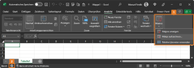
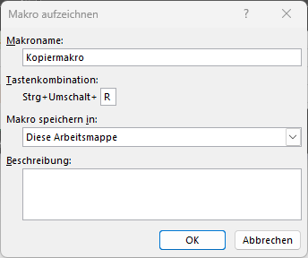
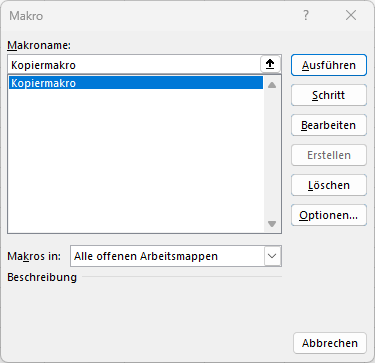
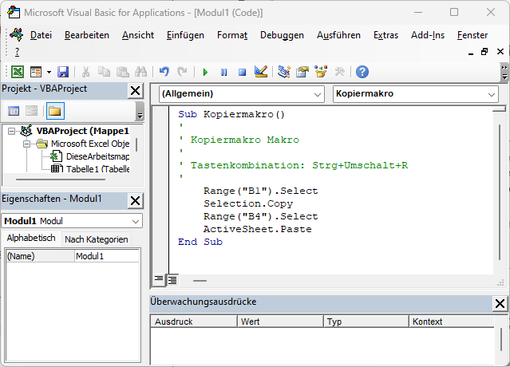

# Makros

Als letztes Kapitel beschäftigen wir uns mit den einfachsten Dingen rund um Excel-Makros. **Makros** sind kleine "Programme", die uns gewisse Arbeitsschritte automatisiert wiederholen lassen. Sie eignen sich daher besonders für Aufgaben, die ständig gleich ablaufen und öfter vorkommen.

## Makro aufnehmen

Generell gibt es in Excel zwei Möglichkeiten, Makros zu erstellen: **Programmierung mittels Code** oder **Aufzeichnung von Arbeitsschritten**. Aufgrund der knappen Zeit gehen wir hier nur auf die zweite Variante ein.

Um eine **Aufzeichnung eines Makros** zu starten, gibt es zwei Möglichkeiten. Eine weitere führt über das Menüband *Entwicklertools*, das ggf. erst eingeblendet werden muss (*Optionen* → *Menüband anpassen* → auf der rechten Seite *Entwicklertools* anhaken).

Unabhängig vom Weg öffnet sich ein neues Dialogfenster. Folgende Einstellungen können getroffen werden:

- **Makroname**: Name, unter dem das Makro gespeichert werden soll.
- **Tastenkombination**: Optional ein Shortcut. **Achtung**: Dabei können auch gängige Shortcuts (wie <kbd>STRG</kbd> + <kbd>C</kbd>) lokal überschrieben werden. Durch Drücken von <kbd>SHIFT</kbd> sind weitere Kombinationen möglich.
- **Makro speichern in**: Typischerweise werden Makros in der gleichen Arbeitsmappe (*diese Arbeitsmappe*) gespeichert und sind nur dort aufrufbar. Außerdem gibt es die Möglichkeit, eine *neue Arbeitsmappe* zu erstellen oder eine *persönliche Makroarbeitsmappe* anzulegen. Letztere kann verwendet werden, um Makros zu definieren, die später vom Ersteller in mehreren Arbeitsmappen genutzt werden - sie wird fortan mit allen Excel-Mappen geöffnet.
- **Beschreibung**: Optionale Beschreibung des Makros.

Nach Bestätigung mit *OK* läuft die Aufnahme. In der Statusleiste wird das optisch angezeigt. Nun können beliebige Schritte durchgeführt werden. Am Ende wird das **Stoppsymbol** in der Statuszeile geklickt - oder über *Ansicht* → *Makros* → *Aufzeichnung beenden* wird die Aufnahme beendet.

## Makro bearbeiten

Um alle Makros **anzuzeigen**, die bereits zur Verfügung stehen oder aufgezeichnet wurden, kann mit <kbd>ALT</kbd> + <kbd>F8</kbd> oder unter *Ansicht* → *Makros* → *Makros anzeigen* eine Übersicht geöffnet werden. Darin können Makros gelöscht, bearbeitet, Optionen angepasst (z. B. Shortcut) oder ausgeführt werden.

## Makro ausführen

Zum **Ausführen** von Makros gibt es mehrere Möglichkeiten:

- **Makroübersicht**: Klick auf *Ausführen*.
- **Shortcut**: Der beim Erstellen vergebene Shortcut.
- **Shape**: Eine Verknüpfung mit einem Element herstellen - z. B. ein Rechteck zeichnen, dann Rechtsklick → *Makro zuweisen* → Makro auswählen. Anschließend kann das Rechteck wie eine Schaltfläche verwendet werden.
- **Button**: Unter *Entwicklertools* → *Steuerelemente* → *Einfügen* → *Formularsteuerelemente* → *Schaltfläche* einen Button einfügen und mit einem Makro verknüpfen. Mit gedrückter <kbd>ALT</kbd>-Taste kann am Gitternetz gerastert werden.
- **Schnellzugriff**: Unter *Optionen* → *Symbolleiste für den Schnellzugriff* unter *Befehle auswählen* auf *Makros* gehen - und das entsprechende Makro hinzufügen.

## Makro programmieren

Um den Sprung zu **Visual Basic for Applications (VBA)** zu schaffen, kannst du unter *Ansicht* → *Makros* → *Makros anzeigen* auf *Bearbeiten* klicken. Anschließend wird der Code, der im Hintergrund läuft, angezeigt und kann nach Bedarf geändert werden.

!!! question "Übungsaufgabe"
    Nachdem wir nun eine einfache Möglichkeit kennengelernt haben, Makros zu erstellen, ist es an der Zeit, das Erlernte zu üben:

    - :material-microsoft-excel: `08_Makros.xlsx`

    Die Mappe enthält **drei identisch aufgebaute Monatsberichte**: Beim ersten zeichnest du die Aufbereitung auf, die anderen beiden erledigt dein Makro in Sekunden. Das Blatt `Zielbild` zeigt, wie ein fertig aufbereiteter Bericht aussehen soll.

    

    <table role="table" aria-label="Arbeitsblatt / Inhalt"
           style="width:100%; border-collapse:separate; border-spacing:0; border:1px solid #cfd8e3; border-radius:10px; overflow:hidden; font-family:system-ui,sans-serif;">
        <thead>
        <tr style="background:#009485; color:#fff;">
            <th style="text-align:left; padding:12px 14px; font-weight:700;">Arbeitsblatt</th>
            <th style="text-align:left; padding:12px 14px; font-weight:700;">Inhalt</th>
        </tr>
        </thead>
        <tbody>
        <tr>
            <td style="background:#00948511; padding:10px 14px;"><code>1 Aufzeichnen</code></td>
            <td style="padding:10px 14px;">Entwicklertools einblenden, Makro aufzeichnen, relative Verweise</td>
        </tr>
        <tr>
            <td style="background:#00948511; padding:10px 14px;"><code>2 Ausführen</code></td>
            <td style="padding:10px 14px;">Makroübersicht, Shortcut, Shape, Schaltfläche, Schnellzugriff</td>
        </tr>
        <tr>
            <td style="background:#00948511; padding:10px 14px;"><code>3 Bearbeiten</code></td>
            <td style="padding:10px 14px;">Makroübersicht, VBA-Editor, Code aufräumen, persönliche Makroarbeitsmappe</td>
        </tr>
        </tbody>
    </table>
    

!!! warning "Dateiformat nicht vergessen"
    Sobald eine Arbeitsmappe ein Makro enthält, muss sie als **Excel-Arbeitsmappe mit Makros** (`.xlsm`) gespeichert werden. Speicherst du weiter als `.xlsx`, verwirft Excel den Code beim Schließen - mit einer Warnung, die man leicht überliest.
