# Excel-Power: Query, Pivot, BI

In diesem Kapitel betrachten wir die "Power-Familie" von Excel: **Power Query**, **Power Pivot** und **Power BI**. Während Power Query klassische ETL-Prozesse erlaubt, ermöglicht Power Pivot Datenmodelle und Beziehungen zwischen Tabellen - und Power BI hebt das Ganze in die Cloud und auf eigene Dashboards.

## Power Query

Mit Excel Power Query ist es möglich, **ETL-Prozesse** (Extract, Transform, Load) durchzuführen. Daten aus mehreren unterschiedlichen Quellen werden in einer Zieldatenbank vereinigt - auch wenn die Quellen unterschiedliche Strukturen aufweisen. Der Prozess umfasst:

1. **Extraktion** von relevanten Daten aus verschiedenen Quellen
2. **Transformation** der Daten in die Struktur der Zieldatenbank
3. **Laden** der Daten in die Zieldatenbank

Power Query unterstützt **unterschiedliche Quellen**: einzelne Excel- und CSV-Dateien, ganze Ordner (neue Dateien werden automatisch mit ausgewertet), Datenbanken wie SAP oder Access, sowie Webquellen - z. B. Tabellen von Wikipedia oder Aktienkurse. Bei allen Quellen kann zusätzlich vorgegeben werden, in welchem Abstand die Daten aktualisiert werden. Die übliche Excel-Beschränkung (ca. 1 Million Zeilen) gilt im Datenmodell nicht mehr.

In den neuesten Excel-Versionen ist Power Query vollständig in Excel **integriert**. Unter *Daten* → *Daten abrufen und transformieren* finden sich die zentralen Befehle. Der wichtigste Bereich ist *Daten abrufen* - hier kannst du aus allen möglichen Quellen wählen oder die Power-Query-Oberfläche starten. Daneben gibt es Schnellverknüpfungen wie *Aus Text/CSV* oder *Aus Web* sowie eine Auflistung *Vorhandene Verbindungen*.

### Einfache Abfrage aus einer Excel-Datei

Wie erwähnt gibt es neben Schnellzugriffen die allgemeine Möglichkeit, über *Daten abrufen* einen Quelltyp direkt auszuwählen oder Power Query allgemein zu starten. Mit *Aus Tabelle/Bereich* werden Daten aus der gleichen Arbeitsmappe abgerufen, mit *Daten abrufen* → *Aus Datei* → *Aus Excel-Arbeitsmappe* aus einer anderen Datei. Bei letzterer Variante kannst du im **Navigator** entweder die gesamte Datei oder einzelne Arbeitsblätter bzw. Teile (vergebene Namen oder benannte Tabellen) abrufen.

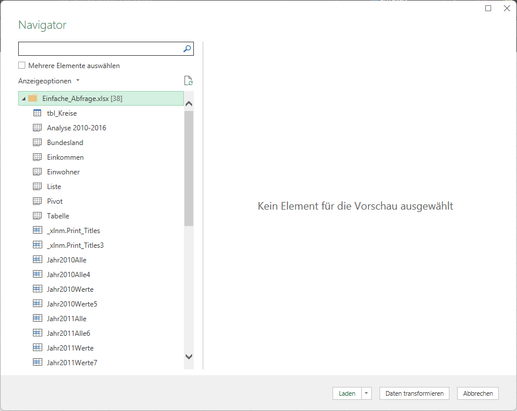

Im Navigator gibt es die Möglichkeit, Daten direkt zu *Laden* oder vorher mit *Daten transformieren* zu bearbeiten. Über *Daten transformieren* öffnet sich der **Power-Query-Editor**, der in vier Teile gegliedert ist:

1. **Menü**: Wie aus dem Hauptfenster von Excel bekannt, gibt es hier ein Menüband mit mehreren Registerkarten.
2. **Liste aller Abfragen**: Alle Abfragen, die aktuell in der Excel-Tabelle verknüpft sind.
3. **Vorschau**: Die eigentlichen Daten der Abfrage. Es werden nur eine gewisse Anzahl an Zeilen geladen - beim Scrollen werden weitere "nachgeladen", bis das Ende erreicht ist.
4. **Abfrageeinstellungen**: Unterteilt in zwei Bereiche:
    - **Eigenschaften**: Name für die Abfrage und erweiterte Eigenschaften.
    - **Angewendete Schritte**: Ein zentraler Punkt - alle Aktionen, die auf die Daten angewendet wurden, werden hier aufgelistet. Sie können rückgängig gemacht, geändert oder einzelne Schritte gelöscht werden.

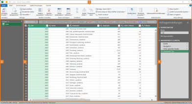

Mit den Funktionen im Menüband können nun die Daten transformiert werden. Eine Auswahl interessanter Funktionen:

- **Start**
    - **Zeilen entfernen oder beibehalten**: Festlegen, welche Zeilen geladen werden.
    - **Sortieren**.
    - **Spalten teilen**: Einzelne Spalten anhand eines Trennzeichens auftrennen (z. B. Vor- und Nachname).
    - **Datentypen**: Verschiedene Typen wie bereits bekannt.
    - **Erste Zeile als Überschriften verwenden**.
    - **Werte ersetzen**: Wie *Suchen und Ersetzen* in anderen Programmen.
- **Transformieren** (Funktionen getrennt nach Datentyp)
    - **Spalte pivotieren** bzw. **Spalten entpivotieren**: Umwandeln zwischen Pivot-Darstellung und Listen-Darstellung.

        

    - **Spalten verschieben** (auch per Drag-and-Drop möglich).
    - **Anwenden von Statistiken** auf Zahlenspalten.
- **Spalte hinzufügen**: Hier können neue Spalten ergänzt werden, die gewisse Eigenschaften oder Funktionen beinhalten - z. B. Spaltenwerte addieren.

Nachdem die Daten für das **Laden** vorbereitet wurden, können wir das durchführen. Es gibt verschiedene Lade-Methoden:

- **Tabelle** (Standard): Die Daten werden in einem Arbeitsblatt als formatierte Tabelle ausgegeben.
- **Pivot-Tabelle**: Daten werden direkt als Pivot-Tabelle ausgegeben.
- **Pivot-Chart**: Daten werden direkt als Pivot-Chart ausgegeben.
- **Nur Verbindung erstellen**: Die Daten werden nicht direkt dargestellt, sondern als Verbindung gespeichert.

!!! warning "Hinweis"
    Egal wie die Daten geladen wurden - die gewählte Methode kann im Nachhinein geändert werden.

### Abfrage bearbeiten

Unter *Daten* → *Abfragen und Verbindungen* → *Abfragen und Verbindungen* öffnet sich auf der rechten Seite ein Dialog mit allen bestehenden Abfragen und Verbindungen. Hier können sie auch nach dem Laden überarbeitet werden:

- **Lade-Methode**: Per Rechtsklick auf die Verbindung → *Laden in...* → Methode ändern.
- **Aktualisieren**: Verbindung aktualisieren oder unter *Eigenschaften* eine automatische Aktualisierung einstellen.
- **Kopie erstellen**: Eine Abfrage kann **dupliziert** werden - eine exakte Kopie inklusive aller angewandten Schritte. Diese kann anschließend komplett getrennt bearbeitet und ausgewertet werden, ohne dass sich die Dateien gegenseitig beeinflussen. Außerdem gibt es die Möglichkeit eines **Verweises** - auch eine Kopie, aber mit dauerhafter Verbindung zur Ursprungsabfrage. Die neue Abfrage verwendet die Ursprungsabfrage als Quelle. Änderungen werden im Verweis automatisch übernommen.
- **Editor öffnen**: Doppelklick auf die Abfrage öffnet erneut den Power-Query-Editor.

### Abfragen zusammenführen

In manchen Fällen will man mehrere Abfragen zu einer zusammenführen. Bisher haben wir dafür z. B. `SVERWEIS` oder `INDEX` und `VERGLEICH` verwendet. Viel einfacher geht das mit Power Query.

Zuerst werden zwei Abfragen erstellt. Anschließend wählst du im Power-Query-Editor jene Abfrage aus, die erweitert werden soll. Über *Start* → *Kombinieren* → *Abfragen zusammenführen* öffnet sich ein neues Fenster *Zusammenführen*, in dem die zweite Abfrage gewählt wird. Wichtig: In beiden Abfragen muss es eine **übereinstimmende Spalte** geben, um die **Abfragen zusammenzuführen**. Die jeweilige Spalte wird in der Vorschau markiert. Excel bestimmt die Übereinstimmung automatisch und weist auf Abweichungen hin. Mit *OK* werden die entsprechenden Spalten angehängt.

Nach dem Zusammenführen wird die Abfrage um eine neue Spalte mit dem Inhalt *Table* erweitert. Dahinter verbergen sich alle angefügten Spalten. Um auszuwählen, **welche Spalten angezeigt** werden, klickst du am Spaltenkopf auf das Symbol und erhältst eine Auswahl. Die Option *Ursprünglichen Spaltennamen als Präfix verwenden* bewirkt, dass neue Spaltennamen mit dem Namen der Abfrage beginnen und mit Punkt der eigentliche Spaltenname angehängt wird. Diese Option kann ggf. deaktiviert werden.

### Abfragen von Ordnern

Ein großer Vorteil von Power Query ist die Möglichkeit, Abfragen auf **alle Dateien eines Ordners** auszuführen. Unter *Daten* → *Daten abrufen und transformieren* → *Daten abrufen* → *Aus Datei* → *Aus Ordner* wählst du den entsprechenden Ordner aus. Anschließend werden alle Dateien aufgelistet - mit *Daten transformieren* (in älteren Versionen *Bearbeiten*) gelangst du in den Power-Query-Editor.

Im Editor werden alle Dateien mit einer Spalte *Content* aufgelistet. Mit Klick auf das rechte Symbol im Spaltenkopf öffnet sich ein neuer Dialog, in dem standardmäßig die erste Datei geöffnet wird und du - wie zuvor - das entsprechende Element der Datei (Arbeitsblatt, Tabelle, definierte Namen) auswählen kannst. Mit *OK* wird die Abfrage ausgewertet und im Hintergrund eine Funktion angelegt, die auf alle Dateien im Ordner angewendet wird. Auf der linken Seite (Liste aller Abfragen) erscheinen mehrere Dateien - relevant ist *Daten* im Bereich *Andere Abfragen*. Im Vorschaufenster werden nun die Daten aller Dateien hintereinander angezeigt.

Nun können die Daten transformiert (erste Zeilen löschen, erste Zeile als Überschrift verwenden, Werte ersetzen, Textfilter, …) und anschließend geladen werden. Sollten neue Dateien im Ordner hinzukommen, werden sie nach der Aktualisierung automatisch ergänzt.

!!! warning "Hinweis"
    Im Power-Query-Editor können auch Filter durch Setzen oder Entfernen von Häkchen angewendet werden. Wichtig: Neu hinzukommende Werte werden in diesem Fall nicht automatisch übernommen, weil sie standardmäßig ohne Häkchen ergänzt werden.

### Weitere Abfragemöglichkeiten

Neben den beschriebenen Abfragen gibt es die Möglichkeit, Daten von **Webseiten** zu extrahieren bzw. in Office 365 auch **Bilder** zu analysieren. Mit etwas Übung lassen sich Abfragen von Webseiten - wie Wikipedia-Tabellen oder Aktienkurse - dynamisch in eine Excel-Auswertung einbinden.

!!! question "Übungsaufgabe"
    Nachdem wir nun Power Query kennengelernt haben, ist es an der Zeit, das Erlernte zu üben. Verwende die nachfolgenden Dateien:

    - :material-microsoft-excel: `07_PQ_Einfach.xlsx`
    - :material-folder-zip: `07_PQ_Ordner.zip`

## Power Pivot

Ein weiteres Tool der Excel-Power-Familie ist **Power Pivot**. Dem zugrunde liegt ein **Datenmodell**. Eingeführt mit Excel 2013 erlaubt es uns, Beziehungen zwischen Tabellen herzustellen - wie in üblichen Datenbanksystemen. Damit ist eine effiziente Daten- und Speicherverwaltung möglich, ohne sämtliche Daten in eine einzige große Tabelle zu speichern. Über Power Pivot greifen wir auf dieses Datenmodell zu. Ein weiterer Vorteil: Die bisherige **Beschränkung** (knapp 1 Million Zeilen) gilt nicht mehr.

!!! example "Beispiel"
    In einer Tabelle, die alle gestellten Rechnungen enthält, müssen nicht zu jeder einzelnen Rechnung die vollständigen Adressen der Kunden oder alle detaillierten Artikelinformationen gespeichert werden. Es reicht, wenn jede Zeile die Kundennummer und die Artikelnummer enthält. Über diese lassen sich die nötigen Informationen aus den separaten Kunden- und Artikeltabellen holen.

Sehr häufig - wie auch im Beispiel - spricht man von einem Zusammenspiel aus **Faktentabellen** (hier: Rechnungen) und **Dimensionstabellen** (hier: Kunden, Artikel), die über ein **Schlüsselfeld** miteinander verbunden sind (hier: Kundennummer, Artikelnummer). Naturgemäß entsteht eine **1:N-Beziehung**: Eine Artikelnummer kommt in der Artikelstammtabelle nur einmal vor, in der Rechnungstabelle aber unter Umständen sehr häufig (N-mal).

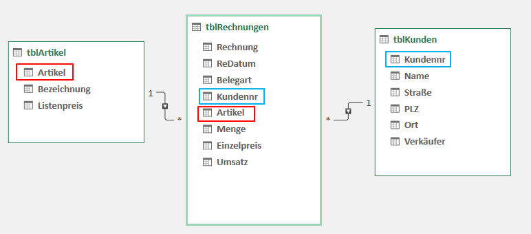

### Aktivieren

Seit Excel 2013 ist Power Pivot als Add-in in den meisten Versionen enthalten. Manchmal muss das Add-in erst installiert oder aktiviert werden. Unter *Datei* → *Optionen* → *Add-Ins*, dann *Verwalten: COM-Add-Ins* auf *Los* klicken, *Microsoft Power Pivot for Excel* anhaken und mit *OK* bestätigen. Damit erscheint ein neuer Eintrag *Power Pivot* im Menüband.

Eine weitere Möglichkeit: *Daten* → *Datentools* → *Zum Power-Pivot-Fenster wechseln*. Hier öffnet sich ein Dialog, in dem das Add-in aktiviert werden kann - anschließend wird das Power-Pivot-Fenster automatisch geöffnet.

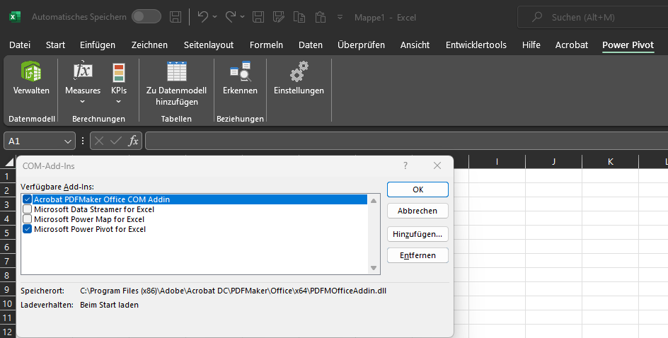

### Daten ins Datenmodell laden

Beim beschriebenen Beispiel gibt es **verschiedene Vorgehensweisen** zur Lösung. Neben händischem Zusammenkopieren oder dem Einsatz von `SVERWEIS` könnten die Daten auch als Tabellen formatiert und mit Power Query und der *Zusammenführung von Abfragen* kombiniert werden. Alle diese Möglichkeiten sind mehr oder weniger statisch - zumindest stoßen sie an ihre Grenzen, wenn neue Spalten in den Rohdaten ergänzt werden. Hier kommt Power Pivot mit dahinterliegendem Datenmodell ins Spiel.

Um Daten ins Datenmodell zu laden, gibt es mehrere Möglichkeiten:

1. **Über Power Query** (bevorzugte Variante): Beim Importieren aus dem Power-Query-Editor wird mit Setzen des Häkchens *Dem Datenmodell diese Daten hinzufügen* die Quelle direkt ergänzt. Üblicherweise wählst du dies in Kombination mit *Nur Verbindung erstellen*. Diese Variante ist bevorzugt, weil wir Daten aus unterschiedlichen Quellen zusammenziehen und direkt formatieren bzw. strukturieren können.
2. **Über formatierte Tabellen**: Wenn bereits eine formatierte Tabelle in der Arbeitsmappe vorhanden ist und du eine Zelle der Tabelle ausgewählt hast, kann sie über *Power Pivot* → *Zu Datenmodell hinzufügen* direkt zum Datenmodell hinzugefügt werden.
3. **Über Power-Pivot-Oberfläche**: Mit *Power Pivot* → *Verwalten* öffnet sich das Power-Pivot-Fenster, das wie Power Query Daten aus unterschiedlichsten Quellen importieren kann. Dieser Weg eignet sich nur, wenn die Daten bereits perfekt strukturiert vorliegen - der seltenste Fall. Daher sind die ersten beiden Varianten zu bevorzugen.

Egal auf welche Weise die Daten ins Datenmodell geladen werden, das Ergebnis sieht so aus:

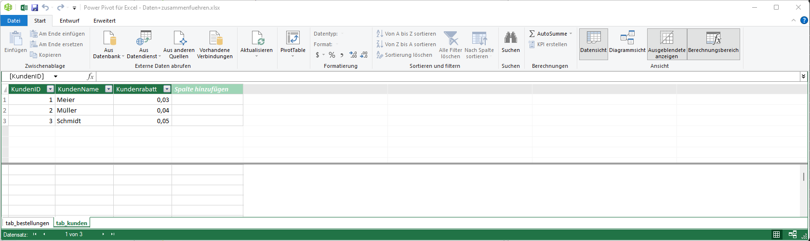

!!! warning "Hinweis"
    Das Datenmodell bzw. die Einstellungen im Power-Pivot-Fenster müssen nicht extra gespeichert oder geschlossen werden. Durch das Schließen des Fensters werden alle Änderungen übernommen.

### Beziehung zwischen Daten herstellen

Nun verknüpfen wir die geladenen Daten. Im Power-Pivot-Fenster wechselst du unter *Start* → *Diagrammansicht* in eine andere Darstellungsform. Die geladenen Daten werden entsprechend ihrer Namen und Spaltenbezeichnungen dargestellt. Um nun eine Beziehung herzustellen, ziehst du per Drag-and-Drop zwei Spaltenbezeichnungen aufeinander. Es wird eine neue Linie gezeichnet, die auch die bereits erwähnte 1:N-Beziehung hervorhebt. Damit sind die Daten aus mehreren Tabellen miteinander verbunden, und wir können mit der Auswertung beginnen.

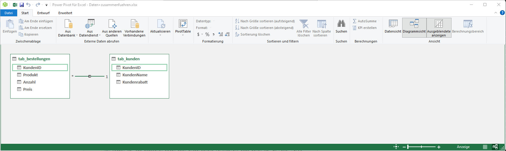

### Pivot-Tabelle erstellen

Um eine Pivot-Tabelle basierend auf unserem Datenmodell zu erstellen, gibt es wiederum mehrere Möglichkeiten:

1. **Über Power-Pivot-Fenster**: Im Power-Pivot-Fenster gibt es im Menüband *Start* die Option *PivotTable*. Damit öffnet sich ein Dialog, in dem ausgewählt werden kann, wo eine neue Pivot-Tabelle erstellt werden soll.
2. **Über Pivot-Tabelle einfügen**: Beim klassischen Vorgehen anstelle einer einzelnen Tabelle die Option *Das Datenmodell dieser Arbeitsmappe verwenden* auswählen.

Über beide Wege gelangt man zur gleichen - von Pivot-Tabellen bereits gewohnten - Oberfläche. Allerdings hat man bei der Auswahl der Daten nun Zugriff auf **beide Tabellen**. Außerdem stehen neue Spalten, die an die Quelltabellen angehängt werden, direkt in der Pivot-Auswertung zur Verfügung - nach Aktualisierung der Pivot-Tabelle (das wäre mit Power Query nicht möglich).

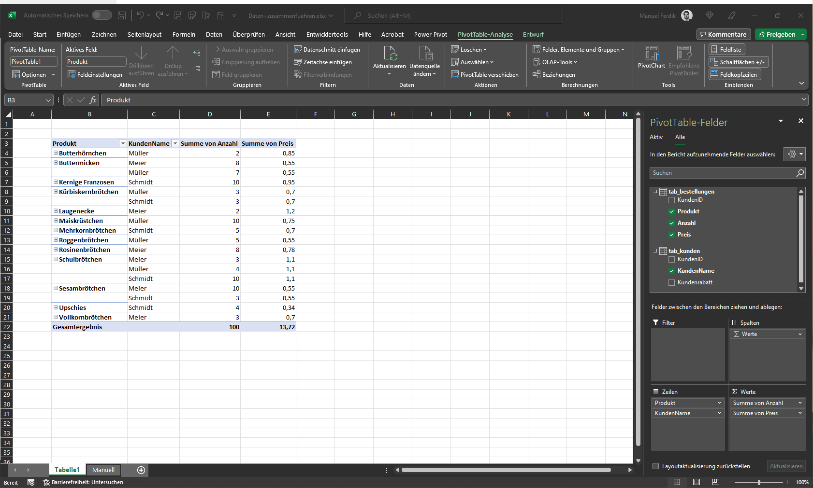

Ein Nachteil von Power Pivot: die fehlende Möglichkeit, **berechnete Felder** wie bei klassischen Pivot-Tabellen hinzuzufügen. Allerdings gibt es auch hier eine Lösung - die Berechnungen müssen bereits im Datenmodell selbst angelegt werden.

### Auswerten der Daten

Generell wird beim Datenmodell zwischen Faktentabellen und Dimensionstabellen unterschieden. Das kann zu Problemen führen, wenn man beispielsweise Daten aus der Dimensionstabelle als *Werte* in der Pivot-Tabelle ausgeben möchte (in unserem Beispiel: Kundenrabatt).

!!! warning "Hinweis"
    Spalten der Dimensionstabelle eignen sich hauptsächlich für die Verwendung in den Zeilen bzw. Spalten der Pivot-Tabellen - nicht für die Werte.

Um dieses Problem zu umgehen, gibt es in der Power-Pivot-Oberfläche die Möglichkeit, eine neue Spalte zur **Faktentabelle** hinzuzufügen und sie mit Inhalt aus der Dimensionstabelle zu befüllen. Dazu klickst du in die erste Zelle der neuen Spalte und beginnst mit `=`. Um auf den entsprechenden Eintrag der Dimensionstabelle zuzugreifen, gibt es den Befehl `RELATED`. In den Klammern wird die Spalte ausgewählt, die eingefügt werden soll. Es wird automatisch eine **berechnete Spalte** erzeugt und für alle Zeilen befüllt. Durch Doppelklick auf den Spaltenkopf kann sie umbenannt werden. Die Spalte steht nun automatisch in der Pivot-Auswertung zur Verfügung - auch als *Wert*.

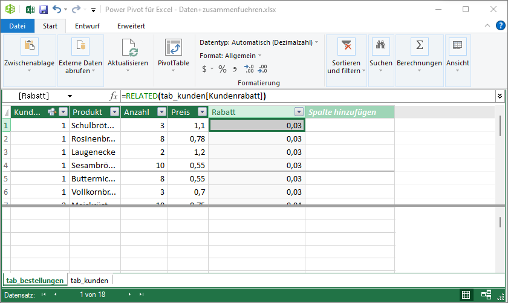

Neben `RELATED` können weitere Befehle und Formeln verwendet werden, um neue **Spalten zu berechnen**. Beispielsweise könnte der Umsatz pro Zeile einer Bestellung berechnet werden - über normale Grundrechnungsoperationen.

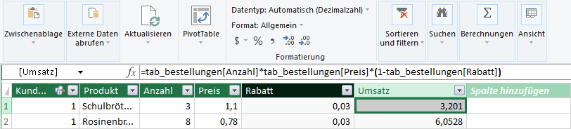

Neben berechneten Spalten gibt es in Power Pivot auch berechnete Felder, sogenannte **Measures**. Unter *Power Pivot* → *Measures* → *Neues Measure* kann eine neue Berechnung erstellt werden:

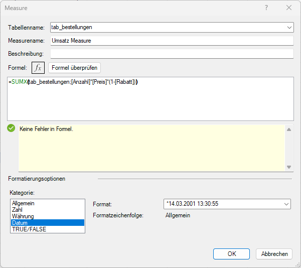

Folgende Einstellungen können vorgenommen werden:

- **Tabellenname**: Auf welche Tabelle das Measure erstellt werden soll.
- **Measure-Name**: Wie das Measure heißen soll.
- **Beschreibung**: Allgemeine Beschreibung (optional).
- **Formel**: Hier kann eine Formel händisch oder mit dem *Formeleditor* eingegeben werden. Statt der klassischen Formeln stehen sogenannte **DAX-Funktionen** (Data Analytics eXpression) zur Verfügung. Der Ablauf bleibt der gleiche. Aus vorgefertigten Befehlen - wie `SUMX` - kann gewählt werden. Mit *Formel überprüfen* erfolgt eine Formalprüfung.
- **Formatierung**: Hier kann das Zielformat (Währung, Uhrzeit, …) gewählt werden.

Nach Bestätigen mit *OK* wird das Measure automatisch in die Pivot-Tabelle eingefügt. Unter *Power Pivot* → *Measures* → *Measures verwalten* können bestehende Measures bearbeitet oder gelöscht werden. In der Power-Pivot-Oberfläche werden Measures am unteren Ende des Fensters als einzelne Zelle angezeigt - nicht als berechnete Spalte. Hier können auch beliebig weitere Measures angelegt werden.

Der Vorteil von Measures: Darauf aufbauend können **KPIs** (Key Performance Indicators) erzeugt werden. Unter *Power Pivot* → *KPIs* → *Neuer KPI* öffnet sich folgendes Dialogfenster:

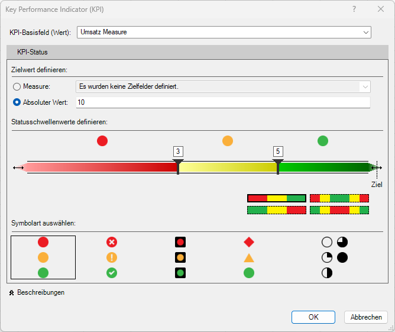

Folgende Einstellungen können getroffen werden:

- **KPI-Basisfeld**: Hier wird das zugrundeliegende Measure ausgewählt.
- **Zielwert definieren**: Ein Measure oder ein Absolutwert als Zielwert.
- **Statusschwellwerte definieren**: Farbskalen (3- oder 5-teilig bzw. Reihenfolge) und Schwellwerte festlegen.
- **Symbolart auswählen**: Welche Symbole sollen als KPI eingefügt werden.

Mit *OK* wird der KPI eingefügt und steht in der Pivot-Tabellen-Oberfläche zur Verfügung. Es wird automatisch eine neue Spalte angehängt, allerdings noch nicht richtig dargestellt. Durch einmaliges Aus- und Einblenden des Status erscheinen anschließend die richtigen Symbole.

!!! question "Übungsaufgabe"
    Nachdem wir nun Power Pivot kennengelernt haben, ist es an der Zeit, das Erlernte zu üben:

    - :material-microsoft-excel: `07_PPivot.xlsx`

## Power BI

Mit Power BI Desktop hat Microsoft einen Nachfolger von Power View zur Verfügung gestellt. Bislang war es immer notwendig - egal ob Power Pivot, Power Query, … -, dass zumindest einmal eine Excel-Arbeitsmappe geöffnet wird und die Daten aktualisiert werden. Mit Power BI können wir eine einmal festgelegte Prozesskette in die Cloud hochladen und dort eine automatische Aktualisierung einstellen. Im Hintergrund funktioniert die Software wie die bereits beschriebenen Power Query und das Datenmodell hinter Power Pivot.

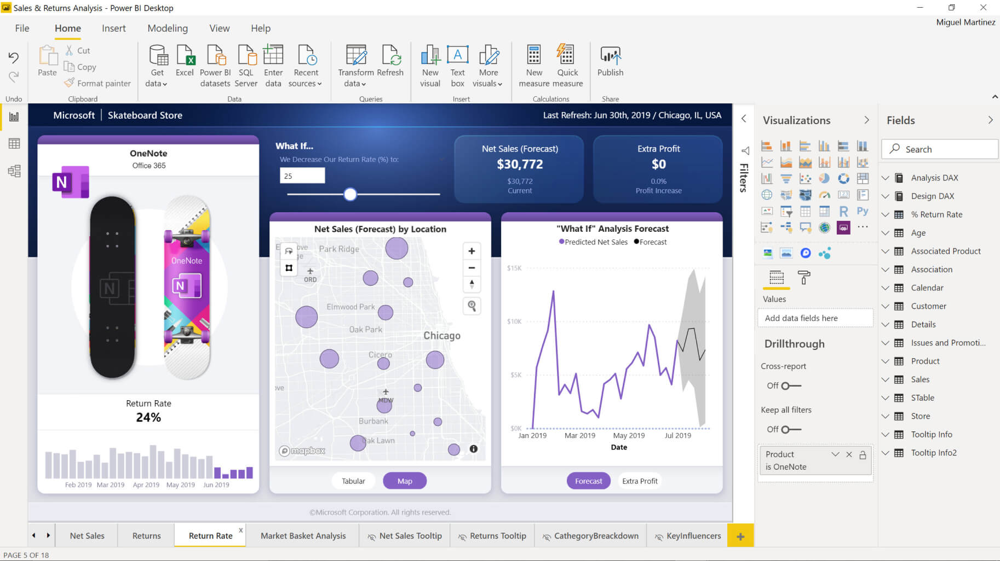

Microsoft Power BI ermöglicht es Unternehmen, durch die Nutzung von Daten wertvolle Erkenntnisse zu gewinnen. Daten aus vielfältigen Quellen - z. B. Excel-Tabellen oder Datenbanken - werden zusammengetragen, strukturiert aufbereitet und mithilfe eines Datenmodells in sinnvolle Zusammenhänge gebracht. Das ermöglicht eine effektive Analyse und die Erstellung aussagekräftiger **Dashboards**. Die Erkenntnisse können einfach veröffentlicht und online zugegriffen werden.

Power BI besteht im Grunde aus drei Teilen:

- **Power BI Desktop**: Eine lokal am PC installierte Software. Damit werden Daten geladen, verbunden, transformiert und visualisiert. Im Hintergrund läuft das Excel-Datenmodell.
- **Power BI Dienst**: Macht erstellte Dashboards über die Cloud zugänglich.
- **Power BI App**: Zur mobilen Betrachtung der Dashboards.

Die Benutzeroberfläche von Power BI Desktop:

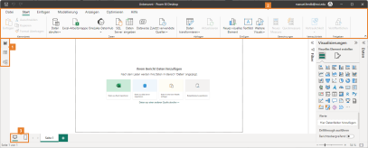

1. **Ansicht**:
    - **Berichtsansicht**: Hier werden Auswertungen, Berichte und Dashboards erstellt. Es stehen verschiedenste Visualisierungen zur Verfügung.
    - **Tabellenansicht**: Die zugrundeliegenden Daten in Tabellenform näher betrachten.
    - **Modellansicht**: Die geladenen Daten - wie aus Power Pivot bekannt - in Relation bringen.
2. **Menüband**: Je nach Ansicht gibt es unterschiedliche Menüeinträge und Optionen.
3. **Layoutwechsel**: Power BI kann Dashboards auch am Mobiltelefon anzeigen. Daher kann in eine mobile Ansicht gewechselt werden, in der ein eigenes Dashboard designt werden kann.

### Daten laden und transformieren

Bevor mit der Visualisierung begonnen werden kann, müssen die **Daten geladen** werden. Das Vorgehen ist identisch zu Power Query: Daten aus verschiedenen Quellen laden und anschließend **transformieren**. Zur Demonstration werden dieselben Daten wie im Power-Pivot-Kapitel verwendet - die beiden Tabellen *Bestellungen* und *Kundenliste*. Power BI erkennt automatisch eine Verknüpfung über das Schlüsselfeld *KundenID*. Sollte das nicht der Fall sein, lässt sich der Zusammenhang per Drag-and-Drop herstellen.

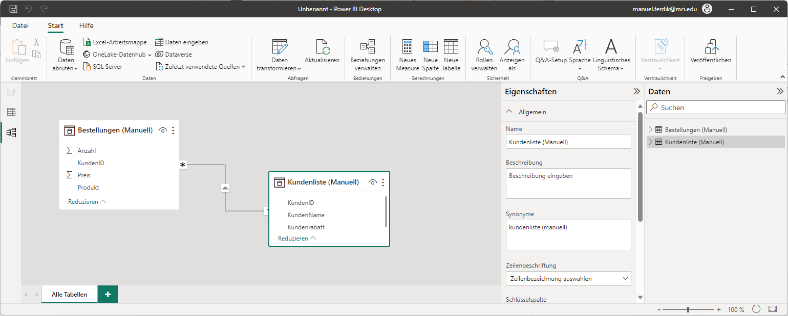

Wie bei Power Pivot können in der Tabellenansicht die Daten betrachtet und Measures erstellt werden.

### Dashboard erstellen

In der Berichtsansicht kann nun ein **Dashboard** erstellt werden. Auf der rechten Seite kann unter *Visualisierung* zwischen *Visuelle Elemente* gewählt werden - oder allgemeine Einstellungen unter *Seite formatieren* getroffen werden.

Ein neues **Diagramm** wird durch Klick auf das entsprechende Symbol im Bereich *Visualisierung* hinzugefügt. Das leere Diagramm muss anschließend mit Inhalt versehen werden. Unter *Daten* auf der rechten Seite können die Legenden-Attribute und die Werte per Drag-and-Drop ausgewählt werden - anschließend wird das Diagramm automatisch befüllt.

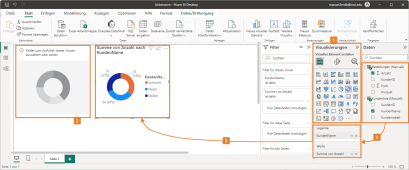

### Dashboard veröffentlichen

Das bisherige Vorgehen unterscheidet sich im Grunde nicht von Power Query und Power Pivot. Der große Vorteil liegt in der **Veröffentlichung** der Daten. Im Menüband *Start* → *Veröffentlichen* gibt es eine entsprechende Funktion. Anschließend wählst du einen Arbeitsbereich aus, in dem das Dashboard veröffentlicht werden soll, und bestätigst die Auswahl. Im Browser kannst du unter <https://app.powerbi.com/> im entsprechenden Arbeitsbereich das Dashboard öffnen und mit *Freigeben* anderen Personen zur Verfügung stellen.

!!! warning "Hinweis"
    Für die Veröffentlichung von Dashboards musst du dich registrieren. Aktuell ist der Vorgang kostenlos. Will man das Dashboard für externe Personen freigeben, ist eine Pro-Lizenz erforderlich.
