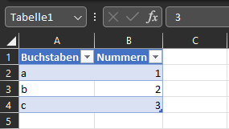
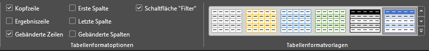

# Tabellen & Pivot-Tabellen

In diesem Kapitel beschäftigen wir uns mit dem Thema **Tabellen**. In Excel existieren neben der klassischen Anordnung als Liste auch die Möglichkeiten, Zellbereiche als (dezidierte) Tabellen zu definieren - nicht nur so zu formatieren - und sogenannte **Pivot-Tabellen** zu erstellen.

## Tabellen

Tabellen in Excel sind zusammenhängende Informationen, die meistens eine gewisse Struktur haben und mit einer Überschrift versehen sind. Wichtig: Eine reine Formatierung und Strukturierung als Tabelle reicht nicht - es muss dezidiert eine Tabelle definiert werden.

### Erstellen

Um eine Tabelle in Excel zu erstellen, gibt es mehrere Wege:

- *Start* → *Formatvorlagen* → *Als Tabelle formatieren*
- *Einfügen* → *Tabellen* → *Tabelle*
- <kbd>STRG</kbd> + <kbd>T</kbd>

In allen Fällen öffnet sich anschließend ein Dialog, in dem du den Bereich nochmals überarbeiten kannst (falls noch nicht der richtige gewählt wurde) und festlegst, ob die Tabelle eine Überschrift besitzt. Bei der ersten Variante kann zusätzlich vorab ein optisches Layout gewählt werden - eine Änderung ist natürlich später jederzeit möglich. An der Funktion ändert das nichts.

### Verwenden

Beim Erstellen einer Tabelle wird automatisch ein **Name** zugewiesen. Standardmäßig startet dieser mit "Tabelle" und einer laufenden Nummer (wie der Name geändert werden kann, folgt im nächsten Abschnitt). Dieser Name wird benötigt, um die Funktionalitäten der Tabelle richtig zu nutzen. Den aktuellen Namen erkennst du, indem du alle Zellen der Tabelle markierst (exklusive Überschriften) und ihn aus der Adressdropdownbox abliest.

Dieser Name kann nun wie unter [Zellbezüge](grundlagen.md#zellbezuge) beschrieben als **benannter Zellbezug** verwendet werden. Beispielsweise referenziert der Befehl `Tabelle1[Nummern]` die Spalte *Nummern* in der Tabelle. Innerhalb der Tabelle kann mit `@` auf die jeweilige Spalte in der gleichen Zeile **referenziert** werden - z. B. `[@Nummern]`.

!!! warning "Hinweis"
    Diese Eigenschaften sind besonders später beim Umgang mit **Pivot-Tabellen** nützlich. Durch das nachträgliche Hinzufügen von Einträgen ergeben sich keine Probleme - sie werden in der Pivot-Auswertung automatisch ergänzt.

Wenn eine Tabelle wie oben erstellt wurde, erscheinen in den Überschriften zusätzliche Schaltflächen - der **AutoFilter**. Damit lassen sich Inhalte sortieren oder filtern (denke auch an die bereits kennengelernten Wildcards).

Innerhalb einer Tabelle kann sehr schnell mit <kbd>TAB</kbd> navigiert werden. Wenn du am Ende einer Tabelle angelangt bist und <kbd>TAB</kbd> drückst, wird die Tabelle um eine neue Zeile erweitert. Gleiches gilt, wenn du in einer Zelle direkt unterhalb oder neben der Tabelle einen Wert einträgst - der Tabellenbereich wird automatisch um die neue Zeile/Spalte erweitert. Das Ende einer Tabelle wird durch ein kleines Dreieck am rechten unteren Rand der letzten Zelle angezeigt.

Ein weiterer Vorteil: Wenn in einer Spalte andere Spalten in einer Formel ausgewertet werden, wird die Formel automatisch für alle Zeilen angewendet und für jede Zeile separat berechnet.

### Ändern

Wenn eine Tabelle definiert wurde und eine Zelle in der Tabelle ausgewählt ist, gibt es einen neuen Eintrag im Menüband namens *Tabellenentwurf*. Darin verstecken sich mehrere zusätzliche Optionen:

Eine Auswahl an möglichen Einstellungen:

- **Tabellenname**: Hier kann der zuvor beschriebene Name geändert werden.
- **Tabellengröße ändern**: Der Bereich der Tabelle kann hier oder per Drag-and-Drop des kleinen Dreiecks am Ende der Tabelle angepasst werden.
- **In Bereich konvertieren**: Die Tabelle wird wieder in einen Bereich (Liste) umgewandelt und verliert sämtliche Eigenschaften - außer der optischen Formatierung.
- **Datenschnitt einfügen**: Mit Datenschnitten lassen sich schnell erste Elemente eines Dashboards erstellen. Datenschnitte beziehen sich auf eine auswählbare Spalte und liefern eine grafische Oberfläche, mit der du Daten schnell durch An- und Abwählen filtern kannst (Mehrfachauswahl mit <kbd>SHIFT</kbd>). Wenn ein Datenschnitt erstellt wurde, öffnet sich ein neuer Eintrag im Menüband zum Anpassen der Oberfläche.
- **Tabellenformatoptionen**: Hier können neben rein optischen Einstellungen (gebänderte Zeilen/Spalten, erste/letzte Spalte) auch die Filterschaltflächen aktiviert/deaktiviert werden - und eine Kopfzeile (Überschriften) oder Ergebniszeile (mit zusätzlichen automatischen Operationen wie Summe, die sich entsprechend der Filter anpassen) ein- bzw. ausgeblendet werden.
- **Tabellenformatvorlagen**: Aus einer Vielzahl an Vorlagen kann die optische Gestaltung gewählt werden.

!!! question "Übungsaufgabe"
    Nachdem wir nun Tabellen kennengelernt haben, ist es an der Zeit, das Erlernte zu üben:

    - :material-microsoft-excel: `06_Tabellen.xlsx`

    

    <table role="table" aria-label="Arbeitsblatt / Inhalt"
           style="width:100%; border-collapse:separate; border-spacing:0; border:1px solid #cfd8e3; border-radius:10px; overflow:hidden; font-family:system-ui,sans-serif;">
        <thead>
        <tr style="background:#009485; color:#fff;">
            <th style="text-align:left; padding:12px 14px; font-weight:700;">Arbeitsblatt</th>
            <th style="text-align:left; padding:12px 14px; font-weight:700;">Inhalt</th>
        </tr>
        </thead>
        <tbody>
        <tr>
            <td style="background:#00948511; padding:10px 14px;"><code>1 Erstellen</code></td>
            <td style="padding:10px 14px;">Einen Bereich in eine echte Tabelle umwandeln</td>
        </tr>
        <tr>
            <td style="background:#00948511; padding:10px 14px;"><code>Muster Tabelle</code></td>
            <td style="padding:10px 14px;">Fertige Tabelle <code>Umsatzdaten</code> zum Ansehen und Ausprobieren</td>
        </tr>
        <tr>
            <td style="background:#00948511; padding:10px 14px;"><code>2 Name+Bezüge</code></td>
            <td style="padding:10px 14px;">Tabellenname und strukturierte Verweise wie <code>Umsatzdaten[Umsatz]</code> und <code>[@Spalte]</code></td>
        </tr>
        <tr>
            <td style="background:#00948511; padding:10px 14px;"><code>3 Ergebniszeile</code></td>
            <td style="padding:10px 14px;">Ergebniszeile, AutoFilter und <code>TEILERGEBNIS</code></td>
        </tr>
        <tr>
            <td style="background:#00948511; padding:10px 14px;"><code>4 Datenschnitt</code></td>
            <td style="padding:10px 14px;">Datenschnitte als erste Dashboard-Elemente</td>
        </tr>
        <tr>
            <td style="background:#00948511; padding:10px 14px;"><code>5 Ändern</code></td>
            <td style="padding:10px 14px;">Größe ändern, Formatoptionen, in Bereich zurückwandeln</td>
        </tr>
        <tr>
            <td style="background:#00948511; padding:10px 14px;"><code>6 Praxisfall</code></td>
            <td style="padding:10px 14px;">Abteilungsumsätze komplett auswerten</td>
        </tr>
        </tbody>
    </table>
    

    **So funktioniert die Datei:** Gelb hinterlegte Zellen füllst du aus, graue Werte sind vorgegeben. Wo eine **Kontrollspalte** steht, prüft sie deine Eingabe automatisch. Kommst du nicht weiter, findest du im letzten Arbeitsblatt `Lösungen` den Weg.

## Pivot-Tabellen und Pivot-Charts

**Pivot-Tabellen** sind eine besondere Möglichkeit, Datensätze in Listenform möglichst einfach zu analysieren. Um sich damit näher auseinanderzusetzen, folgt eine Selbstlerneinheit.

!!! tip "Selbstlerneinheit"
    Betrachte das nachfolgende Dokument und versuche, die einzelnen Schritte nachzuvollziehen. Begleitet werden die Aufgaben mit der zugehörigen Excel-Datei.

    - :material-file-pdf-box: `SLE_Pivot.pdf`
    - :material-microsoft-excel: `SLE_Pivot.xlsx`

    Die Arbeitsmappe enthält auf dem Blatt `Daten` eine Verkaufsliste (Datum, Filiale, Verkäufer, Firma, Produkt, Umsatz für 2017 und 2018) - bereits als echte Tabelle namens `Verkaeufe`, damit sich jede Pivot-Auswertung beim Ergänzen neuer Zeilen automatisch mitzieht.

!!! question "Übungsaufgabe"
    Aufbauend auf der Tabelle und dem Dokument aus der Selbstlerneinheit kannst du nun die nachfolgenden Übungen bearbeiten.

    - :material-file-pdf-box: `06_Pivot.pdf`
    - :material-microsoft-excel: `SLE_Pivot.xlsx`

    Auf dem Blatt `1 Kontrollwerte` findest du zu jeder Aufgabe des PDF-Übungsteils die erwartete Zahl: Lies den Wert aus deiner Pivot-Tabelle ab, trage ihn ein - stimmt er, hast du die Felder richtig angeordnet. Das Blatt `2 Zusatzaufgaben` geht darüber hinaus (Pivot-Chart, berechnetes Feld, Aktualisierung bei neuen Zeilen).
