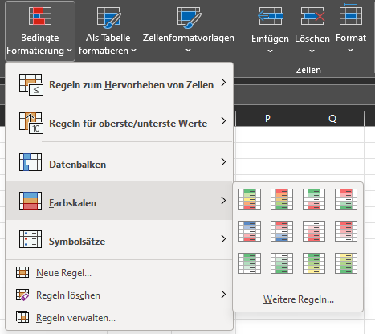
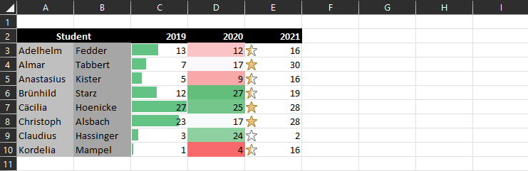
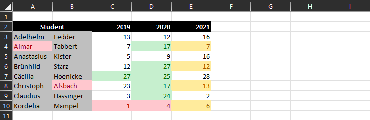
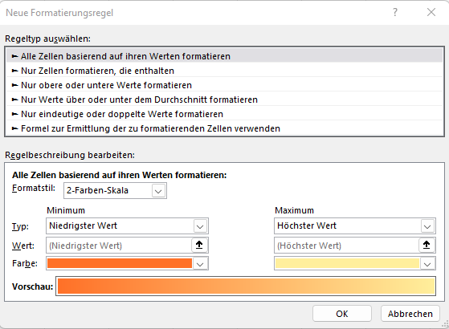
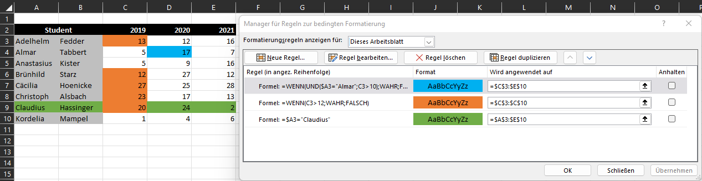
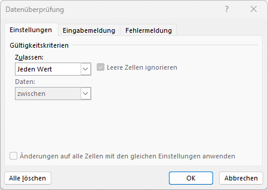
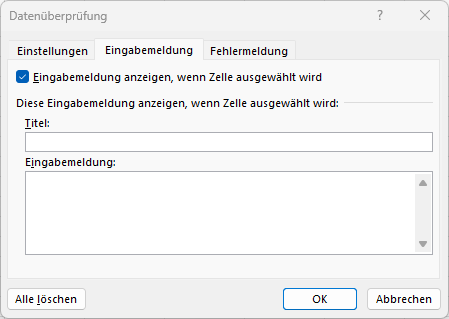
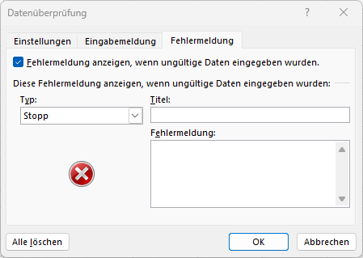

# Visualisierung

Im vorliegenden Kapitel lernen wir, wie wir Daten in Tabellenform einfach und informativ formatieren oder in Diagrammen und Karten darstellen können.

## Bedingte Formatierung

Wir haben uns bereits mit der Formatierung einzelner Zellen und Zellbereiche beschäftigt — und auch deren Nachteil kennengelernt: sie sind statisch. Um Zellen entsprechend gewisser Regeln **dynamisch** optisch zu verändern, eignet sich die **Bedingte Formatierung**. Damit können wir Daten in Tabellenform graphisch aufbereiten und so einen schnellen Überblick über die enthaltene Information bekommen.

### Vorlagen

Wie häufig bietet Excel die Möglichkeit, aus Vorlagen zu wählen, um eine **schnelle Analyse** und Visualisierung durchzuführen. Unter *Start* → *Formatvorlagen* → *Bedingte Formatierung* (im Bild Bereich 2) kannst du zwischen drei Vorlagentypen wählen:

- **Datenbalken**
- **Farbskalen**
- **Symbolsätze**

Beispiele für deren Anwendung:

Ein Nachteil dieser Vorlagen ist, dass die getroffenen Einstellungen vorgegeben sind. Maximal- und Minimalwerte werden automatisch bestimmt, Farben und Formen entsprechend gewählt.

### Eigene Regeln

Neben den Vorlagen lassen sich bedingte Formatierungen auch selbst erstellen. Dabei gibt es zwei Möglichkeiten.

#### Regelvorlagen

Im Bild oben (Bereich 1) findest du Regelvorlagen zum *Hervorheben von Zellen* und *für oberste/unterste Werte*. Hier kann aus **13 verschiedenen Typen** eine Regel gewählt werden — anschließend werden ein oder mehrere Schwellwerte und eine Formatierung festgelegt. Im folgenden Bild sind mehrere solcher Regeln auf einen kleinen Datensatz angewandt:

- Spalte *Student*: Hervorheben von 'Textinhalt' (alle Wörter, die *al* enthalten)
- Spalte *2019*: 'Obere 10 %' & 'Untere 10 %'
- Spalte *2020*: 'Größer als' & 'Kleiner als' (Schwellen 5 und 15)
- Spalte *2021*: 'Zwischen' (5–15)

#### Neue Regel erstellen

Neben den Formatierungs- und Regelvorlagen können auch eigene Regeln erstellt werden. Diese bieten den **größten Freiraum**, brauchen aber etwas Übung. Unter *Bedingte Formatierung* → *Neue Regel* öffnet sich ein Fenster, in dem zwischen sechs verschiedenen Typen gewählt werden kann. Die ersten fünf basieren auf den bereits bekannten Regelvorlagen — mit dem Unterschied, dass sie direkt angepasst werden können.

!!! warning "Hinweis"
    Bei der Erstellung neuer Regeln können neben direkten Zahlen und Texten auch **Zellbezüge** verwendet werden — z. B. für Rand-, Schwell- oder Vergleichswerte.

Besonders mächtig ist der **sechste Regeltyp**: *Formel zur Ermittlung der zu formatierenden Zellen verwenden*. Wie der Name andeutet, kannst du hier Formeln verwenden, die einen **Wahrheitstest** durchführen. Sollte das Ergebnis `WAHR` sein, wird die festgelegte Formatierung angewandt. Herausfordernd ist der Umgang mit Zellbezügen: Durch Fixieren der Spalten- oder Zeilenangabe können Formatierungen für ganze Zeilen und Spalten übernommen werden. Das braucht etwas Übung, führt aber zu sehr schönen Ergebnissen.

### Regeln bearbeiten/löschen

Nachdem eine bedingte Formatierung erstellt und angewandt wurde, kann es vorkommen, dass diese nachträglich geändert oder gelöscht werden soll. Dafür gibt es jeweils mehrere Optionen.

#### Regel löschen

Unter *Bedingte Formatierung* → *Regeln löschen* kannst du auswählen, ob die Regel in der gewählten Zelle, im gesamten Arbeitsblatt oder in einer Tabelle gelöscht werden soll.

Die zweite Möglichkeit: *Bedingte Formatierung* → *Regeln verwalten*. Im Fenster *Regel ausgewählt* → *Regel löschen*.

#### Regel bearbeiten

Wie beim Löschen führt der Weg über *Bedingte Formatierung* → *Regeln verwalten*. Dort sind folgende Dinge einstellbar:

- **Geltungsbereich**: Unter *Formatierungsregeln anzeigen für* ist es wichtig, dass der richtige Bereich ausgewählt wurde. Standardmäßig werden nur Formatierungen angezeigt, die auf den gewählten Bereich zutreffen. Mit *Dieses Arbeitsblatt* werden alle Regeln des Arbeitsblattes angezeigt.
- **Kopfleiste**: Hier können neue Regeln erstellt bzw. bestehende Regeln gelöscht, dupliziert und bearbeitet werden. *Regel bearbeiten* öffnet das gleiche Fenster wie beim Erstellen einer neuen Regel.
- **Regelanzeige**: Hier sind sämtliche Regeln (bezogen auf den Geltungsbereich) aufgelistet. Wichtig: Die **Reihenfolge** der Regeln spielt eine Rolle. Obenstehende Regeln überschreiben darunterliegende im Zweifelsfall.

#### Regel kopieren

Eine Regel kann **kopiert** werden, indem sie wie zuvor beschrieben dupliziert oder mit *Format übertragen* (siehe [Formatvorlagen und Tabellen](datenaufbereitung.md#formatvorlagen-und-tabellen)) auf andere Zellen übertragen wird.

Beim **Verschieben und Kopieren** von Zellen wandert auch die bedingte Formatierung mit. In manchen Situationen kann das zu Problemen führen — wenn nicht gewünscht, beim Einfügen auf *Werte einfügen* umschalten.

!!! warning "Hinweis"
    Bedingte Formatierungen werden bei jeder Änderung von Zellinhalten neu ausgewertet. Bei großen, dynamischen Datensätzen kann das das Arbeitsblatt deutlich verlangsamen.

!!! question "Übungsaufgabe"
    Nutze das gelernte Vorgehen und löse die Aufgaben mithilfe von bedingten Formatierungen:

    - :material-microsoft-excel: `04_BedingteFormatierung.xlsx`

## Datenüberprüfung

Eine weitere hilfreiche Möglichkeit — speziell bei der Interaktion mit Nutzern — ist die **Datenüberprüfung**. Sie erlaubt es uns, die Eingabe von Inhalten zu steuern und **unerwünschte Eingaben zu verhindern**. Außerdem kann der Nutzer über die korrekte Eingabe informiert werden. Unter *Daten* → *Datentools* → *Datenüberprüfung* öffnet sich ein neues Dialogfenster.

### Inhalte einschränken

Wie im linken Dialogfenster zu sehen, können verschiedene Gültigkeitskriterien ausgewählt werden. Neben der Einschränkung von Zahlen-, Datums- und Textinhalten gibt es eine besonders interessante Möglichkeit: **Liste**. Damit können **Dropdown-Menüs** in Excel erstellt werden. Bei *Quelle* werden die erlaubten Werte festgelegt — entweder direkt (z. B. `ja;nein`) oder als Zellbezug.

### Eingabemeldung

Eingabemeldungen sind Hinweise für den Nutzer der Tabelle — z. B., um erlaubte Eingaben hervorzuheben. Es werden ein Titel und eine Eingabemeldung festgelegt.

### Fehlermeldung

Ähnlich wie Eingabemeldungen sollen Fehlermeldungen den Nutzer über die korrekte Eingabe informieren. Über *Typ* lässt sich die Art des Fehlers (wirkt sich nur auf das Symbol aus) und die Fehlermeldung samt Titel festlegen.

!!! question "Übungsaufgabe"
    Nachdem wir nun in der Lage sind, Daten in Excel zu überprüfen, ist es an der Zeit, das Erlernte zu üben:

    - :material-microsoft-excel: `04_Datenueberpruefung.xlsx`

## Diagramme

Eine der gängigsten Varianten der Visualisierung in Excel sind **Diagramme**. Es gibt eine Vielzahl an Möglichkeiten, passende Darstellungen zu realisieren. Um sich mit Diagrammen näher auseinanderzusetzen, folgt eine Selbstlerneinheit.

!!! tip "Selbstlerneinheit"
    Betrachte das nachfolgende Dokument und versuche, die einzelnen Schritte nachzuvollziehen. In der Excel-Datei befinden sich die zugehörigen Diagramme und Beispiele.

    - :material-file-pdf-box: `SLE_Diagramme.pdf`
    - :material-microsoft-excel: `SLE_Diagramme.xlsx`

!!! warning "Hinweis"
    Mit <kbd>ALT</kbd> + <kbd>F10</kbd> erscheint auf der rechten Seite eine Übersicht über alle Diagramme. So können sie einfach ein- und ausgeblendet werden.

!!! question "Übungsaufgabe"
    Nun können wir unser erlerntes Wissen zum Thema Diagramme anwenden:

    - :material-microsoft-excel: `04_Diagramme.xlsx`
