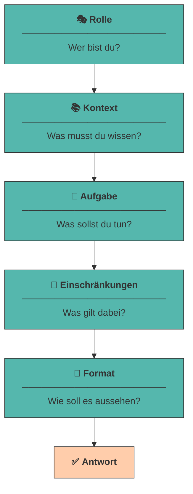

# Anatomie eines guten Prompts

Ein wirkungsvoller Prompt ist kein Zufall, sondern folgt einer **klaren Struktur**. Wer die Bausteine kennt, kann gezielt steuern, was das Modell liefert.

Die meisten Menschen prompten wie beim Googeln: ein paar Stichworte, Enter, Daumen drücken. Bei einer Suchmaschine funktioniert das, weil sie nur *finden* muss. Ein LLM soll aber *erzeugen* - und dafür braucht es dieselbe Art von Briefing, die du auch einem neuen Teammitglied geben würdest.[^zuckarelli]

!!! info "Voraussetzung für dieses Kapitel"

    Ab hier arbeiten wir praktisch. Wenn du es noch nicht getan hast, richte zuerst deine  lokale Umgebung ein:

    👉 **[Setup: Dein eigenes LLM mit Ollama](ollama-setup.md)**

---

## Die fünf Bausteine

Ein vollständiger Prompt besteht aus fünf Elementen.[^schulhoff] Nicht jeder Prompt braucht alle fünf - aber je schwieriger die Aufgabe und je kleiner das Modell, desto mehr davon solltest du liefern.



!!! quote "Merksatz"

    **R-K-A-E-F** - *Rolle, Kontext, Aufgabe, Einschränkungen, Format.*

    Wenn eine Antwort enttäuscht, geh die fünf Buchstaben durch. In neun von zehn Fällen fehlt einer davon.

---

### Rolle

Die Rolle legt fest, aus **welcher Perspektive** das Modell antwortet. Technisch ist das kein Zaubertrick, sondern eine direkte Folge der [Attention](funktionsweise-llms.md#4-attention): Das Wort *„Steuerberaterin"* im Prompt verschiebt sämtliche folgenden Wortvorhersagen in Richtung Fachsprache, Vorsicht und Paragrafen.

<div class="grid cards" markdown>

- :material-close-circle: **Ohne Rolle**

    ---

    *„Bewerte meine Geschäftsidee."*

    → allgemeine, unverbindliche Aufzählung

- :material-check-circle: **Mit Rolle**

    ---

    *„Du bist Risikokapitalgeberin mit 15 Jahren Erfahrung in der Food-Branche. Bewerte meine Geschäftsidee."*

    → konkrete Kennzahlen, kritische Rückfragen, Fokus auf Skalierbarkeit

</div>

???+ tip "Je spezifischer, desto besser"

    „Du bist Experte" bringt fast nichts - das Modell hält sich ohnehin für alles zuständig. Wirksam wird die Rolle erst durch **Spezifikation**: Fachgebiet, Erfahrungsjahre, Haltung, Zielgruppe.

    Weil das so mächtig ist, bekommt es ein eigenes Kapitel: [Rollenbasiertes Prompting](rollen.md).

---

### Kontext

Das Modell kennt **deine** Situation nicht. Es weiß nichts über dein Unternehmen, deine Zielgruppe, deine Vorgeschichte - außer dem, was im Prompt steht. Alles, was du weglässt, **erfindet** das Modell (siehe [Halluzinationen](halluzinationen-kontextfenster.md)).

???+ example "Was gehört in den Kontext?"

    - **Ausgangslage:** *„Wir sind ein Zwei-Personen-Startup mit 15.000 € Startkapital."*
    - **Zielgruppe:** *„Studierende zwischen 20 und 28 in Innsbruck."*
    - **Bisheriges:** *„Eine Umfrage unter 40 Personen ergab: der Preis ist das größte Hindernis."*
    - **Zweck:** *„Der Text ist für einen Pitch vor Business Angels gedacht."*

!!! warning "Die häufigste Ursache für schlechte Antworten"

    Nicht ein „falsch formulierter" Prompt, sondern **fehlender Kontext**. Wenn dich eine Antwort enttäuscht, frage dich zuerst: *Hätte ein Mensch mit genau diesen Informationen es besser gekonnt?* Meistens lautet die Antwort: nein.

---

### Aufgabe

Die Aufgabe ist der Kern: **ein Verb, ein Ergebnis**. Vage Verben erzeugen vage Antworten.

<div style="text-align:center; max-width:700px; margin:16px auto;">
<table role="table"
       style="width:100%; border-collapse:separate; border-spacing:0; border:1px solid #cfd8e3; border-radius:10px; overflow:hidden; font-family:system-ui,sans-serif;">
    <thead>
    <tr style="background:#009485; color:#fff;">
        <th style="text-align:left; padding:12px 14px; font-weight:700;">❌ Vage</th>
        <th style="text-align:left; padding:12px 14px; font-weight:700;">✅ Präzise</th>
    </tr>
    </thead>
    <tbody>
    <tr>
        <td style="background:#00948511; padding:10px 14px;">„Schreib was über X"</td>
        <td style="padding:10px 14px;">„Schreibe eine Produktbeschreibung für X in 80 Wörtern"</td>
    </tr>
    <tr>
        <td style="background:#00948511; padding:10px 14px;">„Analysiere das"</td>
        <td style="padding:10px 14px;">„Nenne die 3 größten Risiken und begründe jedes in einem Satz"</td>
    </tr>
    <tr>
        <td style="background:#00948511; padding:10px 14px;">„Mach es besser"</td>
        <td style="padding:10px 14px;">„Ersetze alle Fachbegriffe durch Alltagssprache"</td>
    </tr>
    </tbody>
</table>
</div>

???+ defi "Eine Aufgabe pro Prompt"

    Kleine Modelle führen **eine** Anweisung zuverlässig aus, zwei manchmal, fünf fast nie. Brauchst du mehrere Dinge, zerlege sie in mehrere Prompts - genau das ist [Prompt Chaining](chaining.md).

---

### Einschränkungen

Einschränkungen grenzen den Lösungsraum ein: Umfang, Stil, Tonalität, Sprache, Tabus.

- **Umfang:** *„Maximal 100 Wörter."* / *„Genau 5 Stichpunkte."*
- **Stil & Ton:** *„Sachlich, ohne Marketing-Superlative."*
- **Sprache:** *„Antworte ausschließlich auf Deutsch."*
- **Tabus:** *„Erfinde keine Zahlen. Fehlt dir eine Angabe, schreibe `[UNBEKANNT]`."*
- **Zielgruppe:** *„Erkläre es so, dass es eine 15-jährige Person versteht."*

!!! tip "Positiv statt negativ formulieren"

    „Schreibe **keine** Einleitung" wirkt schlechter als „**Beginne direkt** mit dem ersten Stichpunkt". Ein LLM sagt das nächste wahrscheinliche Token voraus - erwähnst du „Einleitung", machst du Einleitungs-Tokens *wahrscheinlicher*.

    Denk an den rosa Elefanten, an den du gerade nicht denken sollst. 🐘

---

### Ausgabeformat

Sag dem Modell **exakt**, wie das Ergebnis aussehen soll - am besten, indem du das Format vormachst:

```{.text .ollama title="Ollama Chat"}
Gib das Ergebnis in genau diesem Format aus:

RISIKO 1: <Name>
Wahrscheinlichkeit: <hoch|mittel|niedrig>
Gegenmaßnahme: <ein Satz>
```

Das ist so wirksam, dass [Strukturierte Ausgaben](strukturierte-ausgaben.md) ein eigenes Kapitel bekommen.

---

## Vom schlechten zum guten Prompt

Dieselbe Absicht, zwei Prompts:

=== "❌ Der typische Prompt"

    ```{.text .ollama title="Ollama Chat"}
    Bewerte meine Geschäftsidee: ein Lieferdienst für Bio-Lebensmittel.
    ```

    **Was zurückkommt:** eine allgemeine Liste („Marktforschung ist wichtig", „achten Sie auf die Konkurrenz"), die auf *jede* Geschäftsidee passt. Nutzwert: nahe null.

=== "✅ Der strukturierte Prompt"

    ```{.text .ollama title="Ollama Chat"}
    """
    ... # ROLLE
    ...Du bist Risikokapitalgeberin mit 15 Jahren Erfahrung in der
    ...Lebensmittelbranche.

    ...# KONTEXT
    ...Ein Zwei-Personen-Startup in Innsbruck plant einen Lieferdienst für
    ...regionale Bio-Lebensmittel. Startkapital: 15.000 €. Zielgruppe:
    ...berufstätige Familien. Es gibt bereits zwei überregionale Wettbewerber.

    ...# AUFGABE
    ...Nenne die drei größten Risiken, an denen dieses Geschäftsmodell
    ...scheitern könnte.

    ...# EINSCHRÄNKUNGEN
    ...- Antworte auf Deutsch.
    ...- Maximal 2 Sätze pro Risiko.
    ...- Erfinde keine Marktzahlen. Fehlt dir eine Information,
    ...schreibe [ANNAHME] davor.

    ...# FORMAT
    ...RISIKO <n>: <Titel>
    ...Warum kritisch: <ein Satz>
    ...Gegenmaßnahme: <ein Satz>
    ..."""
    ```

    **Was zurückkommt:** konkrete, auf diesen Fall zugeschnittene Risiken in einem Format, das du direkt in eine Präsentation kopieren kannst.

???+ tip "Überschriften als Struktur-Anker"

    Die `#`-Überschriften sind kein Selbstzweck. Sie trennen die Abschnitte für das Modell sauber voneinander - besonders hilfreich bei kleinen Modellen, die sonst Kontext und Aufgabe vermischen. `#`, `---` oder XML-Tags wie `<kontext>…</kontext>` funktionieren alle gut. Wichtig ist nur: **konsistent bleiben**. Solche wiederverwendbaren Strukturen werden in der Literatur als *Prompt Patterns* beschrieben - Entwurfsmuster für Prompts.[^white]

---

## 🔬 Ollama-Lab

Alles ab hier drehst du an **deiner eigenen Geschäftsidee**. Die Beispiele oben im Kapitel zeigen das Verfahren - hier wendest du es an. Terminal auf, `ollama run gemma3:1b`, los.

!!! lab "Übung 1: Deine Geschäftsidee festlegen 💡"

    Wähle eine Geschäftsidee, die dich durch den **gesamten Kurs** begleitet. Nimm etwas, zu dem du selbst eine Meinung hast - dann fällt dir auf, wenn die KI Unsinn erzählt.

    Halte sie in **drei bis fünf Sätzen** in einer Datei `idee.md` fest:

    - Was wird angeboten - und für wen?
    - Welches Problem löst es?
    - Ausgangslage: Ort, Teamgröße, Startkapital?

    Diese Angaben sind ab jetzt dein **Kontext-Baustein** in jedem Prompt.

!!! lab "Übung 2: Die fünf Bausteine einzeln zuschalten"

    Formuliere zu deiner Idee die Aufgabe *„Nenne die drei größten Risiken."* - und baue den Prompt dann Stufe für Stufe aus. `/clear` zwischen den Stufen nicht vergessen.

    | Stufe | Was du ergänzt |
    |---|---|
    | 1 | nur die Aufgabe |
    | 2 | + Rolle |
    | 3 | + Kontext aus deiner `idee.md` |
    | 4 | + Einschränkungen (Länge, Sprache, keine erfundenen Zahlen) |
    | 5 | + Ausgabeformat |

    **Bewerte jede Stufe** mit 0-5 Punkten in *Konkretheit*, *Nutzbarkeit* und *Formattreue*.

    **Die eigentliche Frage:** Zwischen welchen beiden Stufen liegt bei *deiner* Idee der größte Sprung? Bei den meisten ist es 2 → 3. Bei dir auch?

!!! lab "Übung 3: Der rosa Elefant 🐘"

    Formuliere eine Einschränkung für deine Idee **zweimal**:

    - negativ - *„Schreibe KEINE Einleitung."*
    - positiv - *„Beginne direkt mit dem ersten Fakt."*

    Führe beide **je dreimal** aus, mit `/clear` dazwischen. 

!!! lab "Übung 4: Härtetest und Prompt sichern"

    1. **Härtetest:** Lass deinen besten Prompt aus Übung 2 auf `gemma3:270m` laufen - dem viermal kleineren Modell. Bleibt das Ergebnis brauchbar? Wenn nicht: Welcher Baustein müsste deutlicher werden?
    2. **Sichern:** Notiere den finalen Prompt in `prompts.md` unter `## 01 Beschreibung`.

    Das ist der erste Eintrag deiner eigenen Prompt-Sammlung - sie wächst ab jetzt in jedem Kapitel.

??? code "🐍 Optional (Python): alle fünf Stufen automatisch durchlaufen"

    Statt fünfmal von Hand zu tippen, erledigt das ein Skript. Benötigt `llm.py` aus dem [Setup](ollama-setup.md).

    ```python title="bausteine.py"
    from llm import frage

    aufgabe = "Nenne die drei größten Risiken für einen Bio-Lieferdienst."
    rolle   = ("Du bist Risikokapitalgeberin mit 15 Jahren Erfahrung "
               "in der Lebensmittelbranche.")
    kontext = ("Ein Zwei-Personen-Startup in Innsbruck, 15.000 € Startkapital, "
               "Zielgruppe berufstätige Familien, zwei große Wettbewerber.")
    limits  = "Antworte auf Deutsch. Maximal 2 Sätze pro Risiko. Erfinde keine Zahlen."
    format_ = "Format je Risiko:\nRISIKO <n>: <Titel>\nGegenmaßnahme: <ein Satz>"

    stufen = {
        "1 - nur Aufgabe":       aufgabe,
        "2 - + Rolle":           f"{rolle}\n\n{aufgabe}",
        "3 - + Kontext":         f"{rolle}\n\n{kontext}\n\n{aufgabe}",
        "4 - + Einschränkungen": f"{rolle}\n\n{kontext}\n\n{aufgabe}\n\n{limits}",
        "5 - + Format":          f"{rolle}\n\n{kontext}\n\n{aufgabe}\n\n{limits}\n\n{format_}",
    }

    for name, prompt in stufen.items():
        print(f"\n{'=' * 60}\n{name}\n{'=' * 60}")
        print(frage(prompt))
    ```

    ```title="Ausgabe (gekürzt)"
    ============================================================
    1 - nur Aufgabe
    ============================================================
    Bio-Lieferdienste stehen vor mehreren Herausforderungen. Erstens ist
    die Logistik anspruchsvoll ...

    ============================================================
    5 - + Format
    ============================================================
    RISIKO 1: Kühlkette
    Gegenmaßnahme: Zu Beginn nur ungekühlte Trockenware anbieten.
    ...
    ```

    Tausche die vier Textbausteine oben gegen deine eigene Idee aus - dann vergleichst du alle fünf Stufen mit einer einzigen Ausführung.

---

## Quellen

Zur Ausarbeitung wurden generative Tools unterstützend eingesetzt.

[^schulhoff]: **Schulhoff, S., Ilie, M., Balepur, N. et al. (2024):** *The Prompt Report: A Systematic Survey of Prompt Engineering Techniques.* arXiv:2406.06608. [https://arxiv.org/abs/2406.06608](https://arxiv.org/abs/2406.06608) - die derzeit umfassendste Systematik: 58 Prompting-Techniken und ein einheitliches Vokabular. Die hier verwendeten Bausteine finden sich dort als *Role*, *Additional Information*, *Directive*, *Style Instructions* und *Output Formatting*.
[^white]: **White, J., Fu, Q., Hays, S. et al. (2023):** *A Prompt Pattern Catalog to Enhance Prompt Engineering with ChatGPT.* arXiv:2302.11382. [https://arxiv.org/abs/2302.11382](https://arxiv.org/abs/2302.11382) - überträgt den Gedanken der Software-Entwurfsmuster auf Prompts: wiederverwendbare Strukturen statt Einzelfalllösungen.
[^zuckarelli]: **Zuckarelli, J. L. (2025):** *Programmieren mit ChatGPT: Eine kompakte Einführung.* Springer, ISBN 978-3-662-69432-9. [https://doi.org/10.1007/978-3-662-69433-6](https://doi.org/10.1007/978-3-662-69433-6)
