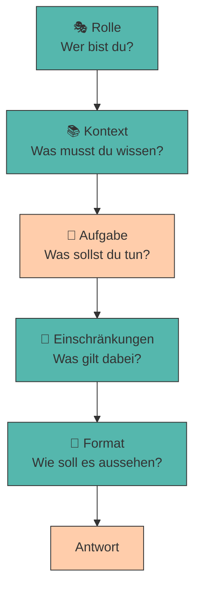

# 2. Anatomie eines guten Prompts

Ein wirkungsvoller Prompt ist kein Zufall, sondern folgt einer **klaren Struktur**. Wer die Bausteine kennt, kann gezielt steuern, was das Modell liefert.

Die meisten Menschen prompten wie beim Googeln: ein paar Stichworte, Enter, Daumen drücken. Bei einer Suchmaschine funktioniert das, weil sie nur *finden* muss. Ein LLM soll aber *erzeugen* – und dafür braucht es dieselbe Art von Briefing, die du auch einem neuen Teammitglied geben würdest.

!!! info "Voraussetzung für dieses Kapitel"

    Ab hier arbeiten wir praktisch. Wenn du es noch nicht getan hast, richte zuerst deinen lokalen Playground ein:

    👉 **[Setup: Dein eigenes LLM mit Ollama](ollama-setup.md)**

---

## Die fünf Bausteine

Ein vollständiger Prompt besteht aus fünf Elementen. Nicht jeder Prompt braucht alle fünf – aber je schwieriger die Aufgabe und je kleiner das Modell, desto mehr davon solltest du liefern.



!!! quote "Merksatz"

    **R-K-A-E-F** – *Rolle, Kontext, Aufgabe, Einschränkungen, Format.*

    Wenn eine Antwort enttäuscht, geh die fünf Buchstaben durch. In neun von zehn Fällen fehlt einer davon.

---

### 🎭 Rolle

Die Rolle legt fest, aus **welcher Perspektive** das Modell antwortet. Technisch ist das kein Zaubertrick, sondern eine direkte Folge der [Attention](funktionsweise-llms.md#station-4-attention-bedeutung-im-kontext): Das Wort *„Steuerberaterin"* im Prompt verschiebt sämtliche folgenden Wortvorhersagen in Richtung Fachsprache, Vorsicht und Paragrafen.

<div class="grid cards" markdown>

- :material-close-circle: **Ohne Rolle**

    ---

    *„Bewerte meine Geschäftsidee."*

    → allgemeine, unverbindliche Aufzählung

- :material-check-circle: **Mit Rolle**

    ---

    *„Du bist Risikokapitalgeberin mit 15 Jahren Erfahrung in der Food-Branche. Bewerte meine Geschäftsidee."*

    → konkrete Kennzahlen, kritische Rückfragen, Fokus auf Skalierbarkeit

</div>

???+ tip "Je spezifischer, desto besser"

    „Du bist Experte" bringt fast nichts – das Modell hält sich ohnehin für alles zuständig. Wirksam wird die Rolle erst durch **Spezifikation**: Fachgebiet, Erfahrungsjahre, Haltung, Zielgruppe.

    Weil das so mächtig ist, bekommt es ein eigenes Kapitel: [Rollenbasiertes Prompting](rollen.md).

---

### 📚 Kontext

Das Modell kennt **deine** Situation nicht. Es weiß nichts über dein Unternehmen, deine Zielgruppe, deine Vorgeschichte – außer dem, was im Prompt steht. Alles, was du weglässt, **erfindet** das Modell (siehe [Halluzinationen](halluzinationen-kontextfenster.md)).

???+ example "Was gehört in den Kontext?"

    - **Ausgangslage:** *„Wir sind ein Zwei-Personen-Startup mit 15.000 € Startkapital."*
    - **Zielgruppe:** *„Studierende zwischen 20 und 28 in Innsbruck."*
    - **Bisheriges:** *„Eine Umfrage unter 40 Personen ergab: der Preis ist das größte Hindernis."*
    - **Zweck:** *„Der Text ist für einen Pitch vor Business Angels gedacht."*

!!! warning "Die häufigste Ursache für schlechte Antworten"

    Nicht ein „falsch formulierter" Prompt, sondern **fehlender Kontext**. Wenn dich eine Antwort enttäuscht, frage dich zuerst: *Hätte ein Mensch mit genau diesen Informationen es besser gekonnt?* Meistens lautet die Antwort: nein.

---

### 🎯 Aufgabe

Die Aufgabe ist der Kern: **ein Verb, ein Ergebnis**. Vage Verben erzeugen vage Antworten.

<div style="text-align:center; max-width:700px; margin:16px auto;">
<table role="table"
       style="width:100%; border-collapse:separate; border-spacing:0; border:1px solid #cfd8e3; border-radius:10px; overflow:hidden; font-family:system-ui,sans-serif;">
    <thead>
    <tr style="background:#009485; color:#fff;">
        <th style="text-align:left; padding:12px 14px; font-weight:700;">❌ Vage</th>
        <th style="text-align:left; padding:12px 14px; font-weight:700;">✅ Präzise</th>
    </tr>
    </thead>
    <tbody>
    <tr>
        <td style="background:#00948511; padding:10px 14px;">„Schreib was über X"</td>
        <td style="padding:10px 14px;">„Schreibe eine Produktbeschreibung für X in 80 Wörtern"</td>
    </tr>
    <tr>
        <td style="background:#00948511; padding:10px 14px;">„Analysiere das"</td>
        <td style="padding:10px 14px;">„Nenne die 3 größten Risiken und begründe jedes in einem Satz"</td>
    </tr>
    <tr>
        <td style="background:#00948511; padding:10px 14px;">„Mach es besser"</td>
        <td style="padding:10px 14px;">„Ersetze alle Fachbegriffe durch Alltagssprache"</td>
    </tr>
    </tbody>
</table>
</div>

???+ defi "Eine Aufgabe pro Prompt"

    Kleine Modelle führen **eine** Anweisung zuverlässig aus, zwei manchmal, fünf fast nie. Brauchst du mehrere Dinge, zerlege sie in mehrere Prompts – genau das ist [Prompt Chaining](chaining.md).

---

### 🚧 Einschränkungen

Einschränkungen grenzen den Lösungsraum ein: Umfang, Stil, Tonalität, Sprache, Tabus.

- **Umfang:** *„Maximal 100 Wörter."* / *„Genau 5 Stichpunkte."*
- **Stil & Ton:** *„Sachlich, ohne Marketing-Superlative."*
- **Sprache:** *„Antworte ausschließlich auf Deutsch."*
- **Tabus:** *„Erfinde keine Zahlen. Fehlt dir eine Angabe, schreibe `[UNBEKANNT]`."*
- **Zielgruppe:** *„Erkläre es so, dass es eine 15-jährige Person versteht."*

!!! tip "Positiv statt negativ formulieren"

    „Schreibe **keine** Einleitung" wirkt schlechter als „**Beginne direkt** mit dem ersten Stichpunkt". Ein LLM sagt das nächste wahrscheinliche Token voraus – erwähnst du „Einleitung", machst du Einleitungs-Tokens *wahrscheinlicher*.

    👉 Denk an den rosa Elefanten, an den du gerade nicht denken sollst. 🐘

---

### 📄 Ausgabeformat

Sag dem Modell **exakt**, wie das Ergebnis aussehen soll – am besten, indem du das Format vormachst:

```title="Format-Vorgabe im Prompt"
Gib das Ergebnis in genau diesem Format aus:

RISIKO 1: <Name>
Wahrscheinlichkeit: <hoch|mittel|niedrig>
Gegenmaßnahme: <ein Satz>
```

Das ist so wirksam, dass [Strukturierte Ausgaben](strukturierte-ausgaben.md) ein eigenes Kapitel bekommen.

---

## Vom schlechten zum guten Prompt

Dieselbe Absicht, zwei Prompts:

=== "❌ Der typische Prompt"

    ```title="prompt_schlecht.txt"
    Bewerte meine Geschäftsidee: ein Lieferdienst für Bio-Lebensmittel.
    ```

    **Was zurückkommt:** eine allgemeine Liste („Marktforschung ist wichtig", „achten Sie auf die Konkurrenz"), die auf *jede* Geschäftsidee passt. Nutzwert: nahe null.

=== "✅ Der strukturierte Prompt"

    ```title="prompt_gut.txt"
    # ROLLE
    Du bist Risikokapitalgeberin mit 15 Jahren Erfahrung in der
    Lebensmittelbranche.

    # KONTEXT
    Ein Zwei-Personen-Startup in Innsbruck plant einen Lieferdienst für
    regionale Bio-Lebensmittel. Startkapital: 15.000 €. Zielgruppe:
    berufstätige Familien. Es gibt bereits zwei überregionale Wettbewerber.

    # AUFGABE
    Nenne die drei größten Risiken, an denen dieses Geschäftsmodell
    scheitern könnte.

    # EINSCHRÄNKUNGEN
    - Antworte auf Deutsch.
    - Maximal 2 Sätze pro Risiko.
    - Erfinde keine Marktzahlen. Fehlt dir eine Information,
      schreibe [ANNAHME] davor.

    # FORMAT
    RISIKO <n>: <Titel>
    Warum kritisch: <ein Satz>
    Gegenmaßnahme: <ein Satz>
    ```

    **Was zurückkommt:** konkrete, auf diesen Fall zugeschnittene Risiken in einem Format, das du direkt in eine Präsentation kopieren kannst.

???+ tip "Überschriften als Struktur-Anker"

    Die `#`-Überschriften sind kein Selbstzweck. Sie trennen die Abschnitte für das Modell sauber voneinander – besonders hilfreich bei kleinen Modellen, die sonst Kontext und Aufgabe vermischen. `#`, `---` oder XML-Tags wie `<kontext>…</kontext>` funktionieren alle gut. Wichtig ist nur: **konsistent bleiben**.

---

## 🔬 Ollama-Labor

Zeit, den Unterschied selbst zu messen. Alle Übungen mit dem Kursmodell `qwen2.5:0.5b` und dem Helfer `llm.py` aus dem [Setup](ollama-setup.md#schritt-5-dein-werkzeugkasten).

!!! example "Übung 1: Die Bausteine einzeln zuschalten"

    Baue den Prompt schrittweise auf und beobachte, wo der größte Sprung passiert.

    ```python title="bausteine.py"
    from llm import frage

    aufgabe = "Nenne die drei größten Risiken für einen Bio-Lieferdienst."
    rolle   = ("Du bist Risikokapitalgeberin mit 15 Jahren Erfahrung "
               "in der Lebensmittelbranche.")
    kontext = ("Ein Zwei-Personen-Startup in Innsbruck, 15.000 € Startkapital, "
               "Zielgruppe berufstätige Familien, zwei große Wettbewerber.")
    limits  = "Antworte auf Deutsch. Maximal 2 Sätze pro Risiko. Erfinde keine Zahlen."
    format_ = "Format je Risiko:\nRISIKO <n>: <Titel>\nGegenmaßnahme: <ein Satz>"

    stufen = {
        "1 – nur Aufgabe":       aufgabe,
        "2 – + Rolle":           f"{rolle}\n\n{aufgabe}",
        "3 – + Kontext":         f"{rolle}\n\n{kontext}\n\n{aufgabe}",
        "4 – + Einschränkungen": f"{rolle}\n\n{kontext}\n\n{aufgabe}\n\n{limits}",
        "5 – + Format":          f"{rolle}\n\n{kontext}\n\n{aufgabe}\n\n{limits}\n\n{format_}",
    }

    for name, prompt in stufen.items():
        print(f"\n{'=' * 60}\n{name}\n{'=' * 60}")
        print(frage(prompt))
    ```

    **Deine Aufgabe:** Bewerte jede Stufe mit 0–5 Punkten in den Kategorien *Konkretheit*, *Nutzbarkeit* und *Formattreue*. Zwischen welchen beiden Stufen liegt der größte Sprung?

!!! example "Übung 2: Der rosa Elefant 🐘"

    Prüfe die Regel „positiv statt negativ" empirisch nach:

    ```python title="elefant.py"
    from llm import frage

    negativ = ("Beschreibe ein veganes Café in Innsbruck. "
               "Schreibe KEINE Einleitung und verwende KEINE Superlative.")
    positiv = ("Beschreibe ein veganes Café in Innsbruck. "
               "Beginne direkt mit dem ersten Fakt. Verwende ausschließlich "
               "sachliche Adjektive.")

    for name, p in [("NEGATIV", negativ), ("POSITIV", positiv)]:
        for durchlauf in range(3):
            print(f"\n--- {name}, Durchlauf {durchlauf + 1} ---")
            print(frage(p, seed=durchlauf))
    ```

    In wie vielen der drei Durchläufe hält sich das Modell jeweils an die Vorgabe?

??? question "Übung 3: Prompt-Doktor 🩺 (Python)"

    Schreibe eine Funktion, die einen Prompt auf die fünf Bausteine prüft. Ergänze die beiden `TODO`s.

    ```python title="prompt_doktor.py"
    SIGNALE = {
        "Rolle":           ["du bist", "agiere als", "in der rolle"],
        "Kontext":         ["kontext", "hintergrund", "unser", "zielgruppe"],
        "Einschränkungen": ["maximal", "genau", "höchstens", "wörter", "sätze"],
        "Format":          ["format", "tabelle", "json", "stichpunkte", "liste"],
    }

    def pruefe(prompt):
        text = prompt.lower()
        fehlend = [name for name, woerter in SIGNALE.items()
                   if not any(w in text for w in woerter)]
        # TODO 1: Warnung ausgeben, wenn der Prompt < 15 Wörter hat
        # TODO 2: Ergebnis lesbar formatiert ausgeben
        return fehlend

    print(pruefe("Schreib was über mein Café"))
    print(pruefe("Du bist Marketing-Expertin. Schreibe maximal 50 Wörter als Liste."))
    ```

    ??? success "Lösungsvorschlag"

        ```python title="prompt_doktor.py"
        def pruefe(prompt):
            text = prompt.lower()
            fehlend = [name for name, woerter in SIGNALE.items()
                       if not any(w in text for w in woerter)]

            print(f"\nPrompt: {prompt[:60]}...")
            print(f"Länge:  {len(prompt.split())} Wörter")

            if len(prompt.split()) < 15:
                print("⚠️  Sehr kurz – vermutlich fehlt Kontext.")

            if fehlend:
                print(f"❌ Fehlende Bausteine: {', '.join(fehlend)}")
            else:
                print("✅ Alle Bausteine erkannt.")

            return fehlend
        ```

        **Wichtig:** Das ist eine reine Stichwortsuche, keine echte Bewertung. Ein Prompt kann alle Signalwörter enthalten und trotzdem schlecht sein – und umgekehrt. Nutze das Skript als Checkliste, nicht als Urteil.

---

???+ question "Selbsttest"

    1. Nenne die fünf Bausteine eines vollständigen Prompts.
    2. Warum funktioniert „Schreibe keine Einleitung" schlechter als „Beginne direkt mit dem ersten Fakt"?
    3. Ein Kollege beschwert sich, die KI liefere nur Allgemeinplätze. Welcher Baustein fehlt vermutlich?

    ??? success "Lösungsskizze"

        1. Rolle, Kontext, Aufgabe, Einschränkungen, Format.
        2. Weil das Modell das **wahrscheinlichste nächste Token** vorhersagt. Das Wort „Einleitung" im Prompt macht Einleitungs-Tokens wahrscheinlicher – die Verneinung wiegt für die Wahrscheinlichkeitsrechnung weniger als das erwähnte Konzept selbst.
        3. Der **Kontext**. Ohne konkrete Angaben zu Situation, Zielgruppe und Zweck kann das Modell nur produzieren, was auf alles passt – und damit auf nichts richtig.

---

!!! example "Lab"

    **Business-Idee durch unterschiedlich formulierte Prompts beschreiben**

    Beschreibe deine Geschäftsidee mit mehreren, unterschiedlich aufgebauten Prompts. Variiere bewusst Rolle, Kontext und Ausgabeformat und vergleiche, wie sich die Ergebnisse verändern.

    **Konkrete Schritte:**

    1. Formuliere einen **Minimal-Prompt** (nur die Aufgabe) und lass ihn auf `qwen2.5:0.5b` laufen.
    2. Baue daraus einen **vollständigen RKAEF-Prompt** für deine Idee.
    3. Lass deinen guten Prompt zusätzlich auf `gemma3:270m` laufen. Bleibt das Ergebnis auch dort brauchbar?
    4. Speichere den finalen Prompt als `prompts/01_beschreibung.md` – er ist der erste Eintrag deiner späteren [Prompt Library](libraries.md).

---

## Quellen

!!! info "Literatur"

    - **Zuckarelli, J. (2025):** *Programmieren mit ChatGPT*. Springer Nature. [https://doi.org/10.1007/978-3-662-69433-6](https://doi.org/10.1007/978-3-662-69433-6)
    - **Anthropic (2025):** *Prompt engineering overview.* [https://docs.anthropic.com/en/docs/build-with-claude/prompt-engineering/overview](https://docs.anthropic.com/en/docs/build-with-claude/prompt-engineering/overview)
    - **OpenAI (2025):** *Prompt engineering guide.* [https://platform.openai.com/docs/guides/prompt-engineering](https://platform.openai.com/docs/guides/prompt-engineering)

    Zur Ausarbeitung wurden generative Tools unterstützend eingesetzt.
