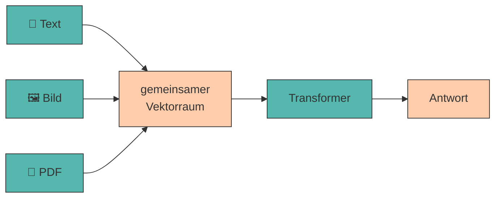

# Ausblick

Du hast jetzt das Handwerkszeug: Du weißt, wie ein Modell funktioniert, wie ein guter Prompt gebaut ist, und du hast jede Technik an deiner eigenen Idee ausprobiert.

Bleibt der Blick nach vorn. Drei Dinge begegnen dir ab jetzt draußen: Modelle, die **mehr als Text** verarbeiten. Verzerrungen, die **systematisch** in den Antworten stecken. Und ein **Vokabular**, das gerade in jeder Produktankündigung auftaucht - Tools, Agenten, Skills, MCP.

---

## Multimodales Prompting

### Was „multimodal" bedeutet

???+ defi "Modalität"

    Eine **Modalität** ist eine Art von Eingabe oder Ausgabe: Text, Bild, Audio, Video. Ein **multimodales Modell** kann mehrere davon gleichzeitig verarbeiten.

    Technisch ändert sich weniger, als man denkt: Ein Bild wird in **Bild-Tokens** zerlegt und wie Text-Tokens in denselben Vektorraum eingebettet. Ab da läuft alles wie in [Schritt 2](funktionsweise-llms.md#2-word-embeddings) beschrieben - das Modell „sieht" nicht, es rechnet.[^clip]



!!! warning "Ein Bild kostet viele Tokens"

    Ein einzelnes Bild verbraucht je nach Auflösung schnell **1.000 bis 2.000 Tokens** - so viel wie zwei Seiten Text. Bei kleinen Modellen ist das [Kontextfenster](halluzinationen-kontextfenster.md) damit sofort halb voll.

    Ein Bild pro Prompt. Und lieber ein Ausschnitt als ein Screenshot der ganzen Seite.

!!! danger "Unser Kursmodell sieht nichts"

    `gemma3:1b` verarbeitet **ausschließlich Text**. Bei Gemma 3 ist die Bildverarbeitung erst ab der 4B-Variante eingebaut - die 1B-Version wurde als reines Sprachmodell trainiert. Was ein Modell kann, verrät `ollama show` unter **Capabilities**:

    ```title="Terminal"
    ollama show gemma3:1b
    ```

    Dort steht nur `completion`. Bei `gemma3:4b` steht zusätzlich `vision`.

    Achtung: das Modell weist das Bild nicht zurück, auch wenn es keine Bilder lesen kann. Es ignoriert den Dateipfad stillschweigend und erfindet eine Beschreibung.

Die folgenden Beispiele zeigen, wie multimodale Prompts aussehen. Ausprobieren kannst du sie im Labor unten - mit einem Modell, das Bilder tatsächlich annimmt.

---

### Die Modalitäten in der Praxis

=== ":material-image: Bilder"

    **Typische Aufgaben:** Produktfotos beschreiben, Logos bewerten, Screenshots analysieren, Handschrift transkribieren. Möglich wurde das durch Modelle, die Bild- und Textverarbeitung verschränken.[^flamingo]

    ```{.text .ollama title="Ollama Chat"}
    Beschreibe dieses Produktfoto für einen Online-Shop.
    ...Nenne: (1) das Produkt, (2) drei sichtbare Eigenschaften,
    ...(3) die vermutliche Zielgruppe.
    ...Beschreibe nur, was tatsächlich zu sehen ist.
    ```

    Der letzte Satz ist entscheidend - ohne ihn ergänzt das Modell gern Details, die gar nicht im Bild sind.

=== ":material-file-pdf-box: PDFs"

    **Typische Aufgaben:** Berichte zusammenfassen, Verträge nach Klauseln durchsuchen, Studien auswerten.

    ```{.text .ollama title="Ollama Chat"}
    Fasse dieses PDF zusammen. Struktur:
    ...- Kernaussage (1 Satz)
    ...- 3 wichtigste Zahlen mit Seitenangabe
    ...- 2 offene Fragen
    ...
    ...Zitiere für jede Zahl die Seite. Findest du eine Angabe nicht,
    ...schreibe [NICHT IM DOKUMENT].
    ```

    **Achtung:** Manche Werkzeuge extrahieren nur den Text, andere „sehen" die Seite als Bild. Bei Tabellen und Diagrammen macht das einen großen Unterschied.

=== ":material-chart-box-outline: Diagramme"

    **Typische Aufgaben:** Trends aus Charts ablesen, Zahlen aus Grafiken extrahieren.

    ```{.text .ollama title="Ollama Chat"}
    Lies die Werte aus diesem Balkendiagramm ab.
    ...Gib sie als Tabelle aus: Kategorie | Wert | abgelesen/geschätzt.
    ...Markiere jeden Wert, den du nicht eindeutig ablesen kannst,
    ...als "geschätzt".
    ```

    !!! danger "Zahlen aus Diagrammen sind unzuverlässig"

        Das Ablesen exakter Werte gehört zu den fehleranfälligsten Aufgaben überhaupt. Nutze es für **Trends** („steigt seit 2021"), nicht für **Zahlen** in einer Präsentation.

=== ":material-presentation: Präsentationen"

    **Typische Aufgaben:** Pitchdecks analysieren, Foliensätze zusammenfassen, Argumentationslinien prüfen.

    ```{.text .ollama title="Ollama Chat"}
    Du bist Investorin und siehst dieses Pitchdeck zum ersten Mal.
    ...
    ...1. Welche Kernaussage nimmst du mit?
    ...2. Welche Information fehlt dir, um zu entscheiden?
    ...3. Welche Folie würdest du streichen?
    ```

    Kombiniert Multimodalität mit [rollenbasiertem Prompting](rollen.md) - besonders wirkungsvoll.

---

---

## Bias

Ein Sprachmodell hat keine Meinung - aber es hat eine **Statistik**. Und die stammt aus Texten, die Menschen geschrieben haben: überwiegend englischsprachig, überwiegend aus dem Internet, überwiegend aus einem Umfeld, in dem Wachstum gut und Risikokapital normal ist. Was in diesen Daten häufig vorkommt, hält das Modell für wahrscheinlich - und was es für wahrscheinlich hält, schreibt es dir als Antwort hin.

Das Tückische daran: Anders als eine [Halluzination](halluzinationen-kontextfenster.md) ist Bias **nicht falsch**. Der Rat, in Suchmaschinenwerbung zu investieren, ist nicht verkehrt - er passt nur zu einem Unternehmen, das du vielleicht gar nicht führen willst. Ein Faktencheck findet solche Verzerrungen deshalb nicht; sie fallen erst auf, wenn man gezielt danach sucht.

Du bist ihnen im Kurs schon zweimal begegnet: bei der [Investorenrolle](rollen.md), die Wachstum selbstverständlich als Ziel behandelt, und bei der [Sycophancy](kritisches.md), die dir zustimmt, weil Zustimmung im Training besser bewertet wurde. Hier kommt das Muster dahinter.

???+ defi "Bias"

    Eine systematische Verzerrung in den Ausgaben, die auf Ungleichgewichte in den Trainingsdaten zurückgeht.[^bender]

    Typische Formen im Geschäftskontext:

    <div style="text-align:center; max-width:760px; margin:16px auto;">
    <table role="table"
            style="width:100%; border-collapse:separate; border-spacing:0; border:1px solid #cfd8e3; border-radius:10px; overflow:hidden; font-family:system-ui,sans-serif;">
        <thead>
        <tr style="background:#009485; color:#fff;">
            <th style="text-align:left; padding:12px 14px; font-weight:700;">Form</th>
            <th style="text-align:left; padding:12px 14px; font-weight:700;">Beispiel</th>
        </tr>
        </thead>
        <tbody>
        <tr>
            <td style="background:#00948511; padding:10px 14px; font-weight:600;">Kulturell</td>
            <td style="padding:10px 14px;">US-amerikanische Geschäftsmodelle und Rechtslagen als Standard</td>
        </tr>
        <tr>
            <td style="background:#00948511; padding:10px 14px; font-weight:600;">Sprachlich</td>
            <td style="padding:10px 14px;">englische Quellen dominieren, deutschsprachige Besonderheiten fehlen</td>
        </tr>
        <tr>
            <td style="background:#00948511; padding:10px 14px; font-weight:600;">Größen-Bias</td>
            <td style="padding:10px 14px;">Ratschläge passen zu Startups mit Wagniskapital, nicht zu Zwei-Personen-Betrieben</td>
        </tr>
        <tr>
            <td style="background:#00948511; padding:10px 14px; font-weight:600;">Optimismus</td>
            <td style="padding:10px 14px;">Wachstumsszenarien werden häufiger genannt als Sättigung oder Rückgang</td>
        </tr>
        </tbody>
    </table>
    </div>

!!! example "Bias sichtbar machen"

    Frag dieselbe Sache zweimal - einmal neutral, einmal mit explizitem Gegen-Rahmen:

    - *„Welche Vertriebskanäle empfiehlst du?"*
    - *„Welche Vertriebskanäle empfiehlst du, wenn wir kein Werbebudget haben und nicht wachsen wollen?"*

    Wenn die zweite Antwort völlig andere Kanäle nennt, war die erste vom Wachstums-Bias geprägt.

---

## Begrifflichkeiten: Tool, Agent, Skill, MCP, Plugin

Rund um Sprachmodelle hat sich in kurzer Zeit ein Vokabular gebildet, das in Produktankündigungen munter durcheinandergeht. Die fünf Begriffe unten hörst du ab jetzt ständig - sie beschreiben aber **verschiedene Dinge**, und der Unterschied ist leicht zu merken, wenn man ihn einmal sauber gesehen hat.

### Tools

Ein **Tool** (auch *Function Calling* oder *Werkzeug*) ist eine einzelne Funktion, die du dem Modell zur Verfügung stellst: mit Namen, Beschreibung und Parametern - etwa `wetter(ort)` oder `rechnung_suchen(kundennummer)`.

Wichtig ist, was dabei **nicht** passiert: Das Modell führt nichts aus. Es gibt statt Text einen **strukturierten Aufruf** zurück (*„ruf `wetter` mit `ort='Innsbruck'` auf"*), deine Anwendung führt ihn aus und reicht das Ergebnis zurück in den Chat. Das Modell entscheidet also *ob* und *womit* - gerechnet, gesucht und geschrieben wird außerhalb.

Genau deshalb löst ein Tool die [Rechenschwäche](staerken-grenzen.md) auf: Nicht das Modell rechnet, sondern ein Taschenrechner, den es aufrufen darf.

### Agents

<div style="text-align: center;">
    
    <figcaption>Quelle: <a href="https://imgflip.com/i/az61ja">imgflip</a></figcaption>
</div>

Wenn ein Modell nicht nur *antwortet*, sondern in einer Schleife **Werkzeuge benutzt** - eine Website aufrufen, ein PDF öffnen, Code ausführen, eine Datei schreiben - spricht man von einem **Agenten**.

???+ defi "Agent"

    Ein System, das ein LLM in einer Schleife betreibt: *Ziel verstehen → Werkzeug wählen → ausführen → Ergebnis bewerten → nächster Schritt*, bis das Ziel erreicht ist.

    Der Unterschied zu [Prompt Chaining](chaining.md): Bei einer Kette legst **du** die Schritte vorher fest. Ein Agent entscheidet **selbst**, welcher Schritt als Nächstes kommt.

Ein Agent ist also kein anderes Modell, sondern dasselbe Modell in einer anderen **Umgebung**: Werkzeuge plus Schleife plus ein Ziel. Auf [ollama.com](https://ollama.com/search?c=tools) erkennst du an der Fähigkeit `tools`, welche Modelle dafür überhaupt trainiert sind.

### Skills

Ein **Skill** ist keine Funktion, sondern eine **paketierte Arbeitsanleitung**: Anweisungen, Beispiele und manchmal Hilfsdateien, die das Modell bei Bedarf in seinen Kontext lädt - etwa *„So schreiben wir Angebote"* oder *„So sieht unsere Rechnungsvorlage aus"*.

Der Unterschied zum Tool in einem Satz: Ein Tool gibt dem Modell eine **Fähigkeit**, ein Skill gibt ihm **Vorgehenswissen**. Und weil ein Skill nur bei Bedarf geladen wird, belastet er das [Kontextfenster](halluzinationen-kontextfenster.md) nicht dauerhaft.

Für dich als Prompt-Schreiberin ist das die interessanteste Kategorie: Ein guter Skill ist im Kern nichts anderes als ein **sehr gut gebauter Prompt**, den man einmal schreibt und immer wieder verwendet. Deine `lab_log.md` ist die Vorstufe davon.

### MCP

Bis vor Kurzem musste jede Anwendung ihre Anbindung an die Außenwelt selbst erfinden - wer seinen Dienst anschließen wollte, baute ihn für jede Plattform neu. Genau dieses Problem löst das **Model Context Protocol (MCP)**, ein 2024 von Anthropic veröffentlichter **offener Standard** dafür, wie Anwendungen Werkzeuge und Datenquellen an Sprachmodelle anbinden.

Die Analogie, die sich eingebürgert hat: **MCP ist der USB-C-Anschluss für KI-Anwendungen.** Du schreibst einmal einen MCP-Server für deine Datenbank, dein Ticketsystem, dein Dateiablage - und *jede* MCP-fähige Anwendung kann ihn benutzen. Nicht mehr „eine Anbindung pro Plattform", sondern „ein Server für alle".

!!! info "Warum dich das betrifft, auch wenn du nichts programmierst"

    MCP ist der Grund, warum Chat-Anwendungen inzwischen auf deine Dateien, dein Kalender oder eure Firmendatenbank zugreifen können. Für dich heißt das zweierlei:

    - Die **Kontext-Frage** aus [Anatomie eines guten Prompts](anatomie.md) beantwortet sich künftig oft von selbst - das Modell holt sich den Kontext über ein Werkzeug, statt dass du ihn hineinkopierst.
    - Die **Verifikationspflicht** bleibt trotzdem bestehen. Ein Modell mit Datenbankzugriff halluziniert nicht weniger; es klingt nur noch überzeugender, weil manche Angaben jetzt tatsächlich stimmen.

### Plugins

Ein **Plugin** ist ein **fertiges, installierbares Paket** von Fähigkeiten aus einer externen Quelle - in aller Regel genau so ein MCP-Server, gebrauchsfertig verpackt. Du schreibst es nicht, du **installierst** es.

Und es bringt selten ein einzelnes Werkzeug mit, sondern gleich ein Bündel zusammengehöriger: Ein GitHub-Plugin liefert auf einen Schlag Werkzeuge für Issues, Pull Requests, Repositories, Branches und Commits.

Das Verhältnis zu MCP ist also kein Gegensatz, sondern eine Ebene: **MCP ist die Norm, das Plugin ist das fertige Gerät**, das du einsteckst.

!!! tip "Die Arbeitsteilung in der Praxis"

    **Plugins installierst du, Skills schreibst du.**

    Plugins verschaffen dir den **Zugang** zu Systemen - Repository, Datenbank, Ticketsystem, Websuche. Skills setzen diese Zugänge zu **deinem Arbeitsablauf** zusammen: „Hol die offenen Tickets, gruppiere sie nach Kunde und schreib daraus den wöchentlichen Statusbericht in unserer Vorlage."

    Das eine ist Infrastruktur, das andere ist dein Wissen darüber, wie ihr arbeitet. Und das zweite kann dir niemand installieren - es ist genau die Fähigkeit, die du in diesem Kurs geübt hast.


### Die Landkarte in einer Tabelle

<div style="text-align:center; max-width:900px; margin:16px auto;">
<table role="table"
        style="width:100%; border-collapse:separate; border-spacing:0; border:1px solid #cfd8e3; border-radius:10px; overflow:hidden; font-family:system-ui,sans-serif;">
    <thead>
    <tr style="background:#009485; color:#fff;">
        <th style="text-align:left; padding:12px 14px; font-weight:700;">Begriff</th>
        <th style="text-align:left; padding:12px 14px; font-weight:700;">Was es ist</th>
        <th style="text-align:left; padding:12px 14px; font-weight:700;">Wer handelt</th>
        <th style="text-align:left; padding:12px 14px; font-weight:700;">Alltagsvergleich</th>
    </tr>
    </thead>
    <tbody>
    <tr>
        <td style="background:#00948511; padding:10px 14px; font-weight:600; white-space:nowrap;">Tool</td>
        <td style="padding:10px 14px;">Eine einzelne Funktion, die das Modell aufrufen darf</td>
        <td style="padding:10px 14px;">Modell entscheidet, <strong>deine Anwendung führt aus</strong></td>
        <td style="padding:10px 14px;">Ein Werkzeug im Werkzeugkasten</td>
    </tr>
    <tr>
        <td style="background:#00948511; padding:10px 14px; font-weight:600; white-space:nowrap;">Agent</td>
        <td style="padding:10px 14px;">Modell + Werkzeuge + Schleife + Ziel</td>
        <td style="padding:10px 14px;">Modell entscheidet <strong>selbst</strong> über jeden Schritt</td>
        <td style="padding:10px 14px;">Der Handwerker, der den Kasten benutzt</td>
    </tr>
    <tr>
        <td style="background:#00948511; padding:10px 14px; font-weight:600; white-space:nowrap;">Skill</td>
        <td style="padding:10px 14px;">Paketierte Anleitung, bei Bedarf geladen</td>
        <td style="padding:10px 14px;">Modell <strong>übernimmt</strong> ein Vorgehen</td>
        <td style="padding:10px 14px;">Die Arbeitsanweisung an der Wand</td>
    </tr>
    <tr>
        <td style="background:#00948511; padding:10px 14px; font-weight:600; white-space:nowrap;">MCP</td>
        <td style="padding:10px 14px;">Offener Standard zum Anbinden von Werkzeugen und Daten</td>
        <td style="padding:10px 14px;">Verbindet Anwendungen und Werkzeuge</td>
        <td style="padding:10px 14px;">Die Norm, nach der alle Stecker gebaut sind</td>
    </tr>
    <tr>
        <td style="background:#00948511; padding:10px 14px; font-weight:600; white-space:nowrap;">Plugin</td>
        <td style="padding:10px 14px;">Fertig installierbares Bündel von Werkzeugen, meist ein MCP-Server</td>
        <td style="padding:10px 14px;">Du installierst es, das Modell benutzt es</td>
        <td style="padding:10px 14px;">Das fertige Gerät, das du einsteckst</td>
    </tr>
    </tbody>
</table>
</div>

!!! warning "Die Begriffe sind nicht geschützt"

    Jeder Anbieter verwendet sie ein bisschen anders - was die eine Plattform „Skill" nennt, heißt bei der nächsten „Custom Instruction", „Agent" oder „App". Wenn du in einer Produktbeschreibung über einen dieser Begriffe stolperst, stell dir die eine nützliche Frage: **Wer führt hier eigentlich aus - das Modell, die Anwendung oder ich?**

---

## 🎓 Abschluss des Kurses

Angefangen hat alles mit einer Erkenntnis, die fast alles Weitere erklärt: Ein Modell sagt Token für Token das wahrscheinlichste nächste Wort voraus - deshalb formuliert es so überzeugend, deshalb erfindet es so gelassen, und deshalb entscheidet **dein Prompt** über das Ergebnis. Genau daran hast du seither gearbeitet: die fünf Bausteine, Beispiele statt Beschreibungen, Iteration in kleinen Schritten, Formate für Mensch und Maschine, Rollen, Ketten und die unbequeme Frage, ob eine freundliche Antwort überhaupt etwas wert ist. Zwei Dinge zogen sich durch alles: Eine Zahl misst nur das, was sie misst - und am Ende bist **du** die Instanz, die entscheidet, ob etwas stimmt.

Die Modelle, mit denen du in zwei Jahren arbeitest, gibt es heute noch nicht, und die Begriffe aus diesem Kapitel werden andere Namen tragen. Größere Modelle nehmen dir diese Arbeit auch nicht ab - sie **verdecken** einen schlechten Prompt bloß, statt ihn zu beheben. Was bleibt, ist die Fähigkeit, ein Ziel so präzise zu formulieren, dass eine Maschine damit etwas anfangen kann, und die Ergebnisse anschließend nicht zu glauben, sondern zu prüfen. Dein `lab_log.md` ist das in Papierform - nimm es mit. **Viel Erfolg dabei.** 🚀

---

## Quellen

Zur Ausarbeitung wurden generative Tools unterstützend eingesetzt.

[^clip]: **Radford, A., Kim, J. W., Hallacy, C. et al. (2021):** *Learning Transferable Visual Models From Natural Language Supervision.* arXiv:2103.00020. [https://arxiv.org/abs/2103.00020](https://arxiv.org/abs/2103.00020) - das CLIP-Paper: Bilder und Texte werden in **denselben Vektorraum** eingebettet. Genau der Mechanismus aus dem Diagramm oben - und die Grundlage praktisch aller heutigen Vision-Modelle.
[^flamingo]: **Alayrac, J.-B., Donahue, J., Luc, P. et al. (2022):** *Flamingo: a Visual Language Model for Few-Shot Learning.* arXiv:2204.14198. [https://arxiv.org/abs/2204.14198](https://arxiv.org/abs/2204.14198) - zeigt, wie ein Bildencoder mit einem Sprachmodell verbunden wird, sodass Bild und Text **verschränkt** im selben Prompt verarbeitet werden können.
[^llava]: **Liu, H., Li, C., Wu, Q. et al. (2023):** *Visual Instruction Tuning.* arXiv:2304.08485. [https://arxiv.org/abs/2304.08485](https://arxiv.org/abs/2304.08485) - das LLaVA-Paper, aus dessen Ansatz die heute frei verfügbaren Vision-Modelle hervorgegangen sind.
[^bender]: **Bender, E. M., Gebru, T., McMillan-Major, A. & Shmitchell, S. (2021):** *On the Dangers of Stochastic Parrots: Can Language Models Be Too Big?* FAccT '21, S. 610-623. [https://doi.org/10.1145/3442188.3445922](https://doi.org/10.1145/3442188.3445922) - die grundlegende Arbeit zu Bias in Sprachmodellen: Trainingsdaten aus dem Internet bilden bestehende Ungleichgewichte ab, und schiere Datenmenge behebt das nicht, sondern zementiert es.
