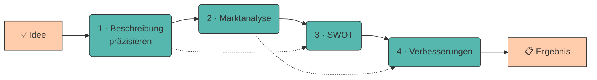

# 7. Prompt Chaining

Komplexe Aufgaben lassen sich selten in einem einzigen Prompt lösen. Beim **Prompt Chaining** wird eine Aufgabe in **mehrere aufeinander aufbauende Schritte** zerlegt – das Ergebnis des einen Prompts wird zur Eingabe des nächsten.

Das ist dieselbe Idee wie beim Programmieren: Statt einer Funktion mit 300 Zeilen schreibst du fünf kleine, die du einzeln testen kannst.

---

## Warum ein Prompt oft nicht reicht

!!! quote "Merksatz"

    Ein LLM verteilt seine „Aufmerksamkeit" auf **alles**, was im Prompt steht. Fünf Aufgaben in einem Prompt heißen: jede bekommt ein Fünftel.

Bei einem großen Modell fällt das kaum auf. Bei `qwen2.5:0.5b` sofort:

=== "❌ Alles auf einmal"

    ```title="monolith.txt"
    Analysiere meine Geschäftsidee (Bio-Lieferdienst in Innsbruck),
    erstelle eine Marktanalyse, mache eine SWOT-Analyse und leite daraus
    drei konkrete Verbesserungsvorschläge ab.
    ```

    **Ergebnis:** Alle vier Teile werden angerissen, keiner ausgeführt. Meist bricht das Modell nach der Marktanalyse ab oder wiederholt sich.

=== "✅ Als Kette"

    ```title="kette.txt"
    Schritt 1 → Idee präzise beschreiben
    Schritt 2 → Marktanalyse (nutzt Ergebnis 1)
    Schritt 3 → SWOT (nutzt Ergebnis 1 + 2)
    Schritt 4 → Verbesserungen (nutzt Ergebnis 3)
    ```

    **Ergebnis:** Jeder Schritt bekommt die volle Aufmerksamkeit – und du kannst nach jedem Schritt korrigieren.

---

## Der Workflow



Die gestrichelten Linien zeigen: Manche Schritte brauchen **mehrere** Vorergebnisse.

---

## Vier Vorteile einer Kette

???+ adv "Warum sich der Mehraufwand lohnt"

    1. **Kontrollpunkte** – Nach jedem Schritt kannst du prüfen und korrigieren, statt am Ende alles zu verwerfen.
    2. **Fehler pflanzen sich nicht fort** – Eine falsche Marktanalyse fällt sofort auf, nicht erst im Endergebnis.
    3. **Wiederverwendbarkeit** – Der SWOT-Schritt funktioniert auch für jede andere Idee.
    4. **Kleinere Kontextfenster** – Jeder Prompt braucht nur die Ergebnisse, die er wirklich benötigt ([Kontextfenster](halluzinationen-kontextfenster.md)).

???+ defi "Verwandt, aber nicht dasselbe: Chain-of-Thought"

    Neben dem *Chaining* über mehrere Prompts gibt es **Chain-of-Thought** (Wei et al., 2022): Das Modell wird gebeten, seine Zwischenschritte **innerhalb einer Antwort** auszuformulieren – *„Denke Schritt für Schritt."*

    | | Prompt Chaining | Chain-of-Thought |
    |---|---|---|
    | Wo? | mehrere Prompts | ein einziger Prompt |
    | Kontrolle | du prüfst nach jedem Schritt | keine Zwischenkontrolle |
    | Steuerung | du legst die Schritte fest | das Modell entscheidet selbst |

    !!! warning "Warum das in unserem Labor kaum wirkt"

        Wei et al. zeigen, dass Chain-of-Thought eine **emergente Fähigkeit** ist: Sie tritt erst bei sehr großen Modellen (ab etwa 100 Mrd. Parametern) zuverlässig auf. Bei kleineren Modellen erzeugt „Denke Schritt für Schritt" oft nur *längere*, aber nicht *bessere* Antworten.

        Bei `qwen2.5:0.5b` – 200-mal kleiner – bringt der Zauberspruch also wenig. Das explizite Zerlegen in mehrere Prompts dagegen sehr viel. Genau deshalb ist Chaining unser Werkzeug der Wahl.

???+ disadv "Und die Kosten"

    - **Mehr Aufrufe** = mehr Zeit und (bei kommerziellen Modellen) mehr Geld.
    - **Fehlerfortpflanzung bleibt möglich:** Wenn Schritt 1 halluziniert, baut alles Weitere darauf auf. Deshalb: **Zwischenergebnisse prüfen.**
    - **Mehr Code** als ein einzelner Prompt.

---

## Ketten sauber bauen

???+ process "Die Regeln"

    1. **Ein klares Ergebnis pro Schritt.** Wenn du den Schritt nicht in einem Satz beschreiben kannst, ist er zu groß.
    2. **Strukturierte Zwischenergebnisse.** Jeder Schritt liefert ein [festes Format](strukturierte-ausgaben.md) – dann kann der nächste zuverlässig darauf zugreifen.
    3. **Nur weitergeben, was gebraucht wird.** Nicht die komplette Historie anhängen, sondern gezielt die relevanten Teile.
    4. **Nach jedem Schritt validieren.** Mindestens: Ist die Antwort nicht leer und hat sie das erwartete Format?
    5. **Zwischenergebnisse speichern.** Dann musst du bei einem Fehler in Schritt 4 nicht wieder bei Schritt 1 anfangen.

---

## 🔬 Ollama-Labor

!!! example "Übung 1: Der Monolith"

    Erst der Ein-Prompt-Versuch – damit du siehst, woran er scheitert.

    ```title="Terminal"
    ollama run qwen2.5:0.5b

    >>> """
    ... Idee: Lieferdienst für regionale Bio-Lebensmittel in Innsbruck,
    ... zwei Gründer, 15.000 € Startkapital, Lieferung per Lastenrad.
    ...
    ... Erstelle: (1) eine Marktanalyse, (2) eine SWOT-Analyse und
    ... (3) drei Verbesserungsvorschläge. Antworte auf Deutsch.
    ... """
    ```

    ```title="Beispielausgabe"
    (1) Marktanalyse: Der Markt für Bio-Lebensmittel wächst seit Jahren.
    In Innsbruck gibt es eine umweltbewusste Bevölkerung und mehrere
    Bio-Läden. Die Konkurrenz durch Supermärkte mit eigenem Lieferservice
    ist zu beachten. Auch die Preissensibilität der Kunden spielt eine
    Rolle, ebenso wie saisonale Schwankungen im Angebot regionaler Ware.

    (2) SWOT-Analyse: Stärken sind die Regionalität und die Nachhaltigkeit.
    ```

    Der Text bricht mitten in Teil 2 ab, Teil 3 fehlt ganz. Das ist kein Zufall: Die Antwortlänge ist begrenzt, und der ausführliche Teil 1 hat sie aufgebraucht.

!!! example "Übung 2: Dieselbe Aufgabe als Kette"

    Jetzt in drei Schritten – jeder mit einem klaren Ergebnis und festem Format.

    **Schritt 1 – Markt:**

    ```title="Terminal"
    >>> /clear
    >>> """
    ... Idee: Lieferdienst für regionale Bio-Lebensmittel in Innsbruck,
    ... zwei Gründer, 15.000 € Startkapital, Lastenrad-Zustellung.
    ...
    ... Beschreibe den Zielmarkt in genau 3 Stichpunkten:
    ... - Zielgruppe
    ... - Marktgröße (mit [ANNAHME] kennzeichnen, wenn geschätzt)
    ... - Wichtigster Wettbewerber
    ... Keine Einleitung.
    ... """
    ```

    ```title="Beispielausgabe"
    - Zielgruppe: Berufstätige Haushalte in Innsbruck mit Interesse an
      regionalen Bio-Produkten und wenig Zeit für Einkäufe.
    - Marktgröße: [ANNAHME] rund 15.000 Haushalte im Stadtgebiet kommen
      als Kunden infrage.
    - Wichtigster Wettbewerber: Supermarktketten mit eigenem Lieferservice.
    ```

    **Schritt 2 – SWOT.** Kopiere das Ergebnis aus Schritt 1 in den nächsten Prompt:

    ```title="Terminal"
    >>> /clear
    >>> """
    ... Idee: Lieferdienst für regionale Bio-Lebensmittel in Innsbruck,
    ... zwei Gründer, 15.000 € Startkapital.
    ...
    ... Marktanalyse:
    ... - Zielgruppe: Berufstätige Haushalte in Innsbruck ...
    ... - Marktgröße: [ANNAHME] rund 15.000 Haushalte ...
    ... - Wichtigster Wettbewerber: Supermarktketten mit Lieferservice.
    ...
    ... Erstelle eine SWOT-Analyse. Genau 2 Punkte pro Kategorie.
    ... Format:
    ... STÄRKEN: ...
    ... SCHWÄCHEN: ...
    ... CHANCEN: ...
    ... RISIKEN: ...
    ... """
    ```

    ```title="Beispielausgabe"
    STÄRKEN: Direkter Kontakt zu regionalen Produzenten; emissionsfreie
    Zustellung als glaubwürdiges Verkaufsargument.
    SCHWÄCHEN: Sehr geringe Kapitaldecke; nur zwei Personen für alle Aufgaben.
    CHANCEN: Kooperation mit Bauernmärkten; Abo-Modell für feste Lieferwochen.
    RISIKEN: Preiskampf mit Supermarktketten; Wetterabhängigkeit der
    Lastenrad-Zustellung.
    ```

    **Schritt 3 – Verbesserungen.** Kopiere die SWOT weiter und fordere: *„Leite daraus genau 3 konkrete, sofort umsetzbare Verbesserungsvorschläge ab. Format je Vorschlag: VORSCHLAG &lt;n&gt;: &lt;Titel&gt; / Adressiert: &lt;welche Schwäche&gt; / Erster Schritt: &lt;ein Satz&gt;"*

    **Deine Aufgabe:** Vergleiche das Endergebnis der Kette mit dem Monolith aus Übung 1. Wie viele der drei Teile liefert der Monolith wirklich brauchbar – und wie viele die Kette?

!!! example "Übung 3: Der Kontrollpunkt"

    Der wichtigste Vorteil der Kette: **prüfen, bevor es weitergeht.** Fehlt in der SWOT eine Kategorie, korrigierst du sofort – statt den Fehler in Schritt 3 mitzuschleppen.

    ```title="Terminal"
    >>> In deiner Antwort fehlen die CHANCEN. Gib die vollständige SWOT-Analyse
    ... erneut aus, mit allen vier Kategorien.
    ```

    **Deine Aufgabe:** Führe Schritt 2 fünfmal aus (mit `/clear` dazwischen) und zähle, wie oft alle vier Kategorien vorkommen. Wiederhole das auf `gemma3:270m` – dort wirst du den Kontrollpunkt fast immer brauchen.

??? code "🐍 Optional (Python): die Kette automatisieren"

    Zwischenergebnisse von Hand zu kopieren ist genau die Arbeit, die ein Skript abnimmt:

    ```python title="kette.py"
    from pathlib import Path
    from llm import frage

    IDEE = ("Lieferdienst für regionale Bio-Lebensmittel in Innsbruck, "
            "zwei Gründer, 15.000 € Startkapital, Lastenrad-Zustellung.")

    SCHRITTE = [
        ("markt", "Idee: {start}\n\nBeschreibe den Zielmarkt in genau 3 "
                  "Stichpunkten: Zielgruppe, Marktgröße, Wettbewerber."),
        ("swot",  "Idee: {start}\n\nMarktanalyse:\n{eingabe}\n\nErstelle eine "
                  "SWOT-Analyse. Genau 2 Punkte pro Kategorie.\nFormat:\n"
                  "STÄRKEN: ...\nSCHWÄCHEN: ...\nCHANCEN: ...\nRISIKEN: ..."),
        ("plan",  "SWOT:\n{eingabe}\n\nLeite daraus genau 3 konkrete "
                  "Verbesserungsvorschläge ab."),
    ]


    def kette(schritte, startwert):
        ergebnisse = {}
        eingabe = startwert

        for nummer, (name, vorlage) in enumerate(schritte, start=1):
            print(f"\n{'=' * 55}\nSCHRITT {nummer}/{len(schritte)}: {name}\n{'=' * 55}")

            antwort = frage(vorlage.format(eingabe=eingabe, start=startwert))
            if not antwort.strip():
                raise RuntimeError(f"Schritt '{name}' lieferte nichts zurück.")

            print(antwort)
            ergebnisse[name] = antwort
            eingabe = antwort          # Ergebnis wird Eingabe des nächsten Schritts

            Path(f"kette_{nummer}_{name}.md").write_text(antwort, encoding="utf-8")

        return ergebnisse


    kette(SCHRITTE, IDEE)
    ```

    ```title="Ausgabe (gekürzt)"
    =======================================================
    SCHRITT 1/3: markt
    =======================================================
    - Zielgruppe: Berufstätige Haushalte in Innsbruck ...

    =======================================================
    SCHRITT 2/3: swot
    =======================================================
    STÄRKEN: Direkter Kontakt zu regionalen Produzenten ...

    =======================================================
    SCHRITT 3/3: plan
    =======================================================
    VORSCHLAG 1: Abo-Modell einführen ...
    ```

    Zwei Details lohnen sich zu merken:

    - **`{start}` bleibt in jedem Schritt verfügbar.** Manche Schritte brauchen die Originalidee *und* das letzte Zwischenergebnis – die gestrichelten Pfeile im Diagramm oben.
    - **Zwischenergebnisse landen als Datei auf der Platte.** Scheitert Schritt 3, startest du dort neu, statt die ganze Kette zu wiederholen.

---

???+ question "Selbsttest"

    1. Warum liefert ein Prompt mit vier Teilaufgaben bei kleinen Modellen so schlechte Ergebnisse?
    2. Nenne zwei Vorteile und einen Nachteil des Prompt Chaining.
    3. Warum sollte jeder Kettenschritt ein festes Ausgabeformat haben?

    ??? success "Lösungsskizze"

        1. Weil sich die „Aufmerksamkeit" des Modells auf alle Teile verteilt und die Antwortlänge begrenzt ist. Jede Teilaufgabe bekommt nur einen Bruchteil – meist wird die erste ausgeführt und der Rest angerissen.
        2. **Vorteile:** Kontrollpunkte nach jedem Schritt, wiederverwendbare Bausteine, kleinere Kontextfenster. **Nachteil:** mehr Aufrufe (Zeit/Kosten), und ein Fehler in Schritt 1 pflanzt sich fort, wenn man nicht prüft.
        3. Damit der nächste Schritt zuverlässig auf das Ergebnis zugreifen kann. Bei Fließtext musst du raten, wo die relevante Information steht – bei `STÄRKEN: …` nicht.

---

!!! example "Lab"

    **Idee → Marktanalyse → SWOT → Verbesserungsvorschläge**

    Baue eine Prompt-Kette auf, die deine Geschäftsidee schrittweise verarbeitet: von der Idee über die Marktanalyse und eine SWOT-Analyse bis hin zu konkreten Verbesserungsvorschlägen.

    **Konkrete Schritte:**

    1. Zeichne deine Kette zuerst **auf Papier**: Welche Schritte, welche Ein- und Ausgaben?
    2. Arbeite sie im Terminal ab und speichere jedes Zwischenergebnis in einer eigenen Datei (`kette_1_markt.md`, `kette_2_swot.md`, …).
    3. Setze mindestens einen **Kontrollpunkt** ein (Übung 3): Prüfe ein Zwischenergebnis auf Vollständigkeit, bevor du weitergehst.
    4. Lass die komplette Kette einmal auf `qwen2.5:0.5b` und einmal auf `llama3.2:1b` laufen. Wo ist der Unterschied am größten – am Anfang oder am Ende der Kette?
    5. Notiere alle Kettenschritte in `prompts.md` unter `## 05 Kette`.

---

## Quellen

!!! info "Literatur"

    - **Wu, T., Terry, M. & Cai, C. J. (2022):** *AI Chains: Transparent and Controllable Human-AI Interaction by Chaining Large Language Model Prompts.* CHI '22. [https://doi.org/10.1145/3491102.3517582](https://doi.org/10.1145/3491102.3517582) · arXiv:2110.01691
      → das namensgebende Paper. In einer Studie mit 20 Personen verbesserte Chaining nicht nur die Ergebnisqualität, sondern vor allem **Transparenz und Steuerbarkeit** – die Kontrollpunkte aus Übung 3.
    - **Wei, J., Wang, X., Schuurmans, D. et al. (2022):** *Chain-of-Thought Prompting Elicits Reasoning in Large Language Models.* arXiv:2201.11903. [https://arxiv.org/abs/2201.11903](https://arxiv.org/abs/2201.11903)
      → der verwandte Ansatz **innerhalb** eines Prompts (siehe Kasten oben). Wichtig für uns: Der Effekt tritt erst ab etwa 100 Mrd. Parametern zuverlässig auf – bei unseren Modellen also nicht.
    - **Schulhoff, S., Ilie, M., Balepur, N. et al. (2024):** *The Prompt Report: A Systematic Survey of Prompt Engineering Techniques.* arXiv:2406.06608. [https://arxiv.org/abs/2406.06608](https://arxiv.org/abs/2406.06608)

    Zur Ausarbeitung wurden generative Tools unterstützend eingesetzt.
