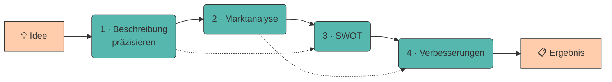

# 7. Prompt Chaining

Komplexe Aufgaben lassen sich selten in einem einzigen Prompt lösen. Beim **Prompt Chaining** wird eine Aufgabe in **mehrere aufeinander aufbauende Schritte** zerlegt – das Ergebnis des einen Prompts wird zur Eingabe des nächsten.

Das ist dieselbe Idee wie beim Programmieren: Statt einer Funktion mit 300 Zeilen schreibst du fünf kleine, die du einzeln testen kannst.

---

## Warum ein Prompt oft nicht reicht

!!! quote "Merksatz"

    Ein LLM verteilt seine „Aufmerksamkeit" auf **alles**, was im Prompt steht. Fünf Aufgaben in einem Prompt heißen: jede bekommt ein Fünftel.

Bei einem großen Modell fällt das kaum auf. Bei `qwen2.5:0.5b` sofort:

=== "❌ Alles auf einmal"

    ```title="monolith.txt"
    Analysiere meine Geschäftsidee (Bio-Lieferdienst in Innsbruck),
    erstelle eine Marktanalyse, mache eine SWOT-Analyse und leite daraus
    drei konkrete Verbesserungsvorschläge ab.
    ```

    **Ergebnis:** Alle vier Teile werden angerissen, keiner ausgeführt. Meist bricht das Modell nach der Marktanalyse ab oder wiederholt sich.

=== "✅ Als Kette"

    ```title="kette.txt"
    Schritt 1 → Idee präzise beschreiben
    Schritt 2 → Marktanalyse (nutzt Ergebnis 1)
    Schritt 3 → SWOT (nutzt Ergebnis 1 + 2)
    Schritt 4 → Verbesserungen (nutzt Ergebnis 3)
    ```

    **Ergebnis:** Jeder Schritt bekommt die volle Aufmerksamkeit – und du kannst nach jedem Schritt korrigieren.

---

## Der Workflow



Die gestrichelten Linien zeigen: Manche Schritte brauchen **mehrere** Vorergebnisse.

---

## Vier Vorteile einer Kette

???+ adv "Warum sich der Mehraufwand lohnt"

    1. **Kontrollpunkte** – Nach jedem Schritt kannst du prüfen und korrigieren, statt am Ende alles zu verwerfen.
    2. **Fehler pflanzen sich nicht fort** – Eine falsche Marktanalyse fällt sofort auf, nicht erst im Endergebnis.
    3. **Wiederverwendbarkeit** – Der SWOT-Schritt funktioniert auch für jede andere Idee.
    4. **Kleinere Kontextfenster** – Jeder Prompt braucht nur die Ergebnisse, die er wirklich benötigt ([Kontextfenster](halluzinationen-kontextfenster.md)).

???+ disadv "Und die Kosten"

    - **Mehr Aufrufe** = mehr Zeit und (bei kommerziellen Modellen) mehr Geld.
    - **Fehlerfortpflanzung bleibt möglich:** Wenn Schritt 1 halluziniert, baut alles Weitere darauf auf. Deshalb: **Zwischenergebnisse prüfen.**
    - **Mehr Code** als ein einzelner Prompt.

---

## Ketten sauber bauen

???+ process "Die Regeln"

    1. **Ein klares Ergebnis pro Schritt.** Wenn du den Schritt nicht in einem Satz beschreiben kannst, ist er zu groß.
    2. **Strukturierte Zwischenergebnisse.** Jeder Schritt liefert ein [festes Format](strukturierte-ausgaben.md) – dann kann der nächste zuverlässig darauf zugreifen.
    3. **Nur weitergeben, was gebraucht wird.** Nicht die komplette Historie anhängen, sondern gezielt die relevanten Teile.
    4. **Nach jedem Schritt validieren.** Mindestens: Ist die Antwort nicht leer und hat sie das erwartete Format?
    5. **Zwischenergebnisse speichern.** Dann musst du bei einem Fehler in Schritt 4 nicht wieder bei Schritt 1 anfangen.

---

## 🔬 Ollama-Labor

!!! example "Übung 1: Monolith vs. Kette"

    Der direkte Vergleich – erst der Ein-Prompt-Versuch, dann die Kette.

    ```python title="monolith_vs_kette.py"
    from llm import frage

    IDEE = ("Lieferdienst für regionale Bio-Lebensmittel in Innsbruck, "
            "zwei Gründer, 15.000 € Startkapital, Lieferung per Lastenrad.")

    # --- Variante A: alles in einem Prompt ---
    print("=" * 60, "\nMONOLITH\n", "=" * 60)
    print(frage(f"""Idee: {IDEE}

    Erstelle: (1) eine Marktanalyse, (2) eine SWOT-Analyse und
    (3) drei Verbesserungsvorschläge. Antworte auf Deutsch."""))

    # --- Variante B: als Kette ---
    print("\n\n", "=" * 60, "\nKETTE\n", "=" * 60)

    markt = frage(f"""Idee: {IDEE}

    Beschreibe den Zielmarkt in genau 3 Stichpunkten:
    - Zielgruppe
    - Marktgröße (mit [ANNAHME] kennzeichnen, wenn geschätzt)
    - Wichtigster Wettbewerber
    Keine Einleitung.""")
    print(f"\n--- SCHRITT 1: MARKT ---\n{markt}")

    swot = frage(f"""Idee: {IDEE}

    Marktanalyse:
    {markt}

    Erstelle eine SWOT-Analyse. Genau 2 Punkte pro Kategorie.
    Format:
    STÄRKEN: ...
    SCHWÄCHEN: ...
    CHANCEN: ...
    RISIKEN: ...""")
    print(f"\n--- SCHRITT 2: SWOT ---\n{swot}")

    verbesserungen = frage(f"""SWOT-Analyse:
    {swot}

    Leite daraus genau 3 konkrete, sofort umsetzbare Verbesserungsvorschläge ab.
    Format je Vorschlag:
    VORSCHLAG <n>: <Titel>
    Adressiert: <welche Schwäche oder welches Risiko>
    Erster Schritt: <ein Satz>""")
    print(f"\n--- SCHRITT 3: VERBESSERUNGEN ---\n{verbesserungen}")
    ```

    **Deine Aufgabe:** Bewerte beide Varianten nach Vollständigkeit und Konkretheit. Wie viele der drei Teile liefert der Monolith wirklich brauchbar?

!!! example "Übung 2: Der Kontrollpunkt"

    Der wichtigste Vorteil der Kette – **prüfen, bevor es weitergeht**.

    ```python title="kontrollpunkt.py"
    from llm import frage

    def schritt_mit_pruefung(prompt, pflichtwoerter, versuche=3):
        """Wiederholt den Prompt, bis alle Pflichtwörter vorkommen."""
        for versuch in range(1, versuche + 1):
            antwort = frage(prompt, seed=versuch)
            fehlend = [w for w in pflichtwoerter
                       if w.lower() not in antwort.lower()]
            if not fehlend:
                print(f"✅ Versuch {versuch}: vollständig")
                return antwort
            print(f"⚠️  Versuch {versuch}: fehlt {fehlend}")
            prompt += f"\n\nWICHTIG: Du musst auch {', '.join(fehlend)} nennen."
        print("❌ Nach 3 Versuchen unvollständig – bitte Prompt überarbeiten.")
        return antwort

    swot = schritt_mit_pruefung(
        """Erstelle eine SWOT-Analyse für einen Bio-Lieferdienst in Innsbruck.
    Format:
    STÄRKEN: ...
    SCHWÄCHEN: ...
    CHANCEN: ...
    RISIKEN: ...""",
        pflichtwoerter=["STÄRKEN", "SCHWÄCHEN", "CHANCEN", "RISIKEN"],
    )
    print(f"\n{swot}")
    ```

    **Beobachte:** Wie oft muss nachgebessert werden? Vergleiche `qwen2.5:0.5b` mit `gemma3:270m` – bei letzterem greift der Kontrollpunkt fast immer.

??? question "Übung 3: Wiederverwendbare Kette (Python)"

    Baue eine generische `kette()`-Funktion, die eine Liste von Schritten abarbeitet und Zwischenergebnisse durchreicht.

    ```python title="kette.py"
    from llm import frage

    def kette(schritte, startwert):
        """
        schritte : list[tuple[str, str]] – Paare (name, prompt_vorlage)
                   Die Vorlage darf {eingabe} und {start} enthalten.
        startwert: str – die ursprüngliche Eingabe (z. B. die Geschäftsidee)

        Gibt ein dict {name: ergebnis} zurück.
        """
        # TODO 1: über die Schritte iterieren
        # TODO 2: Vorlage mit dem vorherigen Ergebnis füllen
        # TODO 3: Ergebnis speichern und als Eingabe für den nächsten Schritt nutzen
        ...

    SCHRITTE = [
        ("markt", "Idee: {start}\n\nBeschreibe den Zielmarkt in 3 Stichpunkten."),
        ("swot",  "Idee: {start}\nMarkt:\n{eingabe}\n\nErstelle eine SWOT-Analyse."),
        ("plan",  "SWOT:\n{eingabe}\n\nNenne 3 Verbesserungsvorschläge."),
    ]
    ```

    ??? success "Lösungsvorschlag"

        ```python title="kette.py"
        from llm import frage
        from pathlib import Path

        def kette(schritte, startwert, speichern=True):
            ergebnisse = {}
            eingabe = startwert

            for nummer, (name, vorlage) in enumerate(schritte, start=1):
                print(f"\n{'=' * 55}")
                print(f"SCHRITT {nummer}/{len(schritte)}: {name}")
                print("=" * 55)

                prompt = vorlage.format(eingabe=eingabe, start=startwert)
                antwort = frage(prompt)

                if not antwort.strip():
                    raise RuntimeError(f"Schritt '{name}' lieferte nichts zurück.")

                print(antwort)
                ergebnisse[name] = antwort
                eingabe = antwort          # Ergebnis wird Eingabe des nächsten Schritts

                if speichern:
                    Path(f"kette_{nummer}_{name}.md").write_text(
                        antwort, encoding="utf-8")

            return ergebnisse
        ```

        Zwei Details lohnen sich zu merken:

        - **`{start}` bleibt immer verfügbar.** Manche Schritte brauchen die Originalidee *und* das letzte Zwischenergebnis – die gestrichelten Pfeile im Diagramm oben.
        - **Zwischenergebnisse werden als Datei gespeichert.** Wenn Schritt 4 scheitert, kannst du dort weitermachen, statt die ganze Kette neu zu starten.

---

???+ question "Selbsttest"

    1. Warum liefert ein Prompt mit vier Teilaufgaben bei kleinen Modellen so schlechte Ergebnisse?
    2. Nenne zwei Vorteile und einen Nachteil des Prompt Chaining.
    3. Warum sollte jeder Kettenschritt ein festes Ausgabeformat haben?

    ??? success "Lösungsskizze"

        1. Weil sich die „Aufmerksamkeit" des Modells auf alle Teile verteilt und die Antwortlänge begrenzt ist. Jede Teilaufgabe bekommt nur einen Bruchteil – meist wird die erste ausgeführt und der Rest angerissen.
        2. **Vorteile:** Kontrollpunkte nach jedem Schritt, wiederverwendbare Bausteine, kleinere Kontextfenster. **Nachteil:** mehr Aufrufe (Zeit/Kosten), und ein Fehler in Schritt 1 pflanzt sich fort, wenn man nicht prüft.
        3. Damit der nächste Schritt zuverlässig auf das Ergebnis zugreifen kann. Bei Fließtext musst du raten, wo die relevante Information steht – bei `STÄRKEN: …` nicht.

---

!!! example "Lab"

    **Idee → Marktanalyse → SWOT → Verbesserungsvorschläge**

    Baue eine Prompt-Kette auf, die deine Geschäftsidee schrittweise verarbeitet: von der Idee über die Marktanalyse und eine SWOT-Analyse bis hin zu konkreten Verbesserungsvorschlägen.

    **Konkrete Schritte:**

    1. Zeichne deine Kette zuerst **auf Papier**: Welche Schritte, welche Ein- und Ausgaben?
    2. Implementiere sie mit der `kette()`-Funktion aus Übung 3.
    3. Baue in mindestens einen Schritt einen **Kontrollpunkt** ein (Übung 2).
    4. Lass die komplette Kette einmal auf `qwen2.5:0.5b` und einmal auf `llama3.2:1b` laufen. Wo ist der Unterschied am größten – am Anfang oder am Ende der Kette?
    5. Speichere die Kettendefinition als `prompts/05_kette.py`.

---

## Quellen

!!! info "Literatur"

    - **Wu, T. et al. (2022):** *AI Chains: Transparent and Controllable Human-AI Interaction by Chaining Large Language Model Prompts.* arXiv:2110.01691. [https://arxiv.org/abs/2110.01691](https://arxiv.org/abs/2110.01691)
    - **Anthropic (2025):** *Chain complex prompts for stronger performance.* [https://docs.anthropic.com/en/docs/build-with-claude/prompt-engineering/chain-prompts](https://docs.anthropic.com/en/docs/build-with-claude/prompt-engineering/chain-prompts)

    Zur Ausarbeitung wurden generative Tools unterstützend eingesetzt.
